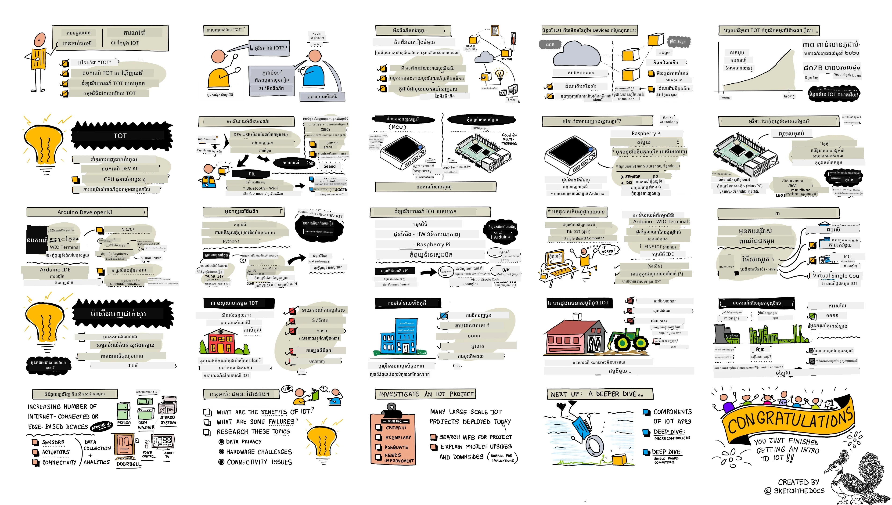

# ការណែនាំទៅកាន់ IoT

> រូបថតសង្ខេបដោយ [Nitya Narasimhan](https://github.com/nitya)។ ចុចលើរូបភាពសម្រាប់មើលរូបភាពធំជាងនេះ។

មេរៀននេះត្រូវបានបង្រៀនជាផ្នែកមួយនៃស៊េរី [Hello IoT](https://youtube.com/playlist?list=PLmsFUfdnGr3xRts0TIwyaHyQuHaNQcb6-) ពី [Microsoft Reactor](https://developer.microsoft.com/reactor/?WT.mc_id=academic-17441-jabenn)។ មេរៀនត្រូវបានបង្រៀនជាវីដេអូ 2 ផ្សេងគ្នា - មេរៀន 1 ម៉ោង និងម៉ោងធ្វើការនៅការិយាល័យ 1 ម៉ោង ស្វែងយល់ជ្រាបជ្រាលជ្រៅអំពីផ្នែកនៃមេរៀន និងឆ្លើយសំណួរ។

> 🎥 ចុចលើរូបភាពខាងលើដើម្បីមើលវីដេអូ។

## សំនួរប្រឡងមុនមេរៀន

[សំនួរប្រឡងមុនមេរៀន](https://black-meadow-040d15503.1.azurestaticapps.net/quiz/1)

## ការណែនាំ

មេរៀននេះគ្របដណ្តប់លើប្រធានបទផ្នែកបឋមអំពីអ៊ីនធឺណិតនៃវត្ថុ (Internet of Things) ហើយជួយអ្នកក្នុងការតំឡើងប្រព័ន្ធឧបករណ៍របស់អ្នក។

ក្នុងមេរៀននេះ យើងនឹងគ្របដណ្តប់៖

* [អ៊ីនធឺណិតនៃវត្ថុគឺជាអ្វី?](#អ៊ីនធឺណិតនៃវត្ថុគឺជាអ្វី)
* [ឧបករណ៍ IoT](#ឧបករណ៍-iot)
* [តំឡើងឧបករណ៍របស់អ្នក](#តំឡើងឧបករណ៍របស់អ្នក)
* [កម្មវិធីប្រើប្រាស់របស់ IoT](#ការដាក់ពាក្យប្រើប្រាស់របស់-iot)
* [ឧទាហរណ៍នៃឧបករណ៍ IoT ដែលអ្នកអាចមាននៅជុំវិញអ្នក](#ឧទាហរណ៍នៃឧបករណ៍-iot-ដែលអ្នកអាចមាននៅជុំវិញអ្នក)

## អ៊ីនធឺណិតនៃវត្ថុគឺជាអ្វី?

ពាក្យ 'Internet of Things' ត្រូវបានបង្កើតឡើងដោយ [Kevin Ashton](https://wikipedia.org/wiki/Kevin_Ashton) នៅឆ្នាំ 1999 ដើម្បីយោងទៅកាន់ការតភ្ជាប់អ៊ីនធឺណិតទៅកាន់ពិភពបច្ចេកទេសតាមរយៈឧបករណ៍សម្គាល់ (sensors)។ ចាប់តាំងពីពេលនោះ ម.termនេះត្រូវបានប្រើសម្រាប់លើកយកឧបករណ៍ណាមួយដែលមានប្រតិបត្តិការជាមួយពិភពបរិយាកាសជុំវិញវា មិនថាជាការប្រមូលទិន្នន័យពីឧបករណ៍សម្គាល់ ឬផ្តល់នូវការប៉ះពាល់នាពិភពផ្ទាល់តាមរយៈឧបករណ៍បញ្ចូលសកម្ម (actuators) (ឧបករណ៍ដែលអាចធ្វើអ្វីមួយដូចជា បើកប៊ូតុងឬភ្លើង LED) ដែលភ្ជាប់ជាមួយឧបករណ៍ផ្សេងទៀត ឬអ៊ីនធឺណិត។

> **ឧបករណ៍សម្គាល់** ប្រមូលព័ត៌មានពីពិភពជុំវិញ ដូចជា វាស់ល្បឿន អាកាសធាតុ ឬទីតាំង។
>
> **ឧបករណ៍បញ្ចូលសកម្ម** បម្លែងសញ្ញាគ្រឿងអគ្គិសនីទៅជាការប៉ះពាល់ពិភពផ្ទាល់ដូចជា បើកប៊ូតុង បើកភ្លើង បង្កើតសំឡេង ឬផ្ញើសញ្ញាពីការត្រួតពិនិត្យទៅឧបករណ៍ផ្សេងៗ ដូចជា បើកប្រអប់ភ្លើង។

IoT ជាតំបន់បច្ចេកវិទ្យារីកចម្រើនលឿនមិនមែនមានតែឧបករណ៍ថែមទៀតទេ - វាក៏រួមបញ្ចូលសេវាកម្មនៅលើពពកដែលអាចដំណើរការទិន្នន័យពីឧបករណ៍សម្គាល់ ឬផ្ញើសំណើទៅឧបករណ៍បញ្ចូលសកម្មដែលភ្ជាប់ទៅឧបករណ៍ IoT។ វាក៏រួមបញ្ចូលឧបករណ៍ដែលមិនមានឬមិនចាំបាច់មានការតភ្ជាប់អ៊ីនធឺណិត ដែលភាគច្រើនហៅថាឧបករណ៍គ្រោងកម្ពស់ (edge devices)។ វាជាឧបករណ៍ដែលអាចដំណើរការនិងឆ្លើយតបនឹងទិន្នន័យសម្គាល់បានដោយខ្លួនឯង ជាធម្មតាជាមួយនូវគំរូ AI ដែលបានបណ្តុះបណ្តាលនៅលើពពក។

IoT គឺជាផ្នែកបច្ចេកវិទ្យារហ័សមានការកើនឡើង។ យោងតាមការប៉ាន់ប្រមាណ មុនចប់ឆ្នាំ 2020 មានឧបករណ៍ IoT ប្រហែល 30 ពាន់លានគ្រប់បីនៅក្នុងទូរទស្សន៍អ៊ីនធឺណិត។ មើលទៅអនាគត វាត្រូវបានប៉ាន់ប្រមាណថា នៅឆ្នាំ 2025 ឧបករណ៍ IoT នឹងប្រមូលទិន្នន័យប្រហែល 80 zettabytes ឬ 80 ត្រីលាន gigabytes។ នេះជាទិន្នន័យច្រើនណាស់!

✅ សូមស្រាវជ្រាវបន្តិច៖ តើប៉ុណ្ណាដ្ឋានទិន្នន័យដែលបានបង្កើតដោយឧបករណ៍ IoT ត្រូវបានប្រើប្រាស់ពិតដោយអ្វី ខណៈណាយច្រើនត្រូវបានបោះបង់? ហេតុអ្វីបានជាទិន្នន័យច្រើនត្រូវបានមិនគិត?

ទិន្នន័យនេះជាសោគល់សម្រាប់ភាពជោគជ័យរបស់ IoT។ ដើម្បីក្លាយជាអ្នកអភិវឌ្ឍន៍ IoT ជោគជ័យ អ្នកត្រូវយល់ពីទិន្នន័យដែលត្រូវប្រមួល វិធីសែមប្រមួល វិធីសេចក្តីសម្រេចចិត្តឡើងលើវា និងវិធីប្រើប្រាស់ការសម្រេចចិត្តទាំងនោះដើម្បីការជជែកជាមួយពិភពផ្ទាល់ ប្រសិនបើត្រូវការ។

## ឧបករណ៍ IoT

អក្សរ **T** ក្នុង IoT មានន័យថា **Things** - ឧបករណ៍ដែលអាចធ្វើប្រតិបត្តិការជាមួយពិភពផ្ទាល់ជុំវិញវា មិនថាជាការប្រមូលទិន្នន័យពីឧបករណ៍សម្គាល់ ឬផ្តល់ពហុបែបបទការប៉ះពាល់ពិភពផ្ទាល់តាមរយៈឧបករណ៍បញ្ចូលសកម្ម។

ឧបករណ៍សម្រាប់ការផលិត ឬប្រើប្រាស់ពាណិជ្ជកម្ម ដូចជា ម៉ាស៊ីនតាមដានសមត្ថភាពអ្នកប្រើប្រាស់ ឬកម្មវិធីគ្រប់គ្រងម៉ាស៊ីនឧស្សាហកម្ម ជាឌីហ្សាញផ្ទាល់តាមតម្រូវការ។ ភាគច្រើនប្រើប្រាស់ក្រងពហុចល័តអេឡិចតុង (custom circuit boards) និងប្រព័ន្ធដំណើរការផ្ទាល់ខ្លួន ដើម្បីបំពេញតម្រូវការពិសេស មិនថាជាការតូចតាចគ្របដណ្តបបានលើកដៃ ឬធន់នឹងសីតុណ្ហភាពខ្ពស់ សម្ពាធខ្ពស់ និងកំចាត់កាំរន្ធក្នុងរោងចក្រ។

ជាអ្នកអភិវឌ្ឍន៍ដែលកំពុងរៀនអំពី IoT ឬបង្កើតគំរូឧបករណ៍ អ្នកត្រូវចាប់ផ្តើមជាមួយឈុតឧបករណ៍អភិវឌ្ឍន៍។ ឧបករណ៍ទាំងនេះគឺជាឧបករណ៍ IoT មានគោលបំណងទូទៅដែលធ្វើសម្រាប់អ្នកអភិវឌ្ឍន៍ប្រើប្រាស់ ជាញឹកញាប់មានលក្ខណៈពិសេសដែលត្រូវការពេលប្រើប្រាស់ក្នុងបរិស្ថានផលិត ឧបករណ៍ដែលមិនបានជ្រើសរើសដូចជា ផ្លូវខាងក្រៅសម្រាប់ភ្ជាប់ឧបករណ៍សម្គាល់ ឬឧបករណ៍បញ្ចូលសកម្ម ឧបករណ៍ជួយ debugging ឬធនធានបន្ថែមដែលបន្ថែមការចំណាយមិនចាំបាច់នៅពេលផលិតច្រើន។

ឈុតអភិវឌ្ឍន៍ទាំងនេះភាគច្រើនគឺចែកចេញជា២ប្រភេទគឺ microcontrollers និង single-board computers។ យើងនឹងណែនាំទាំងពីរនៅទីនេះ ហើយនឹងពិភាក្សាជាច្រើនទៀតនៅមេរៀនបន្ទាប់។

> 💁 ទូរស័ព្ទរបស់អ្នក មិនរហូតត្រូវគិតថាជាឧបករណ៍ IoT មានគោលបំណងទូទៅ ដែលមានឧបករណ៍សម្គាល់ និងឧបករណ៍បញ្ចូលសកម្មជាប់ក្នុងម៉ាស៊ីន ហើយកម្មវិធីផ្សេងៗប្រើវា ធ្វើការប្រើប្រាស់ឧបករណ៍សម្គាល់ និងឧបករណ៍បញ្ចូលសកម្មដោយវិធីផ្សេងៗ ជាមួយសេវាកម្មពពកផ្សេងៗ។ អ្នកអាចស្វែងរកមេរៀន IoT មួយចំនួនដែលប្រើកម្មវិធីទូរស័ព្ទជាឧបករណ៍ IoT។

### Microcontrollers

microcontroller (ឬហៅផងជា MCU សំដៅមក microcontroller unit) គឺជាកុំព្យូទ័រប្រភេទតូចមួយ ដែលមាន៖

🧠 មួយឬច្រើនរ៉េណឺ (CPUs) - "ខួរក្បាល" របស់ microcontroller ដែលដំណើរការកម្មវិធីរបស់អ្នក

💾 អង្គចងចាំ (RAM និងអង្គចងចាំកម្មវិធី) - ដែលផ្ទុកកម្មវិធី ទិន្នន័យ និងអថេរ

🔌 ការតភ្ជាប់នូវបញ្ចូល/បញ្ចេញអាចបណ្ដុះបណ្ដាល (programmable input/output (I/O)) - សម្រាប់និយាយជាមួយឧបករណ៍បន្ថែមខាងក្រៅ (បានភ្ជាប់) ដូចជា ឧបករណ៍សម្គាល់ និងឧបករណ៍បញ្ចូលសកម្ម

Microcontrollers ជាឧបករណ៍កុំព្យូទ័រសម្រាប់តំលៃទាបជាមធ្យម ដោយតម្លៃសម្រាប់ microcontrollers គ្រប់គ្នាដែលប្រើក្នុងឧបករណ៍ផ្ទាល់ខ្លួនធ្លាក់ចុះប្រហែល $0.50 ដុល្លារអាមេរិក ហើយឧបករណ៍ខ្លះមានតម្លៃថោកដូចជាប្រាក់$0.03។ ឈុតអភិវឌ្ឍន៍អាចចាប់ផ្តើមតម្លៃ $4 ដុល្លារ ហើយតម្លៃកើនឡើងបើបន្ថែមលក្ខណៈពិសេស។ [Wio Terminal](https://www.seeedstudio.com/Wio-Terminal-p-4509.html) គឺជាឈុតអភិវឌ្ឍ microcontroller មួយពី [Seeed studios](https://www.seeedstudio.com) ដែលមានឧបករណ៍សម្គាល់ ឧបករណ៍បញ្ចូលសកម្ម WiFi និងអេក្រង់ ដែលមានតម្លៃប្រហែល $30។

> 💁 ពេលស្វែងរក microcontroller លើអ៊ីនធឺណិត ប្រយ័ត្នក្នុងការស្វែងរកពាក្យ **MCU** ព្រោះវាអាចនាំឲ្យមានលទ្ធផលជាច្រើន ទាក់ទងទៅនឹង <em>Marvel Cinematic Universe</em> មិនមែន microcontroller ទេ។

Microcontrollers ត្រូវបានរចនាឡើងសម្រាប់ការបង្រៀនបំពេញភារកិច្ចកំណត់ពិសេសម្ខាង មិនដូចជាកុំព្យូទ័រដូច PC ឬ Mac ជាទូទៅ។ លើសពីនេះអ្នកមិនអាចភ្ជាប់បញ្ចូល monitors, គ្រាប់ស្គាល់ និងកណ្តុរ ដើម្បីប្រើវាសម្រាប់ភារកិច្ចទូទៅទេ។ 

ឈុតអភិវឌ្ឍន៍ microcontroller ជាធម្មតានឹងមានឧបករណ៍សម្គាល់ និងឧបករណ៍បញ្ចូលសកម្មលើក្តារផ្ទាល់។ ក្តារញៀនភាគច្រើននឹងមាន LEDs មួយឬច្រើនដែលអ្នកអាចកម្មង់ និងឧបករណ៍មួយចំនួនដូចជាប្លក់ឱ្យភ្ជាប់ឧបករណ៍សម្គាល់ ឬឧបករណ៍បញ្ចូលសកម្ម ជាមួយប្រភេទវត្ថុដែលផលិតដោយកម្មវិធីផ្សេងៗ ឬឧបករណ៍សម្គាល់ម្ដងទៀតដាក់ក្នុងក្តារ (ភាគច្រើនជាឧបករណ៍សម្គាល់ដែលពេញនិយមទៅដូចជា ឧបករណ៍វាស់សីតុណ្ហភាព)។ Microcontrollers មួយចំនួនមានការតភ្ជាប់ខ្សែភ្លើងឥតខ្សែក្នុងខ្លួនដូចជា Bluetooth ឬ WiFi ឬក៏មាន microcontrollers បន្ថែមលើក្តារដើម្បីបន្ថែមការតភ្ជាប់នេះ។

> 💁 Microcontrollers ជាទូទៅរចនាបម្រើដោយភាសា C/C++។

### Single-board computers

កុំព្យូទ័រឈុតតែមួយ (single-board computer) គឺជាឧបករណ៍កុំព្យូទ័រតូចមួយ ដែលមានធាតុទាំងអស់ក្នុងកុំព្យូទ័រពេញលេញរួមនៅលើក្តារតូចតែមួយ។ នេះគឺជាឧបករណ៍ដែលមានលក្ខណៈប្រដាប់ផ្សេងៗជិតស្និតនឹងកុំព្យូទ័រតុ ឬ laptop ឬ Mac, រត់ប្រព័ន្ធប្រតិបត្តិការ ពេញលេញ ប៉ុន្តែតូច ប្រើថាមពលតិច ហើយតម្លៃថោកជាង។

Raspberry Pi គឺជាកុំព្យូទ័រឈុតតែមួយដែលពេញនិយមបំផុត។

ដូចជា microcontroller, single-board computers មាន CPU, អង្គចងចាំ និង pin input/output ប៉ុន្តែមានលក្ខណៈពិសេសបន្ថែមដូចជាចីបក្រាហ្វិច ដែលអនុញ្ញាតឲ្យអ្នកភ្ជាប់ម៉ូនីទ័រ ផ្ទាំងសំឡេង និងព្រិត្តេល USB សម្រាប់ភ្ជាប់គ្រាប់ ស្គាល់កណ្ដុរ និងឧបករណ៍ USB ផ្សេងទៀតដូចជា ម៉ាស៊ីនថតវីដេអូ ឬឧបករណ៍ផ្ទុកខាងក្រៅ។ កម្មវិធីត្រូវបានផ្ទុកលើកាត SD ឬថាសរឹងជាមួយប្រព័ន្ធប្រតិបត្តិការ មិនមែននៅក្នុងជីបអង្គចងចាំរបស់ក្តារផ្ទាល់។

> 🎓 អ្នកអាចគិតថា single-board computer គឺជាជម្រើសតូច កំចាត់ថ្លៃជាង PC ឬ Mac ដែលអ្នកកំពុងអាននេះ ប៉ុន្តែមាន GPIO (pin បញ្ចូល/ចេញគោលបំណងទូទៅ) សម្រាប់អន្តរកម្មជាមួយឧបករណ៍សម្គាល់ និងឧបករណ៍បញ្ចូលសកម្ម។

កុំព្យូទ័រឈុតតែមួយគឺជាកុំព្យូទ័រដែលបានផ្ដល់លក្ខណៈពេញលេញ ហើយអាចកម្មង់ជាមួយភាសាណាមួយបាន។ ឧបករណ៍ IoT ត្រូវបានកម្មង់ជាទូទៅជាមួយភាសា Python។

### ជម្រើសរឹងសម្រាប់មេរៀននៅក្រោយៗ

មេរៀនបន្ទាប់ទាំងអស់រួមបញ្ចូលកិច្ចការចៃដន្យដែលប្រើឧបករណ៍ IoT ដើម្បីប៉ះពាល់ពិភពផ្ទាល់ និងទាក់ទងជាមួយពពក។ មេរៀននីមួយៗគាំទ្រជម្រើសឧបករណ៍ ៣ ប្រភេទ - Arduino (ប្រើ Wio Terminal ពី Seeed Studios) ឬកុំព្យូទ័រឈុតតែមួយ មួយជាឧបករណ៍រឹង (Raspberry Pi 4) ឬកុំព្យូទ័រឈុតតែមួយមួយគ្រាប់វីជ្ជមានដែលរត់លើ PC ឬ Mac ។

អ្នកអាចស្រាវជ្រាវអំពីឧបករណ៍ដែលត្រូវការបំពេញកិច្ចការទាំងអស់នៅក្នុង [មគ្គុទេសក៍រឹង](../../../hardware.md)។

> 💁 អ្នកមិនចាំបាច់ទិញឧបករណ៍ IoT គ្រប់យ៉ាងដើម្បីបំពេញកិច្ចការទេ អ្នកអាចធ្វើបានទាំងអស់ដោយប្រើកុំព្យូទ័រឈុតតែមួយវីជ្ជមាន។

ជម្រើសរឹងដែលអ្នកជ្រើសរើស គឺទៅតាមអ្វីដែលអ្នកមានស្រាប់ ឬនៅផ្ទះ ឬនៅសាលា និងភាសាកម្មង់ដែលអ្នកស្គាល់ ឬមានចេតនាចង់រៀន។ រឹងទាំងពីរដឹងប្រើប្រាស់បរិស្ថានឧបករណ៍សម្គាល់ដូចគ្នា ដូច្នេះបើអ្នកចាប់ផ្តើមពីផ្លូវណាមួយ អ្នកអាចប្ដូរទៅផ្លូវមួយផ្សេង មិនចាំបាច់ប្ដូរ ឧបករណ៍ភាគច្រើនទេ។ កុំព្យូទ័រឈុតតែមួយវីជ្ជមាននឹងជាសមាជិកកន្លែងសិក្សានៅលើ Raspberry Pi ដែលកូដភាគច្រើនអាចផ្ទេរទៅ Pi ប្រសិនបើអ្នកចុងក្រោយមានឧបករណ៍ និងឧបករណ៍សម្គាល់។

### ឈុតអភិវឌ្ឍ Arduino

ប្រសិនបើអ្នកចង់រៀនអភិវឌ្ឍ microcontroller អ្នកអាចបំពេញកិច្ចការដោយប្រើឧបករណ៍ Arduino។ អ្នកត្រូវការយល់ដឹងមូលដ្ឋានរបស់ភាសា C/C++ ពីព្រោះមេរៀននឹងបង្ហាញតែលេខាកូដដែលពាក់ព័ន្ធទៅនឹងស៊ុម Arduino ឧបករណ៍សម្គាល់ និងឧបករណ៍បញ្ចូលសកម្ម ដូចជាបណ្ណាល័យដែលទំនាក់ទំនងទៅពពក។

កិច្ចការនឹងប្រើ [Visual Studio Code](https://code.visualstudio.com/?WT.mc_id=academic-17441-jabenn) ជាមួយនឹង [ពង្រីក PlatformIO សម្រាប់អភិវឌ្ឍ microcontroller](https://platformio.org)។ អ្នកអាចប្រើ Arduino IDE ផង ប្រសិនបើអ្នកមានបទពិសោធន៍ជាមួយឧបករណ៍នេះ ពីព្រោះមិនមានការណែនាំសម្រាប់វា ផ្តល់ជូនឡើងវិញទេ។

### ឈុតអភិវឌ្ឍ single-board computer

ប្រសិនបើអ្នកចង់រៀនអភិវឌ្ឍ IoT ជាមួយកុំព្យូទ័រឈុតតែមួយ អ្នកអាចបំពេញកិច្ចការដោយប្រើ Raspberry Pi ឬឧបករណ៍វីជ្ជមានរត់លើ PC ឬ Mac។

អ្នកត្រូវការយល់ដឹងមូលដ្ឋានភាសា Python ពីព្រោះមេរៀននឹងបង្ហាញតែលេខាកូដដែលពាក់ព័ន្ធទៅនឹងឧបករណ៍សម្គាល់ និងឧបករណ៍បញ្ចូលសកម្ម និងបណ្ណាល័យដែលទំនាក់ទំនងទៅពពក។

> 💁 ប្រសិនបើអ្នកចង់រៀនកូដ Python សូមពិនិត្យមើលស៊េរីវីដេអូពីរខាងក្រោម៖
>
> * [Python សម្រាប់អ្នកចាប់ផ្តើម](https://channel9.msdn.com/Series/Intro-to-Python-Development?WT.mc_id=academic-17441-jabenn)
> * [ Python បន្ថែមសម្រាប់អ្នកចាប់ផ្តើម](https://channel9.msdn.com/Series/More-Python-for-Beginners?WT.mc_id=academic-7372-jabenn)

កិច្ចការនឹងប្រើ [Visual Studio Code](https://code.visualstudio.com/?WT.mc_id=academic-17441-jabenn)។

ប្រសិនបើអ្នកប្រើ Raspberry Pi អ្នកអាចប្រើ Pi ជាមួយនឹងកំណែតុពីក្នុងពេញលេញនៃ Raspberry Pi OS ហើយធ្វើកូដអោយទាំងស្រុងលើ Pi ដោយប្រើ [កំណែ Raspberry Pi OS របស់ VS Code](https://code.visualstudio.com/docs/setup/raspberry-pi?WT.mc_id=academic-17441-jabenn) ឬរត់ Pi ជាឧបករណ៍គ្មានមុខ និងកម្មង់ផ្ទាល់ពី PC ឬ Mac របស់អ្នកដោយប្រើ VS Code ជាមួយនឹង [ពង្រីក Remote SSH](https://code.visualstudio.com/docs/remote/ssh?WT.mc_id=academic-17441-jabenn) ដែលអនុញ្ញាតឲ្យអ្នកភ្ជាប់ទៅ Pi និងកែប្រែលេខា កូដ ដើរកូដ ដូចជាកំពុងកម្មង់លើ Pi ដោយផ្ទាល់។

ប្រសិនបើគូរាជម្រើសឧបករណ៍វីជ្ជមាន អ្នកនឹងកម្មង់លើកុំព្យូទ័រផ្ទាល់។ ជំនួសការចូលប្រើឧបករណ៍សម្គាល់ និងឧបករណ៍បញ្ចូលសកម្ម អ្នកនឹងប្រើឧបករណ៍មួយដើម្បីសម្រួលឧបករណ៍នេះដោយផ្ដល់តម្លៃឧបករណ៍សម្គាល់ដែលអ្នកកំណត់ ហើយបង្ហាញលទ្ឋផលឧបករណ៍បញ្ចូលសកម្មលើអេក្រង់។

## តំឡើងឧបករណ៍របស់អ្នក

មុននឹងចាប់ផ្តើមកម្មង់នូវឧបករណ៍ IoT របស់អ្នក អ្នកត្រូវតែធ្វើការកំណត់តួតំណាងតូចមួយ។ សូមអនុវត្តន៍តាមការណែនាំទាក់ទងទៅឧបករណ៍ដែលអ្នកនឹងប្រើ។

> 💁 ប្រសិនបើអ្នកមិនទាន់មានឧបករណ៍ សូមយោងទៅកាន់ [មគ្គុទេសក៍រឹង](../../../hardware.md) ដើម្បីជួយសំរេចចិត្តថាតើអ្នកនឹងប្រើឧបករណ៍មួយណា និងមានឧបករណ៍បន្ថែមអ្វីដែលត្រូវទិញ។ អ្នកមិនចាំបាច់ទិញឧបករណ៍ទេ ពីព្រោះគម្រោងទាំងអស់អាចដំណើរការលើឧបករណ៍វីជ្ជមានបាន។

ការណែនាំទាំងនេះមានតំណភ្ជាប់ទៅកាន់វិបសាយភាគីទីបី ពីនាក់បង្កើតឧបករណ៍ ឬឧបករណ៍កម្មវិធីដែលអ្នកនឹងប្រើ។ គោលបំណងគឺដើម្បីធានាថាអ្នកអាចប្រើការណែនាំទាន់សម័យបំផុតសម្រាប់ឧបករណ៍ និងឧបករណ៍នេះ។
ធ្វើការរុករកតាមមគ្គុទេសក៍ពាក់ព័ន្ធដើម្បីតម្លើងឧបករណ៍របស់អ្នក និងបញ្ចប់គម្រោង 'Hello World' មួយ។ នេះគឺជជំហានដំបូងក្នុងការបង្កើតអំពូលចាក់ស្រមោលយប់ IoT តាមរយៈមេរៀន ៤ ក្នុងផ្នែកចាប់ផ្តើមនេះ។

* [Arduino - Wio Terminal](wio-terminal.md)
* [កំព្យូទ័រតែមួយផ្ទាល់ - Raspberry Pi](pi.md)
* [កំព្យូទ័រតែមួយផ្ទាល់ - ឧបករណ៍វីរុថល](virtual-device.md)

✅ អ្នកនឹងប្រើ VS Code សម្រាប់ទាំង Arduino និងកំព្យូទ័រតែមួយផ្ទាល់។ ប្រសិនបើអ្នកមិនធ្លាប់ប្រើវាមុននេះទេ សូមអានព័ត៌មានបន្ថែមអំពីវានៅលើ [គេហទំព័រ VS Code](https://code.visualstudio.com?WT.mc_id=academic-17441-jabenn)

## ការដាក់ពាក្យប្រើប្រាស់របស់ IoT

IoT គ្របដណ្តប់លើករណីប្រើប្រាស់ធំជាច្រើន នៅក្នុងក្រុមធំៗខ្លះៗ៖

* IoT សម្រាប់អ្នកប្រើប្រាស់
* IoT ពាណិជ្ជកម្ម
* IoT ឧស្សាហកម្ម
* IoT សំណង់ហេដ្ឋារចនាសម្ព័ន្ធ

✅ សូមធ្វើការស្រាវជ្រាវស្រួលៗ៖ សម្រាប់តំបន់នីមួយៗដែលបានពិពណ៌នាខាងក្រោម សូមស្វែងរកឧទាហរណ៍ជាក់លាក់មួយដែលមិនត្រូវបានផ្តល់ក្នុងអត្ថបទ។

### IoT សម្រាប់អ្នកប្រើប្រាស់

IoT សម្រាប់អ្នកប្រើប្រាស់សំដៅទៅលើឧបករណ៍ IoT ដែលអ្នកប្រើប្រាស់នឹងទិញ និងប្រើនៅជុំវិញផ្ទះ។ ឧបករណ៍ខ្លះៗទាំងនេះមានប្រយោជន៍យ៉ាងខ្លាំង ដូចជា ឧបករណ៍ស្ពីកខឹងថនសម្លេង, ប្រព័ន្ធកំដៅឆ្លាតវៃ និងម៉ាស៊ីនបូមធូលីរ៉ូបូត។ ខ្លះគឺមានភាពសង្ស័យស្ថិតក្នុងប្រយោជន៍ រួមមានគ្រឿងទឹកប្រើបញ្ជាបានដោយសម្លេងដែលបណ្តាលអោយអ្នកមិនអាចបិទវាបាន ព្រោះការគ្រប់គ្រងតាមសម្លេងមិនអាចស្តាប់អ្នកលើសំឡេងទឹកដែលកំពុងហូរបាន។

ឧបករណ៍ IoT សម្រាប់អ្នកប្រើប្រាស់កំពុងបង្ហាញនូវមនុស្សឱ្យសម្រេចបានច្រើនជាងមុនក្នុងបរិយាកាសពួកគេ ជាពិសេសសម្រាប់មនុស្ស ១ ពាន់លានរូប ដែលមានជម្ងឺពិការភាព។ ម៉ាស៊ីនបូមធូលីរ៉ូបូតអាចផ្តល់ជាន់ដល់មនុស្សដែលមានបញ្ហាចលនាដែលមិនអាចបូមធូលីបានដោយខ្លួនឯង កញ្ចប់កំដៅដែលគ្រប់គ្រងដោយសម្លេងអាចអោយមនុស្សដែលមាន ចម្ងាយភ្នែកកម្រិត ឬការគ្រប់គ្រងចលនាលំបាកកំដៅកញ្ចប់ដោយសម្លេងប៉ុណ្ណោះ អ្នកតាមដានសុខភាពអាចអោយអ្នកជំងឺតាមដានសភាពជំងឺរំងាប់ដោយខ្លួនឯង ជាមួយការប្រកាសថ្មីៗដែលមានលម្អិត និងញឹកញាប់ជាងមុន។ ឧបករណ៍ទាំងនេះកំពុងក្លាយជារឿយៗ រហូតដល់ក្មេងតូចៗក៏ប្រើវាជាផ្នែកមួយនៃជីវិតប្រចាំថ្ងៃ រួមមានការសិក្សាវីរុថលក្នុងពេលជំងឺរាតត្បាត COVID ដាក់សីតមួយលើឧបករណ៍ឆ្លាតវៃដើម្បីតាមដានការសិក្សា ឬនាឡិកាបោយជូនការព្រឹត្តិការណ៍ថ្នាក់បន្ទាប់។

✅ តើអ្នកមានឧបករណ៍ IoT សម្រាប់អ្នកប្រើប្រាស់ណាខ្លះទៀតនៅលើខ្លួនឬក្នុងផ្ទះ?

### IoT ពាណិជ្ជកម្ម

IoT ពាណិជ្ជកម្មគ្របដណ្តប់ការប្រើប្រាស់ IoT នៅកន្លែងធ្វើការ។ នៅក្នុងការិយាល័យ អាចមានឧបករណ៍សម្គាល់ការស្នាក់នៅ និងឧបករណ៍ចលនាសម្រាប់គ្រប់គ្រងការបំភ្លឺ និងកំដៅ ដើម្បីបិទភ្លើងនិងកំដៅនៅពេលមិនចាំបាច់ ដែលជួយថយចុះថ្លៃ និងកាត់បន្ថយការបញ្ចេញកាបូន។ នៅក្នុងរោងចក្រ ឧបករណ៍ IoT អាចត្រួតពិនិត្យសុវត្ថិភាពដូចជា បុគ្គលិកមិនពាក់មួកសុវត្ថិភាព ឬសំលេងដែលមានកម្រិតធ្ងន់ធ្ងរ។ នៅស្ដុកទំនិញ ឧបករណ៍ IoT អាចវាស់សីតុណ្ហភាពក្នុងក្ដារសំរាប់គ្រឿងត្រជាក់ ដើម្បីជូនដំណឹងទៅម្ចាស់ហាង ប្រសិនបើទូរទឹកកក ឬទូរទឹកកកមានសីតុណ្ហភាពក្រៅជួរត្រូវការដែលបានកំណត់ ឬគេអាចត្រួតពិនិត្យទំនិញលើឆាករ, ដើម្បីផ្ដល់ទីតាំងដល់និយោជិកសម្រាប់បំពេញទំនិញដែលបានលក់ចេញ។ ឧស្សាហកម្មដឹកជញ្ជូនកំពុងពឹងផ្អែកលើ IoT ជាងមុនសម្រាប់តាមដានទីតាំងយានយន្ត គណនាគន្លងរថយន្តសម្រាប់ការបង់ថ្លៃ ប្រតិបត្តិការរថយន្ត និងការប្រកបតាមម៉ោងបក់ និងការផ្តល់ដំណឹងដល់បុគ្គលិកពេលមានយានយន្តមកដល់ឃ្លាំងសម្រាប់រៀបចំទំនិញ។

✅ តើអ្នកមានឧបករណ៍ IoT ពាណិជ្ជកម្មនៅសាលា ឬកន្លែងធ្វើការរបស់អ្នកទេ?

### IoT ឧស្សាហកម្ម (IIoT)

IoT ឧស្សាហកម្ម ឬ IIoT គឺភាពដែលប្រើប្រាស់ឧបករណ៍ IoT ដើម្បីគ្រប់គ្រង និងគ្រប់គ្រងម៉ាស៊ីនចល័តក្នុងវិស័យធំ។ វាគ្របដណ្តប់លើករណីប្រើប្រាស់ជាច្រើនពីរោងចក្រ ទៅកសិកម្មឌីជីថល។

រោងចក្រ ប្រើឧបករណ៍ IoT ដល់វីធីផ្សេងៗគ្នា។ ម៉ាស៊ីនអាចត្រូវបានតាមដានជាមួយឧបករណ៍សោន័រជាច្រើនដើម្បីតាមដានសីតុណ្ហភាព ការនិយាយកកា និងល្បឿនវង្វង់របស់វា។ ទិន្នន័យនេះអាចត្រូវបានតាមដាន ដើម្បីផ្អាក ម៉ាស៊ីនប្រសិនបើវាហួសកំណត់ព្រំដែន — ឧទាហរណ៍ វារត់កំដៅពេកហើយត្រូវបិទ។ ទិន្នន័យនេះក៏អាចត្រូវបានប្រមូល និងវិភាគក្នុងរយៈពេលវែង សម្រាប់ថែទាំគ្រាប់ក្រោយដោយប្រើម៉ូដែល AI ដែលពិនិត្យទិន្នន័យដែលមកមុនការបរាជ័យ ហើយប្រើវាសម្រាប់ទាយអនាគតចំពោះករណីបរាជ័យផ្សេងទៀតមុនពេលវាបានកើត។

កសិកម្មឌីជីថលមានសារៈសំខាន់ ប្រសិនបើភពផែនដីចង់បម្រើអាហារឱ្យប្រជាជនដែលកំពុងកើនឡើង ជាពិសេសលើមនុស្ស ២ពាន់លានរូប ក្នុង ៥០០ លានផ្ទះសំណាក់ ដែលរស់នៅលើ [ការដាំដុះស៊ីមពីដាច់ខាងខាង](https://wikipedia.org/wiki/Subsistence_agriculture)។ កសិករអាចចាប់ផ្តើមដោយតាមដានសីតុណ្ហភាព និងប្រើប្រាស់ [ថ្ងៃដំណាំកើត](https://wikipedia.org/wiki/Growing_degree-day) ដើម្បីទាយថាតើការដាំដុះអ្វីសម្រេចបានក្នុងពេលណា។ គេអាចភ្ជាប់ការតាមដានសំណើមដីទៅប្រព័ន្ធបាញ់ទឹកស្វ័យប្រវត្តិ ដើម្បីផ្តល់ទឹកត្រឹមត្រូវដល់រុក្ខជាតិរបស់ពួកគេ តែគ្មានទឹកលើសដើម្បីធានារុក្ខជាតិមិនស្ងួតដោយមិនស្ទាក់ទឹក។ កសិករលើកកម្រិតខ្ពស់ ដោយប្រើរោទិ៍ហោះទឹក អ្នកប្រើព័ត៌មានផ្ទាល់ដី និង AI ដើម្បីតាមដានកំណើតដាំដុះ ជំងឺ និងគុណភាពដីលើដីកសិកម្មធំទូលាយ។

✅ តើមានឧបករណ៍ IoT ផ្សេងទៀតណាអាចជួយកសិករបាន?

### IoT សំណង់ហេដ្ឋារចនាសម្ព័ន្ធ

IoT សំណង់ហេដ្ឋារចនាសម្ព័ន្ធគឺការតាមដាន និងគ្រប់គ្រង សំណង់ហេដ្ឋារចនាសម្ព័ន្ធក្នុងតំបន់ និងកម្រិតពិភពលោកដែលមនុស្សប្រើប្រាស់ជារៀងរាល់ថ្ងៃ។

[ទីក្រុងឆ្លាតវៃ](https://wikipedia.org/wiki/Smart_city) គឺជាតំបន់ស៊ីវិលដែលប្រើឧបករណ៍ IoT ដើម្បីប្រមូលទិន្នន័យអំពីទីក្រុង ហើយប្រើវាសម្រាប់ការកែលម្អរបៀបដែលទីក្រុងដំណើរការ។ ទីក្រុងទាំងនេះភាគច្រើនដំណើរការជាមួយដៃគូរវាងរដ្ឋាភិបាលតំបន់ សកលវិទ្យាល័យ និងអាជីវកម្មក្នុងតំបន់ ដើម្បីតាមដាន និងគ្រប់គ្រងអ្វីៗចាប់ពីការដឹកជញ្ជូន ទៅកាន់ចតបាន និងការបំពុល ។ ឧទាហរណ៍ នៅទីក្រុងកូបេុនហេន ប្រទេសឌេនម៉ារគ សំណើមខ្យល់មានសំខាន់សម្រាប់ប្រជាពលរដ្ឋ ដូច្នេះវាត្រូវបានវាស់ និងប្រើទិន្នន័យដើម្បីផ្ដល់ព័ត៌មានអំពីផ្លូវជិះកង់ និងរត់ហាត់ប្រាណមានសំណើមខ្យល់បំផុត។

[បណ្តាញភ្លើងឆ្លាតវៃ](https://wikipedia.org/wiki/Smart_grid) អាចផ្តល់កំណត់ត្រាឌីណាមិចល្អប្រសើរនៃការទាមទារភ្លើងដោយប្រមូលទិន្នន័យប្រើប្រាស់នៅកម្រិតផ្ទះរៀងៗខ្លួន។ ទិន្នន័យនេះអាចណែនាំការសម្រេចចិត្តនៅកម្រិតប្រទេស រួមមានកន្លែងនៃការសាងសង់ស្ថានីយភ្លើងថ្មី និងកម្រិតផ្ទាល់ខ្លួន ដោយផ្ដល់ឲ្យអ្នកប្រើនូវការយល់ដឹងពីចំនួនវ៉ុលដែលប្រើប្រាស់ ពេលវេលាប្រើ និងយោបល់សម្រាប់កាត់បន្ថយថ្លៃដូចជាការចំណាយសាកឡានអគ្គិសនីនៅពេលយប់។

✅ ប្រសិនបើអ្នកអាចដាក់ឧបករណ៍ IoT នៅកន្លែងអ្នករស់ ដើម្បីវាស់វែងអ្វីមួយ អ្វីដែលអ្នកចង់វាស់?

## ឧទាហរណ៍នៃឧបករណ៍ IoT ដែលអ្នកអាចមាននៅជុំវិញអ្នក

អ្នកនឹងពិតជាភ្ញាក់ផ្អើលចំពោះចំនួនឧបករណ៍ IoT ដែលអ្នកមាននៅជុំវិញអ្នក។ ខ្ញុំកំពុងសរសេរនេះពីផ្ទះ ហើយខ្ញុំមានឧបករណ៍ខាងក្រោមភ្ជាប់ទៅអ៊ីនធឺណិត ជាមួយមុខងារឆ្លាតវៃ ដូចជាការត្រួតពិនិត្យតាមកម្មវិធី ការបញ្ជារដោយសម្លេង ឬសមត្ថភាពផ្ញើទិន្នន័យទៅខ្ញុំតាមទូរសព្ទ័៖

* ឧបករណ៍ស្ពីកខឹងថនច្រើនគ្រឿង
* ទូរទឹកកក បូមចាន ឧបករណ៍នំ និងម៉ាញ៉ែវេវ
* ឧបករណ៍តាមដានអគ្គិសនីសម្រាប់ផ្ទៃព្រះអាទិត្យ
* ផ្លុកឆ្លាតវៃ
* កាមេរ៉ាការពារ និងទូរស័ព្ទច្រកទ្វារ​មានវីដេអូ
* ប្រដាប់កម្រិតកំដៅឆ្លាតវៃ ជាមួយឧបករណ៍សំយោគបន្ទប់ច្រើនគ្រឿង
* ឧបករណ៍បើកទ្វាការ៉ាហ្ស
* ប្រព័ន្ធកម្សាន្ដផ្ទះ និងទូរទស្សន៍គ្រប់គ្រងដោយសម្លេង
* សំពត់ភ្លើង
* ឧបករណ៍តាមដានសុខភាព និងការហាត់ប្រាណ

ឧបករណ៍ទាំងនេះទាំងអស់មានឧបករណ៍សែនសំរាប់អារម្មណ៍ និង/ឬឧបករណ៍បញ្ចេញសញ្ញា ហើយនិយាយទៅអ៊ីនធឺណិត។ ខ្ញុំអាចដឹងពីទូរស័ព្ទរបស់ខ្ញុំថាតើទ្វាការ៉ាហ្សរបស់ខ្ញុំបើកឬទេ ហើយសុំឲ្យស្ពីកខឹងថនបិទវាឲ្យខ្ញុំ។ ខ្ញុំអាចកំណត់វានៅម៉ោងដើម្បីបិទវាដោយស្វ័យប្រវត្តិ ប្រសិនបើវាពិតជាបើកនៅយប់។ ពេលទូរស័ព្ទច្រកទ្វាររបស់ខ្ញុំធ្វើការបិទ ខ្ញុំអាចមើលពីទូរស័ព្ទរបស់ខ្ញុំថាមនុស្សណាកំពុងនៅទីនោះ ហើយនិយាយជាមួយពួកគេតាមបាស៊ិកព្រមទាំងមីក្រូហ្វូនរបស់ទូរស័ព្ទ។ ខ្ញុំអាចតាមដានកំនត់ស្ករឈាម ចង្វាក់បេះដូង និងលំនាំអន្លក់ដេក រកលំនាំក្នុងទិន្នន័យសម្រាប់ធ្វើឲ្យសុខភាពរបស់ខ្ញុំប្រសើរឡើង។ ខ្ញុំអាចគ្រប់គ្រងសំពត់ភ្លើងរបស់ខ្ញុំតាមពពក ហើយអាចអង្គុយនៅក្នុងភាពងុងងើចពេលការតភ្ជាប់អ៊ីនធឺណិតរបស់ខ្ញុំបាត់។

---

## 🚀 챌린지

រាយនាមឧបករណ៍ IoT ជាច្រើនដែលអ្នកអាចមាននៅផ្ទះ សាលា ឬកន្លែងធ្វើការរបស់អ្នក — ប្រហែលជាច្រើនជាងដែលអ្នកគិត!

## ប្រលងក្រោយថ្នាក់សិក្សា

[ប្រលងក្រោយថ្នាក់សិក្សា](https://black-meadow-040d15503.1.azurestaticapps.net/quiz/2)

## ការពិនិត្យឡើងវិញ និងអាណាព្យាបាលដោយខ្លួនឯង

អានអំពីអត្ថប្រយោជន៍ និងភាពបរាជ័យរបស់គម្រោង IoT សម្រាប់អ្នកប្រើប្រាស់។ ពិនិត្យគេហទំព័រព័ត៌មានសម្រាប់អត្ថបទអំពីពេលវាបានបរាជ័យ ដូចជា បញ្ហាព័ត៌មានឯកជន បញ្ហាឧបករណ៍ ឬបញ្ហាដែលបណ្តាលមកពីការខ្វះការតភ្ជាប់។

ឧទាហរណ៍មួយចំនួន៖

* ពិនិត្យមើលគណនី Twitter **[Internet of Sh*t](https://twitter.com/internetofshit)** *(ការព្រមានភាសាមិនល្អ)* សម្រាប់ឧទាហរណ៍ល្អៗនៃភាពបរាជ័យក្នុង IoT សម្រាប់អ្នកប្រើប្រាស់។
* [c|net - ម៉ោង Apple របស់ខ្ញុំបានជួយសង្គ្រោះជីវិត: អ្នក ៥ រូបចែករំលែករឿងរបស់ពួកគេ](https://www.cnet.com/news/apple-watch-lifesaving-health-features-read-5-peoples-stories/)
* [c|net - បុគ្គលិក ADT ទទួលសារព័ត៌មានចំពោះការជ្រៀតជ្រែកកាមេរ៉ាជូនអតិថិជនជាឆ្នាំ](https://www.cnet.com/news/adt-home-security-technician-pleads-guilty-to-spying-on-customer-camera-feeds-for-years/) *(ការព្រមាន - ការបង្កត់ថ្លៃដោយមិនសុពលកម្ម)*

## ការផ្ដល់ការងារ

[សាកសួរឧបករណ៍ IoT គម្រោង](assignment.md)

---

<!-- CO-OP TRANSLATOR DISCLAIMER START -->
**ការព្រមាន**៖  
ឯកសារនេះត្រូវបានបកប្រែដោយប្រើសេវាកម្មបកប្រែ AI [Co-op Translator](https://github.com/Azure/co-op-translator)។ ក្នុងខណៈពេលដែលយើងខិតខំបំផុតដើម្បីឲ្យបានភាពត្រឹមត្រូវ សូមយល់ថាការបកប្រែដោយស្វ័យប្រវត្តិក្រោយខ្លះអាចមានកំហុស ឬភាពមិនត្រឹមត្រូវ។ ឯកសារដើមនៅក្នុងភាសាដើមគួរត្រូវបានចាត់ទុកជាថ្នាក់ដំបូងនៃប្រភពទិន្នន័យដែលមានសុពលភាព។ សម្រាប់ព័ត៌មានសំខាន់ៗ យើងណែនាំឲ្យមានការបកប្រែមនុស្សជំនាញវិជ្ជាជីវៈ។ យើងមិនទទួលខុសត្រូវចំពោះការយល់ច្រឡំ ឬការបកប្រែខុសឆ្គងណាមួយដែលកើតមានពីការប្រើប្រាស់ការបកប្រែនេះឡើយ។
<!-- CO-OP TRANSLATOR DISCLAIMER END -->