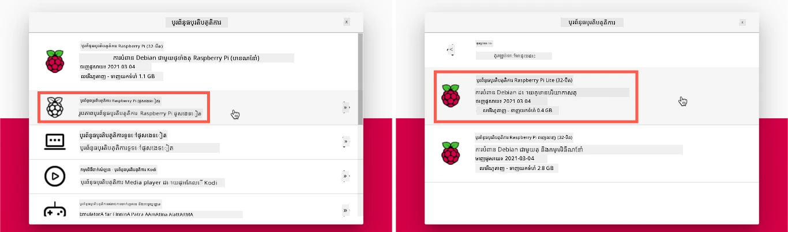
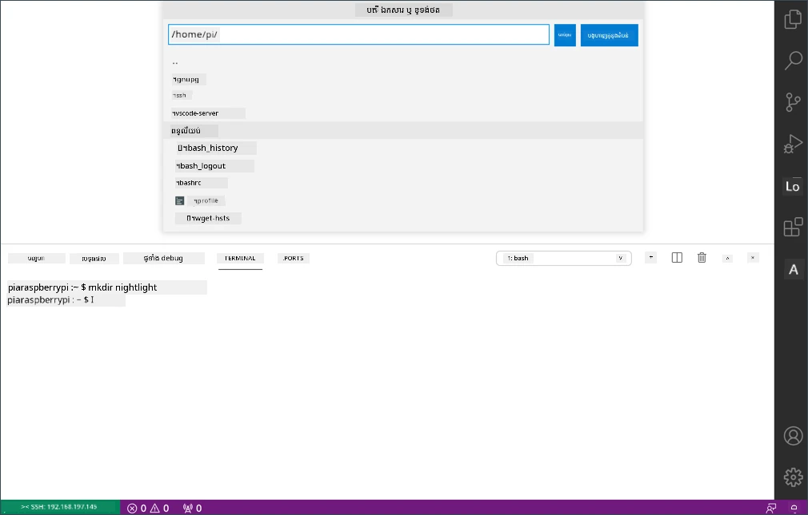

# Raspberry Pi

[Raspberry Pi](https://raspberrypi.org) គឺជាកុំព្យូទ័រប្រភេទsingle-board។ អ្នកអាចបន្ថែមឧបករណ៍សេនស័រនិងអាស៊ីដទ័របានដោយប្រើឧបករណ៍និងប្រព័ន្ធបរិស្ថានច្រើនប្រភេទ ហើយសម្រាប់មេរៀនទាំងនេះ ប្រើប្រព័ន្ធបរិស្ថានរឹង called [Grove](https://www.seeedstudio.com/category/Grove-c-1003.html)។ អ្នកនឹងកូដ Pi របស់អ្នក និងចូលដំណើរការសេនស័រ Grove ដោយប្រើ Python។


## ការតំឡើង

បើអ្នកប្រើ Raspberry Pi ជាជំរើស IoT របស់អ្នក អ្នកមានជម្រើសពីរទី - អ្នកអាចធ្វើការតាមមេរៀនទាំងនេះទាំងអស់ និងកូដដោយផ្ទាល់លើ Pi ឬអ្នកអាចភ្ជាប់ពីចម្ងាយទៅ Pi ដែលគ្មានអេក្រង់ និងកូដពីកំព្យូទ័ររបស់អ្នក។

មុនចាប់ផ្ដើម អ្នកត្រូវភ្ជាប់ Grove Base Hat ទៅ Pi របស់អ្នកផងដែរ។

### បេសកកម្ម - តំឡើង

តំឡើង Grove base hat លើ Pi របស់អ្នក និងកំណត់រចនាសម្ព័ន្ធ Pi

1. ភ្ជាប់ Grove base hat ទៅ Pi របស់អ្នក។ ឈុតភ្លៅនៅលើ hat ត្រូវបានភ្ជាប់លើពាំង GPIO ទាំងអស់នៅលើ Pi ដោយរអិលចុះលើលេខ pin ទាំងអស់ ដើម្បីអង្គុយយ៉ាងរឹងមាំលើមូលដ្ឋាន។ វាអង្គុយលើ Pi ភ្ជាប់វា។

    

1. សម្រាច់ថាអ្នកចង់កម្មវិធី Pi របស់អ្នកយ៉ាងដូចម្តេច ហើយទៅផ្នែកពាក់ព័ន្ធខាងក្រោម:

    * [ធ្វើការផ្ទាល់លើ Pi](#ធ្វើការផ្ទាល់លើ-pi-របស់អ្នក)
    * [ចូលប្រើពីចម្ងាយដើម្បីកូដ Pi](#ចូលប្រើពីចម្ងាយដើម្បីកូដ-pi)

### ធ្វើការផ្ទាល់លើ Pi របស់អ្នក

បើអ្នកចង់ធ្វើការប្រកបផ្ទាល់លើ Pi អ្នកអាចប្រើកំណែ Desktop នៃ Raspberry Pi OS ហើយតំឡើងឧបករណ៍ទាំងអស់ដែលអ្នកត្រូវការ។

#### បេសកកម្ម - ធ្វើការផ្ទាល់លើ Pi របស់អ្នក

ដាក់តំឡើង Pi សម្រាប់អភិវឌ្ឍន៍។

1. អនុវត្តតាមសេចក្ដីណែនាំក្នុង [មគ្គុទេសក៍កំណត់រចនាសម្ព័ន្ធ Raspberry Pi](https://projects.raspberrypi.org/en/projects/raspberry-pi-setting-up) ដើម្បីកំណត់រចនាសម្ព័ន្ធ Pi របស់អ្នក ភ្ជាប់វាទៅកាន់ក្តារចុច/កណ្តុរ/អេក្រង់ ភ្ជាប់វាទៅកាន់បណ្តាញ WiFi រឺអ៊ីធឺណិត ហើយធ្វើឱ្យកម្មវិធីទាន់សម័យ។

ដើម្បីកម្មវិធី Pi ដោយប្រើ Grove sensors និង actuators អ្នកត្រូវតែដំឡើងកម្មវិធីគូរលើកដើម្បីអាចសរសេរកូដឧបករណ៍ ហើយមានបណ្ណាល័យនិងឧបករណ៍ជាច្រើនដែលប្រតិបត្តិការជាមួយរឹង Grove។

1. បន្ទាប់ពី Pi របស់អ្នកបានដំណើរការឡើងវិញ អើព្រីម Terminal ដោយចុចរូបតំណាង **Terminal** នៅមើលបញ្ជីម៉ឺនុយខាងលើ ឬជ្រើស *Menu -> Accessories -> Terminal*

1. រត់ពាក្យបញ្ជាទាំងនេះដើម្បីធានាថាកម្មវិធីប្រតិបត្តិការនិងកម្មវិធីដែលបានដំឡើងទាន់សម័យ៖

    ```sh
    sudo apt update && sudo apt full-upgrade --yes
    ```

1. រត់ពាក្យបញ្ជាទាំងនេះដើម្បីដំឡើងបណ្ណាល័យទាំងអស់ដែលចាំបាច់សម្រាប់រឹង Grove:

    ```sh
    sudo apt install git python3-dev python3-pip --yes

    git clone https://github.com/Seeed-Studio/grove.py
    cd grove.py
    sudo pip3 install .

    sudo raspi-config nonint do_i2c 0
    ```

    វាស្តារដោយដំឡើង Git រួមជាមួយ Pip ដើម្បីដំឡើងកញ្ចប់ Python។

    មុខងារដ៏មានអំណាចមួយនៃ Python គឺភាពអាចដំឡើង [កញ្ចប់ Pip](https://pypi.org) - គឺជាកញ្ចប់កូដដែលសរសេរដោយអ្នកផ្សេង និងបានផ្សាយនៅលើអ៊ីនធឺណិត។ អ្នកអាចដំឡើងកញ្ចប់ Pip មួយនៅលើកុំព្យូទ័ររបស់អ្នកជាមួយពាក្យបញ្ជាមួយ ហើយប្រើកញ្ចប់នោះក្នុងកូដរបស់អ្នក។

    កញ្ចប់ Python Grove របស់ Seeed ត្រូវបានដំឡើងពីប្រភព។ ពាក្យបញ្ជាទាំងនេះនឹងចម្លង repo ដែលមានកូដប្រភពសម្រាប់កញ្ចប់នេះ ហើយដំឡើងវាទៅក្នុងតំបន់ក្នុងមូលដ្ឋាន។

    > 💁 ដើមពីការដំឡើងកញ្ចប់ វានឹងអាចប្រើបានទូទាំងកុំព្យូទ័ររបស់អ្នក ហើយនេះអាចបណ្តាលឲ្យមានបញ្ហាជាមួយព្រៀវរបស់កញ្ចប់ - ដូចជា​កម្មវិធី​មួយ​ផ្អែកលើ​កំណែ​មួយ​នៃ​កញ្ចប់​ដែល​ផាត់​ធ្វើ​ឲ្យ​ខូច​ពេលដែល​អ្នក​ដំឡើង​កំណែ​ថ្មី​សម្រាប់​កម្មវិធី​ផ្សេង​ទៀត។ ដើម្បីដោះស្រាយបញ្ហានេះ អ្នកអាចប្រើ [បរិស្ថាន Python សម្រាប់កីឡាអវត្ដម](https://docs.python.org/3/library/venv.html) ដែលជាការចម្លង Python នៅក្នុងថតផ្ទាល់មួយ និងពេលដែលអ្នកដំឡើងកញ្ចប់ Pip វានឹងត្រូវដំឡើងក្នុងថតនោះតែប៉ុណ្ណោះ។ អ្នកមិនត្រូវប្រើបរិស្ថានវីនុអាល់នៅពេលប្រើ Pi ទេ។ ស្គ្រីបដំឡើង Grove នឹងដំឡើងកញ្ចប់ Python Grove ទាំងមូលនៅលើប្រព័ន្ធ ដូច្នេះដើម្បីប្រើបរិស្ថានវីនុអាល់ អ្នកត្រូវតែបង្កើតវីនុអាល់ហើយដំឡើងកញ្ចប់ Grove ជាថ្មីនៅក្នុងបរិស្ថាននោះ។ វាងាយស្រួលជាងក្នុងការប្រើកញ្ចប់ទូទៅជាវិធីសាស្រ្តពិសេស ពីព្រោះអ្នកអភិវឌ្ឍ Pi ច្រើននឹងដុត SD card ស្អាតសម្រាប់គម្រោងនីមួយៗ។

    ចុងក្រោយ វាអនុញ្ញាតអ៊ីនធ្វែរ I<sup>2</sup>C។

1. ផ្ដើមឡើងវិញ Pi ដោយប្រើម៉ឺនុយ ឬរត់ពាក្យបញ្ជានៅ Terminal ដូចខាងក្រោម៖

    ```sh
    sudo reboot
    ```

1. បន្ទាប់ពី Pi បានរត់ឡើងវិញ ម្ដងទៀតបើក Terminal ហើយរត់ពាក្យបញ្ជាដើម្បីដំឡើង [Visual Studio Code (VS Code)](https://code.visualstudio.com?WT.mc_id=academic-17441-jabenn) - គឺជាយន្តករណ៍សរសេរកូដដែលអ្នកនឹងប្រើសម្រាប់សរសេរកូដឧបករណ៍អ្នកជាមួយ Python ។

    ```sh
    sudo apt install code
    ```

    បន្ទាប់ពីដំឡើងរួច VS Code នឹងមាននៅក្នុងម៉ឺនុយខាងលើ។

    > 💁 អ្នកអាចប្រើ IDE Python ឬកម្មវិធីកែសម្រួលណាមួយសម្រាប់មេរៀនទាំងនេះបាន បើអ្នកមានឧបករណ៍ដែលចូលចិត្ត ប៉ុន្តែមេរៀនទាំងនេះនឹងផ្តល់ការណែនាំផ្អែកលើការប្រើ VS Code។

1. តំឡើង Pylance។ វាជា​កម្មវិធីបន្ថែមសម្រាប់ VS Code ដែលផ្តល់​ជំនួយភាសា Python។ សូមយោងទៅ [ឯកសារកម្មវិធីបន្ថែម Pylance](https://marketplace.visualstudio.com/items?WT.mc_id=academic-17441-jabenn&itemName=ms-python.vscode-pylance) សម្រាប់ការណែនាំពីការដំឡើងកម្មវិធីបន្ថែមនេះនៅក្នុង VS Code។

### ចូលប្រើពីចម្ងាយដើម្បីកូដ Pi

ជំនួសជាការសរសេរកូដដោយផ្ទាល់លើ Pi វាអាចបញ្ចូលជាម៉ូដ 'headless' ដែលគ្មានការភ្ជាប់ក្តារចុច/កណ្តុរ/អេក្រង់ ហើយកំណត់រចនាសម្ព័ន្ធនិងរក់សរសេរកូដពីកុំព្យូទ័ររបស់អ្នក ដោយប្រើ Visual Studio Code។

#### កំណត់រចនាសម្ព័ន្ធ Pi OS

ដើម្បីកូដពីចម្ងាយ Pi OS ត្រូវត្រូវបានដំឡើងលើកាត SD។

##### បេសកកម្ម - កំណត់រចនាសម្ព័ន្ធ Pi OS

កំណត់រចនាសម្ព័ន្ធ headless Pi OS។

1. ទាញយក **Raspberry Pi Imager** ពី [ទំព័រម៉ាស៊ីនផ្សាយរបស់ Raspberry Pi OS](https://www.raspberrypi.org/software/) ហើយដំឡើងវា។

1. ដាក់កាត SD ទៅកុំព្យូទ័ររបស់អ្នក ប្រើស្វយបន្ទុកប្តូរវានៅករណីចាំបាច់។

1. បើក Raspberry Pi Imager

1. នៅក្នុង Raspberry Pi Imager ជ្រើសប៊ូតុង **CHOOSE OS** រួចជ្រើស *Raspberry Pi OS (Other)* បន្ទាប់មកជ្រើស *Raspberry Pi OS Lite (32-bit)*

    

    > 💁 Raspberry Pi OS Lite គឺជាកំណែរបស់ Raspberry Pi OS ដែលគ្មាន UI តុបតែង ឬឧបករណ៍ UI ជាគ្រឿងផ្សេងៗ។ ពួកវា​មិន​ចាំបាច់​សម្រាប់ headless Pi និងធ្វើឲ្យការដំឡើងតូចជាង និងបង្កើតឡើងយ៉ាងលឿនជាង។

1. ជ្រើសប៊ូតុង **CHOOSE STORAGE** រួចជ្រើសកាត SD របស់អ្នក។

1. បើក **Advanced Options** ដោយចុច `Ctrl+Shift+X`។ ជម្រើសទាំងនេះអាចអនុញ្ញាតឲ្យកំណត់រចនាសម្ព័ន្ធជាមុនសម្រាប់ Raspberry Pi OS មុនពេលដំឡើងទៅកាត SD។

    1. ពិនិត្យប្រអប់ **Enable SSH** ហើយកំណត់ពាក្យសម្ងាត់សម្រាប់អ្នកប្រើ `pi`។ នេះជាពាក្យសម្ងាត់ដែលអ្នកនឹងប្រើចូលទៅ Pi បន្ទាប់មក។

    1. ប្រសិនបើអ្នកមានផែនការភ្ជាប់ Pi ជាមួយ WiFi ពិនិត្យប្រអប់ **Configure WiFi** ហើយបញ្ចូល WiFi SSID និងពាក្យសម្ងាត់របស់អ្នក ផងដែរជ្រើសប្រទេសរបស់អ្នកសម្រាប់ WiFi។ អ្នកមិនចាំបាច់ធ្វើចំណោមនេះ ប្រសិនបើអ្នកប្រើខ្សែកាប Ethernet ទេ។ ត្រូវប្រាកដថាបណ្តាញដែលអ្នកភ្ជាប់ទៅគឺដូចគ្នានឹងដែលកុំព្យូទ័ររបស់អ្នកស្ថិតនៅលើ។

    1. ពិនិត្យប្រអប់ **Set locale settings** ហើយកំណត់ប្រទេស និងម៉ោងជាTimezone របស់អ្នក។

    1. ជ្រើសប៊ូតុង **SAVE**

1. ជ្រើសប៊ូតុង **WRITE** ដើម្បីសរសេរកម្មប្រតិបត្តិការ OS ទៅកាត SD។ ប្រសិនបើអ្នកប្រើ macOS អ្នកនឹងត្រូវបានស្នើសុំបញ្ចូលពាក្យសម្ងាត់ ដោយសារឧបករណ៍ក្រោមគ្រប់គ្រងការសរសេររូបភាពភាសារក្នុងថាសដែលត្រូវការចូលដំណើរការសិទ្ធិជាម្ចាស់។

OS នឹងត្រូវបានសរសេរទៅកាត SD ហើយបន្ទាប់ពីបញ្ចប់ កាតនឹងត្រូវបានបញ្ចេញដោយ OS ហើយអ្នកនឹងបានជូនដំណឹង។ ដកកាត SD ពីកុំព្យូទ័រអូររបស់អ្នកដាក់វាទៅ Pi បើកភ្លើង Pi ហើយរង់ចាំប្រមាណរយៈពេល 2នាទីសម្រាប់វាការចាប់ផ្ដើមឡើងវិញបានយ៉ាងត្រឹមត្រូវ។

#### ភ្ជាប់ទៅ Pi

ជំហានបន្ទាប់គឺចូលប្រើ Pi ពីចម្ងាយ។ អ្នកអាចធ្វើបានក្នុងការប្រើ `ssh` ដែលមាននៅលើ macOS, Linux និងកំណែថ្មីនៃ Windows។

##### បេសកកម្ម - ភ្ជាប់ទៅ Pi

ចូលប្រើ Pi ពីចម្ងាយ។

1. បើក Terminal ឬ Command Prompt ហើយបញ្ចូលពាក្យបញ្ជាតាមខាងក្រោមដើម្បីភ្ជាប់ទៅ Pi:

    ```sh
    ssh pi@raspberrypi.local
    ```

    ប្រសិនបើអ្នកប្រើ Windows មានកំណែចាស់មួយដែលមិនមាន `ssh` តម្លើង អ្នកអាចប្រើ OpenSSH។ អ្នកអាចស្វែងរកការណែនាំដំឡើងនៅក្នុង [ឯកសារដំឡើង OpenSSH](https://docs.microsoft.com//windows-server/administration/openssh/openssh_install_firstuse?WT.mc_id=academic-17441-jabenn)។

1. វានឹងភ្ជាប់ទៅ Pi ហើយស្នើសុំពាក្យសម្ងាត់។

    ការស្វែងរកកុំព្យូទ័រនៅលើបណ្តាញរបស់អ្នកដោយប្រើ `<hostname>.local` គឺជារឿងថ្មីមួយសម្រាប់ Linux និង Windows។ ប្រសិនបើអ្នកប្រើ Linux ឬ Windows ហើយទទួលការកំហុសថា Hostname មិនត្រូវបានរកឃើញ អ្នកត្រូវតែដំឡើងកម្មវិធីបន្ថែមដើម្បីអនុញ្ញាតឲ្យធ្វើការបណ្តាញ ZeroConf (ដែល Apple គេស្គាល់ថាជา Bonjour):

    1. បើអ្នកប្រើ Linux ដំឡើង Avahi ដោយប្រើពាក្យបញ្ជាខាងក្រោម:

        ```sh
        sudo apt-get install avahi-daemon
        ```

    1. ប្រសិនបើអ្នកប្រើ Windows វិធីងាយជាងគេលើការអនុញ្ញាត ZeroConf គឺដំឡើង [Bonjour Print Services for Windows](http://support.apple.com/kb/DL999)។ អ្នកអាចដំឡើង [iTunes សម្រាប់ Windows](https://www.apple.com/itunes/download/) ដើម្បីទទួលបានកំណែថ្មីនៃឧបករណ៍នេះ (ដែលមិនមានជាម៉ូឌុលបែក).

    > 💁 ប្រសិនបើអ្នកមិនអាចភ្ជាប់ដោយប្រើ `raspberrypi.local` អ្នកអាចប្រើអាសយដ្ឋាន IP របស់ Pi។ សូមយោងទៅ [ឯកសារអំពីអាសយដ្ឋាន IP Raspberry Pi](https://www.raspberrypi.org/documentation/remote-access/ip-address.md) សម្រាប់ការណែនាំពីវិធីនានាក្នុងការស្វែងរកអាសយដ្ឋាន IP។

1. បញ្ចូលពាក្យសម្ងាត់ដែលអ្នកកំណត់នៅក្នុង Advanced Options របស់ Raspberry Pi Imager

#### កំណត់រចនាសម្ព័ន្ធកម្មវិធីនៅលើ Pi

បន្ទាប់ពីអ្នកភ្ជាប់ទៅ Pi អ្នកត្រូវតែធ្វើឲ្យប្រាកដថាកម្មវិធីប្រតិបត្តិការ OS ទាន់សម័យហើយដំឡើងបណ្ណាល័យនិងឧបករណ៍ផ្សេងៗដែលប្រតិបត្តិការជាមួយរឹង Grove។

##### បេសកកម្ម - កំណត់រចនាសម្ព័ន្ធកម្មវិធីលើ Pi

កំណត់រចនាសម្ព័ន្ធកម្មវិធី Pi ដែលបានដំឡើង និង ដំឡើងបណ្ណាល័យ Grove។

1. ពីសេស្យុង `ssh` របស់អ្នក រត់ពាក្យបញ្ជាតាមដូចខាងក្រោមដើម្បីអាប់ដេតហើយផ្ដើមឡើងវិញ Pi:

    ```sh
    sudo apt update && sudo apt full-upgrade --yes && sudo reboot
    ```

    Pi នឹងត្រូវបានអាប់ដេត និងផ្ដើមឡើងវិញ។ សេស្យុង `ssh` នឹងបញ្ចប់ពេល Pi ផ្ដើមឡើងវិញ ដូច្នេះចាកចេញសម្រាប់ប្រមាណ 30 វិនាទី ហើយភ្ជាប់ឡើងវិញ។

1. ពីសេស្យុង `ssh` ដែលភ្ជាប់ឡើងវិញ រត់ពាក្យបញ្ជាទាំងនេះដើម្បីដំឡើងបណ្ណាល័យទាំងអស់ចាំបាច់សម្រាប់រឹង Grove:

    ```sh
    sudo apt install git python3-dev python3-pip --yes

    git clone https://github.com/Seeed-Studio/grove.py
    cd grove.py
    sudo pip3 install .

    sudo raspi-config nonint do_i2c 0
    ```

    វាស្តារដោយដំឡើង Git រួមជាមួយ Pip ដើម្បីដំឡើងកញ្ចប់ Python។

    មុខងារដ៏មានអំណាចមួយនៃ Python គឺភាពអាចដំឡើង [កញ្ចប់ Pip](https://pypi.org) - គឺជាកញ្ចប់កូដដែលសរសេរដោយអ្នកផ្សេង និងបានផ្សាយនៅលើអ៊ីនធឺណិត។ អ្នកអាចដំឡើងកញ្ចប់ Pip មួយនៅលើកុំព្យូទ័ររបស់អ្នកជាមួយពាក្យបញ្ជាមួយ ហើយប្រើកញ្ចប់នោះក្នុងកូដរបស់អ្នក។

    កញ្ចប់ Python Grove របស់ Seeed ត្រូវបានដំឡើងពីប្រភព។ ពាក្យបញ្ជាទាំងនេះនឹងចម្លង repo ដែលមានកូដប្រភពសម្រាប់កញ្ចប់នេះ ហើយដំឡើងវាទៅក្នុងតំបន់ក្នុងមូលដ្ឋាន។

    > 💁 ដើមពីការដំឡើងកញ្ចប់ វានឹងអាចប្រើបានទូទាំងកុំព្យូទ័ររបស់អ្នក ហើយនេះអាចបណ្តាលឲ្យមានបញ្ហាជាមួយព្រៀវរបស់កញ្ចប់ - ដូចជា​កម្មវិធី​មួយ​ផ្អែកលើ​កំណែ​មួយ​នៃ​កញ្ចប់​ដែល​ផាត់​ធ្វើ​ឲ្យ​ខូច​ពេលដែល​អ្នក​ដំឡើង​កំណែ​ថ្មី​សម្រាប់​កម្មវិធី​ផ្សេង​ទៀត។ ដើម្បីដោះស្រាយបញ្ហានេះ អ្នកអាចប្រើ [បរិស្ថាន Python សម្រាប់កីឡាអវត្ដម](https://docs.python.org/3/library/venv.html) ដែលជាការចម្លង Python នៅក្នុងថតផ្ទាល់មួយ និងពេលដែលអ្នកដំឡើងកញ្ចប់ Pip វានឹងត្រូវដំឡើងក្នុងថតនោះតែប៉ុណ្ណោះ។ អ្នកមិនត្រូវប្រើបរិស្ថានវីនុអាល់នៅពេលប្រើ Pi ទេ។ ស្គ្រីបដំឡើង Grove នឹងដំឡើងកញ្ចប់ Python Grove ទាំងមូលនៅលើប្រព័ន្ធ ដូច្នេះដើម្បីប្រើបរិស្ថានវីនុអាល់ អ្នកត្រូវតែបង្កើតវីនុអាល់ហើយដំឡើងកញ្ចប់ Grove ជាថ្មីនៅក្នុងបរិស្ថាននោះ។ វាងាយស្រួលជាងក្នុងការប្រើកញ្ចប់ទូទៅជាវិធីសាស្រ្តពិសេស ពីព្រោះអ្នកអភិវឌ្ឍ Pi ច្រើននឹងដុត SD card ស្អាតសម្រាប់គម្រោងនីមួយៗ។

    ចុងក្រោយ វាអនុញ្ញាតអ៊ីនធ្វែរ I<sup>2</sup>C។

1. ផ្ដើមឡើងវិញ Pi ដោយរត់ពាក្យបញ្ជាដូចខាងក្រោម៖

    ```sh
    sudo reboot
    ```

    សេស្យុង `ssh` នឹងបញ្ចប់ពេល Pi ផ្ដើមឡើងវិញ។ មិនចាំបាច់ភ្ជាប់ឡើងវិញទេ។

#### កំណត់រចនាសម្ព័ន្ធ VS Code សម្រាប់ចូលប្រើពីចម្ងាយ

បន្ទាប់ពីការកំណត់រចនាសម្ព័ន្ធ Pi រួច អ្នកអាចភ្ជាប់វាទៅដោយប្រើ Visual Studio Code (VS Code) ពីកុំព្យូទ័ររបស់អ្នក - វាជាកម្មវិធីកែសម្រួលអត្ថបទឥតគិតថ្លៃសម្រាប់អ្នកអភិវឌ្ឍដែលអ្នកនឹងប្រើសម្រាប់សរសេរកូដឧបករណ៍ជាមួយ Python។

##### បេសកកម្ម - កំណត់រចនាសម្ព័ន្ធ VS Code សម្រាប់ចូលប្រើពីចម្ងាយ

ដំឡើងកម្មវិធីចាំបាច់ និងភ្ជាប់ពីចម្ងាយទៅ Pi របស់អ្នក។
1. ដំឡើង VS Code លើកុំព្យូទ័ររបស់អ្នកដោយអនុវត្តតាម [ឯកសារ VS Code](https://code.visualstudio.com?WT.mc_id=academic-17441-jabenn)

1. អនុវត្តការណែនាំក្នុង [ឯកសារអភិវឌ្ឍន៍ពីចម្ងាយ VS Code ជាមួយ SSH](https://code.visualstudio.com/docs/remote/ssh?WT.mc_id=academic-17441-jabenn) ដើម្បីដំឡើងបង្គោលដែលត្រូវការ

1. ធ្វើតាមការណែនាំដូចគ្នា ដើម្បីភ្ជាប់ VS Code ទៅកាន់ Pi

1. នៅពេលបានភ្ជាប់រួច សូមអនុវត្តតាមការណែនាំ [ការគ្រប់គ្រងបន្ថែម](https://code.visualstudio.com/docs/remote/ssh#_managing-extensions?WT.mc_id=academic-17441-jabenn) ដើម្បីដំឡើងបន្ថែម [Pylance extension](https://marketplace.visualstudio.com/items?WT.mc_id=academic-17441-jabenn&itemName=ms-python.vscode-pylance) ឆ្ងាយទៅលើ Pi

## សួស្តី​ពិភពលោក

វាជាទំនៀមទម្លាប់ពេលចាប់ផ្តើមជាមួយភាសាកម្មវិធីឬបច្ចេកវិទ្យាថ្មី មួយក្នុងការបង្កើតកម្មវិធី 'សួស្តី​ពិភពលោក' - ជាកម្មវិធីតូចមួយដែលបង្ហាញអ្វីមួយដូចជា `"Hello World"` ដើម្បីបង្ហាញថា​ឧបករណ៍ទាំងអស់​បានកំណត់ត្រឹមត្រូវ។

កម្មវិធី Hello World សម្រាប់ Pi នឹងធានាថាអ្នកបានដំឡើង Python និង Visual Studio Code ត្រឹមត្រូវរួចរាល់។

កម្មវិធីនេះនឹងស្ថិតនៅក្នុងថតឈ្មោះ `nightlight` ហើយវានឹងត្រូវប្រើឡើងវិញជាមួយកូដផ្សេងៗនៅក្នុងផ្នែកបន្ទាប់នៃបេសកកម្មនេះដើម្បីបង្កើតកម្មវិធី nightlight។

### បេសកកម្ម - សួស្តី​ពិភពលោក

បង្កើតកម្មវិធី Hello World។

1. បើក VS Code, មុខងារជាផ្ទាល់លើ Pi ឬលើកុំព្យូទ័ររបស់អ្នក ហើយភ្ជាប់ទៅ Pi ជាមួយបន្ថែម Remote SSH

1. បើក VS Code Terminal ដោយជ្រើស *Terminal -> New Terminal* ឬចុច `` CTRL+` ``។ វានឹងបើកនៅថតផ្ទះអ្នកប្រើប្រាស់ `pi`។

1. ប្រតិបត្តិពាក្យបញ្ជាដូចខាងក្រោម ដើម្បីបង្កើតថតសម្រាប់កូដរបស់អ្នក និងបង្កើតឯកសារ Python ឈ្មោះ `app.py` ខាងក្នុងថតនោះ៖

    ```sh
    mkdir nightlight
    cd nightlight
    touch app.py
    ```

1. បើកថតនេះក្នុង VS Code ដោយជ្រើស *File -> Open...* ហើយជ្រើសថត *nightlight* បន្ទាប់មកជ្រើស **OK**

    

1. បើកឯកសារ `app.py` ពីអ្នកបង្ហាញ VS Code ហើយបន្ថែមកូដដូចខាងក្រោម៖

    ```python
    print('Hello World!')
    ```

    មុខងារ `print` នឹងបោះពុម្ពអ្វីក៏បានដែលផ្ញើទៅវាទៅកាន់ម៉ុងទ័រ។

1. ពី VS Code Terminal ប្រតិបត្តិពាក្យបញ្ជាដូចខាងក្រោមដើម្បីរត់កម្មវិធី Python របស់អ្នក៖

    ```sh
    python app.py
    ```

    > 💁 អ្នកប្រហែលជាត្រូវការហៅ `python3` ដោយច្បាស់ដើម្បីរត់កូដនេះ ប្រសិនបើអ្នកបានដំឡើង Python 2 រួចជាមួយ Python 3 (ជំនាន់ចុងក្រោយ)។ ប្រសិនបើអ្នកមាន Python2 ដំឡើង ហៅ `python` នឹងប្រើ Python 2 ជំនួស Python 3។ តាមលំនាំដើម ចុងក្រោយ Raspberry Pi OS មានតែ Python 3 ប៉ុណ្ណោះ។

    លទ្ធផលបង្ហាញដូចខាងក្រោមនឹងបង្ហាញនៅក្នុង terminal៖

    ```output
    pi@raspberrypi:~/nightlight $ python3 app.py
    Hello World!
    ```

> 💁 អ្នកអាចស្វែងរកកូដនេះនៅក្នុងថត [code/pi](../../../../../1-getting-started/lessons/1-introduction-to-iot/code/pi)។

😀 កម្មវិធី 'Hello World' របស់អ្នកទទួលបានជោគជ័យ!

---

<!-- CO-OP TRANSLATOR DISCLAIMER START -->
**ការព្រមាន**៖  
ឯកសារនេះត្រូវបានបកប្រែដោយប្រើសេវាបកប្រែ AI [Co-op Translator](https://github.com/Azure/co-op-translator)។ ខណៈពេលដែលយើងខិតខំប្រឹងប្រែងដើម្បីបានភាពត្រឹមត្រូវ សូមយល់ថាការបកប្រែដោយស្វ័យប្រវត្តិអាចមានកំហុស ឬភាពមិនត្រឹមត្រូវបានបញ្ចូល។ ឯកសារដើមជាភាសាទីតាំងដើមគួរត្រូវបានចាត់ទុកជាឯកសារដើមសម្រាប់ព័ត៌មាន។ សម្រាប់ព័ត៌មានសំខាន់ៗ សូមអនុញ្ញាតឲ្យប្រើបកប្រែដោយអ្នកជំនាញមនុស្ស។ យើងមិនទទួលខុសត្រូវចំពោះការយល់ច្រឡំ ឬការបកស្រាយខុសៗកើតឡើងពីការប្រើប្រាស់បកប្រែនេះឡើយ។
<!-- CO-OP TRANSLATOR DISCLAIMER END -->