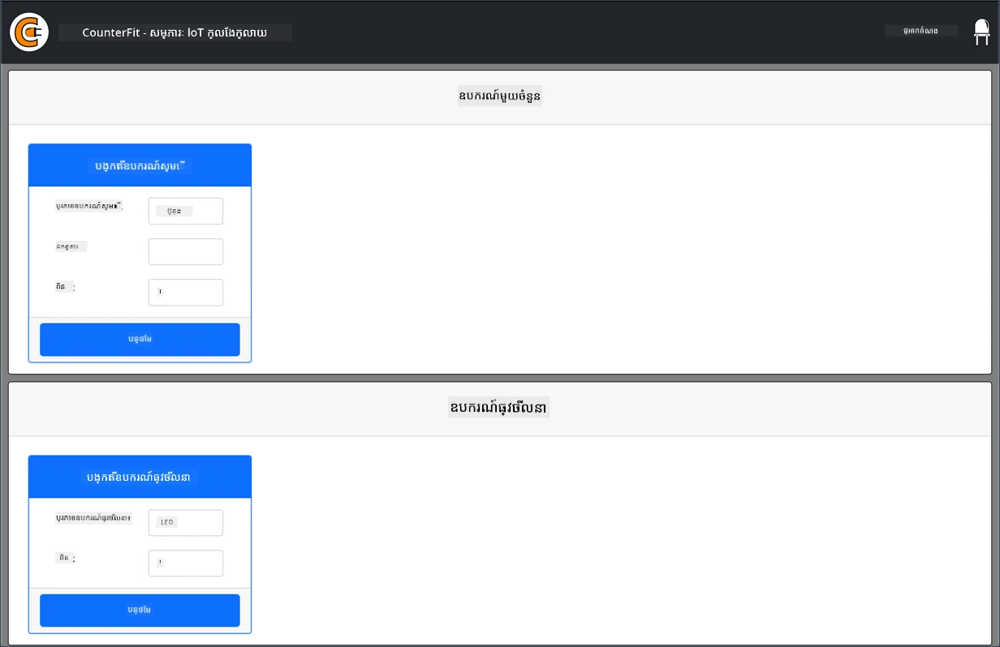
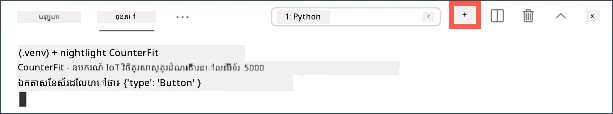
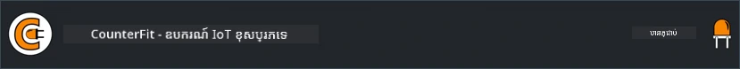

# កុំព្យូទ័រថ្មីមួយក្រុមហ៊ុន

ជំនួសការទិញឧបករណ៍ IoT រួមជាមួយឧបករណ៍ចាប់សញ្ញា និងឧបករណ៍បញ្ចេញសញ្ញា អ្នកអាចប្រើកុំព្យូទ័ររបស់អ្នកក្នុងការស្ទួចឧបករណ៍ IoT ។ គម្រោង [CounterFit](https://github.com/CounterFit-IoT/CounterFit) អនុញ្ញាតឱ្យអ្នករត់កម្មវិធីមួយនៅលើកុំព្យូទ័រពីរមានតែអ្នកដែលច្បាស់លាស់ថាអ្នកកំពុងស្ទួចឧបករណ៍ IoT ដូចជាឧបករណ៍ចាប់សញ្ញា និងឧបករណ៍បញ្ចេញសញ្ញា ហើយអាចចូលប្រើឧបករណ៍ចាប់សញ្ញា និងឧបករណ៍បញ្ចេញសញ្ញាពីកូដ Python នៅក្នុងកុំព្យូទ័រដដែលដែលត្រូវបានសរសេរដូចដដែលនៅលើកូដដែលអ្នកនឹងសរសេរលើ Raspberry Pi ដែលប្រើឧបករណ៍រឹង។

## ការតំឡើង

ដើម្បីប្រើ CounterFit អ្នកត្រូវតែដំឡើងកម្មវិធីឥតគិតថ្លៃមួយចំនួននៅលើកុំព្យូទ័ររបស់អ្នក។

### បេសកកម្ម

ដំឡើងកម្មវិធីដែលត្រូវការទាំងអស់។

1. ដំឡើង Python។ សូមយោងទៅ​កាន់ [ទំព័រទាញយក Python](https://www.python.org/downloads/) សម្រាប់ការណែនាំអំពីការដំឡើង Python កំណែថ្មីបំផុត។

1. ដំឡើង Visual Studio Code (VS Code) ។ នេះគឺជាឧបករណ៍កែសម្រួលដែលអ្នកនឹងប្រើសរសេរកូដឧបករណ៍វីរុសក្នុង Python ។ សូមយោងទៅកាន់ [ឯកសារវិចិត្ររូប VS Code](https://code.visualstudio.com?WT.mc_id=academic-17441-jabenn) សម្រាប់បណ្តោតទាក់ទងនឹងការដំឡើង VS Code ។

    > 💁 អ្នកអាចប្រើ IDE ឬកម្មវិធីកែសម្រួល Python ដដែលសម្រាប់មេរៀនទាំងនេះ ប្រសិនបើអ្នកមានឧបករណ៍ចូលចិត្ត ប៉ុន្តែមេរៀននឹងផ្តល់ណែនាំដោយផ្អែកទៅលើការប្រើ VS Code ។

1. ដំឡើងកម្មវិធីបន្ថែម Pylance របស់ VS Code ។ នេះគឺជាកម្មវិធីបន្ថែមសម្រាប់ VS Code ដែលផ្តល់ការគាំទ្រភាសា Python ។ សូមយោងឯកសារ [Pylance extension](https://marketplace.visualstudio.com/items?WT.mc_id=academic-17441-jabenn&itemName=ms-python.vscode-pylance) សម្រាប់ការណែនាំដំឡើងកម្មវិធីបន្ថែមនេះនៅក្នុង VS Code ។

ការណែនាំដំឡើង និងកំណត់រចនាសម្ព័ន្ធកម្មវិធី CounterFit នឹងផ្តល់នៅពេលដែលសមាជិកនៃការងារត្រូវបានបញ្ជាក់ដោយវាត្រូវបានដំឡើងជាលក្ខណៈគម្រោងមួយ។

## សួស្តីពិភពលោក

វាជារបៀបប្រពៃណីនៅពេលចាប់ផ្តើមជាមួយភាសាកម្មវិធី ឬបច្ចេកវិទ្យាថ្មីមួយ ដើម្បីបង្កើតកម្មវិធី 'Hello World' — កម្មវិធីតូចមួយដែលបង្ហាញអត្ថបទដូចជា `"Hello World"` ដើម្បីបង្ហាញថា ឧបករណ៍ទាំងអស់ត្រូវបានកំណត់ត្រឹមត្រូវ។

កម្មវិធី Hello World សម្រាប់ឧបករណ៍ IoT វីរុសនឹងធានាថាអ្នកបានដំឡើង Python និង Visual Studio Code ត្រឹមត្រូវ។ វានឹងភ្ជាប់ទៅ CounterFit សម្រាប់ឧបករណ៍ IoT ចាប់សញ្ញា និងបញ្ចេញសញ្ញាវីរុស។ វានឹងមិនប្រើឧបករណ៍រឹងណាមួយទេ តែភ្ជាប់ក្នុងការបញ្ជាក់ថាភាគីទាំងអស់កំពុងដំណើរការ។

កម្មវិធីនេះនឹងមានក្នុងថតឈ្មោះ `nightlight` ហើយវានឹងត្រូវបានប្រើជាបន្ត ដោយកូដផ្សេងៗនៅផ្នែកក្រោយនៃបេសកកម្មនេះសម្រាប់បង្កើតកម្មវិធី nightlight ។

### កំណត់បរិស្ថាន Python វីរុសមួយ

មួយក្នុងចំណោមលក្ខណៈដ៏សក្ដិសមនៃ Python គឺសមត្ថភាពក្នុងការដំឡើង [កញ្ចប់ Pip](https://pypi.org) — ស្លាកកញ្ចប់នៃកូដដែលនរណាម្នាក់បានសរសេរ និងផ្សព្វផ្សាយលើអ៊ីនធឺណេត។ អ្នកអាចដំឡើងកញ្ចប់ Pip មួយទៅកុំព្យូទ័ររបស់អ្នកជាមួយពាក្យបញ្ជាមួយ ហើយប្រើកញ្ចប់នោះក្នុងកូដអ្នក។ អ្នកនឹងប្រើ Pip ដើម្បីដំឡើងកញ្ចប់មួយសម្រាប់និយាយទៅកាន់ CounterFit ។

ដោយលំនាំដើមពេលអ្នកដំឡើងកញ្ចប់ វានឹងអាចប្រើបានគ្រប់ទីកន្លែងលើកុំព្យូទ័ររបស់អ្នក ហើយវាអាចបង្ករបញ្ហាជាមួយកំណែកម្មវិធី - ដូចជា កម្មវិធីមួយចាំបាច់ក្នុងការពឹងផ្អែកលើកំណែម្ដងមួយនៃកញ្ចប់ ដែលបង្ករបានកំហុសពេលអ្នកដំឡើងកំណែថ្មីសម្រាប់កម្មវិធីផ្សេងទៀត។ ដើម្បីដោះស្រាយបញ្ហានេះ អ្នកអាចប្រើ [បរិស្ថាន Python វីរុស](https://docs.python.org/3/library/venv.html) ដែលជាអចិន្រ្តៃយ៍ Python មួយដែលត្រូវបានចម្លងទៅក្នុងថតឯកជនមួយ ហើយពេលដែលអ្នកដំឡើងកញ្ចប់ Pip វានឹងត្រូវដំឡើងនៅក្នុងថតនោះតែប៉ុណ្ណោះ។

> 💁 បើអ្នកប្រើ Raspberry Pi អ្នកមិនបានកំណត់បរិស្ថានវីរុសនៅលើឧបករណ៍នោះសម្រាប់គ្រប់គ្រងកញ្ចប់ Pip ទេ ប៉ុន្តែអ្នកកំពុងប្រើកញ្ចប់សកល ដែលកញ្ចប់ Grove ត្រូវបានដំឡើងសកលដោយស្គ្រីបដំឡើង។

#### បេសកកម្ម - កំណត់បរិស្ថាន Python វីរុស

កំណត់បរិស្ថាន Python វីរុសមួយ ហើយដំឡើងកញ្ចប់ Pip សម្រាប់ CounterFit។

1. ពីទ្រីមីនែល ឬបន្ទាត់ពាក្យបញ្ជារបស់អ្នក ប្រតិបត្តិការដូចខាងក្រោមនៅទីតាំងអ្នកចូលចិត្ត ដើម្បីបង្កើត និងចូលទៅក្នុងថតថ្មីមួយ៖

    ```sh
    mkdir nightlight
    cd nightlight
    ```

1. ឥឡូវនេះ ប្រតិបត្តិការដូចខាងក្រោម ដើម្បីបង្កើតបរិស្ថានវីរុសមួយនៅក្នុងថត `.venv`

    ```sh
    python3 -m venv .venv
    ```

    > 💁 អ្នកត្រូវហៅតែ `python3` ដើម្បីបង្កើតបរិស្ថានវីរុស ព្រោះបើអ្នកមាន Python 2 ដំឡើងជាមួយ Python 3 កាល Version ថ្មីបំផុត។ ប្រសិនបើអ្នកមាន Python2 ដំឡើង ហៅ `python` នឹងប្រើ Python 2 ជំនួស Python 3 ។

1. បើកបរិស្ថានវីរុស៖

    * នៅលើ Windows:
        * ប្រសិនបើអ្នកប្រើ Command Prompt ឬ Command Prompt តាមរយៈ Windows Terminal ចូរប្រតិបត្តិការដូចខាងក្រោម៖

            ```cmd
            .venv\Scripts\activate.bat
            ```

        * ប្រសិនបើអ្នកប្រើ PowerShell ចូរប្រតិបត្តិការដូចខាងក្រោម៖

            ```powershell
            .\.venv\Scripts\Activate.ps1
            ```

            > ប្រសិនបើអ្នកមានកំហុសអំពីការបដិសេធបើក script នៅលើប្រព័ន្ធនេះ អ្នកនឹងត្រូវបើក script ដោយកំណត់យុទ្ធសាស្ត្រអនុវត្តឱ្យសមរម្យ។ អ្នកអាចធ្វើនេះដោយបើក PowerShell ជាអ្នកគ្រប់គ្រង ហើយប្រតិបត្តាក់ពាក្យបញ្ជាលើកក្រោម៖

            ```powershell
            Set-ExecutionPolicy -ExecutionPolicy Unrestricted
            ```

            ពេលដោយស្នើឱ្យបញ្ជាក់។ ចន្ទពីបើក PowerShell ម្ដងទៀត ហើយសាកល្បងម្តងទៀត។

            អ្នកអាចកំណត់យុទ្ធសាស្ត្រអនុវត្តវិញនៅពេលក្រោយ ប្រសិនបើចាំបាច់។ អ្នកអាចអានបន្ថែមនៅលើ [ទំព័រ Execution Policies នៅលើ Microsoft Docs](https://docs.microsoft.com/powershell/module/microsoft.powershell.core/about/about_execution_policies?WT.mc_id=academic-17441-jabenn) ។

    * នៅលើ macOS ឬ Linux ចូរប្រតិបត្តិការដូចខាងក្រោម៖

        ```cmd
        source ./.venv/bin/activate
        ```

    > 💁 ពាក្យបញ្ជាខាងលើគួរកត់សម្គាល់ថានឹងត្រូវអនុវត្តនៅទីតាំងដែលអ្នកបានបង្កើតបរិស្ថានវីរុសជាមុន។ អ្នកមិនចាំបាច់ចូលទៅក្នុងថត `.venv` ទេ។ អ្នកគួររៀបចំបញ្ជាដើម្បីដំណើរការកញ្ចប់ ឬបញ្ជាដើម្បីអនុវត្តកូដ ពីទីតាំងដែលអ្នកបង្កើតបរិស្ថានវីរុស។

1. ពេលបរិស្ថានវីរុសត្រូវបានបើក យោងទៅ​លំនាំ​ដើម ពាក្យបញ្ជា `python` នឹងអនុវត្តកំណែ Python ដែលបានប្រើបង្កើតបរិស្ថានវីរុស។ ប្រតិបត្តិការដូចខាងក្រោមដើម្បីទទួលបានកំណែ Python:

    ```sh
    python --version
    ```

    លទ្ធផលគួរតែមានដូចខាងក្រោម៖

    ```output
    (.venv) ➜  nightlight python --version
    Python 3.9.1
    ```

    > 💁 កំណែ Python របស់អ្នកអាចខុសគ្នា តែបើត្រឹមតែជាកំណែ 3.6 ឬខ្ពស់ជាងនេះ អ្នកសមរម្យហើយ។ ប្រសិនបើមិនដូចនេះ សូមលុបថតនេះ ចាក់កំណែ Python ថ្មី ហើយសាកល្បងម្ដងទៀត។

1. ប្រតិបត្តិការដូចខាងក្រោមដើម្បីដំឡើងកញ្ចប់ Pip សម្រាប់ CounterFit ។ កញ្ចប់ទាំងនេះរួមមានកម្មវិធី CounterFit មុខងារប្រតិបត្តិ និង shims សម្រាប់ឧបករណ៍ Grove ។ shims ទាំងនេះអនុញ្ញាតឱ្យអ្នកសរសេរកូដដូចជាអ្នកកំពុងកម្មវិធីប្រើឧបករណ៍ និងឧបករណ៍ចាប់សញ្ញា ពីវិស័យ Grove ប៉ុន្តែលោកអ្នកភ្ជាប់ទៅឧបករណ៍ IoT វីរុស ។

    ```sh
    pip install CounterFit
    pip install counterfit-connection
    pip install counterfit-shims-grove
    ```

    កញ្ចប់ pip ទាំងនេះនឹងត្រូវបានដំឡើងតែក្នុងបរិស្ថានវីរុស ប៉ុន្តែមិនអាចប្រើបានក្រៅបរិស្ថាននេះទេ។

### សរសេរកូដ

ពេលបរិស្ថាន Python វីរុសរួចរាល់ អ្នកអាចសរសេរកូដកម្មវិធី 'Hello World'។

#### បេសកកម្ម - សរសេរកូដ

បង្កើតកម្មវិធី Python មួយ ដើម្បីបោះពុម្ភ `"Hello World"` ទៅលើថាសកំណត់។

1. ពីទ្រីមីនែល ឬបន្ទាត់ពាក្យបញ្ជារ បញ្ចូលកូដខាងក្រោមនៅក្នុងបរិស្ថានវីរុស ដើម្បីបង្កើតឯកសារ Python មានឈ្មោះ `app.py`:

    * នៅលើ Windows ប្រតិបត្តិការដូចខាងក្រោម៖

        ```cmd
        type nul > app.py
        ```

    * នៅលើ macOS ឬ Linux ប្រតិបត្តិការដូចខាងក្រោម៖

        ```cmd
        touch app.py
        ```

1. បើកថតបច្ចុប្បន្ននៅក្នុង VS Code៖

    ```sh
    code .
    ```

    > 💁 ប្រសិនបើទ្រីមីនែលរបស់អ្នកបញ្ជាក់ថា `command not found` នៅលើ macOS ន័យថា VS Code មិនត្រូវបានបញ្ចូលទៅ PATH របស់អ្នកទេ។ អ្នកអាចបញ្ចូល VS Code ទៅ PATH ដោយអនុវត្តតាមការណែនាំនៅក្នុង [ផ្នែក Launching from the command line របស់ឯកសារ VS Code](https://code.visualstudio.com/docs/setup/mac?WT.mc_id=academic-17441-jabenn#_launching-from-the-command-line) ហើយបន្ទាប់មករាងពាក្យបញ្ជានេះម្ដងទៀត។ VS Code ត្រូវបានបញ្ចូលទៅ PATH ដោយលំនាំដើមនៅលើ Windows និង Linux ។

1. ពេល VS Code បើកជំនួយវានឹងបញ្ចូលបរិស្ថាន Python វីរុស។ បរិស្ថានវីរុសដែលបានជ្រើសរើសនឹងបង្ហាញនៅខាងក្រោមក្នុង status bar៖

    

1. ប្រសិនបើ VS Code Terminal បានរត់នៅពេល VS Code ចាប់ផ្តើម វានឹងមិនមានបរិស្ថានវីរុសបានបើកនៅក្នុងវា ទេ វិធីងាយស្រួលបំផុតគឺគប់ terminal ដោយប្រើប៊ូតុង **Kill the active terminal instance**៖

    

    អ្នកអាចមើលឃើញថាតើ terminal មានបរិស្ថានវីរុសបានបើក ឬនៅដោយឈ្មោះបរិស្ថានវីរុសនឹងត្រូវដាក់ជាគម្របនៅលើបន្ទាត់បញ្ជា។ ឧទាហរណ៍ វាអាចជា:

    ```sh
    (.venv) ➜  nightlight
    ```

    ប្រសិនបើអ្នកមិនមាន `.venv` ជាគម្របនៅលើបន្ទាត់បញ្ជា ន័យថាបរិស្ថានវីរុសមិនមានសកម្មក្នុង terminal នោះទេ។

1. បើក Terminal ថ្មីនៅក្នុង VS Code ដោយជ្រើសរើស *Terminal -> New Terminal* ឬចុច `` CTRL+` `` ។ Terminal ថ្មីនឹងផ្ទុកបរិស្ថានវីរុស ហើយប្រសាយបញ្ជាបញ្ជូលនឹងបង្ហាញនៅក្នុង terminal។ បន្ទាត់បញ្ជានឹងមានឈ្មោះបរិស្ថានវីរុស (`.venv`)៖

    ```output
    ➜  nightlight source .venv/bin/activate
    (.venv) ➜  nightlight 
    ```

1. បើកឯកសារ `app.py` ពីស្វែងរក VS Code ហើយបន្ថែមកូដខាងក្រោម៖

    ```python
    print('Hello World!')
    ```

    មុខងារ `print` នឹងបោះពុម្ភអ្វីដែលបានផ្តល់ឱ្យវាទៅលើថាសកំណត់។

1. ពី terminal VS Code ប្រតិបត្តិការដូចខាងក្រោមដើម្បីរត់កម្មវិធី Python របស់អ្នក៖

    ```sh
    python app.py
    ```

    លទ្ធផលនឹងមានដូចខាងក្រោម៖

    ```output
    (.venv) ➜  nightlight python app.py 
    Hello World!
    ```

😀 កម្មវិធី 'Hello World' របស់អ្នកបានជោគជ័យ!

### ភ្ជាប់ទៅ 'ឧបករណ៍រឹង'

ជាជំហ៊ាន Hello World ទីពីរ អ្នកនឹងរត់កម្មវិធី CounterFit ហើយភ្ជាប់កូដរបស់អ្នកទៅកាន់វា។ នេះជាការភ្ជាប់ដូចការតភ្ជាប់ឧបករណ៍ IoT ជាតិទៅកាន់ dev kit ។

#### បេសកកម្ម - ភ្ជាប់ទៅ 'ឧបករណ៍រឹង'

1. ពី terminal VS Code បើកកម្មវិធី CounterFit តាមពាក្យបញ្ជាខាងក្រោម៖

    ```sh
    counterfit
    ```

    កម្មវិធីនឹងចាប់ផ្តើមរត់ ហើយបើកក្នុងកម្មវិបថតអ៊ីនធឺណិតរបស់អ្នក៖

    

    វានឹងត្រូវសម្គាល់ថា *Disconnected* ជាមួយ LED នៅមុខខាងស្តាំលើបានបិទ។

1. បន្ថែមកូដខាងក្រោមទៅកំពូលឯកសារ `app.py`៖

    ```python
    from counterfit_connection import CounterFitConnection
    CounterFitConnection.init('127.0.0.1', 5000)
    ```

    កូដនេះនាំចូលថ្នាក់ `CounterFitConnection` ពីម៉ូឌុល `counterfit_connection` ដែលបានមកពីកញ្ចប់ pip `counterfit-connection` ដែលអ្នកបានដំឡើងមុននេះ។ វាបន្ទាប់មកបង្កើតការភ្ជាប់ទៅកម្មវិធី CounterFit ដែលកំពុងរត់នៅលើអាសយដ្ឋាន IP `127.0.0.1` ដែលជាអាសយដ្ឋានមួយដែលអ្នកអាចប្រើបាន គ្រប់ពេលដើម្បីចូលទៅកាន់កុំព្យូទ័រផ្ទាល់ខ្លួនដោយកណ្តាល (ភាគច្រើនហៅថា *localhost*), នៅព្រលៀង 5000 ។

    > 💁 ប្រសិនបើអ្នកមានកម្មវិធីផ្សេងកំពុងរត់នៅលើព្រលៀង 5000 អ្នកអាចផ្លាស់ប្ដូរតាមកូដរបស់អ្នក ហើយរត់ CounterFit ដោយប្រើ `CounterFit --port <port_number>` ដើម្បីជំនួស `<port_number>` ជាមួយព្រលៀងដែលអ្នកចង់ប្រើ។

1. អ្នកត្រូវបើក terminal ថ្មីមួយក្នុង VS Code ដោយជ្រើសរើសប៊ូតុង **Create a new integrated terminal**។ នេះដោយសារតែកម្មវិធី CounterFit កំពុងរត់ក្នុង terminal បច្ចុប្បន្ននេះ។

    

1. ក្នុង terminal ថ្មីនេះ ប្រតិបត្តិការឯកសារ `app.py` ដូចមុន។ ស្ថានភាព CounterFit នឹងផ្លាស់ប្ដូរទៅជា **Connected** ហើយ LED នឹងភ្លឺ។

    

> 💁 អ្នកអាចរកឃើញកូដនេះបានក្នុងថត [code/virtual-device](../../../../../1-getting-started/lessons/1-introduction-to-iot/code/virtual-device) ។

😀 ការតភ្ជាប់របស់អ្នកទៅឧបករណ៍រឹងបានជោគជ័យ!

---

<!-- CO-OP TRANSLATOR DISCLAIMER START -->
**ការបដិសេធ**៖  
ឯកសារនេះត្រូវបានបកប្រែក្នុងការប្រើប្រាស់សេវាបកប្រែ AI [Co-op Translator](https://github.com/Azure/co-op-translator)។ ខណៈពេលយើងខិតខំប្រឹងប្រែងដើម្បីភាពត្រឹមត្រូវ សូមយល់ថាការបកប្រែដោយស្វ័យ​ប្រវត្តិអាចមានកំហុសឬភាពមិនត្រឹមត្រូវ។ ឯកសារដើមនៅក្នុងភាសាតិចត្រូវតែកត់សម្គាល់ថាជាផ្លូវការតែមួយ។ សម្រាប់ព័ត៌មានដ៏សំខាន់ សូមណែនាំឱ្យប្រើការបកប្រែម由អ្នកជំនាញមនុស្ស។ យើងមិនទទួលខុសត្រូវចំពោះការយល់ច្រឡំ ឬការបកស្រាយខុសពីការប្រើប្រាស់ការបកប្រែនេះឡើយ។
<!-- CO-OP TRANSLATOR DISCLAIMER END -->