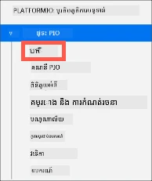
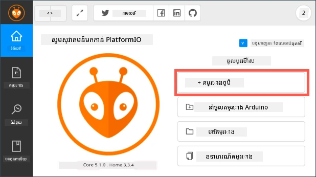
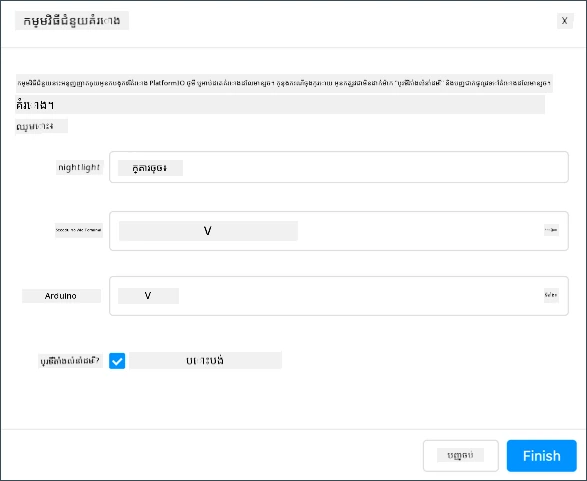
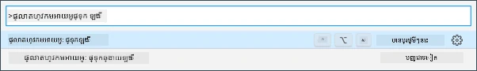
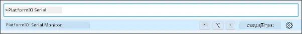

# Wio Terminal

The [Wio Terminal from Seeed Studios](https://www.seeedstudio.com/Wio-Terminal-p-4509.html) គឺជាម៉ាយខ្រីកន្ត្រោលដែលសមស្របជាមួយ Arduino មាន WiFi និងឧបករណ៍សងៅងនិងការចលករខ្លះបញ្ចូលមកមុន ជាមួយនឹងផតបណ្ដាញសម្រាប់បន្ថែមឧបករណ៍សងៅងនិងការចលករ ដែលប្រើប្រព័ន្ធឧបករណ៍ហារ៉វិដដែលឈ្មោះ [Grove](https://www.seeedstudio.com/category/Grove-c-1003.html)។


## Setup

ដើម្បីប្រើប្រាស់ Wio Terminal របស់អ្នក អ្នកត្រូវតែដំឡើងកម្មវិធីឥតគិតថ្លៃខ្លះៗលើកុំព្យូទ័រ។ អ្នកក៏ត្រូវធ្វើបច្ចុប្បន្នភាពហ្វើមវែរមុនពេលភ្ជាប់វាចូល WiFi។

### Task - setup

ដំឡើងកម្មវិធីដែលត្រូវការ និងធ្វើបច្ចុប្បន្នភាពហ្វើមវែរ។

1. ដំឡើង Visual Studio Code (VS Code)។ នេះជាកម្មវិធីកែសម្រួលដែលអ្នកនឹងប្រើសរសេរកូដឧបករណ៍របស់អ្នកជាភាសា C/C++។ សូមយោងទៅកាន់ [ឯកសារ VS Code](https://code.visualstudio.com?WT.mc_id=academic-17441-jabenn) សម្រាប់ការណែនាំអំពីការដំឡើង VS Code។

    > 💁 IDE ពេញនិយមមួយផ្សេងទៀតសម្រាប់ការអភិវឌ្ឍ Arduino គឺ [Arduino IDE](https://www.arduino.cc/en/software)។ ប្រសិនបើអ្នកធ្លាប់ស្គាល់ឧបករណ៍នេះ អ្នកអាចប្រើវាជាជំនួស VS Code និង PlatformIO ប៉ុន្តែមេរៀននេះនឹងផ្ដល់ជាណែនាំដោយផ្អែកលើការប្រើ VS Code។

1. ដំឡើងផ្នែកបន្ថែម VS Code PlatformIO។ នេះជាផ្នែកបន្ថែមសម្រាប់ VS Code ដែលគាំទ្រការសរសេរកូដម៉ាយក្រោនត្រឡូលជាភាសា C/C++។ សូមយោងទៅកាន់ [ឯកសារផ្នែកបន្ថែម PlatformIO](https://marketplace.visualstudio.com/items?WT.mc_id=academic-17441-jabenn&itemName=platformio.platformio-ide) សម្រាប់ការណែនាំអំពីការដំឡើងផ្នែកនេះនៅក្នុង VS Code។ ផ្នែកបន្ថែមនេះត្រូវការផ្នែកបន្ថែម Microsoft C/C++ ដើម្បីធ្វើការងារជាមួយកូដ C និង C++ ហើយផ្នែកបន្ថែម C/C++ នឹងត្រូវបានដំឡើងដោយស្វ័យប្រវត្តិពេលអ្នកដំឡើង PlatformIO។

1. ភ្ជាប់ Wio Terminal របស់អ្នកទៅកុំព្យូទ័រ។ Wio Terminal មានច្រក USB-C នៅខាងក្រោម ហើយត្រូវបានភ្ជាប់ទៅច្រក USB លើកុំព្យូទ័រ។ Wio Terminal មានខ្សែ USB-C ទៅ USB-A ជាមួយ ប៉ុន្តែនៅករណីកុំព្យូទ័ររបស់អ្នកមានតែច្រក USB-C អ្នកនឹងត្រូវខ្សែ USB-C ឬអាចប្រើឧបករណ៍បម្លែង USB-A ទៅ USB-C។

1. អនុវត្តតាមការណែនាំក្នុង [Wio Terminal Wiki WiFi Overview documentation](https://wiki.seeedstudio.com/Wio-Terminal-Network-Overview/) ដើម្បីរៀបចំ Wio Terminal របស់អ្នក និងធ្វើបច្ចុប្បន្នភាពហ្វើមវែរ។

## Hello world

វាជាប្រពៃណីនៅពេលចាប់ផ្តើមភាសាកម្មវិធីថ្មី ឬបច្ចេកវិទ្យាថ្មី ដើម្បីបង្កើតកម្មវិធី 'Hello World' ដែលជាកម្មវិធីតូចមួយបង្ហាញអត្ថបទ `"Hello World"` ដើម្បីបង្ហាញថា​ឧបករណ៍ទាំងអស់ត្រូវបានតម្លើងបានត្រឹមត្រូវ។

កម្មវិធី Hello World សម្រាប់ Wio Terminal នឹងធានាថា អ្នកបានដំឡើង Visual Studio Code ជាមួយ PlatformIO ដោយត្រឹមត្រូវ និងរៀបចំសម្រាប់ការអភិវឌ្ឍម៉ាយក្រោនត្រឡួល។

### Create a PlatformIO project

ជំហានដំបូងគឺការបង្កើតគម្រោងថ្មីប្រើ PlatformIO ដែលបានកំណត់សម្រាប់ Wio Terminal។

#### Task - create a PlatformIO project

បង្កើតគម្រោង PlatformIO។

1. ភ្ជាប់ Wio Terminal ទៅកុំព្យូទ័ររបស់អ្នក

1. បើក VS Code

1. រូបសញ្ញា PlatformIO គឺនៅលើបាតម៉ឺនុយផ្នែកខាងស្តាំ៖

    

    ជ្រើសរើសមឺនុយនេះ បន្ទាប់ជ្រើសរើស *PIO Home -> Open*

    

1. ពីផ្ទាំងស្វាគមន៍ ជ្រើសរើសប៊ូតុង **+ New Project**

    

1. កំណត់រចនាសម្ព័ន្ធគម្រោងនៅក្នុង *Project Wizard*៖

    1. ឈ្មោះគម្រោង `nightlight`

    1. ពីបញ្ជីជ្រើសសន្លឹក *Board* វាយ `WIO` ដើម្បីច្រោះប័រទុយ អោយជ្រើស *Seeeduino Wio Terminal*

    1. សម្រាប់ *Framework* ទុកដដែលជា *Arduino*

    1. ឬជ្រើស *Use default location* ឬមិនជ្រើស ហើយជ្រើសទីតាំងសម្រាប់គម្រោងរបស់អ្នក

    1. ចុចប៊ូតុង **Finish**

    

    PlatformIO នឹងទាញយកចំនុចផ្សេងៗដែលត្រូវការ ដើម្បីបង្រ្កាបកូដសម្រាប់ Wio Terminal ហើយបង្កើតគម្រោងរបស់អ្នក។ វា​អាចនឹងចំណាយពេលប៉ុន្មាននាទី។

### Investigate the PlatformIO project

ជំហានរុករកក្នុង VS Code នឹងបង្ហាញឯកសារ និងថត ដែលបានបង្កើតដោយកម្មវិធី PlatformIO wizard។

#### Folders

* `.pio` - ថតនេះផ្ទុកទិន្នន័យបណ្តោះអាសន្នដែលត្រូវការដោយ PlatformIO ដូចជា​បណ្ណាល័យ ឬកូដដែលបានបង្រ្កាប។ វានឹងត្រូវបង្កើតឡើងវិញដោយស្វ័យប្រវត្តិ ប្រសិនបើលុបចោល ហើយអ្នកមិនត្រូវបន្ថែមវាចូលទៅការគ្រប់គ្រងកូដប្រភព ប្រសិនបើអ្នកចែករំលែកគម្រោងនៅលើគេហទំព័រដូចជា GitHub ។

* `.vscode` - ថតនេះផ្ទុកការកំណត់រចនាសម្ព័ន្ធដែលបានប្រើដោយ PlatformIO និង VS Code។ វានឹងត្រូវបង្កើតឡើងវិញដោយស្វ័យប្រវត្តិ ប្រសិនបើលុបចោល ហើយអ្នកមិនត្រូវបន្ថែមវាចូលទៅការគ្រប់គ្រងកូដប្រភព ប្រសិនបើអ្នកចែករំលែកគម្រោងនៅលើគេហទំព័រដូចជា GitHub ។

* `include` - ថតនេះសម្រាប់ឯកសារមុខបែបក្រៅដែលត្រូវបានប្រើពេលបន្ថែមបណ្ណាល័យបន្ថែមចូលដើម្បីកូដ។ អ្នកមិនអាចប្រើថតនេះក្នុងមេរៀនទេសាទនេះទេ។

* `lib` - ថតនេះសម្រាប់បណ្ណាល័យក្រៅដែលអ្នកចង់ហៅពីកូដរបស់អ្នក។ អ្នកមិនអាចប្រើថតនេះក្នុងមេរៀនទេសាទនេះទេ។

* `src` - ថតនេះផ្ទុកកូដរួមសម្រាប់កម្មវិធីរបស់អ្នក។ ក្នុងដំបូង វានឹងមានឯកសារតែមួយគត់គឺ `main.cpp`។

* `test` - ថតនេះសម្រាប់ដាក់ការសាកល្បងម៉ូឌុលឯកតាសម្រាប់កូដរបស់អ្នក។

#### Files

* `main.cpp` - ឯកសារនេះនៅក្នុងថត `src` មានចំណុចចូលសម្រាប់កម្មវិធីរបស់អ្នក។ បើកឯកសារនេះ វានឹងមានកូដដូចខាងក្រោម៖

    ```cpp
    #include <Arduino.h>
    
    void setup() {
      // ដាក់កូដតំឡើង​របស់អ្នកនៅទីនេះ ដើម្បីរត់តែម្តង៖
    }
    
    void loop() {
      // ដាក់កូដសំខាន់​របស់អ្នកនៅទីនេះ ដើម្បីរត់ជាបន្តបន្ទាប់៖
    }
    ```

    នៅពេលឧបករណ៍ចាប់ផ្តើម ម៉ាយក្រោនត្រឡួល Arduino នឹងដំណើរការលំនាំ `setup` ម្តងហើយបន្តដំណើរការលំនាំ `loop` ជារឿយៗរហូតដល់ឧបករណ៍បានផ្អាក។

* `.gitignore` - ឯកសារនេះបញ្ជីឯកសារ និងថតដែលត្រូវចៀសវាងពេលបញ្ចូលកូដទៅក្នុងប្រព័ន្ធគ្រប់គ្រងកូដប្រភព git ដូចជាការបញ្ចូលទៅក្នុងrepository លើ GitHub។

* `platformio.ini` - ឯកសារនេះផ្ទុកកំណត់រចនាសម្ព័ន្ធសម្រាប់ឧបករណ៍ និងកម្មវិធីរបស់អ្នក។ បើកឯកសារនេះ វានឹងមានកូដដូចខាងក្រោម៖

    ```ini
    [env:seeed_wio_terminal]
    platform = atmelsam
    board = seeed_wio_terminal
    framework = arduino
    ```

    ផ្នែក `[env:seeed_wio_terminal]` មានកំណត់រចនាសម្ព័ន្ធសម្រាប់ Wio Terminal។ អ្នកអាចមានផ្នែក `env` ច្រើនដែលអាចបង្កើតកូដសម្រាប់ក្តារម៉ាយក្រោនច្រើនប្រភេទបាន។

    តម្លៃផ្សេងទៀតគឺតម្រូវការផ្អែកលើកំណត់គម្រោង៖

  * `platform = atmelsam` កំណត់ហារ៉វែរដែល Wio Terminal ប្រើ (ម៉ាយក្រោនលើគ្រឹះ ATSAMD51)
  * `board = seeed_wio_terminal` កំណត់ក្តារម៉ាយក្រោនប្រភេទ Wio Terminal
  * `framework = arduino` កំណត់ថាគម្រោងនេះប្រើប្រព័ន្ធ Arduino ។

### Write the Hello World app

ឥឡូវនេះអ្នករួចរាល់ក្នុងការសរសេរកម្មវិធី Hello World។

#### Task - write the Hello World app

សរសេរកម្មវិធី Hello World។

1. បើកឯកសារ `main.cpp` នៅក្នុង VS Code

1. ប្តូរកូដឲ្យត្រូវនឹងខាងក្រោម៖

    ```cpp
    #include <Arduino.h>

    void setup()
    {
        Serial.begin(9600);

        while (!Serial)
            ; // រង់ចាំស៊េរីយ៉ាល់ឲ្យរួចរាល់
    
        delay(1000);
    }
    
    void loop()
    {
        Serial.println("Hello World");
        delay(5000);
    }
    ```

    លំនាំ `setup` ចាប់ផ្តើមការតភ្ជាប់ទៅច្រកស៊េរី - ក្នុងករណីនេះ គឺច្រក USB ដែលប្រើភ្ជាប់ Wio Terminal ទៅកុំព្យូទ័រ។ ប៉ារ៉ាម៉ែត្រ `9600` គឺជា [អត្រាប៉ុស្តិ៍សំរាប់ទិន្នន័យ](https://wikipedia.org/wiki/Symbol_rate) (ហៅថា Symbol rate ផងដែរ) ឬល្បឿនបញ្ជូនទិន្នន័យតាមច្រកស៊េរីជាចំណុចក្នុងមួយវិនាទី។ កំណត់នេះមានន័យថាផ្ញើ 9,600 ប៊ីត (0 និង 1) នៃទិន្នន័យរៀងរាល់វិនាទី។ បន្ទាប់មករង់ចាំរហូតដល់ច្រកស៊េរីរួចរាល់។

    លំនាំ `loop` ផ្ញើជួរដេក `Hello World!` ទៅដល់ច្រកស៊េរី ដូច្នេះតួអាក្សរ `Hello World!` ជាមួយតួអក្សរសម្រាប់បន្ទាប់ជួររួមផង។ បន្ទាប់មកវាដេករយៈពេល 5,000 មីលីវិនាទី ឬ 5 វិនាទី។ បន្ទាប់​ពី​លំនាំ `loop` បញ្ចប់ វានឹងរត់ម្តងទៀតជារឿយៗ ជានិរន្តរភាព នៅពេលម៉ាយក្រោនត្រឡួលមានថាមពល។

1. ដាក់ Wio Terminal របស់អ្នកចូលទៅក្នុងរបៀបផ្ទុកកូដ (upload mode)។ អ្នកត្រូវធ្វើបែបនេះរៀងរាល់ពេល អ្នកផ្ទុកកូដថ្មីទៅឧបករណ៍៖

    1. បត់បញ្ឈរម្តងពីរដងលឿនលើប៊ូតុងបិទ/បើក - វានឹងត្រឡប់មកទីតាំងបើកគ្រប់ពេល។

    1. ពិនិត្យមើល LED ពណ៌ខៀវនៅចំហៀងស្តាំនៃច្រក USB។ វាគួរតែដំណើរការជារលក។

    [](https://youtu.be/LeKU_7zLRrQ)

    ចុចលើរូបភាពខាងលើដើម្បីមើលវីដេអូមាត្រូវធ្វើរបៀបនេះ។

1. សង់ និងផ្ទុកកូដទៅ Wio Terminal

    1. បើកផ្ទាំងបញ្ជារបស់ VS Code

    1. វាយ `PlatformIO Upload` ដើម្បីស្វែងរកជម្រើសផ្ទុកកូដ ហើយជ្រើស *PlatformIO: Upload*

        

        PlatformIO នឹងសង់កូដស្វ័យប្រវត្តិប្រសិនបើចាំបាច់ មុនការផ្ទុកកូដ។

    1. កូដនឹងត្រូវបានកូដផ្សំនិងផ្ទុកទៅ Wio Terminal

        > 💁 ប្រសិនបើអ្នកប្រើប្រាស់ macOS ប្រសាសន៍បិទដ្រាយមិនបានត្រឹមត្រូវនឹងបង្ហាញ។ នេះគឺដោយសារតែ Wio Terminal ត្រូវបានភ្ជាប់ជាឌ្រាយក្នុងដំណើរការផ្ទុកកូដ ហើយវាត្រូវបានដកចេញពេលកូដដែលបានបង្រ្កាបបានសរសេរចូលឧបករណ៍។ អ្នកអាចមិនយកចិត្តទុកដាក់អំពីប្រសាសន៍នេះ។

    ⚠️ ប្រសិនបើអ្នកទទួលបានកំហុសអំពីច្រកផ្ទុកកូដមិនអាចប្រើបាន សូមប្រាកដថា នឹងភ្ជាប់ Wio Terminal ទៅកុំព្យូទ័ររបស់អ្នក ហើយបើកវាតាមប៊ូតុងនៅខាងឆ្វេងនៃអេក្រង់ និងដាក់វាចូលរបៀបផ្ទុកកូដ។ ពន្លឺបៃតងនៅខាងក្រោមគួរតែបើក និងពន្លឺខៀវគួរតែរលកលើ។ ប្រសិនបើនៅតែមានកំហុស សូមបត់ប៊ូតុងបិទ/បើកពីរដងលឿនម្តងទៀត ដើម្បីបង្ខំ Wio Terminal ចូលរបៀបផ្ទុកកូដ ហើយព្យាយាមផ្ទុកកូដម្តងទៀត។

PlatformIO មានកម្មវិធី Serial Monitor ដែលអាចតាមដានទិន្នន័យផ្ញើតាមខ្សែ USB ពី Wio Terminal។ នេះអនុញ្ញាតឲ្យអ្នកតាមដានទិន្នន័យដែលបញ្ជូនដោយការណែនាំ `Serial.println("Hello World");`។

1. បើកផ្ទាំងបញ្ជារបស់ VS Code

1. វាយ `PlatformIO Serial` ដើម្បីស្វែងរកជម្រើស Serial Monitor ហើយជ្រើស *PlatformIO: Serial Monitor*

    

    ផ្ទាំងតែមួយថ្មីនឹងបើកឡើង ហើយទិន្នន័យដែលផ្ញើតាមច្រកស៊េរីនឹងចាក់បញ្ចាំងក្នុងផ្ទាំងនេះ៖

    ```output
    > Executing task: platformio device monitor <
    
    --- Available filters and text transformations: colorize, debug, default, direct, hexlify, log2file, nocontrol, printable, send_on_enter, time
    --- More details at http://bit.ly/pio-monitor-filters
    --- Miniterm on /dev/cu.usbmodem101  9600,8,N,1 ---
    --- Quit: Ctrl+C | Menu: Ctrl+T | Help: Ctrl+T followed by Ctrl+H ---
    Hello World
    Hello World
    ```

    `Hello World` នឹងបញ្ចូលទៅក្នុង serial monitor រៀងរាល់ 5 វិនាទី។

> 💁 អ្នកអាចរកកូដនេះបាននៅក្នុងថត [code/wio-terminal](../../../../../1-getting-started/lessons/1-introduction-to-iot/code/wio-terminal)។

😀 កម្មវិធី 'Hello World' របស់អ្នកបានជោគជ័យហើយ!

---

<!-- CO-OP TRANSLATOR DISCLAIMER START -->
**ការព្រមាន**៖  
ឯកសារនេះត្រូវបានបំប្រែប្រើសេវាកម្មបំប្រែ AI [Co-op Translator](https://github.com/Azure/co-op-translator)។ ខណៈពេលយើងខិតខំស្វែងរកភាពត្រឹមត្រូវ សូមជ្រាបថាការបំប្រែដោយស្វ័យប្រវត្តិក្នុងឯកសារនេះអាចមានកំហុស ឬអច្បាប់មិនច្បាស់។ ឯកសារដើមដែលនៅក្នុងភាសាមូលដ្ឋាន គួរត្រូវបានគេចាត់ទុកជាធនាគារច្បាស់លាស់។ សម្រាប់ព័ត៌មានសំខាន់ៗ សូមណែនាំឲ្យបំប្រែដោយអ្នកជំនាញមនុស្ស។ យើងមិនទទួលខុសត្រូវចំពោះការយល់ច្រឡំ ឬការបកប្រែខុស បង្កឡើងពីការប្រើប្រាស់ការបំប្រែនេះឡើយ។
<!-- CO-OP TRANSLATOR DISCLAIMER END -->