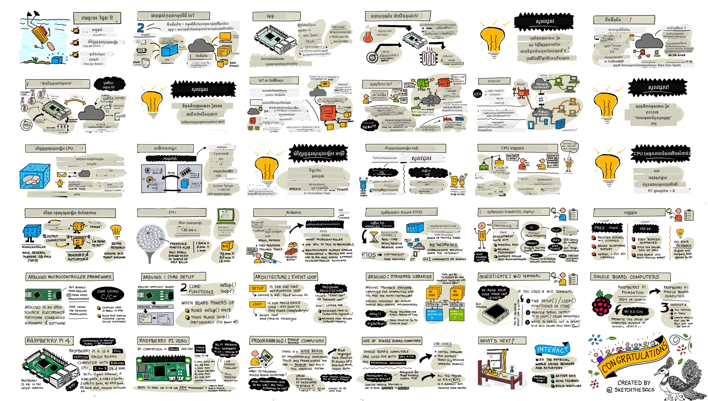
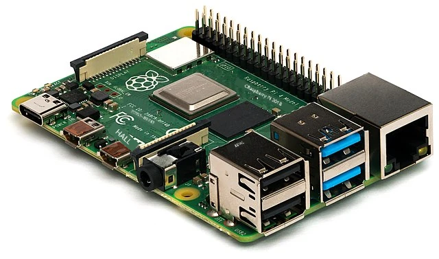
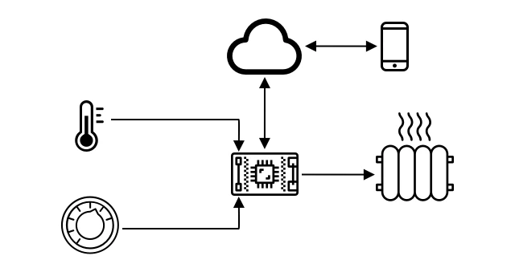
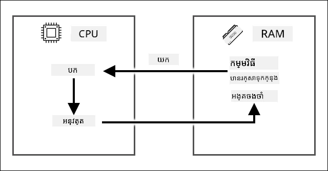
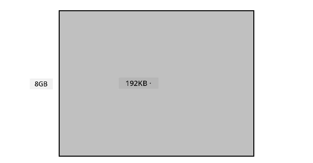
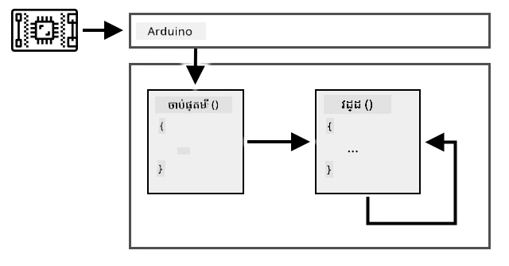
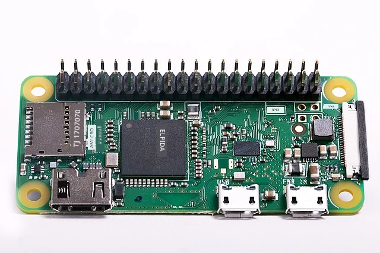

# ការធ្វើជ្រៅជាងនេះលើ IoT

> Sketchnote by [Nitya Narasimhan](https://github.com/nitya). Click the image for a larger version.

មេរៀននេះត្រូវបានបង្រៀនជាផ្នែកមួយនៃ [ស៊េរី Hello IoT](https://youtube.com/playlist?list=PLmsFUfdnGr3xRts0TIwyaHyQuHaNQcb6-) ពី [Microsoft Reactor](https://developer.microsoft.com/reactor/?WT.mc_id=academic-17441-jabenn)។ មេរៀននេះត្រូវបានបង្រៀនជា​វីដេអូ ២ខ្សែ​ — មេរៀន ១ម៉ោង និងម៉ោងការិយាល័យ ១ម៉ោង សម្រាប់ធ្វើជ្រៅក្នុងផ្នែកនានារបស់មេរៀន និងឆ្លើយសំណួរ។

> 🎥 ចុចរូបភាពខាងលើដើម្បីមើលវីដេអូ

## វិញ្ញាសាក្នុងមុនម៉ោងបង្រៀន

[វិញ្ញាសាក្នុងមុនម៉ោងបង្រៀន](https://black-meadow-040d15503.1.azurestaticapps.net/quiz/3)

## ការណែនាំ

មេរៀននេះធ្វើជ្រៅជាងមុខទៅលើគំនិតខ្លះៗដែលបានគ្របដណ្តប់ក្នុងមេរៀនមុន។

នៅក្នុងមេរៀននេះ យើងនឹងគ្របដណ្តប់៖

* [ផ្នែកផ្សំនៃកម្មវិធី IoT](#ផ្នែកផ្សំនៃកម្មវិធី-iot)
* [ការធ្វើជ្រៅជាងទៅលើ microcontrollers](#ការធ្វើជ្រៅជាងទៅលើ-microcontrollers)
* [ការធ្វើជ្រៅជាងទៅលើ single-board computers](#ចំណត្រាប់វែងទៅក្នុងកុំព្យូទ័រថតតែមួយក្តារ)

## ផ្នែកផ្សំនៃកម្មវិធី IoT

ផ្នែក២ របស់កម្មវិធី IoT គឺ *អ៊ីនធឺណិត* និង *របស់*។ យើងមកមើលផ្នែកទាំងពីរនេះយ៉ាងលម្អិតជាងនេះ។

### របស់

**របស់** គឺជាឧបករណ៍ដែលអាចអន្តរកម្មជាមួយពិភពរាងកាយ។ ឧបករណ៍ទាំងនេះជាទូទៅជាកុំព្យូទ័រតូចៗ តម្លៃចុះថោក ម្ហូបឥន្ធនៈតិច និងដំណើរការល្បឿនទាប — ឧទាហរណ៍ microcontrollers ងាយស្រួលដែលមាន RAM គិតជាគីឡូបៃ (ផ្ទុយពីជាគីឡូបៃនៅ PC) ដោយដំណើរការត្រឹមរយៈម៉េហ្គាហ៊ែរីត (ផ្ទុយពីជាគីឡូហ៊ែរីតនៅ PC) ប៉ុន្តែប្រើថាមពលតិចពេក ដែលអាចដំណើរការបានជាសប្តាហ៏ ខែ ឬឆ្នាំ អាស្រ័យលើថ្ម។

ឧបករណ៍ទាំងនេះអន្តរកម្មជាមួយពិភពរាងកាយ ដោយប្រើសេនសឺរចំលងទិន្នន័យពីបរិយាកាស ឬគ្រប់គ្រងចេញលទ្ធផល ឬ actuator ដើម្បីបង្កើតការផ្លាស់ប្តូរជារូបរាង។ ឧទាហរណ៍ធម្មតាមួយគឺ smart thermostat — ឧបករណ៍ដែលមានសេនសឺរកំដៅ, វិធីកំណត់សីតុណ្ហភាពដែលចង់បានដូចជា dial ឬ touchscreen, និងការតភ្ជាប់ទៅប្រព័ន្ធកំដៅ ឬត្រជាក់ដែលអាចបើកពេលវាស់សីតុណ្ហភាពខុសពីជួរដែលចង់បាន។ សេនសឺរកំដៅវាស់បានថាមេឌៀមត្រជាក់ពេក ហើយ actuator បើកកំដៅ។

មានរបស់ជាច្រើនគ្រឿងផ្សេងៗដែលអាចធ្វើជាឧបករណ៍ IoT បាន ចាប់ពី hardware ផ្ដោតសំខាន់លើ sensing មួយមុខ ដល់ឧបករណ៍ប្រើប្រាស់ទូទៅ រួមទាំង smartphone របស់អ្នកផងដែរ! Smartphone អាចប្រើសេនសឺរដើម្បីគិតថា អ្វីកើតឡើងនៅជុំវិញ ហើយ actuator ដើម្បីអន្តរកម្មជាមួយពិភពពីក្រៅ — ឧទាហរណ៍ ប្រើសេនសឺរជាផ្នែក GPS ដើម្បីស្គាល់ទីតាំងរបស់អ្នក និង Speaker ដើម្បីផ្តល់ការណែនាំផ្លូវទៅកាន់គោលដៅ។

✅ សូមគិតអំពីប្រព័ន្ធផ្សេងៗទៀតដែលអ្នកមាននៅជុំវិញ ដែលអានទិន្នន័យពីសេចក្ដីថ្លែងសេនសឺរនិងប្រើវាទៅធ្វើការសម្រេចចិត្ត។ ឧទាហរណ៍មួយគឺ thermostat នៅលើចង្ក្រាន។ តើអ្នកអាចរកឃើញបន្ថែមទៀតទេ?

### អ៊ីនធឺណិត

ផ្នែក **អ៊ីនធឺណិត** នៃកម្មវិធី IoT រួមមានកម្មវិធីដែលឧបករណ៍ IoT អាចភ្ជាប់ទៅ ដើម្បីផ្ញើនិងទទួលទិន្នន័យ ជាមួយកម្មវិធីផ្សេងៗដែលអាចដំណើរការទិន្នន័យពីឧបករណ៍ IoT និងជួយធ្វើការសម្រេចចិត្តលើសំណើសុំដល់ actuator របស់ឧបករណ៍ IoT។

លំនៅធម្មតាមួយ គឺប្រើសេវាកម្ម cloud មួយ ដែលឧបករណ៍ IoT តភ្ជាប់ទៅ ហើយសេវាកម្ម cloud នោះគ្រប់គ្រងធាតុដូចជា សុវត្ថិភាព និងទទួលសារ ព្រមទាំងផ្ញើសារទៅឧបករណ៍វិញ។ សេវាកម្ម cloud នឹងភ្ជាប់ទៅកម្មវិធីផ្សេងទៀត ដើម្បីដំណើរការ ឬរក្សាទុកទិន្នន័យសេនសឺរ ឬប្រើទិន្នន័យសេនសឺរជាមួយទិន្នន័យពីប្រព័ន្ធផ្សេង ដើម្បីធ្វើការសម្រេចចិត្ត។

ឧបករណ៍មិនតែងតែភ្ជាប់ទៅអ៊ីនធឺណិតដោយផ្ទាល់តាម WiFi ឬខ្សែ។ ឧបករណ៍មួយចំនួនប្រើអ៊ិនធឺណិត mesh ដើម្បីនិយាយគ្នាតាមបច្ចេកវិទ្យាដូចជា Bluetooth តភ្ជាប់តាមឧបករណ៍ hub ដែលមានការតភ្ជាប់អ៊ីនធឺណិត។

ជាឧទាហរណ៍ thermostat ដើម្បី Smarter thermostat នឹងភ្ជាប់តាម WiFi ផ្ទះទៅសេវាកម្ម cloud។ វាសំដៅផ្ញើទិន្នន័យសីតុណ្ហភាពទៅសេវាកម្ម cloud ហើយទិន្នន័យនឹងត្រូវស្នាក់នៅវេបសាយអនុញ្ញាតឲ្យម្ចាស់ផ្ទះពិនិត្យសីតុណ្ហភាពបច្ចុប្បន្ននិងកន្លងមកដោយកម្មវិធីទូរស័ព្ទ។ សេវាផ្សេងមួយក្នុង cloud នឹងស្គាល់ថាសីតុណ្ហភាពដែលម្ចាស់ផ្ទះចង់បាន ហើយផ្ញើសារទៅឧបករណ៍ IoT តាមរយៈសេវាកម្ម cloud ដើម្បីបើក ឬបិទប្រព័ន្ធកំដៅ។

កំណែឆ្លាតចាងនៅចុងក្រោយអាចប្រើ AI នៅក្នុង cloud ជាមួយទិន្នន័យពីសេនសឺរផ្សេងទៀតភ្ជាប់ទៅឧបករណ៍ IoT ផ្សេងៗ ដូចជា សេនសឺរចំនួនអ្នកនៅក្នុងបន្ទប់ ដូចជា weather និង calendar របស់អ្នក ដើម្បីសម្រេចចិត្តពីរបៀបកំណត់សីតុណ្ហភាពយ៉ាងឆ្លាតវៃ។ ឧទាហរណ៍ វាអាចបិទកំដៅបើវាអានពីប្រតិទិនថាអ្នកកំពុងចាកច្រីទៅចំរៀង ឬបិទកំដៅនៅបន្ទប់មួយៗ សម្រាប់បន្ទប់ដែលអ្នកប្រើប្រាស់ដោយរៀនពីទិន្នន័យ ដើម្បីកាន់តែមានភាពត្រឹមត្រូវកាលពីខ្លះៗ។

✅ តើទិន្នន័យផ្សេងទៀតអ្វីខ្លះដែលអាចជួយឲ្យ thermostat ភ្ជាប់អ៊ីនធឺណិតកាន់តែឆ្លាត?

### IoT នៅតំបន់ Edge

បើទោះបីជា I ក្នុង IoT មានន័យថា Internet ក៏ដោយ ឧបករណ៍ទាំងនេះមិនចាំបាច់ភ្ជាប់ទៅអ៊ីនធឺណិតឡើយ។ ក្នុងករណីខ្លះៗ ឧបករណ៍អាចភ្ជាប់ទៅឧបករណ៍ 'edge' គឺឧបករណ៍ gateway ដែលដំណើរការនៅបណ្តាញក្នុងតំបន់របស់អ្នក មានន័យថាអ្នកអាចដំណើរការទិន្នន័យដោយមិនចាំបាច់ហៅទៅអ៊ីនធឺណិត។ វាអាចលឿនជាងពេលមានទិន្នន័យច្រើន ឬការតភ្ជាប់អ៊ីនធឺណិតយឺត អនុញ្ញាតឱ្យដំណើរការផ្អាកខណ:ពេលអ៊ីនធឺណិតមិនអាចចូលបាន ដូចជា លើកបញ្ចាក់ទូក ឬតំបន់គ្រោះមហ៉ាអាសន្ន ដើម្បីឆ្លើយតបនឹងវិបត្តិក្នុងមនុស្សសាស្ត្រ បន្ទាប់ពីនោះអាចរក្សាទិន្នន័យឲ្យឯកជន។ ឧបករណ៍ខ្លះៗនឹងមានកូដដំណើរការដែលបានបង្កើតដោយបច្ចេកវិទ្យា cloud ហើយដំណើរការនៅក្នុងតំបន់ ដើម្បីប្រមូលនិងឆ្លើយតបទិន្នន័យដោយមិនប្រើការតភ្ជាប់អ៊ីនធឺណិតសម្រាប់សម្រេចចិត្ត។

ឧទាហរណ៍មួយគឺឧបករណ៍ផ្ទះឆ្លាតដូចជា Apple HomePod, Amazon Alexa ឬ Google Home ដែលនឹងស្តាប់សំឡេងអ្នកដោយប្រើម៉ូដែល AI ដែលបានបណ្ដុះបណ្ដាលក្នុង cloud ប៉ុន្តែដំណើរការនៅលើឧបករណ៍ផ្ទាល់ខ្លួន។ ឧបករណ៍ទាំងនេះនឹង "រួមគ្នា" នៅពេលពាក្យឬប្រយោគជាក់លាក់ត្រូវបាននិយាយ ហើយបន្ទាប់មកផ្ញើសំឡេងរបស់អ្នកទៅអ៊ីនធឺណិតសម្រាប់ដំណើរការ។ ឧបករណ៍នឹងបញ្ឈប់ផ្ញើសំឡេងនៅពេលដែលវាវាស់បានថាមានការឈប់សំឡេងយ៉ាងត្រឹមត្រូវ។ អ្វីដែលអ្នកនិយាយមុនពេលឧបករណ៍រួមគ្នានឹងពាក្យផ្ដល់សញ្ញា និងអ្វីដែលអ្នកនិយាយបន្ទាប់ពីឧបករណ៍ឈប់ស្ដាប់​នឹងមិនត្រូវបានផ្ញើទៅអ្នកផ្តល់សេវាឧបករណ៍នោះនិងត្រូវបានរក្សាឯកជន។

✅ សូមគិតអំពីស្ថានการณ์ផ្សេងទៀតដែលភាពឯកជនមានសារៈសំខាន់ ដូច្នេះការដំណើរការទិន្នន័យល្អជាងនៅតំបន់ edge ជាងនៅក្នុង cloud។ ជាគន្លងសម្រាប់គិត— គិតអំពីឧបករណ៍ IoT ដែលមានកាមេរ៉ា ឬឧបករណ៍ថតរូបផ្សេងៗ។

### សន្តិសុខ IoT

ជាមួយនឹងការតភ្ជាប់អ៊ីនធឺណិតណាមួយ សន្តិសុខជាកត្តាសំខាន់។ មានកំប្លែងចាស់មួយថា 'S ក្នុង IoT មានន័យថា Security' — ប៉ុន្តែជាក់ស្តែងមិនមាន S ក្នុង IoT ប្រាប់ថាវាមិនមានសន្តិសុខឡើយ។

ឧបករណ៍ IoT ភ្ជាប់ទៅសេវាកម្ម cloud ហើយដូច្នេះមានសន្តិសុខតែប៉ុណ្ណោះដូចសេវាកម្ម cloud នោះ — បើសេវាកម្ម cloud អនុញ្ញាតឲ្យឧបករណ៍ណាមួយភ្ជាប់បាន ទិន្នន័យពុលអាចត្រូវបានផ្ញើឬវីរុសអាចឆ្លង។ វាអាចមានផលប៉ះពាល់ពិតប្រាកដ ព្រោះឧបករណ៍ IoT អន្តរកម្មនិងគ្រប់គ្រងឧបករណ៍ផ្សេងទៀត។ ឧទាហរណ៍ [Stuxnet worm](https://wikipedia.org/wiki/Stuxnet) បានប្រែប្រួលវ៉ាល់វ៉ាល់សម្រាប់ centrifuges ដើម្បីបំផ្លាញវា។ អ្នកចោរកម្មក៏បានយកអត្ថប្រយោជន៍ពី [សន្តិសុខអន់ៗក្នុងការចូលដំណើរការតាមរយៈ baby monitors](https://www.npr.org/sections/thetwo-way/2018/06/05/617196788/s-c-mom-says-baby-monitor-was-hacked-experts-say-many-devices-are-vulnerable) និងឧបករណ៍តាមដានផ្ទះផ្សេងទៀត។

> 💁 អ្នកឧបករណ៍ IoT និង edge device មួយចំនួនដំណើរការលើបណ្ដាញដែលបិទស្របពីអ៊ីនធឺណិត ដើម្បីរក្សាទិន្នន័យឲ្យឯកជននិងសុវត្ថិភាព។ នេះគឺហៅថា [air-gapping](https://wikipedia.org/wiki/Air_gap_(networking))។

## ការធ្វើជ្រៅជាងទៅលើ microcontrollers

ក្នុងមេរៀនមុន យើងបានណែនាំ microcontrollers។ ឥឡូវនេះមកមើលជ្រៅជាងពីពួកវា។

### CPU

CPU គឺជាឆ្នើមមួយនៃ microcontroller។ វាជាផ្នែកដំណើរការដែលអនុវត្តកូដរបស់អ្នក និងអាចផ្ញើនិងទទួលទិន្នន័យពីឧបករណ៍ភ្ជាប់ផ្សេងៗបាន។ CPU អាចមានមួយច្រើន core — ជាច្រើន CPU ដែលអាចធ្វើការជាមួយគ្នាដើម្បីដំណើរការកូដរបស់អ្នក។

CPU អាស្រ័យលើក្លុកកាឡង់ធ្វើការត្រូស៊ីច្រើនលានលាននាក់ទបីលានបួនលានពីរខ្នាតក្នុងមួយវិនាទី។ រាល់ក្លុយ ឬ វគ្គសិក្សា ត្រូវតែសម្របសម្រួលសកម្មភាពដែល CPU អាចបំពេញ។ រាល់ក្លុយ CPU អាចអនុវត្តន៍សេចក្ដីណែនាំពីកម្មវិធី ដូចជាការទទួលទិន្នន័យពីឧបករណ៍ក្រៅផ្សេងទៀត ឬធ្វើការគណនាគណិតវិទ្យា។ វគ្គសិក្សាប្រក្រតីនេះធ្វើឲ្យសកម្មភាពទាំងអស់បញ្ចប់មុនពេលប្រាកដថាសេចក្ដីណែនាំបន្ទាប់ត្រូវបានប្រតិបត្តិតាម។

ក្លុកពីលឿន ប្រាប់អំពីចំនួនសេចក្ដីណែនាំដែលអាចដំណើរការបានក្នុងមួយវិនាទី ហើយដូច្នេះគឺ CPU លឿនជាង។ ល្បឿន CPU មានអង្គភាពជា [Hertz (Hz)](https://wikipedia.org/wiki/Hertz) ដែល 1 Hz មានន័យថាវគ្គមួយឬក្លុកត្រូស៊ីមួយក្នុងមួយវិនាទី។

> 🎓 ល្បឿន CPU ជាទូទៅមើលជា MHz ឬ GHz។ 1MHz គឺ ១លានហឺត (million Hz), 1GHz គឺ ១ពាន់លានហឺត (billion Hz)។

> 💁 CPU អនុវត្តកម្មវិធីតាមរយៈ [វគ្គ fetch-decode-execute](https://wikipedia.org/wiki/Instruction_cycle)។ រាល់ក្លុកកន្លែង CPU នឹងទាញសេចក្ដីណែនាំបន្ទាប់ពីម៉ែមម៉រី decode វា ហើយបន្ទាប់មកអនុវត្តវា ដែលជាឧទាហរណ៍ដូចជា ALU ដើម្បីបូកលេខពីរចំនួន។ អនុវត្តខ្លះៗចំណាយច្រើនក្លុក ដូច្នេះវគ្គបន្ទាប់នឹងរត់នៅកន្លែងក្លុកបន្ទាប់បន្ទាប់ពីការអនុវត្តបានបញ្ចប់។

Microcontrollers មានល្បឿនក្លុកទាបជាងកុំព្យូទ័រលើតុ ឬ laptop ឬទូរស័ព្ទដៃភាគច្រើន។ ឧទាហរណ៍ Wio Terminal មាន CPU ដំណើរការនៅ 120MHz ឬ 120,000,000 វគ្គក្នុងមួយវិនាទី។

✅ គណនាប្រហែលកន្លែង PC ឬ Mac មធ្យមមាន CPU ដែលមាន cores ច្រើនដំណើរការនៅពហុ GHz សំខាន់ដែលន័យថាក្លុកត្រូស៊ីលានលានក្នុងមួយវិនាទី។ ស្រាវជ្រាវល្បឿនក្លុករបស់កុំព្យូទ័រអ្នក ហើយប្រៀបធៀបទំហំល្បឿននឹងតាម Wio Terminal។

រាល់វគ្គក្លុកប្រាស់ថាមពល និងបង្កើតកំដៅ។ ល្បឿនក្លុកបំផុត ចំណាយថាមពលច្រើននិងកម្លាំងកំដៅច្រើន។ PC មាន heat sinks និងវីសស្វីងកាត់ត្រជាក់ បើគ្មានពួកវានឹងកំដៅខ្លួន ហើយបិទខ្ទប់ក្នុងរយៈពេលតូច។ Microcontrollers ភាគច្រើនគ្មានទាំងពីរ ដោយសារតែវាដំណើរការត្រជាក់ជាង និងដំណើរការប្រហែលលឿនតិចជាង។ PC អាចដំណើរការដោយថាមពលអគ្គិសនី ឬថ្មធំៗរយៈពេលប៉ុន្មានម៉ោង ខណៈ microcontrollers អាចដំណើរការបានជាប៉ុន្មានថ្ងៃ ខែ ចូតដល់ឆ្នាំដោយថ្មតូចៗ។ Microcontrollers ក៏អាចមាន cores ដែលដំណើរការជាល្បឿនខុសគ្នា បានផ្លាស់ប្ដូរទៅ core ថាមពលទាបពេល CPU ចាំបាច់តិច ដើម្បីកាត់បន្ថយការប្រើថាមពល។

> 💁 PC និង Mac ខ្លះៗកំពុងយករបៀបរួមបញ្ចូលរវាង cores កម្លាំងខ្ពស់ និង cores សន្សំថាមពល ដើម្បីផ្លាស់ប្ដូរជៀសវាងថ្មប្រើលឿន។ ឧទាហរណ៍ chip M1 ក្នុង laptop Apple ថ្មីៗអាចផ្លាស់ប្ដូរវា រវាង 4 performance cores និង 4 efficiency cores ដើម្បីបង្កើតខ្សែពេលជីវភាពថ្មឬល្បឿនផ្អែកលើកិច្ចការដំណើរការ។

✅ ស្រាវជ្រាវបន្តិច៖ អានអំពី CPU នៅលើ [អត្ថបទ CPU Wikipedia](https://wikipedia.org/wiki/Central_processing_unit)

#### ការងារ

ចាប់ផ្តើមស្រាវជ្រាវ Wio Terminal។

បើអ្នកកំពុងប្រើ Wio Terminal សម្រាប់មេរៀនទាំងនេះ សូមស្វែងរក CPU។ សូមរកផ្នែក *Hardware Overview* នៅលើ [ទំព័រផលិតផល Wio Terminal](https://www.seeedstudio.com/Wio-Terminal-p-4509.html) សម្រាប់រូបភាពផ្នែកខាងក្នុង ហើយសាកល្បងរក CPU តាមរយៈបង្អួចប្លാസ്റ്റិចច្បាស់នៅផ្នែកខាងក្រោយ។

### អង្គចងចាំ

Microcontrollers ភាគច្រើនមានអង្គចងចាំពីរប្រភេទ — អង្គចងចាំកម្មវិធី និងអង្គចងចាំចៃដន្យ (RAM)។

អង្គចងចាំកម្មវិធីគឺមិនបាត់បង់ទិន្នន័យ ក្រោយពេលនៅពេលគ្មានថាមពលទៅឧបករណ៍ទេ។ នេះជាអង្គចងចាំដែលផ្ទុកកូដកម្មវិធីរបស់អ្នក។

RAM ជាអង្គចងចាំដែលកម្មវិធីប្រើដំណើរការ រួមមានអថេរ និងទិន្នន័យដែលបានប្រមូលពីឧបករណ៍ភរិយា។ RAM គឺបាត់បង់ទិន្នន័យក្រោយពេលគ្មានថាមពល បញ្ចេញការកំណត់មួយឡើងវិញឆាប់ៗ។
> 🎓 កម្មវិធីស្ដុកផ្ទុកកូដរបស់អ្នក ហើយនៅតែមាននៅពេលគ្មានថាមពល។

> 🎓 RAM ត្រូវបានប្រើដើម្បីរត់កម្មវិធីរបស់អ្នក ហើយត្រូវបានកំណត់ឡើងវិញពេលគ្មានថាមពល

ដូចជាមួយ CPU អង្គចងចាំលើមីក្រូកុងត្រូលឡឺគឺមានទំហំតូចជាងកុំព្យូទ័រ PC ឬ Mac។ កុំព្យូទ័រមួយធម្មតាអាចមាន RAM 8 Gigabytes (GB) ឬ 8,000,000,000 បៃ ខណៈដែលបៃមួយគឺជា​ទីតាំងគ្រប់គ្រាន់ដើម្បីផ្ទុកអក្សរតែមួយឬលេខពី 0-255។ មីក្រូកុងត្រូលឡឺគ្រាន់តែមាន RAM ត្រឹមតែ Kilobytes (KB) បែបដែលខីឡូបៃជាប្រមាណ 1,000 បៃ។ Wio terminal ដែលបានរៀបរាប់ខាងលើមាន RAM 192KB ឬ 192,000 បៃ - តូចជាងកុំព្យូទ័រពីរយៈជាង 40,000 ដង!

គំនូសតាងខាងក្រោមបង្ហាញពីភាពខុសគ្នានៃទំហំរវាង 192KB និង 8GB - ចំណុចតូចនៅកណ្តាលបង្ហាញ 192KB។

ការផ្ទុកកម្មវិធីក៏តូចជាងកុំព្យូទ័រផងដែរ។ កុំព្យូទ័រធម្មតា អាចមានឌីសដ្រាយ 500GB សម្រាប់ផ្ទុកកម្មវិធី ខណៈមីក្រូកុងត្រូលឡឺអាចមានតែជាកីឡូបៃ ឬមេកាបៃ (MB) តិចតួច (1MB គឺ 1,000KB ឬ 1,000,000 បៃ)។ Wio terminal មានផ្ទុកកម្មវិធី 4MB ។

✅ ស្រាវជ្រាវអ្វីមួយ៖ តើ RAM និងការផ្ទុករបស់កុំព្យូទ័រដែលអ្នកកំពុងប្រើដើម្បីអានអត្ថបទនេះមានប៉ុន្មាន? វាប្រៀបធៀបយ៉ាងដូចម្តេចជាមួយមីក្រូកុងត្រូលឡឺ?

### Input/Output

មីក្រូកុងត្រូលឡឺត្រូវការតំណភ្ជាប់បញ្ចូល/បញ្ចេញ (I/O) ដើម្បីអានទិន្នន័យពីសាំងស័រនិងផ្ញើសញ្ញាបញ្ជាជូនឱ្យឧបករណ៍បញ្ជាកម្ម។ ពួកវាទូទៅមានចំនួនមួយនៃពាំងបញ្ចូល/បញ្ចេញគោលបំណងទូទៅ (GPIO)។ ពាំងទាំងនេះអាចត្រូវបានកំណត់រចនាសម្ព័ន្ធក្នុងកម្មវិធី ដូចជាបញ្ចូល (រំលឹកថាពួកវាបានទទួលសញ្ញា) ឬបញ្ចេញ (ផ្ញើសញ្ញា)។

🧠⬅️ ពាំងបញ្ចូលត្រូវបានប្រើសម្រាប់អានតម្លៃពីសាំងស័រ

🧠➡️ ពាំងបញ្ចេញផ្ញើសេចក្ដីណែនាំទៅឧបករណ៍បញ្ជា

✅ អ្នកនឹងរៀនបន្ថែមអំពីនេះនៅថ្នាក់រៀនបន្ទាប់។

#### តួនាទី

ស៊ើបអង្កេត Wio Terminal។

បើអ្នកកំពុងប្រើ Wio Terminal សម្រាប់ថ្នាក់រៀនទាំងនេះ សូមស្វែងរកពាំង GPIO។ ស្វែងរកផ្នែក *Pinout diagram* នៅលើ [ទំព័រផលិតផល Wio Terminal](https://www.seeedstudio.com/Wio-Terminal-p-4509.html) ដើម្បីសិក្សាថាតើពាំងណាអ្វីជា​ពាំងណា។ Wio Terminal មានស្ទីកគឺដែលអ្នកអាចដាក់នៅខាងក្រោយជាមួយលេខពាំង ដូច្នេះសូមបន្ថែមវាឥឡូវប្រសិនបើអ្នកមិនទាន់មាន។

### ទំហំរូបវីទ្យា

មីក្រូកុងត្រូលឡឺ មានទំហំតូចជាទូទៅ ដូចជា [Freescale Kinetis KL03 MCU ដែលតូចគ្រប់គ្រាន់ដើម្បីដាក់ក្នុង depresion របស់បាល់ហ្គោល](https://www.edn.com/tiny-arm-cortex-m0-based-mcu-shrinks-package/)។ CPU តែមួយនៅក្នុង PC អាចមានវិមាត្ររបស់វា 40mm x 40mm ហើយនេះមិនរាប់បំពង់កំដៅនិងសំណឹតដែលត្រូវការដើម្បីធានាថា CPU អាចដំណើរការបានលើសពីប៉ុន្មានវិនាទីដោយគ្មានកម្ដៅច្រើនទេទេ ដែលធំជាងមីក្រូកុងត្រូលមួយម៉េចជាច្រើន។ ឧបករណ៍វិនិយោគ Wio terminal ដែលមានមីក្រូកុងត្រូលឡឺ កេស អេក្រង់ និងការតភ្ជាប់នានារួមទាំងសមាសធាតុ គឺមិនធំជាង CPU Intel i9 ឯកោ និងតិចជាង CPU មានសំណឹតកម្ដៅនិងកីឡាគ្រឿងត្រជាក់ទេ!

| ឧបករណ៍                       | ទំហំ                   |
| ------------------------------ | ------------------------ |
| Freescale Kinetis KL03          | 1.6mm x 2mm x 1mm       |
| Wio terminal                   | 72mm x 57mm x 12mm      |
| Intel i9 CPU, Heat sink and fan| 136mm x 145mm x 103mm   |

### Frames ជំនួយ និង​ប្រព័ន្ធ​ប្រតិបត្តិការ

ដោយសារតែប្រេស័ររត់ និងទំហំអង្គចងចាំមានកម្រិតទាប មីក្រូកុងត្រូលឡឺមិនដំណើរការ​ប្រព័ន្ធប្រតិបត្តិការ (OS) តាមអត្ថន័យនៅលើតុ។ ប្រព័ន្ធប្រតិបត្តិការ ដែលធ្វើឱ្យកុំព្យូទ័ររបស់អ្នកដំណើរការ (Windows, Linux ឬ macOS) ត្រូវការអង្គចងចាំនិងសមត្ថភាពដំណើរការច្រើនសម្រាប់រត់ភារកិច្ចមិនចាំបាច់សម្រាប់មីក្រូកុងត្រូលឡឺឡើយ។ ចងចាំថាមីក្រូកុងត្រូលឡឺ ត្រូវបានកម្មវិធីក្នុងការបំពេញភារកិច្ចច្បាស់លាស់មួយឬច្រើន មិនដូចជា​កុំព្យូទ័រប្រភេទទូទៅដូចជា PC ឬ Mac ដែលត្រូវការគាំទ្រ​អាំងធើហ្វេសរប្រើប្រាស់ អ្នកតន្រ្តី ឬវីដេអូ ផ្តល់ឧបករណ៍សម្រាប់សរសេរឯកសារឬកូដ លេងហ្គេម ឬរុករកអ៊ិនធឺណិត។

ដើម្បីកម្មវិធីមីក្រូកុងត្រូលឥតប្រព័ន្ធប្រតិបត្តិការ អ្នកត្រូវការឧបករណ៍ឱ្យអាចកសាងកូដរបស់អ្នកដោយរបៀបដែលមីក្រូកុងត្រូលឡឺអាចរត់បាន ប្រើ API ដែលអាចនិយាយទៅនឹងឧបករណ៍បញ្ជា បី្ជួតមីក្រូកុងត្រូល គឺខុសគ្នា ដូច្នេះហេតុផលដើមផលិតផលធម្មតានឹងគាំទ្រ frames ជំនួយស្តង់ដារដែលអនុញ្ញាតឱ្យអ្នកបន្តផ្លូវការ 'វិធីសាស្ត្រ' ក្នុងការសង់កូដរបស់អ្នក ហើយដំណើរការលើមីក្រូកុងត្រូលណាមួយដែលគាំទ្រ frames នោះ។

អ្នកអាចកម្មវិធីមីក្រូកុងត្រូលដោយប្រើប្រព័ន្ធប្រតិបត្តិការ - ដែលភាគច្រើនហៅថាប្រព័ន្ធប្រតិបត្តិការ​ពេលវេលាច្រាស (RTOS) ដូចដែលបានរចនាឡើងដើម្បីគ្រប់គ្រងការផ្ញើទិន្នន័យទៅ និងមកពីឧបករណ៍បញ្ជា ក្នុងពេលវេលាពិតប្រាកដ។ ប្រព័ន្ធប្រតិបត្តិការ​នេះមានទំងន់ខ្ទាតបំផុត ហើយផ្តល់លក្ខណៈពិសេសដូចជា៖

* មើលថែការរត់កម្មវិធីច្រើនជួរ (multi-threading) អនុញ្ញាតឱ្យកូដរបស់អ្នករត់block កូដច្រើនជាងមួយក្នុងពេលតែមួយ ដូចជាតាមកូរ(cores) ច្រើន ឬប្ដូរចុះជុំលើកូរ១
* បណ្ដាញ ដើម្បីឲ្យអាចទំនាក់ទំនងអ៊ីនធឺណិតបានយ៉ាងសុវត្ថិភាព
* ទំបន់ចំណុចអាំងធើហ្វេសរូបភាព (GUI) សម្រាប់សង់អាំងធើហ្វេសរប្រើប្រាស់ (UI) លើឧបករណ៍ដែលមានអេក្រង់។

✅ អានបន្ថែមអំពី RTOS ពីរ: [Azure RTOS](https://azure.microsoft.com/services/rtos/?WT.mc_id=academic-17441-jabenn), [FreeRTOS](https://www.freertos.org), [Zephyr](https://www.zephyrproject.org)

#### Arduino

[Arduino](https://www.arduino.cc) ប្រហែលជាជា frames ជំនួយមីក្រូកុងត្រូលល្បីល្បាញជាងគេ ពិសេសសម្រាប់សិស្ស មនោគមវិទ្យា និងអ្នកបង្កើត។ Arduino គឺជាវេទិកាសៀវភៅអេឡិចត្រូនិចបើកចំហរដែលបញ្ចូលទាំងកម្មវិធីនិងរ៉ូបូតិក។ អ្នកអាចទិញក្តារចងក្រង Arduino ដែលសមនឹង Arduino មកពីប្រភេទផលិតផលផ្ទាល់ខ្លួនឬក្រុមហ៊ុនផ្សេងៗ ហើយបន្ទាប់មកសរសេរកូដប្រើ frames Arduino ។

ក្តារចងក្រង Arduino ត្រូវ​បានសរសេរជា C ឬ C++។ ការប្រើ C/C++ អនុញ្ញាតឲ្យកូដរបស់អ្នកត្រូវបានបញ្ចូលធ្វើជាកូដតូចៗ និងរត់លឿន ដែលជាអ្វីដែលចាំបាច់សម្រាប់ឧបករណ៍មានការកំណត់ដូចមីក្រូកុងត្រូល។ ស្នូលកម្មវិធី Arduino មានឈ្មោះថា sketch ហើយជាកូដ C/C++ មានមុខងារ 2 ឈ្មោះ `setup` និង `loop`។ ពេលក្តារចងក្រងផុសឡើងកូដនៅក្នុង frames Arduino នឹងរត់មុខងារ `setup` ម្តងមួយ បន្ទាប់មកវានឹងរត់មុខងារ `loop` ជាបន្តបន្ទាប់ ដំណើរការនេះបន្តរហូតដល់ថាមពលខាត។

អ្នកនឹងសរសេរកូដផ្តើមនៅក្នុងមុខងារ `setup` ដូចជា ការតភ្ជាប់ទៅ WiFi និងសេវាកម្មពពក ឬការចាប់ផ្តើមកំណត់ពាំងសម្រាប់បញ្ចូល និងបញ្ចេញ។ កូដទាញមុខងារ `loop` នឹងមានកូដកំណត់ដំណើរការ ដូចជាការអានពីសាំងស័រនិងផ្ញើតម្លៃទៅកាន់ពពក។ ជាទូទៅ អ្នកនឹងបញ្ចូលការយឺតនៅក្នុងមូលដ្ឋាននីមួយៗ (loop) ឧ. ប្រសិនបើអ្នកចង់ផ្ញើទិន្នន័យសាំងស័រត្រឹមតែគ្រោងរក់ 10 វិនាទី អ្នកនឹងបន្ថែមការយឺត 10 វិនាទីនៅចុងមូលដ្ឋានដើម្បីអោយមីក្រូកុងត្រូលឡឺអាចឡើងស្ដាំ និងសន្សំថាមពល បន្ទាប់មករត់ឡើងលើទៀតនៅពេលចាំបាច់នៅពេល 10 វិនាទីទៀត។

✅ វិមុះកម្មវិធីនេះគឺហៅថា *event loop* ឬ *message loop*។ កម្មវិធីជាច្រើនប្រើស្ទាត់ក្រោមពីរហោងនេះ ហើយគឺផ្លូវការសម្រាប់កម្មវិធីតុតូចដែលដំណើរការលើប្រព័ន្ធដូចជា Windows, macOS ឬ Linux។ `loop` រង់ចាំសារពីឧបករណ៍ UI ដូចជាផ្ដាក់ប៊ូតុង ឬឧបករណ៍ដូចជា តម្រង់ពាក្យ និងឆ្លើយតប។ អ្នកអាចអានបន្ថែមនៅក្នុង [អត្ថបទអំពី event loop](https://wikipedia.org/wiki/Event_loop)។

Arduino ផ្តល់បណ្ណាល័យស្តង់ដារសម្រាប់ទំនាក់ទំនងជាមួយមីក្រូកុងត្រូលឡឺ និងពាំង I/O ដោយមានការអនុវត្តខុសគ្នាក្នុងស្ទាត់ក្រោម ដើម្បីរត់លើមីក្រូកុងត្រូលផ្សេងៗ។ ឧ. មុខងារ [`delay`](https://www.arduino.cc/reference/en/language/functions/time/delay/) នឹងឈប់កម្មវិធីរយៈពេលកំណត់ មុខងារ [`digitalRead`](https://www.arduino.cc/reference/en/language/functions/digital-io/digitalread/) នឹងអានតម្លៃ `HIGH` ឬ `LOW` ពីពាំងណាមួយដែលកូដរត់ ទោះជាប៊ូតុងនោះស្ថិតលើក្តារចងក្រងណាមួយ។ បណ្ណាល័យស្តង់ដារទាំងនេះធានាថា កូដ Arduino ដែលសរសេរជាមួយក្តារចងក្រងលើគ្រាន់ប្ដូរ ក៏អាចធ្វើការ compile សម្រាប់ក្តារចងក្រង Arduino ផ្សេងទៀតបាន ហើយដំណើរការ ប្រសិនបើពាំងគឺដូចគ្នា ហើយក្តារចងក្រងគាំទ្រអំពើដែលដូចគ្នា។

មានប្រព័ន្ធបណ្ណាល័យទីបី​ច្រើនសម្រាប់ Arduino ដែលអនុញ្ញាតឱ្យអ្នកបន្ថែមលក្ខណៈពិសេសបន្ថែមទៅក្នុងគម្រោង Arduino របស់អ្នក ដូចជាការប្រើសង់សSensor និង actuator ឬការតភ្ជាប់ទៅកាន់សេវាកម្ម IoT លើពពក។

##### តួនាទី

ស៊ើបអង្កេត Wio Terminal។

បើអ្នកកំពុងប្រើ Wio Terminal សម្រាប់ថ្នាក់រៀនទាំងនេះ សូមអានមើលកូដដែលអ្នកបានសរសេរនៅថ្នាក់មុន។ ស្វែងរកមុខងារ `setup` និង `loop`។ ត្រួតពិនិត្យចេញតាមរយៈ serial output សម្រាប់មុខងារ loop ដែលត្រូវបានហៅជាបន្តបន្ទាប់។ ព្យាយាមបន្ថែមកូដ​នៅក្នុងមុខងារ `setup` ដើម្បីសរសេរដល់ច្រកស៊េរី និងមើលថាកូដនេះត្រូវបានហៅតែម្ដងក្នុងមួយដងបើកឡើង។ សាកល្បងបើកឡើងវិញឧបករណ៍របស់អ្នកដោយប្រើប៊ូតុងថាមពលនៅក្បែរដើម្បីបង្ហាញថាគ្រាន់តែហៅម្តងក្នុងមួយដងបើកឡើង។

## ចំណត្រាប់វែងទៅក្នុងកុំព្យូទ័រថតតែមួយក្តារ

នៅថ្នាក់មុន យើងបានណែនាំកុំព្យូទ័រថតតែមួយក្តារដើម្បីមើលជ្រាលជ្រៅ។

### Raspberry Pi

[ដៃគូសហគ្រាស Raspberry Pi](https://www.raspberrypi.org) គឺជាអង្គការមិនរកប្រាក់ចំណេញពីចក្រភពហ្សខាងលិចដែលបានបង្កើតឡើងនៅឆ្នាំ 2009 ដើម្បីផ្សព្វផ្សាយការសិក្សាជាក់លាក់អំពីវិទ្យាសាស្ត្រកុំព្យូទ័រ រួមទាំងនៅកម្រិតសាលារៀន។ ជាផ្នែកមួយនៃបេសកកម្មនេះ ពួកគេបានបង្កើតកុំព្យូទ័រថតតែមួយ ក្រោមឈ្មោះ Raspberry Pi។ Raspberry Pi មានប្រភេទ 3 ដំណាក់កាលសំខាន់ - រូបរាងទំហំពេញលេញ មួយ Pi Zero តូចជាង និងម៉ូឌុលកំព្យូទ័រ (compute module) ដែលអាចបញ្ចូលទៅក្នុងឧបករណ៍ IoT ផ្លូវចុងក្រោយរបស់អ្នក។

កម្មវិធីថ្មីបំផុតនៃ Raspberry Pi ទំហំពេញលេញគឺ Raspberry Pi 4B។ វាមាន CPU ពីរូបករណី (quad-core) រត់ល្បឿន 1.5GHz មាន RAM ជា 2, 4 ឬ 8GB មានទីតាំងអ៊ីធឺណិត (gigabit ethernet) WiFi ច្រក HDMI 2 ច្រក គាំទ្រអេក្រង់ 4k ច្រកបញ្ចេញសំឡេង និងវីដេអូ សមាសភាគ USB (2 USB 2.0 និង 2 USB 3.0) ពាំង GPIO 40 ខ្សែភ្ជាប់កាមេរ៉ា SD card slot ព្រមទាំងតារាងវាស់ទំហំ 88mm x 58mm x 19.5mm និងមានថាមពលផ្គត់ផ្គង់ USB-C 3A។ តម្លៃចាប់ពី 35 ដុល្លារ សម្រួលជាង PC ឬ Mac។

> 💁 ក៏មានកុំព្យូទ័រតែមួយ Pi400 ដែលភ្ជាប់ Pi4 ទៅក្នុងក្តារចុច។

Pi Zero តូចជាង សមត្ថភាពថាមពលទាប។ វាមាន CPU ម៉ូណូកូរ 1GHz RAM 512MB WiFi (ម៉ូដែល Zero W) ច្រក HDMI តែមួយ ច្រក micro-USB ពាំង GPIO 40 ខ្សែ ភ្ជាប់កាមេរ៉ា និង SD card slot។ វាមានវិមាត្រនៅ 65mm x 30mm x 5mm និងប្រើថាមពលតិចខ្លាំង។ តម្លៃ Zero គឺ 5 ដុល្លារ ហើយម៉ូដែល W មាន WiFi តម្លៃ 10 ដុល្លារ។

> 🎓 CPU ទាំងពីរនេះគឺជាផលិតផល ARM មិនមែនដូចជា Intel/AMD ប្រភេទ x86 ឬ x64 ដែលអ្នកប្រើភាគច្រើននៅលើ PC និង Mac ផ្សេងៗទេ។ វាដូចនឹង CPU ដែលអ្នកអាចឃើញនៅក្នុងមីក្រូកុងត្រូល និងទូរស័ព្ទចល័តច្រើន គ្រឿង Microsoft Surface X និងកុំព្យូទ័រនៃ Apple Silicon លើ Mac នាពេលថ្មីនេះ។

Variant ទាំងអស់នៃ Raspberry Pi រត់ Debian Linux ជាប្រភេទ Raspberry Pi OS។ វាមាននៅក្នុងបែបវែងកម្រិត lite ដែលគ្មាន desktop សម្រាប់គម្រោង 'headless' ក្នុងកំឡុងដែលអ្នកមិនចាំបាច់អេក្រង់ ឬបែបវែងពេញគណៈ desktop មានកម្មវិធីកំណត់សម្រាប់ browser វេប សូហ្វវេអ៊ីហ្វិស សមត្ថភាពសរសេរកូដ និងហ្គេម។ ពីព្រោះប្រព័ន្ធប្រតិបត្តិការ​គឺ Debian Linux អ្នកអាចដំឡើងកម្មវិធីឬឧបករណ៍ណាមួយចេញផ្សាយសម្រាប់ Debian ដែលត្រូវបានបង្កើតសម្រាប់ CPU ARM ក្នុង Pi។

#### តួនាទី

ស៊ើបអង្កេត Raspberry Pi។

បើអ្នកកំពុងប្រើ Raspberry Pi សម្រាប់ថ្នាក់រៀនទាំងនេះ សូមអានអំពីកុំព្យូទ័រទុននិងសមាសភាគនៅលើក្តារចងក្រង។

* អ្នកអាចស្វែងរកព័ត៌មានលម្អិតអំពី CPU ដែលប្រើនៅលើ [ទំព័រឯកសារផលិតផល Raspberry Pi](https://www.raspberrypi.org/documentation/hardware/raspberrypi/). អានពី CPU ដែលប្រើនៅរបក Pi ដែលអ្នកកំពុងប្រើ។
* ស្វែងរកពាំង GPIO។ អានបន្ថែមអំពីពាំងទាំងនេះនៅ [ឯកសារពី GPIO Raspberry Pi](https://www.raspberrypi.org/documentation/hardware/raspberrypi/gpio/README.md)។ ប្រើ [មគ្គុទេសក៍ការប្រើប្រាស់ GPIO Pin](https://www.raspberrypi.org/documentation/usage/gpio/README.md) ដើម្បីកំណត់ពាំងផ្សេងៗលើ Pi របស់អ្នក។

### កម្មវិធីសម្រាប់កុំព្យូទ័រថតតែមួយក្តារ

កុំព្យូទ័រថតតែមួយក្តារជាកុំព្យូទ័រដែលមានប្រព័ន្ធប្រតិបត្តិការពេញលេញ។ នេះមានន័យថាមានភាសាកម្មវិធី ជំនួយ និងឧបករណ៍កូដដ៏ច្រើនដែលអ្នកអាចប្រើបាន ដំណើរការពួកវា មិនដូចជាមីក្រូកុងត្រូលដែលពឹងផ្អែកលើការគាំទ្រជាមួយក្តារចងក្រងក្នុង frames ដូចជា Arduino។ ភាសាកម្មវិធីភាគច្រើនមានបណ្ណាល័យដែលអាចចូលប្រើពាំង GPIO ដើម្បីផ្ញើ និងទទួលទិន្នន័យពីសាំងស័រនិង actuator។

✅ តើអ្នកស្គាល់ភាសាកម្មវិធីអ្វីខ្លះ? តើភាសាទាំងនោះគាំទ្រលើ Linux ទេ?
ភាសាកម្មវិធីដែលគេប្រើប្រាស់ច្រើនបំផុតសម្រាប់ការសង់កម្មវិធី IoT លើ Raspberry Pi គឺ Python។ មានប្រព័ន្ធបរិស្ថានធំមួយសម្រាប់ឧបករណ៍ហាដវេរដែលបានរចនាសម្រាប់ Pi ហើយជិតស្ទើរតែទាំងអស់នៃឧបករណ៍ទាំងនេះមានកូដទាក់ទងដែលត្រូវការដើម្បីប្រើប្រាស់ពួកវាជាឪបករណ៍បណ្ណាល័យ Python។ ប្រព័ន្ធបរិស្ថានខ្លះៗទាំងនេះផ្អែកលើ 'hats' - ហៅយ៉ាងនេះព្រោះពួកវាអង្គុយលើ Pi ដូចជាក្រឡាហើយភ្ជាប់ជាមួយស៊កខ្សែធំទៅកាន់ 40 ពូល GPIO។ ពួក hats ទាំងនេះផ្តល់នូវសមត្ថភាពបន្ថែម ដូចជា អេក្រង់ ភ្នួង ឡានគ្រប់គ្រងពីចម្ងាយ ឬឧបករណ៍ផ្គូរផ្គងដើម្បីអនុញ្ញាតឲ្យអ្នកភ្ជាប់ភ្នួងជាមួយខ្សែដែលមានស្តង់ដារ។

### ការប្រើប្រាស់កុំព្យូទ័រតែមួយបន្ទះក្នុងការដាក់បញ្ចូល IoT ជាជំនាញវិជ្ជាជីវៈ

កុំព្យូទ័រតែមួយបន្ទះត្រូវបានប្រើសម្រាប់ការដាក់បញ្ចូល IoT ជាជំនាញវិជ្ជាជីវៈ មិនមែនត្រឹមតែជាឧបករណ៍សម្រាប់អ្នកអភិវឌ្ឍន៍ឡើងមួយទេ។ ពួកវាអាចផ្តល់វិធីសាស្រ្តពេញលេញក្នុងការគ្រប់គ្រងឧបករណ៍ហាដវេរនិងរត់ការងារលំបាកដូចជាការរត់ម៉ូដែលបណ្ដុះបណ្ដាលម៉ាស៊ីន។ ឧទាហរណ៍មាន [ម៉ូឌុល Raspberry Pi 4 compute module](https://www.raspberrypi.org/blog/raspberry-pi-compute-module-4/) ដែលផ្តល់សមត្ថភាពដូច Raspberry Pi 4 ទាំងមូល ប៉ុន្តែក្នុងទម្រង់តូច និងថ្លៃថោកជាង ដែលគ្មានច្រកភាគច្រើន ត្រូវបានរចនាឡើងសម្រាប់តំឡើងទៅក្នុងឧបករណ៍ផ្ទាល់ខ្លួន។

---

## 🚀 បញ្ហា

បញ្ហាក្នុងម៉ោងសិក្សាចុងក្រោយគឺបញ្ជីឈ្មោះឧបករណ៍ IoT ច្រើនបំផុតដែលអ្នកអាចរកឃើញនៅផ្ទះ សាលា ឬកន្លែងធ្វើការ។ សម្រាប់ឧបករណ៍រាល់មួយក្នុងបញ្ជីនេះ អ្នកគិតថាវាត្រូវបានសង់ជាព្រមទាំង microcontrollers ឬកុំព្យូទ័រតែមួយបន្ទះ ឬបើកញ្ចូលទាំងពីរទៅ?

## សំណួរបញ្ញៀនក្រោយមេរៀន

[សំណួរបញ្ញៀនក្រោយមេរៀន](https://black-meadow-040d15503.1.azurestaticapps.net/quiz/4)

## ការត្រួតពិនិត្យ និងសិក្សាឯករាជ្យ

* អាន [មគ្គុទ្ទេសក៍ចាប់ផ្តើម Arduino](https://www.arduino.cc/en/Guide/Introduction) ដើម្បីយល់ដឹងបន្ថែមអំពីវេទិកា Arduino។
* អាន [ការ​ដែល​បានណែនាំ​ពី Raspberry Pi 4](https://www.raspberrypi.org/products/raspberry-pi-4-model-b/) ដើម្បីស្វែងយល់បន្ថែមអំពី Raspberry Pis។
* ស្វែងយល់បន្ថែមលើមួយចំនួននៃគំនិត និងពាក្យគន្លងនៅក្នុងអត្ថបទ [What the FAQ are CPUs, MPUs, MCUs, and GPUs នៅក្នុងទស្សនាវិជ្ជាអគ្គិសនី Engineering Journal](https://www.eejournal.com/article/what-the-faq-are-cpus-mpus-mcus-and-gpus/)។

✅ ប្រើប្រាស់មគ្គុទេសក៍ទាំងនេះ រួមជាមួយនឹងតម្លៃដែលបង្ហាញតាមតំណះនៅ [មគ្គុទេសក៍ហាដវែររបស់](../../../hardware.md) ដើម្បីសម្រេចចិត្តលើវេទិកាហាដវែរដែលអ្នកចង់ប្រើប្រាស់ ឬប្រសិនបើអ្នកចង់ប្រើឧបករណ៍វើរចអស់។

## ងារសិក្សា

[ប្រៀបធៀប និងផ្ទុយគ្នារវាង microcontrollers និងកុំព្យូទ័រតែមួយបន្ទះ](assignment.md)

---

<!-- CO-OP TRANSLATOR DISCLAIMER START -->
**លាយសំណើច**៖
ឯកសារនេះត្រូវបានបកប្រែដោយប្រើសេវាបកប្រែ AI [Co-op Translator](https://github.com/Azure/co-op-translator)។ ខណៈពេលយើងខិតខំរកភាពត្រឹមត្រូវ សូមយល់ថា ការបកប្រែដោយស្វ័យប្រវត្តិអាចមានកំហុស ឬភាពមិនត្រឹមត្រូវ។ ឯកសារដើមក្នុងភាសាគោលរបស់វាគួរត្រូវបានចាត់ទុកថាជា ប្រភពដែលមានស្រោចស្រង់។ សម្រាប់ព័ត៌មានដ៏សំខាន់ ការបកប្រែដោយមនុស្សព្រមទាំងមានជំនាញត្រូវបានណែនាំ។ យើងមិនទទួលខុសត្រូវចំពោះការយល់ច្រឡំ ឬការបកប្រែខុសពីការប្រើប្រាស់ការបកប្រែនេះឡើយ។
<!-- CO-OP TRANSLATOR DISCLAIMER END -->