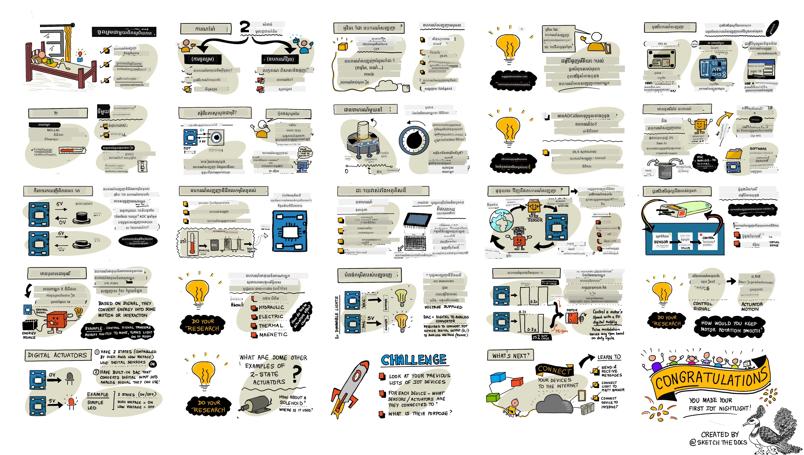
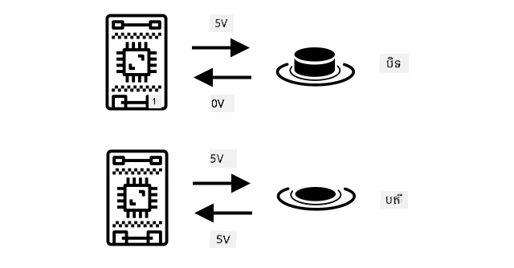
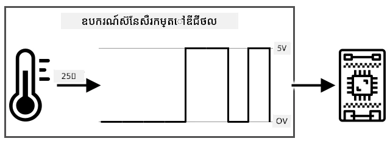
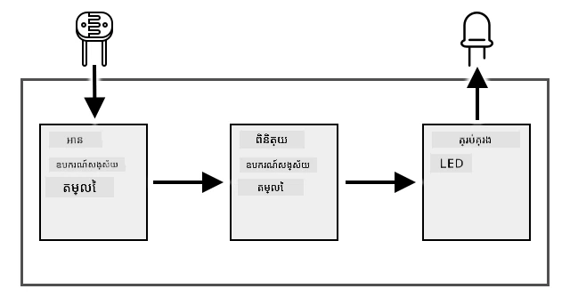
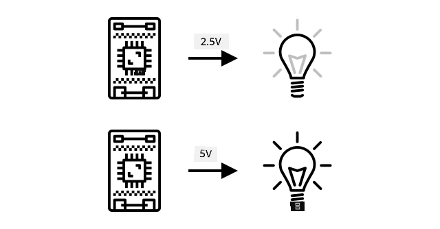
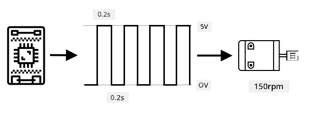
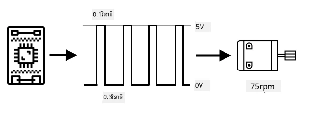
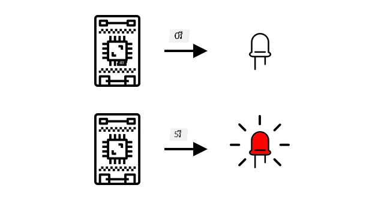

# ផ្ទះប្រតិកម្មជាមួយពិភពរូបិយវត្ថុដោយប្រើឧបករណ៍ស្វែថ៍ និងឧបករណ៍បង្ហូរ



> ស្គេតឈូកដោយ [Nitya Narasimhan](https://github.com/nitya)। ចុចលើរូបភាពសម្រាប់កំណែទំហំធំជាងនេះ។

មេរៀននេះត្រូវបានបង្រៀនជាផ្នែកមួយនៃ [ស៊េរី Hello IoT](https://youtube.com/playlist?list=PLmsFUfdnGr3xRts0TIwyaHyQuHaNQcb6-) ពី [Microsoft Reactor](https://developer.microsoft.com/reactor/?WT.mc_id=academic-17441-jabenn)។ មេរៀនត្រូវបានបង្រៀនជាវីដេអូ ២ ដង - មេរៀនរយៈពេល១ម៉ោង និងម៉ោងការិយាល័យរយៈពេល ១ ម៉ោង ស្វែងយល់ជ្រៅអំពីផ្នែកនានានៃមេរៀន និងឆ្លើយសំណួរ។

[](https://youtu.be/Lqalu1v6aF4)

[](https://youtu.be/qR3ekcMlLWA)

> 🎥 ចុចលើរូបភាពខាងលើដើម្បីមើលវីដេអូ

## ប្រឡងមុនមេរៀន

[ប្រឡងមុនមេរៀន](https://black-meadow-040d15503.1.azurestaticapps.net/quiz/5)

## ការណែនាំ

មេរៀននេះណែនាំពីគំនិតសំខាន់ពីរដែលសម្រាប់ឧបករណ៍ IoT របស់អ្នក - ឧបករណ៍ស្វែថ៍ និងឧបករណ៍បង្ហូរ។ អ្នកនឹងបានអនុវត្តជាមួយពួកវាទាំងពីរ ដោយបន្ថែមឧបករណ៍ស្វែថ៍ពន្លឺទៅក្នុងគម្រោង IoT របស់អ្នក បន្ទាប់មកបន្ថែម LED ដែលគ្រប់គ្រងដោយកម្រិតពន្លឺ ដូច្នេះក៏បង្កើតប្រភពពន្លឺរាត្រី។

ក្នុងមេរៀននេះយើងនឹងគ្របដណ្តប់៖

* [ឧបករណ៍ស្វែថ៍គឺជាអ្វី?](#ឧបករណ៍ស្វែថ៍គឺជាអ្វី)
* [ការប្រើឧបករណ៍ស្វែថ៍](#ការប្រើឧបករណ៍ស្វែថ៍)
* [ប្រភេទឧបករណ៍ស្វែថ៍](#ប្រភេទឧបករណ៍ស្វែថ៍)
* [ឧបករណ៍បង្ហូរគឺជាអ្វី?](#ឧបករណ៍បង្ហូរគឺជាអ្វី)
* [ការប្រើឧបករណ៍បង្ហូរ](#ការប្រើឧបករណ៍បង្ហូរ)
* [ប្រភេទឧបករណ៍បង្ហូរ](#ប្រភេទឧបករណ៍បង្ហូរ)

## ឧបករណ៍ស្វែថ៍គឺជាអ្វី?

ឧបករណ៍ស្វែថ៍គឺជាឧបករណ៍រឹងដែលស្វែងយល់ពីពិភពរូបិយវត្ថុ - គឺវាវាស់មួយឬច្រើនលក្ខណៈនៅជុំវិញវា ហើយផ្ញើព័ត៌មានទៅឧបករណ៍ IoT។ ឧបករណ៍ស្វែថ៍បំពាក់ជាមួយឧបករណ៍ច្រើនព្រោះមានវត្ថុខ្លះដែលអាចវាស់បាន ពីលក្ខណៈធម្មជាតិដូចជាសីតុណ្ហភាពខ្យល់ ទៅការប៉ះពាល់រូបិយវត្ថុ ដូចជាចលនា។

ឧបករណ៍ស្វែថ៍គ្រប់គ្រាន់មានដូចជា៖

* ឧបករណ៍វាស់សីតុណ្ហភាព - វាស្វែងយល់សីតុណ្ហភាពខ្យល់ ឬសីតុណ្ហភាពរបស់វត្ថុដែលវាបញ្ចូលនៅក្នុងនេះ។ សម្រាប់អ្នកចំណង់ចំណូលចិត្ត និងអ្នកអwick ការផលិតវាគឺតែងរួមបញ្ចូលជាមួយសម្ពាធខ្យល់ និងភាពសើមក្នុងឧបករណ៍ស្វែថ៍តែមួយ។
* ប៊ូតុង - វាស្វែងយល់ពេលដែលវាត្រូវបានចុច។
* ឧបករណ៍ស្វែថ៍ពន្លឺ - វាស្វែងយល់កម្រិតពន្លឺ ហើយអាចមានសម្រាប់ពណ៌ជាក់លាក់, ពន្លឺ UV, ពន្លឺ IR, ឬពន្លឺមើលឃើញទូទៅ។
* កាមេរ៉ា - វាស្វែងយល់ការតំណាងរូបភាពនៅលើពិភពដោយការថតរូប ឬផ្សាយវីដេអូ។
* ឧបករណ៍វាស់ចលនា (Accelerometers) - វាស្វែងយល់ចលនាជាច្រើនទិសដៅ។
* សម្លេងបង្ហាប់ (microphones) - វាស្វែងយល់សម្លេង ទាំងកម្រិតសម្លេងទូទៅ ឬសម្លេងទៅទិស។

✅ ស្វែងយល់ជ្រៅ។ តើទូរស័ព្ទរបស់អ្នកមានឧបករណ៍ស្វែថ៍អ្វីខ្លះ?

ឧបករណ៍ស្វែថ៍ទាំងអស់មានចំណុចមួយគ្នា - វាបម្លែងអ្វីដែលវាស្វែងយល់ទៅជាសញ្ញាអគ្គិសនី ដែលអាចត្រូវបានបកស្រាយដោយឧបករណ៍ IoT។ របៀបកំណត់សញ្ញាអគ្គិសនីនេះអាស្រ័យទាមទារនៅលើឧបករណ៍ស្វែថ៍ ដូចជាព្រោះធ្វើប្រតិបត្តិការប្រាស្រ័យដោយប្រើប្រព័ន្ធសម្ព័ន្ធប្រតិបត្តិការបានប្រើសម្រាប់ប្រាស្រ័យទាក់ទងទៅឧបករណ៍ IoT។

## ការប្រើឧបករណ៍ស្វែថ៍

អនុវត្តការណែនាំដែលពាក់ព័ន្ធខាងក្រោមក្នុងការបន្ថែមឧបករណ៍ស្វែថ៍ទៅឧបករណ៍ IoT របស់អ្នក៖

* [Arduino - Wio Terminal](wio-terminal-sensor.md)
* [កុំព្យូទ័រតែមួយផ្ទាំង - Raspberry Pi](pi-sensor.md)
* [កុំព្យូទ័រតែមួយផ្ទាំង - ឧបករណ៍វីរុច (Virtual device)](virtual-device-sensor.md)

## ប្រភេទឧបករណ៍ស្វែថ៍

ឧបករណ៍ស្វែថ៍មានប្រភេទសទិដ្ឋីមួយគឺអាណាឡុក (analog) ឬឌីជីថល (digital)។

### ឧបករណ៍ស្វែថ៍អាណាឡុក

ឧបករណ៍ស្វែថ៍មូលដ្ឋានខ្លះៗជាឧបករណ៍ស្វែថ៍អាណាឡុក។ ឧបករណ៍ស្វែថ៍ទាំងនេះទទួលតង់ស្យុងពីឧបករណ៍ IoT, ចំណុចនៃឧបករណ៍ស្វែថ៍ប្ដូរតង់ស្យុងនេះ ហើយតង់ស្យុងត្រូវបានបញ្ចេញពីឧបករណ៍ស្វែថ៍នោះត្រូវបានវាស់សម្រាប់បញ្ជាក់តម្លៃស្វែថ៍។

> 🎓 តង់ស្យុងគឺជាមាត្រដ្ឋានមួយ នៃកម្លាំងបង្កការបញ្ចេញអគ្គិសនីពីកន្លែងមួយទៅកន្លែងមួយទៀត ដូចជាពីขាតមួយយ៉ាងវិជ្ជមានទៅចំណុចវិជ្ជមានរបស់ថ្មបាទ។ ឧទាហរណ៍ ថ្មទូទៅ AA មានតង់ស្យុង ១.៥V (V ជារូបសញ្ញាសម្រាប់វ៉ុល) និងអាចបញ្ចេញអគ្គិសនីជាមួយកម្លាំង ១.៥V ពីចំណុចវិជ្ជមានទៅចំណុចអវិជ្ជមាន។ គ្រឿងម៉ាស៊ីនអគ្គិសនីខុសគ្នាតម្រូវការតង់ស្យុងខុសគ្នាសម្រាប់ដំណើរការ ឧទាហរណ៍ LED អាចភ្លឺដោយជួរតង់ស្យុង ២-៣V ប៉ុន្តែបំពង់ភ្លឺ ១០០វ៉ាតត្រូវការតង់ស្យុង ២៤០V។ អ្នកអាចអានបន្ថែមពីតង់ស្យុងនៅលើ [ទំព័រតង់ស្យុងរបស់វិគីភីឌា](https://wikipedia.org/wiki/Voltage)។

ឧទាហរណ៍មួយនៃឧបករណ៍នេះគឺ potentiometer។ វាជាដែកបង្វិលដែលអ្នកអាចបង្វិលចេញចូលរវាងទីតាំងពីរនិងឧបករណ៍ស្វែថ៍វាស់ការបង្វិលនោះ។


ឧបករណ៍ IoT នឹងផ្ញើសញ្ញាអគ្គិសនីទៅ potentiometer នៅតង់ស្យុងមួយ ដូចជា ៥ វ៉ុល (5V)។ ពេល potentiometer ត្រូវបានកំណត់ វាប្ដូរតង់ស្យុងដែលចេញពីចំហៀងផ្សេងទៀត។ សូមគិតថាអ្នកមាន potentiometer ដែលបានស្លាកដាក់ជាដែកបង្វិលពី ០ ទៅ [១១](https://wikipedia.org/wiki/Up_to_eleven) ដូចជា knob កម្រិតសំឡេងនៅលើ amplifier។ ពេល potentiometer នៅទីតាំងបិទពេញលេញ (០) តង់ស្យុង ០ វ៉ុល (០V) នឹងចេញ។ ពេលវានៅទីតាំងបើកពេញលេញ (11) តង់ស្យុង ៥ វ៉ុល (5V) នឹងចេញ។

> 🎓 នេះគ្រាន់តែជាការពិពណ៌នាផ្ទាល់យ៉ាងសាមញ្ញ ហើយអ្នកអាចអានបន្ថែមពី potentiometers និង variable resistors នៅលើ [ទំព័រ potentiometer របស់វិគីភីឌា](https://wikipedia.org/wiki/Potentiometer)។

តង់ស្យុងដែលចេញពីឧបករណ៍ស្វែថ៍នឹងត្រូវបានអ្នក IoT អាន ហើយឧបករណ៍អាចឆ្លើយតបការប្រើប្រាស់វា។ ឧបករណ៍ស្វែថ៍នីតិវិធីនេះ អាចជាតម្លៃចៃដន្យ ឬអាចផ្គូផ្គងទៅឯកតាតម្លៃស្តង់ដារមួយ។ ឧទាហរណ៍ឧបករណ៍វាស់សីតុណ្ហភាពអាណាឡុកដែលផ្អែកលើ [thermistor](https://wikipedia.org/wiki/Thermistor) នឹងប្ដូរ Resistance ដោយផ្អែកលើសីតុណ្ហភាព។ តង់ស្យុងបញ្ចេញអាចបម្លែងទៅជា សីតុណ្ហភាពក្នុងគេលវីន (Kelvin) ហើយបំលែងទៅ °C ឬ °F តាមរយៈកូដគណនា។

✅ តើអ្នកគិតថាអ្វីនឹងកើតឡើង ប្រសិនបើឧបករណ៍ស្វែថ៍ផ្ដល់តង់ស្យុងខ្ពស់ជាងតង់ស្យុងដែលបានផ្ញើ (ឧទាហរណ៍ មកពីប្រភពថាមពលខាងក្រៅ)? ⛔️ សូមកុំស៊ើបអង្កេតរឿងនេះ។

#### ការបម្លែងពីអាណាឡុកទៅឌីជីថល

ឧបករណ៍ IoT ជាឌីជីថល - វាមិនអាចដំណើរការជាមួយតម្លៃអាណាឡុកទេ វាដំណើរការជាមួយតែលេខ 0 និង 1 តែប៉ុណ្ណោះ។ មានន័យថាតម្លៃស្វែថ៍អាណាឡុកត្រូវបានបម្លែងទៅជាសញ្ញាឌីជីថល មុនពេលវាអាចដំណើរការ។ ឧបករណ៍ IoT ច្រើនមានឧបករណ៍បម្លែងអាណាឡុកទៅឌីជីថល (ADC) សម្រាប់បម្លែងបញ្ចូលអាណាឡុកទៅជា តំណាងឌីជីថលនៃតម្លៃរបស់វា។ ឧបករណ៍ស្វែថ៍អាចដំណើរការជាមួយ ADC តាមរយៈផ្ទាំងភ្ជាប់។ ឧទាហរណ៍ នៅក្នុងប្រព័ន្ធ Seeed Grove ជាមួយ Raspberry Pi ឧបករណ៍ស្វែថ៍អាណាឡុកភ្ជាប់ទៅពិន្ទុច្រកជាក់លាក់លើ 'hat' ដែលអង្គុយលើ Pi និងភ្ជាប់ទៅរ៉ូបោត GPIO របស់ Pi ហើយ hat នោះមាន ADC សម្រាប់បម្លែងតង់ស្យុងទៅជាសញ្ញាឌីជីថលដែលអាចផ្ញើចេញពីរ៉ូបោត GPIO របស់ Pi។

សូមគិតថាអ្នកមានឧបករណ៍ស្វែថ៍ពន្លឺអាណាឡុកដែលភ្ជាប់ទៅឧបករណ៍ IoT ដែលប្រើ 3.3V និងត្រឡប់តម្លៃចេញ 1V។ តង់ស្យុង 1V នេះមិនមានអត្ថន័យនៅក្នុងពិភព 0 និង 1 ទេ ដូច្នេះវាត្រូវបានបម្លែង។ តង់ស្យុងនេះនឹងត្រូវបានបម្លែងទៅតម្លៃអាណាឡុកដោយការវាស់តាមការតម្រូវរបស់ឧបករណ៍ និងស្វែថ៍។ ឧទាហរណ៍មួយមកពីឧបករណ៍ស្វែថ៍ពន្លឺ Seeed Grove ដែលអំពាវនាវតម្លៃចាប់ពី 0 ទៅ 1,023។ សម្រាប់ឧបករណ៍នេះដំណើរការនៅ 3.3V តង់ស្យុងចេញ 1V នឹងជាតម្លៃ 300។ ឧបករណ៍ IoT មិនអាចដោះស្រាយ 300 ជាតម្លៃអាណាឡុកបានទេ ដូចនេះតម្លៃនេះនឹងត្រូវបានបម្លែងទៅជា `0000000100101100` ដែលជារូបមន្តប៊៊ីណារីរបស់ 300 ដោយ Grove hat។ វានឹងត្រូវបានដំណើរការដោយឧបករណ៍ IoT។ 

✅ ប្រសិនបើអ្នកមិនស្គាល់របៀបបង្ហាញលេខជាប៊៊ីណារី សូមស្វែងយល់បន្តិចពីរបៀបតំណាងលេខជាមួយ 0 និង 1។ [មេរៀនណែនាំប៊៊ីណារីរបស់ BBC Bitesize](https://www.bbc.co.uk/bitesize/guides/zwsbwmn/revision/1) គឺជាកន្លែងល្អក្នុងការចាប់ផ្តើម។

ក្នុងប្រធានបទកម្មវិធី អ្វីៗទាំងនេះភាគច្រើនត្រូវបានគ្រប់គ្រងដោយបណ្ណាល័យដែលភ្ជាប់ជាមួយឧបករណ៍ស្វែថ៍ ដូច្នេះអ្នកមិនចាំបាច់បារម្ភអំពីការបម្លែងនេះជារបស់អ្នកឯងទេ។ សម្រាប់ឧបករណ៍ស្វែថ៍ពន្លឺ Grove អ្នកនឹងប្រើបណ្ណាល័យ Python ហើយហៅទ្រនិច `light` ឬប្រើបណ្ណាល័យ Arduino ហើយហៅ `analogRead` ដើម្បីទទួលបានតម្លៃ 300។

### ឧបករណ៍ស្វែថ៍ឌីជីថល

ឧបករណ៍ស្វែថ៍ឌីជីថល ដូចជាឧបករណ៍ស្វែថ៍អាណាឡុក វាស្វែងយល់ពីពិភពដោយប្រើប្រាស់ការប្រែប្រួលតង់ស្យុងអគ្គិសនី។ ខុសគ្នាគឺវាបញ្ចេញសញ្ញាឌីជីថល មួយនេះអាចធ្វើបានដោយវាស់តែរដ្ឋខ្ទង់ពីរឬក៏ដោយប្រើ ADC នៅក្នុងឧបករណ៍ផ្ទាល់។ ឧបករណ៍ស្វែថ៍ឌីជីថលកំពុងក្លាយជារឿងទូទៅកើនឡើង ដើម្បីជៀសវាងករណីត្រូវប្រើ ADC នៅក្នុងផ្ទាំងភ្ជាប់ ឬលើឧបករណ៍ IoT ផ្ទាល់។

ឧបករណ៍ស្វែថ៍ឌីជីថលធម្មតាសាមញ្ញគឺប៊ូតុង ឬស្វ៊ីច។ នេះគឺជាឧបករណ៍ស្វែថ៍មានរដ្ឋពីរគឺ បើក ឬបិទ។



ពិន្ទុ (Pins) លើឧបករណ៍ IoT ដូចជា GPIO អាចវាស់សញ្ញានេះផ្ទាល់ជាលេខ ០ ឬ ១។ ប្រសិនបើតង់ស្យុងដែលផ្ញើនិងតង់ស្យុងដែលត្រឡប់ជាមួយគ្នា តម្លៃដែលអានបានគឺ 1 មិនដូច្នេះទៅ តម្លៃនឹងគឺ 0។ មិនចាំបាច់បម្លែងសញ្ញាទេ វាមានតែ 0 ឬ 1 ប៉ុណ្ណោះ។

> 💁 តង់ស្យុងមិនត្រូវបញ្ចេញតម្លៃត្រឹមត្រូវពេញលេញទេ ព្រោះមុខងារពិសេសនៃឧបករណ៍មួយចំនួនមានការប្រឆាំងប្រឆាំងលើសរសៃឆ្លងបន្ទាត់ក្នុងឧបករណ៍។ ឧទាហរណ៍ GPIO យ៉ាងច្បាស់នៅលើ Raspberry Pi ដំណើរការលើ 3.3V ហើយអានតង់ស្យុងត្រឡប់ដែលលើស 1.8V ជា 1 ខណៈពេលនៅក្រោម 1.8V ជា 0។

* 3.3V ចូលទៅប៊ូតុង។ ប៊ូតុងបិទដូច្នេះ 0V ចេញ ដោយផ្ដល់តម្លៃ 0
* 3.3V ចូលទៅប៊ូតុង។ ប៊ូតុងបើកដូច្នេះ 3.3V ចេញ ដោយផ្ដល់តម្លៃ 1

ឧបករណ៍ស្វែថ៍ឌីជីថលកំពុងឆ្លាស់ តម្លៃអាណាឡុក បន្ទាប់មកបម្លែងតាម ADC នៅលើឧបករណ៍ទៅជាសញ្ញាឌីជីថល។ ឧទាហរណ៍ឧបករណ៍ស្វែថ៍សីតុណ្ហភាពឌីជីថលមិនប្រែប្រួលពីតម្រូវការនៃ thermocouple ដូចជាឧបករណ៍អាណាឡុកទេ ហើយវានឹងវាស់ការប្រែប្រួលតង់ស្យុងដែលបង្កដោយ resistance នៃ thermocouple នៅសីតុណ្ហភាពចុងក្រោយ។ ជំនួសការផ្ដល់តម្លៃអាណាឡុក ហើយទុកឱ្យឧបករណ៍ឬផ្ទាំងភ្ជាប់បម្លែងសញ្ញា វាមាន ADC ត្រូវបានបង្កើតនៅក្នុងឧបករណ៍ស្វែថ៍ ផ្ទាល់បម្លែងតម្លៃនោះហើយផ្ញើវាជាសត្វ 0 និង 1 ទៅឧបករណ៍ IoT។ 0 និង 1 ទាំងនេះនឹងផ្ញើអត្រាសញ្ញាដូចគ្នាទៅសញ្ញាឌីជីថលសម្រាប់ប៊ូតុង ដែល 1 ជាតង់ស្យុងពេញ និង 0 ជាតង់ស្យុង 0V។



ការផ្ញើទិន្នន័យឌីជីថលអនុញ្ញាតឲ្យឧបករណ៍ស្វែថ៍ក្លាយទៅស្មុគស្មាញជាងមុន និងផ្ញើទិន្នន័យលម្អិតជាងមុន រហូតដល់ទិន្នន័យបោះពុម្ពចូលសម្ងាត់សម្រាប់ឧបករណ៍ស្វែថ៍មានសុវត្តិភាព។  ឧទាហរណ៍មួយគឺកាមេរ៉ា។ នេះគឺជាឧបករណ៍ស្វែថ៍ ដែលចាប់យករូបភាព និងផ្ញើវាជាទិន្នន័យឌីជីថល រួមមានរូបភាពនោះ ជាទូទៅក្នុងទ្រង់ទ្រាយស្ងៀមស្ងាត់ដូចជា JPEG ដើម្បីឧបករណ៍ IoT អាចអានបាន។ វាពិសេសត្រូវបានផ្សាយវីដេអូដោយចាប់យករូបភាព ហើយផ្ញើនូវគ្រាប់រូបភាពពេញលេញឬជាវីដេអូតូច។

## ឧបករណ៍បង្ហូរគឺជាអ្វី?

ឧបករណ៍បង្ហូរជាឯកយ៉ាងផ្ទុយពីឧបករណ៍ស្វែថ៍ - វាបម្លែងសញ្ញាអគ្គិសនីពីឧបករណ៍ IoT របស់អ្នក ទៅនឹងប្រតិកម្មជាមួយពិភពរូបិយវត្ថុ ដូចជាបញ្ចេញពន្លឺ ឬសម្លេង ឬចល័តម៉ូទ័រ។

ឧបករណ៍បង្ហូរគ្រប់គ្រាន់មានដូចជា៖

* LED - វាបញ្ចេញពន្លឺពេលបើក
* ឯកស្បែក (Speaker) - បញ្ចេញសំឡេងដោយផ្អែកលើសញ្ញាផ្ញើពីក្រុម ពី buzzer មូលដ្ឋាន ដល់ឯកស្បែកអូឌីយោដែលអាចលេងតន្ត្រីបាន
* ម៉ូទ័រស្ដេប (Stepper motor) - បម្លែងសញ្ញាទៅជាចំនួនបង្វិលកំណត់ ដូចជា បង្វិល knob ៩០°
* Relay - ជាស្វ៊ីចដែលអាចបើក ឬបិទ ដោយសញ្ញាអគ្គិសនី។ វាអនុញ្ញាតឲ្យតង់ស្យុងតូចពីឧបករណ៍ IoT បើកតង់ស្យុងធំនៅខាងក្រៅ។
* អេក្រង់ - ជាឧបករណ៍បង្ហូរស្មុគស្មាញ និងបង្ហាញព័ត៌​មានលើការបង្ហាញជាច្រើនផ្នែក។ អេក្រង់មានពីលម្អង LED ងាយស្រួលទៅអេក្រង់វិដេអូកម្រិតខ្ពស់។

✅ ស្វែងយល់ជ្រៅ។ តើទូរស័ព្ទរបស់អ្នកមានឧបករណ៍បង្ហូរអ្វីខ្លះ?

## ការប្រើឧបករណ៍បង្ហូរ

អនុវត្តការណែនាំដែលពាក់ព័ន្ធខាងក្រោមក្នុងការបន្ថែមឧបករណ៍បង្ហូរទៅឧបករណ៍ IoT របស់អ្នក ដែលគ្រប់គ្រងដោយឧបករណ៍ស្វែថ៍ ដើម្បីបង្កើតមណ្ឌលពន្លឺរាត្រី IoT។ វានឹងប្រមូលកម្រិតពន្លឺពីឧបករណ៍ស្វែថ៍ពន្លឺ ហើយប្រើឧបករណ៍បង្ហូរដាច់ដោយ LED ដើម្បីបញ្ចេញពន្លឺពេលកម្រិតពន្លឺគេរកឃើញទាបពេក។



* [Arduino - Wio Terminal](wio-terminal-actuator.md)
* [កុំព្យូទ័រតែមួយផ្ទាំង - Raspberry Pi](pi-actuator.md)
* [កុំព្យូទ័រតែមួយផ្ទាំង - ឧបករណ៍វីរុច (Virtual device)](virtual-device-actuator.md)

## ប្រភេទឧបករណ៍បង្ហូរ

ដូចជា ឧបករណ៍ស្វែថ៍ ឧបករណ៍បង្ហូរមានប្រភេទអាណាឡុក ឬឌីជីថល។

### ឧបករណ៍បង្ហូរអាណាឡុក

ឧបករណ៍បង្ហូរអាណាឡុកទទួលសញ្ញាអាណាឡុក ហើយបម្លែងទៅជាប្រតិកម្ម មួយដែលប្រតិកម្មនឹងផ្លាស់ប្ដូរតាមតង់ស្យុងដែលផ្តល់។


ឧទាហរណ៍​មួយ​គឺ​ជា​អំពូល​អាច​កែ​បាន​ពន្លឺ ដូច​ជាអំពូល​ដែល​អ្នក​ខ្លះ​អាច​មាន​នៅក្នុង​ផ្ទះ​របស់​អ្នក។ បរិមាណ​វ៉ុល​វ៉ាល់​ដែល​ផ្គត់ផ្គង់​ទៅកាន់​អំពូល កំណត់​ថា​វា​បំភ្លឺ​ប៉ុណ្ណា។



ដូច​ជា​ជាមួយ​ឧបករណ៍​ស៊ិន​ស័រ​ណ៍ ហើយ​ឧបករណ៍ IoT ពិតប្រាកដ​ធ្វើការ​លើ​សញ្ញា​ឌីជីថល មិនមែន​សញ្ញា​អាណា​ឡូក​ទេ។ នេះ​មានន័យ​ថា​ដើម្បី​បញ្ជូន​សញ្ញា​អាណា​ឡូក​ ឧបករណ៍ IoT ត្រូវ​ការ​អ្នក​បម្លែង​ឌីជីថល​ទៅ​អាណា​ឡូក (DAC) ដែល​អាច​មាន​លើ​ឧបករណ៍ IoT ផ្ទាល់ ឬ​លើ​បន្ទះ​កុង​តាក់​ត័រ។ វានឹង​បម្លែង 0 និង 1 ពី​ឧបករណ៍ IoT ជាវ៉ុល​អាណា​ឡូក ដែល​អ្នក​ប្រតិបត្តិ​អាច​ប្រើបាន។

✅ តើ​អ្នក​គិត​ថា​អ្វី​ជា​អ្វី​មើល​ឃើញ​បើ​ឧបករណ៍ IoT បញ្ជូន​វ៉ុលខ្ពស់​ជាង​អ្វី​ដែល​អ្នក​ប្រតិបត្តិ​អាច​ទទួលបាន?
⛔️ មិន​ត្រូវ​តេស្ត​វា​ឡើយ។

#### ការបង្ហាញ​រយៈ​ពេល​ពុលស៍ (Pulse-Width Modulation)

ជម្រើស​មួយ​ទៀត​សម្រាប់​បម្លែង​សញ្ញា​ឌីជីថល​ពី​ឧបករណ៍ IoT ទៅ​ជា​សញ្ញា​អាណា​ឡូក​គឺ​ការបង្ហាញ​រយៈ​ពេល​ពុលស៍។ វា​ពាក់ព័ន្ធ​នឹង​ការ​បញ្ជូន​ពុលស៍​ឌីជីថល​ខ្លី​ច្រើន ដូច​ជា​វា​ជា​សញ្ញា​អាណា​ឡូក។

ឧទាហរណ៍ អ្នក​អាច​ប្រើ PWM ដើម្បី​គ្រប់គ្រង​ល្បឿន​ម៉ូទ័រ។

សូមគិតថា អ្នកកំពុងគ្រប់គ្រង​ម៉ូទ័រ​មួយ​ដោយ​ផ្គត់ផ្គង់ 5V។ អ្នក​បញ្ជូន​ពុលស៍​ខ្លី​មួយ​ទៅ​ម៉ូទ័រ រួច​ប្ដូរ​វ៉ុល​ទៅ​ខ្ពស់ (5V) រយៈពេលពីររយភាគមួយ​នៃ​មួយ​វិនាទី (0.02s)។ ក្នុង​ពេលនេះ ម៉ូទ័រ​របស់​អ្នក​អាច​បង្វិល​បាន ១ រយភាគដំបូងនៃ​ការ​បង្វិល (0.1 មួយ​បង្វិល) ឬ 36°។ បន្ទាប់​ពី​នោះ​សញ្ញា​ឈប់​សម្រាក​សម្រាប់ពីររយភាគមួយ​នៃ​មួយ​វិនាទី (0.02s) បញ្ជូន​សញ្ញា​ទាប (0V)។ មួយ​វដ្ត​ផ្ទាល់​គ្នា​ពី​បើក​បិទ​នេះ រយៈពេល 0.04s។ វដ្ត​នេះ​បន្ដ​ទៀត។



មានន័យថា ក្នុង​មួយ​វិនាទី អ្នក​មាន 25 ពុលស៍ 5V ជា​រយៈពេល 0.02s ដែល​បង្វិល​ម៉ូទ័រ មួយ​ពុលស៍​តាម​មួយ​ពុលស៍​បន្ទាប់បន្ដ​ដោយ​​សម្រាក 0.02s ជា​សញ្ញា 0V មិន​បង្វិល​ម៉ូទ័រ។ មួយ​ពុលស៍​បង្វិល​ម៉ូទ័រ ១ រយភាគនៃ​ការ​បង្វិល មាន​អត្ថន័យ​ថា​ម៉ូទ័រ​បញ្ចប់​ការ​បង្វិល 2.5 ជុំ​ក្នុង​មួយ​វិនាទី។ អ្នក​បាន​ប្រើ​សញ្ញា​ឌីជីថល​ដើម្បី​បង្វិល​ម៉ូទ័រ​នៅ 2.5 ជុំ​ក្នុង​មួយ​វិនាទី ឬ 150 [ជុំ​ក្នុង​មួយ​នាទី](https://wikipedia.org/wiki/Revolutions_per_minute) (ជាម៉ោង​វាស់​ល្បឿន​បង្វិល​មិនស្តង់ដារ)។

```output
25 pulses per second x 0.1 rotations per pulse = 2.5 rotations per second
2.5 rotations per second x 60 seconds in a minute = 150rpm
```

> 🎓 នៅ​ពេល​សញ្ញា PWM បើក​សម្រាប់​ពាក់កណ្តាល​ពេលវេលា ហើយ​បិទ​សម្រាប់​ពាក់កណ្តាល​វេលា នេះ​ហៅ​ថា [ប្រាក់​ការងារ ៥០%](https://wikipedia.org/wiki/Duty_cycle)។ ប្រាក់​ការងារ​ត្រូវបាន​គេ​វាស់​ជា​ភាគ​រយ​ពេល​ដែល​សញ្ញា​នៅ​ស្ថានភាព​បើក ប្រៀបធៀប​នឹង​បិទ។



អ្នក​អាច​ប្រែប្រួល​ល្បឿន​ម៉ូទ័រ​ដោយ​ការ​ប្រែកម្មវិធី​ទំហំ​ពុលស៍។ ឧទាហរណ៍ ជាមួយ​ម៉ូទ័រ​ដូចគ្នា អ្នក​អាច​រក្សា​ពេលវេលា​នៃ​វដ្ត 0.04s ដដែល ដោយ​ធ្វើឲ្យ​ពុលស៍​បើក​ត្រឹម 0.01s ហើយ​ពុលស៍​បិទ​បង្កើន​ទៅជា 0.03s។ អ្នក​មាន​ចំនួន​ពុលស៍ ក្នុងមួយ​វិនាទី​ដដែល (25) ប៉ុន្តែ​មួយ​ពុលស៍ បើក​មាន​ប្រវែង​សីុ​មួយ​ង្វះ។ ពុលស៍ ប្រវែង​១​ង្វះ​បង្វិល​ម៉ូទ័រ ១ រយភាគពីរ នៃ​ការ​បង្វិល ហើយ​ក្នុង​មួយ​វិនាទី 25 ពុលស៍​នឹង​បញ្ចប់​ការ​បង្វិល 1.25 ជុំ ឬ 75rpm។ ដោយ​ប្ដូរ​ល្បឿន​ពុលស៍​នៃ​សញ្ញា​ឌីជីថល អ្នក​បាន​កាត់​បន្ថយ​ល្បឿន​ម៉ូទ័រ​អាណាឡូក។

```output
25 pulses per second x 0.05 rotations per pulse = 1.25 rotations per second
1.25 rotations per second x 60 seconds in a minute = 75rpm
```

✅ តើ​អ្នក​ធ្វើ​ដូចម្តេច​ដើម្បី​ឲ្យ​ការ​បង្វិល​ម៉ូទ័រ​ឈរជ្រៅ ជាពិសេស​ពេល​ល្បឿន​ទាប? តើ​អ្នក​នឹង​ប្រើ​ចំនួន​ប៉ុន្មាន​នៃ​ពុលស៍​ដ៏វែង​ជាមួយ​ការ​ឈប់រយៈពេល​វែង ឬ​ច្រើន​នៃ​ពុលស៍​ខ្លី​ជាមួយ​ការ​ឈប់​វែង​ខ្លី?

> 💁 ឧបករណ៍​ស៊ិន​ស័រ​ខ្លះ ក៏​ប្រើ PWM ដែរ ដើម្បី​បម្លែង​សញ្ញា​អាណា​ឡូក​ទៅ​សញ្ញា​ឌីជីថល។

> 🎓 អ្នក​អាច​អាន​បន្ថែម​អំពី​ការ​បង្ហាញ​រយៈ​ពេល​ពុលស៍​នៅលើ [ទំព័រ​បង្ហាញ​រយៈ​ពេល​ពុលស៍​ក្នុង​វិគីភីឌា](https://wikipedia.org/wiki/Pulse-width_modulation)។

### អ្នក​ប្រតិបត្តិ​ឌីជីថល

អ្នក​ប្រតិបត្តិ​ឌីជីថល ដូច​ជា​ស៊ិន​ស័រ​ឌីជីថល មាន​ស្ថានភាព​ពីរ​ដែល​បាន​គ្រប់គ្រង​ដោយ​វ៉ុល​ខ្ពស់ ឬ ទាប ឬ​មាន DAC បំពាក់​មកជាមួយ ដូច្នេះ​អាច​បម្លែង​សញ្ញា​ឌីជីថល​ទៅជា​អាណា​ឡូក​បាន។

អ្នក​ប្រតិបត្តិ​ឌីជីថល​សាមញ្ញ​មួយ​គឺ LED។ នៅពេល​ឧបករណ៍​បញ្ជូន​សញ្ញា​ឌីជីថល 1 វ៉ុល​ខ្ពស់​ត្រូវ​បាន​បញ្ជូន​ដើម្បី​បំភ្លឺ LED។ នៅពេល​បញ្ជូន​សញ្ញា 0 វ៉ុល​នឹង​​ចុះ​ទៅ 0V ហើយ LED បិទ។



✅ តើ​អ្នក​គិត​ថា​មាន​អ្នក​ប្រតិបត្តិ​ពីរ​ស្ថានភាព​សាមញ្ញ​ផ្សេងទៀត​ជា​អ្វី​ទៀត? ឧទាហរណ៍​មួយ​គឺ សូលិនូអ៊ីដ ដែល​ជា​ម៉ាញេទិច​គីមី​ដែល​អាច​ផ្ដល់​សកម្មភាព​ដូច​ជា​ការ​ដឹក​ប៊ុល​តូផ្ទាំង​ទូរ បើក/បិទ ខ្ទុកទ្វារ។

អ្នកប្រតិបត្តិ​ឌីជីថល​កម្រិត​ខ្ពស់​បន្ថែម ដូច​ជា​អេក្រង់ ត្រូវ​តែ​បញ្ជូន​ទិន្នន័យ​ឌីជីថល​នៅ​ទំ​រង់​សមរម្យ។ ពួកវា​ធម្មតាមក​ជាមួយ​បណ្ណាល័យ ដែលធ្វើអោយងាយស្រួលក្នុងការបញ្ជូន​ទិន្នន័យ​ត្រឹមត្រូវ​ដើម្បី​គ្រប់គ្រង​ពួកវា។

---

## 🚀 thách thức

ការប្រកួតប្រជែង​ក្នុង​មេរៀន​កន្លងមក គឺ​បញ្ជី​ឧបករណ៍ IoT ច្រើន​ប៉ុណ្ណា​ដែល​អ្នកអាចរកឃើញ​នៅក្នុង​ផ្ទះ សាលា ឬ​កន្លែង​ធ្វើការ ហើយ​កំណត់ថា​ពួកវា​ត្រូវ​បាន​បង្កើត​ជុំវិញ​មីក្រូក្រង់​បញ្ជា ឬ​កុំព្យូទ័រ​តែមួយ​បន្ទះ ឬ​ជា​ការ​ចម្រុះ​គ្នា។

សម្រាប់​ឧបករណ៍​ទាំងអស់​ដែល​អ្នក​បាន​បញ្ជី វា​តភ្ជាប់​ជាមួយ​​ស៊ិន​ស័រ និង​អ្នក​ប្រតិបត្តិ​អ្វីខ្លះ? គោលបំណង​នៃ​ស៊ិន​ស័រ និង​អ្នក​ប្រតិបត្តិ​ដែល​ភ្ជាប់ជាមួយ​ឧបករណ៍​ទាំងនេះ​ជា​អ្វី?

## កម្រង​សំណួរ​បន្ទាប់​មេរៀន

[Post-lecture quiz](https://black-meadow-040d15503.1.azurestaticapps.net/quiz/6)

## ការត្រួតពិនិត្យ និង សិក្សាផ្ទាល់ខ្លួន

* អាន​អំពី​អគ្គិសនី និង សៀគ្វី នៅលើ [ThingLearn](http://thinglearn.jenlooper.com/curriculum/)។
* អាន​អំពី​ប្រភេទស៊ិន​ស័រ​តម្លាភាព​ផ្សេងៗ នៅលើ [មេរៀន​អ្នកដឹកនាំ​ស៊ិន​ស័រ​តម្លាភាព Seeed Studios](https://www.seeedstudio.com/blog/2019/10/14/temperature-sensors-for-arduino-projects/)
* អាន​អំពី LED នៅលើ [ទំព័រ LED នៅវិគីភីឌា](https://wikipedia.org/wiki/Light-emitting_diode)

## មុខងារ

[ស្រាវ​ជ្រាវ​អំពី​ស៊ិន​ស័រ និង​អ្នក​ប្រតិបត្តិ](assignment.md)

---

<!-- CO-OP TRANSLATOR DISCLAIMER START -->
**ការបដិសេធ**៖
ឯកសារនេះត្រូវបានបកប្រែដោយប្រើសេវាកម្មបកប្រែ AI [Co-op Translator](https://github.com/Azure/co-op-translator)។ ខណៈពេលយើងខិតខំសម្រាប់ភាពត្រឹមត្រូវ សូមបានជ្រាបថាការបកប្រែដោយស្វ័យប្រវត្តិអាចមានកំហុសឬការខុសឆ្គង។ ឯកសារដើមនៅក្នុងភាសាដើមគួរត្រូវបានគិតថាជា աղբទិន្នន័យអំណាចបំផុត។ សម្រាប់ព័ត៌មានសំខាន់ៗ សូមណែនាំឱ្យប្រើការបកប្រែដោយមនុស្សដែលមានជំនាញវិជ្ជាជីវៈ។ យើងមិនទទួលខណៈពេលឧបត្ថម្ភចំពោះការយល់ច្រឡំនិងការបកប្រែខុសពីការប្រើប្រាស់ការបកប្រែនេះឡើយ។
<!-- CO-OP TRANSLATOR DISCLAIMER END -->