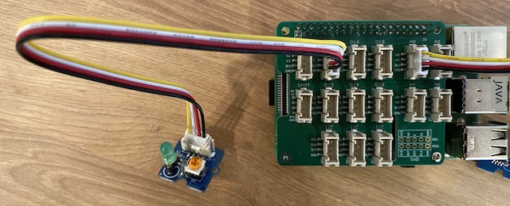

# សាងសង់ភ្លើងបន្ទប់យប់ - Raspberry Pi

នៅផ្នែកនេះនៃบทเรียน អ្នកនឹងបន្ថែម LED ទៅកាន់ Raspberry Pi របស់អ្នក ហើយប្រើវាដើម្បីបង្កើតភ្លើងបន្ទប់យប់។

## ឧបករណ៍រឹង

ភ្លើងបន្ទប់យប់ឥឡូវនេះត្រូវការឧបករណ៍បញ្ចូនសញ្ញា។

ឧបករណ៍បញ្ចូនសញ្ញាទៅគឺជា **LED** មួយ [light-emitting diode](https://wikipedia.org/wiki/Light-emitting_diode) ដែលបញ្ចេញពន្លឺនៅពេលមានចរន្តរត់តាមវា។ នេះគឺជាឧបករណ៍បញ្ចូនសញ្ញាស៊េរីដែលមានស្ថានភាពចំនួន 2 គឺ បើក និង បិទ។ ការផ្ញើតម្លៃ 1 នឹងបើក LED ហើយ 0 នឹងបិទវា។ LED គឺជាឧបករណ៍បញ្ចូនសញ្ញាប្រភេទ Grove ដែលត្រូវបានភ្ជាប់ទៅកាន់ក្បាល Grove Base នៅលើ Raspberry Pi។

ហេតុផលនៃការតភ្ជាប់ភ្លើងបន្ទប់យប់ជា pseudo-code គឺ៖

```output
Check the light level.
If the light is less than 300
    Turn the LED on
Otherwise
    Turn the LED off
```

### តភ្ជាប់ LED

LED Grove មាននៅក្នុងម៉ូឌុលមួយជាមួយនឹងជម្រើសរបស់ LED ដែលអាចជ្រើសរើសពណ៌បាន។

#### បេសកកម្ម - តភ្ជាប់ LED

តភ្ជាប់ LED ។


1. ជ្រើសរើស LED ដែលអ្នកចូលចិត្ត ហើយដាក់ខ្សែជើងចូលទៅក្នុងរន្ទះពីរនៃម៉ូឌុល LED ។

    LED គឺជាឌាយអុីតដែលបញ្ចេញពន្លឺ ហើយឌាយអុីតគឺជាឧបករណ៍អេឡិចត្រូនិចមួយដែលអាចនាំចរន្តបានត្រឹមតែទិសដៅមួយ។ នេះមានន័យថា LED ត្រូវតែតភ្ជាប់ត្រឹមត្រូវ ប្រសិនបើមិនដូច្នោះវានឹងមិនដំណើរការទេ។

    មួយក្នុងចំណោមខ្សែជើងរបស់ LED គឺជាគ្រាប់អវិជ្ជមាន (positive pin) ហើយមួយទៀតគឺជាគ្រាប់អវិជ្ជមាន (negative pin)។ LED មិនមែនជា វត្តមត្រូវនោះទេ ហើយវាត្រូវបានបតបែនស្តាំតិចមួយខ្នងនៅម្ខាង។ ម្ខាងដែលបតបែនស្រួលនោះគឺគ្រាប់អវិជ្ជមាន។ នៅពេលអ្នកភ្ជាប់ LED ទៅម៉ូឌុល សូមប្រាកដថាគ្រាប់ជាមួយផ្នែកមូលត្រូវបានភ្ជាប់ទៅលើស្វុច​ម៉ាតឈ្មោះ **+** នៅខាងក្រៅម៉ូឌុល ហើយផ្នែកបតបែនតិចត្រូវបានភ្ជាប់ទៅស្វុចជិតកណ្ដាលម៉ូឌុល។

1. ម៉ូឌុល LED មានប៊ូតុងបង្វិលមួយដែលអនុញ្ញាតឱ្យអ្នកគ្រប់គ្រងការតុបតែងពន្លឺ។ ជុំវិញវាចុះបន្ថយដល់ចំនុចដំបូងដោយបង្វិលនោះទិសវិញនោះដោយប្រើក្រចក Phillips ដែលតូច។

1. ដាក់ចុងខ្លះនៃខ្សែ Grove មួយចូលទៅក្នុងស្វុចនៅលើម៉ូឌុល LED។ វានឹងត្រូវបញ្ចូលតែមួយទិសគត់។

1. នៅពេល Raspberry Pi បិទថាមពល សូមភ្ជាប់ចុងខ្វះនៃខ្សែ Grove ទៅកាន់ស្វុចឌីជីថលដែលមានស្លាប់ **D5** នៅលើក្បាល Grove Base ដែលភ្ជាប់ទៅ Pi ។ ស្វុចនេះជាស្វុចទីពីរពីខាងឆ្វេង នៅជួរនៃស្វុចជាប់ជាមួយភីន GPIO ។



## កម្មវិធីភ្លើងបន្ទប់យប់

ភ្លើងបន្ទប់យប់ឥឡូវនេះអាចត្រូវបានកម្មវិធីដោយប្រើឧបករណ៍ចាប់ពន្លឺ Grove និង LED Grove។

### បេសកកម្ម - កម្មវិធីភ្លើងបន្ទប់យប់

កម្មវិធីភ្លើងបន្ទប់យប់។

1. ដំណើរការ Pi ហើយរង់ចាំវាឱ្យបើកឡើង

1. បើកគម្រោងភ្លើងបន្ទប់យប់ក្នុង VS Code ដែលអ្នកបានបង្កើតនៅផ្នែកមុននៃបេសកកម្មនេះ ខណៈយោងដំណើរការត្រង់លើ Pi ឬភ្ជាប់តាមបន្ថែម Remote SSH ។

1. បន្ថែមកូដដូចតទៅទៅក្នុងឯកសារ `app.py` ដើម្បីនាំចូលបណ្ណាល័យតម្រូវការ។ វាគួរត្រូវបានបន្ថែមនៅកំពូលក្រោមបន្ទាត់ `import` ផ្សេងទៀត។

    ```python
    from grove.grove_led import GroveLed
    ```

    ពាក្យបញ្ជា `from grove.grove_led import GroveLed` នាំចូល `GroveLed` ពីបណ្ណាល័យ Grove Python។ បណ្ណាល័យនេះមានកូដរួមសម្រាប់បន្តរោលជាមួយ LED Grove។

1. បន្ថែមកូដដូចតទៅបន្ទាប់ពីការប្រកាស `light_sensor` ដើម្បីបង្កើតអត្ថិប័ត្រមួយនៃថ្នាក់ដែលគ្រប់គ្រង LED៖

    ```python
    led = GroveLed(5)
    ```

    បន្ទាត់ `led = GroveLed(5)` បង្កើតអត្ថិប័ត្រថ្នាក់ `GroveLed` ដែលភ្ជាប់ទៅភីន **D5** - ភីន Grove ឌីជីថលដែល LED ត្រូវបានភ្ជាប់។

    > 💁 ស្វុចទាំងអស់មានលេខភីនផ្សេងគ្នា។ ភីន 0, 2, 4 និង 6 គឺជាភីនអាណាឡុក ភីន 5, 16, 18, 22, 24 និង 26 គឺជាភីនឌីជីថល។

1. បន្ថែមការត្រួតពិនិត្យមួយនៅក្នុងរង្វង់ `while` ហើយមុន `time.sleep` ដើម្បីពិនិត្យកម្រិតពន្លឺ ហើយបើក ឬបិទ LED៖

    ```python
    if light < 300:
        led.on()
    else:
        led.off()
    ```

    កូដនេះពិនិត្យតម្លៃ `light` ប្រសិនបើតម្លៃនេះតិចជាង 300 វានឹងហៅមេតូដ `on` នៃថ្នាក់ `GroveLed` ដែលផ្ញើតម្លៃឌីជីថល 1 ទៅ LED បើកវា។ ប្រសិនបើតម្លៃពន្លឺធំជាងឬស្មើ 300 វានឹងហៅមេតូដ `off` ដែលផ្ញើតម្លៃឌីជីថល 0 ទៅ LED បិទវា។

    > 💁 កូដនេះគួរត្រូវបានបង្រួមនៅកម្រិតដូច `print('Light level:', light)` ដើម្បីមានទីតាំងក្នុងរង្វង់ while!

    > 💁 នៅពេលផ្ញើតម្លៃឌីជីថលទៅឧបករណ៍បញ្ចូនសញ្ញា តម្លៃ 0 ជារថ្ម 0V ហើយតម្លៃ 1 ជាវ៉ុលត្រូវបំផុតសម្រាប់ឧបករណ៍។ សម្រាប់ Raspberry Pi ជាមួយឧបករណ៍ Grove ចំនាយ 1 គឺ 3.3V ។

1. ពី Terminal របស់ VS Code រត់បញ្ជាដូចខាងក្រោមដើម្បីរត់កម្មវិធី Python របស់អ្នក៖

    ```sh
    python3 app.py
    ```

    តម្លៃពន្លឺនឹងត្រូវបង្ហាញនៅលើកុងសូល។

    ```output
    pi@raspberrypi:~/nightlight $ python3 app.py 
    Light level: 634
    Light level: 634
    Light level: 634
    Light level: 230
    Light level: 104
    Light level: 290
    ```

1. បិទ និងបើកឧបករណ៍ចាប់ពន្លឺ។ ហេតុជាចោល LED នឹងបំភ្លឺប្រសិនបើកម្រិតពន្លឺគឺ 300 ឬតិចជាង ហើយបិទពេលកម្រិតពន្លឺធំជាង 300 ។ 

    > 💁 ប្រសិនបើ LED មិនបើក សូមប្រាកដថាវាត្រូវបានភ្ជាប់ត្រឹមត្រូវ ហើយប៊ូតុងបង្វិលត្រូវបានដាក់ជំពូកពេញ។


> 💁 អ្នកអាចរកឃើញកូដនេះនៅក្នុងថត [code-actuator/pi](../../../../../1-getting-started/lessons/3-sensors-and-actuators/code-actuator/pi)។

😀 កម្មវិធីភ្លើងបន្ទប់យប់របស់អ្នកបានជោគជ័យ!

---

<!-- CO-OP TRANSLATOR DISCLAIMER START -->
**ការបដិសេធ**៖  
ឯកសារនេះត្រូវបានបំលែងភាសាដោយប្រើសេវាកម្មបំលែងភាសា AI [Co-op Translator](https://github.com/Azure/co-op-translator)។ ទោះជាយើងខិតខំប្រឹងប្រែងដើម្បីភាពត្រឹមត្រូវ ក៏សូមយល់ឲ្យបានថាបំលែងភាសាដោយស្វ័យប្រវត្តិក្នុងករណីមួយចំនួនអាចមានកំហុស ឬភាពមិនត្រឹមត្រូវ។ ឯកសារដើមនៅក្នុងភាសាមួយដើមគេគួរត្រូវបានចាត់ទុកថាជាមូលដ្ឋានទិន្នន័យដែលមានសុពលភាព។ សម្រាប់ព័ត៌មានសំខាន់ៗ សូមផ្តល់អនុសាសន៍ឱ្យមានការបំលែងភាសាដោយមនុស្សជំនាញ។ យើងមិនទទួលខុសត្រូវចំពោះការយល់ច្រឡំនា ឬការបកស្រាយមិនត្រឹមត្រូវ ដែលមានមូលហេតុចេញពីការប្រើប្រាស់បំលែងភាសានេះឡើយ។
<!-- CO-OP TRANSLATOR DISCLAIMER END -->