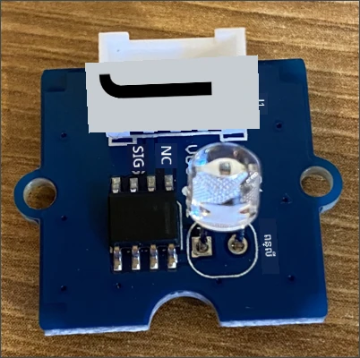
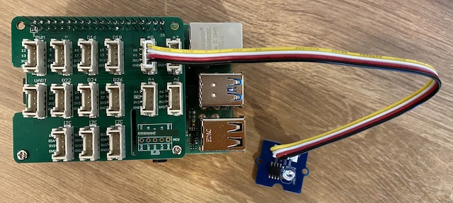

# បង្កើតភ្លើងរាត្រី - Raspberry Pi

នៅក្នុងផ្នែកនេះនៃមេរៀន អ្នកនឹងបន្ថែមខ្សែប្រសាទពន្លឺទៅកាន់ Raspberry Pi របស់អ្នក។

## ទំព័រឧបករណ៍

ខ្សែប្រសាទសម្រាប់មេរៀននេះគឺជាខ្សែពន្លឺ ដែលប្រើ [photodiode](https://wikipedia.org/wiki/Photodiode) ដើម្បីបម្លែងពន្លឺទៅជាសញ្ញាអាគុយ។ នេះគឺជាឧបករណ៍កាំរស្មីវិញ្ញាបនបត្រដែលផ្ញើតម្លៃគត់ពី 0 ទៅ 1,000 ដែលបង្ហាញពីចំនួនពន្លឺដែលជាភាគរយដែលមិនទាក់ទងទៅនឹងឯកតាមาต្រដ្ឋានណាមួយដូចជា [lux](https://wikipedia.org/wiki/Lux)។

ខ្សែពន្លឺគឺជាឧបករណ៍ Grove ខាងក្រៅ ហើយត្រូវតែភ្ជាប់ទៅកាន់បាស Grove ប្រភេទ Base hat នៅលើ Raspberry Pi ។

### ភ្ជាប់ខ្សែពន្លឺ

ខ្សែ Grove ដែលប្រើសម្រាប់រកមើលកម្រិតពន្លឺ ត្រូវតែភ្ជាប់ទៅកាន់ Raspberry Pi។

#### ការងារ - ភ្ជាប់ខ្សែពន្លឺ

ភ្ជាប់ខ្សែពន្លឺ



1. ដាក់ចុងមួយនៃខ្សែ Grove ចូលទៅក្នុងរន្ធនៅលើម៉ូឌុលខ្សែពន្លឺ។ វានឹងបញ្ចូលបានតែមាត្រាម្យ៉ាងទេ។

1. ពេល Raspberry Pi មិនដំណើរការ សូមភ្ជាប់ចុងខ្សែក្រោយនៃខ្សែ Grove ទៅកាន់រន្ធអាឡូហ្គោន្ថែម A0 នៅលើ Grove Base hat ដែលភ្ជាប់នឹង Pi ។ រន្ធនេះគឺជារន្ធទីពីរពីឆ្វេង នៅក្នុងជួររន្ធនៅក្បែរពីប៉ាំង GPIO ។



## បញ្ចូលកម្មវិធីសម្រាប់ខ្សែពន្លឺ

ឧបករណ៍ឥឡូវនេះអាចត្រូវបានព្យាយាមបញ្ចូលកម្មវិធីដោយប្រើ Grove ខ្សែពន្លឺ។

### ការងារ - បញ្ចូលកម្មវិធីខ្សែពន្លឺ

បញ្ចូលកម្មវិធីឧបករណ៍។

1. បើក Pi និងរងចាំរហូតដល់វាធ្វើការចាប់ផ្តើមបញ្ចប់។

1. បើកគម្រោង nightlight នៅក្នុង VS Code ដែលអ្នកបានបង្កើតនៅផ្នែកមុននៃវគ្គនេះ មិនថាដាក់ដំណើរការតាមផ្ទាល់លើ Pi ឬតាមរយៈ Remote SSH extension។

1. បើកឯកសារ `app.py` ហើយលុបកូដទាំងអស់អូសចេញពីវា។

1. បន្ថែមកូដដូចខាងក្រោមទៅក្នុងឯកសារ `app.py` ដើម្បីនាំចូលបណ្ណាល័យទាមទារ:

    ```python
    import time
    from grove.grove_light_sensor_v1_2 import GroveLightSensor
    ```

    ពាក្យបញ្ជា `import time` នាំចូលម៉ូឌុល `time` ដែលនឹងត្រូវបានប្រើបន្ទាប់ក្នុងវគ្គនេះ។

    ពាក្យបញ្ជា `from grove.grove_light_sensor_v1_2 import GroveLightSensor` នាំចូល `GroveLightSensor` ពីបណ្ណាល័យ Grove Python។ បណ្ណាល័យនេះមានកូដសម្រាប់ធ្វើការជាមួយខ្សែ Grove light sensor ហើយត្រូវបានដំឡើងជាសកលនៅពេលបង្កើត Pi។

1. បន្ថែមកូដដូចខាងក្រោមបន្ទាប់ពីកូដខាងលើដើម្បីបង្កើតអថេរប្រភេទ class ដែលគ្រប់គ្រងខ្សែពន្លឺនេះ៖

    ```python
    light_sensor = GroveLightSensor(0)
    ```

    ជួរឈរលេខ `light_sensor = GroveLightSensor(0)` បង្កើតនាឡិកាអត្ថាធិប្បាយនៃ class `GroveLightSensor` ភ្ជាប់ទៅ pin **A0** - pin Grove analog ដែលខ្សែពន្លឺភ្ជាប់ទៅ។

1. បន្ថែមច្រើនលូលជាន់មួយបន្ទាប់ពីកូដខាងលើ ដើម្បីសំរាប់វិភាគតម្លៃខ្សែពន្លឺ និងបោះពុម្ពវានៅលើកុងសូល៖

    ```python
    while True:
        light = light_sensor.light
        print('Light level:', light)
    ```

    នេះនឹងអានកម្រិតពន្លឺបច្ចុប្បន្នលើផ្នែកតារាងពី 0 ទៅ 1,023 ដែលប្រើពីគុណលក្ខណៈ `light` របស់ class `GroveLightSensor`។ គុណលក្ខណៈនេះអានតម្លៃ analog ពី pin ។ បន្ទាប់មកតម្លៃនេះត្រូវបានបោះពុម្ពចេញកុងសូល។

1. បន្ថែមការគេងតិចមួយរយៈ ១ វិនាទីនៅចុង `loop` ពីព្រោះកម្រិតពន្លឺមិនត្រូវបានត្រួតពិនិត្យជាបន្តបន្ទាប់ទេ។ ការគេងនេះកាត់បន្ថយការប្រើថាមពលរបស់ឧបករណ៍។

    ```python
    time.sleep(1)
    ```

1. ពី Terminal VS Code ចុចដំណើរការកម្មវិធី Python របស់អ្នក៖

    ```sh
    python3 app.py
    ```

    តម្លៃពន្លឺនឹងត្រូវបង្ហាញនៅលើកុងសូល។ សូមលាក់ និង បង្ហាញខ្សែ Grove light sensor ហើយតម្លៃនឹងផ្លាស់ប្តូរ៖

    ```output
    pi@raspberrypi:~/nightlight $ python3 app.py 
    Light level: 634
    Light level: 634
    Light level: 634
    Light level: 230
    Light level: 104
    Light level: 290
    ```

> 💁 អ្នកអាចស្វែងរកកូដនេះនៅក្នុងថត [code-sensor/pi](../../../../../1-getting-started/lessons/3-sensors-and-actuators/code-sensor/pi) ។

😀 ការបន្ថែមខ្សែគុណភាពទៅកម្មវិធី nightlight របស់អ្នកគឺជាការជោគជ័យ!

---

<!-- CO-OP TRANSLATOR DISCLAIMER START -->
**ការបញ្ចាក់**៖  
ឯកសារនេះត្រូវបានបកប្រែដោយប្រើសេវាបកប្រែ AI [Co-op Translator](https://github.com/Azure/co-op-translator)។ ខណៈពេលដែលយើងខិតខំក្នុងការផ្តល់នូវភាពត្រឹមត្រូវ សូមយល់ដឹងថាការបកប្រែដោយស្វ័យប្រវត្តិនោះអាចមានកំហុស ឬការខុសប្លែក។ ឯកសារដើមក្នុងភាសាមាតុភូមិគួរត្រូវបានពិចារណាឲ្យជាឯកសារដែលមានសិទ្ធិច្បាស់លាស់។ សម្រាប់ព័ត៌មានសំខាន់ សូមអនុញ្ញាតឲ្យមានការបកប្រែដោយមនុស្សជាអ្នកជំនាញ។ យើងមិនទទួលខុសត្រូវចំពោះការជម្រោយច្រឡំ ឬការបកប្រែខុសប្លែកណាមួយដែលកើតឡើងពីការប្រើប្រាស់ការបកប្រែនេះទេ។
<!-- CO-OP TRANSLATOR DISCLAIMER END -->