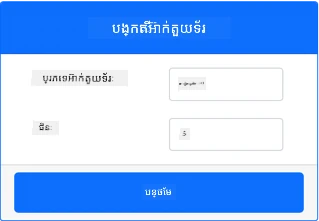
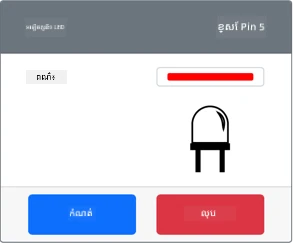

# បង្កើតភ្លើងរាត្រី - ឧបករណ៍ IoT មើលឃើញជាមួយកុំព្យូទ័រ

នៅក្នុងផ្នែកនេះនៃមេរៀន អ្នកនឹងបន្ថែម LED ទៅឧបករណ៍ IoT មើលឃើញរបស់អ្នក ហើយប្រើវាបង្កើតភ្លើងរាត្រី។

## ឧបករណ៍មើលឃើញជាមួយកុំព្យូទ័រ

ភ្លើងរាត្រីត្រូវការអាគឌ្វេត័រមួយ ដែលបានបង្កើតក្នុងកម្មវិធី CounterFit។

អាគឌ្វេត័រនេះគឺជា **LED**។ នៅក្នុងឧបករណ៍ IoT របស់ពិភពជាក់ស្តែង វានឹងជា [ឌីអូឌ์បំពង់ភ្លើង](https://wikipedia.org/wiki/Light-emitting_diode) ដែលបញ្ចេញពន្លឺពេលមានចរន្តអគ្គិសនីឆ្លងកាត់វា។ នេះគឺជាអាគឌ្វេត័រឌីជីថលដែលមានស្ថានភាព 2 គឺ បើក និងបិទ។ ការផ្ញើតម្លៃ 1 ជាអ្នកបើក LED ហើយ 0 ជាអ្នកបិទវា។

តុល្យភាពភ្លើងរាត្រីក្នុង pseudo-code គឺ៖

```output
Check the light level.
If the light is less than 300
    Turn the LED on
Otherwise
    Turn the LED off
```

### បន្ថែមអាគឌ្វេត័រចូលទៅ CounterFit

ដើម្បីប្រើ LED មើលឃើញ អ្នកត្រូវបន្ថែមវាចូលក្នុងកម្មវិធី CounterFit

#### ការងារ - បន្ថែមអាគឌ្វេត័រចូល CounterFit

បន្ថែម LED ចូលក្នុងកម្មវិធី CounterFit។

1. ប្រាកដថាកម្មវិធីវេប CounterFit កំពុងរត់ពីផ្នែកមុននៃការសម្រង់នេះ។ ប្រសិនបើមិនមែន សូមចាប់ផ្ទុះវា ហើយបន្ថែមឧបករណ៍សំគាល់ពន្លឺម្តងទៀត។

1. បង្កើត LED៖

    1. នៅក្នុងប្រអប់ *Create actuator* នៅផ្នែក *Actuator* ចុចប្រអប់*Actuator type* ហើយជ្រើសរើស *LED*។

    1. កំណត់ *Pin* ជា *5*

    1. ជ្រើសប៊ូតុង **Add** ដើម្បីបង្កើត LED នៅ Pin 5

    

    LED នឹងត្រូវបានបង្កើត និងបង្ហាញក្នុងបញ្ជីអាគឌ្វេត័រ។

    

    បន្ទាប់ពីបង្កើត LED អ្នកអាចប្ដូរពណ៌ដោយប្រើឧបករណ៍ *Color* ជ្រើសរើសប៊ូតុង **Set** ដើម្បីប្ដូរពណ៌បន្ទាប់ពីបានជ្រើសរើស។

### បង្កើតកម្មវិធីភ្លើងរាត្រី

ភ្លើងរាត្រីឥឡូវនេះអាចត្រូវបានកម្មវិធីដោយប្រើឧបករណ៍សំគាល់ពន្លឺ និង LED របស់ CounterFit។

#### ការងារ - បង្កើតកម្មវិធីភ្លើងរាត្រី

បង្កើតកម្មវិធីភ្លើងរាត្រី។

1. បើកគម្រោងភ្លើងរាត្រីនៅក្នុង VS Code ដែលអ្នកបានបង្កើតនៅផ្នែកមុននៃការសម្រង់នេះ។ បិទ និងបង្កើត Terminal ម្តងទៀត ដើម្បីធានាវាអាចរត់បានក្នុងបរិបទ virtual environment ប្រសិនបើចាំបាច់។

1. បើកឯកសារ `app.py`

1. បន្ថែមកូដខាងក្រោមទៅក្នុងឯកសារ `app.py` ដើម្បីនាំចូលបណ្ណាល័យដែលត្រូវការ។ ត្រូវបន្ថែមនៅខ្លះខាងលើក្រោមខ្សែ `import` ផ្សេងទៀត។

    ```python
    from counterfit_shims_grove.grove_led import GroveLed
    ```

    ពាក្យ `from counterfit_shims_grove.grove_led import GroveLed` នាំចូល `GroveLed` ពីបណ្ណាល័យ Python CounterFit Grove shim។ បណ្ណាល័យនេះមានកូដសម្រាប់ធ្វើអន្តរកម្មជាមួយ LED ដែលបានបង្កើតក្នុងកម្មវិធី CounterFit។

1. បន្ថែមកូដខាងក្រោមបន្ទាប់ពីការបញ្ជាក់ `light_sensor` ដើម្បីបង្កើតអ实例ក្នុងថ្នាក់ដែលគ្រប់គ្រង LED៖

    ```python
    led = GroveLed(5)
    ```

    បន្ទាត់ `led = GroveLed(5)` បង្កើត实例មួយនៃថ្នាក់ `GroveLed` ដែលភ្ជាប់ទៅ pin **5** - pin Grove CounterFit ដែល LED បានភ្ជាប់។

1. បន្ថែមការត្រួតពិនិត្យនៅក្នុងលូ `while` មុន `time.sleep` ដើម្បីត្រួតពិនិត្យកម្រិតពន្លឺ និងបើក បិទ LED៖

    ```python
    if light < 300:
        led.on()
    else:
        led.off()
    ```

    កូដនេះត្រួតពិនិត្យតម្លៃ `light`។ ប្រសិនបើតម្លៃតិចជាង 300 វានៅហៅម៉េតូត `on` នៃថ្នាក់ `GroveLed` ដែលផ្ញើតម្លៃឌីជីថល 1 ទៅ LED ដើម្បីបើកវា។ ប្រសិនបើតម្លៃពន្លឺច្រើនជាង ឬស្មើ 300 វានៅហៅម៉េតូត `off` ដែលផ្ញើតម្លៃឌីជីថល 0 ទៅ LED ដើម្បីបិទវា។

    > 💁 កូដនេះគួរត្រូវបានចាក់បញ្ចូលចន្លោះតំបន់ដូចជាបន្ទាត់ `print('Light level:', light)` ដើម្បីស្ថិតនៅក្នុងលូ while!

1. ពី VS Code Terminal ប្រតិបត្តិការខាងក្រោមដើម្បីរត់កម្មវិធី Python របស់អ្នក៖

    ```sh
    python3 app.py
    ```

    តម្លៃពន្លឺនឹងត្រូវបង្ហាញនៅក្នុងកុងសូល។

    ```output
    (.venv) ➜  GroveTest python3 app.py 
    Light level: 143
    Light level: 244
    Light level: 246
    Light level: 253
    ```

1. ប្ដូរតម្លៃ *Value* ឬ *Random* ដើម្បីផ្លាស់ប្ដូរទម្រង់ពន្លឺលើឆមាស និងក្រោម 300។ LED នឹងបើក និងបិទ។


> 💁 អ្នកអាចរកឃើញកូដនេះនៅក្នុងថត [code-actuator/virtual-device](../../../../../1-getting-started/lessons/3-sensors-and-actuators/code-actuator/virtual-device)។

😀 កម្មវិធីភ្លើងរាត្រីរបស់អ្នកបានជោគជ័យ!

---

<!-- CO-OP TRANSLATOR DISCLAIMER START -->
**ការបដិសេធ**៖  
ឯកសារ​នេះ​ត្រូវ​បាន​ប្រែ​សម្រួល​ដោយ​ប្រើ​សេវាកម្ម​ប្រែសម្រួល AI [Co-op Translator](https://github.com/Azure/co-op-translator)។ ទោះ​បី​យើង​ព្យាយាម​សម្រាប់​ការ​ត្រឹមត្រូវ​ក៏​ដោយ សូម​ជ្រាប​ថា​ការប្រែ​សម្រួល​ដោយស្វ័យ​ប្រវត្តិ​អាច​មាន​កំហុស ឬ​ភាពមិនត្រឹមត្រូវ។ ឯកសារ​ដើម​នៅ​ក្នុង​ភាសា​ដើម​គួរត្រូវ​បាន​យល់​ពី​ជា​ប្រភព​ឯកភាព។ សម្រាប់​ព័ត៌មាន​សំខាន់ៗ ការ​ប្រែសម្រួល​ដោយ​មនុស្ស​ជំនាញ​ត្រូវបានណែនាំ។ យើង​មិន​ទទួលខុសត្រូវ​ចំពោះ​ការ​យល់ច្រឡំ ឬ​ការ​ស្រាយផ្សេងៗ​ដែលកើតឡើង​ពី​ការប្រើប្រាស់​ការ​ប្រែសម្រួល​នេះ​ទេ។
<!-- CO-OP TRANSLATOR DISCLAIMER END -->