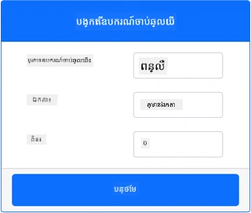
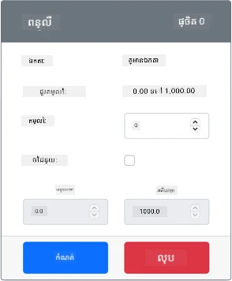

# បង្កើតពន្លឺយប់ - គ្រឿងចក្រពហុប្រព័ន្ធ IoT អាស្រ័យលើវិជ្ជមាន

នៅផ្នែកនេះនៃមេរៀន អ្នកនឹងបន្ថែមឧបករណ៍ស្វែងរកពន្លឺទៅឧបករណ៍ IoT អាស្រ័យលើវិជ្ជមានរបស់អ្នក។

## គ្រឿងចក្រអាស្រ័យលើវិជ្ជមាន

ពន្លឺយប់ត្រូវការឧបករណ៍ស្វែងរកមួយ ដែលបានបង្កើតនៅក្នុងកម្មវិធី CounterFit។

ឧបករណ៍ស្វែងរកគឺជាឧបករណ៍ **ស្វែងរកពន្លឺ**។ នៅក្នុងឧបករណ៍ IoT ភាពយន្ត វានឹងជាឧបករណ៍ [photodiode](https://wikipedia.org/wiki/Photodiode) ដែលបំលែងពន្លឺទៅជា​សញ្ញា​អគ្គិសនី។ ឧបករណ៍ស្វែងរកពន្លឺគឺជាឧបករណ៍ជារូបមន្តដែលផ្ញើតម្លៃចំនួនគត់ ដែលបង្ហាញពីបរិមាណពន្លឺសំពាធមួយដែលមិនបានដាក់បញ្ចូលទៅកាន់មួយឯកតាមาต្រដ្ឋានណាមួយដូចជា [lux](https://wikipedia.org/wiki/Lux)។

### បន្ថែមឧបករណ៍ស្វែងរកទៅ CounterFit

ដើម្បីប្រើឧបករណ៍ស្វែងរកពន្លឺអាស្រ័យលើវិជ្ជមាន អ្នកត្រូវបន្ថែមវាទៅកម្មវិធី CounterFit

#### ភារកិច្ច - បន្ថែមឧបករណ៍ស្វែងរកទៅ CounterFit

បន្ថែមឧបករណ៍ស្វែងរកពន្លឺទៅកម្មវិធី CounterFit។

1. ត្រួតពិនិត្យថាកម្មវិធី CounterFit គឺកំពុងដំណើរការ ពីផ្នែកមុននៃភារកិច្ចនេះ។ ប្រសិនបើគ្មាន សូមចាប់ផ្តើមវា។

1. បង្កើតឧបករណ៍ស្វែងរកពន្លឺ៖

    1. នៅក្នុងប្រអប់ *Create sensor* ក្នុងផ្ទាំង *Sensors* ចុចចុះនៅប្រអប់ *Sensor type* ហើយជ្រើសរើស *Light*។

    1. ទុកឲ្យ *Units* កំណត់ទៅ *NoUnits*

    1. បញ្ជាក់ថា *Pin* ត្រូវបានកំណត់ទៅ *0*

    1. ជ្រើស **Add** ដើម្បីបង្កើតឧបករណ៍ស្វែងរកពន្លឺលើ Pin 0

    

    ឧបករណ៍ស្វែងរកពន្លឺនឹងត្រូវបានបង្កើត និងបង្ហាញនៅក្នុងបញ្ជីឧបករណ៍ស្វែងរក។

    

## កម្មវិធីសម្រាប់ឧបករណ៍ស្វែងរកពន្លឺ

ឧបករណ៍ឥន្ទនៈពេលនេះអាចត្រូវបានកម្មវិធីដើម្បីប្រើឧបករណ៍ស្វែងរកពន្លឺដែលបានបញ្ចូល។

### ភារកិច្ច - បង្កើតកម្មវិធីសម្រាប់ឧបករណ៍ស្វែងរកពន្លឺ

កម្មវិធីឧបករណ៍។

1. បើកគម្រោង nightlight នៅក្នុង VS Code ដែលអ្នកបានបង្កើតនៅផ្នែកមុននៃភារកិច្ចនេះ។ បិទ និងបង្កើតឡើងវិញ Terminal ដើម្បីធានាថាវាដំណើរការដោយប្រើបរិស្ថានវេរុចបើមានត្រូវការ។

1. បើកឯកសារ `app.py`

1. បន្ថែមកូដខាងក្រោមទៅចំពោះខាងលើឯកសារ `app.py` ជាមួយសេចក្តីប្រកាស `import` ផ្សេងទៀតដើម្បីភ្ជាប់នូវបណ្ណាល័យដែលត្រូវការ៖

    ```python
    import time
    from counterfit_shims_grove.grove_light_sensor_v1_2 import GroveLightSensor
    ```

    សេចក្តីប្រកាស `import time` នាំចូលម៉ូឌុល Python `time` ដែលនឹងត្រូវបានប្រើនៅក្រោយក្នុងភារកិច្ចនេះ។

    សេចក្តីប្រកាស `from counterfit_shims_grove.grove_light_sensor_v1_2 import GroveLightSensor` នាំចូល `GroveLightSensor` ពីបណ្ណាល័យ Python counterfit Grove shim។ បណ្ណាល័យនេះមានកូដដើម្បីសហការជាមួយឧបករណ៍ស្វែងរកពន្លឺដែលបានបង្កើតនៅក្នុងកម្មវិធី CounterFit។

1. បន្ថែមកូដខាងក្រោមទៅចំពោះខាងក្រោមឯកសារ ដើម្បីបង្កើតនៃអនុគមន៍នៃថ្នាក់ដែលគ្រប់គ្រងឧបករណ៍ស្វែងរកពន្លឺ៖

    ```python
    light_sensor = GroveLightSensor(0)
    ```

    បន្ទាត់ `light_sensor = GroveLightSensor(0)` បង្កើតអនុគមន៍ថ្មីនៃថ្នាក់ `GroveLightSensor` ដែលភ្ជាប់ទៅ pin **0** - pin Grove របស់ CounterFit ដែលឧបករណ៍ស្វែងរកពន្លឺបានភ្ជាប់។

1. បន្ថែមវដ្ដអស់កល្យាណៈមួយបន្ទាប់ពីកូដខាងលើ ដើម្បីពិនិត្យតម្លៃឧបករណ៍ស្វែងរកពន្លឺ ហើយបោះពុម្ពវាទៅកាន់ Console៖

    ```python
    while True:
        light = light_sensor.light
        print('Light level:', light)
    ```

    នេះនឹងអានកម្រិតពន្លឺបច្ចុប្បន្នដោយប្រើគុណលក្ខណ៍ `light` នៃថ្នាក់ `GroveLightSensor`។ គុណលក្ខណ៍នេះអានតម្លៃអាណាឡុកពី pin។ តម្លៃនេះនឹងត្រូវបោះពុម្ពទៅកាន់ Console។

1. បន្ថែមការនិដ្ឋិតិ១វិនាទីតូចនៅចុងវដ្ដ `while` ព្រោះកម្រិតពន្លឺមិនត្រូវបានពិនិត្យជាប្រចាំទេ។ ការនិដ្ឋិតិអាចកាត់បន្ថយការប្រើថាមពលរបស់ឧបករណ៍។

    ```python
    time.sleep(1)
    ```

1. ពី Terminal VS Code បើកការប្រតិបត្តិ Python app របស់អ្នកដោយរត់៖

    ```sh
    python3 app.py
    ```

    តម្លៃពន្លឺនឹងត្រូវបង្ហាញនៅលើ Console។ ចាប់ផ្តើមតម្លៃនេះគឺ 0។

1. ពីកម្មវិធី CounterFit ផ្លាស់ប្តូរតម្លៃឧបករណ៍ស្វែងរកពន្លឺដែលកម្មវិធីនឹងអាន។ អ្នកអាចធ្វើបានពីរបៀប៖

    * បញ្ចូលលេខមួយក្នុងប្រអប់ *Value* សម្រាប់ឧបករណ៍ស្វែងរកពន្លឺ បន្ទាប់មកជ្រើស **Set**។ លេខដែលអ្នកបញ្ចូលនឹងជាតម្លៃដែលឧបករណ៍ស្វែងរកនាំលុយត្រឡប់វិញ។

    * គូសប្រអប់ *Random* ហើយបញ្ចូលតម្លៃ *Min* និង *Max* បន្ទាប់មកជ្រើស **Set**។ រាល់ពេលឧបករណ៍ស្វែងរកអានតម្លៃ វានឹងអានលេខចៃដន្យរវាង *Min* និង *Max*។

    តម្លៃដែលបានកំណត់នឹងត្រូវបង្ហាញនៅលើ Console។ ប្ដូរតម្លៃ *Value* ឬការកំណត់ *Random* ដើម្បីធ្វើឱ្យតម្លៃផ្លាស់ប្តូរ។

    ```output
    (.venv) ➜  GroveTest python3 app.py 
    Light level: 143
    Light level: 244
    Light level: 246
    Light level: 253
    ```

> 💁 អ្នកអាចរកឃើញកូដនេះនៅក្នុងថត [code-sensor/virtual-device](../../../../../1-getting-started/lessons/3-sensors-and-actuators/code-sensor/virtual-device)។

😀 កម្មវិធី nightlight របស់អ្នកបានជោគជ័យ!

---

<!-- CO-OP TRANSLATOR DISCLAIMER START -->
**ការបដិសេធ**៖  
ឯកសារនេះត្រូវបានបញ្ជូនបកប្រែដោយសេវាកម្មបកប្រែ AI [Co-op Translator](https://github.com/Azure/co-op-translator)។ ទោះយើងខំប្រឹងប្រែងឲ្យបានត្រឹមត្រូវ អ្នកត្រូវយល់ថាការបកប្រែដោយស្វ័យប្រវត្តិបង្ហាញពីកំហុស ឬការមិនត្រឹមត្រូវខ្លះៗបាន។ ឯកសារដើមជាភាសា​ដើមគួរត្រូវបានគេពិចារណาว่า​ជា ប្រភពត្រឹមត្រូវ។ សម្រាប់ព័ត៌មានសំខាន់ ការបកប្រែ​ដោយមនុស្ស​ដោយជំនាញត្រូវបានណែនាំ។ យើងមិនទទួលខុសត្រូវចំពោះការយល់ច្រឡំ ឬការបកប្រែខុសណាមួយដែលកើតមានពីការប្រើប្រាស់ការបកប្រែនេះឡើយ។
<!-- CO-OP TRANSLATOR DISCLAIMER END -->