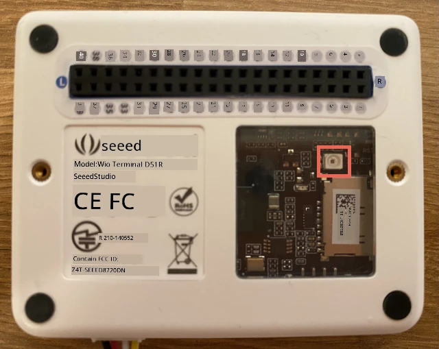

# បន្ថែមឧបករណ៍បញ្ចេញសញ្ញា - Wio Terminal

នៅក្នុងផ្នែកនេះនៃមេរៀន អ្នកនឹងប្រើឧបករណ៍បញ្ចេញសញ្ញាថាមពលលើ Wio Terminal របស់អ្នក។

## សម្ភារៈរឹង

ឧបករណ៍បញ្ចេញសញ្ញាសម្រាប់មេរៀននេះគឺជា **ឧបករណ៍បញ្ចេញសញ្ញាថាមពល** ដែលប្រើ [photodiode](https://wikipedia.org/wiki/Photodiode) ដើម្បីបំលែងពន្លឺទៅជាសញ្ញា​អគ្គិសនី។ វាជាឧបករណ៍បញ្ចេញសញ្ញាអាឡូកដែលផ្ញើតម្លៃគត់ពី 0 ដល់ 1,023 បង្ហាញពីបរិមាណ​ពន្លឺ​ដែល​មានប្រជាប្រិយមិនបានផែនទីទៅកាន់ឯកតាស្តង់ដារណាមួយដូចជា [lux](https://wikipedia.org/wiki/Lux)។

ឧបករណ៍បញ្ចេញសញ្ញាថាមពលត្រូវបានបញ្ចូលក្នុង Wio Terminal ហើយអាចមើលឃើញតាមរយៈច្រកប្លាស្ទិចថ្លាពីខាងលើ។



## បង្កើតកម្មវិធីឧបករណ៍បញ្ចេញសញ្ញាថាមពល

ឧបករណ៍នេះឥឡូវនេះអាចត្រូវបានបង្កើតកម្មវិធីដើម្បីប្រើឧបករណ៍បញ្ចេញសញ្ញាថាមពលដែលមាននៅក្នុងម៉ាស៊ីន។

### ការងារ

បង្កើតកម្មវិធីឧបករណ៍។

1. បើកគម្រោង nightlight នៅក្នុង VS Code ដែលអ្នកបានបង្កើតនៅផ្នែកមុននៃការងារនេះ

1. បន្ថែមបន្ទាត់ខាងក្រោមទៅចុងបញ្ចប់នៃអនុគមន៍ `setup` ៖

    ```cpp
    pinMode(WIO_LIGHT, INPUT);
    ```

    បន្ទាត់នេះកំណត់ពិនដែលប្រើសម្រាប់ទំនាក់ទំនងជាមួយឧបករណ៍បញ្ចេញសញ្ញា។

    ពិន `WIO_LIGHT` គឺជាចំនួននៃពិន GPIO ដែលភ្ជាប់ទៅឧបករណ៍បញ្ចេញសញ្ញាថាមពលរបស់ឧបករណ៍។ ពិននេះត្រូវបានកំណត់ជាទិស `INPUT` ដែលមានន័យថាវាភ្ជាប់ទៅឧបករណ៍បញ្ចេញសញ្ញាមួយ ហើយទិន្នន័យនឹងត្រូវបានអានពីពិននេះ។

1. លុបមាតិកា​របស់អនុគមន៍ `loop` ឲ្យស្អាត។

1. បន្ថែមកូដខាងក្រោមទៅអនុគមន៍ `loop` ដែលឥឡូវគ្មានអ្វី:

    ```cpp
    int light = analogRead(WIO_LIGHT);
    Serial.print("Light value: ");
    Serial.println(light);
    ```

    កូដនេះអានតម្លៃអាឡូកពីពិន `WIO_LIGHT`។ វាអានតម្លៃពី 0 ដល់ 1,023 ពីឧបករណ៍បញ្ចេញសញ្ញាថាមពលនៅលើម៉ាស៊ីន។ តម្លៃនេះបន្ទាប់មកត្រូវបានផ្ញើទៅក្នុងកំពង់ផ្ទាល់ ដើម្បីឲ្យអ្នកអាចអានវា​នៅក្នុង Serial Monitor នៅពេលកូដនេះកំពុងដំណើរការ។ `Serial.print` សរសេរខ្សែអក្សរក្នុ​ង​ដោយគ្មានបន្ទាត់ថ្មីនៅចុងបញ្ចប់ ដូច្នេះរាល់បន្ទាត់នឹងចាប់ផ្តើមដោយ `Light value:` ហើយបញ្ចប់ជាមួយតម្លៃពន្លឺពិតប្រាកដ។

1. បន្ថែមការពន្យារពេលតូច១វិនាទី (1,000ms) នៅចុងបញ្ចប់នៃ `loop` ព្រោះកម្រិតពន្លឺមិនត្រូវបានពិនិត្យជាបន្តបន្ទាប់ទេ។ ការពន្យារពេល​នេះកាត់បន្ថយ​ការ​ប្រើថាមពលរបស់ឧបករណ៍។

    ```cpp
    delay(1000);
    ```

1. ភ្ជាប់ជាមួយ Wio Terminal ទៅកាន់កុំព្យូទ័ររបស់អ្នកម្តងទៀត ហើយផ្ទុកកូដថ្មីទៅ ដូចដែលអ្នកធ្វើមុន។

1. តភ្ជាប់ទៅ Serial Monitor។ តម្លៃពន្លឺនឹងបង្ហាញទៅតាមកុងសូល។ លាក់និងបង្កការ​ពន្លឺឧបករណ៍បញ្ចេញសញ្ញាថាមពលនៅខាងក្រោយ Wio Terminal ហើយតម្លៃនឹងផ្លាស់ប្ដូរ។

    ```output
    > Executing task: platformio device monitor <

    --- Available filters and text transformations: colorize, debug, default, direct, hexlify, log2file, nocontrol, printable, send_on_enter, time
    --- More details at http://bit.ly/pio-monitor-filters
    --- Miniterm on /dev/cu.usbmodem101  9600,8,N,1 ---
    --- Quit: Ctrl+C | Menu: Ctrl+T | Help: Ctrl+T followed by Ctrl+H ---
    Light value: 4
    Light value: 5
    Light value: 4
    Light value: 158
    Light value: 343
    Light value: 348
    Light value: 344
    ```

> 💁 អ្នកអាចស្វែងរកកូដនេះនៅក្នុងថត [code-sensor/wio-terminal](../../../../../1-getting-started/lessons/3-sensors-and-actuators/code-sensor/wio-terminal)។

😀 ការបន្ថែមឧបករណ៍បញ្ចេញសញ្ញាថាមពលទៅកម្មវិធី nightlight របស់អ្នកបានជោគជ័យ!

---

<!-- CO-OP TRANSLATOR DISCLAIMER START -->
**ការបដិសេធ**:  
ឯកសារនេះត្រូវបានបំលែងជាភាសាដោយប្រើសេវាកម្មបកប្រែ AI [Co-op Translator](https://github.com/Azure/co-op-translator)។ ខណៈពេលដែលយើងខិតខំបំផុតសម្រាប់ភាពត្រឹមត្រូវ សូមជ្រាបថាការបកប្រែដោយស្វ័យប្រវត្តិអាចមានកំហុស ឬភាពមិនត្រឹមត្រូវណាមួយ។ ឯកសារដើមក្នុងភាសាដើមរបស់វាគួរត្រូវបានចាត់ទុកជាផ្លូវការជាធរមាន។ សម្រាប់ព័ត៌មានសំខាន់ៗ សូមណែនាំឱ្យប្រើការបកប្រែដោយមនុស្សអ្នកជំនាញ។ យើងមិនទទួលខុសត្រូវចំពោះការយល់ច្រឡំ ឬការបកប្រែខុសណាមួយដែលកើតឡើងពីការប្រើប្រាស់ការបកប្រែនេះទេ។
<!-- CO-OP TRANSLATOR DISCLAIMER END -->