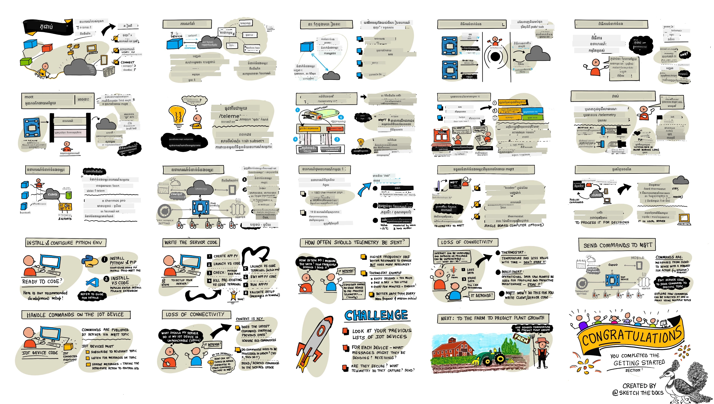
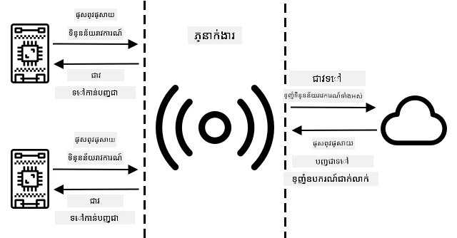
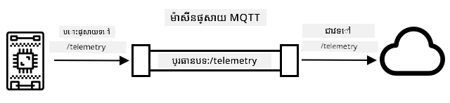
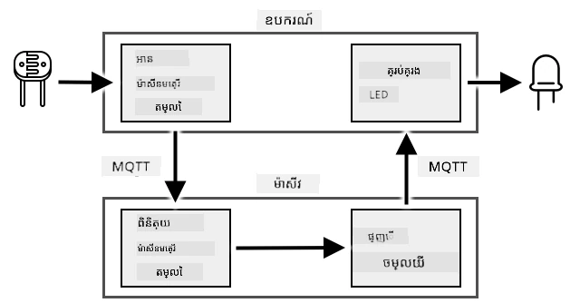
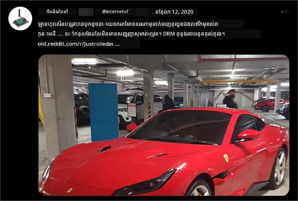

# ប.Connect ឧបករណ៍របស់អ្នកទៅអ៊ិនធឺរណែត



> Sketchnote by [Nitya Narasimhan](https://github.com/nitya). ចុចលើរូបភាពដើម្បីមើលជាច្បាស់ជាងនេះ។

មេរៀននេះត្រូវបានបង្រៀនជាផ្នែកមួយនៃស៊េរី [Hello IoT series](https://youtube.com/playlist?list=PLmsFUfdnGr3xRts0TIwyaHyQuHaNQcb6-) ពី [Microsoft Reactor](https://developer.microsoft.com/reactor/?WT.mc_id=academic-17441-jabenn)។ មេរៀននេះមាន 2 វីដេអូចម្បង - មេរៀនរយៈពេល 1 ម៉ោង និងម៉ោងការិយាល័យរយៈពេល 1 ម៉ោង ដើម្បីជម្រៅបន្ថែមលើផ្នែកខ្លះៗនៃមេរៀន និងឆ្លើយសំណួរ។

[](https://youtu.be/O4dd172mZhs)

[](https://youtu.be/j-cVCzRDE2Q)

> 🎥 ចុចលើរូបភាពខាងលើដើម្បីមើលវីដេអូ

## ផ្នែកសំនួរពីមុនមេរៀន

[ផ្នែកសំនួរពីមុនមេរៀន](https://black-meadow-040d15503.1.azurestaticapps.net/quiz/7)

## ការណែនាំ

អក្សរ **I** ក្នុង IoT បង្ហាញន័យថា **Internet** - ការតភ្ជាប់មេឃនិងសេវាកម្មដែលអាចអនុវត្តបានសមត្ថភាពជាច្រើននៃឧបករណ៍ IoT ដូចជាការប្រមូលវាស់វែងពីស៊ិនស័រដែលភ្ជាប់ជាមួយឧបករណ៍ រហូតដល់ការបញ្ជូនសារ ដើម្បីគ្រប់គ្រងឧបករណ៍ដំណើរការ។ ឧបករណ៍ IoT ជាទូទៅតភ្ជាប់ទៅសេវាកម្ម IoT មេឃមួយ ដោយប្រើប្រព័ន្ធទំនាក់ទំនងស្តង់ដារ ហើយសេវាកម្មនោះតភ្ជាប់ទៅកម្មវិធី IoT របស់អ្នក ពីសេវាកម្ម AI ដែលធ្វើការសម្រេចចិត្តឆ្លាតវៃលើទិន្នន័យរបស់អ្នក ដល់កម្មវិធីបណ្ដាញសម្រាប់ការគ្រប់គ្រងឬរបាយការណ៍។

> 🎓 ទិន្នន័យដែលបានប្រមូលពីសិនស័រ ហើយបញ្ជូនទៅមេឃ មានឈ្មោះថា telemetry។

ឧបករណ៍ IoT អាចទទួលសារពីមេឃ។ ជាញឹកញាប់សារទាំងនេះមានពាក្យបញ្ជា - គឺជាណែនាំអោយបំពេញសកម្មភាពមួយ ឬក្នុងផ្នែកក្នុង (ដូចជាការកំណត់ម៉ាស៊ីនឡើងវិញ ឬធ្វើបច្ចុប្បន្នភាព firmware) ឬប្រើឧបករណ៍ដំណើរការ (ដូចជាបើកភ្លើង)។

មេរៀននេះណែនាំពីប្រព័ន្ធទំនាក់ទំនងខ្លះៗដែលឧបករណ៍ IoT អាចប្រើប្រាស់ដើម្បីភ្ជាប់ទៅមេឃ និងប្រភេទទិន្នន័យដែលវាអាចផ្ញើឬទទួលបាន។ អ្នកនឹងមានឱកាសធ្វើដំណើរការជាមួយពួកវាទាំងពីរ ដោយបន្ថែមការគ្រប់គ្រងអ៊ីនធឺរណែតទៅលើភ្លើងពេលយប់របស់អ្នក ហើយផ្លាស់ប្ដូរកូដគ្រប់គ្រង LED ទៅជាកូដ "server" ដំណើរការជាភាពភ្ជាប់ផ្ទាល់។

ក្នុងមេរៀននេះ យើងនឹងគ្របដណ្តប់៖

* [ប្រព័ន្ធទំនាក់ទំនង](#ប្រព័ន្ធទំនាក់ទំនង)
* [Message Queueing Telemetry Transport (MQTT)](#message-queueing-telemetry-transport-mqtt)
* [Telemetry](#telemetry)
* [ពាក្យបញ្ជា](#បញ្ជា)

## ប្រព័ន្ធទំនាក់ទំនង

មានប្រព័ន្ធទំនាក់ទំនងថ្មីៗជាច្រើនដែលពេញនិយមប្រើដោយឧបករណ៍ IoT ដើម្បីទំនាក់ទំនងជាមួយអ៊ិនធឺរណែត។ ប្រព័ន្ធដែលពេញនិយមជាងគេ គឺផ្អែកលើសារប្រភេទ publish/subscribe តាម broker មួយណាមួយ។ ឧបករណ៍ IoT តភ្ជាប់ទៅ broker ហើយបោះពុម្ពផ្សាយ telemetry ហើយចុះឈ្មោះសម្រាប់ពាក្យបញ្ជា។ សេវាកម្មមេឃក៏តភ្ជាប់ទៅ broker ដែរ និងចុះឈ្មោះសម្រាប់សារទាំងអស់ទៅបោះពុម្ពផ្សាយពាក្យបញ្ជាទៅឧបករណ៍ជាក់លាក់ ឬក្រុមឧបករណ៍។



MQTT គឺជាប្រព័ន្ធទំនាក់ទំនងដែលពេញនិយមច្រើនបំផុតសម្រាប់ឧបករណ៍ IoT ហើយត្រូវបានគ្របដណ្តប់ក្នុងមេរៀននេះ។ ប្រព័ន្ធផ្សេងទៀតរួមមាន AMQP និង HTTP/HTTPS។

## Message Queueing Telemetry Transport (MQTT)

[MQTT](http://mqtt.org) គឺជាប្រព័ន្ធសារល្មមមួយ ដែលជាស្តង់ដារបើក និងអាចផ្ញើសារ​រវាងឧបករណ៍បាន។ វាត្រូវបានរចនាឡើងក្នុងឆ្នាំ 1999 ដើម្បីតាមដានបំពង់ប្រេងមុននឹងចេញជាស្តង់ដារបើកក្រោយមក 15 ឆ្នាំ ដោយ IBM។

MQTT មាន broker តែមួយ និងអ្នកជាអតិថិជនជាច្រើន។ អតិថិជនទាំងអស់តភ្ជាប់ទៅ broker ហើយ broker នាំសារទៅកាន់អតិថិជនដែលពាក់ព័ន្ធ។ សារ​ត្រូវបានបញ្ជូនតាមប្រធានបទដែលបានដាក់ឈ្មោះជាក់លាក់ ជំនួសក៏ផ្ញើទៅអតិថិជនម្នាក់ៗ។ អតិថិជនមួយអាចបោះពុម្ពផ្សាយទៅប្រធានបទមួយ ហើយអតិថិជនណាដែលបានចុះឈ្មោះក្នុងប្រធានបទនោះនឹងទទួលបានសារ។



✅ ស្រាវជ្រាវមួយចំនួន។ ប្រសិនបើអ្នកមានឧបករណ៍ IoT ច្រើន តើអ្នកអាចធានាអោយ MQTT broker របស់អ្នកគ្រប់គ្រងសារទាំងអស់របាងល្អបានយ៉ាងដូចម្តេច?

### ភ្ជាប់ឧបករណ៍ IoT របស់អ្នកទៅ MQTT

ផ្នែកដំបូងនៃការបន្ថែមការគ្រប់គ្រងអ៊ីនធឺរណែតទៅលើភ្លើងពេលយប់របស់អ្នកគឺភ្ជាប់វាទៅ MQTT broker មួយ។

#### កិច្ចការជួយបំពេញ

ភ្ជាប់ឧបករណ៍របស់អ្នកទៅ MQTT broker។

នៅក្នុងផ្នែកនេះ អ្នកនឹងភ្ជាប់ IoT nightlight របស់អ្នកទៅអ៊ីនធឺរណែត ដើម្បីអោយវាអាចគ្រប់គ្រងពីចម្ងាយបាន។ នៅពេលក្រោយក្នុងមេរៀននេះ ឧបករណ៍ IoT របស់អ្នកនឹងផ្ញើសារទំនាក់ទំនង telemetry តាម MQTT ទៅកាន់ MQTT broker សាធារណៈជាមួយកម្រិតពន្លឺ ដែលវានឹងត្រូវបានអ្នកប្រើកូដ server មួយដែលអ្នកនឹងសរសេរចាប់យក។ កូដនេះនឹងពិនិត្យកម្រិតពន្លឺ និងផ្ញើសារពាក្យបញ្ជាចេញវិញទៅឧបករណ៍ ដើម្បីនិយាយអោយបើកឬបិទ LED។

ករណីប្រើប្រាស់ពិតប្រាកដសម្រាប់ការតាំងបែបនេះអាចជាការប្រមូលទិន្នន័យពីសិនស័រពន្លឺជាច្រើន មុនពេលសម្រេចចិត្តបើកភ្លើង នៅទីតាំងដែលមានភ្លើងច្រើន ដូចជាគីឡាទឹក។ វា​អាចជួយបញ្ឈប់ការបើកភ្លើង ប្រសិនបើគ្រាន់តែសិនស័រមួយតែបិទដោយពពកឬបក្សី ប៉ុន្តែសិនស័រផ្សេងទៀតមានកម្រិតពន្លឺគ្រប់គ្រាន់។

✅ តើស្ថានភាពផ្សេងទៀតណាដែលត្រូវការជាក់ច្បាស់ពីទិន្នន័យពីសិនស័រច្រើន មុននឹងផ្ញើពាក្យបញ្ជា?

ជំនួសមិនបញ្ហាការលំបាកក្នុងការតាំង MQTT broker ជាផ្នែកមួយនៃកិច្ចការនេះ អ្នកអាចប្រើម៉ាស៊ីនមេសាកល្បងសាធារណៈមួយដែលដំណើរការប្រព័ន្ធ MQTT broker បើកក្ដារដែលគេហៅថា [Eclipse Mosquitto](https://www.mosquitto.org)។ មេសាកល្បងនេះអាចប្រើបានសាធារណៈនៅ [test.mosquitto.org](https://test.mosquitto.org)， ហើយមិនពិចារណាចាំបាច់ធ្វើការចុះបញ្ជីគណនីទេ ដែលធ្វើឲ្យវាជាឧបករណ៍ល្អសម្រាប់សាកល្បង MQTT client និង server។

> 💁 ម៉ាស៊ីនមេសាកល្បងនេះជាសាធារណៈ និងមិនមានសុវត្ថិភាពឡើយ។ អ្នកណាមួយអាចស្តាប់អ្វីដែលអ្នកបោះពុម្ពផ្សាយ ដូច្នេះវាគួរត្រូវបានប្រើដោយគ្មានទិន្នន័យដែលត្រូវរក្សាឲ្យឯកជន។



អនុវត្តតាមជំហានរបស់អ្នកខាងក្រោម ដើម្បីភ្ជាប់ឧបករណ៍របស់អ្នកទៅ MQTT broker៖

* [Arduino - Wio Terminal](wio-terminal-mqtt.md)
* [Single-board computer - Raspberry Pi/Virtual IoT device](single-board-computer-mqtt.md)

### ជម្រៅបន្ថែមស្តីពី MQTT

ប្រធានបទអាចមានជំនួរតែងតាមកម្រិត ហើយអតិថិជនអាចចុះឈ្មោះនៅកម្រិតនានានៃជំនួរដោយប្រើ wildcards។ ឧទាហរណ៍ អ្នកអាចផ្ញើសារទិន្នន័យសីតុណ្ហភាពទៅប្រធានបទ `/telemetry/temperature` និងសារពន្លឺទៅ `/telemetry/humidity` ហើយនៅកម្មវិធីមេឃ អ្នកចុះឈ្មោះក្នុងប្រធានបទ `/telemetry/*` ដើម្បីទទួលទាំងសារសីតុណ្ហភាព និងពន្លឺ។

សារ​អាចបញ្ជូនជាមួយគុណភាពសេវាកម្ម (QoS) ដែលកំណត់ការធានាវត្ថុបំណងក្នុងការទទួលសារ។

* សំរាប់មួយដងបំផុត - សារត្រូវបានផ្ញើតែមួយដង និងអតិថិជននិង broker មិនធ្វើជំហានបន្ថែមទេដើម្បីបញ្ជាក់ការទទួល (បាញ់ហើយភ្លេច)។
* ច្រើនជាងមួយដង - សារត្រូវបានអ្នកផ្ញើសាកល្បងជាច្រើនដងរហូតដល់ការទទួលបានការបញ្ជាក់ (ការផ្ញើបានធានា)។
* ខ្ទង់ដូចមួយ - អ្នកផ្ញើ និងអ្នកទទួលអនុវត្តជំនួរទ្វេដង ដើម្បីធានារបស់ថាសារត្រូវបានទទួលតែមួយលើកតែម្តង (ការផ្ញើបានធានា)។

✅ តើស្ថានភាពណាដែលត្រូវការការផ្ញើសារដោយធានាជាក់ច្បាស់ ជាងបាញ់ហើយភ្លេច?

ទោះបីជា ឈ្មោះសារ​គឺ Message Queueing (MQTT's initials) ក៏ដោយ មិនគាំទ្រការតម្រងសារ queue ទេ។ នេះមានន័យថាប្រសិនបើអតិថិជនផ្គាប់ការតភ្ជាប់ ហើយភ្ជាប់វិញ វាមិនទទួលបានសារដែលបានផ្ញើនៅពេលដែលវាផ្គាប់ទេ លើកលែងតែសារដែលវាបានចាប់ផ្តើមដំណើរការហើយតាមដំណើរពិតផ្អែកលើ QoS។ សារអាចមានប៊្លុកកំណត់ចំណាំបានផ្អែកលើពួកវា។ ប្រសិនបើត្រូវបានកំណត់នេះ MQTT broker នឹងរក្សាសារចុងក្រោយដែលបានផ្ញើលើប្រធានបទជាមួយប៊្លុកនោះ ហើយផ្ញើទៅអតិថិជនណាដែលចុះឈ្មោះក្រោយបន្ទាប់។ ដូច្នេះ អតិថិជននឹងទទួលបានសារថ្មីជានិរន្តរភាព។

MQTT ក៏គាំទ្រតួនាទី keep alive ដែលពិនិត្យមើលការតភ្ជាប់​នៅរកស្ថិតិពេញលេញ បំរើនៅពេលវេលាទម្លាស់ប្តូរឈ្មោះរវាងសារ។

> 🦟 [Mosquitto ពី Eclipse Foundation](https://mosquitto.org) មាន MQTT broker សេរីដែលអ្នកអាចដំណើរការប្រើប្រាស់បានដោយខ្លួនឯង សម្រាប់សាកល្បង MQTT ជាមួយ MQTT broker សាធារណៈដែលបង្ហោះនៅ [test.mosquitto.org](https://test.mosquitto.org)។

ការតភ្ជាប់ MQTT អាចជាសាធារណៈ និងបើក ឬមានការអាំងគ្រីប និងសុវត្ថិភាព ជាមួយឈ្មោះអ្នកប្រើនិងពាក្យសម្ងាត់ ឬវិញ្ញាបនបត្រ។

> 💁 MQTT ទំនាក់ទំនងតាម TCP/IP ដែលជាប្រព័ន្ធបណ្តាញដូចគ្នាទាំងនៅ HTTP ប៉ុន្តែក្នុងច្រកផ្សេង។ អ្នកអាចប្រើ MQTT លើ websockets ដើម្បីទំនាក់ទំនងជាមួយកម្មវិធីបណ្ដាញដំណើរការនៅលើកម្មវិធីរុករក ឬនៅក្នុងស្ថានភាពដែល firewall ឬច្បាប់បណ្តាញផ្សេងៗបិទការតភ្ជាប់ MQTT ស្តង់ដា។

## Telemetry

ពាក្យ telemetry មានន័យពីដើមកំណើតបែបក្រិច ដែលមានន័យថាវាស់ពីចម្ងាយ។ Telemetry ជាសកម្មភាពនៃការប្រមូលទិន្នន័យពីសិនស័រ ហើយបញ្ជូនទៅមេឃ។

> 💁 ឧបករណ៍ telemetry មួយដំបូងបំផុត ត្រូវបានបង្កើតឡើងនៅបារាំងក្នុងឆ្នាំ 1874 ហើយផ្ញើព័ត៌មានអាកាសធាតុ និងជម្រៅទឹកភ្នំពី Mont Blanc ទៅទីក្រុង Paris ជាពេលវេលាពិត។ វាបានប្រើខ្សែរដែក ដោយសារតែបច្ចេកវិទ្យាឥតខ្សែមិនមាននៅពេលនោះ។

យើងត្រឡប់មកមើលឧទាហរណ៍ thermostat ជ្រៅចិត្តពីមេរៀនទី 1។


 thermostat មានសិនស័រសីតុណ្ហភាពសម្រាប់ប្រមូល telemetry។ វាអាចមានសិនស័រសីតុណ្ហភាពមួយដែលបានដំឡើងក្នុងខ្លួន និងអាចភ្ជាប់ទៅសិនស័របរមានខាងក្រៅជាច្រើនលើប្រព័ន្ធឥតខ្សែ ដូចជា [Bluetooth Low Energy](https://wikipedia.org/wiki/Bluetooth_Low_Energy) (BLE)។

ឧទាហរណ៍ទិន្នន័យ telemetry ដែលវាអាចផ្ញើមានដូចជា៖

| ឈ្មោះ | តម្លៃ | សារៈសំខាន់ |
| ---- | ----- | ----------- |
| `thermostat_temperature` | 18°C | សីតុណ្ហភាពដែលវាស់បានពីសិនស័រសីតុណ្ហភាពដែលបានដំឡើងនៅ thermostat |
| `livingroom_temperature` | 19°C | សីតុណ្ហភាពដែលវាស់បានពីសិនស័រផ្ទះដែលមានឈ្មោះ `livingroom` ដើម្បីកំណត់បន្ទប់ដែលវាអាចនៅក្នុង |
| `bedroom_temperature` | 21°C | សីតុណ្ហភាពដែលវាស់បានពីសិនស័រផ្ទះដែលមានឈ្មោះ `bedroom` ដើម្បីកំណត់បន្ទប់ដែលវា​នៅក្នុង |

សេវាកម្មមេឃអាចប្រើទិន្នន័យ telemetry នេះដើម្បីធ្វើសេចក្ដីសម្រេចចិត្តពីពាក្យបញ្ជាដើម្បីគ្រប់គ្រងការបញ្ចុះកំដៅ។

### ផ្ញើទិន្នន័យ telemetry ពីឧបករណ៍ IoT របស់អ្នក

ផ្នែកបន្ទាប់នៃការបន្ថែមការគ្រប់គ្រងអ៊ីនធឺរណែតទៅលើភ្លើងពេលយប់របស់អ្នកគឺផ្ញើទិន្នន័យកម្រិតពន្លឺទៅ MQTT broker លើប្រធានបទ telemetry ។

#### កិច្ចការ - ផ្ញើទិន្នន័យ telemetry ពីឧបករណ៍របស់អ្នក

ផ្ញើទិន្នន័យកម្រិតពន្លឺទៅ MQTT broker។

ទិន្នន័យនេះត្រូវបានបញ្ជូនដោយកូដ JSON - ជាស្តង់ដារសម្រាប់កូដទិន្នន័យជាអក្សរ ដែលប្រើគូ key/value ។

✅ ប្រសិនបើអ្នកមិនទាន់ស្គាល់ JSON នោះ អ្នកអាចរៀនបន្ថែមនៅលើ [ឯកសារ JSON.org](https://www.json.org/)។

អនុវត្តតាមជំហានដែលត្រូវការ ខាងក្រោម ដើម្បីផ្ញើទិន្នន័យ telemetry ពីឧបករណ៍របស់អ្នកទៅ MQTT broker៖

* [Arduino - Wio Terminal](wio-terminal-telemetry.md)
* [Single-board computer - Raspberry Pi/Virtual IoT device](single-board-computer-telemetry.md)

### ទទួលទិន្នន័យ telemetry ពី MQTT broker

គ្មានអត្ថប្រយោជន៍ក្នុងការផ្ញើ telemetry ប្រសិនបើគ្មានអ្វីនៅចុងនោះទៅស្តាប់វាទេ។ កម្រិតពន្លឺ telemetry ត្រូវការអ្នកស្តាប់ដើម្បីដំណើរការទិន្នន័យ។ កូដ "server" នេះជាប្រភេទកូដដែលអ្នកនឹងដាក់បង្ហោះទៅសេវាកម្មមេឃ ជាផ្នែកនៃកម្មវិធី IoT ធំ ប៉ុន្ត្រនៅទីនេះ អ្នកនឹងរត់កូដនេះក្នុងកុំព្យូទ័រផ្ទាល់ខ្លួន (ឬលើ Pi របស់អ្នក ប្រសិនបើអ្នកសរសេរកូដផ្ទាល់នៅទីនោះ)។ កូដ server រួមមានកម្មវិធី Python មួយ ដែលស្តាប់សារទិន្នន័យ telemetry តាម MQTT ជាមួយកម្រិតពន្លឺ។ នៅពេលក្រោយក្នុងមេរៀននេះ អ្នកនឹងធ្វើឲ្យវาตอบជាសារពាក្យបញ្ជា ជាsនឹងណែនាំអោយបើកឬបិទ LED។

✅ ស្រាវជ្រាវមួយចំនួន៖ តើកើតអ្វីជាមួយសារតាម MQTT ប្រសិនបើគ្មានអ្នកស្តាប់?

#### តំឡើង Python និង VS Code

ប្រសិនបើអ្នកមិនមាន Python និង VS Code តំឡើងជាមូលដ្ឋាននៅក្នុងកុំព្យូទ័ររបស់អ្នកទេ អ្នកត្រូវតែតំឡើងពួកវាដើម្បីសរសេរកូដ server។ ប្រសិនបើអ្នកប្រើឧបករណ៍ IoT Virtual ឬកំពុងធ្វើការនៅលើ Raspberry Pi អ្នកអាចរំលងជំហាននេះ ព្រោះអ្នកបានមានវា​តំឡើងគ្រាន់ហើយ និងបានកំណត់រចនាសម្ព័ន្ធរួចរាល់។

##### កិច្ចការ - តំឡើង Python និង VS Code

តំឡើង Python និង VS Code។

1. តំឡើង Python. សូមមើលទំព័រទាញយក [Python downloads page](https://www.python.org/downloads/) សម្រាប់ណែនាំក្នុងការតំឡើង Python ចុងក្រោយបំផុត។

1. តំឡើង Visual Studio Code (VS Code). អ្នកនឹងប្រើកម្មវិធីកាត់កូដនេះដើម្បីសរសេរកូដឧបករណ៍ Virtual IoT របស់អ្នកជាភាសា Python។ សូមរីករាយជាមួយ [VS Code documentation](https://code.visualstudio.com?WT.mc_id=academic-17441-jabenn) សម្រាប់ណែនាំការតំឡើង VS Code។

    > 💁 អ្នកអាចប្រើ IDE ឬកែសម្រួល Python ផ្សេងៗសម្រាប់មេរៀននេះ ប្រសិនបើអ្នកមានឧបករណ៍ដែលចូលចិត្ត។ ប៉ុន្តែមេរៀននេះនឹងផ្ដល់ណែនាំមូលដ្ឋានជាមួយ VS Code។

1. តំឡើង វិស្ថេទីខ VS Code Pylance។ នេះជាវិស្ថេទីមួយសម្រាប់ VS Code ដែលផ្ដល់កំរងារអោយគាំទ្រភាសា Python។ សូមមើលឯកសារវិស្ថេទី [Pylance extension documentation](https://marketplace.visualstudio.com/items?WT.mc_id=academic-17441-jabenn&itemName=ms-python.vscode-pylance) សម្រាប់ណែនាំការតំឡើងវានៅក្នុង VS Code។

#### កំណត់បរិបទ Python virtual environment
១ ក្នុងចំណោមលក្ខណៈពិសេសដ៏សម្បូរបែបនៃភាសា Python គឺសមត្ថភាពក្នុងការដំឡើងកញ្ចប់ [pip packages](https://pypi.org) - ទាំងនេះគឺជាកញ្ចប់កូដដែលបានសរសេរដោយមនុស្សផ្សេងទៀត និងបានផ្សាយទៅលើអ៊ីនធឺណែត។ អ្នកអាចដំឡើងកញ្ចប់ pip មួយទៅកុំព្យូទ័ររបស់អ្នកដោយបញ្ជាទូមួយ មួយឆ្លើយ បន្ទាប់មកប្រើកញ្ចប់នោះនៅក្នុងកូដរបស់អ្នក។ អ្នកនឹងប្រើ pip ដើម្បីដំឡើងកញ្ចប់សម្រាប់ទំនាក់ទំនងតាមរយៈ MQTT។

ដោយលំនាំដើមពេលដែលអ្នកដំឡើងកញ្ចប់ យ៉ាងហោចណាស់វានឹងអាចប្រើបានគ្រប់ទីកន្លែងលើកុំព្យូទ័ររបស់អ្នក ហើយនេះអាចនាំឲ្យមានបញ្ហាក្នុងការចម្រុះកំណែរបស់កញ្ចប់ ដូចជាកម្មវិធីមួយខំបានពឹងផ្អែកលើកំណែរមួយ ដែលបាក់បែកពេលអ្នកដំឡើងកំណែថ្មីសម្រាប់កម្មវិធីផ្សេងមួយ។ ដើម្បីដោះស្រាយបញ្ហានេះ អ្នកអាចប្រើ [Python virtual environment](https://docs.python.org/3/library/venv.html) ដែលនៅក្នុងន័យគឺជាច្បាស់ណាស់ថា ជាការចម្លង Python មួយនៅក្នុងថតផ្លូវឯកសារ តែប៉ុណ្ណោះ ហើយពេលដែលអ្នកដំឡើងកញ្ចប់ pip វានឹងត្រូវបានដំឡើងគ្រាន់តែចូលក្នុងថតនោះប៉ុណ្ណោះ។

##### បន្តិចទៀត - កំណត់ Python virtual environment

កំណត់ Python virtual environment ហើយដំឡើងកញ្ចប់ MQTT pip។

1. ពី terminal ឬ command line របស់អ្នក ប្រតិបត្តិការដូចខាងក្រោមនៅកន្លែងដែលអ្នកចង់បានដើម្បីបង្កើត និងទៅថតថ្មីមួយ៖

    ```sh
    mkdir nightlight-server
    cd nightlight-server
    ```

1. ឥឡូវនេះ ប្រតិបត្តិការដូចខាងក្រោមដើម្បីបង្កើត virtual environment នៅក្នុងថត `.venv`

    ```sh
    python3 -m venv .venv
    ```

    > 💁 អ្នកត្រូវតែហៅយ៉ាងច្បាស់ថា `python3` ដើម្បីបង្កើត virtual environment សម្រាប់ករណីដែលអ្នកមាន Python 2 ផងដែរចាប់ពីបានដំឡើងរួចជាមួយ Python 3 (កំណែថ្មីបំផុត)។ ប្រសិនបើអ្នកមាន Python2 ត្រូវហៅថា `python` វានឹងប្រើ Python 2 ផ្ទាល់ដោយមិនប្រើ Python 3 ទេ។

1. ចាប់ផ្តើម virtual environment៖

    * លើ Windows:
        * ប្រសិនបើអ្នកប្រើ Command Prompt ឬ Command Prompt តាមរយៈ Windows Terminal, ជំរើសបញ្ជា:

            ```cmd
            .venv\Scripts\activate.bat
            ```

        * ប្រសិនបើអ្នកប្រើ PowerShell, ជំរើសបញ្ជា:

            ```powershell
            .\.venv\Scripts\Activate.ps1
            ```

    * លើ macOS ឬ Linux, ជំរើសបញ្ជា:

        ```cmd
        source ./.venv/bin/activate
        ```

    > 💁 បញ្ជាទាំងនេះគួរត្រូវបានរត់ពីទីតាំងដដែលដែលអ្នកបានរត់បញ្ជា​បង្កើត virtual environment។ អ្នកមិនត្រូវការចូលទៅថត `.venv` នោះទេ អ្នកគួរតែប្រើបញ្ជា activate និងបញ្ជាផ្សេងៗសម្រាប់ដំឡើងកញ្ចប់ ឬដំណើរការកូដពីថតដែលអ្នកបានបង្កើត virtual environment។

1. បន្ទាប់ពី virtual environment បានចាប់ផ្តើម ហៅបញ្ជា `python` នឹងដំណើរការកំណែ Python ដែលបានប្រើបង្កើត virtual environment។ រត់បញ្ជាខាងក្រោមដើម្បីទទួលបានកំណែ៖

    ```sh
    python --version
    ```

    លទ្ធផលនឹងស្រដៀងទៅនឹងដូចខាងក្រោម៖

    ```output
    (.venv) ➜  nightlight-server python --version
    Python 3.9.1
    ```

    > 💁 កំណែ Python របស់អ្នកអាចខុសគ្នា - តែបើវាអាចជាកំណែ 3.6 ឬខ្ពស់ជាងនេះ វានិយមល្អ។ ប្រសិនបើមិនដូច្នោះ សូមលុបថតនេះ បន្ទាប់មកដំឡើង Python 3 សុទ្ធតែថ្មី ហើយសាកល្បងម្ដងទៀត។

1. រត់បញ្ជាខាងក្រោមដើម្បីដំឡើងកញ្ចប់ pip សម្រាប់ [Paho-MQTT](https://pypi.org/project/paho-mqtt/), ដែលជាបណ្ណាល័យ MQTT ពេញនិយមមួយ។

    ```sh
    pip install paho-mqtt
    ```

    កញ្ចប់ pip នេះនឹងត្រូវបានដំឡើងគ្រាន់តែក្នុង virtual environment ប៉ុណ្ណោះ ហើយនឹងមិនអាចប្រើបានក្រៅវា។

#### សរសេរកូដម៉ាស៊ីនមេ

ឥឡូវនេះ អ្នកអាចសរសេរកូដម៉ាស៊ីនមេជាភាសា Python ។

##### បន្តិចទៀត - សរសេរកូដម៉ាស៊ីនមេ

សរសេរកូដម៉ាស៊ីនមេ។

1. ពី terminal ឬ command line របស់អ្នក ប្រារព្ធបញ្ជាខាងក្រោមនៅក្នុង virtual environment ដើម្បីបង្កើតឯកសារ Python ឈ្មោះ `app.py`៖

    * លើ Windows ប្រើបញ្ជា៖

        ```cmd
        type nul > app.py
        ```

    * លើ macOS ឬ Linux ប្រើបញ្ជា៖

        ```cmd
        touch app.py
        ```

1. បើកថតបច្ចុប្បន្ននៅក្នុង VS Code៖

    ```sh
    code .
    ```

1. ពេល VS Code បើកឡើង វានឹងសកម្ម virtual environment Python ទៅក្នុងបន្ទាត់ស្ថានភាពខាងក្រោម៖

    

1. ប្រសិនបើ VS Code Terminal កំពុងដំណើរការជាមុន ដោយសារបើក VS Code វានឹងមិនដំណើរការបង្ហាញ virtual environment នៅក្នុងនោះទេ។ វិធីងាយស្រួលគឺបិទ terminal ដោយចុចប៊ូតុង **Kill the active terminal instance**៖

    

1. បើក VS Code Terminal ថ្មី ដោយជ្រើស *Terminal -> New Terminal* ឬចុច `` CTRL+` ``។ Terminal ថ្មីនឹងផ្ទុក virtual environment រៀបចំ​បានហើយ ហើយនឹងបង្ហាញបញ្ជា activate នៅក្នុង terminal។ ឈ្មោះ virtual environment (`.venv`) នឹងបង្ហាញនៅក្នុង prompt ផងដែរ៖

    ```output
    ➜  nightlight-server source .venv/bin/activate
    (.venv) ➜  nightlight 
    ```

1. បើកឯកសារ `app.py` ពី explorer របស់ VS Code ហើយបន្ថែមកូដដូចខាងក្រោម៖

    ```python
    import json
    import time
    
    import paho.mqtt.client as mqtt
    
    id = '<ID>'
    
    client_telemetry_topic = id + '/telemetry'
    client_name = id + 'nightlight_server'
    
    mqtt_client = mqtt.Client(client_name)
    mqtt_client.connect('test.mosquitto.org')
    
    mqtt_client.loop_start()
    
    def handle_telemetry(client, userdata, message):
        payload = json.loads(message.payload.decode())
        print("Message received:", payload)
    
    mqtt_client.subscribe(client_telemetry_topic)
    mqtt_client.on_message = handle_telemetry
    
    while True:
        time.sleep(2)
    ```

    ប្ដូរ `<ID>` នៅក្នុងជួរ (បន្ទាត់) 6 ជាមួយ ID ផ្ទាល់ខ្លួនដែលអ្នកបានប្រើពេលបង្កើតកូដឧបករណ៍របស់អ្នក។

    ⚠️ វា **ត្រូវតែ** ជា ID ដដែលដែលអ្នកប្រើម្លេះលើឧបករណ៍របស់អ្នក មិនដូច្នោះកូដម៉ាស៊ីនមេ នឹងមិនអាច subscribe ឬ publish ទៅលើប្រធានបទត្រឹមត្រូវបានទេ។

    កូដនេះបង្កើតតំណភ្ជាប់ MQTT client ជាមួយឈ្មោះដូចម្ដេច មួយ និងភ្ជាប់ទៅកាន់ broker *test.mosquitto.org*។ បន្ទាប់មកវាចាប់ផ្តើមស្វែងរកមុខងារត្រួតពិនិត្យដំណើរការលើ Thread ព្រំដោយនៅពីក្រោយដែលស្តាប់សារតាមប្រធានបទដែលបាន subscribe ។

    Client នោះបន្ទាប់មក subscribe ទៅលើសារនៅប្រធានបទ telemetry ហើយកំណត់មុខងារមួយដែលត្រូវហៅពេលចាប់បានសារ។ ពេលមានសារតាមប្រធានបទ telemetry សារ `handle_telemetry` នឹងត្រូវហៅ ហើយបង្ហាញសារឈានមក console ។

    ចុងក្រោយ បិទលូបដំណើរការមិនដាច់ដែលរក្សាកម្មវិធីរត់។ MQTT client ស្ថិតក្នុង Thread ផ្ទៃក្រោយនិងរត់រួមគ្នាជាមួយកម្មវិធីចម្បង។

1. ពី VS Code terminal, រត់បញ្ជាខាងក្រោមដើម្បីដំណើរការ Python app របស់អ្នក៖

    ```sh
    python app.py
    ```

    កម្មវិធីនឹងចាប់ផ្តើមស្តាប់សារពីឧបករណ៍ IoT។

1. ជាក់ស្តែងថាឧបករណ៍របស់អ្នកកំពុងដំណើរការ ហើយផ្ញើសារតាមប្រធានបទ telemetry។ ផ្លាស់ប្ដូរលេខកម្រិតពន្លឺដែលឌីវ៉ៃស័ររបស់អ្នក រឺឌីវ៉ៃស័រជាកម្មវិធី។ សារដែលទទួលបាននឹងបង្ហាញលើ terminal ។

    ```output
    (.venv) ➜  nightlight-server python app.py
    Message received: {'light': 0}
    Message received: {'light': 400}
    ```

    ឯកសារ app.py នៅលើ virtual environment nightlight ត្រូវតែដំណើរការ ដើម្បីឲ្យឯកសារ app.py នៅក្នុង virtual environment nightlight-server ទទួលបានសារ។

> 💁 អ្នកអាចរកឃើញកូដនេះនៅក្នុងថត [code-server/server](../../../../../1-getting-started/lessons/4-connect-internet/code-server/server) ។

### តើត្រូវផ្ញើ telemetry ជាប្រចាំក្នុងរយៈពេលប៉ុន្មាន?

ចំណុចភាគច្រើនសំខាន់នៃ telemetry គឺ តើត្រូវវាស់វែង និងផ្ញើទិន្នន័យប្រាំប៉ុណ្ណា? ចម្លើយគឺ - វាអាស្រ័យ។ ប្រសិនបើអ្នកវាស់ជានិរន្តរ អ្នកអាចតបតរ៉ាប់រាល់ការផ្លាស់ប្ដូរបានឆាប់រហ័ស ប៉ុន្តែក៏ប្រើថាមពលច្រើន ទំហំបណ្តាញច្រើន បង្កើតទិន្នន័យច្រើន និងតម្រូវធនធាន cloud កាន់តែច្រើនសម្រាប់ដំណើរការ។ អ្នកគួរតែវាស់ច្រើនគ្រប់គ្រាន់ ប៉ុន្តែមិនច្រើនពេក។

សម្រាប់ thermostat វាស់វែងរាល់ប៉ុន្មាននាទី ប្រហែលជា​គ្រប់គ្រាន់ ព្រោះសីតុណ្ហភាពមិនប្រែប្រួលញឹកញាប់។ ប្រសិនបើអ្នកវាស់រាល់មួយថ្ងៃតែម្ដង អ្នកអាចបញ្ចូលកម្ដៅផ្ទះសម្រាប់សីតុណ្ហភាពយប់នៅកណ្ដាលថ្ងៃដែលថ្ងៃមានពន្លឺ ខុសពីពេលវាស់ផងដែលមួយវិនាទីម្តង អ្នកនឹងមានវាស់សីតុណ្ហភាពស្ទួនរាប់ពាន់ ដើម្បីស្ថាបនាតម្លៃល្បឿនអ៊ីនធឺណិត និងបណ្តាញ (បញ្ហាសម្រាប់អ្នកដែលមានកញ្ចប់បណ្តាញកំណត់) ប្រើថាមពល​ច្រើន ដែលអាចជាបញ្ហាសម្រាប់ឧបករណ៍ដែលបង្ហាញពីថាមពល និងបង្កើនការចំណាយធនធាន computing cloud ជាមួយដំណើរការ និងរក្សាទុក។

ប្រសិនបើអ្នកត្រួតពិនិត្យទិន្នន័យជិតម៉ាស៊ីននៅរោងចក្រ ដែលបរាជ័យអាចបំបែកបង្ហាប់ការខូចខាតធំធេង និងការបាត់បង់ប្រាក់រាប់លានដុល្លារ វានឹងត្រូវវាស់ជា​ដង​ច្រើនក្នុងមួយវិនាទី។ ល្អជាងបាយ ការប្រើបណ្តាញនៅលើការ​ចាញ់ teleportation ដែលសំងាត់ថាមពល ជាសារៈសំខាន់។ វាក៏ប្រសើរបើមានឧបករណ៍ edge ដើម្បីដំណើរការទិន្នន័យនេះមុនឲ្យស្រាលទៅលើអ៊ីនធឺណិត។

> 💁 ក្នុងករណីនេះ អ្នកអាចពិចារណាមួយឧបករណ៍ edge ដើម្បីដំណើរការទិន្នន័យតាម telemetry ជាមុន ដើម្បីកាត់បន្ថយការពឹងផ្អែកលើអ៊ីនធឺណិត។

### ការបាត់បង់ការតភ្ជាប់

ការតភ្ជាប់អ៊ីនធឺណិតអាចមានភាពមិនទៀងទៅជានិរន្តរ ដោយមានការផ្តាច់ខ្សែជាញឹកញាប់។ តើឧបករណ៍ IoT គួរអ្វីនៅក្រោមស្ថានភាពនេះ - តើវាគួរបាត់បង់ទិន្នន័យឬរក្សាទុករហូតដល់ការតភ្ជាប់ត្រូវបានស្ដារឡើងវិញ? ចម្លើយវាអាស្រ័យការ ដូចហើយ។

សម្រាប់ thermostat ទិន្នន័យសេរីអាចបាត់បង់បានភ្លាមៗបន្ទាប់ពីវាសាកសមហាតុដោយសារ បច្ចុប្បន្នភាពផ្ទះកំដៅមិនបាច់ភ្ជាប់ជាមួយទិន្នន័យ ២០ នាទីមុនថាវាជា ២០.៥°C ពេលនេះសីតុណ្ហភាព ១៩°C ហើយវាត្រូវតែត្រួតពិនិត្យកម្រិតកំដៅបច្ចុប្បន្ន។

សម្រាប់ម៉ាស៊ីន អ្នកអាចចង់រក្សាទិន្នន័យ នៅពេលដែលវាត្រូវបានប្រើសម្រាប់ការស្វែងរកផ្នែកមិនប្រក្រតីក្នុងធូរសន្ឋានទិន្នន័យតាមរយៈពេលសម្រេច (ដូចជា ម៉ោងមួយចុងក្រោយ) និងរកឃើញទិន្នន័យប្រក្រតី។ វាប្រើសម្រាប់ predictive maintenance ដើម្បីទទួលស្គាល់បញ្ហានឹងកើតមានទាន់ពេលមុនកន្លែងកម្រិតខូចខាត។ អ្នកអាចចង់បានទិន្នន័យទាំងអស់របស់ម៉ាស៊ីន ដែលអាចត្រូវបានផ្ញើបង្ហាញពេល IoT device ស្ដារឡើងវិញពីការផ្តាច់សញ្ញាអ៊ីនធឺណិត។

អ្នករចនាឧបករណ៍ IoT ក៏គួរពិចារណាថាតើឧបករណ៍នេះអាចប្រើបានរហូតដល់ពេលអ៊ីនធឺណិតបាត់បង់ឬបាត់បង់សញ្ញាក៏ដោយ។ Thermostat ឆ្លាតវៃគួរអាចធ្វើការដំណើរការកំណត់កំដៅក្នុងវិស័យកំណត់ម៉ោងបើវាមិនអាចផ្ញើ telemetry ទៅកាន់ cloud ដោយសារ​ការ​ផ្តាច់ខ្សែ។

[](https://twitter.com/internetofshit/status/1315736960082808832)

សម្រាប់ MQTT ដើម្បីគ្រប់គ្រងការបាត់បង់ការតភ្ជាប់ កូដឧបករណ៍ និងម៉ាស៊ីនមេត្រូវតែទទួលខុសត្រូវសម្រាប់ការធានាថាសារត្រូវបានបញ្ជូន ប្រសិនបើត្រូវការ ដូចជា តម្រូវឲ្យសារទាំងអស់ដែលបានផ្ញើប្រតិកម្មតាមសារបន្ថែមនៅលើប្រធានបទមួយ សម្រាប់ចម្លើយ ហើយប្រសិនបើគ្មានវានឹងរក្សារង់ចាំដើម្បីផ្ញើឡើងវិញនៅពេលក្រោយ។

## បញ្ជា

បញ្ជាជាសារដែលផ្ញើដោយ cloud ទៅឧបករណ៍ មុខងាររបស់វាគឺបញ្ជាឲ្យបង្កើតចេញមុខចេញមួយ តែលែងតែជាចំណាត់ការការបញ្ជាឲ្យឧបករណ៍ធ្វើការតែម្ដង ដូចជាចាប់ផ្តើម ឬរក្សាទុក telemetry បន្ថែម និងឆ្លើយតបតាមបញ្ជារ។


Thermostat អាចទទួលបញ្ជាពី cloud ដើម្បីបើកកំដៅ។ ដោយផ្អែកលើទិន្នន័យ telemetry ពីឧបករណ៍ទាំងអស់ ប្រសិនបើសេវាកម្ម cloud សម្រេចថាកំដៅត្រូវបើក វានឹងផ្ញើបញ្ជាដែលពាក់ព័ន្ធ។

### ផ្ញើបញ្ជាទៅ MQTT broker

ជំហានបន្ទាប់សម្រាប់ឧបករណ៍ nightlight គ្រប់គ្រងតាមអ៊ីនធឺណិតគឺកូដម៉ាស៊ីនមេផ្ញើបញ្ជាលើកឡើងទៅឧបករណ៍ IoT ដើម្បីគ្រប់គ្រងពន្លឺដោយផ្អែកលើកម្រិតពន្លឺដែលវារកឃើញ។

1. បើកកូដម៉ាស៊ីនមេក្នុង VS Code

1. បន្ថែមបន្ទាត់ដូចខាងក្រោមបន្ទាប់ការប្រកាស `client_telemetry_topic` ដើម្បីកំណត់ប្រធានបទដែលអ្នកផ្ញើបញ្ជាទៅ:

    ```python
    server_command_topic = id + '/commands'
    ```

1. បន្ថែមកូដខាងក្រោមបញ្ចប់មុខងារ `handle_telemetry`៖

    ```python
    command = { 'led_on' : payload['light'] < 300 }
    print("Sending message:", command)
    
    client.publish(server_command_topic, json.dumps(command))
    ```

    កូដនេះផ្ញើសារជារាង JSON ទៅប្រធានបទ command ជាមួយតម្លៃ `led_on` ជា true ឬ false ដោយផ្អែកលើមើលថាតើពន្លឺតូចជាង 300 ឬអត់។ ប្រសិនបើពន្លឺតូចជាង 300 វានឹងផ្ញើ true សម្រាប់បញ្ជាឲ្យឧបករណ៍បើក LED។

1. រត់កូដដដែលដូចមុន

1. ប្តូរកម្រិតពន្លឺទទួលបានពីឧបករណ៍ពិត ឬវីរុ ឌីវ៉ៃស៍។ សារ ទទួល និងបញ្ជា ផ្ញើនឹងត្រូវបង្ហាញក្នុង terminal៖

    ```output
    (.venv) ➜  nightlight-server python app.py
    Message received: {'light': 0}
    Sending message: {'led_on': True}
    Message received: {'light': 400}
    Sending message: {'led_on': False}
    ```

> 💁 Telemetry និង command ត្រូវបានផ្ញើលើប្រធានបទតែមួយ។ នេះមានន័យថា telemetry ពីឧបករណ៍ជាច្រើននឹងបង្ហាញនៅលើប្រធានបទ telemetry ដដែល និង command ទៅឧបករណ៍ជាច្រើន នឹងបង្ហាញនៅលើប្រធានបទ commands ដដែល។ ប្រសិនបើចង់ផ្ញើបញ្ជាទៅឧបករណ៍ជាក់លាក់ អ្នកអាចប្រើប្រធានបទច្រើន ដែលមានឈ្មោះជាមួយ ID ឧបករណ៍ផ្ទាល់ខ្លួន ដូចជា `/commands/device1`, `/commands/device2`។ ដូចនេះឧបករណ៍មួយអាចស្តាប់សារដែលមានបំណងសម្រាប់ឧបករណ៍នោះត្រឹមតែគត់។

> 💁 អ្នកអាចរកឃើញកូដនេះនៅក្នុងថត [code-commands/server](../../../../../1-getting-started/lessons/4-connect-internet/code-commands/server)។

### ការដោះស្រាយបញ្ជា លើឧបករណ៍ IoT

ឥឡូវនេះបញ្ជាកំពុងត្រូវផ្ញើពីម៉ាស៊ីនមេ អ្នកអាចបន្ថែមកូដនៅលើឧបករណ៍ IoT ដើម្បីដោះស្រាយបញ្ជានិងគ្រប់គ្រង LED។

អនុវត្តជំហានខាងក្រោមសម្រាប់ស្តាប់បញ្ជាពី MQTT broker៖

* [Arduino - Wio Terminal](wio-terminal-commands.md)
* [Single-board computer - Raspberry Pi/Virtual IoT device](single-board-computer-commands.md)

បន្ទាប់ពីកូដនេះបានសរសេរ និងដំណើរការ សាកល្បងប្ដូរកម្រិតពន្លឺ។ មើលលទ្ធផលពីម៉ាស៊ីនមេ និងឧបករណ៍ និងមើល LED ខណៈម៉ាស៊ីនប្ដូរកម្រិតពន្លឺ។

### ការបាត់បង់ការតភ្ជាប់

តើសេវាកម្ម cloud គួរធ្វើម៉េច ប្រសិនបើវាចាំបញ្ជាឲ្យឧបករណ៍ IoT មួយដែលមិនភ្ជាប់បណ្ដាញ (offline)? ចម្លើយវាស្ថិតនៅលើករណី។

ប្រសិនបើបញ្ជាចុងក្រោយលុបបញ្ជាដើម វាអាចមិនត្រូវបានគិតបន្ដទៀត។ ប្រសិនបើសេវាកម្ម cloud ផ្ញើបញ្ជាបើកកំដៅ បន្ទាប់មកបញ្ជាបិទ ការបើកកំដៅអាចមិនត្រូវបានផ្ញើឡើងវិញ។

ប្រសិនបើបញ្ជាត្រូវបានដំណើរការតាមលំដាប់ ដូចជាបញ្ចូនកាចំរើសឡើង បន្ទាប់បិទ grabber វាត្រូវបានផ្ញើតាមលំដាប់បន្ទាប់ពីការតភ្ជាប់ត្រូវបានស្ដារឡើងវិញ។

✅ តើធ្វើម៉េចឲ្យកូដឧបករណ៍ ឬម៉ាស៊ីនមេ ស៊ងសើបថាបញ្ជាលើ MQTT គ្រប់ពេលត្រូវបានផ្ញើទៅ និងដំណើរការតាមលំដាប់ នៅពេលត្រូវការ?

---

## 🚀 ប្រកួតប្រជែង

ប្រកួតប្រជែងនៅមេរៀនចុងក្រោយគឺរាយបញ្ជីឧបករណ៍ IoT ច្រើនបំផុតដែលអ្នកមាននៅផ្ទះ សាលា ឬកន្លែងការងារ ព្រមទាំងសម្រេចថាពួកវាគឺជាឧបករណ៍ microcontroller ឬ single-board computer ឬការលាយបញ្ចូលទាំងពីរនោះ ហើយគិតពីពួកវាប្រើឧបករណ៍ស្វែងរក និង actuator មួយណា។

សម្រាប់ឧបករណ៍ទាំងនេះ គិតពីសារដែលវាអាចផ្ញើ ឬទទួលបាន។ តើវាផ្ញើ telemetry ប្រភេទណា? តើវាអាចទទួលសារឬបញ្ជាប្រភេទណា? តើអ្នកគិតថាវាមានសុវត្ថិភាពយ៉ាងដូចម្តេច?

## វិភាគនិងសិក្សាផ្ទាល់ខ្លួន

[Post-lecture quiz](https://black-meadow-040d15503.1.azurestaticapps.net/quiz/8)
សូមអានបន្ថែមអំពី MQTT នៅលើ [ទំព័រ MQTT Wikipedia](https://wikipedia.org/wiki/MQTT) ។

សាកល្បងដំណើរការ MQTT broker ដោយខ្លួនអ្នកដោយប្រើ [Mosquitto](https://www.mosquitto.org) ហើយភ្ជាប់ទៅវាពីឧបករណ៍ IoT និងកូដម៉ាស៊ីនមេរបស់អ្នក។

> 💁 គន្លឹះ - មួយរយៈដើម Mosquitto មិនអនុញ្ញាតឲ្យភ្ជាប់ដោយមិនមានឈ្មោះអ្នកប្រើ និងពាក្យសម្ងាត់ (ភ្ជាប់ដោយគ្មានឈ្មោះអ្នកប្រើ និងពាក្យសម្ងាត់), ហើយមិនអនុញ្ញាតឲ្យភ្ជាប់ពីខាងក្រៅកុំព្យូទ័រដែលវាកំពុងរត់ឡើយ។
> អ្នកអាចជួសជុលបញ្ហានេះដោយប្រើ [ឯកសារ config `mosquitto.conf`](https://www.mosquitto.org/man/mosquitto-conf-5.html) ដូចខាងក្រោម៖
>
> ```sh
> listener 1883 0.0.0.0
> allow_anonymous true
> ```

## កិច្ចការផ្អែក

[ប្រៀបធៀប និងផ្ទៀងផ្ទាត់ MQTT ជាមួយនឹងសេចក្តីព្រមព្រៀងផ្សេងទៀត](assignment.md)

---

<!-- CO-OP TRANSLATOR DISCLAIMER START -->
**ការបដិសេធ**៖  
ឯកសារនេះត្រូវបានបកប្រែដោយប្រើសេវាកម្មបកប្រែ AI [Co-op Translator](https://github.com/Azure/co-op-translator)។ ខណៈពេលដែលយើងខិតខំរកខុសត្រូវ តែសូមយល់ដឹងថាការបកប្រែដោយស្វ័យប្រវត្តិអាចមានកំហុស ឬភាពមិនត្រឹមត្រូវ។ ឯកសារដើមក្នុងភាសាមូលដ្ឋានគួរត្រូវបានគិតថាជាផ្លូវការជាចម្បង។ សម្រាប់ព័ត៌មានសំខាន់ៗ ការបកប្រែដោយអ្នកជំនាញមនុស្សត្រូវបានផ្តល់អនុសាសន៍។ យើងមិនទទួលខុសត្រូវចំពោះការយល់បម្លែង ឬការយល់ខុសណាមួយដែលកើតមានពីការប្រើប្រាស់ការបកប្រែនេះឡើយ។
<!-- CO-OP TRANSLATOR DISCLAIMER END -->