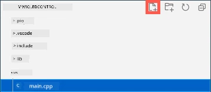

# គ្រប់គ្រងពន្លឺយប់របស់អ្នកតាមអ៊ីនធឺណិត - Wio Terminal

ឧបករណ៍ IoT ត្រូវបានត្រូវកូដដើម្បីផ្ញើសារជាមួយ *test.mosquitto.org* ដោយប្រើ MQTT ដើម្បីផ្ញើតម្លៃទិន្នន័យពីសენსួរពន្លឺ និងទទួលបញ្ញាត្រឿងហៅដើម្បីគ្រប់គ្រង LED។

នៅក្នុងផ្នែកនេះនៃមេរៀន អ្នកនឹងភ្ជាប់ Wio Terminal របស់អ្នកទៅកាន់ MQTT broker។

## ដំឡើងបណ្ណាល័យ WiFi និង MQTT របស់ Arduino

ដើម្បីផ្ញើពត៌មានទៅ MQTT broker អ្នកត្រូវតែដំឡើងបណ្ណាល័យ Arduino មួយចំនួនសម្រាប់ប្រើប្រាស់ឈីប WiFi នៅក្នុង Wio Terminal ហើយធ្វើការទំនាក់ទំនងជាមួយ MQTT។ នៅពេលអភិវឌ្ឍសម្រាប់ឧបករណ៍ Arduino អ្នកអាចប្រើបណ្ណាល័យជាច្រើនដែលមានកូដបើកចំហ និងដំណើរការជាច្រើនមុខងារ។ Seeed ផ្សព្វផ្សាយបណ្ណាល័យសម្រាប់ Wio Terminal ដែលអនុញ្ញាតឲ្យវាចាប់ផ្តើមទំនាក់ទំនងតាមរយៈ WiFi។ អ្នកអភិវឌ្ឍផ្សេងទៀតបានផ្ដល់បណ្ណាល័យដើម្បីភ្ជាប់ទៅម៉ាស៊ីន MQTT broker ហើយអ្នកនឹងប្រើប្រាស់វាជាមួយឧបករណ៍របស់អ្នក។

បណ្ណាល័យទាំងនេះត្រូវបានផ្ដល់ជាកូដដើមដែលអាចនាំចូលដោយស្វ័យប្រវត្តិទៅ PlatformIO ហើយបញ្ចូលទៅក្នុងឧបករណ៍របស់អ្នក។ ដូច្នេះបណ្ណាល័យ Arduino នឹងដំណើរការលើឧបករណ៍ណាមួយដែលគាំទ្រ។ Arduino framework ប្រសិនបើឧបករណ៍មានឧបករណ៍វ hardware ជាក់លាក់ដែលបណ្ណាល័យត្រូវការជាជាងនេះ។ បណ្ណាល័យខ្លះៗ ដូចជា បណ្ណាល័យ Seeed WiFi គឺជាសម្បទានទៅឧបករណ៍វិសេស។

បណ្ណល័យអាចត្រូវបានដំឡើងទូទៅ និងបង្កើតឡើងវិញ ប្រសិនបើត្រូវការឬនៅក្នុងគម្រោងជាក់លាក់។ សម្រាប់ភារកិច្ចនេះ អ្នកនឹងដំឡើងបណ្ណាល័យទៅក្នុងគម្រោងនេះ។

✅ អ្នកអាចស្វែងយល់បន្ថែមអំពីការគ្រប់គ្រងបណ្ណាល័យ និងរបៀបរកនិងដំឡើងបណ្ណាល័យនៅក្នុង [ឯកសារបណ្ណាល័យ PlatformIO](https://docs.platformio.org/en/latest/librarymanager/index.html)។

### ភារកិច្ច - ដំឡើងបណ្ណាល័យ WiFi និង MQTT របស់ Arduino

ដំឡើងបណ្ណាល័យ Arduino។

1. បើកគំរូ nightlight ក្នុង VS Code។

1. បន្ថែមអ្វីខាងក្រោមទៅចុងឯកសារ `platformio.ini`៖

    ```ini
    lib_deps =
        seeed-studio/Seeed Arduino rpcWiFi @ 1.0.5
        seeed-studio/Seeed Arduino FS @ 2.1.1
        seeed-studio/Seeed Arduino SFUD @ 2.0.2
        seeed-studio/Seeed Arduino rpcUnified @ 2.1.3
        seeed-studio/Seeed_Arduino_mbedtls @ 3.0.1
    ```

    នេះនាំចូលបណ្ណាល័យ Seeed WiFi។ សញ្ញា `@ <number>` មានន័យបង្ហាញទៅលេខកំណែជាក់លាក់នៃបណ្ណល័យ។

    > 💁 អ្នកអាចយក `@ <number>` ចេញដើម្បីប្រើម៉ូដែលថ្មីបំផុតនៃបណ្ណាល័យ តែពុំមានការធានាថាម៉ូដែលថ្មីនឹងដំណើរការ​ជាមួយកូដខាងក្រោម។ កូដនៅទីនេះត្រូវបានសាកល្បងជាមួយវ៉ើស្យុងនៃបណ្ណាល័យនេះ។

    នេះគឺជាអ្វីដែលអ្នកត្រូវធ្វើដើម្បីបន្ថែមបណ្ណាល័យ។ ពេលក្រោយពេល PlatformIO សាងសង់គំរោង នឹងទាញយកកូដដើមនៃបណ្ណាល័យទាំងនេះមក ហើយបង្កើតវាទៅក្នុងគម្រោងរបស់អ្នក។

1. បន្ថែមអ្វីខាងក្រោមទៅ `lib_deps`៖

    ```ini
    knolleary/PubSubClient @ 2.8
    ```

    នេះនាំចូល [PubSubClient](https://github.com/knolleary/pubsubclient) ដែលជាអតិថិជន MQTT សម្រាប់ Arduino

## ភ្ជាប់ទៅ WiFi

ឥឡូវនេះ Wio Terminal អាចភ្ជាប់ទៅ WiFi បានហើយ។

### ភារកិច្ច - ភ្ជាប់ទៅ WiFi

ភ្ជាប់ Wio Terminal ទៅ WiFi។

1. បង្កើតឯកសារថ្មីនៅក្នុងថត `src` ឈ្មោះ `config.h`។ អ្នកអាចធ្វើបានដោយជ្រើសម្សៅថត `src` ឬឯកសារ `main.cpp` ខណៈអ្នកស្នាក់នៅលើ Explorer រួចចុចប៊ូតុង **New file** ។ ប៊ូតុងនេះនឹងបង្ហាញនៅពេលកួចរបស់អ្នកនៅលើ Explorer។

    

1. បន្ថែមកូដខាងក្រោមទៅឯកសារនេះ ដើម្បីកំណត់អថេរ​លេខសំងាត់​សម្រាប់គណនី WiFi របស់អ្នក៖

    ```cpp
    #pragma once

    #include <string>
    
    using namespace std;
    
    // សារព័ត៌មានភ្ជាប់ WiFi
    const char *SSID = "<SSID>";
    const char *PASSWORD = "<PASSWORD>";
    ```

    ជំនួស `<SSID>` ជាមួយឈ្មោះ SSID របស់ WiFi។ ជំនួស `<PASSWORD>` ជាមួយពាក្យសម្ងាត់ WiFi របស់អ្នក។

1. បើកឯកសារ `main.cpp`

1. បន្ថែមបញ្ចូល `#include` ខាងក្រោមនៅចំណុចលើឯកសារ៖

    ```cpp
    #include <PubSubClient.h>
    #include <rpcWiFi.h>
    #include <SPI.h>
    
    #include "config.h"
    ```

    នេះរួមបញ្ចូលឯកសារចំណងជើងសម្រាប់បណ្ណាល័យដែលអ្នកបានដំឡើងជាមុនដូចជាឯកសារ config ។ ឯកសារចំណងជើងទាំងនេះចាំបាច់សម្រាប់បង្ហាញ PlatformIO ឲ្យយកកូដពីបណ្ណាល័យមក។ ប្រសិនបើមិនបានរួមបញ្ចូល ឯកសារចំណងជើងទាំងនេះ មួយចំនួននៃកូដនឹងមិនបានបញ្ចូល និងអ្នកនឹងទទួលបានកំហុសក្រោមកម្មវិធីសម្រួល។

1. បន្ថែមកូដខាងក្រោមមួយចំនួននៅលើមុខមុខ `setup` function៖

    ```cpp
    void connectWiFi()
    {
        while (WiFi.status() != WL_CONNECTED)
        {
            Serial.println("Connecting to WiFi..");
            WiFi.begin(SSID, PASSWORD);
            delay(500);
        }
    
        Serial.println("Connected!");
    }
    ```

    កូដនេះធ្វើការជាមួយរហូតឧបករណ៍ភ្ជាប់ WiFi មិនទាន់បាន តែងតែព្យាយាមប្រើ SSID និងពាក្យសម្ងាត់ពីឯកសារ config ។

1. បន្ថែមការហៅមុខងារនេះនៅចុង `setup` function បន្ទាប់ពីតភ្ជាប់បរិក្ខារជាមួយឆ្វេងខាងត្រង់។

    ```cpp
    connectWiFi();
    ```

1. ផ្ញើកូដទៅឧបករណ៍ ដើម្បីពិនិត្យមើលការភ្ជាប់ WiFi ដំណើរការ។ អ្នកគួរតែឃើញអ្វីនេះនៅក្នុងម៉ូនីទ័រស៊េរីល។

    ```output
    > Executing task: platformio device monitor <
    
    --- Available filters and text transformations: colorize, debug, default, direct, hexlify, log2file, nocontrol, printable, send_on_enter, time
    --- More details at http://bit.ly/pio-monitor-filters
    --- Miniterm on /dev/cu.usbmodem1101  9600,8,N,1 ---
    --- Quit: Ctrl+C | Menu: Ctrl+T | Help: Ctrl+T followed by Ctrl+H ---
    Connecting to WiFi..
    Connected!
    ```

## ភ្ជាប់ទៅ MQTT

ក្រោយពី Wio Terminal ភ្ជាប់ទៅ WiFi បាន វាអាចភ្ជាប់ទៅ MQTT broker បាន។

### ភារកិច្ច - ភ្ជាប់ទៅ MQTT

ភ្ជាប់ទៅ MQTT broker។

1. បន្ថែមកូដខាងក្រោមទល់ចុងឯកសារ `config.h` ដើម្បីកំណត់ព័ត៌មានភ្ជាប់សម្រាប់ MQTT broker៖

    ```cpp
    // ការកំណត់ MQTT
    const string ID = "<ID>";
    
    const string BROKER = "test.mosquitto.org";
    const string CLIENT_NAME = ID + "nightlight_client";
    ```

    ជំនួស `<ID>` ជាមួយលេខសម្គាល់តែមួយដែលនឹងប្រើជាឈ្មោះឈ្មោះកម្មវិធី client នៃឧបករណ៍នេះ និងបន្ទាប់សម្រាប់ប្រធានបទដែលឧបករណ៍នេះផ្សាយ និងជាវ។ Broker *test.mosquitto.org* ជាសាធារណៈ និងអ្នកជាច្រើន ប្រើ រួមមាននិស្សិតផ្សេងទៀតដែលកំពុងរៀនដោយមានភារកិច្ចនេះ។ ការមានឈ្មោះ client MQTT និងប្រធានបទតែមួយធានាថាកូដរបស់អ្នកមិនប៉ះពាល់ជាមួយអ្នកផ្សេងទៀតទេ។ អ្នកនឹងត្រូវការបញ្ចូល ID នេះ នៅពេលបង្កើតកូដម៉ាស៊ីវនៅផ្នែកក្រោយនៃភារកិច្ចនេះ។

    > 💁 អ្នកអាចប្រើវែបសាយដូចជា [GUIDGen](https://www.guidgen.com) ដើម្បីបង្កើត ID តែមួយ។

    `BROKER` គឺជា URL របស់ MQTT broker។

    `CLIENT_NAME` គឺជា ឈ្មោះឯកឯងសម្រាប់ client MQTT នេះនៅលើ broker។

1. បើកឯកសារ `main.cpp` និងបន្ថែមកូដខាងក្រោមក្រោមមុខងារ `connectWiFi` និងខាងលើមុខងារ `setup`៖

    ```cpp
    WiFiClient wioClient;
    PubSubClient client(wioClient);
    ```

    កូដនេះបង្កើតអតិថិជន WiFi ដោយប្រើបណ្ណាល័យ WiFi របស់ Wio Terminal ហើយប្រើវា ដើម្បីបង្កើតអតិថិជន MQTT។

1. ខាងក្រោមកូដនេះ បន្ថែមកូដដូចខាងក្រោម៖

    ```cpp
    void reconnectMQTTClient()
    {
        while (!client.connected())
        {
            Serial.print("Attempting MQTT connection...");
    
            if (client.connect(CLIENT_NAME.c_str()))
            {
                Serial.println("connected");
            }
            else
            {
                Serial.print("Retying in 5 seconds - failed, rc=");
                Serial.println(client.state());
                
                delay(5000);
            }
        }
    }
    ```

    មុខងារនេះសាកល្បងភ្ជាប់ទៅ MQTT broker ហើយភ្ជាប់ឡើងវិញ ប្រសិនបើមិនបានភ្ជាប់។ វាតែងតែបញ្ចូលឡើងវិញជាបន្ត ប៉ះពិចារណារវាងទីបន្ថែម និងព្យាយាមភ្ជាប់ដោយប្រើឈ្មោះ client តែមួយដែលបានកំណត់ក្នុងឯកសារ config។

    ប្រសិនបើភ្ជាប់មិនបាន វានឹងព្យាយាមម្ដងទៀតបន្ទាប់ពី 5 វិនាទី។

1. បន្ថែមកូដខាងក្រោមទៅក្រោមមុខងារ `reconnectMQTTClient`៖

    ```cpp
    void createMQTTClient()
    {
        client.setServer(BROKER.c_str(), 1883);
        reconnectMQTTClient();
    }
    ```

    កូដនេះកំណត់ broker MQTT សម្រាប់ client រួចរៀបចំ callback នៅពេលទទួលសារមក។ បន្ទាប់មកវាធ្វើការប្រាវប្រាណភ្ជាប់ទៅ broker ។

1. ហៅមុខងារ `createMQTTClient` ក្នុង `setup` function បន្ទាប់ពីភ្ជាប់ WiFi បាន។

1. ជំនួស `loop` function ពេញលេញ ជាមួយអ្វីខាងក្រោម៖

    ```cpp
    void loop()
    {
        reconnectMQTTClient();
        client.loop();
    
        delay(2000);
    }
    ```

    កូដនេះចាប់ផ្តើមដោយភ្ជាប់ឡើងវិញទៅ MQTT broker។ ការតភ្ជាប់ទាំងនេះអាចផ្អាកបានយ៉ាងងាយ សម្រាប់នេះគួរតែប្រាកដថាពិនិត្យ និងភ្ជាប់ឡើងវិញយ៉ាងស្អាត។ បន្ទាប់មកវាជូនការហៅមុខងារ `loop` លើ client MQTT ដើម្បីដំណើរការសារណាណាដែលចូលមកឡើងនៅលើប្រធានបទដែលបានជាវ។ កម្មវិធីនេះមានតែ១ច្រកដូច្នេះមិនអាចទទួលសារដោយថ្នាក់ក្រោយបាន ទេសំនោរកំលាំងនៅលើថ្នាក់ដើមត្រូវបានផ្តល់ឱ្យដំណើរការសារទាំងអស់ត្រួតពិនិត្យនៅលើតំណភ្ជាប់បណ្ដាញ។

    ចុងក្រោយ ការបោះពេលវេលា 2 វិនាទីធ្វើឲ្យកម្រិតពន្លឺមិនត្រូវបានផ្ញើជាញឹកញាប់ ហើយបន្ថយការបរិភោគថាមពលរបស់ឧបករណ៍។

1. ផ្ញើកូដទៅ Wio Terminal របស់អ្នក ហើយប្រើ Serial Monitor ដើម្បីមើលឧបករណ៍ភ្ជាប់ទៅ WiFi និង MQTT។

    ```output
    > Executing task: platformio device monitor <
    
    source /Users/jimbennett/GitHub/IoT-For-Beginners/1-getting-started/lessons/4-connect-internet/code-mqtt/wio-terminal/nightlight/.venv/bin/activate
    --- Available filters and text transformations: colorize, debug, default, direct, hexlify, log2file, nocontrol, printable, send_on_enter, time
    --- More details at http://bit.ly/pio-monitor-filters
    --- Miniterm on /dev/cu.usbmodem1201  9600,8,N,1 ---
    --- Quit: Ctrl+C | Menu: Ctrl+T | Help: Ctrl+T followed by Ctrl+H ---
    Connecting to WiFi..
    Connected!
    Attempting MQTT connection...connected
    ```

> 💁 អ្នកអាចរកឃើញកូដនេះនៅក្នុងថត [code-mqtt/wio-terminal](../../../../../1-getting-started/lessons/4-connect-internet/code-mqtt/wio-terminal)។

😀 អ្នកបានភ្ជាប់ឧបករណ៍របស់អ្នកជោគជ័យទៅ MQTT broker ហើយ។

---

<!-- CO-OP TRANSLATOR DISCLAIMER START -->
**ការបដិសេធ**៖  
ឯកសារនេះត្រូវបានបម្លែងភាសាដោយប្រើសេវាកម្មបម្លែងភាសា AI [Co-op Translator](https://github.com/Azure/co-op-translator)។ ខណៈពេលយើងព្យាយាមឲ្យបានត្រឹមត្រូវ សូមយល់ដឹងថាការបម្លែងភាសាដោយស្វ័យប្រវត្តិអាចមានកំហុស ឬភាពមិនត្រឹមត្រូវ។ ឯកសារដើមក្នុងភាសាមូលដ្ឋានគួรถูกចាត់ទុកជាឯកសារដែលមានអត្តសញ្ញាណធ្វើជារឹមគោល។ សម្រាប់ព័ត៌មានសំខាន់ៗ សូមផ្ដល់អនុសាសន៍ឲ្យបម្លែងភាសាដោយមនុស្សជំនាញជំនួញ។ យើងមិនទទួលខុសត្រូវចំពោះការយល់ច្រឡំ ឬការបកប្រែខុសដែលកើតមានពីការប្រើប្រាស់ការបម្លែងភាសានេះនោះទេ។
<!-- CO-OP TRANSLATOR DISCLAIMER END -->