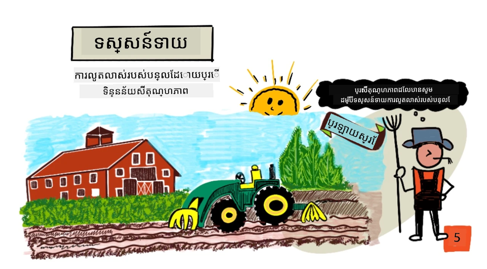
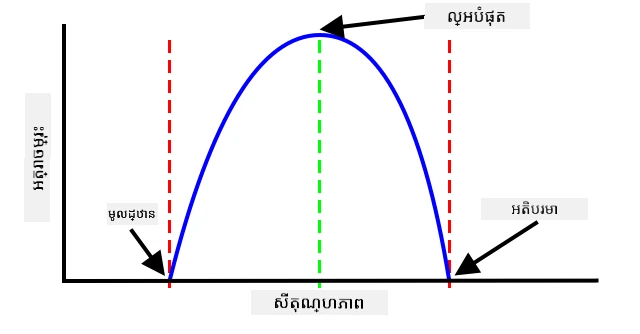
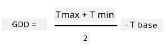
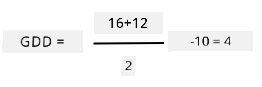
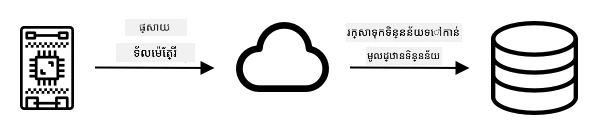
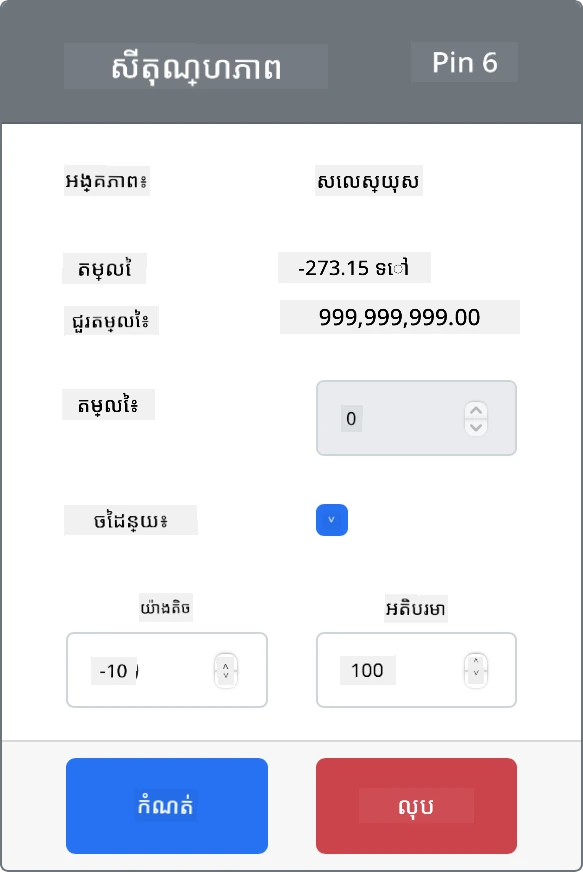
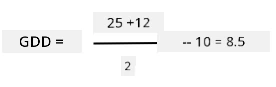

# ការព្យាករណ៍ការលូតលាស់របស់រុក្ខជាតិជាមួយ IoT



> រូបរាងសង្ខេបដោយ [Nitya Narasimhan](https://github.com/nitya)។ ចុចលើរូបនេះសម្រាប់មើលជារូបធំ។

## ប្រឡងមុនមេរៀន

[ប្រឡងមុនមេរៀន](https://black-meadow-040d15503.1.azurestaticapps.net/quiz/9)

## ណែនាំ

រុក្ខជាតិត្រូវការអ្វីខ្លះមួយចំនួនសម្រាប់លូតលាស់ - ទឹក, កាបូនឌីអុកស៊ីដ, សារធាតុអាហារ, ពន្លឺ និងកំដៅ។ ក្នុងមេរៀននេះ អ្នកនឹងរៀនពីរបៀបគណនាអត្រាការលូតលាស់ និងវ័យក្តៅរបស់រុក្ខជាតิโดยវាស់សីតុណ្ហភាពខ្យល់។

ក្នុងមេរៀននេះយើងនឹងដោះស្រាយ៖

* [កសិកម្មឌីជីថល](#កសិកម្មឌីជីថល)
* [ហេតុអ្វីបានជាសីតុណ្ហភាពមានសារៈសំខាន់នៅពេលធ្វើកសិកម្ម?](#ហេតុអ្វីបានជា​សីតុណ្ហភាព​មានសារៈសំខាន់​នៅពេល​ធ្វើ​កសិកម្ម)
* [វាស់សីតុណ្ហភាពបរិយាកាស](#វាស់សីតុណ្ហភាពបរិយាកាស)
* [កំរិតដឺក្រൾកើនឡើង (GDD)](#កំរិតដឺក្រែលកើនឡើង)
* [គណនាអំពី GDD ដោយប្រើទិន្នន័យឧបករណ៍វាស់សីតុណ្ហភាព](#គណនាកំរិត-gdd-ដោយប្រើទិន្នន័យឧបករណ៍វាស់សីតុណ្ហភាព)

## កសិកម្មឌីជីថល

កសិកម្មឌីជីថលកំពុងបម្លែងរបៀបដែលយើងធ្វើកសិកម្ម ដោយប្រើឧបករណ៍សម្រាប់ជួបប្រមូល, រក្សាទុក និងវិភាគទិន្នន័យពីការធ្វើកសិកម្ម។ យើងកំពុងនៅក្នុងដំណើរការដែលគេហៅថា 'ប្រជុំឧស្សាហកម្មទីបួន' ដោយក្រុមប្រឹក្សាអេកូណូមិចពិភពលោក ហើយការកើតមកនៃកសិកម្មឌីជីថលត្រូវបានគេហៅថា 'ប្រជុំកសិកម្មទីបួន' ឬ 'កសិកម្ម 4.0'។

> 🎓 ពាក្យ "កសិកម្មឌីជីថល" រួមបញ្ចូលខ្សែភាពយន្តទាំងមូល "ខ្សែកម្លាំងតម្លៃកសិកម្ម" ហើយមានផ្លូវចេញគ្រប់ពីស្រោមចាប់ពីកសិដ្ឋាន ដល់តុបរិច្ឆេទ។ វារួមមានការតាមដានគុណភាពផលិតផលនៅពេលចែកចាយ និងដំណើរការអាហារ ប្រព័ន្ធឃ្លាំង និងអ៊ី-កോമមិនស៍ រហូតដល់កម្មវិធីជួលម៉ាស៊ីនចំរុះ!

ការផ្លាស់ប្តូរនេះអនុញ្ញាតឲ្យអ្នកកសិកម្មបង្កើនផលិតផល ការប្រើប្រាស់ថ្ម fertilizer និង pesticide កាន់តិច ហើយប្រើទឹកយ៉ាងមានប្រសិទ្ធភាពថែមទៀត។ ទោះបីជាធ្វើនៅក្នុងប្រទេសមានអំណាចសេដ្ឋកិច្ច ក៏ឧបករណ៍វាស់ និងឧបករណ៍ផ្សេងទៀតក៏កំពុងតែល្អតម្លៃថោក ចំណាយតិចធ្វើឲ្យវាងាយស្រួលប្រើនៅក្នុងប្រទេសអភិវឌ្ឍន៍។

បច្ចេកទេសខ្លះៗដែលបានអនុញ្ញាតដោយកសិកម្មឌីជីថលមាន៖

* ការវាស់សីតុណ្ហភាព - ការវាស់សីតុណ្ហភាពអនុញ្ញាតឲ្យអ្នកកសិកម្មទាយទ្រង់នូវការលូតលាស់ និងវ័យក្តៅរបស់រុក្ខជាតិ។
* ការផ្តល់ទឹកដោយស្វ័យប្រវត្តិ - វាស់សំណើមដី ហើយបើកប្រព័ន្ធជីរដីពេលដីស្ងួតពេក ជំនួសការប្រាក់ទឹកតាមពេលកំណត់។ ការផ្តល់ទឹកតាមពេលកំណត់អាចនាំឲ្យផលិតផលបានទឹកមិនគ្រប់គ្រាន់នៅពេលកំដៅ និងសំណើមទាប ឬទឹកលើសពេលភ្លៀង។ ដោយផ្តល់ទឹកពេលដែលដីត្រូវការ អ្នកកសិកម្មអាចប្រើប្រាស់ទឹកបានត្រឹមត្រូវ។
* ការត្រួតពិនិត្យសត្វល្អិត - អ្នកកសិកម្មអាចប្រើកាមេរ៉ាព្រមទាំងរ៉ូបូតឬឌ្រូនក្នុងការត្រួតពិនិត្យសត្វល្អិត ហើយបញ្ចូលថ្នាំប្រឆាំងសត្វល្អិតត្រឹមត្រូវកន្លែងដែលត្រូវការ បន្ថយការប្រើប្រាស់ថ្នាំ និងការលេចធ្លាយថ្នាំចូលទៅក្នុងប្រព័ន្ធទឹកក្នុងតំបន់។

✅ សូមស្រាវជ្រាវបន្ថែម។ តើបច្ចេកទេសផ្សេងទៀតមានអ្វីខ្លះដែលប្រើសម្រាប់បង្កើនផលិតផល?

> 🎓 ពាក្យ 'កសិកម្មម៉ឺតត្រឹម' (Precision Agriculture) ត្រូវបានប្រើសម្រាប់កំណត់ការសង្កេត, វាស់ និងឆ្លើយតបទៅនឹងដំណាំក្នុងមួយចំណតដី ឬតំបន់តូចៗផ្សេងទៀតក្នុងកសិដ្ឋាន។ វារួមបញ្ចូលការវាស់ជំងឺសត្វល្អិត ការបំពង់ទឹក និងសារធាតុអាហារ ហើយឆ្លើយតបយ៉ាងត្រឹមត្រូវ ដូចជា ផ្តល់ទឹកតែនៅតំបន់តូចៗរបស់ចំណតដីប៉ុណ្ណោះ។

## ហេតុអ្វីបានជា​សីតុណ្ហភាព​មានសារៈសំខាន់​នៅពេល​ធ្វើ​កសិកម្ម?

នៅពេលរៀនអំពីរុក្ខជាតិ បេក្ខជនភាគច្រើនត្រូវបានបង្រៀនអំពីការរស់នៅពីទឹក ពន្លឺ កាបូនឌីអុកស៊ីដ (CO<sub>2</sub>) និងសារធាតុអាហារ។ រុក្ខជាតិនៅតែត្រូវការកំដៅដើម្បីលូតលាស់ – នេះជាមូលហេតុដែលរុក្ខជាតិបង្ហើរបែបបង្ហោះនៅរដូវមេសាដោយសារកំដៅកើនឡើង, ហេតុអ្វីបានជាសម្លៀកបំពង់ទ្រនចឬផ្កាដីមានការលូតលាស់រហ័សដោយសារឧបករណ៍កំដៅខ្លីៗ, និងហេតុអ្វីបានជាបន្ទប់ក្តៅ និងផ្ទះបាយជាច្រើនមានប្រសិទ្ធភាពក្នុងការចិញ្ចឹមរុក្ខជាតិ។

> 🎓 បន្ទប់ក្តៅ និងផ្ទះបាយមានមុខងារដូចគ្នា ប៉ុន្តែមានភាពខុសគ្នាសំខាន់មួយ។ បន្ទប់ក្តៅត្រូវបានកំដៅដោយបច្ចេកវិទ្យា និងអនុញ្ញាតឲ្យអ្នកកសិកម្មគ្រប់គ្រងសីតុណ្ហភាពបានត្រឹមត្រូវ ខណៈផ្ទះបាយពឹងផ្អែកលើព្រះអាទិត្យសម្រាប់កំដៅ ហើយការគ្រប់គ្រងទូទៅគឺបើកបំពង់ ឬបង្អួចដើម្បីដេញកម្លាំងកំដៅចេញ។

រុក្ខជាតិត្រូវការសីតុណ្ហភាពមូលដ្ឋាន ឬអប្បបរមា សីតុណ្ហភាពល្អបំផុត និងសីតុណ្ហភាពអតិបរមា ដែលអាស្រ័យលើមធ្យមសីតុណ្ហភាពប្រចាំថ្ងៃ។

* សីតុណ្ហភាពមូលដ្ឋាន – តំណាងឱ្យសីតុណ្ហភាពមធ្យមប្រចាំថ្ងៃអប្បបរមាដែលត្រូវការ សម្រាប់រុក្ខជាតិលូតលាស់។
* សីតុណ្ហភាពល្អបំផុត – តំណាងឱ្យសីតុណ្ហភាពមធ្យមប្រចាំថ្ងៃដែលល្អបំផុតសម្រាប់ការលូតលាស់ច្រើនបំផុត។
* សីតុណ្ហភាពអតិបរមា – គឺសីតុណ្ហភាពអតិបរមាដែលរុក្ខជាតិសាមញ្ញអាចទ្រាំបាន។ នៅលើសីតុណ្ហភាពនេះរុក្ខជាតិ នឹងផ្អាកការលូតលាស់របស់ខ្លួនដើម្បីរក្សាទឹកនិងរស់នៅ។

> 💁 នេះជាសីតុណ្ហភាពមធ្យម ដែលគិតសរុបពីសីតុណ្ហភាពថ្ងៃ និងយប់។ រុក្ខជាតិត្រូវការសីតុណ្ហភាពខុសគ្នាជាពេលថ្ងៃ និងយប់ ដើម្បីជួយពPhotosynthesize ឱ្យមានប្រសិទ្ធភាព និងរក្សាទំហឹងថាមពលក្នុងយប់។

រុក្ខជាតិតំបន់ផ្សេងគ្នាអាចមានតម្លៃមូលដ្ឋាន, ល្អបំផុត និងអតិបរមាខុសៗគ្នា។ នេះជាមូលហេតុដែលរុក្ខជាតិខ្លះរីកចម្រើននៅប្រទេសក្តៅ ខណៈដទៃស្ថិតនៅប្រទេសត្រជាក់។

✅ សូមស្រាវជ្រាវបន្ថែម។ សម្រាប់រុក្ខជាតិណាមួយនៅក្នុងសួន, សាលា, ឬសួនសាធារណៈ ដើម្បីបើកលទ្ធផលសីតុណ្ហភាពមូលដ្ឋាន។



ក្រាហ្វខាងលើបង្ហាញអត្រាការលូតលាស់ដូចតំណាងទៅនឹងសីតុណ្ហភាព។ រហូតដល់សីតុណ្ហភាពមូលដ្ឋាន គ្មានការលូតលាស់ទេ។ អត្រាការលូតលាស់កើនឡើងដល់សីតុណ្ហភាពល្អបំផុត បន្ទាប់មកធ្លាក់ចុះចាប់ពីពេលនោះ។ នៅសីតុណ្ហភាពអតិបរមា ការលូតលាស់បញ្ឈប់។

រាងដំណាក់កាលនៃក្រាហ្វនេះផ្លាស់ប្តូរពីប្រភេទរុក្ខជាតិទៅប្រភេទ។ ខ្លះមានការធ្លាក់ចុះច្រើននៅលើសីតុណ្ហភាពល្អបំផុត ខណៈខ្លះកើនឡើងយឺតពីមូលដ្ឋានទៅលើសីតុណ្ហភាពល្អបំផុត។

> 💁 សម្រាប់អ្នកកសិកម្មដើម្បីទទួលបានការលូតលាស់ល្អបំផុត ពួកគេចាំបាច់ត្រូវដឹងតម្លៃសីតុណ្ហភាពទាំងបី និងយល់ពីរាងនៃក្រាហ្វរបស់រុក្ខជាតិនៅក្នុងការដាំដុះ។

បើអ្នកកសិកម្មគ្រប់គ្រងសីតុណ្ហភាពបាន, ឧ. នៅក្នុងបន្ទប់ក្តៅពាណិជ្ជកម្ម, ពួកគេអាចបង្រួមតាមរុក្ខជាតិបាន។ បន្ទប់ក្តៅពាណិជ្ជកម្មដែលដាំក្រូចឆ្មារ រៀបចំសីតុណ្ហភាពនៅប្រហោង 25°C ពេលថ្ងៃ និង 20°C ពេលយប់ ដើម្បីឲ្យរុក្ខជាតិលូតលាស់លឿនបំផុត។

> 🍅 ការលាយបញ្ចូលសីតុណ្ហភាពទាំងនេះជាមួយពន្លឺសិប្បនិម្មិត, សារធាតុរុក្ខជាតិ និងកំរិតទឹកកាបូនឌីអុកស៊ីដ (CO<sub>2</sub>) ដែលគ្រប់គ្រងបាន អ្នកដាំដុះពាណិជ្ជកម្មអាចចិញ្ចឹមនិងដាំចោលបានគ្រប់ពេលវេលា។

## វាស់សីតុណ្ហភាពបរិយាកាស

ឧបករណ៍វាស់សីតុណ្ហភាព អាចប្រើជាមួយឧបករណ៍ IoT ដើម្បីវាស់សីតុណ្ហភាពបរិយាកាស។

### កម្មវិធី - វាស់សីតុណ្ហភាព

អនុវត្តតាមមគ្គុទេសក៍សមរម្យសម្រាប់ត្រួតពិនិត្យសីតុណ្ហភាពដោយប្រើឧបករណ៍ IoT របស់អ្នក៖

* [Arduino - Wio Terminal](wio-terminal-temp.md)
* [កុំព្យូទ័រផ្ទាល់ខ្លួន - Raspberry Pi](pi-temp.md)
* [កុំព្យូទ័រផ្ទាល់ខ្លួន - ឧបករណ៍មេរុង_virtual](virtual-device-temp.md)

## កំរិតដឺក្រែលកើនឡើង

កំរិតដឺក្រែលកើនឡើង (ដែរ​ហៅ​ថា​គ្រឿង​នៅកំរិតដឺក្រែលកើនឡើង) គឺជា​របៀបវាស់អត្រាលូតលាស់របស់រុក្ខជាតិនៅលើសីតុណ្ហភាព។ បើសិនរុក្ខជាតិមានទឹកគ្រប់គ្រាន់ សារធាតុអាហារ និង CO<sub>2</sub> តម្រូវ, សីតុណ្ហភាពជាអ្វីដែលកំណត់អត្រាលូតលាស់។

កំរិតដឺក្រែលកើនឡើង (GDD) គណនាប្រចាំថ្ងៃជាមធ្យមសីតុណ្ហភាពក្នុងដឺក្រេសែលស្យ៊ីយសម្រាប់មួយថ្ងៃលើសព្រំដែនសីតុណ្ហភាពមូលដ្ឋានរបស់រុក្ខជាតិ។ រៀងរាល់រុក្ខជាតិត្រូវការកំរិត GDD មួយចំនួនសម្រាប់លូតលាស់, ចង្វាក់ផ្កា ឬផលិត និងវ័យក្តៅ។ កំរិត GDD ក្នុងមួយថ្ងៃច្រើនប៉ុណ្ណោះ រុក្ខជាតិលូតលាស់លឿនប៉ុណ្ណោះ។

> 🇺🇸 សម្រាប់អ្នកអាមេរិក កំរិត GDD ក៏អាចគណនាដោយប្រើហ្វារ៉េនហៃត៍ផងដែរ។ 5 GDD<sup>C</sup> (GDD នៅ Celsius) ស្មើនឹង 9 GDD<sup>F</sup> (GDD នៅ Fahrenheit)។

រូបមន្តពេញលេញសម្រាប់ GDD មានស្មុគស្មាញខ្លាំង តែមានរូបមន្តសាមញ្ញដែលច្រើនប្រើសម្រាប់ប្រហាក់ប្រហែលល្អ៖



* **GDD** - ចំនួនកំរិតដឺក្រែលកើនឡើង
* **T<sub>max</sub>** - សីតុណ្ហភាពបំផុតប្រចាំថ្ងៃនៅចំណុចសេស្យ៊ូ
* **T<sub>min</sub>** - សីតុណ្ហភាពអប្បបរមាប្រចាំថ្ងៃនៅចំណុចសេស្យ៊ូ
* **T<sub>base</sub>** - សីតុណ្ហភាពមូលដ្ឋានរបស់រុក្ខជាតិនៅចំណុចសេស្យ៊ូ

> 💁 មានការផ្លាស់ប្តូរលើក T<sub>max</sub> លើស 30°C ឬ T<sub>min</sub> ក្រោម T<sub>base</sub> ប៉ុន្តែយើងនឹងមិនគិតសម្រាប់ពេលនេះទេ។

### ឧទាហរណ៍ - ស្រូវខេមឬស្រូវគោ 🌽

អាស្រ័យលើប្រភេទ ស្រូវស្រូវ (ឬស្រូវគោ) ត្រូវការទៅ בין 800 និង 2,700 GDD ដើម្បីវ័យក្តៅ ជាមួយសីតុណ្ហភាពមូលដ្ឋាន 10°C។

នៅថ្ងៃដំបូងលើសសីតុណ្ហភាពមូលដ្ឋាន សីតុណ្ហភាពត្រូវបានវាស់បានដូចតទៅ៖

| វាស់ | សីតុណ្ហភាព °C |
| :---------- | :-----: |
| ខ្ពស់បំផុត     | 16      |
| ទាបបំផុត     | 12      |

ដាក់លេខទាំងនេះក្នុងការគណនា៖

* T<sub>max</sub> = 16
* T<sub>min</sub> = 12
* T<sub>base</sub> = 10

នេះផ្តល់នូវការគណនាដូចតទៅ៖



ស្រូវបានទទួល 4 GDD នៅថ្ងៃនោះ។ បើសិនជាប្រភេទស្រូវត្រូវការទៅ 800 GDD ដើម្បីវ័យក្តៅ វានឹងត្រូវការបន្ថែម 796 GDD ទៀតដើម្បីបង្កើតវ័យក្តៅ។

✅ សូមស្រាវជ្រាវបន្ថែម។ សម្រាប់រុក្ខជាតិណាមួយដែលមាននៅក្នុងសួន សាលា ឬសួនសាធារណៈ សូមពិនិត្យថាចំនួន GDD ត្រូវការជា​ប៉ុន្មានដើម្បីវ័យក្តៅ ឬបង្កើតផលិតផល។

## គណនាកំរិត GDD ដោយប្រើទិន្នន័យឧបករណ៍វាស់សីតុណ្ហភាព

រុក្ខជាតិកើតឡើងមិនមែនតាមកាលបរិច្ឆេទថ្នាក់ខ្លះទេ - ឧ. អ្នកមិនអាចដាំគ្រាប់បានហើយដឹងថារុក្ខជាតិ​នឹងផ្តល់ផ្លែប្រហែល 100 ថ្ងៃក្រោយបានទេ។ ជំនួសវិញ អ្នកកសិកម្មអាចមានគំនិតប្រហែលពីរយៈពេលរុក្ខជាតិចាំបាច់សម្រាប់លូតលាស់ ហើយពិនិត្យរៀងរាល់ថ្ងៃថាតើផលិតផ្លែរបស់ខ្លួនបានរួចរឺនៅ។

នេះមានឥទ្ធិពលធំលើការងាររបស់ពលករ នៅក្នុងកសិដ្ឋានធំៗ ទំនងជាអ្នកកសិកម្មនឹងខកខានការទទួលផលក្នុងករណីផលិតផលមានភាពរីកចម្រើនរហ័ស។ ដោយវាស់សីតុណ្ហភាព អ្នកកសិកម្មអាចគណនាកំរិត GDD ដែលរុក្ខជាតិទទួលបាន ប្រាប់ឲ្យពួកគេត្រួតពិនិត្យនៅកន្លែងជិតនឹងគណនាបាន។

ដោយប្រមូលទិន្នន័យសីតុណ្ហភាពដោយឧបករណ៍ IoT អ្នកកសិកម្មអាចទទួលបានការជូនដំណឹងដោយស្វ័យប្រវត្តិពេលរុក្ខជាតិជិតវ័យក្តៅ។ ស្ថាបត្យកម្មមួយក្នុងករណីនេះគឺឲ្យឧបករណ៍ IoT វាស់សីតុណ្ហភាព ហើយបញ្ជូនទិន្នន័យនោះតាមអ៊ិនធឺណិតប្រើ MQTT។ កូដម៉ាស៊ីនមេនឹងស្ដាប់ទិន្នន័យនេះ និងរក្សាទុកទៅកាន់ទីតាំងណាមួយ ដូចជាឃ្លាំងទិន្នន័យ។ នេះអនុញ្ញាតឲ្យវាអាចវិភាគនៅពេលក្រោយ ដូចជាការងារប្រចាំយប់ក្នុងការគណនាកំរិត GDD ប្រចាំថ្ងៃ, បូកសរុប GDD សម្រាប់ប នសរុប និងបញ្ជូនព្រឹត្តិការណ៍ពេលដំណាំជិតវ័យក្តៅ។



កូដម៉ាស៊ីនមេក៏អាចបន្ថែមទិន្នន័យបន្ថែមបាន។ ឧ. ឧបករណ៍ IoT អាចផ្សាយលេខសម្គាល់ ដើម្បីបង្ហាញថាឧបករណ៍ណា ហើយកូដម៉ាស៊ីនមេប្រើលេខសម្គាល់នេះសម្រាប់ស្វែងរកទីតាំងនៃឧបករណ៍ និងដំណាំដែលវាប្រុងប្រយ័ត្ន។ វាក៏អាចបន្ថែមទិន្នន័យមូលឋាន ដូចជា ពេលវេលាបច្ចុប្បន្នដោយសារមានឧបករណ៍ IoT មួយចំនួនមិនមានរឹងប៊៍វ៉ែរផ្គត់ផ្គង់ពេលវេលាត្រឹមត្រូវ ឬត្រូវការកូដបន្ថែមដើម្បីអានពេលវេលាតាមអ៊ិនធឺណិត។

✅ តើហេតុអ្វីបានជា អ្នកគិតថាចំណតដីខុសៗគ្នាអាចមានសីតុណ្ហភាពខុសគ្នា?

### កម្មវិធី - ផ្សាយព័ត៌មានសីតុណ្ហភាព

អនុវត្តតាមមគ្គុទេសក៍សមរម្យសម្រាប់ផ្សាយទិន្នន័យសីតុណ្ហភាពតាម MQTT ដោយប្រើឧបករណ៍ IoT របស់អ្នក ដូច្នេះវាអាចវិភាគនៅពេលក្រោយ៖

* [Arduino - Wio Terminal](wio-terminal-temp-publish.md)
* [កុំព្យូទ័រផ្ទាល់ខ្លួន - Raspberry Pi/ឧបករណ៍ IoT មេរុង_virtual](single-board-computer-temp-publish.md)

### កម្មវិធី - ចាប់យក និងរក្សាទុកព័ត៌មានសីតុណ្ហភាព

ពេលឧបករណ៍ IoT ផ្សាយទិន្នន័យ telemetry, អ្នកអាចសរសេរកូដម៉ាស៊ីនមេដើម្បីជាវទិន្នន័យនិងរក្សាទុកវា។ មិនមែនរក្សាទុកក្នុងឃ្លាំងទិន្នន័យ តែរក្សាទុកជា​ឯកសារ CSV (Comma Separated Values)។ ឯកសារ CSV រក្សាទិន្នន័យជាជួរតួ​របស់តម្លៃជាអក្សរ បំបែកដោយឧទាហរណ៍ ហើយរេកតខ្ទង់មួយនៅជួរថ្មី។ វា​ជា​របៀបងាយស្រួល មានមនុស្សអាចអាន និងឧបករណ៍គាំទ្រជាច្រើនសំរាប់រក្សាទុកទិន្នន័យជាឯកសារ។

ឯកសារ CSV នឹងមាន ២ ជួរឈរ – *កាលបរិច្ឆេទ* និង *សីតុណ្ហភាព*។ ជួរឈរ *កាលបរិច្ឆេទ* កំណត់ជាកាលបរិច្ឆេទ និងម៉ោងបច្ចុប្បន្នដែលសារ​ត្រូវបានទទួលដោយម៉ាស៊ីនមេ។ ជួរឈរ *សីតុណ្ហភាព* មកពីសារទិន្នន័យ telemetry។

1. អនុវត្តជំហានក្នុងមេរៀន 4 ដើម្បីបង្កើតកូដម៉ាស៊ីនមេសម្រាប់ជាវទិន្នន័យ telemetry។ អ្នកមិនចាំបាច់បន្ថែមកូដផ្សាយពាក្យបញ្ជាទេ។

    ជំហានសម្រាប់នេះមាន៖

    * កំណត់ និងសកម្ម Virtual EnvironmentPython

    * ដំឡើងកញ្ចប់ paho-mqtt

    * សរសេរកូដដើម្បីស្តាប់សារ MQTT ដែលផ្សាយលើប្រធានបទ telemetry

      > ⚠️ អ្នកអាចយោងទៅមេរៀន 4 សម្រាប់បង្កើតកម្មវិធី Python ដើម្បីទទួល telemetry ប្រសិនបើចាំបាច់។(../../../1-getting-started/lessons/4-connect-internet/README.md#receive-telemetry-from-the-mqtt-broker)

    ឈ្មោះថតគម្រោងនេះជា `temperature-sensor-server`។

1. ត្រួតពិនិត្យឲ្យប្រាកដថា `client_name` បង្ហាញគម្រោងនេះ៖

    ```cpp
    client_name = id + 'temperature_sensor_server'
    ```

1. បន្ថែមការនាំចូលខាងក្រោម នៅខាងលើឯកសារ ខាងក្រោមការនាំចូលដែលមានស្រាប់៖

    ```python
    from os import path
    import csv
    from datetime import datetime
    ```

    នេះនាំចូលបណ្ណាល័យសម្រាប់អានឯកសារ, បណ្ណាល័យសម្រាប់ប្រើរួមគ្នាជាមួយឯកសារ CSV និងបណ្ណាល័យជួយគណនាពេលវេលា។

1. បន្ថែមកូដខាងក្រោមមុនមុខងារ `handle_telemetry`៖

    ```python
    temperature_file_name = 'temperature.csv'
    fieldnames = ['date', 'temperature']
    
    if not path.exists(temperature_file_name):
        with open(temperature_file_name, mode='w') as csv_file:
            writer = csv.DictWriter(csv_file, fieldnames=fieldnames)
            writer.writeheader()
    ```

    កូដនេះកំណត់អថេរប្រាំបីសម្រាប់ឈ្មោះឯកសារសម្រាប់សរសេរ និងឈ្មោះជួរឈរជាផងសម្រាប់ឯកសារ CSV។ ជួរដំបូងរបស់ឯកសារ CSV ជាheader ដែលផ្ទុកឈ្មោះជួរឈរ ដែលបំបែកដោយកომ៉ា។

    កូដនេះពិនិត្យមើលថា​ឯកសារ CSV មានរួចហើយឬអត់។ បើមិនទាន់មាន វាត្រូវបានបង្កើតជាមួយ header នៅជួរដំបូង។

1. បន្ថែមកូដខាងក្រោមទៅចុងមុខងារ `handle_telemetry`៖

    ```python
    with open(temperature_file_name, mode='a') as temperature_file:        
        temperature_writer = csv.DictWriter(temperature_file, fieldnames=fieldnames)
        temperature_writer.writerow({'date' : datetime.now().astimezone().replace(microsecond=0).isoformat(), 'temperature' : payload['temperature']})
    ```

កូដនេះបើកឯកសារ CSV បន្ទាប់មកបន្ថែមជួរថ្មីមួយនៅចុង។ ជួរនេះមានទិន្នន័យបច្ចុប្បន្ន និងពេលវេលាស្របតាមទ្រង់ទ្រាយដែលអាចអានបានដោយមនុស្ស ហើយបន្ទាប់មកវាត្រូវបានបំពេញដោយសីតុណ្ហភាពដែលទទួលបានពីឧបករណ៍ IoT។ ទិន្នន័យត្រូវបានរក្សាទុកនៅក្នុងទ្រង់ទ្រាយ [ISO 8601 format](https://wikipedia.org/wiki/ISO_8601) ដែលមានតំបន់ម៉ោង ប៉ុន្តែមិនមានមីក្រូវិនាទី។

1. ប្រតិបត្តិការកូដនេះដូចដែលមុន ដើម្បីធានាថាឧបករណ៍ IoT របស់អ្នកកំពុងផ្ញើទិន្នន័យ។ ឯកសារ CSV ដែលមានឈ្មោះ `temperature.csv` នឹងត្រូវបានបង្កើតនៅក្នុងថតដដែល។ ប្រសិនបើអ្នកមើលវា អ្នកនឹងឃើញកាលបរិច្ឆេទ/ពេលវេលា និងការវាស់សីតុណ្ហភាពៈ

    ```output
    date,temperature
    2021-04-19T17:21:36-07:00,25
    2021-04-19T17:31:36-07:00,24
    2021-04-19T17:41:36-07:00,25
    ```
  
1. ប្រតិបត្តិការកូដនេះរយៈពេលមួយ ដើម្បីទទួលបានទិន្នន័យ។ ជាការពិត អ្នកគួរប្រតិបត្តិការនេះរយៈពេលមួយថ្ងៃពេញ ដើម្បីប្រមូលបានទិន្នន័យគ្របគ្រាន់សម្រាប់ការគណនារយៈពេល GDD។

    > 💁 ប្រសិនបើអ្នកកំពុងប្រើឧបករណ៍ IoT Virtual សូមជ្រើសប្រអប់បោះពុម្ព random និងកំណត់ជួរដើម្បីជៀសវាងការទទួលបានសីតុណ្ហភាពដដែលគ្រប់ពេលដែលតំលៃសីតុណ្ហភាពត្រូវបានត្រឡប់មកវិញ។  
     

    > 💁 ប្រសិនបើអ្នកចង់ប្រតិបត្តិការនេះរយៈពេលមួយថ្ងៃពេញ អ្នកត្រូវប្រាកដថាកុំព្យូទ័រដែលកំពុងរត់កូដម៉ាស៊ីនបម្រើរបស់អ្នកមិនត្រូវទៅដេក ដោយផ្លាស់ប្តូរការកំណត់ថាមពលរបស់អ្នក ឬរត់អ្វីមួយដូចជា [គន្លឹះ Python script ដើម្បីរក្សាប្រព័ន្ធមានសកម្មភាព](https://github.com/jaqsparow/keep-system-active)។

> 💁 អ្នកអាចរកឃើញកូដនេះនៅក្នុងថត [code-server/temperature-sensor-server](../../../../../2-farm/lessons/1-predict-plant-growth/code-server/temperature-sensor-server)។

### ភារកិច្ច - គណនារៀងរាល់ថ្ងៃ (GDD) ដោយប្រើទិន្នន័យដែលរក្សាទុក

ពេលម៉ាស៊ីនបម្រើបានទទួលទិន្នន័យសីតុណ្ហភាព GDD សម្រាប់រុក្ខជាតិអាចត្រូវបានគណនា។

ជំហានដើម្បីធ្វើនេះដោយដៃគឺ៖

1. រកសីតុណ្ហភាពមូលដ្ឋានសម្រាប់រុក្ខជាតិ។ ឧទាហរណ៍ សម្រាប់ផ្លែឈើទន្សាយ សីតុណ្ហភាពមូលដ្ឋានគឺ ១០°C។

1. ពី `temperature.csv` រកសីតុណ្ហភាពខ្ពស់បំផុត និងទាបបំផុតរបស់ថ្ងៃនោះ

1. ប្រើការគណនារៀងរាល់ថ្ងៃ (GDD) ដែលបានផ្តល់ពីមុន ដើម្បីគណនា GDD

ឧទាហរណ៍ ប្រសិនបើសីតុណ្ហភាពខ្ពស់បំផុតសម្រាប់ថ្ងៃនោះគឺ ២៥°C ហើយសីតុណ្ហភាពទាបបំផុតគឺ ១២°C ៖



* 25 + 12 = 37  
* 37 / 2 = 18.5  
* 18.5 - 10 = 8.5

ដូច្នេះផ្លែឈើទន្សាយទទួលបាន **8.5** GDD។ ផ្លែឈើទន្សាយត្រូវការអំពី ២៥០ GDD ដើម្បីផ្លាស់ប្តូរជាផល លើសពីនេះមិនទាន់បានទេ។

---

## 🚀 챌린지 (បញ្ហា)

រុក្ខជាតិចាំបាច់ត្រូវការថាមពលកម្ដៅគួរជាងនេះដើម្បីដុះឈើ។ តើមានអ្វីបន្ថែមទៀតដែលត្រូវការទៅ?

សម្រាប់រឿងទាំងនេះ សូមស្វែងរកថាតើមានខ្សែឧបករណ៍ដែលអាចវាស់វែងបានតែ மரែងបើកតែ? តើអ្វីទៅជា actuator ដើម្បីគ្រប់គ្រងកម្រិតទាំងនេះ? តើអ្នកនឹងរួមបញ្ចូលឧបករណ៍ IoT មួយ ឬច្រើនដើម្បីបង្កើតការកែលម្អដំណើរការការលូតលាស់រុក្ខជាតិយ៉ាងដូចម្តេច?

## វិញ្ញាសាបន្ទាប់បទបង្រៀន

[វិញ្ញាសាបន្ទាប់បទបង្រៀន](https://black-meadow-040d15503.1.azurestaticapps.net/quiz/10)

## ការពិនិត្យឡើងវិញ និងការសិក្សាឯករាជ្យ

* អានបន្ថែមអំពីកសិកម្មឌីជីថលនៅលើ [ទំព័រវិទ្យាសាស្ត្រកសិកម្មឌីជីថល Wikipedia](https://wikipedia.org/wiki/Digital_agriculture)។ នេះគឺសម្រាប់ការអានបន្ថែមអំពីកសិកម្មក្នុងតម្រឹមកំណត់ល្វែង [ទំព័រវិទ្យាសាស្ត្រកសិកម្មកំណត់ល្វែង Wikipedia](https://wikipedia.org/wiki/Precision_agriculture)។  
* ការគណនារយៈពេលបង្រួបបង្រួមលំដាប់ពេញលេញសម្រាប់ growing degree days មានភាពស្មុគស្មាញជាងសំណុំសម្រាប់មុននេះ។ អានបន្ថែមអំពីសមីការស្មុគស្មាញនិងរបៀបចាត់វិធានការសម្រាប់សីតុណ្ហភាពក្រោមមូលដ្ឋាននៅលើ [ទំព័រពេលវេលាកើនឡើង Growing Degree Day Wikipedia](https://wikipedia.org/wiki/Growing_degree-day)។  
* អាហារអាចមានកម្រិតខ្វះខាតនៅអនាគតទោះបីយើងនៅតែប្រើវិធីសាស្ត្រដដែលសម្រាប់ការដាំដុះផ្លូវការកសិកម្ម។ សូមរៀនបន្ថែមអំពីបច្ចេកវិទ្យាកសិកម្មខ្ពស់ក្នុងវីដេអូ [ផ្ទះស្រែ Hi-Tech Farms of Future នៅលើ YouTube](https://www.youtube.com/watch?v=KIEOuKD9KX8)។

## ភារកិច្ច

[បង្ហាញទិន្នន័យ GDD ដោយប្រើ Jupyter Notebook](assignment.md)

---

<!-- CO-OP TRANSLATOR DISCLAIMER START -->
**ការព្រមាន**:  
ឯកសារនេះត្រូវបានបកប្រែដោយប្រើសេវាបកប្រែ AI [Co-op Translator](https://github.com/Azure/co-op-translator)។ ខណៈពេលដែលយើងខិតខំរកភាពត្រឹមត្រូវ សូមចំណាំថាការបកប្រែដោយស្វ័យប្រវត្តិអាចមានកំហុសឬភាពមិនត្រឹមត្រូវ។ ឯកសារដើមដែលមានជាតិភាសាដើមគួរត្រូវបានពិចារណាថាជាជំនាញផ្លូវការនៃមូលដ្ឋាន។ សម្រាប់ព័ត៌មានសំខាន់ៗ សូមផ្តល់អាទិភាពការបកប្រែដោយមនុស្សជំនាញ។ យើងមិនទទួលខុសត្រូវចំពោះការយល់ច្រឡំឬការពន្យល់អ្វីៗដែលមានឡើងពីការប្រើប្រាស់ការបកប្រែនេះឡើយ។
<!-- CO-OP TRANSLATOR DISCLAIMER END -->