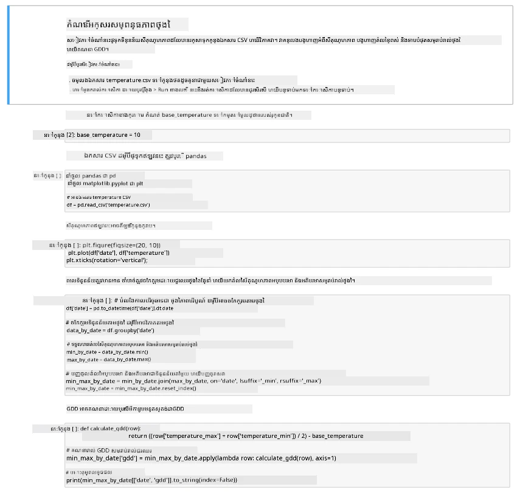

# មើលទិន្នន័យ GDD ដោយប្រើ Jupyter Notebook

## សេចក្ដីណែនាំ

នៅក្នុងមេរៀននេះ អ្នកបានប្រមូលទិន្នន័យ GDD ដោយប្រើឧបករណ៍យកព័ត៌មាន IoT មួយ។ ដើម្បីទទួលបានទិន្នន័យ GDDល្អ អ្នកត្រូវប្រមូលទិន្នន័យរយៈពេលច្រើនថ្ងៃ។ ដើម្បីជួយមើលទិន្នន័យសីតុណ្ហភាព និងគិត GDD អ្នកអាចប្រើឧបករណ៍ដូចជា [Jupyter Notebooks](https://jupyter.org) ដើម្បីវិភាគទិន្នន័យ។

ចាប់ផ្តើមដោយប្រមូលទិន្នន័យរយៈពេលប៉ុន្មានថ្ងៃ។ អ្នកត្រូវប្រាកដថាកូដម៉ាស៊ីនមេរបស់អ្នកកំពុងដំណើរការប្រកបដោយអានុភាពពេញចលនា រឺដោយកែតម្រូវការគ្រប់គ្រងថាមពល រឺរត់ script Python ដូចជា [នេះដែលរក្សាប្រព័ន្ធឲ្យដំណើរការបាន](https://github.com/jaqsparow/keep-system-active)។

ពេលអ្នកមានទិន្នន័យសីតុណ្ហភាពហើយ អ្នកអាចប្រើ Jupyter Notebook ក្នុង repo នេះដើម្បីមើលទិន្នន័យនិងគិត GDD។ Jupyter notebooks លាយការសរសេរកូដ និងសេចក្ដីណែនាំក្នុងប្លុកដែលអោយឈ្មោះថា *cells*, ភាគច្រើនជាកូដ Python។ អ្នកអាចអានសេចក្ដីណែនាំ ហើយរត់ប្លុកកូដមួយៗ ដាប់កូដមួយៗបាន។ អ្នកក៏អាចកែប្រែcode បាន។ ក្នុង notebook នេះ ឧទាហរណ៍ អ្នកអាចកែសីតុណ្ហភាពមូលដ្ឋានដែលប្រើគណនាឱ្យបាន GDD សម្រាប់រុក្ខជាតិរបស់អ្នក។

1. បង្កើតថតឯកសារដោយឈ្មោះ `gdd-calculation`

1. ទាញយកឯកសារ [gdd.ipynb](./code-notebook/gdd.ipynb) ហើយចម្លងវាទៅក្នុងថត `gdd-calculation`

1. ចម្លងឯកសារ `temperature.csv` ដែលបានបង្កើតដោយម៉ាស៊ីនមេ MQTT

1. បង្កើតបរិស្ថាន Python វិរុយឆ្លងថ្មីនៅក្នុងថត `gdd-calculation`

1. តំឡើងកញ្ចប់ pip ខ្លះៗសម្រាប់ Jupyter notebooks ប្រមូលទាំងបណ្ណាល័យដែលត្រូវការគ្រប់គ្រង និងគូរទិន្នន័យ៖

    ```sh
    pip install --upgrade pip
    pip install pandas
    pip install matplotlib
    pip install jupyter
    ```

1. រត់ notebook នៅលើ Jupyter៖

    ```sh
    jupyter notebook gdd.ipynb
    ```

    Jupyter នឹងចាប់ផ្តើម និងបើក notebook នៅក្នុងកម្មវិធីរុករករបស់អ្នក។ ធ្វើការតាមដានសេចក្ដីណែនាំនៅក្នុង notebook ដើម្បីមើលទិន្នន័យសីតុណ្ហភាព ដែលបានវាស់ និងគណនា​ថ្ងៃ​កម្រិត​កំណើត។

    

## តារាងកំណត់ប្រតិទិន

| គោលដៅ | ជាគំរូល្អ | គ្រប់គ្រាន់ | ត្រូវការកែលម្អ |
| -------- | --------- | -------- | ----------------- |
| ប្រមូលទិន្នន័យ | ប្រមូលទិន្នន័យបានច្រើនបំផុត ២ ថ្ងៃ | ប្រមូលទិន្នន័យបានយ៉ាងតិច ១ ថ្ងៃ | ប្រមូលទិន្នន័យបានខ្លះៗ |
| គណនា GDD | រត់ notebook ជោគជ័យ ហើយគណនា GDD បាន | រត់ notebook ជោគជ័យ | មិនអាចរត់ notebook បាន |

---

<!-- CO-OP TRANSLATOR DISCLAIMER START -->
**ការបដិសេធ**៖  
ឯកសារនេះត្រូវបានបកប្រែដោយប្រើសេវាកម្មបកប្រែ AI [Co-op Translator](https://github.com/Azure/co-op-translator)។ នៅពេលយើងខំប្រឹងសម្រាប់ភាពត្រឹមត្រូវ សូមយល់ព្រមថាការបកប្រែដោយស្វ័យប្រវត្តិនេះអាចមានកំហុសឬភាពមិនត្រឹមត្រូវ។ ឯកសារដើមនៅក្នុងភាសាមាតុភូមិគួរត្រូវបាននិយ័តជាគ្រោងផ្លូវការលើបំផុត។ សម្រាប់ព័ត៌មានសំខាន់ៗ ផ្លូវការបកប្រែដែលធ្វើដោយមនុស្សជំនាញត្រូវបានណែនាំ។ យើងមិនទទួលខុសត្រូវចំពោះការយល់ច្រឡំឬការបកស្រាយខុសណាមួយដែលកើតមានពីការប្រើប្រាស់ការបកប្រែនេះទេ។
<!-- CO-OP TRANSLATOR DISCLAIMER END -->