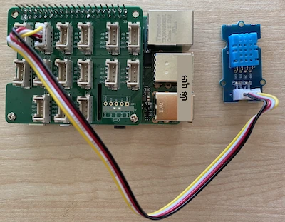

# វាស់សីតុណ្ហភាព - Raspberry Pi

នៅផ្នែកនេះនៃមេរៀន អ្នកនឹងបន្ថែមឧបករណ៍ចាប់សីតុណ្ហភាពទៅកាន់ Raspberry Pi របស់អ្នក។

## ឧបករណ៍រឹង

ឧបករណ៍ចាប់ដែលអ្នកនឹងប្រើគឺ [ឧបករណ៍ចាប់សំណើមនិងសីតុណ្ហភាព DHT11](https://www.seeedstudio.com/Grove-Temperature-Humidity-Sensor-DHT11.html) ដែលបង្កប់ឧបករណ៍ចាប់ពីរសម្រាប់ក្នុងកញ្ចប់មួយ។ វាជាទូទៅពេញនិយម ដោយមានឧបករណ៍ចាប់ជាច្រើនដែលមានលក់ពាណិជ្ជកម្មរួមបញ្ចូលសីតុណ្ហភាព សំណើម និងពេលខ្លះសំពាធបរិយាកាស។ ឧបករណ៍ចាប់សីតុណ្ហភាពគឺជាកម្មន្តិតសីតុណ្ហភាពអវិជ្ជមាន (NTC) thermistor ដែលកម្រិតអង្គុយបន្ថយឲ្យតិចជាមួយនឹងជំឡៅកម្តៅ បង្កើនឡើង។

នេះជាឧបករណ៍ចាប់ឌីជីថល ដូច្នេះវាមាន ADC នៅលើផ្ទៃក្តារដើម្បីបង្កើតសញ្ញាឌីជីថលដែលមានទិន្នន័យសីតុណ្ហភាព និងសំណើមដែលម៉ាយគ្រូខលរម៉ាស់អាចអានបាន។

### ទាក់ទងឧបករណ៍ចាប់សីតុណ្ហភាព

ឧបករណ៍ចាប់សីតុណ្ហភាព Grove អាចត្រូវបានភ្ជាប់ទៅកាន់ Raspberry Pi។

#### ការងារ

ភ្ជាប់ឧបករណ៍ចាប់សីតុណ្ហភាព


1. ដាក់ចុងខ្មែរមួយនៃខ្សែ Grove ចូលទៅក្នុងរន្ទះលើឧបករណ៍ចាប់សំណើម និងសីតុណ្ហភាព។ វានឹងចូលត្រឹមផ្នែកមួយប៉ុណ្ណោះ។

1. ពេល Raspberry Pi បិទភ្លើង សូមភ្ជាប់ចុងខ្សែលេខ Grove ផ្សេងទៀតទៅរន្ទះឌីជីថលដែលមានស្លាក **D5** នៅលើ Grove Base hat ដែលភ្ជាប់ទៅ Pi។ រន្ធនេះគឺជារន្ធទីពីរពីខាងឆ្វេង នៅជួររន្ធនៅជាប់ទៅកាន់ពិន GPIO។



## កម្មវិធីឧបករណ៍ចាប់សីតុណ្ហភាព

ឧបករណ៍ឥឡូវនេះអាចត្រូវបានកម្មវិធីដើម្បីប្រើឧបករណ៍ចាប់សីតុណ្ហភាពដែលភ្ជាប់។

### ការងារ

កម្មវិធីឧបករណ៍។

1. បើក Pi ហើយរង់ចាំអោយវាបញ្ចេញកំណត់ត្រាជាដំណើរការ

1. បើក VS Code, អាចត្រូវបានបើកដោយផ្ទាល់លើ Pi រឺភ្ជាប់តាមប្រោង Remote SSH ។

    > ⚠️ អ្នកអាចយោងទៅ [សេចក្ដីណែនាំសម្រាប់ដំឡើង និងបើក VS Code ក្នុងមេរៀនទី 1 ប្រសិនបើត្រូវការ](../../../1-getting-started/lessons/1-introduction-to-iot/pi.md)។

1. ពីបន្ទាត់បញ្ចូល បង្កើតថតថ្មីមួយនៅក្នុងថតផ្ទះអ្នកប្រើ `pi` មានឈ្មោះ `temperature-sensor`។ បង្កើតឯកសារមួយក្នុងថតនេះឈ្មោះ `app.py`៖

    ```sh
    mkdir temperature-sensor
    cd temperature-sensor
    touch app.py
    ```

1. បើកថតនេះនៅក្នុង VS Code

1. ដើម្បីប្រើឧបករណ៍ចាប់សីតុណ្ហភាព និងសំណើម កម្មវិធី Pip បន្ថែមត្រូវបានដំឡើង។ ពី Terminal នៅក្នុង VS Code អនុវត្តន៍ពាក្យបញ្ជាខាងក្រោមដើម្បីដំឡើងកញ្ចប់ Pip នេះលើ Pi៖

    ```sh
    pip3 install seeed-python-dht
    ```

1. បន្ថែមកូដខាងក្រោមទៅឯកសារ `app.py` ដើម្បីនាំចូលបណ្ណាល័យដែលត្រូវការ៖

    ```python
    import time
    from seeed_dht import DHT
    ```

    សេចក្ដីថ្លែង `from seeed_dht import DHT` នាំចូលថ្នាក់ឧបករណ៍ចាប់ `DHT` ដើម្បីធ្វើប្រតិបត្តិការជាមួយ Grove temperature sensor ពីម៉ូឌុល `seeed_dht` ។

1. បន្ថែមកូដខាងក្រោមបន្ទាប់ពីកូដខាងលើ ដើម្បីបង្កើតអាំងស្តង់ស្យង់នៃថ្នាក់ដែលគ្រប់គ្រងឧបករណ៍ចាប់សីតុណ្ហភាព៖

    ```python
    sensor = DHT("11", 5)
    ```

    នេះធ្វើការកំណត់អាំងស្តង់ស្យង់ពីថ្នាក់ `DHT` ដែលគ្រប់គ្រងឧបករណ៍ **D**igital **H**umidity និង **T**emperature sensor។ ប៉ារ៉ាម៉ែត្រដំបូងប្រាប់កូដឲ្យដឹងថាឧបករណ៍ចាប់ដែលប្រើគឺសិនស័រ *DHT11* - បណ្ណាល័យដែលអ្នកកំពុងប្រើគាំទ្រសិនស័រផ្សេងទៀត។ ប៉ារ៉ាម៉ែត្រថ្ងៃទីពីរប្រាប់កូដថាឧបករណ៍ភ្ជាប់ទៅព័រឌីជីថល `D5` លើ Grove base hat។

    > ✅ ចងចាំថា រន្ធទាំងអស់មានលេខពិនតែមួយរបស់ខ្លួន។ ពិន 0, 2, 4, និង 6 គឺជាពិនអាណាឡូក, ពិន 5, 16, 18, 22, 24 និង 26 គឺជាពិនឌីជីថល។

1. បន្ថែមច្រកវង់ អញ្ញើញក្រោយកូដខាងលើដើម្បីស្ទង់តម្លៃឧបករណ៍ចាប់សីតុណ្ហភាព ហើយបង្ហាញវាលើ console៖

    ```python
    while True:
        _, temp = sensor.read()
        print(f'Temperature {temp}°C')
    ```

    ការហៅទៅ `sensor.read()` ត្រឡប់តម្លៃជាគូ (tuple) នៃសំណើម និងសីតុណ្ហភាព។ អ្នកត្រូវការតែតម្លៃសីតុណ្ហភាពប៉ុណ្ណោះ ដូចនេះសំណើមត្រូវបានរំលង។ តម្លៃសីតុណ្ហភាពត្រូវបានបោះពុម្ពទៅ console ។

1. បន្ថែមការគេងខ្លីពេលដប់វិនាទីនៅចុង `loop` ពីព្រោះមិនចាំបាច់ត្រូវពិនិត្យកម្រិតសីតុណ្ហភាពជារយៈពេលបន្តបន្ទាប់។ ការគេងបន្ថយកម្រិតការប្រើថាមពលនៃឧបករណ៍។

    ```python
    time.sleep(10)
    ```

1. ពី Terminal VS Code អនុវត្តន៍ពាក្យបញ្ជាខាងក្រោមដើម្បីរត់កម្មវិធី Python របស់អ្នក៖

    ```sh
    python3 app.py
    ```

    អ្នកគួរតែឃើញតម្លៃសីតុណ្ហភាពបង្ហាញលើ console។ ប្រើរឿងអ្វីមួយដើម្បីកំដៅឧបករណ៍ចាប់ដូចជាចុចម្រាមដៃលើវា ឬប្រើហ្វេនដើម្បីឃើញតម្លៃផ្លាស់ប្ដូរ៖

    ```output
    pi@raspberrypi:~/temperature-sensor $ python3 app.py 
    Temperature 26°C
    Temperature 26°C
    Temperature 28°C
    Temperature 30°C
    Temperature 32°C
    ```

> 💁 អ្នកអាចស្វែងរកកូដនេះនៅក្នុងថត [code-temperature/pi](../../../../../2-farm/lessons/1-predict-plant-growth/code-temperature/pi)។

😀 កម្មវិធីឧបករណ៍ចាប់សីតុណ្ហភាពរបស់អ្នកបានជោគជ័យ!

---

<!-- CO-OP TRANSLATOR DISCLAIMER START -->
**ការសូមប្រយ័ត្ន**៖  
ឯកសារនេះបានបកប្រែអាជ្ញាប័ណ្ណដោយប្រើសេវាបកប្រែ AI [Co-op Translator](https://github.com/Azure/co-op-translator)។ ខណៈពេលយើងខិតខំរក្សានិរូបភាពនៃការបកប្រែ តែក៏សូមប្រុងប្រយ័ត្នថាការបកប្រែដោយស្វ័យប្រវត្តិក្នុងខ្លឹមសារអាចមានកំហុស ឬការខុសឆ្គង។ ឯកសារដើមនៅភាសាដើមគួរត្រូវបានគេចាត់ទុកជាធនធានដែលមានសុពលភាព។ សម្រាប់ព័ត៌មានសំខាន់ៗ ប្រើការបកប្រែដោយមនុស្សជំនាញត្រូវតែបានផ្តល់អនុសាសន៍។ យើងមិនទទួលខុសត្រូវចំពោះការយល់ច្រឡំ ឬការបកប្រែខុសៗដែលកើតឡើងពីការប្រើប្រាស់បកប្រែនេះឡើយ។
<!-- CO-OP TRANSLATOR DISCLAIMER END -->