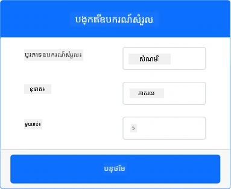
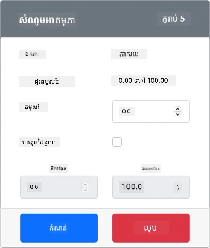
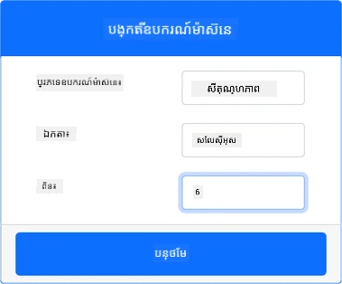
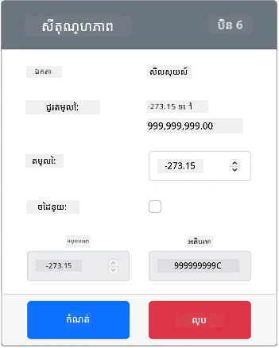

# វាស់សីតុណ្ហភាព - ឧបករណ៍ IoT ពិភពលើកុន

នៅក្នុងផ្នែកនេះនៃមេរៀន អ្នកនឹងបន្ថែមឧបករណ៍វាស់សីតុណ្ហភាពទៅឧបករណ៍ IoT ពិភពលើកុនរបស់អ្នក។

## ឧបករណ៍ពិភពលើកុន

ឧបករណ៍ IoT ពិភពលើកុននឹងប្រើឧបករណ៍ Grove Digital Humidity និង Temperature ដែលបានស្ទង់ភាព។ វា គ្រប់គ្រងមេរៀននេះឲ្យដូចគ្នានឹងការប្រើ Raspberry Pi ជាមួយឧបករណ៍ Grove DHT11 រឹងមាំ។

ឧបករណ៍វាស់ស្ទង់នេះបានបញ្ចូលចំណុច **ឧបករណ៍វាស់សីតុណ្ហភាព** ជាមួយនឹង **ឧបករណ៍វាស់សំណើម**, ប៉ុន្តែនៅក្នុងមេរៀននេះ អ្នកមានចំណាប់អារម្មណ៍តែមួយតែចំណុចឧបករណ៍វាស់សីតុណ្ហភាពប៉ុណ្ណោះ។ នៅក្នុងឧបករណ៍ IoT រឹងមាំ ឧបករណ៍វាស់សីតុណ្ហភាពនឹងជាក [thermistor](https://wikipedia.org/wiki/Thermistor) ដែលវាស់សីតុណ្ហភាពដោយយកសញ្ញាធ្វើអោយផ្លាស់ប្តូរទแรงព្យួរដោយសារសីតុណ្ហភាពផ្លាស់ប្តូរ។ ឧបករណ៍វាស់សីតុណ្ហភាពជាឧបករណ៍ឌីជីថលដែលផ្ទុកនៅខាងក្នុងបំលែងការវាស់លំហូរទៅជា តម្លៃសីតុណ្ហភាពជាដឺក្រេសែលស៊ីយស្យុ (ឬខែលវិន ឬ ផារ៉ាហ្វរាំង)។

### បន្ថែមឧបករណ៍វាស់ស្ទង់ទៅ CounterFit

ដើម្បីប្រើឧបករណ៍វាស់សំណើមនិងសីតុណ្ហភាពពិភពលើកុន អ្នកត្រូវបន្ថែមឧបករណ៍ទាំងពីរទៅកម្មវិធី CounterFit។

#### ភារកិច្ច - បន្ថែមឧបករណ៍វាស់ស្ទង់ទៅ CounterFit

បន្ថែមឧបករណ៍វាស់សំណើម និងសីតុណ្ហភាពទៅកម្មវិធី CounterFit។

1. បង្កើតកម្មវិធី Python ថ្មីលើកុំព្យូទ័ររបស់អ្នកនៅក្នុងថតដែលមានឈ្មោះ `temperature-sensor` ដែលមាន​ឯកសារ​តែមួយឈ្មោះ `app.py` និងបរិស្ថាន Python ហ្វីចបន្ថែម ហើយបន្ថែមកញ្ចប់ pip របស់ CounterFit។

    > ⚠️ អ្នកអាចយោងទៅ [ការ​​ណែនាំសម្រាប់បង្កើតនិងបង្កើតរៀបចំគម្រោង Python CounterFit នៅមេរៀនទី ១ ប្រសិនបើត្រូវការ](../../../1-getting-started/lessons/1-introduction-to-iot/virtual-device.md)។

1. តំឡើងកញ្ចប់ Pip បន្ថែមមួយ ដើម្បីតំឡើង shim របស់ CounterFit សម្រាប់ឧបករណ៍ DHT11 sensor។ ពិនិត្យអោយ certainថាអ្នកកំពុងតំឡើងវាពីបន្ទាត់ពាក្យបញ្ជាជាមួយបរិស្ថាន Python ហ្វីចបានបើក។

    ```sh
    pip install counterfit-shims-seeed-python-dht
    ```

1. ពិនិត្យអោយ certainថាកម្មវិធីគេហទំព័រ CounterFit កំពុងដំណើរការជា

1. បង្កើតឧបករណ៍វាស់សំណើម:

    1. នៅក្នុងប្រអប់ *Create sensor* នៅផ្នែក *Sensors* ចុចបញ្ជីពីលើ *Sensor type* ហើយជ្រើសរើស *Humidity*។

    1. ទុក *Units* នៅតម្លៃ *Percentage*

    1. ធានាថា *Pin* ត្រូវបានកំណត់ទៅ *5*

    1. ជ្រើសប៊ូតុង **Add** ដើម្បីបង្កើតឧបករណ៍វាស់សំណើមលើ Pin 5

    

    ឧបករណ៍វាស់សំណើមនឹងត្រូវបានបង្កើតហើយបង្ហាញនៅក្នុងបញ្ជីឧបករណ៍។

    

1. បង្កើតឧបករណ៍វាស់សីតុណ្ហភាព:

    1. នៅក្នុងប្រអប់ *Create sensor* នៅផ្នែក *Sensors* ចុចបញ្ជីពីលើ *Sensor type* ហើយជ្រើសរើស *Temperature*។

    1. ទុក *Units* នៅតម្លៃ *Celsius*

    1. ធានាថា *Pin* ត្រូវបានកំណត់ទៅ *6*

    1. ជ្រើសប៊ូតុង **Add** ដើម្បីបង្កើតឧបករណ៍វាស់សីតុណ្ហភាពលើ Pin 6

    

    ឧបករណ៍វាស់សីតុណ្ហភាពនឹងត្រូវបានបង្កើតហើយបង្ហាញនៅក្នុងបញ្ជីឧបករណ៍។

    

## កម្មវិធីឧបករណ៍វាស់សីតុណ្ហភាព

កម្មវិធីឧបករណ៍វាស់សីតុណ្ហភាពអាចត្រូវបានកំណត់កម្មវិធីដោយប្រើឧបករណ៍ស៊េរី CounterFit។

### ភារកិច្ច - កំណត់កម្មវិធីឧបករណ៍វាស់សីតុណ្ហភាព

កំណត់កម្មវិធីឧបករណ៍វាស់សីតុណ្ហភាព។

1. ពិនិត្យអោយ certain ថាកម្មវិធី `temperature-sensor` បានបើកនៅក្នុង VS Code

1. បើកឯកសារ `app.py`

1. បន្ថែមកូដខាងក្រោមនៅលើសៀវភៅ `app.py` ដើម្បីភ្ជាប់កម្មវិធីទៅ CounterFit:

    ```python
    from counterfit_connection import CounterFitConnection
    CounterFitConnection.init('127.0.0.1', 5000)
    ```

1. បន្ថែមកូដខាងក្រោមទៅឯកសារ `app.py` ដើម្បីនាំចូលបណ្ណាល័យដែលត្រូវការ៖

    ```python
    import time
    from counterfit_shims_seeed_python_dht import DHT
    ```

    ពាក្យថា `from seeed_dht import DHT` នាំចូលថ្នាក់ឧបករណ៍ `DHT` ដើម្បីធ្វើប្រតិបត្តិការជាមួយឧបករណ៍ Grove temperature sensor ពិភពលើកុន ដោយប្រើ shim ពីម៉ូឌុល `counterfit_shims_seeed_python_dht`។

1. បន្ថែមកូដខាងក្រោមក្រោយកូដខាងលើដើម្បីបង្កើតឧបករណ៍នៅថ្នាក់ដែលគ្រប់គ្រងឧបករណ៍វាស់សំណើម និងសីតុណ្ហភាពពិភពលើកុន៖

    ```python
    sensor = DHT("11", 5)
    ```

    នេះទទួលស្គាល់ឧបករណ៍មួយនៃថ្នាក់ `DHT` ដែលគ្រប់គ្រងឧបករណ៍វាស់សំណើមនិងសីតុណ្ហភាពឌីជីថលសរុប។ ប៉ារ៉ាម៉ែត្រ​ទីមួយប្រាប់កូដថាឧបករណ៍ដែលប្រើគឺជាឧបករណ៍វាស់សីតុណ្ហភាពពិភពលើកុនប្រភេទ *DHT11*។ ប៉ារ៉ាម៉ែត្រ​ទីពីរប្រាប់កូដថាឧបករណ៍ត្រូវបានភ្ជាប់ទៅកំពស់ `5`។

    > 💁 CounterFit បានស្ទង់ភាពឧបករណ៍វាស់សំណើមនិងសីតុណ្ហភាពរួមមួយនេះដោយភ្ជាប់ទៅឧបករណ៍ពីរ គឺឧបករណ៍វាស់សំណើមនៅ pin ដែលបានបញ្ជាក់នៅពេលបង្កើតថ្នាក់ `DHT` ហើយឧបករណ៍វាស់សីតុណ្ហភាពរត់លើ pin បន្ទាប់។ ប្រសិនបើឧបករណ៍វាស់សំណើមនៅលើ pin 5, shim នឹងរំពឹងថា​ឧបករណ៍វាស់សីតុណ្ហភាពនឹងនៅលើ pin 6។

1. បន្ថែមវដ្ដអនշិរ្ស័យក្រោយកូដខាងលើ ដើម្បីធ្វើការស្ទង់តម្លៃសីតុណ្ហភាព ហើយបោះពុម្ពវាទៅកុងសូល៖

    ```python
    while True:
        _, temp = sensor.read()
        print(f'Temperature {temp}°C')
    ```

    ការហៅ​កម្មវិធី `sensor.read()` បង្វិលតម្លៃជាគូដែល​មានសំណើម និងសីតុណ្ហភាព។ អ្នកត្រូវការត្រឹមតម្លៃសីតុណ្ហភាពប៉ុណ្ណោះ ដូច្នេះមិនចាំបាច់យកតម្លៃសំណើមទេ។ តម្លៃសីតុណ្ហភាពបន្ទាប់មកត្រូវបានបោះពុម្ពទៅបញ្ញាភាព។

1. បន្ថែមការដេកតិចៗរយៈពេលដប់វិនាទីនៅចុងវដ្ដ `loop` ព្រោះកម្រិតសីតុណ្ហភាពមិនចាំបាច់បានពិនិត្យតាមលំនាំជាប់នៅរៀងរាល់ពេលទេ។ ការដេកនឹងកាត់បន្ថយការប្រើថាមពលរបស់ឧបករណ៍។

    ```python
    time.sleep(10)
    ```

1. ពី VS Code Terminal ជាមួយបរិស្ថាន Python ហ្វីចបានបើក ដំណើរការ​កូដដូចតទៅដើម្បីរត់កម្មវិធី Python របស់អ្នក៖

    ```sh
    python app.py
    ```

1. ពីកម្មវិធី CounterFit ផ្លាស់ប្ដូរតម្លៃសីតុណ្ហភាពដែលកម្មវិធីនឹងអាន។ អ្នកអាចធ្វើបានពីរបៀប៖

    * បញ្ចូលលេខក្នុងប្រអប់ *Value* សម្រាប់ឧបករណ៍វាស់សីតុណ្ហភាព បន្ទាប់មកជ្រើសប៊ូតុង **Set**។ លេខដែលអ្នកបញ្ចូលនឹងជាតម្លៃដែលឧបករណ៍នឹងបញ្ចូនមកវិញ។

    * បញ្ចូលត្រួតពិនិត្យ *Random* ហើយបញ្ចូលតម្លៃ *Min* និង *Max* បន្ទាប់មកជ្រើសប៊ូតុង **Set**។ រាល់ពេលឧបករណ៍ស្ទង់តម្លៃ វានឹងអានលេខចៃដន្យរវាង *Min* និង *Max*។

    អ្នកគួរមើលឃើញតម្លៃដែលបានកំណត់បង្ហាញនៅក្នុងកុងសូល។ ផ្លាស់ប្ដូរតម្លៃ *Value* ឬ ការកំណត់ *Random* ដើម្បីមើលការផ្លាស់ប្ដូរតម្លៃ។

    ```output
    (.venv) ➜  temperature-sensor python app.py
    Temperature 28.25°C
    Temperature 30.71°C
    Temperature 25.17°C
    ```

> 💁 អ្នកអាចស្វែងរកកូដនេះនៅក្នុងថត [code-temperature/virtual-device](../../../../../2-farm/lessons/1-predict-plant-growth/code-temperature/virtual-device)។

😀 កម្មវិធីឧបករណ៍វាស់សីតុណ្ហភាពរបស់អ្នកបានជោគជ័យ!

---

<!-- CO-OP TRANSLATOR DISCLAIMER START -->
**ការបដិសេធ**៖  
ឯកសារនេះត្រូវបានបកប្រែដោយប្រើសេវាបកប្រែ AI [Co-op Translator](https://github.com/Azure/co-op-translator)។ ខណៈពេលយើងខិតខំសម្រេចភាពត្រឹមត្រូវ សូមយល់ដឹងថាការបកប្រែដោយស្វ័យប្រវត្តិអាចមានកំហុស ឬភាពមិនត្រឹមត្រូវ។ ឯកសារដើមជាភាសាតំណាងគួរត្រូវបានគិតជាផែនទីអនុញ្ញាតផ្លូវការ។ សម្រាប់ព័ត៌មានសំខាន់ៗ យើងសូមផ្តល់អនុសាសន៍ឱ្យប្រើការបកប្រែដោយមនុស្សជំនាញ។ យើងមិនទទួលខុសត្រូវចំពោះការយល់ច្រឡំ ឬការបកប្រែខុសៗណាមួយដែលកើតឡើងពីការប្រើប្រាស់ការបកប្រែនេះឡើយ។
<!-- CO-OP TRANSLATOR DISCLAIMER END -->