# ស្វែងរកសំណើមដី

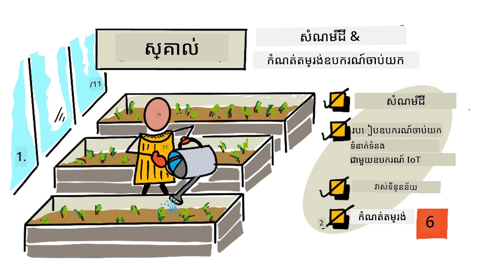

> ស្គេតស្គេតដោយ [Nitya Narasimhan](https://github.com/nitya)។ ចុចលើរូបភាពសម្រាប់ទំហំធំ។

មេរៀននេះត្រូវបានបង្រៀនជាផ្នែកមួយនៃ [គម្រោង IoT សម្រាប់អ្នកចាប់ផ្តើម ផ្នែក 2 - ស៊េរីកសិក្សាអំពីកសិកម្មឌីជីថល](https://youtube.com/playlist?list=PLmsFUfdnGr3yCutmcVg6eAUEfsGiFXgcx) ពី [Microsoft Reactor](https://developer.microsoft.com/reactor/?WT.mc_id=academic-17441-jabenn)។

## ប្រលងមុខមេរៀន

[ប្រលងមុខមេរៀន](https://black-meadow-040d15503.1.azurestaticapps.net/quiz/11)

## ការណែនាំ

នៅមេរៀនមុន យើងបានមើលការវាស់បរិស្ថានមួយ និងប្រើវាសម្រាប់ទស្សន៍ទាយការលូតលាស់របស់រុក្ខជាតិ។ សីតុណ្ហភាពអាចត្រូវបានគ្រប់គ្រងបាន ប៉ុន្តែវាត្រូវការចំណាយថ្លៃច្រើន ដើម្បីត្រួតពិនិត្យបរិយាកាស។ បរិស្ថានដែលងាយស្រួលគ្រប់គ្រងសម្រាប់រុក្ខជាតិជាចម្បងគឺទឹក - វាជារឿងដែលត្រូវបានគ្រប់គ្រងរៀងរាល់ថ្ងៃ ចាប់ពីប្រព័ន្ធទឹកជ្រោះធំប៉ុន្មានទៅដល់ក្មេងតូចជាមួយកំបោក្រឡាចំរុងទឹកក្នុងសួនរបស់ពួកគេ។

ក្នុងមេរៀននេះ អ្នកនឹងរៀនអំពីវិធីវាស់សំណើមដី ហើយនៅមេរៀនបន្ទាប់ អ្នកនឹងរៀនពីរបៀបគ្រប់គ្រងប្រព័ន្ធចាក់ទឹកដោយស្វ័យប្រវត្តិ។ មេរៀននេះណែនាំអំពីឧបករណ៍អ្នកវាស់ទីបី ដែលអ្នកបានប្រើសង្វាក់ពន្លឺ មួយឧបករណ៍វាស់សីតុណ្ហភាព ហើយក្នុងមេរៀននេះ អ្នកនឹងរៀនបន្ថែមពីរបៀបឧបករណ៍អ្នកវាស់ និងឧបករណ៍ធ្វើចលនា ទំនាក់ទំនងជាមួយឧបករណ៍ IoT ដើម្បីយល់ដឹងពីរបៀបឧបករណ៍អ្នកវាស់សំណើមដីផ្ញើទិន្នន័យទៅឧបករណ៍ IoT។

ក្នុងមេរៀននេះ យើងនឹងគ្របដណ្តប់៖

* [សំណើមដី](#សំណើមដី)
* [របៀបឧបករណ៍អ្នកវាស់ទំនាក់ទំនងជាមួយឧបករណ៍ IoT](#របៀបឧបករណ៍អ្នកវាស់ទំនាក់ទំនងជាមួយឧបករណ៍-iot)
* [វាស់កម្រិតសំណើមនៅក្នុងដី](#វាស់កម្រិតសើមក្នុងដី)
* [កំណត់តុល្យឧបករណ៍អ្នកវាស់](#ការការពារខ្សែវាស់សូង់)

## សំណើមដី

រុក្ខជាតិត្រូវការទឹកសម្រាប់រីកចម្រើន។ ពួកវាស្រូបទឹកតាមរយៈផ្នែកជ្រុះរបស់វា ជាច្រើនស្រូបតាមប្រព័ន្ធធ្លាក់ដើម។ ទឹកត្រូវបានប្រើសម្រាប់រុក្ខជាតិបីរឿង៖

* [បំពុលបញ្ចេញបាតូឡិក (Photosynthesis)](https://wikipedia.org/wiki/Photosynthesis) - រុក្ខជាតិបង្កើតប្រតិកម្មគីមីជាមួយទឹក កាបូនឌីអុកស៊ីត និងពន្លឺ ដើម្បីបង្កើតកាបូអ៊ីដ្រាត និងអុកស៊ីសែន។
* [ការច្រាស់ (Transpiration)](https://wikipedia.org/wiki/Transpiration) - រុក្ខជាតិប្រើទឹកដើម្បីឱ្យកាបូនឌីអុកស៊ីតចេញពីខ្យល់ទៅក្នុងរុក្ខជាតិតាមរយៈរន្ធនៅលើស្លឹក។ ដំណើរការនេះក៏ផ្ទុកជាតិចិញ្ចឹមនៅជុំវិញរុក្ខជាតិ និងបន្ថយកំដៅរុក្ខជាតិ ដូចជាការសើមរបស់មនុស្ស។
* រចនាសម្ព័ន្ធ - រុក្ខជាតិត្រូវការទឹកដើម្បីថែរក្សារចនាសម្ព័ន្ធរបស់ពួកវា - ពោលគឺពួកវាមានទឹក 90% (ផ្ទុយពីមនុស្សគឺត្រឹមតែ 60%) ហើយទឹកនេះធ្វើឱ្យកោសិកាខ្លាញ់ ត្រេកត្រអាល។ ប្រសិនបើរុក្ខជាតិមិនមានទឹកគ្រប់គ្រាន់ វានឹងស្លុតនិងស្លាប់ក្នុងចុងក្រោយ។

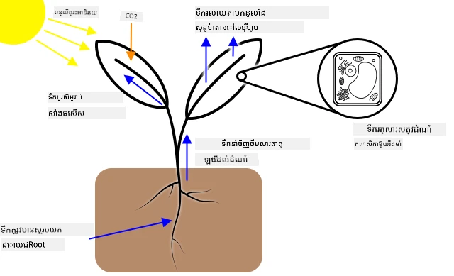

✅ ស្វែងរកព័ត៌មាន៖ តើទឹកបាត់បង់ប៉ុន្មានតាមរយៈដំណើរការច្រាស់?

ប្រព័ន្ធដើមរុក្ខជាតិផ្ដល់ទឹកពីសំណើមនៅក្នុងដី ដែលជាទីកន្លែងរុក្ខជាតិដុះឡើង។ ប្រសិនបើសំណើមក្នុងដីតិចពេក រុក្ខជាតិមិនអាចស្រូបបានគ្រប់គ្រាន់សម្រាប់រីកចម្រើន។ ប្រសិនបើសំណើមក្នុងដីច្រើនពេក ដើមរុក្ខជាតិមិនអាចស្រូបអុកស៊ីសែនគ្រប់គ្រាន់សម្រាប់ដំណើរការ។ វានាំឱ្យដើមរុក្ខជាតិស្លាប់ ហើយរុក្ខជាតិមិនអាចទទួលបានជាតិចិញ្ចឹមគ្រប់គ្រាន់សម្រាប់រស់នៅ។

សម្រាប់កសិករដើម្បីទទួលបានការលូតលាស់រុក្ខជាតិបានល្អបំផុត ដីត្រូវតែមានសំណើមមិនខុសគ្នាប៉ុន្មានពេកនិងមិនស្ងួតពេក។ ឧបករណ៍ IoT អាចជួយក្នុងការវាស់សំណើមដី អនុញ្ញាតឱ្យកសិករចាក់ទឹកតែពេលដែលត្រូវការ។

### វិធីសាស្រ្តវាស់សំណើមដី

មានប្រភេទឧបករណ៍អ្នកវាស់ជាច្រើនដែលអ្នកអាចប្រើសម្រាប់វាស់សំណើមដី៖

* ប្រភេទរេស៊ីស្ទីវ (Resistive) - ឧបករណ៍អ្នកវាស់ប្រភេទនេះមានប្រដាប់វាស់ពីរដែលដាក់ចូលក្នុងដី។ ចរន្តអគ្គិសនីត្រូវបានផ្ញើទៅប្រដាប់វាស់មួយ ហើយទទួលពីប្រដាប់វាស់មួយទៀត។ ឧបករណ៍វាស់វាស់ភាពរេស៊ីស្តង់នៃដីតាមកម្រិតដែលចរន្តធ្លាក់នៅប្រដាប់វាស់ទីពីរ។ ទឹកជាអ្នកដឹកចរន្តអគ្គិសនីល្អ ដូច្នេះបើមានទឹកច្រើនក្នុងដី ការរួចរាស់នឹងតិច។

    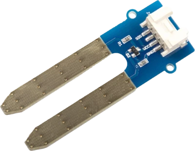

    > 💁 អ្នកអាចបង្កើតឧបករណ៍អ្នកវាស់សំណើមដីប្រភេទរេស៊ីស្ទីវដោយប្រើដែកពីរដុំដូចជា ម្គុលដែក ពីរដុំនឹងបំបែកឲ្យឆ្ងាយពីគ្នាជាពីរប៉ារម៉ែត្រ ហើយវាស់ភាពរេស៊ីស្តង់រវាងពួកវាប្រើម៉ុលទីមែត្រ។

* ប្រភេទកាប៉ាស៊ីតីវ (Capacitive) - ឧបករណ៍អ្នកវាស់សំណើមកាប៉ាស៊ីតីវវាស់ចំនួនបន្ទុកអគ្គិសនីដែលអាចផ្ទុកបានរវាងផ្ទៃអគ្គិសនីវិជ្ជមាន និងអវិជ្ជមាន ឬ [កាប៉ាស៊ីតង់](https://wikipedia.org/wiki/Capacitance)។ កាប៉ាស៊ីតង់ដីផ្លាស់ប្តូរពេលចំនួនសំណើមផ្លាស់ប្តូរ ហើយអាចបកប្រែក្នុងជាម៉ាស៊ីនចល័តលំដាប់វ៉ុលដែលអាចវាស់បានដោយឧបករណ៍ IoT។ ដីបើសើមក្រអូប កម្រិតវ៉ុលនឹងតិចជាង។

    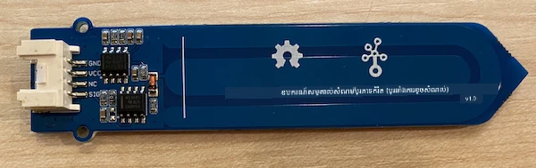

ទាំងពីរប្រភេទនេះជាឧបករណ៍អ្នកវាស់អាណាឡូគដែលត្រឡប់មកវិញជាវ៉ុលសម្រាប់បង្ហាញសំណើមដី។ តើវ៉ុលនេះត្រូវទៅរកកូដរបស់អ្នកយ៉ាងដូចម្តេច? មុនពេលទៅបន្តជាមួយឧបករណ៍អ្នកវាស់ទាំងនេះ យើងមកមើលរបៀបឧបករណ៍អ្នកវាស់និងឧបករណ៍ធ្វើចលនា ទំនាក់ទំនងជាមួយឧបករណ៍ IoT។

## របៀបឧបករណ៍អ្នកវាស់ទំនាក់ទំនងជាមួយឧបករណ៍ IoT

មកដល់ពេលនេះ ក្នុងមេរៀនទាំងនេះ អ្នកបានរៀនពីឧបករណ៍អ្នកវាស់ និងឧបករណ៍ធ្វើចលនា ជាច្រើន ហើយឧបករណ៍ទាំងនេះបានធ្វើការទំនាក់ទំនងជាមួយឧបករណ៍ IoT របស់អ្នក ប្រសិនបើអ្នកបានធ្វើបរិញ្ញាបត្រឧបករណ៍រឹង។ តែការទំនាក់ទំនងនេះធ្វើការយ៉ាងដូចម្តេច? តើការវាស់ភាពរេស៊ីស្តង់ពីឧបករណ៍អ្នកវាស់សំណើមដីក្លាយជាលេខដែលអ្នកអាចប្រើបានពីកូដដោយរបៀបណា?

ដើម្បីទំនាក់ទំនងជាមួយឧបករណ៍អ្នកវាស់ និងឧបករណ៍ធ្វើចលនា ភាគច្រើនអ្នកត្រូវការឧបករណ៍រឹងមួយ និងប្រព័ន្ធបញ្ជូនទិន្នន័យមួយ - ដែលជាវិធីដែលបានកំណត់លម្អិតសម្រាប់ផ្ញើ និងទទួលទិន្នន័យ។ ឧទាហរណ៍ សម្រាប់ឧបករណ៍អ្នកវាស់សំណើមដីកាប៉ាស៊ីតីវមួយ៖

* តើឧបករណ៍នេះភ្ជាប់ជាមួយឧបករណ៍ IoT ដោយរបៀបណា?
* ប្រសិនបើវាវាស់វ៉ុលដែលជាសញ្ញាអាណាឡូគ វាត្រូវការអេដិស៊ី (ADC) ដើម្បីបម្លែងជារូបតំណាងខ្ទង់ឌីជីថល។ តម្លៃនេះត្រូវបានផ្ញើជាវ៉ុលបត់បែន ដើម្បីផ្ញើលេខ 0 និង 1 - តែកម្រិតពេលវេលានៃប៊ីតមួយត្រូវបានផ្ញើរយៈពេលប៉ុន្មាន?
* ប្រសិនបើឧបករណ៍អ្នកវាស់គូរតម្លៃឌីជីថល វានឹងជាស្វូរ 0 និង 1 ម្តងទៀត តែកម្រិតពេលវេលានៃប៊ីតមួយត្រូវបានផ្ញើរយៈពេលប៉ុន្មាន?
* ប្រសិនបើវ៉ុលខ្ពស់រយៈពេល 0.1 វិនាទី តើវាជាប៊ីត ១ ព្រោះសម្រាប់១ វា ផ្ទេរប៊ីតដដែលជាប់គ្នា ២ តើ ១០?
* តើលេខចាប់ផ្តើមពេលណា? តើ `00001101` មានតម្លៃ 25 មែនទេ ឬ ៥ ប៊ីតដំបូងជាចុងបញ្ចប់នៃតម្លៃមុន?

ឧបករណ៍រឹងផ្ដល់ការតភ្ជាប់រាងកាយដែលទិន្នន័យត្រូវបានផ្ញើបញ្ជូន។ ប្រព័ន្ធទំនាក់ទំនងខុសៗគ្នាធ្វើឲ្យទិន្នន័យត្រូវបានផ្ញើ ឬទទួលក្នុងរបៀបត្រឹមត្រូវ ដើម្បីអាចបកស្រាយបានខុសពីមុន។

### ផ្នែកបញ្ចូល និងបញ្ចេញទូទៅ (GPIO) pins

GPIO ជាសំណុំប៊ិចដែលអ្នកអាចប្រើភ្ជាប់ឧបករណ៍រឹងទៅឧបករណ៍ IoT របស់អ្នក ហើយភាគច្រើនមាននៅលើឧបករណ៍រីស្ពប៊ែរ បាយ ឬ Wio Terminal។ អ្នកអាចប្រើប្រព័ន្ធទំនាក់ទំនងផ្សេងគ្នានៅក្នុងផ្នែក GPIO។ ប៊ិច GPIO មួយចំនួនផ្ដល់វ៉ុល ពីរបៀប 3.3V ឬ 5V មានខ្សែដី និងខ្សែដែលអាចកំណត់បានថាតើផ្ញើវ៉ុល (output) ឬទទួលវ៉ុល (input)។

> 💁 ប្រព័ន្ធអគ្គិសនីត្រូវតែភ្ជាប់វ៉ុលទៅខ្សែដីតាមរយៈសៀគ្វីណាមួយ។ អ្នកអាចគិតវ៉ុលជា ប្រភេទវិជ្ជមាន (+ve) របស់ថ្ម និងខ្សែដី ជាប្រភេទអវិជ្ជមាន (-ve)។

អ្នកអាចប្រើប៊ិច GPIO ដោយផ្ទាល់ជាមួយឧបករណ៍ឌីជីថល និងឧបករណ៍ធ្វើចលនា នៅពេលដែលអ្នកព្យាយាមប្រើតែតម្លៃ បើ/ចាក់ចេញ (on/off) ដែលនៅស្ថានភាពខ្ពស់ (high) ឬទាប (low)។ ឧទាហរណ៍៖

* ប៊ូតុង។ អ្នកអាចភ្ជាប់ប៊ូតុងរវាងប៊ិច 5V និងប៊ិចលើ GPIO ដែលបានកំណត់ជារបារ ។ នៅពេលចុចប៊ូតុង វាបញ្ចប់សៀគ្វីពី 5V តាមប៊ូតុងទៅប៊ិចលើ GPIO។ ពីកូដ អ្នកអាចអានវ៉ុលនៅស្ថានភាពបញ្ចូល (input) ហើយប្រសិនបើវ៉ុលខ្ពស់ (5V) ប៊ូតុងត្រូវបានចុច ប្រសិនបើវ៉ុលទាប (0V) ប៊ូតុងមិនត្រូវបានចុច។ ចងចាំថា វ៉ុលភ្លែកខ្លួនមិនត្រូវបានអានគ្រប់គ្រាន់ទេ៕ វាត្រូវបានបម្លែងជាសញ្ញាឌីជីថល 1 ឬ 0 ដោយផ្អែកលើកម្រិតវ៉ុល។

    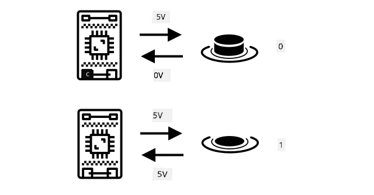

* LED។ អ្នកអាចភ្ជាប់ LED រវាងប៊ិច output និងប៊ិច ground (តម្រូវឲ្យមានរេសូស្ត័រសម្រាប់ការពារភ្លើង LED)។ ពីកូដ អ្នកអាចកំណត់ប៊ិច output ជា high ដើម្បីផ្ញើ 3.3V បង្កើតសៀគ្វីពី 3.3V តាម LED ទៅដល់ប៊ិច ground។ នេះនឹងបំភ្លឺ LED។

    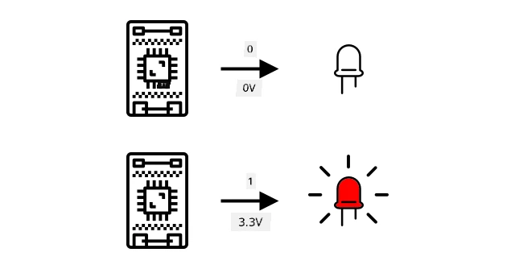

សម្រាប់ឧបករណ៍អ្នកវាស់កម្រិតខ្ពស់ អ្នកអាចប្រើប៊ិច GPIO ដើម្បីផ្ញើ និងទទួលទិន្នន័យឌីជីថលដោយផ្ទាល់ជាមួយឧបករណ៍អ្នកវាស់ និងឧបករណ៍ធ្វើចលនា ឬតាមរយៈក្រុមភ្ជាប់ដែលមាន ADCs និង DACs ដើម្បីទំនាក់ទំនងជាមួយឧបករណ៍អ្នកវាស់ និងធ្វើចលនាអាណាឡូគ។

> 💁 ប្រសិនបើអ្នកប្រើរីស្ពប៊ែរ បាយ សម្រាប់មេរៀនទាំងនេះ Grove Base Hat មានឧបករណ៍រឹងសម្រាប់បម្លែងសញ្ញាអាណាឡូគទៅឌីជីថលសម្រាប់ផ្ញើតាម GPIO។

✅ ប្រសិនបើអ្នកមានឧបករណ៍ IoT ដែលមានប៊ិច GPIO សូមស្វែងរកប៊ិចទាំងនេះ និងស្វែងរកដ្យាក្រាមដែលបង្ហាញថាប៊ិចណាមួយជាវ៉ុល ខ្សែដី គឺកំណត់កម្មវិធីបង្កើតវ៉ុល ឬទទួលវ៉ុល។

### ប៊ិចអាណាឡូគ (Analog pins)

ឧបករណ៍ខ្លះ ដូចជា ឧបករណ៍ Arduino ផ្ដល់ប៊ិចអាណាឡូគ។ ប៊ិចទាំងនេះដូចគ្នានឹងប៊ិច GPIO ប៉ុន្តែជាមួយ ADC ក្នុងការបម្លែងកម្រិតវ៉ុលទៅជាតម្លៃលេខ។ ជាទូទៅ ADC មានការផ្តល់ច្បាស់គឺ ១០-ប៊ីត ដែលមានន័យថាវាបម្លែងវ៉ុលទៅតម្លៃចាប់ពី 0 ដល់ 1,023។

ឧទាហរណ៍ នៅលើក្តារប្រភេទ 3.3V ប្រសិនបើឧបករណ៍អ្នកវាស់ត្រឡប់មក 3.3V តម្លៃត្រឡប់នឹងជា 1,023។ ប្រសិនបើវ៉ុលត្រឡប់មកជា 1.65V តម្លៃត្រឡប់នឹងជា 511។

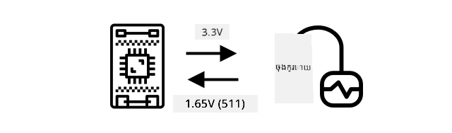

> 💁 នៅក្នុងមេរៀនភ្លើងយប់ - មេរៀន 3 ឧបករណ៍អ្នកវាស់ពន្លឺត្រឡប់តម្លៃពី 0 ដល់ 1,023។ ប្រសិនបើអ្នកប្រើ Wio Terminal ឧបករណ៍អ្នកវាស់ភ្ជាប់ជាមួយប៊ិចអាណាឡូគ។ ប្រសិនបើប្រើរីស្ពប៊ែរ បាយ ឧបករណ៍អ្នកវាស់ភ្ជាប់ជាមួយប៊ិចអាណាឡូគលើ Base Hat ដែលមាន ADC សម្រាប់ទំនាក់ទំនងតាម GPIO។ ឧបករណ៍វីរុចវាល់ត្រូវបានកំណត់ឲ្យផ្ញើតម្លៃពី 0 ដល់ 1,023 ដើម្បីកំណត់ប៊ិចអាណាឡូគ។

ឧបករណ៍អ្នកវាស់សំណើមដីពឹងផ្អែកលើវ៉ុល ដូច្នេះវានឹងប្រើប៊ិចអាណាឡូគ និងផ្តល់តម្លៃពី 0 ដល់ 1,023។

### សៀគ្វីប្រភេទ Inter Integrated Circuit (I2C)

I2C អានជា *I-ស្វាគុណ-C* គឺជាប្រព័ន្ធច្រើនឧបករណ៍គ្រប់គ្រង និងឧបករណ៍រងមួយ ដែលឧបករណ៍ណាមួយដែលភ្ជាប់អាចដំណើរការជាគ្រប់គ្រង ឬឧបករណ៍រង នៅលើ I2C bus (ឈ្មោះសម្រាប់ប្រព័ន្ធទំនាក់ទំនងផ្ញើទិន្នន័យ)។ ទិន្នន័យត្រូវបានផ្ញើជាកញ្ចប់ដែលមានអាសយដ្ឋានជាក់លាក់ ដែលក្នុងនោះផ្ទុកអាសយដ្ឋានឧបករណ៍ដែលត្រូវទាក់ទង។

> 💁 គំរូនេះពីមុនគេហៅថា master/slave ប៉ុន្តែពាក្យនេះត្រូវបានផុតគំនិតដោយសារតែពាក់ព័ន្ធនឹងសេតវិជ្ជាគ្រប់បច្ចេកវិទ្យា។ [Open Source Hardware Association បានទទួលយក controller/peripheral](https://www.oshwa.org/a-resolution-to-redefine-spi-signal-names/), ប៉ុន្តែអ្នកនៅតែអាចឃើញអ្នកយោងពាក្យចាស់នៅទីកន្លែងខ្លះ។

ឧបករណ៍មានអាសយដ្ឋានដែលប្រើនៅពេលភ្ជាប់ទៅ I2C bus ព្រមទាំងភាគច្រើនជាប់ទុកជាមួយឧបករណ៍។ ឧទាហរណ៍ ប្រភេទឧបករណ៍ Grove របស់ Seeed មានអាសយដ្ឋានដូចគ្នា ដូច្នេះឧបករណ៍អ្នកវាស់ពន្លឺទាំងអស់មានអាសយដ្ឋានដូចគ្នា ឧបករណ៍ប៊ូតុងទាំងអស់មានអាសយដ្ឋានមួយផ្សេង​ពីពន្លឺ។ ឧបករណ៍ខ្លះមានវិធីប្តូរអាសយដ្ឋាន ដោយផ្លាស់ប្ដូរម៉ូតតំឡើងឬដាក់ទឹកដៃជាមួយប៊ីប៊ីស្ក័រទាំងពីរ។

I2C bus មានខ្សែ 2 ប្រភេទសំខាន់ ជាមួយខ្សែថាមពល 2 ប្រភេទ៖

| ខ្សែ | ឈ្មោះ | ពិពណ៌នា |
| ---- | --------- | ----------- |
| SDA | ដាតាប្រភេទបន្ត (Serial Data) | ខ្សែនេះសម្រាប់ផ្ញើទិន្នន័យរវាងឧបករណ៍។ |
| SCL | ដិតក្លុកតែម្ដង (Serial Clock) | ខ្សែនេះផ្ញើសញ្ញាក្លុកល្បឿនដែលកំណត់ដោយគ្រប់គ្រង។ |
| VCC | ធន់ថាមពលវ៉ុល | ប្រភពថាមពលសម្រាប់ឧបករណ៍។ ខ្សែនេះភ្ជាប់ទៅ SDA និង SCL តាមរយៈរេសូស្ត័រខ្ពស់ (pull-up resistor) ដែលបះបោរសញ្ញាក្នុងពេលគ្មានឧបករណ៍ជា controller។ |
| GND | ខ្សែដី | ផ្ដល់ខ្សែដីរួមសម្រាប់សៀគ្វីអគ្គិសនី។ |

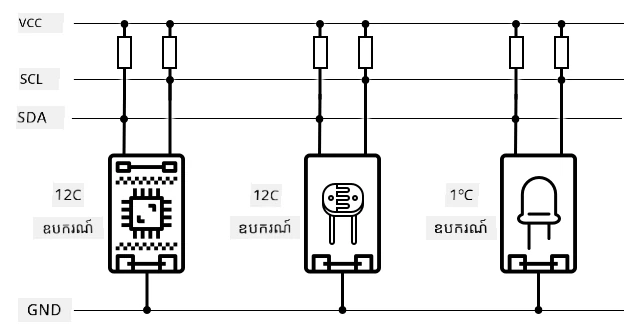

ដើម្បីផ្ញើទិន្នន័យ ឧបករណ៍មួយនឹងចាប់ផ្តើមសញ្ញាចាប់ផ្តើមបង្ហាញនូវភាពរួចរាល់នៃការផ្ញើទិន្នន័យ។ វានឹងក្លាយជាគ្រប់គ្រង។ គ្រប់គ្រងផ្ញើអាសយដ្ឋានឧបករណ៍ដែលចង់ទាក់ទង ជាមួយនឹងបញ្ចប់ថាតើចង់អាន ឬចង់សរសេរទិន្នន័យ។ បន្ទាប់ពីផ្ញើទិន្នន័យរួច គ្រប់គ្រងផ្ញើសញ្ញាបញ្ឈប់ ដើម្បីបង្ហាញព្រមានថាបានបញ្ចប់ហើយ។ បន្ទាប់ពីនេះ ឧបករណ៍ផ្សេងអាចក្លាយជាគ្រប់គ្រង ហើយផ្ញើឬទទួលទិន្នន័យបាន។
I2C មានល្បឿនកំណត់ ជាមួយរបៀបបម្រើ 3 ជាន់ ល្បឿនថេរ។ របៀបដែលល្បឿនលឿនបំផុតគឺ របៀបល្បឿនខ្ពស់ (High Speed mode) មានល្បឿនអតិបរមា 3.4Mbps (megabits per second) ប៉ុន្តែឧបករណ៍មានកំណត់ខ្លះប៉ុណ្ណោះដែលគាំទ្រល្បឿននោះ។ ដូចជា Raspberry Pi មានកំណត់នៅរបៀបល្បឿនលឿន (fast mode) ដែលមានល្បឿន 400Kbps (kilobits per second)។ របៀបស្តង់ដាររត់ល្បឿន 100Kbps។

> 💁 ប្រសិនបើអ្នកកំពុងប្រើ Raspberry Pi ជាមួយ Grove Base hat ក្នុងឧបករណ៍ IoT របស់អ្នក អ្នកនឹងអាចមើលឃើញចំនួនជ័រ I2C នៅលើផ្ទាំងដែលអ្នកអាចប្រើសម្រាប់ទំនាក់ទំនងជាមួយខ្សែសក់ I2C។ ខ្សែសក់ Grove វិទ្យុវីសាស៊ីងក៏ប្រើ I2C ជាមួយ ADC ដើម្បីផ្ញើតម្លៃវិទ្យុជា ទិន្នន័យឌីជីថល ដូច្នេះ ខ្សែសក់ពន្លឺដែលអ្នកប្រើ គឺបានសម្រួលបែប pin អាណាឡុក មួយ ដោយតម្លៃផ្ញើតាម I2C ព្រោះ Raspberry Pi គាំទ្រពី pin ឌីជីថលតែប៉ុណ្ណោះ។

### អ្នកទទួល-ផ្ញើទិន្នន័យមិនភាពសម្ងប់សមរ (UART)

UART ទាក់ទងនឹងចរន្តផ្លូវភេទដែលអនុញ្ញាតឲ្យឧបករណ៍ពីរចែករំលែកទិន្នន័យ។ ក្នុងរាល់ឧបករណ៍ មាន pin ទំនាក់ទំនង 2 ចំនួន - ផ្ញើ (Tx) និង ទទួល (Rx) ដែល pin Tx នៃឧបករណ៍ទីមួយភ្ជាប់ទៅ pin Rx នៃឧបករណ៍ទីពីរ ហើយ pin Tx នៃឧបករណ៍ទីពីរក៏ភ្ជាប់ទៅ pin Rx នៃឧបករណ៍ទីមួយ។ វាអនុញ្ញាតឲ្យទិន្នន័យផ្ញើទៅទិសដៅពីរជ្រុង។

* ឧបករណ៍ទី 1 ផ្ញើទិន្នន័យពី pin Tx របស់ខ្លួន ដែលឧបករណ៍ទី 2 ទទួលបាននៅ pin Rx របស់ខ្លួន
* ឧបករណ៍ទី 1 ទទួលទិន្នន័យនៅ pin Rx របស់ខ្លួន ដែលផ្ញើមកពីឧបករណ៍ទី 2 តាម pin Tx របស់វា

> 🎓 ទិន្នន័យនឹងផ្ញើមួយប៊ីតក្នុងមួយពេល ហើយនេះហៅថាការទំនាក់ទំនង*serial*។ ប្រព័ន្ធប្រតិបត្តិការ និងមីក្រូកន్ట్రូលរូលជាធម្មតាមាន *serial ports* ដែលជាការតភ្ជាប់ដែលអាចផ្ញើ និង ទទួលទិន្នន័យ serial បាន ហើយអាចប្រើសម្រាប់កូដរបស់អ្នក។

ឧបករណ៍ UART មានអត្រា [baud rate](https://wikipedia.org/wiki/Symbol_rate) (គេហៅថា Symbol rate ផងដែរ) ដែលជាល្បឿននៃការផ្ញើ និង ទទួលទិន្នន័យក្នុងប៊ីតក្នុងមួយវិនាទី។ អត្រា baud rate ពេញនិយមគឺ 9,600 មានន័យថាក្នុងមួយវិនាទីផ្ញើទិន្នន័យចំនួន 9,600 ប៊ីត (0 និង 1)។

UART ប្រើប៊ីតបញ្ចាប់ (start and stop bits) ដែលមានប៊ីតចាប់ផ្ដើមសម្រាប់សម្គាល់ថាវាដាក់ត្រាសម្រាប់ផ្ញើ byte (8 bits) នៃទិន្នន័យ ហើយប៊ីតបញ្ចប់បន្ទាប់ពីផ្ញើ 8 bits។

ល្បឿន UART អាស្រ័យលើឧបករណ៍ ហើយសំរាប់ការអនុវត្តល្បឿនលឿនបំផុតមិនលើស 6.5 Mbps (megabits per second, ឬលានលានប៊ីត 0 និង 1 ផ្ញើក្នុងមួយវិនាទី)។

អ្នកអាចប្រើ UART តាមក្បាល GPIO — អ្នកអាចកំណត់មួយចំណុចជា Tx និងមួយចំណុចជា Rx ហើយភ្ជាប់ទៅឧបករណ៍ផ្សេងទៀត។

> 💁 ប្រសិនបើអ្នកកំពុងប្រើ Raspberry Pi ជាមួយ Grove Base hat ជាឧបករណ៍ IoT អ្នកនឹងអាចឃើញច្រក UART នៅលើផ្ទាំង ដែលអាចប្រើទំនាក់ទំនងជាមួយខ្សែសក់ដែលប្រើប្រព័ន្ធ UART។

### ច្រកអន្តរកម្មភាគីក្រៅស៊េរី (SPI)

SPI ត្រូវបានរចនាឡើងសម្រាប់ទំនាក់ទំនងចម្ងាយខ្លី ដូចជា នៅលើមីក្រូកន្រ្តូលរូលដើម្បីនិយាយទៅឧបករណ៍ផ្ទុកដូចជា flash memory។ វាមានគំរូ Controller/Peripheral ជាមួយអ្នកគ្រប់គ្រងមួយ (ជាទូទៅជា processor នៃឧបករណ៍ IoT) ដែលធ្វើការបញ្ជាទាក់ទងជាមួយ peripheralsច្រើន។ Controller គ្រប់គ្រងអ្វីៗទាំងអស់ ដោយជ្រើស peripheral ហើយផ្ញើឬស្នើទិន្នន័យ។

> 💁 ដូចជា I2C លក្ខណៈ controller និង peripheral គឺជាការផ្លាស់ប្តូរថ្មី ដូច្នេះអ្នកអាចឃើញពាក្យចាស់នៅតែមិនបានប្ដូរនៅក្នុងប្រើប្រាស់ផង។

Controller SPI ប្រើខ្សែ 3 ចំណុច ជាមួយខ្សែបន្ថែម 1 សម្រាប់មួយ peripheral។ Peripherals ប្រើខ្សែ 4 ចំណុច។ ខ្សែទាំងនេះគឺ៖

| ខ្សែ | ឈ្មោះ | ការពណ៌នា |
| ---- | --------- | ----------- |
| COPI | Controller Output, Peripheral Input | ខ្សែនេះសម្រាប់ផ្ញើទិន្នន័យពី Controller ទៅ Peripheral។ |
| CIPO | Controller Input, peripheral Output | ខ្សែនេះសម្រាប់ផ្ញើទិន្នន័យពី Peripheral ទៅ Controller។ |
| SCLK | Serial Clock | ខ្សែនេះផ្ញើសញ្ញាម៉ោងភ្លោងតាមអត្រាត្រូវបានកំណត់ដោយ Controller។ |
| CS   | Chip Select | Controller មានខ្សែច្រើន មួយសម្រាប់មួយ peripheral ហើយខ្សែនេះភ្ជាប់ទៅខ្សែ CS នៃ peripheral តាមលំដាប់។ |

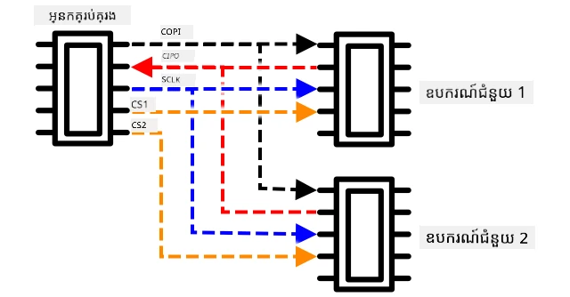

ខ្សែ CS ត្រូវបានប្រើដើម្បីចាប់ផ្ដើមធ្វើការ peripheral មួយនៅក្នុងពេលមួយ ជាមួយទំនាក់ទំនងលើខ្សែ COPI និង CIPO។ នៅពេល controller ត្រូវការផ្លាស់ប្តូរម peripheral វាបិទខ្សែ CS របស់ peripheral កំពុងធ្វើការ ហើយបើកខ្សែ CS របស់ peripheral ថ្មីដែលវាចង់ធ្វើការ។

SPI ដំណើរការល្បឿន *full-duplex* មានន័យថា Controller អាចផ្ញើ និងទទួលទិន្នន័យជាមួយ peripheral មួយនៅពេលតែមួយ ដោយប្រើខ្សែ COPI និង CIPO។ SPI ប្រើសញ្ញាម៉ោងលើខ្សែ SCLK ដើម្បីរក្សាឧបករណ៍ឲ្យសម្របសម្រួល ដូច្នេះ វាមិនចាំបាច់ប្រើប៊ីតចាប់ផ្តើម និងប៊ីតបញ្ចប់ ដូច UART ទេ។

មិនមានដែនកំណត់ល្បឿនច្បាស់លាស់សម្រាប់ SPI ទេ ដែលអនុវត្តភាគច្រើនអាចផ្ញើទិន្នន័យច្រើនម៉ែបៃក្នុងមួយវិនាទី។

ឧបករណ៍ក្រុមអភិវឌ្ឍ IoT ភាគច្រើនគាំទ្រការប្រើ SPI តាមខ្សែ GPIO ខ្លះៗ។ ឧទាហរណ៍ នៅលើ Raspberry Pi អ្នកអាចប្រើខ្សែ GPIO 19, 21, 23, 24 និង 26 សម្រាប់ SPI។

### ខ្សែបញ្ចេញសញ្ញាឥតខ្សែ

ខ្សែសញ្ញាខ្លះអាចទំនាក់ទំនងតាមរយៈប្រព័ន្ធខ្សែបញ្ចេញសញ្ញាដូចជា Bluetooth (ជាផ្ទាល់ Bluetooth Low Energy, ឬ BLE), LoRaWAN (បណ្តាញខ្សែអ៊ីលេតថ្មថា នឹងជាបណ្តាញថាមពលទាបសម្រាប់ចម្ងាយវែង), ឬ WiFi។ របៀបនេះអនុញ្ញាតឲ្យខ្សែសញ្ញាចម្ងាយ មានទីតាំងគ្មានភ្ជាប់ដោយផ្ទាល់ទៅឧបករណ៍ IoT។

ឧទាហរណ៍មួយគឺនៅក្នុងខ្សែសញ្ញាផ្ដល់តំបន់សើមដីអាជីវកម្ម។ ខ្សែសញ្ញានេះវាស់សើមដីក្នុងវាល រួចផ្ញើទិន្នន័យតាម LoRaWan ទៅឧបករណ៍មេ ដែលនឹងដំណើរការ ឬផ្ញើតាមអ៊ីនធឺណិត បាន។ វាអនុញ្ញាតឲ្យខ្សែវាស់សើមនៅចម្ងាយពីឧបករណ៍ IoT ដែលគ្រប់គ្រងទិន្នន័យ ដោយបន្ថយការប្រើថាមពល និងតម្រូវឲ្យមានបណ្តាញ WiFi ធំ ឬខ្សែដែលវែង។

BLE មានប្រជាប្រិយភាពសម្រាប់ខ្សែសញ្ញាកម្រិតខ្ពស់ ដូចជាកម្មវិធីតាមដានកាយសម្បទារដើមដៃ។ វាប្រើការរួមបញ្ចូលខ្សែសញ្ញាច្រើន ហើយផ្ញើទិន្នន័យឲ្យឧបករណ៍ IoT ដូចជា ទូរស័ព្ទរបស់អ្នកតាមរយៈ BLE។

✅ តើយើងមានខ្សែសញ្ញាប្លូតូស្លៅនៅលើខ្លួន ឬក្នុងផ្ទះ ឬនៅសាលារបស់អ្នកទេ? ខ្សែសញ្ញាទាំងនេះអាចរួមបញ្ចូលខ្សែវាស់សីតុណ្ហភាព, ខ្សែវាស់ចំនួនអ្នកនៅ, ខ្សែស្វែងរកឧបករណ៍ និងឧបករណ៍តាមដានកាយសម្បទារ។

វិធីដែលពេញនិយមមួយសម្រាប់ឧបករណ៍អាជីវកម្មក្នុងការតភ្ជាប់គឺ Zigbee។ Zigbee ប្រើ WiFi ដើម្បីបង្កើតបណ្តាញ mesh បណ្តោះអាសន្នរវាងឧបករណ៍ ដែលក្នុងនោះរៀងរាល់ឧបករណ៍ធ្វើការតភ្ជាប់ទៅឧបករណ៍ជិតខាងឲ្យបានច្រើនបំផុត រួចបង្កើតចំនួនតភ្ជាប់ច្រើនដូចបណ្ដាញចង蛛។ ពេលដែលឧបករណ៍មួយចង់ផ្ញើសារទៅអ៊ីនធឺណិត វាអាចផ្ញើទៅឧបករណ៍ជិតខាងបំផុត រួចឧបករណ៍នោះបន្តផ្ញើទៅឧបករណ៍ប៉ុនអ្នកផ្សេងទៀតមកវិញ រហូតដល់វាទៅដល់អ្នកដឹកនាំ ហើយអាចផ្ញើទៅអ៊ីនធឺណិតបាន។

> 🐝 ឈ្មោះ Zigbee តំណាងឲ្យការរាំហៅរបស់សត្វចៀមទឹកបន្ទាប់ពីត្រឡប់ទៅមកទឹកឃ្មុំ។

## វាស់កម្រិតសើមក្នុងដី

អ្នកអាចវាស់កម្រិតសើមដីដោយប្រើខ្សែវាស់សើមដី ឧបករណ៍ IoT និងរុក្ខជាតិ និងប្លង់ដីជិតខាង។

### បេសកកម្ម - វាស់សើមដី

អនុវត្តតាមមគ្គុទេសក៍ដែលពាក់ព័ន្ធសម្រាប់វាស់សើមដីដោយប្រើឧបករណ៍ IoT របស់អ្នក៖

* [Arduino - Wio Terminal](wio-terminal-soil-moisture.md)
* [Single-board computer - Raspberry Pi](pi-soil-moisture.md)
* [Single-board computer - Virtual device](virtual-device-soil-moisture.md)

## ការការពារខ្សែវាស់សូង់

ខ្សែវាស់ផ្អែកលើការវាស់លក្ខណៈអគ្គិសនី ដូចជា ការទប់ស្កាត់ (resistance) ឬកាប៉ាស៊ីតង់ (capacitance)។

> 🎓 ការទប់ស្កាត់ (Resistance) វាស់ជា ohms (Ω) គឺជា​កំរិត​ប្រឆាំង​ចំពោះចរន្តអគ្គិសនីដែលឆ្លងកាត់អ្វីមួយ។ នៅពេលភ្ជាប់វ៉ុល (voltage) ទៅលើសម្ភារៈ មាឌចរន្តដែលឆ្លងកាត់វា អាស្រ័យលើការទប់ស្កាត់នៃសម្ភារៈនោះ។ អ្នកអាចអានបន្ថែមពី [ទំព័រជាក់លាក់អគ្គិសនីលើវិគីភីឌា](https://wikipedia.org/wiki/Electrical_resistance_and_conductance)។

> 🎓 កាប៉ាស៊ីតង់ (capacitance) វាស់ជា farads (F) ជាសមត្ថភាពនៃធាតុ ឬរបៀបសកម្ម ដើម្បីប្រមូល និងផ្ទុកថាមពលអគ្គិសនី។ អ្នកអាចអានបន្ថែមពីកាប៉ាស៊ីតង់នៅលើ [វិគីភីឌា](https://wikipedia.org/wiki/Capacitance)។

ការវាស់ទាំងនេះមិនតែងមានប្រយោជន៍គ្រប់ពេលទេ — គំរូខ្សែវាស់សីតុណ្ហភាពមួយដែលផ្តល់អោយការវាស់បរិមាណ 22.5KΩ! ជំនួសវិញ តម្លៃដែលបានវាស់ត្រូវបានបំលែងទៅឯកតា​មានប្រយោជន៍ដោយការការពារ - ន័យថា ផ្គូផ្គងតម្លៃវាស់ទៅនឹងបរិមាណដែលវាធ្វើការវាស់ ដើម្បីអនុញ្ញាតឲ្យការវាស់ថ្មីត្រូវបំលែងទៅឯកតាត្រឹមត្រូវ។

ខ្សែវាស់ខ្លះមកជាមួយការការពារពីមុន។ ដូចជា ខ្សែវាស់សីតុណ្ហភាពដែលអ្នកប្រើក្នុងមេរៀនមុននេះ ការការពារមានរួចហើយ ដូច្នេះវាអាចត្រឡប់ការវាស់សីតុណ្ហភាពជាភាគរយសេនទីក្រេ (°C)។ នៅហាងរោងចក្រ ខ្សែវាស់ដំបូងដែលផលិត ត្រូវបានបញ្ចប់ឲ្យជួបជាមួយសីតុណ្ហភាពជាច្រើនដើម្បីវាស់ការទប់ស្កាត់។ បន្ទាប់មកវាត្រូវបានប្រើបង្កើតក្រុមគណនា ដែលអាចបំលែងតម្លៃវាស់ពី Ω (ឯកតាការទប់ស្កាត់) ទៅ °C។

> 💁 សមីការដើម្បីគណនាការទប់ស្កាត់ពីសីតុណ្ហភាពគឺហៅថា [Steinhart–Hart equation](https://wikipedia.org/wiki/Steinhart–Hart_equation)។

### ការការពារខ្សែវាស់សើមដី

សើមដីវាស់ដោយការវាស់មាឌទឹកឬទម្ងន់ទឹក។

* Gravimetric គឺជាទម្ងន់ទឹកក្នុងទម្ងន់ដីមួយឯកតា ដែលវាស់ជា គីឡូក្រាមទឹកក្នុងគីឡូក្រាមដីស្ងួត
* Volumetric គឺជាមាឌទឹកក្នុងមាឌដីមួយឯកតា ដែលវាស់ជា ម៉ែត្រគុណម៉ែត្រដឹកទឹកក្នុងម៉ែត្រកាន់ដីស្ងួត

> 🇺🇸 សម្រាប់ជនអាមេរិក ដោយសារតែធាតុអាចប្រើឯកតាជញ្ជាំងបានល្អ គេអាចវាស់ជាពោល (pounds) ជំនួសគីឡូក្រាម ឬជាខ្ទង់ជើងជំនួសម៉ែត្រ។

ខ្សែវាស់សើមដីវាស់ការទប់ស្កាត់ឬកាប៉ាស៊ីតង់ — នេះមិនត្រឹមតែផ្លាស់ប្តូរតាមសើមដីទេ តែផ្លាស់ប្តូរតាមប្រភេទដីផង ដោយសារធាតុផ្សំក្នុងដីអាចផ្លាស់ប្តូរឯកសារអគ្គិសនីរបស់វា។ វិជ្ជមានគ្រប់គ្រាន់ ខ្សែស្រូវគួរត្រូវបានការពារ — នេះមានន័យថាគឺយកអានពីខ្សែស្រូវ ហើយប្រៀបធៀបជាមួយការវាស់ដែលបានរកឃើញដោយវិទ្យាសាស្រ្ត។ ឧទាហរណ៍ មន្ទីរពិសោធន៍អាចគណនាសើមដីមាឌទឹកច្រើនលើគំរូបញ្ញាណដីបំលែងជាច្រើនជុំក្នុងមួយឆ្នាំ ហើយអ្នកប្រើលេខនោះក្នុងការការពារ ខ្សែកាក់វាស់ទៅនឹងសើមដីមាឌទឹក។

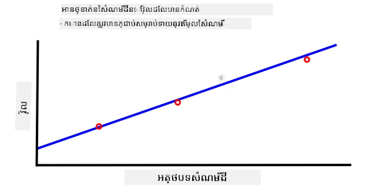

ក្រាហ្វខាងលើបង្ហាញពីរបៀបការពារ ខ្សែវាស់។ វ៉ុលត្រូវបានចាប់សម្រាប់គំរូដីដែលវាស់នៅមន្ទីរពិសោធន៍ ដោយប្រៀបធៀបទម្ងន់សើមទៅទម្ងន់ស្ងួត (ដោយវាស់ទម្ងន់សើម បន្ទាប់មកស្ងួតក្នុងម៉ាស៊ីនជម្រះ និងវាស់ទម្ងន់ស្ងួត)។ នៅពេលដែលមានការចាប់អានប៉ុន្មាន វាក៏អាចគូរលើក្រាហ្វ និងភ្ជាប់បន្ទាត់ទៅចំណុចទាំងនោះបាន។ បន្ទាត់នេះអាចប្រើផ្លាស់ប្តូរតម្លៃអានពីខ្សែវាស់សើមដោយឧបករណ៍ IoT ទៅកម្រិតសើមដីពិតប្រាកដ។

💁 សម្រាប់ខ្សែវាស់សើមដីប្រភេទប្រឆាំង (resistive) វ៉ុលឡើងចំពោះការកើនសើមដី។ សម្រាប់ខ្សែវាស់សើមដីប្រភេទកាប៉ាស៊ីត (capacitive) វ៉ុលធ្លាក់ចុះពេលសើមដីកើនឡើង ដូច្នេះក្រាហ្វទៅលើអ្នកនេះនឹងទទួលបានបន្ទាត់រលុងចុះ ហើយមិនឡើង។

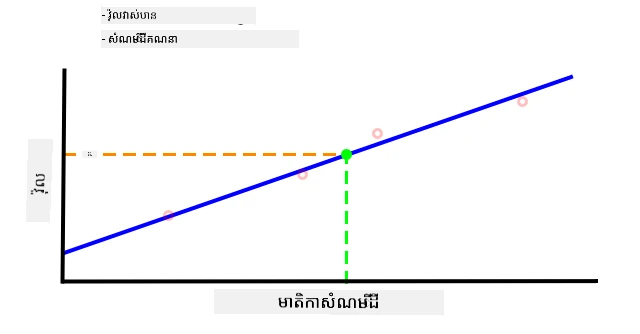

ក្រាហ្វនេះបង្ហាញអានវ៉ុលពីខ្សែវាស់សើម ដី ហើយដោយតាមទៅកាន់បន្ទាត់លើក្រាហ្វ អាចគណនាអត្រាសើមដីពិតប្រាកដបាន។

របៀបនេះមានន័យថាគ្រប់ទីតាំងអាចត្រូវការយកតែការវាស់ពីមន្ទីរពិសោធន៍ប៉ុន្មានតែប៉ុណ្ណោះ ហើយពួកគេអាចប្រើឧបករណ៍ IoT ដើម្បីវាស់សើមដីបាន លឿនជាងមុន។

---

## 🚀 ការប្រកួតប្រជែង

ខ្សែវាស់សើមដីប្រភេទប្រឆាំង (resistive) និងប្រភេទកាប៉ាស៊ីត (capacitive) មានភាពខុសគ្នា៖ អ្វីខ្លះ? តើប្រភេទណាដែលល្អបំផុតសម្រាប់កសិករក្នុងការប្រើប្រាស់? តើចម្លើយនេះផ្លាស់ប្តូរទៅតាមប្រទេសកំពុងអភិវឌ្ឍន៍ និងប្រទេសអភិវឌ្ឍរួចហើយទេ?

## សំនួរបញ្ចប់មេរៀន

[Post-lecture quiz](https://black-meadow-040d15503.1.azurestaticapps.net/quiz/12)

## ការត្រួតពិនិត្យ និងសិក្សាឯករាជ្យ

អានអំពីថ្នាក់ភាសាអេឡិចត្រូនិច និងប្រព័ន្ធប្រតិបត្តិការដែលប្រើប្រាស់ដោយខ្សែសក់ និងរ៉ឺម៉ូត:

* [ទំព័រ Wikipedia របស់ GPIO](https://wikipedia.org/wiki/General-purpose_input/output)
* [ទំព័រ Wikipedia របស់ UART](https://wikipedia.org/wiki/Universal_asynchronous_receiver-transmitter)
* [ទំព័រ Wikipedia របស់ SPI](https://wikipedia.org/wiki/Serial_Peripheral_Interface)
* [ទំព័រ Wikipedia របស់ I2C](https://wikipedia.org/wiki/I²C)
* [ទំព័រ Wikipedia របស់ Zigbee](https://wikipedia.org/wiki/Zigbee)

## ការងារ

[Calibrate your sensor](assignment.md)

---

<!-- CO-OP TRANSLATOR DISCLAIMER START -->
**ការបដិសេធ**៖  
ឯកសារនេះត្រូវបានបកប្រែដោយប្រើសេវាកម្មបកប្រែ AI [Co-op Translator](https://github.com/Azure/co-op-translator)។ ខណៈពេលដែលយើងខិតខំប្រឹងប្រែងដើម្បីបានភាពត្រឹមត្រូវ សូមជ្រាបថាការបកប្រែដោយស្វ័យប្រវត្តិនេះអាចមានកំហុសឬភាពមិនត្រឹមត្រូវ។ ឯកសារដើមក្នុងភាសារបស់វាគួរត្រូវបានចាត់ទុកជាមូលដ្ឋានមានអំណាច។ សម្រាប់ព័ត៌មានសំខាន់ៗ សូមផ្ដល់អាទិភាពការបកប្រែដោយអ្នកជំនាញមនុស្សវិជ្ជាជីវៈ។ យើងមិនទទួលខុសត្រូវចំពោះការយល់ច្រឡំ ឬការបកប្រែខុសណាមួយដែលកើតឡើងពីការប្រើប្រាស់ការបកប្រែនេះឡើយ។
<!-- CO-OP TRANSLATOR DISCLAIMER END -->