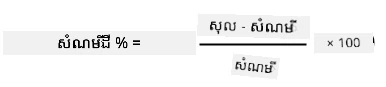
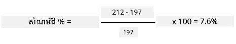

# កំណត់តម្លៃម៉ាស៊ីនវាស់សំណើមដីរបស់អ្នកឡើងវិញ

## សេចក្តីណែនាំ

ក្នុងមេរៀននេះ អ្នកបានប្រមូលការវាស់សំណើមដី ដោយវាស់ជាថ្នាក់តម្លៃពី 0-1023។ ដើម្បីបម្លែងតម្លៃទាំងនេះទៅជាតម្លៃសំណើមដីពិតប្រាកដ អ្នកត្រូវតែធ្វើការកំណត់តម្លៃម៉ាស៊ីនវាស់សំណើមរបស់អ្នកឡើងវិញ។ អ្នកអាចធ្វើបានដោយយកតម្លៃវាស់ពីគំរូដី ហើយកំពុងគណនាមាត្រដ្ឋានសំណើមដីក្នុងគំរូទាំងនេះ។

អ្នកត្រូវតែធ្វើដំណើរការទាំងនេះម្តងទៀតច្រើនដង ដើម្បីទទួលបានតម្លៃដែលចាំបាច់ ជាមួយសំណើមដីដែលខុសគ្នាទៅគ្នា។

1. វាស់តម្លៃសំណើមដីដោយប្រើម៉ាស៊ីនវាស់សំណើមដី។ កំណត់តម្លៃនេះចុះ។

1. យកគំរូដីមួយ ហើយវាស់ទម្ងន់វា។ កំណត់ទម្ងន់នេះចុះ។

1. ធម្មតាលាបដីឲ្យស្ងួត - ពីរនាទីផឹកកំដៅនៅ 110°C (230°F) គឺជាវិធីល្អបំផុត អ្នកអាចធ្វើវាក្នុងពន្លឺថ្ងៃ ឬដាក់វាទៅកន្លែងកម្ដៅ ស្ងួត រហូតដល់ដីស្ងួតពេញលេញ។ ដីគួរតែមានសំណល់ផាត់ និងស្មើស្មាន់។

    > 💁 នៅក្នុងមន្ទីរពិសោធន៍ សម្រាប់លទ្ធផលទំនោរបំផុត អ្នកគួរតែផាត់នៅក្នុងរោងបូមកម្ដៅរយៈពេល 48-72 ម៉ោង។ ប្រសិនបើអ្នកមានរោងបូមកម្ដៅនៅសាលារបស់អ្នក សូមព្យាយាមប្រើវាទៅផាត់រយៈពេលយូរជាងនេះ។ រយៈពេលយូរ បរិមាណសំណើមដែលខ្យល់បានចេញច្រើន ហើយលទ្ធផលកាន់តែត្រឹមត្រូវ។

1. វាស់ផ្ទុយដីម្តងទៀត។

    > 🔥 ប្រសិនបើអ្នកបានផាត់វាក្នុងរោងបូមកម្ដៅ សូមប្រាកដថាវាបានត្រជាក់រួចសិន!

មាត្រដ្ឋានសំណើមដីភាគហ៊ុនគណនាតាមរូបមន្ត៖

* Wwet - ទម្ងន់នៃដីសើម
* Wdry - ទម្ងន់នៃដីស្ងួត

ឧទាហរណ៍ បើអ្នកមានគំរូដីមានទម្ងន់ 212ក្រាម​សើម និង 197ក្រាម​ស្ងួត។

* Wwet = 212ក្រាម
* Wdry = 197ក្រាម
* 212 - 197 = 15
* 15 / 197 = 0.076
* 0.076 * 100 = 7.6%

ក្នុងឧទាហរណ៍នេះ ដីមានមាត្រដ្ឋានសំណើមដី 7.6%។

ពេលដែលអ្នកមានតម្លៃវាស់សម្រាប់គំរូយ៉ាងហោចណាស់ 3 គំរូ សូមគូររូបក្រាបសំណើមដី % ទៅការវាស់ម៉ាស៊ីនសំណើមដី ហើយបន្ថែមខ្សែរដើម្បីឱ្យសាកសមបំផុតជាមួយចំណុចទាំងនោះ។ បន្ទាប់មក អ្នកអាចប្រើវានៅក្នុងការគណនាមាត្រដ្ឋានសំណើមដីសម្រាប់តម្លៃឧបករណ៍វាស់ណាមួយ ដោយអានតម្លៃពីខ្សែនេះ។

## គោលការណ៍វាយតម្លៃ

| មាតិកា | ល្អឧត្តម | ល្អគ្រប់គ្រាន់ | ត្រូវការកែលម្អ |
| -------- | --------- | -------- | ----------------- |
| ប្រមូលទិន្នន័យកំណត់តម្លៃ | ប្រមូលគំរូកំណត់តម្លៃយ៉ាងហោចណាស់ 3 គំរូ | ប្រមូលគំរូកំណត់តម្លៃយ៉ាងហោចណាស់ 2 គំរូ | ប្រមូលគំរូកំណត់តម្លៃយ៉ាងហោចណាស់ 1 គំរូ |
| ធ្វើការវាស់បានកំណត់ | គូរគ្រាបកំណត់តម្លៃបានជោគជ័យ និងយកតម្លៃពីម៉ាស៊ីនវាស់ ហើយបម្លែងទៅមាត្រដ្ឋានសំណើមដី | គូរគ្រាបកំណត់តម្លៃបានជោគជ័យ | មិនអាចគូរគ្រាបបាន |

---

<!-- CO-OP TRANSLATOR DISCLAIMER START -->
**ការបហារណ៍**៖  
ឯកសារនេះត្រូវបានបកប្រែដោយប្រើសេវាកម្មបកប្រែ AI [Co-op Translator](https://github.com/Azure/co-op-translator)។ ខណៈពេលយើងខិតខំសំរាប់ភាពត្រឹមត្រូវ សូមជ្រាបថាការបកប្រែដោយស្វ័យប្រវត្តិក្នុងករណីខ្លះអាចមានកំហុសឬភាពមិនត្រឹមត្រូវ។ ឯកសារដែលមានភាសាមើលឃើញដើមគួរត្រូវបានគេចាត់ទុកថាជា ប្រភពផ្លូវការដាច់ដោយឡែក។ សម្រាប់ព័ត៌មានផ្លូវការយ៉ាងសំខាន់ សូមផ្តល់អនុសាសន៍ប្រើប្រាស់ការបកប្រែដោយអ្នកវិជ្ជាជីវៈមនុស្ស។ យើងមិនទទួលខុសត្រូវចំពោះការយល់ច្រឡំពីប្រែប្រួល ឬការបកប្រែបច្ចេកទេសណាមួយដែលកើតឡើងពីការប្រើប្រាស់ការបកប្រែនេះឡើយ។
<!-- CO-OP TRANSLATOR DISCLAIMER END -->