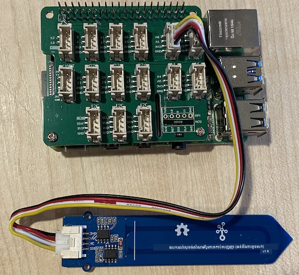

# វាស់សំណើមដី - Raspberry Pi

នៅក្នុងផ្នែកនេះនៃមេរៀន អ្នកនឹងបន្ថែមឧបករណ៍សង្គ្រោះសំណើមដីប្រភេទ capacitive ទៅកាន់ Raspberry Pi របស់អ្នក ហើយអានតម្លៃចេញពីវា។

## ឧបករណ៍រឹបរាន់

Raspberry Pi ត្រូវការឧបករណ៍សង្គ្រោះសំណើមដីប្រភេទ capacitive។

ឧបករណ៍ដែលអ្នកនឹងប្រើគឺ [Capacitive Soil Moisture Sensor](https://www.seeedstudio.com/Grove-Capacitive-Moisture-Sensor-Corrosion-Resistant.html) ដែលវាស់សំណើមដីដោយការស្កែនគុណភាព capacitance នៃដី ដែលជាសម្បត្តិមួយដែលប្រែប្រួលពេលសំណើមដីប្រែប្រួល។ កាលដែលសំណើមដីកើនឡើង អគ្គិសនីអគ្គិសនីនឹងធ្លាក់ចុះ។

នេះជាឧបករណ៍អាណាឡុក ដូច្នេះវាប្រើប៊ីនអាណាឡុក និង ADC 10-ប៊ីតនៅលើ Grove Base Hat នៅលើ Pi ដើម្បីបម្លែងវ៉ុលទៅសញ្ញាឌីជីថលចន្លោះ 1-1,023។ នោះបន្ទាប់ត្រូវបានបញ្ជូនតាមរយៈ I<sup>2</sup>C តាមរយៈប៊ីន GPIO នៅលើ Pi។

### ការតភ្ជាប់ឧបករណ៍សង្គ្រោះសំណើមដី

ឧបករណ៍ Grove soil moisture sensor អាចត្រូវបានភ្ជាប់ទៅកាន់ Raspberry Pi ។

#### ភារកិច្ច - ភ្ជាប់ឧបករណ៍សង្គ្រោះសំណើមដី

ភ្ជាប់ឧបករណ៍សង្គ្រោះសំណើមដី។


1. ដាក់ចុងមួយនៃខ្សែ Grove ចូលទៅក្នុងទ្វារនៃឧបករណ៍សង្គ្រោះសំណើមដី។ វានឹងចូលបានតែមួយទិសតែប៉ុណ្ណោះ។

1. នៅពេល Raspberry Pi មិនភ្លើង បញ្ចូលចុងខ្សែ Grove ផ្សេងទៀតចូលទៅកាន់សូកអាណាឡុកដែលមានសរសេរ **A0** លើ Grove Base hat ភ្ជាប់ទៅ Pi។ សូកនេះជាសូកទីពីរពីខាងស្តាំ នៅជួរសូកដែលនៅជាប់នឹងប៊ីន GPIO។



1. ដាក់ឧបករណ៍សង្គ្រោះសំណើមដីចូលក្នុងដី។ វាមាន 'ខ្សែទីតាំងអតិបរមា' - ខ្សែពណ៌សឆ្លងកាត់ឧបករណ៍។ ដាក់ឧបករណ៍សង្គ្រោះរហូតដល់តែមិនលើសខ្សែនេះ។


## កម្មវិធីឧបករណ៍សង្គ្រោះសំណើមដី

Raspberry Pi ឥឡូវនេះអាចបង្កើតកម្មវិធីប្រើឧបករណ៍សង្គ្រោះសំណើមដីដែលភ្ជាប់មក។

### ភារកិច្ច - កម្មវិធីឧបករណ៍សង្គ្រោះសំណើមដី

ទុកកម្មវិធីសូម្បីមួយ។

1. បើក Pi ហើយរង់ចាំឱ្យវាបញ្ចប់ការចាប់ផ្តើម

1. បើក VS Code ដោយផ្ទាល់នៅលើ Pi ឬភ្ជាប់តាមបន្ថែម Remote SSH។

    > ⚠️ អ្នកអាចយោងទៅ [សេចក្ដីណែនាំសំរាប់ការដំឡើង និងបើក VS Code ក្នុង nightlight - មេរៀនទី 1 ប្រសិនបើត្រូវការ](../../../1-getting-started/lessons/1-introduction-to-iot/pi.md)។

1. ពីបន្ទាត់បញ្ជា បង្កើតថតថ្មីមួយក្នុងថតផ្ទាល់ពិភពលោក `pi` ហៅថា `soil-moisture-sensor`។ បង្កើតឯកសារ `app.py` នៅក្នុងថតនេះ។

1. បើកថតនេះនៅក្នុង VS Code

1. បន្ថែមកូដដូចខាងក្រោមទៅឯកសារ `app.py` ដើម្បីនាំចូលបណ្ណាល័យដែលចាំបាច់មួយចំនួន៖

    ```python
    import time
    from grove.adc import ADC
    ```

    ពាក្យបញ្ចូល `import time` នាំចូលម៉ូឌុល `time` ដែលនឹងត្រូវបានប្រើនៅពេលក្រោយក្នុងភារកិច្ចនេះ។

    ពាក្យបញ្ចូល `from grove.adc import ADC` នាំចូល `ADC` ពីបណ្ណាល័យ Grove Python។ បណ្ណាល័យនេះមានកូដអាចធ្វើដំណើរការជាមួយឧបករណ៍បម្លែងអាណាឡុកទៅឌីជីថលនៅលើ Pi base hat ហើយអានវ៉ុលពីឧបករណ៍អាណាឡុក។

1. បន្ថែមកូដដូចខាងក្រោមនៅក្រោមនេះដើម្បីបង្កើតអត្ថបទមួយនៃ `ADC` ថ្នាក់៖

    ```python
    adc = ADC()
    ```

1. បន្ថែមវដ្តអចិន្ត្រៃ ដែលអានពី ADC នៅប៊ីន A0 ហើយសរសេរវិលលទ្ធផលចេញទៅកុងសូល។ វដ្តនេះអាចដេករយៈពេល 10 វិនាទីរវាងការអាន។

    ```python
    while True:
        soil_moisture = adc.read(0)
        print("Soil moisture:", soil_moisture)

        time.sleep(10)
    ```

1. រត់កម្មវិធី Python។ អ្នកនឹងឃើញជម្លោះសំណើមដីត្រូវបានសរសេរចេញនៅកុងសូល។ បន្ថែមទឹកទៅក្នុងដី ឬដកឧបករណ៍ចេញពីដី ហើយមើលតម្លៃប្រែប្រួល។

    ```output
    pi@raspberrypi:~/soil-moisture-sensor $ python3 app.py 
    Soil moisture: 615
    Soil moisture: 612
    Soil moisture: 498
    Soil moisture: 493
    Soil moisture: 490
    Soil Moisture: 388
    ```

    នៅក្នុងលទ្ធផលឧទាហរណ៍ខាងលើ អ្នកអាចមើលឃើញការធ្លាក់ចុះនៃវ៉ុលពេលដែលទឹកត្រូវបានបន្ថែម។

> 💁 អ្នកអាចរកឃើញកូដនេះនៅក្នុងថត [code/pi](../../../../../2-farm/lessons/2-detect-soil-moisture/code/pi)។

😀 កម្មវិធីឧបករណ៍សង្គ្រោះសំណើមដីរបស់អ្នកបានជោគជ័យ!

---

<!-- CO-OP TRANSLATOR DISCLAIMER START -->
**ការព្រមាន**៖  
ឯកសារនេះបានបកប្រែដោយប្រើសេវាបកប្រែ AI [Co-op Translator](https://github.com/Azure/co-op-translator)។ បើទោះបីយើងខិតខំធ្វើឲ្យមានភាពត្រឹមត្រូវក៏ដោយ សូមដឹងថាការបកប្រែដោយស្វ័យប្រវត្តិអាចមានកំហុស ឬការមិនច្បាស់លាស់។ ឯកសារដើមនៅភាសាតំបន់ដើមគួរត្រូវបានគេរាប់បញ្ចូលជាភស្តុតាងផ្លូវការជាដាច់ខាត។ សម្រាប់ព័ត៌មានសំខាន់ៗ សូមផ្តល់អនុសាសន៍ឲ្យធ្វើការបកប្រែដោយអ្នកជំនាញវិជ្ជាជីវៈ។ យើងមិនទទួលខុសត្រូវចំពោះការយល់ច្រឡំ ឬការបកស្រាយខុសឆ្គងណាមួយដែលកើតមានពីការប្រើប្រាស់ការបកប្រែនេះឡើយ។
<!-- CO-OP TRANSLATOR DISCLAIMER END -->