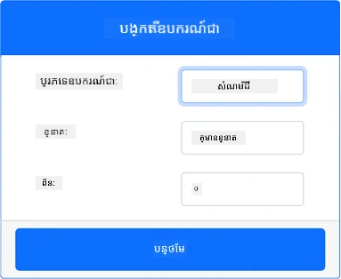
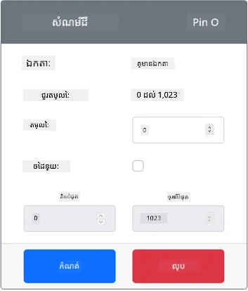

# វាស់សំណើមដី - ថ្នាក់ទំនើប IoT សម្រាប់រឹង

នៅក្នុងផ្នែកនេះនៃមេរៀន អ្នកនឹងបន្ថែមឧបករណ៍ស្ងួតសំណើមដីតាមប្រភេទកាប៉ាស៊ីធីវទៅឧបករណ៍ IoT ថ្ម្រង់របស់អ្នក ហើយអានតម្លៃពីវា។

## ឧបករណ៍តាមប្រព័ន្ធខ្នាតនិច

ឧបករណ៍ IoT ថ្ម្រង់នេះនឹងប្រើឧបករណ៍ស្ងួតសំណើមដីតាមប្រភេទកាប៉ាស៊ីធីវដែលបានសម្តែង។ វាថែរក្សាការប្រើប្រាស់នៅក្នុងមន្ទីរហ្គេមដូចការប្រើប្រាស់ Raspberry Pi ជាមួយឧបករណ៍ស្ងួតសំណើមដី Grove ដោយផ្ទាល់។

 នៅក្នុងឧបករណ៍ IoT ដោយផ្ទាល់ ឧបករណ៍ស្ងួតសំណើមដីគឺជាឧបករណ៍កាប៉ាស៊ីធីវមួយដែលវាស់សំណើមដីដោយការស្គាល់កាប៉ាស៊ីតែនៃដី ដែលជាពិសេសលក្ខណៈដែលផ្លាស់ប្តូររួចពេលសំណើមដីផ្លាស់ប្តូរ។ ពេលសំណើមដីបន្ថែមឡើង វ៉ុលតុបតែងបន្ថយ។

នេះជាឧបករណ៍អាណាឡូហ្គហ្គ ដែលប្រើ ADC ១០ប៊ិច ដែលបានសម្តែងដើម្បីរាយការណ៍តម្លៃពី ១ ដល់ ១០២៣។

### បន្ថែមឧបករណ៍ស្ងួតសំណើមដីទៅ CounterFit

ដើម្បីប្រើឧបករណ៍ស្ងួតសំណើមដីតាមប្រភេទថ្ម្រង់ អ្នកត្រូវបន្ថែមវាទៅក្នុងកម្មវិធី CounterFit

#### កិច្ចការណ៍ - បន្ថែមឧបករណ៍ស្ងួតសំណើមដីទៅ CounterFit

បន្ថែមឧបករណ៍ស្ងួតសំណើមដីទៅក្នុងកម្មវិធី CounterFit។

1. បង្កើតកម្មវិធី Python ថ្មីនៅលើកុំព្យូទ័ររបស់អ្នកនៅក្នុងថតមួយដែលមានឈ្មោះ `soil-moisture-sensor` ជាមួយឯកសារតែមួយគឺ `app.py` និងបរិស្ថាន Python ថ្មីមួយ ហើយបន្ថែមបណ្ណាល័យ CounterFit pip។

    > ⚠️ អ្នកអាចយោងទៅកាន់ [ការណែនាំសម្រាប់បង្កើត និងតំឡើងគម្រោង Python CounterFit ក្នុងមេរៀនទី១ ប្រសិនបើចាំបាច់](../../../1-getting-started/lessons/1-introduction-to-iot/virtual-device.md)។

1. ត្រូវប្រាកដថាកម្មវិធីវេប CounterFit កំពុងដំណើរការ

1. បង្កើតឧបករណ៍ស្ងួតសំណើមដី៖

    1. នៅក្នុងប្រអប់ *Create sensor* នៅផ្នែក *Sensors* ចុចបង្ហាញប្រអប់ *Sensor type* ហើយជ្រើសរើស *Soil Moisture*។

    1. ទុកឲ្យ *Units* នៅក្នុង *NoUnits*

    1. ប្រាកដថា *Pin* បានកំណត់ទៅ *0*

    1. ជ្រើសប៊ូតុង **Add** ដើម្បីបង្កើតឧបករណ៍ *Soil Moisture* នៅ Pin 0

    

    ឧបករណ៍ស្ងួតសំណើមដីនឹងត្រូវបានបង្កើត ហើយបង្ហាញនៅក្នុងបញ្ជីឧបករណ៍។

    

## កម្មវិធីឧបករណ៍ស្ងួតសំណើមដី

កម្មវិធីឧបករណ៍ស្ងួតសំណើមដីឥឡូវនេះអាចកម្មវិធីដោយប្រើឧបករណ៍ CounterFit។

### កិច្ចការណ៍ - កម្មវិធីឧបករណ៍ស្ងួតសំណើមដី

កម្មវិធីឧបករណ៍ស្ងួតសំណើមដី។

1. ត្រូវប្រាកដថាកម្មវិធី `soil-moisture-sensor` បានបើកនៅក្នុង VS Code

1. បើកឯកសារ `app.py`

1. បន្ថែមកូដខាងក្រោមទៅនៅខាងលើនៃ `app.py` ដើម្បីភ្ជាប់កម្មវិធីទៅ CounterFit:

    ```python
    from counterfit_connection import CounterFitConnection
    CounterFitConnection.init('127.0.0.1', 5000)
    ```

1. បន្ថែមកូដខាងក្រោមទៅឯកសារ `app.py` ដើម្បីនាំចូលបណ្ណាល័យមួយចំនួនដែលត្រូវការ៖

    ```python
    import time
    from counterfit_shims_grove.adc import ADC
    ```

    ពាក្យសម្ងាត់ `import time` នាំចូលម៉ូឌុល `time` ដែលនឹងត្រូវប្រើពេលក្រោយក្នុងកិច្ចការនេះ។

    ពាក្យសម្ងាត់ `from counterfit_shims_grove.adc import ADC` នាំចូលថ្នាក់ `ADC` ដើម្បីអាចអន្តរជាមួយឧបករណ៍បម្លែងអាណាឡូកទៅឌីជីថលដែលភ្ជាប់នឹងឧបករណ៍ CounterFit។

1. បន្ថែមកូដខាងក្រោមនេះ ខាងក្រោមនេះដើម្បីបង្កើតឧបករណ៍ `ADC` មួយ៖

    ```python
    adc = ADC()
    ```

1. បន្ថែមលក្ខខណ្ឌដំណើរការ tínិតដដែលៗដែលអានពី ADC នៅតង់ 0 ហើយសរសេរលទ្ធផលទៅកាន់កុងសូឡ។ លក្ខខណ្ឌនេះអាចចូរគេងជារយៈពេល ១០ វិនាទីរវាងការអាន។

    ```python
    while True:
        soil_moisture = adc.read(0)
        print("Soil moisture:", soil_moisture)
    
        time.sleep(10)
    ```

1. ពីកម្មវិធី CounterFit ផ្លាស់ប្តូរតម្លៃឧបករណ៍ស្ងួតសំណើមដីដែលកម្មវិធីនឹងអាន។ អ្នកអាចធ្វើរឿងនេះដោយពីររបៀប៖

    * បញ្ចូលលេខក្នុងប្រអប់ *Value* សម្រាប់ឧបករណ៍ស្ងួតសំណើមដី ហើយជ្រើសប៊ូតុង **Set**. ចំនួនដែលអ្នកបញ្ចូលនឹងក្លាយជាតម្លៃដែលឧបករណ៍ត្រឡប់មកវិញ។

    * ពិនិត្យប្រអប់ *Random* ហើយបញ្ចូលតម្លៃ *Min* និង *Max* បន្ទាប់មកជ្រើសប៊ូតុង **Set**. រាល់ពេលឧបករណ៍អានតម្លៃ វានឹងអានចំនួនចៃដន្យរវាង *Min* និង *Max*។

1. បើកកម្មវិធី Python. អ្នកនឹងឃើញការវាស់សំណើមដីត្រូវបានសរសេរទៅក្នុងកុងសូឡ។ ប្ដូរតម្លៃ *Value* ឬការកំណត់ *Random* ដើម្បីមើលការផ្លាស់ប្ដូរតម្លៃ។

    ```output
    (.venv) ➜ soil-moisture-sensor $ python app.py 
    Soil moisture: 615
    Soil moisture: 612
    Soil moisture: 498
    Soil moisture: 493
    Soil moisture: 490
    Soil Moisture: 388
    ```

> 💁 អ្នកអាចស្វែងរកកូដនេះនៅក្នុងថត [code/virtual-device](../../../../../2-farm/lessons/2-detect-soil-moisture/code/virtual-device)។

😀 កម្មវិធីឧបករណ៍ស្ងួតសំណើមដីរបស់អ្នកបានជោគជ័យ!

---

<!-- CO-OP TRANSLATOR DISCLAIMER START -->
**ការ​បដិសេធ​ខ្លះៗ**៖  
ឯកសារ​នេះត្រូវ​បាន​បកប្រែ​ដោយប្រើសេវាកម្មបកប្រែ AI [Co-op Translator](https://github.com/Azure/co-op-translator)។ ម្យ៉ាងវិញទៀត បើយើងខិតខំរកភាពត្រឹមត្រូវ សូមយល់ដឹងថា ការបកប្រែដោយស្វ័យប្រវត្តិ​អាចមានកំហុស ឬខុសត្រូវខ្លះៗ។ ឯកសារដើមនៅក្នុងភាសាម្ចាស់របស់វាគួរត្រូវបានគិតថាជាមូលដ្ឋានសម្របសម្រួល​ដ៏ត្រឹមត្រូវ។ សម្រាប់ព័ត៌មានសំខាន់ៗ សូមណែនាំឲ្យប្រើការបកប្រែដោយអ្នកជំនាញមនុស្ស។ យើងមិនទទួលខុសត្រូវចំពោះការយល់ច្រឡំ ឬការបកស្រាយខុសៗពីការប្រើប្រាស់ការបកប្រែនេះឡើយ។
<!-- CO-OP TRANSLATOR DISCLAIMER END -->