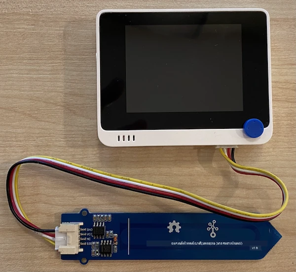

# វាស់សំណើមដី - Wio Terminal

នៅផ្នែកនេះនៃមេរៀន អ្នកនឹងបន្ថែមឧបករណ៍ចាប់យកសំណើមដីប្រភេទ capacitive ទៅកាន់ Wio Terminal របស់អ្នក ហើយអានតម្លៃពីវា។

## ឧបករណ៍រឹង

Wio Terminal ត្រូវការឧបករណ៍ចាប់យកសំណើមដីប្រភេទ capacitive។

ឧបករណ៍ដែលអ្នកនឹងប្រើគឺ [Capacitive Soil Moisture Sensor](https://www.seeedstudio.com/Grove-Capacitive-Moisture-Sensor-Corrosion-Resistant.html) ដែលវាស់សំណើមដីដោយការបញ្ជាក់ពី capacitance របស់ដី ដែលជាគុណលក្ខណៈមួយដែលផ្លាស់ប្តូរតាមសំណើមដី។ នៅពេលសំណើមដីកើនឡើង វឌ្ឍន voltage ដកចុះ។

នេះគឺជាឧបករណ៍អាណាឡូគ ដែលភ្ជាប់ទៅនឹងគំនូសអាណាឡូគលើ Wio Terminal ដោយប្រើជំនួយ ADC នៅលើផ្ទៃកូនហើយបង្កើតតម្លៃចាប់ពី 0 ដល់ 1,023។

### ភ្ជាប់ឧបករណ៍ចាប់យកសំណើមដី

ឧបករណ៍ Grove soil moisture sensor អាចភ្ជាប់ទៅនឹងច្រក analog/digital ដែលអាចកំណត់បានសម្រាប់ Wio Terminal។

#### បេសកកម្ម - ភ្ជាប់ឧបករណ៍ចាប់យកសំណើមដី

ភ្ជាប់ឧបករណ៍ចាប់យកសំណើមដី។


1. បញ្ចូលចុងខាងមួយនៃខ្សែ Grove ទៅក្នុងស៊ុកអាងនៅលើឧបករណ៍ soil moisture sensor។ វានឹងបញ្ចូលបានតែលើផ្លូវមួយផងប៉ុណ្ណោះ។

1. ជាមួយ Wio Terminal ដែលបិទភ្ជាប់ពីកុំព្យូទ័រឬប្រភពថាមពល ផ្ទេរចុងខាងមួយទៀតនៃខ្សែ Grove ទៅក្នុងស៊ុក Grove មាននៅផ្នែកខាងស្តាំនៃ Wio Terminal នៅពេលអ្នកមើលផ្ទាំងអេក្រង់។ នេះគឺជាស៊ុកដែលនៅចម្ងាយបំផុតពីប៊ូតុងថាមពល។



1. បញ្ចូលឧបករណ៍ soil moisture sensor ចូលក្នុងដី។ វាមាន "ខ្សែបន្ទាត់ទីតាំងខ្ពស់បំផុត" មួយ — ខ្សែពណ៌សឆ្លងកាត់ឧបករណ៍។ បញ្ចូលឧបករណ៍រហូតដល់តែគ្រាន់តែដល់ខ្សែនេះ ប៉ុន្តែមិនលើស។


1. ឥឡូវអ្នកអាចភ្ជាប់ Wio Terminal ទៅកុំព្យូទ័ររបស់អ្នកបាន។

## បញ្ចូលកម្មវិធីឧបករណ៍ចាប់យកសំណើមដី

ឥឡូវនេះ Wio Terminal អាចត្រូវបានកម្មវិធីតាមដើម្បីប្រើឧបករណ៍ soil moisture sensor ដែលភ្ជាប់។

### បេសកកម្ម - បញ្ចូលកម្មវិធីឧបករណ៍ចាប់យកសំណើមដី

កម្មវិធីឧបករណ៍។

1. បង្កើតគម្រោង Wio Terminal ថ្មីមួយដោយប្រើ PlatformIO។ ហៅគម្រោងនេះ `soil-moisture-sensor`។ បន្ថែមកូដក្នុងមុខងារ `setup` ដើម្បីកំណត់ច្រក serial។

    > ⚠️ អ្នកអាចយោងទៅ [សេចក្តីណែនាំសម្រាប់បង្កើតគម្រោង PlatformIO ក្នុងគម្រោង 1 មេរៀន 1 ប្រសិនបើចាំបាច់](../../../1-getting-started/lessons/1-introduction-to-iot/wio-terminal.md#create-a-platformio-project)។

1. មិនមានបណ្ណាល័យសម្រាប់ឧបករណ៍នេះទេ ជំនួសអ្នកអាចអានពីច្រកអាណាឡូគប្រើមុខងារ Arduino [`analogRead`](https://www.arduino.cc/reference/en/language/functions/analog-io/analogread/) ដែលមានមុន។ ចាប់ផ្តើមដោយកំណត់ច្រក analog ជាច្រកបញ្ចូល ដើម្បីអាចអានតម្លៃពីវាតាមការបន្ថែមកូដខាងក្រោមក្នុងមុខងារ `setup`។

    ```cpp
    pinMode(A0, INPUT);
    ```

    នេះកំណត់ច្រក `A0` ដែលជាច្រករួមអាណាឡូ​គ/ឌីជីថល ជាច្រកបញ្ចូល ដែលអាចអានវ៉ុលពីវា។

1. បន្ថែមកូដខាងក្រោមទៅមុខងារ `loop` ដើម្បីអានវ៉ុលពីច្រកនេះ៖

    ```cpp
    int soil_moisture = analogRead(A0);
    ```

1. ខាងក្រោមកូដនេះ បន្ថែមកូដដូចខាងក្រោម ដើម្បីបោះពុម្ពតម្លៃទៅច្រក serial៖

    ```cpp
    Serial.print("Soil Moisture: ");
    Serial.println(soil_moisture);
    ```

1. ចុងក្រោយ បន្ថែមការពន្យាពេល ១០ វិនាទី៖

    ```cpp
    delay(10000);
    ```

1. សង់ និងផ្ទុកកម្មវិធីទៅកាន់ Wio Terminal។

    > ⚠️ អ្នកអាចយោងទៅ [សេចក្តីណែនាំសម្រាប់បង្កើតគម្រោង PlatformIO ក្នុងគម្រោង 1 មេរៀន 1 ប្រសិនបើចាំបាច់](../../../1-getting-started/lessons/1-introduction-to-iot/wio-terminal.md#write-the-hello-world-app)។

1. ពេលផ្ទុករួច អ្នកអាចត្រួតពិនិត្យសំណើមដីបានដោយប្រើមនីទ័រចរន្តស៊េរី។ បន្ថែមទឹកក៏ដូចជាលុបឧបករណ៍ sensor ចេញពីដី ដើម្បីមើលការផ្លាស់ប្តូរតម្លៃ។

    ```output
    > Executing task: platformio device monitor <
    
    --- Available filters and text transformations: colorize, debug, default, direct, hexlify, log2file, nocontrol, printable, send_on_enter, time
    --- More details at http://bit.ly/pio-monitor-filters
    --- Miniterm on /dev/cu.usbmodem1201  9600,8,N,1 ---
    --- Quit: Ctrl+C | Menu: Ctrl+T | Help: Ctrl+T followed by Ctrl+H ---
    Soil Moisture: 526
    Soil Moisture: 529
    Soil Moisture: 521
    Soil Moisture: 494
    Soil Moisture: 454
    Soil Moisture: 456
    Soil Moisture: 395
    Soil Moisture: 388
    Soil Moisture: 394
    Soil Moisture: 391
    ```

    ក្នុងឧទាហរណ៍លទ្ធផលខាងលើ អ្នកអាចមើលឃើញថាវ៉ុលធ្លាក់ចុះនៅពេលបន្ថែមទឹក។

> 💁 អ្នកអាចស្វែងរកកូដនេះនៅក្នុងថត [code/wio-terminal](../../../../../2-farm/lessons/2-detect-soil-moisture/code/wio-terminal) ។

😀 កម្មវិធីឧបករណ៍ soil moisture sensor របស់អ្នកបានជោគជ័យ!

---

<!-- CO-OP TRANSLATOR DISCLAIMER START -->
**ការបដិសេធ**៖  
ឯកសារនេះត្រូវបានបកប្រែដោយប្រើសេវាបកប្រែ AI [Co-op Translator](https://github.com/Azure/co-op-translator)។ ខណៈពេលដែលពួកយើងខិតខំរក្សាការថែរក្សាការត្រឹមត្រូវ សូមយកចិត្តទុកដាក់ថា ការបកប្រែដោយស្វ័យប្រវត្តិអាចមានកំហុស ឬការខកច្រឡំ។ ឯកសារដើមក្នុងភាសាមូលដ្ឋានគួរត្រូវបានគេរាប់បញ្ចូលជាអ្នកផ្ដល់ព័ត៌មានដែលមានសុពលភាព។ សម្រាប់ព័ត៌មានសំខាន់ៗ ការបកប្រែដោយមនុស្សជំនាញគឺថ្នាក់ដូច្នេះ។ ពួកយើងមិនទទួលខុសត្រូវចំពោះការយល់ច្រឡំ ឬការបកស្រាយខុសៗណាមួយដែលកើតមានពីការប្រើប្រាស់ការបកប្រែនេះឡើយ។
<!-- CO-OP TRANSLATOR DISCLAIMER END -->