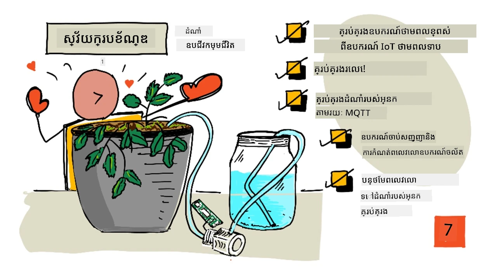
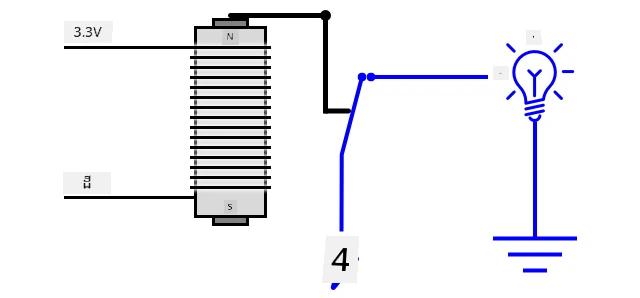
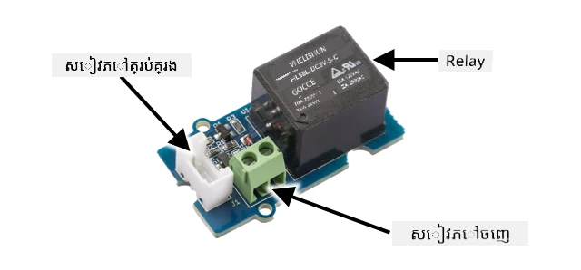
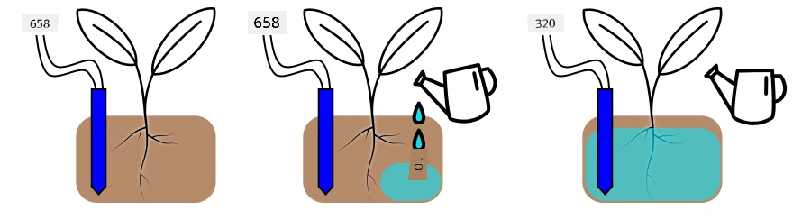
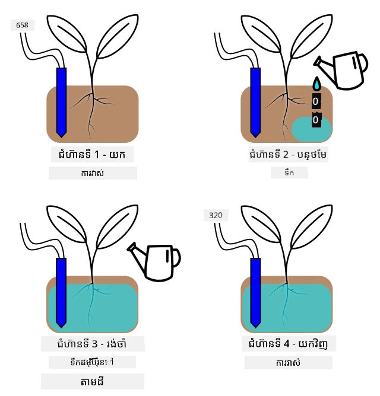

# ការជួរទឹកឪ្យដំណាំដោយស្វ័យប្រវត្តិ



> សេកឃុនត្រូវបានគុណ Nitya Narasimhan ដែល [Nitya Narasimhan](https://github.com/nitya) បង្កើត។ ចុចលើរូបភាពសម្រាប់មើលទំហំធំជាងនេះ។

មេរៀននេះត្រូវបានបង្រៀនជាផ្នែកមួយនៃ [គម្រោង IoT សម្រាប់អ្នកចាប់ផ្តើម ផ្នែកទី 2 - ស៊េរីកសិក្សាអំពីកសិកម្មឌីជីថល](https://youtube.com/playlist?list=PLmsFUfdnGr3yCutmcVg6eAUEfsGiFXgcx) ពី [Microsoft Reactor](https://developer.microsoft.com/reactor/?WT.mc_id=academic-17441-jabenn)។

[](https://youtu.be/g9FfZwv9R58)

## ការប្រលងមុនមេរៀន

[ការប្រលងមុនមេរៀន](https://black-meadow-040d15503.1.azurestaticapps.net/quiz/13)

## ការណាត់ដឹក

នៅក្នុងមេរៀនមុន អ្នកបានរៀនពីរបៀបតាមដានសំណើមដី។ ក្នុងមេរៀននេះ អ្នកនឹងរៀនរបៀបតៀមបង្កើតអង្គធាតុសំខាន់ៗនៃប្រព័ន្ធជួរទឹកដោយស្វ័យប្រវត្តិដែលឆ្លើយតបទៅនឹងសំណើមដី។ អ្នកនឹងរៀនអំពីពេលវេលា - របៀបដែលឧបករណ៍សិនស័រអាចត្រូវការពេលវេលាដើម្បីឆ្លើយតបនឹងការផ្លាស់ប្តូរ និងរបៀបដែលឧបករណ៍អេកទ័រអាចចំណាយពេលវេលាដើម្បីផ្លាស់ប្តូរភាពល្អបង់ដែលត្រូវបានវាស់ដោយឧបករណ៍សិនស័រ។

មេរៀននេះយើងនឹងគ្របដណ្តប់៖

* [គ្រប់គ្រងឧបករណ៍ថាមពលខ្ពស់​ពីឧបករណ៍ IoT ថាមពលទាប](#គ្រប់គ្រងឧបករណ៍ថាមពលខ្ពស់​ពីឧបករណ៍-iot-ថាមពលទាប)
* [គ្រប់គ្រងរេលេ](#គ្រប់គ្រងរេលេ)
* [គ្រប់គ្រងដំណាំរបស់អ្នកតាមរយៈ MQTT](#គ្រប់គ្រងរេលេ)
* [ពេលវេលាក្នុងឧបករណ៍សិនស័រនិងឧបករណ៍អេកទ័រ](#ពេលវេលាឧបករណ៍សិនស័រនិងឧបករណ៍អេកទ័រ)
* [បន្ថែមពេលវេលាទៅម៉ាស៊ីនបម្រើគ្រប់គ្រងដំណាំរបស់អ្នក](#បន្ថែមពេលវេលាជាមួយម៉ាស៊ីនបើកល្បឿនរុក្ខជាតិរបស់អ្នក)

## គ្រប់គ្រងឧបករណ៍ថាមពលខ្ពស់​ពីឧបករណ៍ IoT ថាមពលទាប

ឧបករណ៍ IoT ប្រើថាមពលតង់ស្យុងទាប។ ពេលនេះគ្រប់គ្រងគ្រឿងចក្រនិងឧបករណ៍អេកទ័រថាមពលទាបដូចជា LED បានល្អ តែថាមពលនេះទាបពេកសម្រាប់ការគ្រប់គ្រងឧបករណ៍ធំៗ ដូចជាបង្អែកទឹកដែលប្រើសម្រាប់ការរុងរឿង។ បង្អែកទឹកតូចៗដែលអ្នកអាចប្រើសម្រាប់ដំណាំក្នុងផ្ទះគឺស្រូបចរន្តច្រើនពេកសម្រាប់ឧបករណ៍រៀបចំ IoT ហើយវានឹងបំផ្លាញក្តារប្រមូលទិន្នន័យ។

> 🎓 ចរន្ត ដែលវាស់ជាម៉ាស៊ីន(Amp/Amps, A) គឺជាចំនួនអគ្គិសនីដែលឆ្លងកាត់ស៊ីរប៉ូត។ តង់ស្យុងផ្តល់ឲ្យផ្ទះឱ និង ចរន្តគឺចំនួនដែលត្រូវបានផ្តល់កម្មង់។ អ្នកអាចអានបន្ថែមអំពីចរន្តនៅលើ [ទំព័រចរន្តអគ្គិសនីនៅវីគីភីឌា](https://wikipedia.org/wiki/Electric_current)។

ដំណោះស្រាយសម្រាប់នេះគឺចងបង្អែកទឹកទៅចំហៀងថាមពលខាងក្រៅ ហើយប្រើឧបករណ៍អេកទ័រដើម្បីបើកបង្អែកទឹក ដូចជាការបិទបើកភ្លើង។ វាត្រូវការថាមពលតិចមួយ (ជារាងថាមពលក្នុងរាងកាយរបស់អ្នក) ដើម្បីបញ្ជូនម្រាមដៃឲ្យបិទបើកបត់ និងភ្ជាប់ភ្លើងជាមួយអគ្គិសនីហ្គោល 110v/240v។


> 🎓 [អគ្គិសនីហ្គោល](https://wikipedia.org/wiki/Mains_electricity) ជាអគ្គិសនីដែលផ្តល់ទៅផ្ទះនិងអាជីវកម្មតាមរយៈហាគ្រីជាតិច្រើននៅក្នុងពិភពលោក។

✅ ឧបករណ៍ IoT ទូទៅអាចផ្តល់ 3.3V ឬ 5V ដែលមិនលើស 1 អាំ (1A)។ ប្រៀបធៀបទៅនឹងអគ្គិសនីហ្គោលដែលជាទូទៅមានតង់ស្យុង 230V (120V នៅអាមេរិកខាងជើង និង 100V នៅជប៉ុន) និងអាចផ្តល់ថាមពលសម្រាប់ឧបករណ៍ដែលស្រូបចរន្ត 30A។

មានឧបករណ៍អេកទ័រជាច្រើនដែលអាចធ្វើបែបនេះ រួមបញ្ចូលការទ្រទ្រង់កញ្ចក់ក៏ដូចជាឧបករណ៍ធ្វើម៉ាស៊ីនមេកានិចដែលអ្នកអាចភ្ជាប់ទៅកាន់ការបិទបើកដែលមានសញ្ញាដូចដៃបត់។ ដែលពេញនិយមបំផុតគឺរេលេ។

### រេលេ

រេលេគឺជាប៊ូតុងម៉ាស៊ីនមេកានិចដែលបម្លែងសញ្ញាអគ្គិសនីទៅចលនាមេកានិចដែលបើកប៊ូតុង។ ភាគមូលដ្ឋាននៃរេលេគឺម៉ាញេទិចអគ្គិសនី។

> 🎓 [ម៉ាញេទិចអគ្គិសនី](https://wikipedia.org/wiki/Electromagnet) ជាម៉ាញេទិចដែលបង្កើតដោយការផ្លាស់ប្តូរអគ្គិសនីតាមរ៉ូត័រមួយ។ ពេលដែលអគ្គិសនីបើក រ៉ូត័រនេះមានម៉ាញេទិច។ ពេលអគ្គិសនីបិទ រ៉ូត័រមានទំនងខូចម៉ាញេទិច។



នៅក្នុងរេលេ វដ្តគ្រប់គ្រងផ្តល់ថាមពលទៅម៉ាញេទិចអគ្គិសនី។ ពេលម៉ាញេទិចអគ្គិសនីបើក វាសម្លាប់ទំពារដែលបើកប៊ូតុង បិទភាគីយោលពីរកន្លែងនិងបញ្ចប់សៀរស៊ើបអូតប៊ូតុង។


ពេលតួរគ្រប់គ្រងត្រូវបិទ ម៉ាញេទិចអគ្គិសនីបិទ បញ្ឈប់ទំពារនិងបើកការតភ្ជាប់ បិទអូតប៊ូតុង។ រេលេគឺជាឧបករណ៍អេកទ័រឌីជីថល - សញ្ញាខ្ពស់ទៅរេលេជួយបើកវា សញ្ញាទាបបិទវា។

អូតប៊ូតុងអាចប្រើសម្រាប់ផ្តល់ថាមពលឧបករណ៍បន្ថែម ដូចជាប្រព័ន្ធបង្អែកទឹក។ ឧបករណ៍ IoT អាចបើករេលេ បញ្ចប់អូតប៊ូតុងដែលផ្តល់ថាមពលប្រព័ន្ធបង្អែកទឹក ហើយដំណាំទទួលទឹក។ បន្ទាប់មកឧបករណ៍ IoT អាចបិទរេលេ បិទថាមពលប្រព័ន្ធបង្អែកទឹក បិទទឹក។


ក្នុងវីដេអូមើលខាងលើ រេលេត្រូវបានបើក។ LED នៅលើរេលេភ្លឺសំរាប់បង្ហាញថាវាបើក (សូម្បីមានក្តាររេលេមួយចំនួនមាន LED សំរាប់បង្ហាញរេលេបើកឬបិទ) ហើយថាមពលទៅបង្អែកទឹក បើកបង្អែកទឹក និងបញ្ចេញទឹកទៅដំណាំ។

> 💁 រេលេក៏អាចប្រើសម្រាប់ប្តូរវិញទៅវិញរវាងសៀរស៊ើបអូតប៊ូតុងពីរដើម្បីមិនបើកឬបិទតែមួយ។ ពេលទំពារផ្លាស់ប្តូរវា ផ្លាស់ប្តូរប៊ូតុងពីការបញ្ចប់សៀរស៊ើបអតប៊ូតុងមួយទៅចប់សៀរស៊ើបអតប៊ូតុងផ្សេងទៀត ដែលភាគច្រើនមានការតភ្ជាប់ថាមពលរួម ឬការតភ្ជាប់ដីរួម។

✅ ស្វែងរកព័ត៌មានបន្ថែម៖ មានប្រភេទរេលេជាច្រើន មានភាពខុសគ្នាដូចជាវិធីដែលសៀរស៊ើបគ្រប់គ្រងរេលេបើក ឬបិទ ព្រមទាំងមានសៀរស៊ើបអតប៊ូតុងច្រើន។ ស្វែងរកព័ត៌មានអំពីប្រភេទរេលេទាំងនោះ។

ពេលទំពារផ្លាស់ប្តូរ អ្នកសូម្បីតែអាចស្ដាប់ឮសំឡេង "ចាក់" ដែលមានពិការណ៍ច្បាស់លាស់។

> 💁 រេលេអាចភ្ជាប់ជាមួយក្បាលខ្សែដែលពេលភ្ជាប់នេះ វានឹងបំបែកថាមពលទៅរេលេ បិទរេលេ ហើយបញ្ចូនថាមពលទៅរេលេបើកឡើងវិញ ហើយបន្តបែបនេះវិញ។ នេះបណ្តាលឱ្យរេលេចាក់យ៉ាងលឿន និងបង្កើតសំឡេងហូបប្រដាប់ពីត្រាស់ៗមើលបាន។ នេះជាវិធីដែលវ៉ាស៊ឺរប៊ែរ ដែលប្រើក្នុងច្រកទ្វារអគ្គិសនីល្បីបំផុត។

### ថាមពលរេលេ

ម៉ាញេទិចអគ្គិសនីមិនចាំបាច់ត្រូវការថាមពលច្រើនដើម្បីបើកនិងបញ្ចេញទំពារ វាអាចត្រូវបានគ្រប់គ្រងដោយការចេញថាមពល 3.3V ឬ 5V ពីឧបករណ៍អភិវឌ្ឍន៍ IoT។ អូតប៊ូតុងអាចពន្លឿនថាមពលច្រើនជាងនេះ ទាក់ទងទៅនឹងរេលេ រួមបញ្ចូលថាមពលម៉ាញេទិចឬថាមពលខ្ពស់សម្រាប់គេហដ្ឋានឧស្សាហកម្ម។ ដូច្នេះឧបករណ៍អភិវឌ្ឍន៍ IoT អាចគ្រប់គ្រងប្រព័ន្ធបង្អែកទឹកពីបង្អែកទឹកតូចមួយសម្រាប់ដំណាំតែមួយ ដល់ប្រព័ន្ធឧស្សាហកម្មធំសម្រាប់កសិដ្ឋានពាណិជ្ជកម្មទាំងមូល។



រូបភាពនៅលើបង្ហាញរេលេ Grove។ សៀរស៊ើបគ្រប់គ្រងភ្ជាប់ឧបករណ៍ IoT ហើយបើក ឬបិទរេលេដោយ​ប្រើ 3.3V ឬ 5V។ អូតប៊ូតុងមានផ្នែកទទួលសោ, មួយណាមួយអាចជាថាមពល ឬដី។ អូតប៊ូតុងអាចទប់ទល់បានដល់ 250V នៅ 10A គ្រប់គ្រាន់សម្រាប់ឧបករណ៍ដែលប្រើថាមពលម៉ាញេទិច។ អ្នកអាចរកបានរេលេដែលអាចដោះសោបានថាមពលខ្ពស់ជាងនេះ។


រូបភាពខាងលើនេះបង្ហាញថាមពលផ្គត់ផ្គង់ទៅបង្អែកទឹកតាមរយៈរេលេ។ មានខ្សែក្រហមភ្ជាប់ពីផ្នែក +5V នៃថង់ថាមពល USB ទៅផ្នែកមួយនៃអូតប៊ូតុងរេលេ ហើយខ្សែក្រហមមួយទៀតភ្ជាប់ពីផ្នែកពីរនៃអូតប៊ូតុងទៅបង្អែកទឹក។ ខ្សែក្រហមខ្មៅភ្ជាប់បង្អែកទឹកទៅដីនៃថង់ថាមពល USB។ ពេលរេលេបើក វាបញ្ចប់សៀរស៊ើប បញ្ជូន 5V ទៅបង្អែកទឹក បើកបង្អែកទឹក។

## គ្រប់គ្រងរេលេ

អ្នកអាចគ្រប់គ្រងរេលេពីឧបករណ៍អភិវឌ្ឍន៍ IoT របស់អ្នក។

### បេសកកម្ម - គ្រប់គ្រងរេលេ

ធ្វើការតាមដានមេរៀនពាក់ព័ន្ធ ដើម្បីគ្រប់គ្រងរេលេដោយប្រើឧបករណ៍ IoT របស់អ្នក៖

* [Arduino - Wio Terminal](wio-terminal-relay.md)
* [កុំព្យួទ័រឋានមួយ - Raspberry Pi](pi-relay.md)
* [កុំព្យួទ័រឋានមួយ - ឧបករណ៍ Virtual](virtual-device-relay.md)

## គ្រប់គ្រងដំណាំរបស់អ្នកតាមរយៈ MQTT

រហូតមកដល់បច្ចុប្បន្ន រេលេរបស់អ្នកត្រូវបានគ្រប់គ្រងដោយឧបករណ៍ IoT តាមការវាស់សំណើមដីតែមួយ។ នៅក្នុងប្រព័ន្ធបង្អែកទឹកពាណិជ្ជកម្ម យន្តការគ្រប់គ្រងនឹងត្រូវមានមជ្ឈមណ្ឌល ដែលអនុញ្ញាតឲ្យវាគ្រប់គ្រងការសម្រេចចិត្តក្នុងការជួរទឹកជាមួយទិន្នន័យពីឧបករណ៍សិនស័រច្រើន ហើយអនុញ្ញាតឲ្យកំណត់តម្លៃណាមួយកែប្រែលើកទីមួយតែម្ដង។ ដើម្បីធ្វើការតម្រៀបនេះ អ្នកអាចគ្រប់គ្រងរេលេតាម MQTT។

### បេសកកម្ម - គ្រប់គ្រងរេលេតាម MQTT

1. បន្ថែមបណ្ណាល័យ MQTT / កញ្ចប់ pip និងកូដដែលពាក់ព័ន្ធទៅក្នុងគម្រោង `soil-moisture-sensor` របស់អ្នក ដើម្បីភ្ជាប់ទៅ MQTT។ បង្កើតឈ្មោះ client ID ជា `soilmoisturesensor_client` បូកបន្ថែមមុនដោយអត្តសញ្ញាណរបស់អ្នក។

    > ⚠️ អ្នកអាចយោងទៅ [ការណែនាំសម្រាប់ភ្ជាប់ទៅ MQTT ក្នុងគម្រោង ១ មេរៀន ៤ ប្រសិនបើត្រូវការ](../../../1-getting-started/lessons/4-connect-internet/README.md#connect-your-iot-device-to-mqtt)។

1. បន្ថែមកូដឧបករណ៍ដែលពាក់ព័ន្ធដើម្បីផ្ញើព័ត៌មានទីបមូលផ្តល់ពីសំណើមដី។ សម្រាប់សារតែមូល, បង្កើតឈ្មោះវាល `soil_moisture`។

    > ⚠️ អ្នកអាចយោងទៅ [ការណែនាំសម្រាប់ផ្ញើព័ត៌មានទីបមូលទៅ MQTT ក្នុងគម្រោង ១ មេរៀន ៤ ប្រសិនបើត្រូវការ](../../../1-getting-started/lessons/4-connect-internet/README.md#send-telemetry-from-your-iot-device)។

1. បង្កើតកូដម៉ាស៊ីនបម្រើមួយនៅភាគីមូលដ្ឋានដើម្បីជាវទំនាក់ទំនងទីបមូល និងផ្ញើការបញ្ជាដើម្បីគ្រប់គ្រងរេលេនៅក្នុងថតឯកសារឈ្មោះ `soil-moisture-sensor-server`។ បង្កើតឈ្មោះវាលក្នុងសារបញ្ជា​ជា `relay_on` ហើយកំណត់ client ID ជា `soilmoisturesensor_server` បូកបន្ថែមមុនដោយអត្តសញ្ញាណរបស់អ្នក។ រក្សារចំនុចដូចគ្នាជាមួយកូដម៉ាស៊ីនបម្រើដែលអ្នកបានសរសេរក្នុងគម្រោង ១ មេរៀន ៤ ព្រោះអ្នកនឹងបន្ថែមកូដនេះក្រោយមកក្នុងមេរៀននេះ។

    > ⚠️ អ្នកអាចយោងទៅ [ការណែនាំសម្រាប់សរសេរកូដម៉ាស៊ីនបម្រើដើម្បីទទួលព័ត៌មានទីបមូល](../../../1-getting-started/lessons/4-connect-internet/README.md#write-the-server-code) និង [ការផ្ញើបញ្ជាទៅអ្នកផ្គត់ផ្គង់ MQTT](../../../1-getting-started/lessons/4-connect-internet/README.md#send-commands-to-the-mqtt-broker) ក្នុងគម្រោង ១ មេរៀន ៤ ប្រសិនបើត្រូវការ។

1. បន្ថែមកូដឧបករណ៍ដែលពាក់ព័ន្ធក្នុងការគ្រប់គ្រងរេលេពីបញ្ជាដែលទទួលបាន ដោយប្រើវាល `relay_on` ពីសារបញ្ជា។ ផ្ញើ true សម្រាប់ `relay_on` ប្រសិនបើ `soil_moisture`​ ធំជាង 450 ផ្ទុះពីនេះផ្ញើ false ដូចគ្នានឹងយុទ្ធសាស្ត្រដែលអ្នកបានបន្ថែមសម្រាប់ឧបករណ៍ IoT មុននេះ។

    > ⚠️ អ្នកអាចយោងទៅ [ការណែនាំសម្រាប់ការឆ្លើយតបបញ្ជា MQTT នៅគម្រោង ១ មេរៀន ៤ ប្រសិនបើត្រូវការ](../../../1-getting-started/lessons/4-connect-internet/README.md#handle-commands-on-the-iot-device)។

> 💁 អ្នកអាចរកឃើញកូដនេះនៅក្នុងថត [code-mqtt](../../../../../2-farm/lessons/3-automated-plant-watering/code-mqtt)។

ធ្វើឱ្យប្រាកដថាកូដដំណើរការលើឧបករណ៍របស់អ្នក និងម៉ាស៊ីនបម្រើមូលដ្ឋាន ហើយសាកល្បងដោយផ្លាស់ប្ដូរសំណើមដី ជាផ្លាស់ប្ដូរតម្លៃដែលផ្ញើដោយឧបករណ៍សិនស័រវីរៈឬផ្លាស់ប្ដូរសំណើមដីដោយបន្ថែមទឹក ឬដកឧបករណ៍សិនស័រចេញពីដី។

## ពេលវេលាឧបករណ៍សិនស័រនិងឧបករណ៍អេកទ័រ

នៅក្នុងមេរៀន ៣ អ្នកបានកសាងភ្លែត្រស្រមោល - LED ដែលបើកភ្លឺវិលតែមួយភ្លែត្រពន្លឺទាបត្រូវបានស្គាល់ដោយឧបករណ៍សិនស័រពន្លឺ។ ឧបករណ៍សិនស័រពន្លឺបានរកឃើញការផ្លាស់ប្តូរភ្លឺភ្លើងភ្លាមៗ ហើយឧបករណ៍អាចឆ្លើយតបបានយ៉ាងរហ័ស ដែលមានដែនកំណត់តែប្រវែងពេលនៃការពន្យារពេលក្នុងមុខងារ `loop` ឬក្នុងវដ្ត `while True:`។ ជាអ្នកអភិវឌ្ឍន៍ IoT អ្នកមិនអាចគិតទុកលើវដ្តបាតតាមFeedback លឿនបែបនេះជានិច្ចទេ។

### ពេលវេលាសម្រាប់សំណើមដី

ប្រសិនបើអ្នកបានធ្វើមេរៀនមុនស្តីពីសំណើមដីដោយប្រើឧបករណ៍សិនស័រពិត អ្នកនឹងមើលឃើញថាការវាស់សំណើមដីចំណាយពេលប៉ុន្មានវិនាទីដើម្បីធ្លាក់ក្រោមបន្ទាប់ពីអ្នកជួរទឹកដំណាំរបស់អ្នក។ វាមិនមែនត្រូវសិនស័រពេក ឬយឺតទេ តែគឺត្រូវការពេលវេលាឲ្យទឹករំលាយតាមដី។

> 💁 បើអ្នកជួរទឹកនៅជិតឧបករណ៍សិនស័រ អ្នកអាចបានឃើញការវាស់ចុះយ៉ាងឆាប់រហ័ស ហើយបន្ទាប់មកឡើងវិញ - នេះបណ្តាលមកពីទឹកនៅជិតសិនស័របង្កើតចែកចាយនៅក្នុងដី ដែលបន្ថយសំណើមដែលឧបករណ៍សិនស័รวាស់បាន។



ក្នុងខ្សែផែនភាពខាងលើ វាស់សំណើមដីបង្ហាញចំនួន 658។ ដំណាំត្រូវបានជួរទឹក ប៉ុន្តែតម្លៃនេះមិនផ្លាស់ប្តូរជាបន្ទាន់ទេ ព្រោះទឹកមិនទាន់ដល់ឧបករណ៍សិនស័រ។ ការជួរទឹកអាចបញ្ចប់ពីមុនពេលទឹកទទួលទៅឧបករណ៍សិនស័រនិងតម្លៃធ្លាក់ចុះដើម្បីបង្ហាញសំណើមថ្មី។

បើអ្នកសរសេរកូដដើម្បីគ្រប់គ្រងប្រព័ន្ធបង្អែកទឹកតាមរេលេដោយផ្អែកលើកម្រិតសំណើមដី អ្នកនឹងត្រូវគិតរយៈពេលពន្យល់នេះ និងបង្កើតម៉ាស៊ីន IoT ដោយមានពេលវេលាឆ្លើយតបផ្សេងគ្នា។

✅ សូមចំណាយពេលគិតពីរបៀបដែលអាចធ្វើបាន។ 

### គ្រប់គ្រងពេលវេលាឧបករណ៍សិនស័រនិងឧបករណ៍អេកទ័រ
សូមស្រមៃថាអ្នកត្រូវបានចាត់តាំងឲ្យសាងសង់ប្រព័ន្ធជីរដ្ឋានសម្រាប់ដែនធ្លីមួយ។ ដោយផ្អែកលើប្រភេទដី កម្រិតសំណើមដីដ៏ល្អបំផុតសម្រាប់រុក្ខជាតិដែលបានដាំគឺផ្គូរផ្គង់ជាមួយនឹងការវាស់ថាមពលអាណាឡอก ៤០០-៤៥០។

អ្នកអាចកម្មវិធីឧបករណ៍ដូចដដូចបំពង់ពន្លឺយប់ - រាល់ពេលដែលឧបករណ៍សិនស័រអានលើស ៤៥០ សូមបើករេលេដើម្បីបើកម៉ាស៊ីនបូមទឹក។ ក្តីបញ្ហានេះគឺទឹកត្រូវការពេលវេលាដើម្បីឈានដល់ពីម៉ាស៊ីនបូម តាមល្បឿនជាចន្លោះលើដីទៅឧបករណ៍សិនស័រ។ ឧបករណ៍សិនស័រនឹងបិទទឹកនៅពេលវាគិតថាបានឃើញកម្រិត ៤៥០ ប៉ុន្តែមក្រិតទឹកនោះនឹងត្រូវបន្តធ្លាក់ចុះ ដោយសារទឹកដែលបានបូមនៅតែងបន្តស្រូបឡើងនឹងដី។ លទ្ធផលចុងក្រោយគឺការប្រើប្រាស់ទឹកចោល និងហានិភ័យនៃការខូចខាតឫសភាគ។

✅ គិតចាំ - ទឹកច្រើនពេកអាចធ្វើអោយរុក្ខជាតិខូចដូចជាទឹកតិចពេកផងដែរ ហើយវាយសម័យធនធានមិនសូវមានតម្លៃ។

ដំណោះស្រាយល្អជាងគេគឺត្រូវយល់ថាមានការពន្យារពេលរវាងការបើកឧបករណ៍បញ្ជាដែលផ្លាស់ប្តូរនិងលទ្ធផលដែលឧបករណ៍សិនស័រត្រូវបានអាន។ នេះមានន័យថាគ្រប់ពេលដែលឧបករណ៍សិនស័រត្រូវរង់ចាំរយៈពេលមួយមុនពេលវានឹងវាស់តម្លៃម្ដងទៀត ប៉ុន្តែកម្មវិធីបញ្ជាសកម្មភាពត្រូវតែបិទរយៈពេលមួយមុនពេលការវាស់បន្ទាប់គឺត្រូវបានធ្វើឡើង។

តើរេលេត្រូវបើករយៈពេលប៉ុន្មានម្តងមួយ? វាល្អជាងក្នុងការប្រុងប្រយ័ត្ន និងបើករេលេរយៈពេលខ្លី ហើយរង់ចាំឲ្យទឹកធ្លាយអាម៉ាត់រួចហើយបន្ទាប់មកពិនិត្យវិញកម្រិតសំណើមទឹក។ បន្ទាប់មក អ្នកអាចបើកម្ដងទៀតសម្រាប់បន្ថែមទឹកបាន តែក្នុងពេលនេះមិនអាចចាប់ទឹកចេញពីដីបានទេ។

> 💁 ការគ្រប់គ្រងពេលវេលាប្រភេទនេះមានលក្ខណៈពិសេសទៅនឹងឧបករណ៍ IoT ដែលអ្នកកំពុងសាងសង់ លក្ខណៈដែលអ្នកវាស់ និងឧបករណ៍សិនស័រ និងឧបករណ៍បញ្ជាប្រើ។


ឧទាហរណ៍ ខ្ញុំមានរុក្ខជាតិស្ទ្រប៉ែរៀរបស់ខ្ញុំមានឧបករណ៍សិនស័រសំណើមដី និងម៉ាស៊ីនបូមដែលត្រូវគ្រប់គ្រងដោយរេលេ។ ខ្ញុំបានមើលឃើញថា ពេលដែលខ្ញុំបន្ថែមទឹក វាត្រូវរយៈពេលប្រហែល ២០ វិនាទីសម្រាប់ការវាស់សំណើមដីឲ្យមានស្ថិរភាព។ នោះមានន័យថាខ្ញុំត្រូវបិទរេលេហើយរង់ចាំ ២០ វិនាទី មុនពេលពិនិត្យកម្រិតសំណើម។ ខ្ញុំចង់មានទឹកតិចជាងទឹកច្រើនពេក - ខ្ញុំអាចបើកម៉ាស៊ីនបូមម្ដងទៀតបានជានិច្ច ប៉ុន្តែខ្ញុំមិនអាចយកទឹកចេញពីរុក្ខជាតិនោះបានទេ។



នេះមានន័យថាដំណើរការល្អបំផុតគឺជាចំណុចជារបស់ប្រព័ន្ធសុវត្ថិភាព៖

* បើកម៉ាស៊ីនបូមរយៈពេល ៥ វិនាទី
* រងចាំ ២០ វិនាទី
* ពិនិត្យសំណើមដី
* ប្រសិនបើកម្រិតនៅតែខ្ពស់ជាងអ្វីដែលខ្ញុំត្រូវការ សូមធ្វើម្តងទៀតដូចខាងលើ

៥ វិនាទីអាចយូរពេកសម្រាប់ម៉ាស៊ីនបូម ជាពិសេសបើកម្រិតសំណើមញឹកញាប់តែខ្ពស់តិចតួចជាងកម្រិតដែលត្រូវការ។ វិធីល្អបំផុតដើម្បីដឹងថាត្រូវប្រើពេលវេលាប៉ុន្មានគឺសាកល្បង ហើយកែតម្រូវនៅពេលដែលអ្នកមានទិន្នន័យ sensor ជាមួយនឹងវដ្តប្រតិកម្មមិនប្រែប្រួល។ នេះអាចនាំឲ្យមានពេលវេលាកាន់តែលម្អិត ដូចជា បើកម៉ាស៊ីនបូមរយៈពេល ១ វិនាទីសម្រាប់រាល់ ១០០ ខ្ពស់ជាងកម្រិតសំណើមដីដែលត្រូវការ ជំនួស ៥ វិនាទីថេរ។

✅ ស្រាវជ្រាវបន្ត៖ មានបញ្ហាតេលស្សិ្តពេលវេលាផ្សេងទៀតទេ? តើអាចបូមទឹកនៅពេលណាមួយក៏បានពេលសំណើមដីទាប ឬមានពេលវេលា ព្រឹក និងល្ងាច ដែលល្អ ឬអាក្រក់សម្រាប់បូមទឹកឬទេ?

> 💁 ការព្យាករណ៍អាកាសធាតុអាចត្រូវបានគិតទៅនិងគ្រប់គ្រងប្រព័ន្ធបូមទឹកស្វ័យប្រវត្តិសម្រាប់កសិដ្ឋានក្រៅផ្ទះ។ ប្រសិនបើមានការរំពឹងទុកភ្លៀង បូមទឹកអាចត្រូវបានផ្អាករហូតដល់ភ្លៀងឈប់។ ពេលនោះដីអាចមានសំណើមគ្រប់គ្រាន់ហើយមិនចាំបូមទឹកទៀតទេ ល្អជាងការប្រើប្រាស់ទឹកអោយចោលយ៉ាងក្រៃលែងដោយបូមទឹកមុនភ្លៀង។

## បន្ថែមពេលវេលាជាមួយម៉ាស៊ីនបើកល្បឿនរុក្ខជាតិរបស់អ្នក

កូដម៉ាស៊ីនបម្រុងអាចត្រូវបានកែប្រែដើម្បីបន្ថែមការគ្រប់គ្រងពេលវេលាជុំវិញរយៈពេលប្រតិបត្តិការបូមទឹក និងការរង់ចាំឲ្យសំណើមដីផ្លាស់ប្តូរ។ ហេតុអាកប្បកិរិយារបស់ម៉ាស៊ីនបើកល្បឿនដែលគ្រប់គ្រងពេលវេលារបស់រេលេគឺ៖

1. ទទួលបានសារ telemetry
1. ពិនិត្យកម្រិតសំណើមដី
1. ប្រសិនបើវាត្រឹមត្រូវ មិនចាំបាច់ធ្វើអ្វីទាំងអស់។ ប្រសិនបើការវាស់លើស (មានន័យថាសំណើមដីទាបពេក) នោះ:
    1. ផ្ញើសំណើបើករេលេ
    1. រងចាំ ៥ វិនាទី
    1. ផ្ញើសំណើបិទរេលេ
    1. រងចាំ ២០ វិនាទីសម្រាប់សំណើមដីស្ថិតស្ថេរ

វដ្តបូមទឹក ពីពេលទទួលសារ telemetry ទៅពេលរងចាំសំណើមដីផ្លាស់ប្តូរកាន់តែមានរយៈពេលប្រហែល ២៥ វិនាទី។ យើងផ្ញើទិន្នន័យសំណើមដីរៀងរាល់ ១០ វិនាទី ដូច្នេះមានការបា្រស់គ្នា ដែលមានសារមួយត្រូវបានទទួលខណៈដែលម៉ាស៊ីនបម្រុងកំពុងរង់ចាំសំណើមដីស្ថិតស្ថេរ ដែលអាចចាប់ផ្តើមរយៈពេលបូមទឹកម្តុំនៃបន្ទាប់។

មានជម្រើសពីរដើម្បីអាចដោះស្រាយបញ្ហានេះ៖

* ផ្លាស់ប្ដូរកូដឧបករណ៍ IoT ដើម្បីផ្ញើតែសារ telemetry រៀងរាល់មួយនាទី ដូច្នេះវដ្តបូមទឹកនឹងបានបញ្ចប់មុនសារបន្ទាប់
* មិនដើម្បីរងចាំទទួលសារពេលវដ្តបូមទឹកកំពុងដំណើរការ

ជម្រើសដំបូងមិនមែនជាដំណោះស្រាយល្អសម្រាប់កសិដ្ឋានធំទេ។ កសិករអាចចង់ប្រមូលកម្រិតសំណើមដីក្នុងអំឡុងពេលដែលដីកំពុងទទួលទឹកសម្រាប់ការវិភាគក្រោយ សម្រាប់ដៃគូចាំបាច់ដើម្បីចាប់ផ្តើមបូមទឹកនៅតំបន់ផ្សេងៗនៅលើដែនដី។ ជម្រើសទីពីរល្អជាង - កូដគ្រាន់តែមិនព្យាយាមមើលសារនោះ ខណៈដែលវដ្តបូមទឹកកំពុងដំណើរការ ប៉ុន្តែសារនោះនៅតែមានសម្រាប់សេវាកម្មផ្សេងៗដែលអាចចូលរួមអាន។

> 💁 ទិន្នន័យ IoT មិនត្រូវបានផ្ញើពីឧបករណ៍តែឧបករណ៍មួយទៅសេវាកម្មមួយទេ ប៉ុន្តែឧបករណ៍ជាច្រើនអាចផ្ញើទិន្នន័យទៅកាន់ broker ហើយសេវាកម្មជាច្រើនអាចស្តាប់ទិន្នន័យពី broker។ ឧទាហរណ៍ សេវាកម្មមួយអាចស្តាប់ទិន្នន័យសំណើមដី ហើយរក្សាទុកក្នុងមូលដ្ឋានទិន្នន័យសម្រាប់វិភាគក្រោយ។ សេវាកម្មមួយផ្សេងទៀតអាចស្តាប់ទិន្នន័យឯងដែរដើម្បីគ្រប់គ្រងប្រព័ន្ធជីរដ្ឋាន។

### ភារកិច្ច - បន្ថែមពេលវេលាជាមួយម៉ាស៊ីនបើកល្បឿនរុក្ខជាតិរបស់អ្នក

ធ្វើបច្ចុប្បន្នភាពកូដម៉ាស៊ីនបម្រុងរបស់អ្នកដើម្បីបើករេលេរយៈពេល ៥ វិនាទី បន្ទាប់មករង់ចាំ ២០ វិនាទី។

1. បើកថត `soil-moisture-sensor-server` ក្នុង VS Code ប្រសិនបើវាមិនបានបើករួចទេ។ ជ្រាបថាបរិស្ថានអមតៈត្រូវបានដំណើរការ។

1. បើកឯកសារ `app.py`

1. បន្ថែមកូដខាងក្រោមទៅឯកសារ `app.py` ខាងក្រោមការនាំចូលដែលមានរួចហើយ៖

    ```python
    import threading
    ```

    វាកំណត់ឲ្យនាំចូល `threading` ពីបណ្ណាល័យ Python ដែល threading អនុញ្ញាតឲ្យ_python_រត់កូដផ្សេងទៀតពេលដែលកំពុងរង់ចាំ។

1. បន្ថែមកូដខាងក្រោមមុនមុខងារ `handle_telemetry` ដែលដំណើរការសារតេឡេមេត្រីដែលទទួលបានចូលពីកូដម៉ាស៊ីនបម្រុង៖

    ```python
    water_time = 5
    wait_time = 20
    ```

    នេះកំណត់រយៈពេលបើករេលេ (`water_time`) និងរយៈពេលដែលត្រូវរងចាំបន្ទាប់មកសម្រាប់ពិនិត្យសំណើមដី (`wait_time`)។

1. ខាងក្រោមកូដនេះ បន្ថែមកូដនេះ៖

    ```python
    def send_relay_command(client, state):
        command = { 'relay_on' : state }
        print("Sending message:", command)
        client.publish(server_command_topic, json.dumps(command))
    ```

    កូដនេះកំណត់មុខងារដែលមានឈ្មោះ `send_relay_command` ដែលផ្ញើសេចក្តីបញ្ជាតាម MQTT ដើម្បីគ្រប់គ្រងរេលេ។ ទិន្នន័យ telemetry ត្រូវបានបង្កើតជា dictionary បន្ទាប់មកបម្លែងទៅជាស្ទ្រីង JSON។ តម្លៃបញ្ជាក់ក្នុង `state` នឹងកំណត់ថារេលេគួរត្រូវបើកឬបិទ។

1. បន្ទាប់ពីមុខងារ `send_relay_command` បន្ថែមកូដខាងក្រោម៖

    ```python
    def control_relay(client):
        print("Unsubscribing from telemetry")
        mqtt_client.unsubscribe(client_telemetry_topic)
    
        send_relay_command(client, True)
        time.sleep(water_time)
        send_relay_command(client, False)
    
        time.sleep(wait_time)
    
        print("Subscribing to telemetry")
        mqtt_client.subscribe(client_telemetry_topic)
    ```

    នេះកំណត់មុខងារដើម្បីគ្រប់គ្រងរេលេដោយផ្អែកលើពេលវេលាដែលត្រូវការ។ វាចាប់ផ្តើមដោយមិនត្រូវស្តាប់សារ telemetry ដើម្បីឲ្យសារសំណើមដីមិនត្រូវបានដំណើរការកាលណាកំពុងបូមទឹក។ បន្ទាប់មកវាផ្ញើសេចក្តីបញ្ជាបើករេលេ។ បន្ទាប់មកវារង់ចាំរយៈពេល `water_time` មុនពេលផ្ញើបញ្ជាបិទរេលេ។ ចុងក្រោយវារង់ចាំរយៈពេល `wait_time` សម្រាប់សំណើមដីមានស្ថិរភាព។ បន្ទាប់មកវាស្តារវិញការស្តាប់សារ telemetry។

1. ផ្លាស់ប្ដូរមុខងារ `handle_telemetry` ដូចខាងក្រោម៖

    ```python
    def handle_telemetry(client, userdata, message):
        payload = json.loads(message.payload.decode())
        print("Message received:", payload)
    
        if payload['soil_moisture'] > 450:
            threading.Thread(target=control_relay, args=(client,)).start()
    ```

    កូដនេះពិនិត្យកម្រិតសំណើមដី។ ប្រសិនបើវាធំជាង ៤៥០ ដីត្រូវការជីរដ្ឋាន ដូច្នេះវាហៅមុខងារ `control_relay`។ មុខងារនេះត្រូវបានដំណើរការលើកម្មវិធីត្រួតពិនិត្យផ្សេងៗ ដំណើរការប្រតិបត្តិការ​នៅ​ផ្ទៃ​ក្រោយ។

1. ត្រួតពិនិត្យឲ្យប្រាកដថាឧបករណ៍ IoT របស់អ្នកកំពុងដំណើរការ បន្ទាប់មកបើកកូដនេះ។ ប្រែសំណើមដីហើយសង្កេតមើលអ្វីដែលកើតឡើងទៅរេលេ - វាគួរត្រូវបើករយៈពេល ៥ វិនាទី បន្ទាប់មកបិទរយៈពេលយ៉ាងហោចណាស់ ២០ វិនាទី ហើយបើកឡើងវិញតែនៅពេលសំណើមដីមិនគ្រប់គ្រាន់ទេ។

    ```output
    (.venv) ➜  soil-moisture-sensor-server ✗ python app.py
    Message received: {'soil_moisture': 457}
    Unsubscribing from telemetry
    Sending message: {'relay_on': True}
    Sending message: {'relay_on': False}
    Subscribing to telemetry
    Message received: {'soil_moisture': 302}
    ```

    វិធីល្អសម្រាប់សាកល្បងប្រព័ន្ធជីរដ្ឋានតាមការស្ទៀងស្ម័គ្រនៅក្នុងផ្ទះគឺប្រើដីស្ងួត បន្ទាប់បួសទឹកដៃផ្ទាល់ខ្លួននៅពេលរេលេបើក ហើយបញ្ឈប់បួសពេលរេលេបិទ។

> 💁 អ្នកអាចរកកូដនេះនៅក្នុងថត [code-timing](../../../../../2-farm/lessons/3-automated-plant-watering/code-timing)។

> 💁 ប្រសិនបើអ្នកចង់ប្រើម៉ាស៊ីនបូមទឹកដើម្បីសាងសង់ប្រព័ន្ធជីរដ្ឋានពិត អ្នកអាចប្រើ [ម៉ាស៊ីនបូមទឹក 6V](https://www.seeedstudio.com/6V-Mini-Water-Pump-p-1945.html) ជាមួយ [ឧបករណ៍ផ្គត់ផ្គង់ថាមពល USB](https://www.adafruit.com/product/3628)។ សូមប្រាកដថាថាមពលទៅម៉ាស៊ីនបូមត្រូវភ្ជាប់តាមរយៈរេលេ។

---

## 🚀 អប្បបរមា

តើអ្នកគិតថា មានឧបករណ៍ IoT ឬឧបករណ៍អគ្គិសនីផ្សេងៗមួយចំនួនដែលមានបញ្ហាស្រដៀងគ្នា ដែលវាត្រូវការពេលវេលាក្នុងការផ្លាស់ប្តូរវិស័យត្រីលក្ខណៈរបស់ឧបករណ៍បញ្ជាដល់ឧបករណ៍សិនស័រឬដោយ? ប្រហែលជាអ្នកមានឧបករណ៍បែបនេះប៉ុន្មាននៅផ្ទះ ឬសាលារៀនរបស់អ្នក។

* តើវាវាស់កម្រិតអ្វី?
* តើវាត្រូវការពេលវេលាប៉ុន្មានសម្រាប់បម្លែងបន្ទាប់ពីមានការប្រើឧបករណ៍បញ្ជា?
* តើវាជាការល្អដែលអោយលក្ខណៈនោះបន្តបម្លែងលើសតម្លៃដែលត្រូវការ?
* តើធ្វើដូចម្តេចដើម្បីយកវាចេញទៅតម្លៃដែលត្រូវការវិញ ប្រសិនបើចាំបាច់?

## សំណួរបន្ទាប់ពេលវគ្គ

[សំណួរបន្ទាប់ពេលវគ្គ](https://black-meadow-040d15503.1.azurestaticapps.net/quiz/14)

## ពិនិត្យនិងរៀនផ្ទាល់ខ្លួន

* អានបន្ថែមអំពីរេលេសំរាប់មើលប្រវត្តិសាស្ត្ររបស់វានៅក្នុងការបម្លែងទូរស័ព្ទនៅលើ [ទំព័រ Wiki រេលេ](https://wikipedia.org/wiki/Relay)។

## ភារកិច្ច

[សាងសង់វដ្តបូមទឹកដែលមានប្រសិទ្ធភាព](assignment.md)

---

<!-- CO-OP TRANSLATOR DISCLAIMER START -->
**និយាមកសារៈ**:  
ឯកសារនេះត្រូវបានបកប្រែដោយប្រើសេវាបកប្រែ AI [Co-op Translator](https://github.com/Azure/co-op-translator)។ ខណៈពេលដែលយើងខិតខំឲ្យបានភាពត្រឹមត្រូវ សូមយល់ថាបកប្រែដោយស្វ័យប្រវត្តិអាចមានកំហុស ឬភាពមិនត្រឹមត្រូវខ្លះ។ ឯកសារដើមដែលមាននៅជាសំដែងភាសាត្រូវបានគេចាត់ទុកជាប្រភពស្របតាមច្បាប់។ សម្រាប់ព័ត៌មានសំខាន់ៗ យោលបកប្រែដោយអ្នកជំនាញមនុស្សគឺគួរតែអនុវត្ត។ យើងមិនទទួលខុសត្រូវចំពោះការយល់ច្រឡំនា ឬការបកស្រាយខុសពីការប្រើប្រាស់បកប្រែនេះនោះទេ។
<!-- CO-OP TRANSLATOR DISCLAIMER END -->