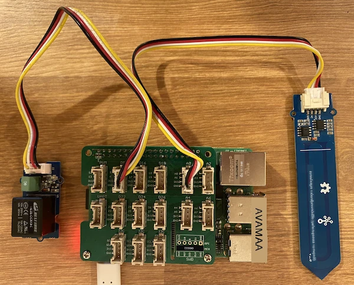

# ការគ្រប់គ្រង relay - Raspberry Pi

នៅក្នុងផ្នែកនេះនៃមេរៀន អ្នកនឹងបន្ថែម relay ទៅកាន់ Raspberry Pi របស់អ្នក בנוסף לֹsensor សំណើមដី ហើយគ្រប់គ្រងវាដោយផ្អែកលើមាតិកាសំណើមដី។

## ឧបករណ៍រឹង

Raspberry Pi ត្រូវការ relay។

relay ដែលអ្នកនឹងប្រើគឺ [Grove relay](https://www.seeedstudio.com/Grove-Relay.html), relay ដែលធម្មតា(មានន័យថាសៀគ្វី output បើក ឬផ្តាច់នៅពេលគ្មានសញ្ញាបញ្ជូនទៅ relay) ដែលអាចដោះស្រាយសៀគ្វី output ដល់ 250V និង 10A។

នេះគឺជាឧបករណ៍អេឡិចត្រូនិចឌីជីថល, ដូច្នេះភ្ជាប់ទៅកាន់ពិន្ទុឌីជីថលលើ Grove Base Hat។

### ភ្ជាប់ relay

Grove relay អាចភ្ជាប់ទៅកាន់ Raspberry Pi ។

#### ប្រធានការងារ

ភ្ជាប់ relay ។


1. បញ្ចូលចុងម្ខាងនៃខ្សែ Grove ទៅក្នុងប្រអប់នៅលើ relay ។ វានឹងបញ្ចូលតែទិសមួយតែប៉ុណ្ណោះ។

1. នៅពេល Raspberry Pi មិនបានបើកថាមពលភ្លើងភ្លើងភ្ជាប់ចុងទៀតនៃខ្សែ Grove ទៅក្នុងប្រអប់ឌីជីថលដែលមានស្លាក **D5** លើ Grove Base hat ដែលភ្ជាប់ទៅ Pi ។ ប្រអប់នេះគឺជាបន្ទាត់ទីពីរពីខាងឆ្វេង នៅជុំវិញប្រអប់ជិតពិន្ទុ GPIO ។ ទុកឲ្យដាក់ sensor សំណើមដីនៅក្នុងប្រអប់ **A0**។



1. បញ្ចូល sensor សំណើមដីចូលក្នុងដី ប្រសិនបើវាមាននៅពីមុនក្នុងមេរៀនមុន។

## កម្មវិធី relay

Raspberry Pi ឥឡូវនេះអាចបានកម្មវិធីដើម្បីប្រើ relay ដែលភ្ជាប់។

### ប្រធានការងារ

កម្មវិធីឧបករណ៍។

1. បើកថាមពល Pi ហើយរង់ចាំវាបើកឡើង

1. បើកគម្រោង `soil-moisture-sensor` ពីមេរៀនចុងក្រោយក្នុង VS Code ប្រសិនបើវាមិនទើបបើកនោះទេ ។ អ្នកនឹងបន្ថែមទៅកាន់គម្រោងនេះ។

1. បន្ថែមកូដខាងក្រោមទៅឯកសារ `app.py` ខាងក្រោមការ import មានរួចហើយ៖

    ```python
    from grove.grove_relay import GroveRelay
    ```

    ពាក្យបញ្ជានេះនាំចូល `GroveRelay` ពីបណ្ណាល័យ Python Grove ដើម្បីអន្តរកម្មជាមួយ Grove relay។

1. បន្ថែមកូដខាងក្រោមក្រោមការប្រកាស `ADC` class ដើម្បីបង្កើតឧបករណ៍ `GroveRelay`:

    ```python
    relay = GroveRelay(5)
    ```

    នេះបង្កើត relay ដោយប្រើ pin **D5**, pin ឌីជីថលដែលអ្នកបានភ្ជាប់ relay ទៅ។

1. ដើម្បីសាកល្បងថា relay ធ្វើការ ត្រូវបន្ថែមដូចខាងក្រោមទៅក្នុងលំនាំ `while True:`:

    ```python
    relay.on()
    time.sleep(.5)
    relay.off()
    ```

    កូដនេះបិទ relay បើករយៈពេល 0.5 វិនាទី បន្ទាប់មកបិទ relay។

1. រត់កម្មវិធី Python ។ relay នឹងបើក និងបិទរៀងរាល់ 10 វិនាទី មានការពន្យារពេលអពាំអណ្តែតក្នុងការបើក និងបិទ ។ អ្នកនឹងឮសំឡេង click relay បើក ហើយបិទ។ អចលនាដែលមានភ្លើង LED លើ Grove board នឹងភ្លឺនៅពេល relay បើក ហើយបិទពេល relay បិទ។

    

## គ្រប់គ្រង relay ពីសំណើមដី

ឥឡូវ relay ធ្វើការ ហើយវាអាចគ្រប់គ្រងដោយបន្ដាមតិឆ្លុះសំណើមដីបាន។

### ប្រធានការងារ

គ្រប់គ្រង relay។

1. លុបបន្ទាត់កូដ 3 តួដែលអ្នកបានបន្ថែមសម្រាប់សាកល្បង relay ។ ជំនួសវាជាមួយកូដខាងក្រោមនេះ៖

    ```python
    if soil_moisture > 450:
        print("Soil Moisture is too low, turning relay on.")
        relay.on()
    else:
        print("Soil Moisture is ok, turning relay off.")
        relay.off()
    ```

    កូដនេះពិនិត្យមើលកម្រិតសំណើមដីពី sensor សំណើមដី ។ ប្រសិនបើវាខ្ពស់ជាង 450 វាបើក relay ហើយបិទវា ពេលវាទាបជាង 450។

    > 💁 សូមចងចាំ sensor សំណើមដីប្រភេទ capacitive អានកម្រិតសំណើមដីថាបើវាទាប វាបង្ហាញថាមានសំណើមច្រើនក្នុងដី ហើយវិញវិញខ្ពស់បង្ហាញថាសំណើមតិច។

1. រត់កម្មវិធី Python ។ អ្នកនឹងឃើញ relay បើកឬបិទអាស្រ័យលើកម្រិតសំណើមដី។ សូមសាកល្បងក្នុងដីស្ងួត បន្ទាប់ដាក់ទឹក។

    ```output
    Soil Moisture: 638
    Soil Moisture is too low, turning relay on.
    Soil Moisture: 452
    Soil Moisture is too low, turning relay on.
    Soil Moisture: 347
    Soil Moisture is ok, turning relay off.
    ```

> 💁 អ្នកអាចរកឃើញកូដនេះនៅក្នុងថត [code-relay/pi](../../../../../2-farm/lessons/3-automated-plant-watering/code-relay/pi) ។

😀 កម្មវិធី sensor សំណើមដីរបស់អ្នកដែលគ្រប់គ្រង relay បានសម្រេចជោគជ័យ!

---

<!-- CO-OP TRANSLATOR DISCLAIMER START -->
**ការបដិសេធ**៖  
ឯកសារនេះត្រូវបានបកប្រែដោយប្រើសេវាកម្មបកប្រែ AI [Co-op Translator](https://github.com/Azure/co-op-translator)។ ខណៈពេលដែលយើងខិតខំរកភាពត្រឹមត្រូវ សូមយល់ពីការតែតំបន់ថាការបកប្រែដោយស្វ័យប្រវត្តិអាចមានកំហុសឬការមិនត្រឹមត្រូវ។ ឯកសារដើមក្នុងភាសាមាតុភូមិនឹងត្រូវបានពិចារណាថាជាផ្លូវការនិងមានសុពលភាព។ សម្រាប់ព័ត៌មានសំខាន់ សូមផ្ដល់អាទិភាពការបកប្រែដោយអ្នកជំនាញមនុស្ស។ យើងមិនទទួលខុសត្រូវចំពោះការយល់ច្រឡំ ឬការបកប្រែខុសពីការប្រើប្រាស់ការបកប្រែនេះឡើយ។
<!-- CO-OP TRANSLATOR DISCLAIMER END -->