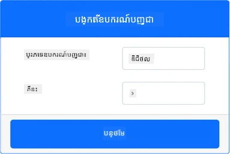
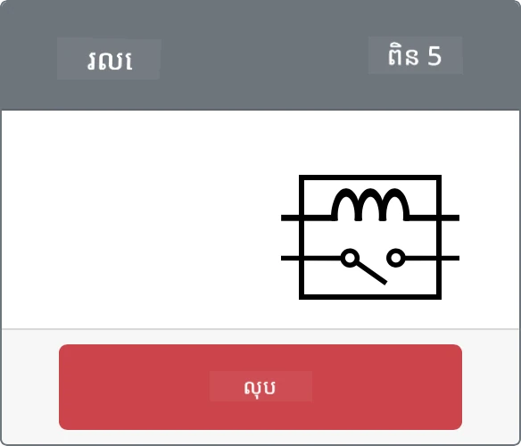

# គ្រប់គ្រង relay - រ៉េហ្វវ័រពីរម៉ៀន IoT

ក្នុងផ្នែកនេះនៃមេរៀន អ្នកនឹងបន្ថែម relay ទៅឧបករណ៍ IoT ពីរម៉ៀនរបស់អ្នក បន្ថែមលើឧបករណ៍វាស់សំណើមដី ហើយគ្រប់គ្រងវាដោយផ្អែកលើកម្រិតសំណើមដី។

## ហาร์ដវ័រទេស

ឧបករណ៍ IoT ពីរម៉ៀននេះនឹងប្រើ relay Grove ចម្លង។ នេះធ្វើឱ្យមន្ទីរបង្រៀននេះនៅដូចគ្នាជាមួយបង្កាន់ដៃ Raspberry Pi ដែលមាន relay Grove រូបសំណាក់។

នៅក្នុងឧបករណ៍ IoT ជាក់ស្តែង relay នឹងជារបារធម្មតា which normally-open relay (មានន័យថាសៀគ្វីចេញគឺបើក ឬផ្ដាច់បើគ្មានសញ្ញាផ្ញើទៅឲ្យ relay)។ Relay លักษณะនេះអាចគ្រប់គ្រងសៀគ្វីចេញរហូតដល់ 250V និង 10A។

### បន្ថែម relay ទៅ CounterFit

ដើម្បីប្រើ relay ពីរម៉ៀន អ្នកត្រូវបន្ថែមវាទៅកម្មវិធី CounterFit

#### ការងារ

បន្ថែម relay ទៅកម្មវិធី CounterFit។

1. បើកគម្រោង `soil-moisture-sensor` ពីមេរៀនមុនក្នុង VS Code ប្រសិនបើវាមិនទាន់បើកទេ។ អ្នកនឹងបន្ថែមទៅគម្រោងនេះ។

1. ប្រាកដថាកម្មវិធី CounterFit ផ្ដល់សេវាកម្មត្រូវដំណើរការ។

1. បង្កើត relay:

    1. នៅក្នុងប្រអប់ *Create actuator* ក្នុងផ្នែក *Actuators* បូកធ្លាក់ប្រអប់ *Actuator type* ហើយជ្រើស *Relay*។

    1. កំណត់ *Pin* ទៅ *5*

    1. ជ្រើសប៊ូតុង **Add** ដើម្បីបង្កើត relay នៅ Pin 5

    

    relay នឹងត្រូវបានបង្កើត និងបង្ហាញក្នុងបញ្ជី actuators។

    

## កម្មវិធី relay

កម្មវិធីឧបករណ៍វាស់សំណើមដីឥឡូវនេះអាចកម្មវិធី relay Grove ពីរម៉ៀនហើយបាន។

### ការងារ

កម្មវិធីឧបករណ៍ពីរម៉ៀន។

1. បើកគម្រោង `soil-moisture-sensor` ពីមេរៀនមុនក្នុង VS Code ប្រសិនបើវាមិនទាន់បើកទេ។ អ្នកនឹងបន្ថែមទៅគម្រោងនេះ។

1. បន្ថែមកូដខាងក្រោមទៅឯកសារ `app.py` ខាងក្រោមការនាំចូលដែលមានស្រាប់៖

    ```python
    from counterfit_shims_grove.grove_relay import GroveRelay
    ```
  
    ពាក្យបញ្ជានេះនាំចូល `GroveRelay` ពីបណ្ណាល័យ Grove Python shim ដើម្បីអនុវត្តន៍ទៅ relay Grove ពីរម៉ៀន។

1. បន្ថែមកូដខាងក្រោមនៅក្រោមការបញ្ចាក់ថ្នាក់ `ADC` ដើម្បីបង្កើតឱ្យមាន relay GroveRelay មួយ៖

    ```python
    relay = GroveRelay(5)
    ```
  
    នេះបង្កើត relay ប្រើ pin **5** ដែលជាប៊ិចដែលអ្នកភ្ជាប់ relay ទៅ។

1. ដើម្បីសាកល្បងយល់ថា relay ដំណើរការ ត្រូវបន្ថែមកូដខាងក្រោមទៅវដ្ត `while True:`៖

    ```python
    relay.on()
    time.sleep(.5)
    relay.off()
    ```
  
    កូដនេះបើក relay រង់ចាំរយៈពេល 0.5 វិនាទី បន្ទាប់មកបិទ relay។

1. រត់កម្មវិធី Python។ relay នឹងបើក និងបិទរៀងរាល់ ១០ វិនាទី ដោយមានពេលយឺតរយៈពេលពាក់កណ្តាលវិនាទីរវាងការបើកនិងបិទ។ អ្នកនឹងមើលឃើញ relay ពីរម៉ៀននៅក្នុងកម្មវិធី CounterFit បិទ និងបើកឡើងពេល relay ត្រូវបើក និងបិទ។

    

## គ្រប់គ្រង relay ពីសំណើមដី

ឥឡូវ relay ធ្វើការ បាន អាចគ្រប់គ្រងតាមបំណិនចេញពីការវាស់សំណើមដីបាន។

### ការងារ

គ្រប់គ្រង relay។

1. លុបបន្ទាត់កូដ ៣ ខ្សែរ ដែលបានបន្ថែមសម្រាប់សាកល្បង relay។ ជំនួសដោយកូដខាងក្រោម៖

    ```python
    if soil_moisture > 450:
        print("Soil Moisture is too low, turning relay on.")
        relay.on()
    else:
        print("Soil Moisture is ok, turning relay off.")
        relay.off()
    ```
  
    កូដនេះពិនិត្យកម្រិតសំណើមដីពីឧបករណ៍វាស់សំណើមដី។ ប្រសិនបើខ្ពស់ជាង ៤៥០ វានឹងបើក relay ហើយបិទ relay ប្រសិនបើទាបជាង ៤៥០។

    > 💁 ចងចាំថាឧបករណ៍វាស់សំណើមដីប្រភេទ capacitive យកតម្លៃតិចបង្ហាញថា ដីមានសំណើមច្រើន ហើយតម្លៃខ្ពស់បង្ហាញថាសំណើមមានតិច។

1. រត់កម្មវិធី Python។ អ្នកនឹងឃើញ relay បើក ឬបិទ ដោយផ្អែកលើកម្រិតសំណើមដី។ ប្ដូរតម្លៃ *Value* ឬការកំណត់ *Random* សម្រាប់ឧបករណ៍វាស់សំណើមដីដើម្បីមើលការប្រែប្រួលតម្លៃ។

    ```output
    Soil Moisture: 638
    Soil Moisture is too low, turning relay on.
    Soil Moisture: 452
    Soil Moisture is too low, turning relay on.
    Soil Moisture: 347
    Soil Moisture is ok, turning relay off.
    ```
  
> 💁 អ្នកអាចរកកូដនេះនៅក្នុងថត [code-relay/virtual-device](../../../../../2-farm/lessons/3-automated-plant-watering/code-relay/virtual-device)។

😀 កម្មវិធីឧបករណ៍វាស់សំណើមដីពីរម៉ៀនដែលគ្រប់គ្រង relay របស់អ្នកជោគជ័យហើយ!

---

<!-- CO-OP TRANSLATOR DISCLAIMER START -->
**ការបដិសេធ**៖  
ឯកសារនេះត្រូវបានបកប្រែដោយប្រើសេវាកម្មបកប្រែ AI [Co-op Translator](https://github.com/Azure/co-op-translator)។ ខណៈពេលដែលយើងខិតខំប្រឹងប្រែងសំរាប់ភាពត្រឹមត្រូវ សូមជម្រាបជាអតិភាពថាការបកប្រែដោយស្វ័យប្រវត្តិអាចមានកំហុស ឬភាពមិនត្រឹមត្រូវ។ ឯកសារដើមដែលមាននៅក្នុងភាសាមូលដ្ឋានគួរត្រូវបានពិចារណាថាជា ប្រភពត្រឹមត្រូវបំផុត។ សំរាប់ព័ត៌មានសំខាន់ៗ យើងផ្តល់អនុសាសន៍ឲ្យប្រើការបកប្រែដោយអ្នកជំនាញមនុស្ស។ យើងមិនទទួលខុសត្រូវចំពោះការយល់ច្រឡំ ឬការបកប្រែខុសពីការប្រើប្រាស់ការបកប្រែនេះទេ។
<!-- CO-OP TRANSLATOR DISCLAIMER END -->