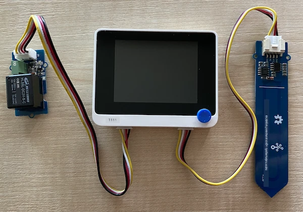

# ពិសោធន៍សន្ទស្សន៍ Relay - Wio Terminal

នៅផ្នែកនេះនៃមេរៀន អ្នកនឹងបន្ថែមសន្ទស្សន៍ទៅលើ Wio Terminal របស់អ្នក បន្ថែមពីឧបករណ៍វាស់សំណើមដី ហើយគ្រប់គ្រងវាតាមមូលដ្ឋានលើកម្រិតសំណើមដី។

## ឧបករណ៍គ្រប់គ្រាន់

Wio Terminal ត្រូវការសន្ទស្សន៍ relay។

Relay ដែលអ្នកនឹងប្រើគឺ [Grove relay](https://www.seeedstudio.com/Grove-Relay.html) ដែលជាសន្ទស្សន៍បើកធម្មតា (មានមនុស្សលទ្ធភាពបើកសៀគ្វីចេញ ឬផ្ដាច់ពីគ្នា នៅពេលពុំមានសញ្ញាត្រូវផ្ញើទៅសន្ទស្សន៍) ដែលអាចគ្រប់គ្រងសៀគ្វីចេញដល់ទៅ 250V និង 10A។

នេះគឺជាឧបករណ៍អេឡិចត្រូនិចជាក់ស្តែង (digital actuator) ដូច្នេះភ្ជាប់ទៅនឹងគ្រាប់ digital នៅលើ Wio Terminal។ ប្រភេទច្រកផ្សំរវាងអាណាឡុក/ឌីជីថលត្រូវបានគេប្រើរួចជាមួយឧបករណ៍វាស់សំណើមដី ហើយដូច្នេះវាទំនាក់ទំនងទៅច្រកផ្សំផ្សេងទៀត ដែលជាច្រកផ្សំ I<sub>2</sub>C និងឌីជីថលរួមគ្នា។

### ភ្ជាប់សន្ទស្សន៍ relay

Grove relay អាចត្រូវបានភ្ជាប់ទៅច្រកឌីជីថលនៃ Wio Terminal។

#### ពិសោធន៍

ភ្ជាប់សន្ទស្សន៍ relay។


1. បញ្ចូលមួយចំហៀងនៃខ្សែ Grove ចូលទៅក្នុងរន្ធនៅលើសន្ទស្សន៍។ វានឹងចូលតែលបើកមួយទិសតែម្តង។

1. នៅពេលដែល Wio Terminal មិនភ្ជាប់ទៅកុំព្យូទ័រឬថាមពលផ្សេងទៀតទេ សូមភ្ជាប់ម្ខាងទៀតនៃខ្សែ Grove ទៅនឹងរន្ធ Grove ផ្នែកខាងឆ្វេងនៅលើ Wio Terminal នៅពេលអ្នកមើលទៅផ្ទៃថេប។ ទុកឱ្យឧបករណ៍វាស់សំណើមដីនៅតែភ្ជាប់នៅលើរន្ធខាងស្ដាំ។



1. បញ្ចូលឧបករណ៍វាស់សំណើមដីចូលក្នុងដី ប្រសិនបើវាមិនបានជាប់រួចពីមេរៀនមុនទេ។

## ពិសោធន៍កម្មវិធីសន្ទស្សន៍ relay

ឥឡូវនេះ Wio Terminal អាចត្រូវបានកម្មវិធីបំពាក់ ដើម្បីប្រើ relay ដែលភ្ជាប់រួចហើយ។

### ពិសោធន៍

កម្មវិធីឱ្យឧបករណ៍ដំណើរការ។

1. បើកគម្រោង `soil-moisture-sensor` ពីមេរៀនមុនក្នុង VS Code ប្រសិនបើវាមានការបើករួចហើយ។ អ្នកនឹងកំពុងបន្ថែមទៅគម្រោងនេះ។

2. គ្មានបណ្ណាល័យសម្រាប់ឧបករណ៍នេះទេ - វាជាឧបករណ៍ឌីជីថលដែលត្រូវបានគ្រប់គ្រងដោយសញ្ញាខ្ពស់ ឬទាប។ ដើម្បីបើកវា អ្នកផ្ញើសញ្ញាខ្ពស់ទៅលេខពិន (3.3V) ដើម្បីបិទវា អ្នកផ្ញើសញ្ញាទាប (0V)។ អ្នកអាចប្រើមុខងារ Arduino ក្នុងសំណុំបែបបទ [`digitalWrite`](https://www.arduino.cc/reference/en/language/functions/digital-io/digitalwrite/)។ ចាប់ផ្តើមដោយបន្ថែមខាងក្រោមទៅផ្នែកចុះក្រោមរបស់មុខងារ `setup` ដើម្បីកំណត់ច្រក I<sub>2</sub>C/ឌីជីថលរួមជាលេខពិនចេញសម្រាប់ផ្ញើវ៉ុលទៅសន្ទស្សន៍ relay៖

    ```cpp
    pinMode(PIN_WIRE_SCL, OUTPUT);
    ```

    `PIN_WIRE_SCL` ជាលេខសម្រាប់ច្រក I<sub>2</sub>C/ឌីជីថលរួម។

1. ដើម្បីសាកល្បង relay ប្រតិបត្តិការបាន ត្រូវបន្ថែមខាងក្រោមទៅមុខងារ `loop` ក្រោមមុខងារ `delay` ចុងក្រោយ៖

    ```cpp
    digitalWrite(PIN_WIRE_SCL, HIGH);
    delay(500);
    digitalWrite(PIN_WIRE_SCL, LOW);
    ```

    កូដនេះសរសេរសញ្ញាខ្ពស់ទៅលើលេខពិនដែល relay ភ្ជាប់ដើម្បីបើកវា រង់ចាំ 500 មីល្លីនាទី (កន្លះវិនាទី) បន្ទាប់មកសរសេរសញ្ញាទាបដើម្បីបិទ relay។

1. រៀបចំនិងផ្ទុកកូដទៅលើ Wio Terminal។

1. បន្ទាប់ពីផ្ទុករួច relay នឹងបើក និងបិទរៀងរាល់ 10 វិនាទី ភ្លាមដាក់ពន្លឺលម្អៀងកន្លះវិនាទីនៅពេលបើក និងបិទ។ អ្នកនឹងឮសំឡេង relay ចុចបើកបិទ។ LED នៅលើកំណត់ Grove នឹងភ្លឺពេល relay បើក ហើយងាក់ទៅពេល relay បិទ។

    

## គ្រប់គ្រង relay ពីសំណើមដី

ឥឡូវ relay ដំណើរការបាន អ្នកអាចគ្រប់គ្រងវាតាមការអានកម្រិតសំណើមដី។

### ពិសោធន៍

គ្រប់គ្រង relay។

1. លុបបន្ទាត់កូដ ៣ ដែលអ្នកបានបន្ថែមសម្រាប់សាកល្បង relay។ ជំនួសរបស់វា ជាមួយកូដដូចខាងក្រោម៖

    ```cpp
    if (soil_moisture > 450)
    {
        Serial.println("Soil Moisture is too low, turning relay on.");
        digitalWrite(PIN_WIRE_SCL, HIGH);
    }
    else
    {
        Serial.println("Soil Moisture is ok, turning relay off.");
        digitalWrite(PIN_WIRE_SCL, LOW);
    }
    ```

    កូដនេះពិនិត្យកម្រិតសំណើមដីពីឧបករណ៍វាស់សំណើមដី។ ប្រសិនបើវាលើសពី 450 វាបើក relay ហើយបិទ relay នៅពេលវាជំរុញក្រោម 450។

    > 💁 ចងចាំថា ឧបករណ៍វាស់សំណើមដីប្រើតែកម្រិតសំណើមដីទាបបង្ហាញថាមានសំណើមច្រើនក្នុងដី ហើយផ្ទុយគ្នា។

1. រៀបចំនិងផ្ទុកកូដទៅលើ Wio Terminal។

1. ត្រួតពិនិត្យឧបករណ៍តាមរយៈម៉ូនីទ័រ serial។ អ្នកនឹងឮ relay បើក ឬបិទផ្អែកលើកម្រិតសំណើមដី។ សាកល្បងនៅក្នុងដីស្ងួត រួចបន្ថែមទឹកមើល។

    ```output
    Soil Moisture: 638
    Soil Moisture is too low, turning relay on.
    Soil Moisture: 452
    Soil Moisture is too low, turning relay on.
    Soil Moisture: 347
    Soil Moisture is ok, turning relay off.
    ```

> 💁 អ្នកអាចស្វែងរកកូដនេះនៅក្នុងថត [code-relay/wio-terminal](../../../../../2-farm/lessons/3-automated-plant-watering/code-relay/wio-terminal)។

😀 កម្មវិធីឧបករណ៍វាស់សំណើមធ្វើការគ្រប់គ្រង relay របស់អ្នកទទួលបានជោគជ័យ!

---

<!-- CO-OP TRANSLATOR DISCLAIMER START -->
**ការបដិសេធ**៖  
ឯកសារនេះត្រូវបានបកប្រែដោយការប្រើប្រាស់សេវាកម្មបកប្រែដោយ AI [Co-op Translator](https://github.com/Azure/co-op-translator)។ ខណៈពេលដែលយើងខិតខំប្រឹងប្រែងដើម្បីភាពត្រឹមត្រូវ សូមយល់ដឹងថាការបកប្រែដោយស្វ័យប្រវត្តិស័ព្ទអាចមានកំហុស ឬភាពមិនត្រឹមត្រូវ។ ឯកសារច្បាស់លាស់ដើមដោយភាសាដើមគួរតែប្រើជាធនាគារផ្លូវការ។ សម្រាប់ព័ត៌មានសំខាន់ណាស់ គួរតែប្រើប្រាស់ការបកប្រែដោយអ្នកជំនាញមនុស្ស។ យើងមិនទទួលខុសត្រូវចំពោះការយល់ច្រឡំឬការបកប្រែខុសណាមួយដែលកើតមានពីការប្រើប្រាស់ការបកប្រែនេះឡើយ។
<!-- CO-OP TRANSLATOR DISCLAIMER END -->