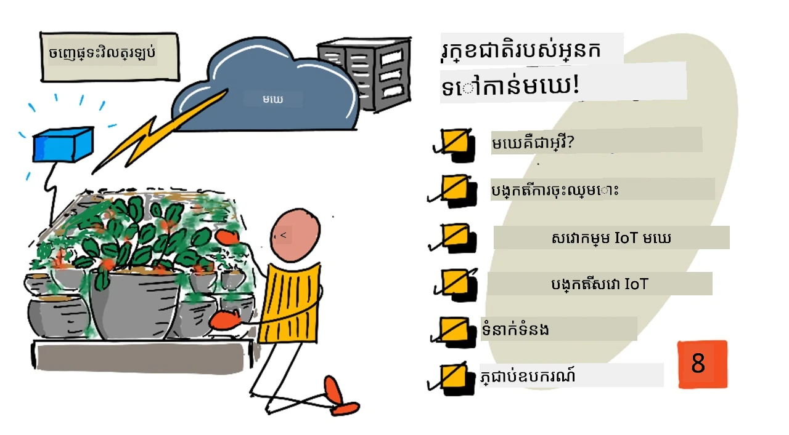
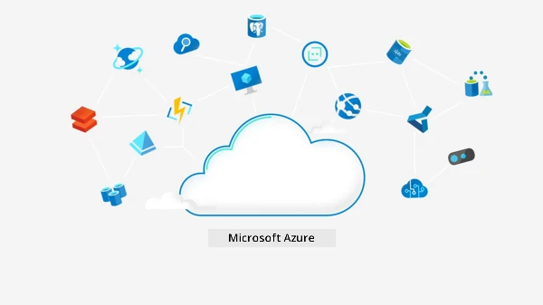
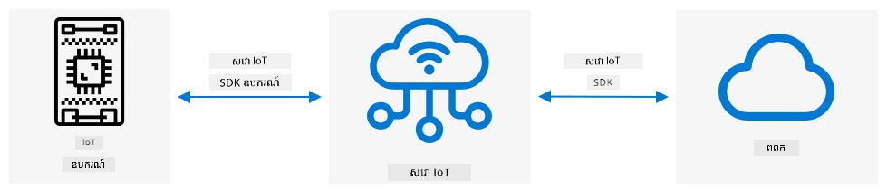
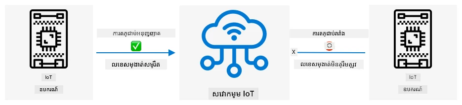
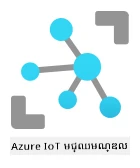

# ប្ដូរដំណាំរបស់អ្នកទៅមេឃ



> សេតចំណាំដោយ [Nitya Narasimhan](https://github.com/nitya). ចុចលើរូបភាពសម្រាប់កំណែធំជាងនេះ។

មេរៀននេះត្រូវបានបង្រៀនជាផ្នែកមួយនៃ [គម្រោង IoT សម្រាប់អ្នកចាប់ផ្ដើម ភាគ 2 - ស៊េរីកស្រះកសិកម្មឌីជីថល](https://youtube.com/playlist?list=PLmsFUfdnGr3yCutmcVg6eAUEfsGiFXgcx) ពី [Microsoft Reactor](https://developer.microsoft.com/reactor/?WT.mc_id=academic-17441-jabenn)។

[](https://youtu.be/bNxjopXkhvk)

## ប្រលងមុនបង្រៀន

[ប្រលងមុនបង្រៀន](https://black-meadow-040d15503.1.azurestaticapps.net/quiz/15)

## បើកមុខ

ក្នុងមេរៀនមុន អ្នកបានរៀនពីរបៀបភ្ជាប់ដំណាំរបស់អ្នកទៅរបង MQTT និងគ្រប់គ្រងឌីខ្ល័រពីកូដម៉ាស៊ីនមេដែលដំណើរការជាស្រុក។ វាជាគន្លងមូលដ្ឋាននៃប្រព័ន្ធបាញ់ទឹកដើម្បីស្វ័យប្រវត្តិនៃប្រភេទដែលប្រើពីដំណាំមួយនៅផ្ទះរហូតដល់កសិដ្ឋានពាណិជ្ជកម្ម។

ឧបករណ៍ IoT បានធ្វើការទំនាក់ទំនងជាមួយរបង MQTT សាធារណៈជារបៀបដើម្បីបង្ហាញគន្លងបច្ចេកទេស ប៉ុន្តែវាមិនមែនជារបៀបដែលទុកចិត្ត ឬមានសុវត្ថិភាពខ្ពស់បំផុតទេ។ ក្នុងមេរៀននេះ អ្នកនឹងរៀនអំពីមេឃ និងសមត្ថភាព IoT ដែលបានផ្តល់ដោយសេវាកម្មមេឃសាធារណៈ។ អ្នកនឹងរៀនផងដែរ របៀបប្ដូរដំណាំរបស់អ្នកទៅកាន់សេវាកម្មមេឃមួយចេញពីរបង MQTT សាធារណៈ។

នៅក្នុងមេរៀននេះ យើងនឹងគ្របដណ្តប់៖

* [មេឃគឺជាអ្វី?](#មេឃគឺជាអ្វី)
* [បង្កើតការជាវមេឃ](#បង្កើតការជាវមេឃ)
* [សេវា IoT មេឃ](#សេវា-iot-មេឃ)
* [បង្កើតសេវា IoT នៅក្នុងមេឃ](#បង្កើតសេវា-iot-នៅក្នុងមេឃ)
* [ទំនាក់ទំនងជាមួយ IoT Hub](#ទំនាក់ទំនងជាមួយ-iot-hub)
* [ភ្ជាប់ឧបករណ៍របស់អ្នកទៅកាន់សេវា IoT](#តភ្ជាប់ឧបករណ៍របស់អ្នកទៅសេវា-iot)

## មេឃគឺជាអ្វី?

មុនមានមេឃ បុគ្គលិកភាពមួយចង់ផ្តល់សេវាកម្មទៅបុគ្គលិករបស់ពួកគេ (ដូចជា ទិន្នន័យធ្វើបរិញ្ញាណ ឬផ្ទុកឯកសារ) ឬឲ្យសាធារណៈ (ដូចជា វេបសាយ) ពួកគេនឹងសាងសង់និងដំណើរការទិន្នន័យមួយកន្លែង។ វាផ្ទុយពីបន្ទប់មានកុំព្យូទ័រលិចលាក់មួយ ឬអគារធំៗមានកុំព្យូទ័រច្រើន។ ក្រុមហ៊ុននឹងគ្រប់គ្រងគ្រប់យ៉ាង រួមមាន៖

* ទិញកុំព្យូទ័រ
* រក្សាប្រព័ន្ធគ្រឿងចក្រ
* អគ្គិសនី និង ការចង្អុលត្រជាក់
* បណ្ដាញ
* សុវត្ថិភាព រួមមានសុវត្ថិភាពអគារ និងសុវត្ថិភាពកម្មវិធីកុំព្យូទ័រ
* ដំឡើងនិងធ្វើបច្ចុប្បន្នភាពកម្មវិធី

វាអាចមានតម្លៃខ្ពស់ តម្រូវឲ្យមានបុគ្គលិកជំនាញជាច្រើន និងយឺតយ៉ាវក្នុងការផ្លាស់ប្តូរតាមតម្រូវការ។ ឧទាហរណ៍ ប្រសិនបើហាងលក់អនឡាញត្រូវផ្ដល់ការរៀបចំសម្រាប់រដូវកាលលក់បំផុតពិសេសនៃថ្ងៃឈប់សម្រាក ពួកគេចាំបាច់ត្រូវគ្រោងមុនជាច្រើនខែដើម្បីទិញឧបករណ៍បន្ថែម កំណត់រចនាសម្ព័ន្ធ តម្លើងនិងដំឡើងកម្មវិធីដើម្បីដំណើរការជួញដូរ។ បន្ទាប់ពីរដូវកាលលក់បញ្ចប់ និងលក់ធ្លាក់ចុះ ពួកគេទទួលខុសត្រូវនៅកុំព្យូទ័រដែលបានទិញ ហើយវានៅមិនប្រើប្រាស់រហូតដល់រដូវកាលលក់បន្ទាប់។

✅ តើអ្នកគិតថាវានឹងអនុញ្ញាតឲ្យក្រុមហ៊ុនយកល្បឿនលឿន? ប្រសិនបើហាងលក់សម្លៀកបំពាក់ទំនើបមួយកើតមានពេញនិយមយ៉ាងខ្លាំងដោយសារម្ចាស់ពាណិជ្ជកម្មមួយបង្ហាញក្នុងសម្លៀកបំពាក់ រកដល់ពួកគេអាចបង្កើនថាមពលកុំព្យូទ័របានយ៉ាងលឿនគ្រប់គ្រងការបញ្ជាទិញចោល?

### កុំព្យូទ័ររបស់អ្នកផ្សេងទៀត

មេឃអាចត្រូវបានគេចោទថាជា 'កុំព្យូទ័ររបស់អ្នកផ្សេងទៀត' ដោយការកំប្លែង។ គំនិតដំបូន្មានគឺ យើងមិនទិញកុំព្យូទ័រឡើយ តែជួលកុំព្យូទ័ររបស់អ្នកផ្សេងទៀត។ អ្នកផ្គត់ផ្គង់កុំព្យូទ័រមេឃធំៗនឹងគ្រប់គ្រងមជ្ឈមណ្ឌលទិន្នន័យធំនេះ។ ពួកគេមានទំនួលខុសត្រូវទិញនិងដំឡើងគ្រឿងចក្រ បើកផ្គត់ផ្គង់អគ្គិសនី និងត្រជាក់ បណ្ដាញ សុវត្ថិភាពអគារ និងកម្មវិធីធ្វើបច្ចុប្បន្នភាព។ ជាអតិថិជន អ្នកនឹងជួលកុំព្យូទ័រត្រូវការប្រើ ជួលច្រើនជាងពេលតម្រូវការ បន្ទាប់បន្ថយចំនួនជួលពេលតម្រូវការបិទ។ មជ្ឈមណ្ឌលទិន្នន័យមេឃទាំងនេះមាននៅជុំវិញពិភពលោក។


មជ្ឈមណ្ឌលទិន្នន័យទាំងនេះអាចមានទំហំនាប់រាងច្រើនគីឡូម៉ែត្រការ៉េ។ រូបភាពខាងលើបានចាប់យកមុននេះរយៈពេលពីរឆ្នាំនៅក្នុងមជ្ឈមណ្ឌលទិន្នន័យមេឃ Microsoft ហើយលើកសហគ្រាសដំបូងរបស់វា ជាមួយផែនការពង្រីកខាងមុខ។ ដែនទន្លារភាគច្រើនសម្រាប់ការពង្រីកនេះមានលើស 5 គីឡូម៉ែត្រការ៉េ។

> 💁 មជ្ឈមណ្ឌលទិន្នន័យទាំងនេះត្រូវប្រើអគ្គិសនីច្រើនបំផុត ហើយខ្លះមានបរិក្ខារផ្ទាល់ខ្លួនផ្គត់ផ្គង់អគ្គិសនី។ ដោយសារ ទំហំ និងការវិនិយោគខ្ពស់ពីអ្នកផ្គត់ផ្គង់មេឃ វាមានភាពជាមិត្តបរិស្ថានខ្ពស់។ វាសមត្ថភាពប្រើប្រាស់ល្អជាងមជ្ឈមណ្ឌលទិន្នន័យតូចច្រើនៗមួយចំនួន ជាញឹកញាប់ប្រើថាមពលអាចត្រឡប់មកវិញបាន ហើយអ្នកផ្គត់ផ្គង់មេឃខំប្រឹងកាត់បន្ថយអាកប្បកិរិយា កាត់បន្ថយការប្រើប្រាស់ទឹក និងដាំព្រៃឡើងវិញ ដើម្បីជំនួសព្រៃដែលបានកាត់ដើម្បីផ្ដល់កន្លែងសាងសង់មជ្ឈមណ្ឌលទិន្នន័យ។ អ្នកអាចអានបន្ថែមអំពីរបៀបដែលអ្នកផ្គត់ផ្គង់មេឃមួយកំពុងធ្វើការនៅលើការរស់នៅតែមួយនៅលើ [គេហទំព័រស្វាគមន៍របស់ Azure](https://azure.microsoft.com/global-infrastructure/sustainability/?WT.mc_id=academic-17441-jabenn)។

✅ ស្វែងយល់បន្ថែម៖ អានអំពីមេឃធំៗ ដូចជា [Azure ពី Microsoft](https://azure.microsoft.com/?WT.mc_id=academic-17441-jabenn) ឬ [GCP ពី Google](https://cloud.google.com) ពួកគេមានមជ្ឈមណ្ឌលទិន្នន័យប៉ុន្មាន និងមានទីតាំងនៅឯណានៅលើពិភពលោក?

ការប្រើប្រាស់មេឃរក្សាតម្លៃបានទាបសម្រាប់ក្រុមហ៊ុន ហើយអនុញ្ញាតឲ្យពួកគេផ្ដោតលើអ្វីដែលពួកគេច្បាស់លាស់ ដោយទុកជំនាញកុំព្យូទ័រជំនួយសម្រាប់អ្នកផ្គត់ផ្គង់។ ក្រុមហ៊ុនមិនចាំបាច់ជួល ឬទិញទីតាំងមជ្ឈមណ្ឌលទិន្នន័យ បង់ប្រាក់ជាអ្នកផ្គត់ផ្គង់ផ្សេងៗសម្រាប់ការតភ្ជាប់ និងអគ្គិសនី ឬជ្រើសរើសជំនាញទេ។ ផ្ទុយទៅវិញ ពួកគេអាចបង់ប្រាក់ជាប្រាក់ខែឲ្យអ្នកផ្គត់ផ្គង់មេឃមួយ ដើម្បីឲ្យគ្រប់យ៉ាងត្រូវបានអនុវត្ត។

អ្នកផ្គត់ផ្គង់មេឃហូបប្រាក់ច្រើន ដើម្បីធន់ទៅនឹងចំណាយ និងទិញកុំព្យូទ័រច្រើនជាបក្ស ឬឧបករណ៍រចនាថ្មីៗ ដើម្បីធ្វើអោយសេវាកម្មរបស់ពួកគេប្រសើរឡើង។

### Microsoft Azure

Azure គឺជាមេឃសម្រាប់អ្នកអភិវឌ្ឍដោយ Microsoft ហើយនេះគឺជាមេឃដែលអ្នកនឹងប្រើសម្រាប់មេរៀនទាំងនេះ។ វីដេអូខាងក្រោមផ្តល់ការណែនាំខ្លីពី Azure៖

[](https://www.microsoft.com/videoplayer/embed/RE4Ibng?WT.mc_id=academic-17441-jabenn)

## បង្កើតការជាវមេឃ

ដើម្បីប្រើសេវាកម្មក្នុងមេឃ អ្នកចាំបាច់ត្រូវចុះឈ្មោះសម្រាប់ការជាវជាមួយពុម្ពម្ចាស់មេឃ។ សម្រាប់មេរៀននេះ អ្នកនឹងចុះឈ្មោះពីការជាវ Microsoft Azure។ ប្រសិនបើអ្នកមានការជាវ Azure របស់អ្នករួចហើយ អ្នកអាចរំលងភារកិច្ចនេះបាន។ ព័ត៌មានការជាវដែលពិពណ៌នានៅទីនេះខាងលើត្រឹមត្រូវនៅពេលនិពន្ធ ប៉ុន្តែអាចផ្លាស់ប្តូរបាន។

> 💁 ប្រសិនបើអ្នកកំពុងចូលប្រើមេរៀនទាំងនេះតាមរយៈសាលារៀនរបស់អ្នក អ្នកអាចមានការជាវ Azure ដែលមានស្រាប់រួច។ សូមពិនិត្យជាមួយគ្រូរបស់អ្នក។

មានប្រភេទការជាវ Azure ដោយឥតគិតថ្លៃពីរ ដែលអ្នកអាចចុះឈ្មោះ៖

* **Azure សម្រាប់សិស្ស** - នេះគឺជាការជាវដែលគេរចនាឡើងសម្រាប់សិស្សអាយុ 18ឆ្នាំឡើង។ អ្នកមិនចាំបាច់មានកាតឥណទានសម្រាប់ចុះឈ្មោះទេ ហើយអ្នកប្រើអាសយដ្ឋានអ៊ីមែលសាលារបស់អ្នកសម្រាប់ផ្ទៀងផ្ទាត់ថាអ្នកជាសិស្ស។ ពេលចុះឈ្មោះ អ្នកនឹងទទួលបានប្រាក់ US$100 សម្រាប់ប្រើចំណាយលើធនធាន Cloud ជាមួយនឹងសេវាឥតគិតថ្លៃ រួមមានកំណែថ្មោងនៃសេវា IoT។ វាគ្រោងនៅរយៈពេល 12 ខែ ហើយអ្នកអាចផ្លាស់ប្តូរជាប្រចាំរៀងរាល់ឆ្នាំពេលអ្នកនៅជាសិស្ស។

* **ការជាវ Azure ដោយឥតគិតថ្លៃ** - នេះគឺជាការជាវសម្រាប់នរណាក៏បានដែលមិនមែនជាសិស្ស។ អ្នកចាំបាច់ត្រូវមានកាតឥណទានសម្រាប់ចុះឈ្មោះការជាវ ប៉ុន្តែកាតរបស់អ្នកនឹងមិនត្រូវបានគិតថ្លៃទេ វាត្រឹមតែបង្កើតការផ្ទៀងផ្ទាត់ថាអ្នកជាមនុស្សពិតមិនមែនជារ៉ូបូត។ អ្នកនឹងទទួលបានកាតឥណទាន $200 សម្រាប់ប្រើក្នុងរយៈពេល 30ថ្ងៃផ្តើម សម្រាប់សេវាណាមួយជាមួយកម្រិតឥតគិតថ្លៃ។ បន្ទាប់ពីកាតឥណទានបានប្រើបញ្ចប់ កាតរបស់អ្នកនឹងមិនត្រូវបានគិតថ្លៃទេទៅលើយ៉ាងដូច្នេះទេ ប្រសិនបើអ្នកមិនបម្លែងជាការជាវបង់តាមការប្រើប្រាស់។

> 💁 Microsoft មានផ្តល់ជូនការជាវ Azure សម្រាប់សិស្សចាប់ពីក្រោម 18 ឆ្នាំ ដែរ ប៉ុន្តែពេលនេះមិនគាំទ្រ សេវា IoT ណាមួយទេ។

### ភារកិច្ច - ចុះឈ្មោះសម្រាប់ការជាវមេឃឥតគិតថ្លៃ

ប្រសិនបើអ្នកជាសិស្សអាយុ 18 ឆ្នាំឡើង អ្នកអាចចុះឈ្មោះសម្រាប់ការជាវ Azure សម្រាប់សិស្ស។ អ្នកត្រូវផ្ទៀងផ្ទាត់ដោយអាសយដ្ឋានអ៊ីមែលសាលារៀន។ អ្នកអាចធ្វើនេះមានពីរប្រភេទ៖

* ចុះឈ្មោះសម្រាប់កញ្ចប់អ្នកអភិវឌ្ឍន៍សិស្ស GitHub នៅ [education.github.com/pack](https://education.github.com/pack)។ នេះផ្តល់ឱ្យអ្នកនូវឧបករណ៍ និងការផ្តល់ជូនជាច្រើន រួមមាន GitHub និង Microsoft Azure។ បន្ទាប់ពីចុះឈ្មោះរួច អ្នកអាចដំណើរការ Azure សម្រាប់សិស្សបាន។

* ចុះឈ្មោះផ្ទាល់សម្រាប់គណនី Azure សម្រាប់សិស្សនៅ [azure.microsoft.com/free/students](https://azure.microsoft.com/free/students/?WT.mc_id=academic-17441-jabenn)។

> ⚠️ ប្រសិនបើអាសយដ្ឋានអ៊ីមែលសាលារបស់អ្នកមិនត្រូវបានស្គាល់ សូមបង្កើត [បញ្ហានៅក្នុងផ្ទាំងនេះ](https://github.com/Microsoft/IoT-For-Beginners/issues) ហើយយើងនឹងពិនិត្យមើលថាតើអាចបន្ថែមវាទៅបញ្ជីអនុញ្ញាត Azure សម្រាប់សិស្សទៅបានដែរឬទេ។

ប្រសិនបើអ្នកមិនមែនជាសិស្ស ឬអ្នកមិនមានអាសយដ្ឋានអ៊ីមែលសាលាដែលត្រឹមត្រូវទេ អ្នកអាចចុះឈ្មោះសម្រាប់ការជាវ Azure ដោយឥតគិតថ្លៃបាន។

* ចុះឈ្មោះសម្រាប់ការជាវ Azure ដោយឥតគិតថ្លៃនៅ [azure.microsoft.com/free](https://azure.microsoft.com/free/?WT.mc_id=academic-17441-jabenn)

## សេវា IoT មេឃ

របង MQTT សាធារណៈសាកល្បងដែលអ្នកកំពុងប្រើជួយសម្រាប់បង្រៀនមានគុណសម្បត្តិល្អ ប៉ុន្តែមានកំហុសជាច្រើនទាក់ទងឧបករណ៍ជាងតែក្នុងបរិបទពាណិជ្ជកម្ម៖

* ភាពទុកចិត្ត - វាជាសេវាឥតគិតថ្លៃ និងគ្មានការធានា ចេះតែអាចបិទពេលណាមួយបាន
* សុវត្ថិភាព - វាសាធារណៈ ដូច្នេះបើអ្នកណាអាចស្តាប់ទិន្នន័យរបស់អ្នក ឬផ្ញើបញ្ជាលេងដើម្បីគ្រប់គ្រងឧបករណ៍របស់អ្នកបាន
* ប្រសិទ្ធភាព - វាត្រូវបានរចនាឡើងសម្រាប់សារតែប៉ុន្មាន ដូច្នេះមិនអាចទ្រាំបានសារច្រើនៗកំពុងផ្ញើសារមក
* ការស្វែងរក - គ្មានវិធីដឹងថាឧបករណ៍ណាភ្ជាប់

សេវា IoT ក្នុងមេឃសំរេចករណីទាំងនេះ។ ពួកគេបានគ្រប់គ្រងដោយអ្នកផ្គត់ផ្គង់មេឃធំៗដែលវិនិយោគយ៉ាងខ្លាំងលើភាពទុកចិត្ត និងរួចរាល់ដើម្បីជំរុញពេលមានបញ្ហាណាមួយកើតឡើង។ ពួកគេមានសុវត្ថិភាពមូលដ្ឋានដើម្បីបញ្ឈប់អ្នកបញ្ឆោតដែលបានអានទិន្នន័យ ឬផ្ញើបញ្ជាជ្រើសរើស។ ពួកគេមានប្រសិទ្ធភាពខ្ពស់អាចដំណើរការសារលានលានរាប់លានលានសារពេលថ្ងៃហើយប្រើប្រាស់មេឃក្នុងការកំណត់កម្រិតតាមតម្រូវ។

> 💁 ទោះបីជាអ្នកបង់ប្រាក់សេវាគ្រប់ខែ សេវាកម្មមេឃភាគច្រើនផ្តល់ជូនកំណែឥតគិតថ្លៃនៃសេវា IoT របស់ពួកគេ ជាមួយនឹងកំណត់កម្រិតសារប្រចាំថ្ងៃ ឬឧបករណ៍របស់អ្នកភ្ជាប់។ កំណែឥតគិតថ្លៃនេះគឺគ្រប់គ្រាន់សម្រាប់អ្នកអភិវឌ្ឍសិក្សាអំពីសេវា។

ឧបករណ៍ IoT ភ្ជាប់ទៅសេវាមេឃដោយប្រើ SDK ឧបករណ៍ (បណ្ណាល័យផ្តល់កូដដើម្បីដំណើរការជាមួយមុខងារសេវា) ឬដោយផ្ទាល់តាមប្រព័ន្ធទំនាក់ទំនងដូចជា MQTT ឬ HTTP។ SDK ឧបករណ៍គឺមធ្យោបាយងាយស្រួលបំផុត ដោយវាគ្រប់គ្រងគ្រប់យ៉ាង ដូចជា ផ្ដាច់ល្បែងតំណផ្សព្វផ្សាយ ឬចុះបញ្ជី ហើយរបៀបគ្រប់គ្រងសុវត្ថិភាព។



ឧបករណ៍របស់អ្នក នឹងទំនាក់ទំនងជាមួយផ្នែកផ្សេងៗនៃកម្មវិធីរបស់អ្នកតាមសេវានេះ - ដូចជាការផ្ញើទិន្នន័យ និងទទួលបញ្ជាជាមួយ MQTT។ វាត្រូវបានគ្រប់គ្រងជាទូទៅតាម SDK សេវា ឬបណ្ណាល័យដូចគ្នា។ សារនឹងមកពីឧបករណ៍មកសេវា ដែលផ្នែកផ្សេងៗនៃកម្មវិធីអាចអានបាន និងសារអាចផ្ញើត្រឡប់ទៅឧបករណ៍របស់អ្នក។



សេវាទាំងនេះអនុវត្តសុវត្ថិភាពដោយដឹងពីឧបករណ៍ទាំងអស់អាចភ្ជាប់និងផ្ញើទិន្នន័យ ប្រសិនបើឧបករណ៍ត្រូវបានចុះបញ្ជីជាមុនជាមួយសេវា ឬផ្តល់ឧបករណ៍អាក្រក់ ឬវិញ្ញាបនបត្រដើម្បីអនុញ្ញាតឲ្យឧបករណ៍ចុះបញ្ជីខ្លួននៅពេលដំបូងភ្ជាប់។ ឧបករណ៍មិនស្គាល់មិនអាចភ្ជាប់ បើពួកគេសាកល្បង សេវានឹងបដិសេធការភ្ជាប់ និងមិនពិនិត្យសារដែលបានផ្ញើ។

✅ ស្វែងយល់បន្ថែម៖ តើគ្រោះថ្នាក់អ្វីខ្លះដែលមានពីការមានសេវា IoT កើតស្វាត្យ ដែលឧបករណ៍ ឬកូដណាមួយអាចភ្ជាប់បាន? តើអ្នកអាចរកឃើញឧទាហរណ៍ច្បាស់លាស់នៃអ្នកបញ្ឆោតដែលប្រើប្រាស់វានេះបានបែបណា?

ផ្នែកផ្សេងៗនៃកម្មវិធីរបស់អ្នកអាចភ្ជាប់ទៅសេវា IoT និងស្គាល់ពីឧបករណ៍ទាំងអស់ដែលភ្ជាប់ ឬបានចុះបញ្ជី ហើយទំនាក់ទំនងផ្ទាល់ជាច្រើនឬចុងក្រោមមួយ។

> 💁 សេវា IoT ក៏អនុវត្តសមត្ថភាពបន្ថែមទៀត ហើយអ្នកផ្គត់ផ្គង់មេឃមានសេវា និងកម្មវិធីបន្ថែមដែលអាចភ្ជាប់ទៅសេវានេះបាន។ ឧទាហរណ៍ ប្រសិនបើអ្នកចង់ផ្ទុកសារទិន្នន័យទាំងអស់ពីឧបករណ៍ទាំងអស់ក្នុងមូលដ្ឋានទិន្នន័យ វាគ្រាន់តែចុចពីរដងក្នុងឧបករណ៍ផ្គត់ផ្គង់មេឃដើម្បីភ្ជាប់សេវាទៅមូលដ្ឋានទិន្នន័យនោះ ហើយបញ្ចេញទិន្នន័យចូល។

## បង្កើតសេវា IoT នៅក្នុងមេឃ

ឥឡូវនេះអ្នកមានការជាវ Azure អ្នកអាចចុះឈ្មោះសម្រាប់សេវា IoT មួយ។ សេវា IoT ពី Microsoft ហៅថា Azure IoT Hub។



វីដេអូខាងក្រោមផ្តល់ការណែនាំខ្លីអំពី Azure IoT Hub៖

[](https://www.youtube.com/watch?v=smuZaZZXKsU)

> 🎥 ចុចលើរូបភាពខាងលើដើម្បីមើលវីដេអូ

✅ ចំណាយពេលបន្តិចសម្រាប់ស្រាវជ្រាវ និងអានសង្ខេបអំពី IoT hub នៅក្នុង [ឯកសារអំពី Microsoft IoT Hub](https://docs.microsoft.com/azure/iot-hub/about-iot-hub?WT.mc_id=academic-17441-jabenn)។
សេវាកម្មមេឃដែលមាននៅក្នុង Azure អាចត្រូវបានកំណត់តាមរយៈបណ្តាញផ្ទាល់លើគេហទំព័រ ឬតាមរយៈចំណុចបញ្ជាដោយប្រើ command-line interface (CLI)។ សម្រាប់ភារកិច្ចនេះ អ្នកនឹងប្រើ CLI។

### ភារកិច្ច - បញ្ចូល Azure CLI

ដើម្បីប្រើ Azure CLI មុនដំបូងវាជាត្រូវតែបានបញ្ចូលលើកុំព្យូទ័រ PC ឬ Mac របស់អ្នក។

1. អនុវត្តតាមការណែនាំនៅក្នុង [ឯកសារ Azure CLI](https://docs.microsoft.com/cli/azure/install-azure-cli?WT.mc_id=academic-17441-jabenn) ដើម្បីបញ្ចូល CLI។

1. Azure CLI គាំទ្រតំណាងបន្ថែមជាច្រើនដែលបន្ថែមសមត្ថភាពក្នុងការគ្រប់គ្រងសេវាកម្ម Azure ផ្សេងៗ។ បញ្ចូលការបន្ថែម IoT ដោយរកម្មវិធីបញ្ជាខាងក្រោមពី command line របស់អ្នក៖

    ```sh
    az extension add --name azure-iot
    ```

1. ពី command line របស់អ្នក ឬ terminal របស់អ្នក ប្រតិបត្តិការបញ្ជាខាងក្រោមដើម្បីចូលក្នុងជាវស្តុក Azure របស់អ្នកពី Azure CLI។

    ```sh
    az login
    ```

    ទំព័របណ្តាញនឹងត្រូវបានបើកនៅកម្មវិធីរុករករបស់អ្នក។ ចូលដោយគណនីដែលអ្នកបានបង្កើតជាវសម្រាប់ជាវ Azure របស់អ្នក។ បន្ទាប់ពីចូលរួចអ្នកអាចបិទផ្ទាំងរុករកបាន។

1. បើអ្នកមានជាវ Azure ច្រើន ដូចជាជាវដែលផ្តល់ដោយសាលា និងជាវ Azure សម្រាប់សិស្សរបស់អ្នកផ្ទាល់ អ្នកត្រូវតែជ្រើសរើសជាវដែលអ្នកចង់ប្រើ។ ប្រតិបត្តិការបញ្ជាបង្ហាញបញ្ជីជាវទាំងអស់ដែលអ្នកអាចចូលដំណើរការ៖

    ```sh
    az account list --output table
    ```

    ក្នុងលទ្ធផល អ្នកនឹងឃើញឈ្មោះនៃជាវនីមួយៗរួមជាមួយ `SubscriptionId`។

    ```output
    ➜  ~ az account list --output table
    Name                    CloudName    SubscriptionId                        State    IsDefault
    ----------------------  -----------  ------------------------------------  -------  -----------
    School-subscription     AzureCloud   cb30cde9-814a-42f0-a111-754cb788e4e1  Enabled  True
    Azure for Students      AzureCloud   fa51c31b-162c-4599-add6-781def2e1fbf  Enabled  False
    ```

    ដើម្បីជ្រើសរើសជាវដែលអ្នកចង់ប្រើ ប្រើបញ្ជាខាងក្រោម៖

    ```sh
    az account set --subscription <SubscriptionId>
    ```

    ជំនួស `<SubscriptionId>` ជាមួយ ID នៃជាវ ដែលអ្នកចង់ប្រើ។ បន្ទាប់ពីប្រតិបត្តិការ បញ្ជាខាងលើ សូមបើកបញ្ជាដូចគ្នាថ្មី ដើម្បីបញ្ជីគណនីរបស់អ្នក។ អ្នកនឹងឃើញជួរឈរ `IsDefault` ត្រូវបានសម្គាល់ជា `True` សម្រាប់ជាវដែលអ្នកបានកំណត់ថ្មី។

### ភារកិច្ច - បង្កើតក្រុមធនធាន (Resource Group)

សេវាកម្ម Azure ដូចជា IoT Hub instances, កុំព្យូទ័រវិចិត្រស័ក្ត្រ, ប្រព័ន្ធទិន្នន័យ ឬសេវា AI ត្រូវបានគេស្គាល់ឈ្មោះថា **ធនធាន**។ មួយធនធានត្រូវបានដាក់ក្នុង **ក្រុមធនធាន** ដែលជាការប្រមូលផ្ដុំយោគយល់នៃធនធានមួយ ឬច្រើន។

> 💁 ការប្រើក្រុមធនធានមានន័យថាអ្នកអាចគ្រប់គ្រងសេវាកម្មជាច្រើនក្នុងពេលតែមួយ។ ឧទាហរណ៍ បន្ទាប់ពីលោកអ្នកបញ្ចប់មេរៀនទាំងអស់ សម្រាប់គម្រោងនេះ អ្នកអាចលុបក្រុមធនធាន ហើយធនធានទាំងអស់នៅក្នុងនោះនឹងត្រូវលុបដោយស្វ័យប្រវត្តិ។

1. មានមណ្ឌលទិន្នន័យ Azure ច្រើនដល់ជុំវិញពិភពលោក ដែលបានបែងចែកជាតំបន់។ នៅពេលអ្នកបង្កើតធនធានឬក្រុមធនធាន Azure អ្នកត្រូវជ្រើសទីតាំងដែលចង់បង្កើតវា។ ប្រតិបត្តិការបញ្ជាខាងក្រោមដើម្បីទទួលបញ្ជីទីតាំង៖

    ```sh
    az account list-locations --output table
    ```

    អ្នកនឹងឃើញបញ្ជីទីតាំងមួយ។ បញ្ជីនេះវែង។

    > 💁 នៅពេលសរសេរ មានទីតាំង 65 ទីតាំងដែលអ្នកអាចដាក់បាន។

    ```output
        ➜  ~ az account list-locations --output table
    DisplayName               Name                 RegionalDisplayName
    ------------------------  -------------------  -------------------------------------
    East US                   eastus               (US) East US
    East US 2                 eastus2              (US) East US 2
    South Central US          southcentralus       (US) South Central US
    ...
    ```

    ចំណាំតម្លៃពីជួរឈរ `Name` នៃតំបន់ជិតអ្នកបំផុត។ អ្នកអាចស្វែងរកតំបន់នៅលើផែនទីនៅ [ទំព័រ Azure geographies](https://azure.microsoft.com/global-infrastructure/geographies/?WT.mc_id=academic-17441-jabenn)។

1. ប្រតិបត្តិការបញ្ជាខាងក្រោមដើម្បីបង្កើតក្រុមធនធានឈ្មោះ `soil-moisture-sensor`។ ឈ្មោះក្រុមធនធានត្រូវមានភាពតែមួយក្នុងជាវរបស់អ្នក។

    ```sh
    az group create --name soil-moisture-sensor \
                    --location <location>
    ```

    ជំនួស `<location>` ជាមួយទីតាំងដែលអ្នកបានជ្រើសនៅជំហានមុន។

### ភារកិច្ច - បង្កើត IoT Hub

ឥឡូវនេះអ្នកអាចបង្កើតធនធាន IoT Hub ក្នុងក្រុមធនធានរបស់អ្នកបានហើយ។

1. ប្រើបញ្ជាខាងក្រោមដើម្បីបង្កើតធនធាន IoT Hub រៀងរបស់អ្នក៖

    ```sh
    az iot hub create --resource-group soil-moisture-sensor \
                      --sku F1 \
                      --partition-count 2 \
                      --name <hub_name>
    ```

    ជំនួស `<hub_name>` ជាមួយឈ្មោះសម្រាប់ hub របស់អ្នក។ ឈ្មោះនេះត្រូវតែមានភាពតែមួយជាសកល - គឺគ្មាន IoT Hub មួយទៀតដែលបង្កើតដោយនរណាមួយមានឈ្មោះដូចគ្នា។ ឈ្មោះនេះត្រូវបានប្រើនៅក្នុង URL ដែលបង្ហាញទៅកាន់ hub ដូច្នេះត្រូវតែមិនធ្វើយ៉ាងខុសគ្នា។ ប្រើឈ្មោះដូចជា `soil-moisture-sensor-` ហើយបន្ថែមនិមិត្តសញ្ញាផ្ទាល់ខ្លួននៅចុង ឧ. ពាក្យចៃដន្យ ឬឈ្មោះអ្នក។

    ជម្រើស `--sku F1` ប្រាប់ឱ្យវាប្រើថ្នាក់ឥតគិតថ្លៃ។ ថ្នាក់ឥតគិតថ្លៃគាំទ្រ 8,000 សារក្នុងមួយថ្ងៃ រួមជាមួយតម្រងមុខងារច្រើនពីថ្នាក់បង់ប្រាក់ពេញលេញ។

    > 🎓 កំរិតតម្លៃផ្សេងៗនៃសេវាកម្ម Azure ត្រូវបានគេស្គាល់ថាជា tiers។ Mỗi tier có chi phí khác nhau và cung cấp các tính năng hoặc khối lượng dữ liệu khác nhau.

    > 💁 ប្រសិនបើអ្នកចង់រៀនបន្ថែមអំពីតម្លៃ អ្នកអាចស្ថិតនៅក្នុង [Azure IoT Hub pricing guide](https://azure.microsoft.com/pricing/details/iot-hub/?WT.mc_id=academic-17441-jabenn)។

    ជម្រើស `--partition-count 2` កំណត់ចំនួនច្រកទិន្នន័យដែល IoT Hub គាំទ្រ ច្រើន partition ជួយកាត់បន្ថយការចាប់ខ្សែទិន្នន័យពេលមានការអាននិងសរសេរពហុគ្រឿងពី IoT Hub។ Partitions ក្រៅសិក្សានៃមេរៀនទាំងនេះ ប៉ុន្តែតម្លៃនេះត្រូវបានកំណត់ដើម្បីបង្កើត IoT Hub ថ្នាក់ឥតគិតថ្លៃ។

    > 💁 អ្នកអាចមាន IoT Hub ថ្នាក់ឥតគិតថ្លៃតែមួយក្នុងគណនីជាវផ្ទាល់ខ្លួន។

IoT Hub នឹងត្រូវបានបង្កើត។ វាអាចយកពេលប៉ុន្មាននាទីដើម្បីបញ្ចប់។

## ទំនាក់ទំនងជាមួយ IoT Hub

ក្នុងមេរៀនមុន អ្នកបានប្រើ MQTT និងផ្ញើសារ ទៅមកអំពីប្រធានផ្សេងៗ មានគោលបំណងខុសគ្នា។ ជំនួសការផ្ញើសារវិញ១០លើប្រធានផ្សេងៗ IoT Hub មានវិធីជាច្រើនសម្រាប់ឧបករណ៍ធ្វើទំនាក់ទំនងជាមួយ Hub ឬ Hub ទៅ ឧបករណ៍។

> 💁 នៅក្នុង ឧបករណ៍យានឡើងទំនាក់ទំនងរវាង IoT Hub និងឧបករណ៍របស់អ្នកអាចប្រើ MQTT, HTTPS ឬ AMQP។

* សារ Device ទៅ cloud (D2C) - សារទាំងនេះផ្ញើពីឧបករណ៍ទៅ IoT Hub ដូចជា telemetry។ បន្ទាប់អាចអានពី IoT Hub ដោយកូដកម្មវិធីរបស់អ្នក។

    > 🎓 នៅខាងក្រោយ IoT Hub ប្រើសេវាកម្ម Azure ដែលមានឈ្មោះ [Event Hubs](https://docs.microsoft.com/azure/event-hubs/?WT.mc_id=academic-17441-jabenn)។ ពេលអ្នកសរសេរកូដអានសារ ផ្ញើទៅ hub។
    
* សារ Cloud ទៅ device (C2D) - សារដែលផ្ញើពីកូដកម្មវិធី តាម IoT Hub ទៅឧបករណ៍ IoT

* Direct method requests - សារដែលផ្ញើពីកូដកម្មវិធី តាម IoT Hub ទៅឧបករណ៍ IoT ដើម្បីស្នើឱ្យឧបករណ៍ធ្វើអ្វីមួយ ដូចជាការគ្រប់គ្រង actuator។ សារទាំងនេះត្រូវបានតម្រូវឲ្យមានការ​ឆ្លើយតប ដើម្បីឲ្យកូដកម្មវិធីដឹងថាតើបានដំណើរការជោគជ័យឬអត់។

* Device twins - ជាឯកសារ JSON ដែលរក្សាឲ្យសមរម្យរវាងឧបករណ៍ និង IoT Hub ហើយប្រើសម្រាប់រក្សាទុកការកំណត់ ឬគុណលក្ខណៈផ្សេងៗ ដែលមកពីឧបករណ៍ ឬត្រូវបានកំណត់នៅលើឧបករណ៍ (ហៅថា desired) ដោយ IoT Hub។

IoT Hub អាចរក្សាទុកសារ និង direct method requests រយៈពេលដែលអាចកំណត់ (លំនាំដើមមួយថ្ងៃ) ដូច្នេះ បើឧបករណ៍ ឬកូដកម្មវិធីបាត់បង់ការតភ្ជាប់ វានឹងអាចទាញយកសារដែលបានផ្ញើខណៈពេលវាអនឡាញម្តងទៀត។ Device twins ត្រូវបានរក្សាទុកជាប្រចាំក្នុង IoT Hub ដូច្នេះឧបករណ៍អាចភ្ជាប់ឡើងវិញ និងទទួលបាន device twin បច្ចុប្បន្នបានគ្រប់ពេល។

✅ ស្វែងយល់បន្ថែម៖ អានបន្ថែមអំពីប្រភេទសារទាំងនេះ នៅ [Device-to-cloud communications guidance](https://docs.microsoft.com/azure/iot-hub/iot-hub-devguide-d2c-guidance?WT.mc_id=academic-17441-jabenn), និង [Cloud-to-device communications guidance](https://docs.microsoft.com/azure/iot-hub/iot-hub-devguide-c2d-guidance?WT.mc_id=academic-17441-jabenn) នៅឯកសារ IoT Hub ។

## តភ្ជាប់ឧបករណ៍របស់អ្នកទៅសេវា IoT

បន្ទាប់ពី hub ត្រូវបានបង្កើត ឧបករណ៍ IoT របស់អ្នកអាចតភ្ជាប់របស់វាទៅវា។ គ្រាន់តែឧបករណ៍ដែលបានចុះបញ្ជីតែប៉ុណ្ណោះអាចតភ្ជាប់ទៅសេវា ដូច្នេះអ្នកត្រូវចុះបញ្ជីឧបករណ៍របស់អ្នកមុន។ ពេលចុះបញ្ជី អ្នកអាចទទួលបានខ្សែភាពយន្តការតភ្ជាប់ ដែលឧបករណ៍អាចប្រើដើម្បីភ្ជាប់។ ខ្សែភាពយន្តការតភ្ជាប់នេះត្រូវបានឲ្យឧបករណ៍ជាក់លាក់ ហើយមានព័ត៌មានអំពី IoT Hub, ឧបករណ៍, និងកូនសោសម្ងាត់ដែលអនុញ្ញាតឲ្យឧបករណ៍ភ្ជាប់បាន។

> 🎓 ខ្សែភាពយន្តការតភ្ជាប់គឺជាពាក្យទូទៅសម្រាប់អត្ថបទមួយដែលមានព័ត៌មានការតភ្ជាប់។ វាត្រូវបានប្រើពេលតភ្ជាប់ទៅ IoT Hubs, មូលដ្ឋានទិន្នន័យ និងសេវាកម្មជាច្រើនផ្សេងទៀត។ វាមានផ្នែកសម្គាល់សម្រាប់សេវា ដូចជា URL និងព័ត៌មានសុវត្ថិភាពដូចជា កូនសោសម្ងាត់។ ផ្តល់ឲ្យ SDKs ដើម្បីតភ្ជាប់ទៅសេវា។

> ⚠️ ខ្សែភាពយន្តការតភ្ជាប់ត្រូវរក្សាឲ្យសុវត្ថិភាព! អ្នកនឹងរៀនបន្ថែមអំពីសុវត្ថិភាពនៅក្នុងមេរៀនក្រោយ។

### ភារកិច្ច - ចុះបញ្ជីឧបករណ៍ IoT របស់អ្នក

ឧបករណ៍ IoT អាចចុះបញ្ជីជាមួយ IoT Hub របស់អ្នកតាមរយៈ Azure CLI។

1. ប្រតិបត្តិការបញ្ជាខាងក្រោមដើម្បីចុះបញ្ជីឧបករណ៍៖

    ```sh
    az iot hub device-identity create --device-id soil-moisture-sensor \
                                      --hub-name <hub_name>
    ```

    ជំនួស `<hub_name>` ជាមួយឈ្មោះដែលអ្នកប្រើសម្រាប់ IoT Hub ។

    វានឹងបង្កើតឧបករណ៍ដែលមាន ID ជា `soil-moisture-sensor`។

1. ពេលឧបករណ៍ IoT របស់អ្នកតភ្ជាប់ទៅ IoT Hub ដោយប្រើ SDK វាត្រូវការប្រើខ្សែភាពយន្តការតភ្ជាប់ដែលផ្ដល់ URL នៃ hub ជាមួយកូនសោសម្ងាត់។ ប្រតិបត្តិការបញ្ជាខាងក្រោមដើម្បីទទួលខ្សែភាពយន្តនេះ៖

    ```sh
    az iot hub device-identity connection-string show --device-id soil-moisture-sensor \
                                                      --output table \
                                                      --hub-name <hub_name>
    ```

    ជំនួស `<hub_name>` ជាមួយឈ្មោះដែលអ្នកប្រើសម្រាប់ IoT Hub។

1. រក្សាទុកខ្សែភាពយន្តការតភ្ជាប់ដែលបង្ហាញនៅលើអ៊ុតបputa ដើម្បីប្រើនៅពេលក្រោយ។

### ភារកិច្ច - តភ្ជាប់ឧបករណ៍ IoT របស់អ្នកទៅពពក

អនុវត្តតាមមគ្គុទេសក៍ពាក់ព័ន្ធ ដើម្បីតភ្ជាប់ឧបករណ៍ IoT របស់អ្នកទៅពពក៖

* [Arduino - Wio Terminal](wio-terminal-connect-hub.md)
* [Single-board computer - Raspberry Pi/Virtual IoT device](single-board-computer-connect-hub.md)

### ភារកិច្ច - ត្រួតពិនិត្យព្រឹត្តិការណ៍

សព្វថ្ងៃនេះ អ្នកមិនចាំបាច់ធ្វើបច្ចុប្បន្នភាពកូដម៉ាស៊ីនបម្រើទេ។ ជំនួស អ្នកអាចប្រើ Azure CLI ដើម្បីត្រួតពិនិត្យព្រឹត្តិការណ៍ពីឧបករណ៍ IoT របស់អ្នក។

1. ប្រាកដថា ឧបករណ៍ IoT របស់អ្នកកំពុងដំណើរការនិងផ្ញើតម្លៃ telemetry សំណើមដី។

1. ប្រតិបត្តិការបញ្ជាខាងក្រោមនៅ command prompt ឬ terminal ដើម្បីត្រួតពិនិត្យសារ ដែលផ្ញើទៅ IoT Hub របស់អ្នក៖

    ```sh
    az iot hub monitor-events --hub-name <hub_name>
    ```

    ជំនួស `<hub_name>` ជាមួយឈ្មោះដែលអ្នកបានប្រើសម្រាប់ IoT Hub។

    អ្នកនឹងឃើញសារបង្ហាញនៅលើ console output ខណៈពេលត្រូវបានផ្ញើដោយឧបករណ៍ IoT របស់អ្នក។

    ```output
    Starting event monitor, use ctrl-c to stop...
    {
        "event": {
            "origin": "soil-moisture-sensor",
            "module": "",
            "interface": "",
            "component": "",
            "payload": "{\"soil_moisture\": 376}"
        }
    },
    {
        "event": {
            "origin": "soil-moisture-sensor",
            "module": "",
            "interface": "",
            "component": "",
            "payload": "{\"soil_moisture\": 381}"
        }
    }
    ```

    ខ្លឹមសារនៃ `payload` នឹងត្រូវតាមសារដែលផ្ញើដោយឧបករណ៍របស់អ្នក។

    > នៅពេលសរសេរ ការបន្ថែម `az iot` កំពុងមិនដំណើរការ​ពេញលេញលើ Apple Silicon។ ប្រសិនបើអ្នកប្រើឧបករណ៍ Apple Silicon អ្នកត្រូវតែត្រួតពិនិត្យសារ តាមវិធីផ្សេង ដូចជាការប្រើ [Azure IoT Tools for Visual Studio Code](https://docs.microsoft.com/en-us/azure/iot-hub/iot-hub-vscode-iot-toolkit-cloud-device-messaging)។

1. សារទាំងនេះមានគុណលក្ខណៈជាច្រើនភ្ជាប់ជាមួយស្វ័យប្រវត្តិ ដូចជាពេលវេលាផ្ញើ។ គុណលក្ខណៈទាំងនេះហៅថា *annotations*។ ដើម្បីមើល annotation ពេញលេញ ប្រើបញ្ជាខាងក្រោម៖

    ```sh
    az iot hub monitor-events --properties anno --hub-name <hub_name>
    ```

    ជំនួស `<hub_name>` ជាមួយឈ្មោះដែលអ្នកបានប្រើសម្រាប់ IoT Hub។

    អ្នកនឹងឃើញសារបង្ហាញនៅលើ console output ខណៈពេលត្រូវបានផ្ញើដោយឧបករណ៍ IoT របស់អ្នក។

    ```output
    Starting event monitor, use ctrl-c to stop...
    {
        "event": {
            "origin": "soil-moisture-sensor",
            "module": "",
            "interface": "",
            "component": "",
            "properties": {},
            "annotations": {
                "iothub-connection-device-id": "soil-moisture-sensor",
                "iothub-connection-auth-method": "{\"scope\":\"device\",\"type\":\"sas\",\"issuer\":\"iothub\",\"acceptingIpFilterRule\":null}",
                "iothub-connection-auth-generation-id": "637553997165220462",
                "iothub-enqueuedtime": 1619976150288,
                "iothub-message-source": "Telemetry",
                "x-opt-sequence-number": 1379,
                "x-opt-offset": "550576",
                "x-opt-enqueued-time": 1619976150277
            },
            "payload": "{\"soil_moisture\": 381}"
        }
    }
    ```

    តម្លៃពេលវេលានៅ annotations គឺជាកំណត់ត្រា [UNIX time](https://wikipedia.org/wiki/Unix_time) ដែលបង្ហាញចំនួនវិនាទីចាប់តាំងពីមធ្យមរាត្រីថ្ងៃទី 1 ខែមករា ឆ្នាំ 1970។

    ចេញពីកម្មវិធីត្រួតពិនិត្យព្រឹត្តិការណ៍នៅពេលអ្នកបានបញ្ចប់។

### ភារកិច្ច - គ្រប់គ្រងឧបករណ៍ IoT របស់អ្នក

អ្នកអាចប្រើ Azure CLI ដើម្បីហៅ direct methods លើឧបករណ៍ IoT របស់អ្នក។

1. ប្រតិបត្តិការបញ្ជាខាងក្រោមនៅ command prompt ឬ terminal ដើម្បីហៅម៉េតូត `relay_on` លើឧបករណ៍ IoT៖

    ```sh
    az iot hub invoke-device-method --device-id soil-moisture-sensor \
                                    --method-name relay_on \
                                    --method-payload '{}' \
                                    --hub-name <hub_name>
    ```

    ជំនួស `<hub_name>` ជាមួយឈ្មោះដែលអ្នកបានប្រើសម្រាប់ IoT Hub។

    វាផ្ញើសំណើ direct method សម្រាប់ម៉េតូតដែលបញ្ជាក់ដោយ `method-name`។ Direct methods អាចមាន payload ដែលមានទិន្នន័យសម្រាប់ម៉េតូត ហើយអាចបញ្ជាក់ក្នុង `method-payload` ជា JSON។

    អ្នកនឹងឃើញ relay បើក និងមានការបង្ហាញផលប៉ះពាល់ពីឧបករណ៍ IoT របស់អ្នក៖

    ```output
    Direct method received -  relay_on
    ```

1. សូមធ្វើម្ដងទៀតដូចខាងលើ ប៉ុន្តែកំណត់ `--method-name` ជា `relay_off`។ អ្នកនឹងឃើញ relay បិទ និងមានការបង្ហាញផលប៉ះពាល់ពីឧបករណ៍ IoT។

---

## 🚀 ព្រឹត្តិការណ៍ប challenging

ថ្នាក់ឥតគិតថ្លៃរបស់ IoT Hub អនុញ្ញាត 8,000 សារក្នុងមួយថ្ងៃ។ កូដដែលអ្នកបានសរសេរ ផ្ញើសារតែពីរទៅមួយសាសន្ធឹក ១០ វិនាទីម្តង។ ម៉ាស៊ែរណាចំនួនប៉ុន្មានក្នុងមួយថ្ងៃ សម្រាប់ការផ្ញើសារត/router=ម្តងនៅរំលង ១០ វិនាទី?

សូមគិតពីប៉ុន្មានដង ត្រូវផ្ញើការវាស់សំណើមដី? តើធ្វើដូចម្តេចដើម្បីផ្លាស់ប្ដូរកូដរបស់អ្នកឲ្យស្ថិតនៅក្នុងថ្នាក់ឥតគិតថ្លៃ ហើយត្រួតពិនិត្យជាប្រចាំដោយមិនផ្ញើសារញឹកញាប់ពេក? ប្រសិនបើអ្នកចង់បន្ថែមឧបករណ៍ទីពីរម្តង?

## ការសាកល្បងបន្ទាប់មក

[Post-lecture quiz](https://black-meadow-040d15503.1.azurestaticapps.net/quiz/16)

## សង្ខេប និងសិក្សាឯករាជ្យ

IoT Hub SDK គឺជាសូរភ័ណ្ឌសម្រាប់ Arduino និង Python ទាំងពីរ។ នៅក្នុង repository លើ GitHub មានគំរូជាច្រើនបង្ហាញពីរបៀបធ្វើការជាមួយមុខងារ IoT Hub ផ្សេងៗ។

* ប្រសិនបើអ្នកប្រើ Wio Terminal សូមមើល [Arduino samples on GitHub](https://github.com/Azure/azure-iot-pal-arduino/tree/master/pal/samples)
* ប្រសិនបើអ្នកប្រើ Raspberry Pi ឬឧបករណ៍ virtual សូមមើល [Python samples on GitHub](https://github.com/Azure/azure-iot-sdk-python/tree/master/azure-iot-hub/samples)

## ប្រធានបទការងារ
[ស្វែងយល់អំពីសេវាកម្មពពក](assignment.md)

---

<!-- CO-OP TRANSLATOR DISCLAIMER START -->
**ការបដិសេធ**៖  
ឯកសារនេះត្រូវបានបកប្រែដោយប្រើសេវាកម្មបកប្រែ AI [Co-op Translator](https://github.com/Azure/co-op-translator)។ ទោះយើងខិតខំធ្វើឱ្យបានត្រឹមត្រូវ ប៉ុន្តែសូមជ្រាបថាការបកប្រែដោយស្វ័យប្រវត្តិក្នុងខ្លះៗអាចមានកំហុស ឬមិនត្រឹមត្រូវ។ ឯកសារដើមនៅក្នុងភាសាតំបន់ដើមត្រូវបានគេចាត់ទុកជាផ្លូវការបំផុត។ សម្រាប់ព័ត៌មានសំខាន់ៗ សូមផ្តល់អនុសាសន៍ឱ្យមានការបកប្រែដោយមនុស្សជំនាញ។ យើងមិនទទួលខុសត្រូវចំពោះការយល់ច្រឡំ ឬការបកប្រែខុសៗ ដែលកើតឡើងពីការប្រើប្រាស់ការបកប្រែនេះឡើយ។
<!-- CO-OP TRANSLATOR DISCLAIMER END -->