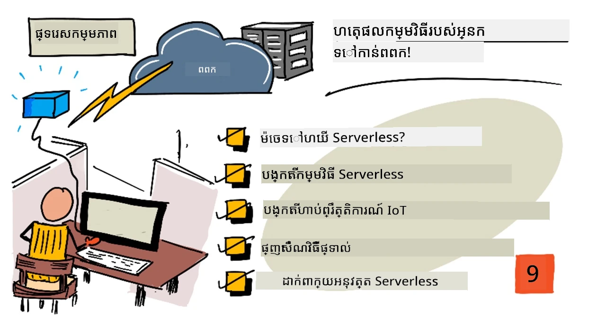
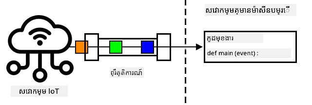
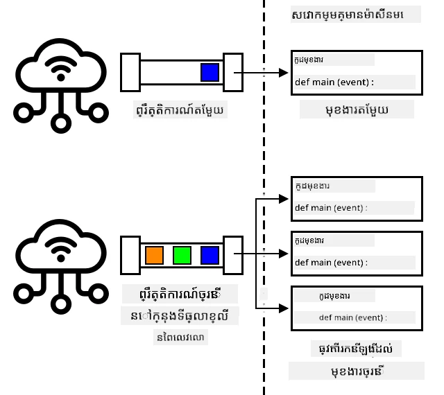
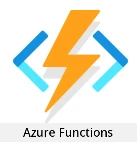
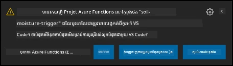

# ផ្លាស់ប្ដូរតុល្យភាពតម្រុយកម្មរបស់អ្នកទៅកាន់ពពក



> កំណត់ត្រារូបភាពដោយ [Nitya Narasimhan](https://github.com/nitya)។ ចុចលើរូបភាពសម្រាប់មើលទំហំធំជាងនេះ។


មេរៀននេះត្រូវបានបង្រៀនជាផ្នែកមួយនៃ [គម្រោង IoT សម្រាប់អ្នកចាប់ផ្តើម ភាគ ២ - ស៊េរីកសិក្សាពាណិជ្ជកម្មឌីជីថល](https://youtube.com/playlist?list=PLmsFUfdnGr3yCutmcVg6eAUEfsGiFXgcx) ពី [Microsoft Reactor](https://developer.microsoft.com/reactor/?WT.mc_id=academic-17441-jabenn)។

[](https://youtu.be/VVZDcs5u1_I)

## ការប្រលងមុនមេរៀន

[ការប្រលងមុនមេរៀន](https://black-meadow-040d15503.1.azurestaticapps.net/quiz/17)

## ការណែនាំ

ក្នុងមេរៀនមុន អ្នកបានរៀនពីរបៀបភ្ជាប់ការត្រួតពិនិត្យសំណើមដីរុក្ខជាតិ និងការត្រួតពិនិត្យចរន្តសំរាប់ relay ទៅកាន់សេវាកម្ម IoT នៅលើពពក។ ជំហានបន្ទាប់គឺផ្លាស់ប្ដូរកូដ server ដែលគ្រប់គ្រងកំណត់ពេលវេលារបស់ relay ទៅកាន់ពពក។ ក្នុងមេរៀននេះ អ្នកនឹងរៀនរបៀបធ្វើការនេះដោយប្រើមុខងារ serverless។

ក្នុងមេរៀននេះ យើងនឹងគ្របដណ្តប់៖

* [មុខងារ serverless គឺអ្វី?](#មុខងារ-serverless-គឺអ្វី)
* [បង្កើតកម្មវិធី serverless](#បង្កើតកម្មវិធី-serverless)
* [បង្កើតការបង្កើតរ៉ឺម៉្ស៊ីវវេនផ្ទៃក្នុង IoT Hub](#បង្កើតកម្មវិធីរំញ័រផ្សាយព្រឹត្តិការណ៍-iot-hub)
* [ផ្ញើការស្នើរសុំពិធីការ​ត្រង់ពីកូដ serverless](#ផ្ញើសំណើភាពdirect-method-ពីកូដ-serverless)
* [ដាក់បញ្ចូលកូដ serverless របស់អ្នកទៅពពក](#បោះពុម្ពកូដ-serverless-របស់អ្នកទៅមេឃ)

## មុខងារ serverless គឺអ្វី?

Serverless, ឬក៏កុំព្យូទ័រជាមួយមុខងារ serverless, មានន័យថាបង្កើតប្លុកតូចៗនៃកូដដែលត្រូវបានដំណើរការនៅលើពពកជាសន្ទស្សន៍នៃព្រឹត្តិការណ៍ផ្សេងៗ។ នៅពេលមានព្រឹត្តិការណ៍ កូដរបស់អ្នកត្រូវបានដំណើរការ និងផ្តល់ទិន្នន័យអំពីព្រឹត្តិការណ៍នោះ។ ព្រឹត្តិការណ៍ទាំងនេះអាចមកពីរឿងជាច្រើន ផ្សំឡើងពីការស្នើរសុំវេបសាយ, សារ​ដែលបានដាក់ក្នុងជួរ, ការផ្លាស់ប្តូរទិន្នន័យក្នុងមូលដ្ឋានទិន្នន័យ, ឬសារ​ដែលផ្ញើទៅសេវាកម្ម IoT ដោយឧបករណ៍ IoT។



> 💁 ប្រសិនបើអ្នកបានប្រើប្រាស់ការបង្កើតរ៉ឺម៉្ស៊ីវមូលដ្ឋានទិន្នន័យពីមុន អ្នកអាចគិតថាវាគឺដូចគ្នា បូកកូដដែលត្រូវបានបញ្ចេញដោយព្រឹត្តិការណ៍ដូចជាការបញ្ចូលជួរថ្មី។



កូដរបស់អ្នកត្រូវបានដំណើរការតែពេលមានព្រឹត្តិការណ៍ ប៉ុន្តែគ្មានអ្វីរក្សាកូដរបស់អ្នកឲ្យមានជីវិតនៅពេលផ្សេងទៀតទេ។ ព្រឹត្តិការណ៍កើតឡើង កូដរបស់អ្នកត្រូវបានផ្ទុកហើយដំណើរការ។ វាធ្វើអោយ serverless មានជម្រើសច្រើនក្នុងការពង្រីកកម្រិត - ប្រសិនបើព្រឹត្តិការណ៍ជាច្រើនកើតឡើងនៅពេលតែមួយ អ្នកផ្គត់ផ្គង់ពពកអាចដំណើរការមុខងាររបស់អ្នកបានច្រើនដងក្នុងពេលតែមួយលើម៉ាស៊ីនបំរើណាមួយដែលមានស្រាប់។ បញ្ហាគឺ ប្រសិនបើអ្នកត្រូវការចែករំលែកព័ត៌មានរវាងព្រឹត្តិការណ៍ អ្នកត្រូវរក្សាទុកវានៅកន្លែងដូចជា ពាក្យគំនូសមូលដ្ឋានទិន្នន័យ ប្រៀបធៀបនឹងរក្សាទុកវាក្នុងចងចាំ។

កូដរបស់អ្នកត្រូវបានសរសេរជាមុខងារដែលទទួលបានព័ត៌មានលម្អិតអំពីព្រឹត្តិការណ៍ជាពារ៉ាម៉ែត្រ។ អ្នកអាចប្រើភាសាកម្មវិធីផ្សេងៗជាច្រើនសម្រាប់សរសេរមុខងារ serverless ទាំងនេះ។

> 🎓 Serverless ក៏ត្រូវបានហៅថា Functions as a Service (FaaS) ព្រោះរាល់កម្មវិធី trigger event ត្រូវបានអនុវត្តជាមុខងារ នៅក្នុងកូដ។

ទោះបីមានឈ្មោះគេ Serverless តែវាក៏ប្រើម៉ាស៊ីនបម្រើផងដែរ។ ឈ្មោះនេះមានន័យថា អ្នកជាអ្នកអភិវឌ្ឍមិនចាំបាច់ព្រួយក្រ្រមខ្លួនអំពីម៉ាស៊ីនបម្រើដែលទាមទ្រចាំបាច់សម្រាប់ដំណើរការកូដរបស់អ្នកទេ ទាំងអស់គឺអ្នកក៏ចង់ឲ្យកូដរបស់អ្នកដំណើរការចំពោះព្រឹត្តិការណ៍ណាមួយ។ អ្នកផ្គត់ផ្គង់ពពកមាន runtime serverless ដែលគ្រប់គ្រងការផ្ដល់ម៉ាស៊ីនបម្រើ បណ្ដាញ ស្តុក CPU ចងចាំ និងអ្វីៗទៀតដែលត្រូវការដើម្បីដំណើរការកូដរបស់អ្នក។ ម៉ូដែលនេះមានអត្ថន័យថា អ្នកមិនអាចបង់ប្រាក់ជាម៉ាស៊ីនបម្រើសម្រាប់សេវាកម្មទេ ព្រោះគ្មានម៉ាស៊ីនបម្រើទេ។ ផលិតផលគឺអ្នកបង់ប្រាក់សម្រាប់ពេលវេលាកូដរបស់អ្នកដំណើរការ និងចំនួនចងចាំដែលប្រើ។

> 💰 Serverless ជារបៀបថ្លៃថោកមួយក្នុងការដំណើរការកូដលើពពក។ ឧទាហរណ៍ នៅពេលកំឡុងពេលសរសេរ អ្នកផ្គត់ផ្គង់ពពកមួយអនុញ្ញាតឲ្យមុខងារ serverless របស់អ្នកអាចដំណើរការប្រមាណ ១,០០០,០០០ ដងក្នុងមួយខែមុនពេលចាប់ផ្តើមគិតថ្លៃ ហើយបន្ទាប់ពីនោះគេគិតថ្លៃ US$0.20 សម្រាប់ការដំណើរការ ១,០០០,០០០ ដងនីមួយៗ។ នៅពេលកូដរបស់អ្នកមិនដំណើរការនោះ អ្នកមិនចាំបាច់បង់ប្រាក់ទេ។

ជាអ្នកអភិវឌ្ឍ IoT ម៉ូដែល serverless គឺល្អគួរឱ្យប្រើ។ អ្នកអាចសរសេរមុខងារមួយដែលត្រូវបានហៅចំពោះសារដែលផ្ញើពីឧបករណ៍ IoT ដែលភ្ជាប់ទៅសេវាកម្ម IoT របស់អ្នកនៅលើពពក។ កូដរបស់អ្នកនឹងព្យាយាមដោះស្រាយសារ​ទាំងអស់ដែលបានផ្ញើ តែដំណើរការតែនៅពេលត្រូវការតែប៉ុណ្ណោះ។

✅ ចង់រកមើលកូដដែលអ្នកបានសរសេរជាកូដ server ដែលស្តាប់សារជាមួយ MQTT។ តើវាអាចដំណើរការនៅលើពពកជាមួយ serverless បានយ៉ាងដូចម្តេច? តើអ្នកគិតថាកូដត្រូវបានផ្លាស់ប្ដូរយ៉ាងដូចម្តេចដើម្បីគាំទ្រការគណនាគ្រប់គ្រង Serverless?

> 💁 ម៉ូដែល serverless កំពុងផ្លាស់ប្ដូរទៅប្រើសេវាកម្មពពកផ្សេងទៀតផងនឹងការដំណើរការកូដ។ ឧទាហរណ៍ មានមូលដ្ឋានទិន្នន័យ serverless ដែលអាចប្រើបាននៅលើពពកជាមួយម៉ូដែលតម្លៃថ្លៃ serverless ដែលអ្នកបង់ប្រាក់តាមសំណើដែលបានធ្វើទៅកាន់មូលដ្ឋានទិន្នន័យ ដូចជា សំណួរ ឬក៏ការបញ្ចូល ពេលត្រូវការតម្លៃគិតជាការងារដែលបានអនុវត្ត។ ឧទាហរណ៍ ជម្រើសតែមួយនៃជួរមួយដែលស្វែងរកតាមគូនៃទិន្នន័យដើមមានតម្លៃថ្លៃតិចជាងប្រតិបត្តិការ מורכבת ដែលផ្សំតារាងជាច្រើន និងបង្រួមជួរយ៉ាងស្ទើរលាន។

## បង្កើតកម្មវិធី serverless

សេវាកម្មគណនាភាព Serverless ពី Microsoft ត្រូវបានហៅថា Azure Functions។



វីដេអូចាស់ខាងក្រោមមានការណែនាំសង្ខេបអំពី Azure Functions

[](https://www.youtube.com/watch?v=8-jz5f_JyEQ)

> 🎥 ចុចលើរូបភាពខាងលើដើម្បីមើលវីដេអូ

✅ ចំណាយពេលមួយមុខស្រាវជ្រាវ និងអានអតិថិជនអំពី Azure Functions នៅក្នុង [ឯកសាររបស់ Microsoft Azure Functions](https://docs.microsoft.com/azure/azure-functions/functions-overview?WT.mc_id=academic-17441-jabenn)។

ដើម្បីសរសេរ Azure Functions អ្នកចាប់ផ្តើមជាមួយកម្មវិធី Azure Functions សម្រាប់ភាសាដែលអ្នកចូលចិត្ត។ Azure Functions គាំទ្រភាសា Python, JavaScript, TypeScript, C#, F#, Java, និង Powershell។ នៅក្នុងមេរៀននេះ អ្នកនឹងរៀនរបៀបសរសេរកម្មវិធី Azure Functions ជាភាសា Python។

> 💁 Azure Functions ក៏គាំទ្រមុខងារចំណតផ្ទាល់ខ្លួន ដែលអនុញ្ញាតឲ្យអ្នកសរសេរមុខងាររបស់អ្នកជាភាសាណាមួយដែលគាំទ្រការស្នើសុំ HTTP រួមមានភាសាចាស់ៗដូចជា COBOL។

កម្មវិធី Functions មានមុខងារ *trigger* ច្រើនជាងមួយ - មុខងារតបតទៅនឹងព្រឹត្តិការណ៍។ អ្នកអាចមានច្រើន trigger ក្នុងកម្មវិធី Function មួយ ប្រើការកំណត់រួមគ្នា។ ឧទាហរណ៍ ក្នុងឯកសារកំណត់រចនាសម្ព័ន្ធសម្រាប់កម្មវិធី Functions របស់អ្នក អ្នកអាចមានព័ត៌មានភ្ជាប់ IoT Hub ហើយមុខងារទាំងអស់ក្នុងកម្មវិធី អាចប្រើវាដើម្បីភ្ជាប់ និងស្តាប់ព្រឹត្តិការណ៍។

### ការងារ - ដំឡើងឧបករណ៍ Azure Functions

> នៅពេលបិទការសរសេរ ឧបករណ៍កូដ Azure Functions មិនដំណើរការបានគ្រប់លក្ខណៈលើ Apple Silicon ជាមួយគម្រោង Python ទេ។ អ្នកត្រូវប្រើម៉ាស៊ីន Mac ចាស់តែ Intel, កុំព្យូទ័រវីនដូរ ឬកុំព្យូទ័រឡិនុកស៍។

មុខងារល្អមួយនៃ Azure Functions គឺ អ្នកអាចដំណើរការវាទៅក្នុងស្រុកបាន។ Runtime ដូចគ្នានៅពពកអាចដំណើរការតាមកុំព្យូទ័ររបស់អ្នក អនុញ្ញាតឲ្យអ្នកសរសេរកូដតបត្រូវសារពីឧបករណ៍ IoT ហើយដំណើរការវាទៅក្នុងស្រុក។ អ្នកអាច debug កូដរបស់អ្នកខណៈពេលព្រឹត្តិការណ៍ត្រូវបានដោះស្រាយផងដែរ។ បន្ទាប់ពីព្រមចិត្តនឹងកូដរបស់អ្នក វាអាចដាក់បញ្ចូលទៅពពកបាន។

ឧបករណ៍ Azure Functions ត្រូវបានផ្តល់ជាងជា CLI ដែលគេហៅថា Azure Functions Core Tools។

1. ដំឡើង Azure Functions core tools ដោយអនុវត្តតាមការណែនាំនៅក្នុង [ឯកសារអំពី Azure Functions Core Tools](https://docs.microsoft.com/azure/azure-functions/functions-run-local?WT.mc_id=academic-17441-jabenn)

1. ដំឡើងសកម្មភាព Azure Functions សម្រាប់ VS Code។ សកម្មភាពនេះផ្តល់ជំនួយក្នុងការបង្កើត, បញ្ឆោត, និងដាក់បញ្ចូល Azure functions។ សូមយោងទៅកាន់ [ឯកសារសកម្មភាព Azure Functions](https://marketplace.visualstudio.com/items?WT.mc_id=academic-17441-jabenn&itemName=ms-azuretools.vscode-azurefunctions) សម្រាប់ការណែនាំអំពីការដំឡើងសកម្មភាពនេះក្នុង VS Code។

ពេលអ្នកដាក់បញ្ចូលកម្មវិធី Azure Functions ទៅពពក វាត្រូវការប្រើមួយចំនួនតិចតួចនៃផ្ទុកពពកសម្រាប់រក្សារឿងដូចជា ឯកសារកម្មវិធី និងឯកសារហៅហៅ។ ពេលអ្នកដំណើរកម្មកម្មវិធី Functions នៅក្នុងស្រុក អ្នកត្រូវភ្ជាប់ទៅផ្ទុកពពកផងដែរ ប៉ុន្តែជំនួសការប្រើផ្ទុកពពកពិត អ្នកអាចប្រើកម្មវិធីក្លែងបន្លំផ្ទុកដែលមានឈ្មោះថា [Azurite](https://github.com/Azure/Azurite)។ វាដំណើរការនៅក្នុងស្រុកប៉ុន្តែមានលក្ខណៈដូចផ្ទុកពពក។

> 🎓 នៅក្នុង Azure ផ្ទុកដែល Azure Functions ប្រើប្រាស់គឺជាគណនី Azure Storage។ គណនីទាំងនេះអាចរក្សាទុកឯកសារ ឯកសារសារ data នៅក្នុងតារាង ឬ data នៅក្នុងជួរ។ អ្នកអាចចែករំលែកគណនីនេះរួមគ្នា រវាងកម្មវិធីជាច្រើន ដូចជា កម្មវិធី Functions និងកម្មវិធីវេបសាយ។

1. Azurite ជាកម្មវិធី Node.js ដូច្នេះអ្នកត្រូវដំឡើង Node.js។ អ្នកអាចរកមើលការទាញយកនិងការដំឡើងនៅលើ [គេហទំព័រ Node.js](https://nodejs.org/)។ ប្រសិនបើអ្នកប្រើ Mac អ្នកក៏អាចដំឡើងពី [Homebrew](https://formulae.brew.sh/formula/node) ផងដែរ។

1. ដំឡើង Azurite ដោយប្រើពាក្យបញ្ជាខាងក្រោម (`npm` ជាឧបករណ៍ដែលត្រូវបានដំឡើងពេលអ្នកដំឡើង Node.js):

    ```sh
    npm install -g azurite
    ```

1. បង្កើតថតឯកសារឈ្មោះ `azurite` សម្រាប់ Azurite ប្រើរក្សាទុកទិន្នន័យ:

    ```sh
    mkdir azurite
    ```

1. ដំណើរការ Azurite ហើយផ្ដល់ថតនេះជាអាគុយម៉ង់:

    ```sh
    azurite --location azurite
    ```

    កម្មវិធីកម្មវិធីក្លែងបន្លំផ្ទុក Azurite នឹងចាប់ផ្តើម និងរួចរាល់សម្រាប់ runtime Functions នៅក្នុងស្រុកភ្ជាប់។

    ```output
    ➜  ~ azurite --location azurite  
    Azurite Blob service is starting at http://127.0.0.1:10000
    Azurite Blob service is successfully listening at http://127.0.0.1:10000
    Azurite Queue service is starting at http://127.0.0.1:10001
    Azurite Queue service is successfully listening at http://127.0.0.1:10001
    Azurite Table service is starting at http://127.0.0.1:10002
    Azurite Table service is successfully listening at http://127.0.0.1:10002
    ```

### ការងារ - បង្កើតគម្រោង Azure Functions

CLI របស់ Azure Functions អាចប្រើសម្រាប់បង្កើតកម្មវិធី Functions ថ្មី។

1. បង្កើតថតសម្រាប់កម្មវិធី Functions របស់អ្នក ហើយចូលទៅក្នុងថតនោះ ហៅថា `soil-moisture-trigger`

    ```sh
    mkdir soil-moisture-trigger
    cd soil-moisture-trigger
    ```

1. បង្កើត virtual environment Python នៅក្នុងថតនេះ:

    ```sh
    python3 -m venv .venv
    ```

1. បើកកំណត់ virtual environment:

    * នៅលើ Windows:
        * ប្រសិនបើអ្នកប្រើ Command Prompt ឬ Command Prompt តាមរយៈ Windows Terminal អនុវត្ត៖

            ```cmd
            .venv\Scripts\activate.bat
            ```

        * ប្រសិនបើអ្នកប្រើ PowerShell អនុវត្ត៖

            ```powershell
            .\.venv\Scripts\Activate.ps1
            ```

    * នៅលើ macOS ឬ Linux អនុវត្ត៖

        ```cmd
        source ./.venv/bin/activate
        ```

    > 💁 ពាក្យបញ្ជាទាំងនេះត្រូវដំណើរការពីទីតាំងដដែលដែលបានប្រើបង្កើត virtual environment ។ អ្នកមិនចាំបាច់ចូលទៅក្នុងថត `.venv` ទេ គួរតែដំណើរការពាក្យបញ្ជា activate និងការតំឡើងថ្នាក់ឯកសារពីថតដែលអ្នកបានបង្កើតវា។

1. អនុវត្តពាក្យបញ្ជាខាងក្រោម ដើម្បីបង្កើតកម្មវិធី Functions នៅក្នុងថតនេះ៖

    ```sh
    func init --worker-runtime python soil-moisture-trigger
    ```

    វានឹងបង្កើតឯកសារ 3 នៅក្នុងថតបច្ចុប្បន្ន៖

    * `host.json` - ឯកសារផ្ទៃតំណរ JSON ដែលមានការកំណត់សម្រាប់កម្មវិធី Functions របស់អ្នក។ អ្នកមិនចាំបាច់កែប្រែការកំណត់ទាំងនេះឡើយ។
    * `local.settings.json` - ឯកសារផ្ទៃតំណរ JSON ដែលមានការកំណត់សម្រាប់កម្មវិធីរបស់អ្នកត្រូវប្រើនៅពេលដំណើរការនៅក្នុងស្រុកដូចជាប្រភេទតំណភ្ជាប់ទៅ IoT Hub។ ការកំណត់ទាំងនេះកំណត់នៅក្នុងស្រុក និងមិនគួរតែនាំចូលទៅកាន់គ្រប់គ្រងកូដ។ ពេលអ្នកដាក់បញ្ចូលកម្មវិធីទៅពពក ការកំណត់ទាំងនេះមិនត្រូវបានដាក់បញ្ចូលឡើយ ជំនួសដោយការផ្ទុកកំណត់ពីកំណត់កម្មវិធី។ វានឹងត្រូវបង្ហាញបន្ថែមបន្ទាប់។
    * `requirements.txt` - នេះគឺជា [ឯកសារទាមទារពី Pip](https://pip.pypa.io/en/stable/user_guide/#requirements-files) ដែលមានសំណុំថ្នាក់បណ្ណាល័យ Pip ដែលត្រូវរក្សាដើម្បីដំណើរការកម្មវិធី Functions របស់អ្នក។

1. ឯកសារ `local.settings.json` មានការកំណត់សម្រាប់គណនីផ្ទុកដែលកម្មវិធី Functions នឹងប្រើ។ នេះគឺអត្រាគ្មានសម្រាប់ការកំណត់ ដូច្នេះត្រូវកំណត់វា។ ដើម្បីភ្ជាប់ទៅ Azurite storage emulator ដែលដំណើរការនៅក្នុងស្រុក សូមកំណត់តម្លៃនេះទៅខាងក្រោម៖

    ```json
    "AzureWebJobsStorage": "UseDevelopmentStorage=true",
    ```

1. ដំឡើងថ្នាក់បណ្ណាល័យ Pip ត្រូវបានទាមទារដោយប្រើឯកសារ requirements៖

    ```sh
    pip install -r requirements.txt
    ```

    > 💁 ថ្នាក់បណ្ណាល័យ Pip ត្រូវតែមាននៅក្នុងឯកសារនេះ ដើម្បី runtime នៅពពកអាចធានាបានថាដំឡើងថ្នាក់បណ្ណាល័យត្រឹមត្រូវ។

1. ដើម្បីសាកល្បងថាអ្វីៗដំណើរការត្រឹមត្រូវ អ្នកអាចចាប់ផ្តើម runtime Functions ដោយអនុវត្តពាក្យបញ្ជាខាងក្រោម៖

    ```sh
    func start
    ```

    អ្នកនឹងឃើញ runtime ចាប់ផ្តើម និងរាយការណ៍ថាវាមិនបានឃើញមុខងារជាអ្នកធ្វើការងារ (trigger) ទេ។

    ```output
    (.venv) ➜  soil-moisture-trigger func start
    Found Python version 3.9.1 (python3).
    
    Azure Functions Core Tools
    Core Tools Version:       3.0.3442 Commit hash: 6bfab24b2743f8421475d996402c398d2fe4a9e0  (64-bit)
    Function Runtime Version: 3.0.15417.0
    
    [2021-05-05T01:24:46.795Z] No job functions found.
    ```

    > ⚠️ ប្រសិនបើអ្នកទទួលបានការជូនដំណឹង firewall សូមអនុញ្ញាតការចូលដំណើរការ រួច application `func` ត្រូវការអាចអាន និងសរសេរទៅបណ្តាញរបស់អ្នក។

    > ⚠️ ប្រសិនបើអ្នកប្រើ macOS អាចមានការព្រមានក្នុងលទ្ធផល៖
    >
    > ```output
    > (.venv) ➜  soil-moisture-trigger func start
    > Found Python version 3.9.1 (python3).
    >
    > Azure Functions Core Tools
    > Core Tools Version:       3.0.3442 Commit hash: 6bfab24b2743f8421475d996402c398d2fe4a9e0  (64-bit)
    > Function Runtime Version: 3.0.15417.0
    >
    > [2021-06-16T08:18:28.315Z] Cannot create directory for shared memory usage: /dev/shm/AzureFunctions
    > [2021-06-16T08:18:28.316Z] System.IO.FileSystem: Access to the path '/dev/shm/AzureFunctions' is denied. Operation not permitted.
    > [2021-06-16T08:18:30.361Z] No job functions found.
    > ```
    >
    > អ្នកអាចមិនចាំបាច់យកចិត្តទុកដាក់បើសិន runtime Functions ចាប់ផ្តើម។ ព័ត៌មានបន្ថែមស្តីពីបញ្ហានេះអាចមើលបាននៅ [Microsoft Docs Q&A](https://docs.microsoft.com/answers/questions/396617/azure-functions-core-tools-error-osx-devshmazurefu.html?WT.mc_id=academic-17441-jabenn)

1. បញ្ឈប់កម្មវិធី Functions ដោយចុច `ctrl+c`។

1. បើកថតបច្ចុប្បន្ននៅក្នុង VS Code ដោយបើក VS Code រួចបើកថតនេះ ឬដំណើរការពាក្យបញ្ជាខាងក្រោម៖

    ```sh
    code .
    ```

    VS Code នឹងរកឃើញគម្រោង Functions របស់អ្នក ហើយបង្ហាញការជូនដំណឹងថា:
    ```output
    Detected an Azure Functions Project in folder "soil-moisture-trigger" that may have been created outside of
    VS Code. Initialize for optimal use with VS Code?
    ```

    

    ជ្រើសរើស **Yes** ពីការជូនដំណឹងនេះ។

1. ប្រាកដថា Python virtual environment កំពុងរត់នៅក្នុង VS Code terminal។ បិទវា ហើយចាប់ផ្តើមឡើងវិញប្រសិនបើចាំបាច់។

## បង្កើតកម្មវិធីរំញ័រផ្សាយព្រឹត្តិការណ៍ IoT Hub

កម្មវិធី Functions គឺជាសែលរបស់កូដ serverless របស់អ្នក។ ដើម្បីឆ្លើយតបនឹងព្រឹត្តិការណ៍ IoT hub អ្នកអាចបន្ថែមកម្មវិធីរំញ័រផ្សាយព្រឹត្តិការណ៍ IoT Hub ទៅកម្មវិធីនេះ។ កម្មវិធីរំញ័រនេះត្រូវការតភ្ជាប់ទៅនឹងស្ទ្រីមសារដែលត្រូវបានផ្ញើទៅ IoT Hub ហើយឆ្លើយតបដល់វា។ ដើម្បីទទួលបានស្ទ្រីមសារនេះ កម្មវិធីរំញ័ររបស់អ្នកត្រូវការ​តភ្ជាប់ទៅ IoT Hubs *event hub compatible endpoint*។

IoT Hub គឺមានមូលដ្ឋានមួយទៀតលើសេវា Azure ដែលបានហៅថា Azure Event Hubs។ Event Hubs គឺជា​សេវា​ដែល​អនុញ្ញាត​ឱ្យ​អ្នក​ផ្ញើ​និង​ទទួល​សារ ប្រើ IoT Hub បន្ថែមលើនេះដើម្បីផ្តល់លក្ខណៈពិសេសសម្រាប់ឧបករណ៍ IoT។ វិធីដែលអ្នកភ្ជាប់ដើម្បីអានសារពី IoT Hub គឺដូចគ្នាដូចការប្រើប្រាស់ Event Hubs។

✅ ប្រែសម្រួលបន្តិច៖ អានទិដ្ឋភាពទូទៅនៃ Event Hubs ក្នុង [Azure Event Hubs documentation](https://docs.microsoft.com/azure/event-hubs/event-hubs-about?WT.mc_id=academic-17441-jabenn) ។ តើលក្ខណៈមូលដ្ឋានធៀបនឹង IoT Hub យ៉ាងដូចម្តេច?

សម្រាប់ឧបករណ៍ IoT ដើម្បីភ្ជាប់ទៅ IoT Hub វាត្រូវប្រើកូនសោសម្ងាត់ដែលធានាបានថាមានតែម្តងឧបករណ៍ដែលអនុញ្ញាតអាចភ្ជាប់បាន។ ដូចគ្នានេះ ក៏ពេលភ្ជាប់ដើម្បីអានសារកូដរបស់អ្នកត្រូវការខ្សែសង្វាក់ចំនួនមួយដែលមានកូនសោសម្ងាត់នៅក្នុងវា ជាមួយព័ត៌មានលម្អិតនៃ IoT Hub ផងដែរ។

> 💁 ខ្សែសង្វាក់ភ្ជាប់លំនាំដើមដែលអ្នកទទួលបានមានសិទ្ធិ **iothubowner** ដែលផ្តល់សិទ្ធិពេញលេញទៅកូដណាមួយដែលប្រើវាលើ IoT Hub។ ក្នុង ideally អ្នកគួរតែភ្ជាប់ជាមួយកម្រិតសិទ្ធិទាបបំផុតដែលចាំបាច់។ នេះនឹងត្រូវរៀបរាប់នៅមេរៀនបន្ទាប់។

ពេលដែលកម្មវិធីរំញ័ររបស់អ្នកបានភ្ជាប់រួច កូដនៅខាងក្នុងមុខងារនឹងត្រូវបានហៅសម្រាប់កំណត់ត្រាទាំងអស់ដែលបានផ្ញើទៅ IoT Hub មិនគិតថាឧបករណ៍ណាដែលបានផ្ញើវា។ កម្មវិធីរំញ័រនឹងទទួលសារជាពាក្យបញ្ជាទាល់តែ។

### បេសកកម្ម - ទទួលខ្សែសង្វាក់ភ្ជាប់ event hub compatible endpoint

1. ពី VS Code terminal ប្រតិបត្តិការបន្ទាប់ដើម្បីទទួលខ្សែសង្វាក់ភ្ជាប់សម្រាប់ IoT Hubs Event Hub compatible endpoint៖

    ```sh
    az iot hub connection-string show --default-eventhub \
                                      --output table \
                                      --hub-name <hub_name>
    ```

    ជំនួស `<hub_name>` ជាមួយឈ្មោះដែលអ្នកបានប្រើសម្រាប់ IoT Hub របស់អ្នក។

1. នៅក្នុង VS Code បើកឯកសារ `local.settings.json` បន្ថែមតម្លៃបន្ថែមខាងក្រោមនៅក្នុងផ្នែក `Values`៖

    ```json
    "IOT_HUB_CONNECTION_STRING": "<connection string>"
    ```

    ជំនួស `<connection string>` ជាមួយតម្លៃពីជំហានមុន។ អ្នកត្រូវបន្ថែមក្បៀសក្រោយជួរខាងលើដើម្បីធ្វើឲ្យវាជា JSON ត្រឹមត្រូវ។

### បេសកកម្ម - បង្កើតកម្មវិធីរំញ័រផ្សាយព្រឹត្តិការណ៍

ឥឡូវនេះអ្នកត្រៀមខ្លួនសម្រាប់បង្កើតកម្មវិធីរំញ័រផ្សាយព្រឹត្តិការណ៍។

1. ពី VS Code terminal ប្រតិបត្តិការបន្ទាប់ក្នុងថត `soil-moisture-trigger`៖

    ```sh
    func new --name iot-hub-trigger --template "Azure Event Hub trigger"
    ```

    វាបង្កើតមុខងារថ្មីឈ្មោះ `iot-hub-trigger`។ កម្មវិធីរំញ័រនឹងភ្ជាប់ទៅ Event Hub compatible endpoint នៅលើ IoT Hub ដូច្នេះអ្នកអាចប្រើកម្មវិធីរំញ័រផ្សាយព្រឹត្តិការណ៍ event hub។ មិនមានកម្មវិធីរំញ័រពិសេសសម្រាប់ IoT Hub ទេ។

វានឹងបង្កើតថតនៅក្នុងថត `soil-moisture-trigger` ដែលមានឈ្មោះ `iot-hub-trigger` ដែលមានមុខងារនេះ។ ថតនេះនឹងមានឯកសារខាងក្នុងដូចតទៅ៖

* `__init__.py` - នេះគឺជា​ឯកសារកូដ Python ដែលមានកម្មវិធីរំញ័រ ប្រើឈ្មោះឯកសារតាមប្រព័ន្ធ Python ដើម្បីបម្លែងថតនេះទៅជាមូឌុល Python មួយ។

    ឯកសារនេះនឹងមានកូដដូចខាងក្រោម៖

    ```python
    import logging

    import azure.functions as func


    def main(event: func.EventHubEvent):
        logging.info('Python EventHub trigger processed an event: %s',
                    event.get_body().decode('utf-8'))
    ```

    ការសំខាន់នៃកម្មវិធីរំញ័រគឺមុខងារ `main`។ នេះគឺជាមុខងារដែលត្រូវបានហៅជាមួយព្រឹត្តិការណ៍ពី IoT Hub។ មុខងារនេះមានប៉ារ៉ាម៉ែត្រមួយហៅថា `event` ដែលមានន័យថា `EventHubEvent`។ រៀងរាល់ពេលដែលសារត្រូវបានផ្ញើទៅ IoT Hub មុខងារនេះនឹងត្រូវបានហៅដោយផ្ញើសារនោះជាទីតាំង `event` ទៅដៃជាមួយគ្រប់គ្រងដែលស្រដៀងនឹងការបកស្រាយដែលអ្នកបានឃើញនៅមេរៀនមុន។

    ការសំខាន់នៃមុខងារនេះគឺកំណត់ហេតុព្រឹត្តិការណ៍។

* `function.json` - នេះរួមបញ្ចូលការកំណត់សម្រាប់កម្មវិធីរំញ័រ។ ការកំណត់សំខាន់គឺនៅផ្នែក `bindings`។ វាជាសាកសមនឹងការតភ្ជាប់រវាង Azure Functions និងសេវាផ្សេងៗ Azure។ កម្មវិធីនេះមាន input binding ទៅ event hub - វាភ្ជាប់ទៅ event hub ហើយទទួលទិន្នន័យ។

    > 💁 អ្នកអាចមាន output bindings ដែលធ្វើអោយការចេញពីមុខងារត្រូវផ្ញើទៅសេវាផ្សេងទៀត។ ឧទាហរណ៍ អ្នកអាចបន្ថែម output binding ទៅមូលដ្ឋានទិន្នន័យ ហើយបញ្ជូនព្រឹត្តិការណ៍ IoT Hub ពីមុខងារ ហើយវានឹងត្រូវបានបញ្ចូលដោយស្វ័យប្រវត្តិទៅមូលដ្ឋានទិន្នន័យ។

    ✅ ប្រែសម្រួលបន្តិច៖ អានអំពី bindings ក្នុង [Azure Functions triggers and bindings concepts documentation](https://docs.microsoft.com/azure/azure-functions/functions-triggers-bindings?WT.mc_id=academic-17441-jabenn&tabs=python)។

    ផ្នែក `bindings` រួមបញ្ចូលការកំណត់សម្រាប់ binding។ តម្លៃដែលគួរឱ្យចាប់អារម្មណ៍មាន៖

  * `"type": "eventHubTrigger"` - នេះប្រាប់មុខងារថាអ្នកត្រូវតបនឹងព្រឹត្តិការណ៍ពី Event Hub
  * `"name": "events"` - នេះជាឈ្មោះប៉ារ៉ាមែត្រដែលប្រើសម្រាប់ព្រឹត្តិការណ៍ Event Hub។ វาตรงនឹងឈ្មោះប៉ារ៉ាមែត្រ​ក្នុងម្ហងារ `main` ក្នុងកូដ Python។
  * `"direction": "in"` - នេះជាការចូល binding, ទិន្នន័យពី event hub មកក្នុងមុខងារ
  * `"connection": ""` - នេះកំណត់ឈ្មោះនៃការកំណត់ដើម្បីអានខ្សែសង្វាក់ភ្ជាប់។ ពេលរត់លើក្រោយវិញវានឹងអានការកំណត់នេះពីឯកសារ `local.settings.json` ។

    > 💁 ខ្សែសង្វាក់ភ្ជាប់មិនអាចរក្សាទុកនៅឯកសារ `function.json` បានទេ វាត្រូវតែអានពីការកំណត់។ នេះដើម្បីជៀសវាងករណីអ្នកបញ្ចេញខ្សែសង្វាក់ភ្ជាប់ដោយចៃដន្យ។

1. ដោយសារតែ [កោសិការណ៍ក្នុង template Azure Functions](https://github.com/Azure/azure-functions-templates/issues/1250) មានកម្លាំងមិនត្រឹមត្រូវសម្រាប់ `cardinality`។ សូមធ្វើបច្ចុប្បន្នភាពវានៅក្នុង `function.json` ពី `many` ទៅ `one`៖

    ```json
    "cardinality": "one",
    ```

1. បច្ចុប្បន្នភាពតម្លៃ `"connection"` ក្នុងឯកសារ `function.json` ដើម្បីបង្ហាញទៅកាន់តម្លៃថ្មីដែលបានបន្ថែមនៅក្នុង `local.settings.json`៖

    ```json
    "connection": "IOT_HUB_CONNECTION_STRING",
    ```

    > 💁 សូមចងចាំ - វាត្រូវបង្ហាញទៅកាន់ការកំណត់ មិនមែនជាខ្សែសង្វាក់ភ្ជាប់ពិតប្រាកដទេ។

1. ខ្សែសង្វាក់ភ្ជាប់មានតម្លៃ `eventHubName` ដូច្នេះតម្លៃនេះនៅក្នុងឯកសារ `function.json` ត្រូវតែទទេ។ សូមធ្វើបច្ចុប្បន្នភាពវាទៅជាខ្សែសង្វាក់ទទេ៖

    ```json
    "eventHubName": "",
    ```

### បេសកកម្ម - រត់កម្មវិធីរំញ័រព្រឹត្តិការណ៍

1. ប្រាកដថាអ្នកមិនបានដំណើរការកម្មវិធីមើលព្រឹត្តិការណ៍ IoT Hub ទេ។ ប្រសិនបើវាកំពុងដំណើរកាសហគ្រប់ជាមួយកម្មវិធី functions app កម្មវិធី functions app នឹងមិនអាចភ្ជាប់និងប្រើព្រឹត្តិការណ៍បានទេ។

    > 💁 អ្នកអាចច្រើនកម្មវិធីភ្ជាប់ទៅ IoT Hub endpoints ដោយប្រើ *consumer groups* ផ្សេងគ្នា។ នេះនឹងត្រូវរៀបរាប់នៅមេរៀនក្រោយ។

1. ដើម្បីដំណើរការ Functions app ប្រតិបត្តិការបន្ទាប់ពី VS Code terminal

    ```sh
    func start
    ```

    កម្មវិធី Functions នឹងចាប់ផ្តើម និងស្វែងរកមុខងារ `iot-hub-trigger`។ បន្ទាប់មកវានឹងដំណើរការព្រឹត្តិការណ៍ណាមួយដែលបានផ្ញើទៅ IoT Hub មុនមួយថ្ងៃ។

    ```output
    (.venv) ➜  soil-moisture-trigger func start
    Found Python version 3.9.1 (python3).
    
    Azure Functions Core Tools
    Core Tools Version:       3.0.3442 Commit hash: 6bfab24b2743f8421475d996402c398d2fe4a9e0  (64-bit)
    Function Runtime Version: 3.0.15417.0
    
    Functions:
    
            iot-hub-trigger: eventHubTrigger
    
    For detailed output, run func with --verbose flag.
    [2021-05-05T02:44:07.517Z] Worker process started and initialized.
    [2021-05-05T02:44:09.202Z] Executing 'Functions.iot-hub-trigger' (Reason='(null)', Id=802803a5-eae9-4401-a1f4-176631456ce4)
    [2021-05-05T02:44:09.205Z] Trigger Details: PartitionId: 0, Offset: 1011240-1011632, EnqueueTimeUtc: 2021-05-04T19:04:04.2030000Z-2021-05-04T19:04:04.3900000Z, SequenceNumber: 2546-2547, Count: 2
    [2021-05-05T02:44:09.352Z] Python EventHub trigger processed an event: {"soil_moisture":628}
    [2021-05-05T02:44:09.354Z] Python EventHub trigger processed an event: {"soil_moisture":624}
    [2021-05-05T02:44:09.395Z] Executed 'Functions.iot-hub-trigger' (Succeeded, Id=802803a5-eae9-4401-a1f4-176631456ce4, Duration=245ms)
    ```

    រៀងរាល់ការហៅមុខងារនឹងមានខ្នាត `Executing 'Functions.iot-hub-trigger'`/`Executed 'Functions.iot-hub-trigger'` ក្នុងលទ្ធផលបង្ហាញ ដូច្នេះអ្នកអាចមើលបានថាម៉េស្សេរ៉​ដែលត្រូវបានដំណើរការនៅក្នុងមុខងារនីមួយៗ។

1. ប្រាកដថាឧបករណ៍ IoT របស់អ្នកកំពុងរត់ អ្នកនឹងឃើញសារប្រេងសើមដីថ្មីប្រើបង្ហាញចូលក្នុង Functions app។

1. បិទ និងចាប់ផ្តើមឡើងវិញ Functions app អ្នកនឹងឃើញវានឹងមិនដំណើរការសារពីមុនទៀតទេ វានឹងដំណើរការសារថ្មីតែប៉ុណ្ណោះ។

> 💁 VS Code ក៏គាំទ្រការត្រួតពិនិត្យកំហុស Functions របស់អ្នកផងដែរ។ អ្នកអាចកំណត់ breakpoint ដោយចុចលើព្រំដែននៅដើមជួរនីមួយៗនៃកូដ ឬដាក់កឺស៊័រលើជួរលេខនិងជ្រើសរើស *Run -> Toggle breakpoint*, ឬចុច `F9`។ អ្នកអាចចាប់ផ្តើម debugger ដោយជ្រើសរើស *Run -> Start debugging*, ចុច `F5`, ឬជ្រើសរើសផ្ទាំង *Run and debug* ហើយចុចប៊ូតុង **Start debugging**។ ដោយធ្វើនេះ អ្នកអាចមើលព័ត៌មានលំអិតនៃព្រឹត្តិការណ៍ដែលកំពុងដំណើរការ។

#### ដោះស្រាយបញ្ហា

* ប្រសិនប្រសវាជួបកំហុសដូចខាងក្រោម៖

    ```output
    The listener for function 'Functions.iot-hub-trigger' was unable to start. Microsoft.WindowsAzure.Storage: Connection refused. System.Net.Http: Connection refused. System.Private.CoreLib: Connection refused.
    ```

    ពិនិត្យថា Azurite កំពុងរត់ និងអ្នកបានកំណត់ `AzureWebJobsStorage` នៅក្នុងឯកសារ `local.settings.json` ទៅជា `UseDevelopmentStorage=true`។

* ប្រសិនបើបានកំហុសដូចខាងក្រោម៖

    ```output
    System.Private.CoreLib: Exception while executing function: Functions.iot-hub-trigger. System.Private.CoreLib: Result: Failure Exception: AttributeError: 'list' object has no attribute 'get_body'
    ```

    ពិនិត្យថាអ្នកបានកំណត់ `cardinality` នៅក្នុងឯកសារ `function.json` ទៅជា `one`។

* ប្រសិនបើបានកំហុសដូចខាងក្រោម៖

    ```output
    Azure.Messaging.EventHubs: The path to an Event Hub may be specified as part of the connection string or as a separate value, but not both.  Please verify that your connection string does not have the `EntityPath` token if you are passing an explicit Event Hub name. (Parameter 'connectionString').
    ```

    ពិនិត្យថាអ្នកបានកំណត់ `eventHubName` នៅក្នុងឯកសារ `function.json` ទៅជាស្ទ្រីងទទេ។

## ផ្ញើសំណើភាពdirect method ពីកូដ serverless

មកដល់ពេលនេះ Functions app របស់អ្នកកំពុងស្ដាប់សារពី IoT Hub ដោយប្រើ Event Hub compatible end point។ ឥឡូវនេះអ្នកត្រូវផ្ញើពាក្យបញ្ជាទៅឧបករណ៍ IoT។ វាគឺធ្វើបានដោយប្រើការភ្ជាប់ខុសទៅ IoT Hub តាមរយៈ *Registry Manager*។ Registry Manager គឺជាឧបករណ៍ដែលអនុញ្ញាតឲ្យអ្នកមើលឧបករណ៍ដែលបានចុះបញ្ជីជាមួយ IoT Hub ហើយទំនាក់ទំនងជាមួយឧបករណ៍ដោយផ្ញើសារ cloud to device, សំណើភាព direct method ឬធ្វើបច្ចុប្បន្នភាព device twin។ អ្នកអាចប្រើវាដើម្បីចុះបញ្ជី បច្ចុប្បន្នភាព ឬលុបឧបករណ៍ IoT ពី IoT Hub ផងដែរ។

ដើម្បីភ្ជាប់ទៅ Registry Manager អ្នកត្រូវការខ្សែសង្វាក់ភ្ជាប់មួយ។

### បេសកកម្ម - ទទួលខ្សែសង្វាក់ភ្ជាប់ Registry Manager

1. ដើម្បីទទួលខ្សែសង្វាក់ភ្ជាប់ ប្រតិបត្តិការបន្ទាប់៖

    ```sh
    az iot hub connection-string show --policy-name service \
                                      --output table \
                                      --hub-name <hub_name>
    ```

    ជំនួស `<hub_name>` ជាមួយឈ្មោះដែលអ្នកបានប្រើសម្រាប់ IoT Hub របស់អ្នក។

    ខ្សែសង្វាក់ភ្ជាប់ត្រូវបានស្នើសុំសម្រាប់គោលការណ៍ *ServiceConnect* ដោយប្រើប៉ារ៉ាម៉ែត្រ `--policy-name service`។ នៅពេលអ្នកស្នើសុំខ្សែសង្វាក់ភ្ជាប់ អ្នកអាចបញ្ជាក់ពីសិទ្ធិដែលខ្សែសង្វាក់នោះអនុញ្ញាត។ គោលការណ៍ ServiceConnect អនុញ្ញាតឲ្យកូដរបស់អ្នកភ្ជាប់និងផ្ញើសារទៅឧបករណ៍ IoT ។

    ✅ ប្រែសម្រួលបន្តិច៖ អានអំពីគោលការណ៍ផ្សេងៗក្នុង [IoT Hub permissions documentation](https://docs.microsoft.com/azure/iot-hub/iot-hub-devguide-security#iot-hub-permissions?WT.mc_id=academic-17441-jabenn)

1. នៅក្នុង VS Code បើកឯកសារ `local.settings.json` បន្ថែមតម្លៃបន្ថែមនៅក្នុងផ្នែក `Values`៖

    ```json
    "REGISTRY_MANAGER_CONNECTION_STRING": "<connection string>"
    ```

    ជំនួស `<connection string>` ជាមួយតម្លៃពីជំហានមុន។ អ្នកត្រូវបន្ថែមក្បៀសក្រោយជួរខាងលើដើម្បីធ្វើឲ្យវាជា JSON ត្រឹមត្រូវ។

### បេសកកម្ម - ផ្ញើសំណើភាពdirect method ទៅឧបករណ៍

1. SDK សម្រាប់ Registry Manager មានស្រាប់តាមប៉ាកេជ៍ Pip។ បន្ថែមបន្ទាត់ខាងក្រោមទៅឯកសារ `requirements.txt` ដើម្បីបន្ថែមការពឹងផ្អែកលើប៉ាកេជ៍នេះ៖

    ```sh
    azure-iot-hub
    ```

1. ប្រាកដថា VS Code terminal មាន virtual environment ដំណើរការហើយ ប្រតិបត្តិការបន្ទាប់ដើម្បីដំឡើងប៉ាកេជ៍ Pip៖

    ```sh
    pip install -r requirements.txt
    ```

1. បន្ថែមការនាំចូលខាងក្រោមទៅឯកសារ `__init__.py`៖

    ```python
    import json
    import os
    from azure.iot.hub import IoTHubRegistryManager
    from azure.iot.hub.models import CloudToDeviceMethod
    ```

    នេះនាំចូលបណ្ណាល័យប្រព័ន្ធមួយចំនួន​ បូករួមជាមួយបណ្ណាល័យសម្រាប់ធ្វើប្រតិបត្តិការជាមួយ Registry Manager និងផ្ញើសំណើភាពdirect method។

1. ដកកូដនៅខាងក្នុងមុខងារ `main` ចេញ ប៉ុន្តែរក្សាភាពជាមុខងារទុក។

1. នៅក្នុងមុខងារ `main` បន្ថែមកូដខាងក្រោម៖

    ```python
    body = json.loads(event.get_body().decode('utf-8'))
    device_id = event.iothub_metadata['connection-device-id']

    logging.info(f'Received message: {body} from {device_id}')
    ```

    កូដនេះយកសាច់ព្រឹត្តិការណ៍ដែលមានសារជា JSON ផ្ញើដោយឧបករណ៍ IoT។

    បន្ទាប់មកទទួល device ID ពី annotations ដែលបានផ្ញើជាមួយសារ។ សាច់ព្រឹត្តិការណ៍មានសារដែលបានផ្ញើជាទელები `iothub_metadata` វត្ថុឯកសារអ្នកផ្ញើរសារ IoT Hub ពី device ID របស់អ្នកផ្ញើ និងពេលវេលាដែលសារត្រូវបានផ្ញើ។

    ព័ត៌មាននេះបន្ទាប់មកត្រូវបានកត់ត្រា។ អ្នកនឹងឃើញកំណត់ហេតុនេះនៅក្នុង terminal ពេលដែលដំណើរការ Functions app នៅក្នុងកន្លែង។

1. ក្រោមនេះ បន្ថែមកូដខាងក្រោម៖

    ```python
    soil_moisture = body['soil_moisture']

    if soil_moisture > 450:
        direct_method = CloudToDeviceMethod(method_name='relay_on', payload='{}')
    else:
        direct_method = CloudToDeviceMethod(method_name='relay_off', payload='{}')
    ```

    កូដនេះបានទទួលប្រេងសើមដីពីសារ។ បន្ទាប់មកវាប្រើប្រាស់ចំនួនប្រេងសើមដី ហើយគិតលើតម្លៃ ដើម្បីបង្កើតបន្ទះជំនួយសម្រាប់សំណើភាពdirect method របស់ `relay_on` ឬ `relay_off` ទៅ direct method។ សំណើភាពdirect method មិនត្រូវការសមាសធាតុ payload ទេ ដូច្នេះបញ្ជូនឯកសារ JSON ទទេ។

1. ក្រោមនេះបន្ថែមកូដខាងក្រោម៖

    ```python
    logging.info(f'Sending direct method request for {direct_method.method_name} for device {device_id}')

    registry_manager_connection_string = os.environ['REGISTRY_MANAGER_CONNECTION_STRING']
    registry_manager = IoTHubRegistryManager(registry_manager_connection_string)
    ```

    កូដនេះផ្ទុក `REGISTRY_MANAGER_CONNECTION_STRING` ពីឯកសារ `local.settings.json`។ តម្លៃនៅក្នុងឯកសារនេះត្រូវបានប្រែប្រួលជា environment variables ហើយអាចអានបានដោយប្រើមុខងារ `os.environ` ដែលជាមុខងារដែលបង្វិលត្រឡប់វាលើមេគុណនៃឡានព័ទ័របរិស្ថានទាំងអស់។

    > 💁 ពេលដែលកូដនេះដាក់លើ cloud តម្លៃក្នុង `local.settings.json` នឹងត្រូវបានកំណត់ជា *Application Settings* ហើយអាចអានពីម៉ាស៊ីន​បរិស្ថាន។

    កូដបន្ទាប់បង្កើតវត្ថុ Registry Manager helper តាមខ្សែសង្វាក់ភ្ជាប់។

1. ក្រោមនេះបន្ថែមកូដខាងក្រោម៖

    ```python
    registry_manager.invoke_device_method(device_id, direct_method)

    logging.info('Direct method request sent!')
    ```

    កូដនេះប្រាប់ registry manager ផ្ញើសំណើភាពdirect method ទៅឧបករណ៍ដែលបានផ្ញើសារទេលិម៉េត្រនេះ។
> 💁 នៅក្នុងកំណែកម្មវិធីដែលអ្នកបានបង្កើតនៅមេរៀនមុន ដោយប្រើ MQTT ការបញ្ជាការត្រួតបញ្ជារេលីបានបញ្ជូនទៅឧបករណ៍ទាំងអស់។ កូដនេះបានកំណត់ថាអ្នកនឹងមានឧបករណ៍តែមួយតែប៉ុណ្ណោះ។ កូដនេះបានផ្ញើសំណើវិធីសាស្ត្រ (method request) ទៅឧបករណ៍តែមួយ ដូច្នេះវានឹងដំណើរការបើអ្នកមានច្រើនការតំឡើងរបស់ឧបករណ៍សឺនស័រជាតិហូម៉្ស័រ (moisture sensors) និងរេលី ដើម្បីផ្ញើសំណើវិធីសាស្ត្រប្រកបដោយភាពត្រឹមត្រូវទៅឧបករណ៍ត្រឹមត្រូវ។

1. ដំណើរការកម្មវិធី Functions ហើយធ្វើឱ្យប្រាកដថាឧបករណ៍ IoT របស់អ្នកកំពុងផ្ញើទិន្នន័យ។ អ្នកនឹងឃើញសារៗត្រូវបានដំណើរការនិងសំណើវិធីសាស្ត្រផ្ទាល់ត្រូវបានផ្ញើ។ ផ្លាស់ប្ដូរសឺនស័រជាតិហូម៉្ស័រចូលនិងចេញពីដីដើម្បីមើលតម្លៃបង្វិលប្ដូរនិងពន្លឿនរេលីបើកបិទ។

> 💁 អ្នកអាចរកកូដនេះនៅក្នុងថត [code/functions](../../../../../2-farm/lessons/5-migrate-application-to-the-cloud/code/functions)។

## បោះពុម្ពកូដ serverless របស់អ្នកទៅមេឃ

កូដរបស់អ្នកឥឡូវនេះដំណើរការជាលokalហើយ ដំណាក់កាលបន្ទាប់គឺបោះពុម្ពកម្មវិធី Functions ទៅមេឃ។

### បុគ្គលិក - បង្កើតធនធានមេឃ

កម្មវិធី Functions របស់អ្នកត្រូវបានបាញ់ទៅធនធាន Functions App នៅក្នុង Azure ដែលរស់នៅក្នុង Resource Group ដែលអ្នកបានបង្កើតសម្រាប់ IoT Hub របស់អ្នក។ អ្នកនឹងត្រូវការបង្កើត Storage Account នៅ Azure ដើម្បីជំនួសឯកសារលេងតំណាងដែលអ្នកកំពុងដំណើរការជាលokal។

1. រត់ពាក្យបញ្ជាដូចខាងក្រោមដើម្បីបង្កើត Storage Account:

    ```sh
    az storage account create --resource-group soil-moisture-sensor \
                              --sku Standard_LRS \
                              --name <storage_name> 
    ```

    ជំនួស `<storage_name>` ជាមួយឈ្មោះសម្រាប់ Storage Account របស់អ្នក។ ឈ្មោះនេះត្រូវតែមានភាពតែមួយលើសកល ដើម្បីធ្វើជាផ្នែកនៃ URL ដែលប្រើចូលមើល Storage Account។ អ្នកអាចប្រើត្រឹមតែនាករតូច និងលេខសម្រាប់ឈ្មោះនេះ ប៉ុណ្ណោះ មិនអាចប្រើតួអក្សរ ផ្សេងទៀត និងវាមានកំរិត 24 តួអក្សរ។ ប្រើអ្វីមួយដូចជា `sms` ហើយបន្ថែមអត្តសញ្ញាណដ៏តែមួយនៅចុង ដូចជាពាក្យចៃដន្យ ឬឈ្មោះរបស់អ្នក។

    ជម្រើស `--sku Standard_LRS` ជ្រើសស្រទាប់តម្លៃតម្លៃ ដោយជ្រើសគណនីទូទៅដែលមានតម្លៃទាបបំផុត។ គ្មានស្រទាប់សេវាឥតគិតថ្លៃសម្រាប់ Storage ទេ ហើយអ្នកត្រូវបង់ប្រាក់ចំពោះការប្រើប្រាស់របស់អ្នក។ តម្លៃសេវាធៀបបានថាជាទាប ដោយ Storage ដែលថ្លៃបំផុតមានថ្លៃតិចជាង US$0.05 ក្នុងមួយខែសម្រាប់រាល់ចំណុះគីឡូបៃត់។

    ✅ អានស្តីពីតម្លៃនៅលើ [ទំព័រពាណិជ្ជកម្ម Azure Storage Account](https://azure.microsoft.com/pricing/details/storage/?WT.mc_id=academic-17441-jabenn)

1. រត់ពាក្យបញ្ជាដូចខាងក្រោមដើម្បីបង្កើត Function App:

    ```sh
    az functionapp create --resource-group soil-moisture-sensor \
                          --runtime python \
                          --functions-version 3 \
                          --os-type Linux \
                          --consumption-plan-location <location> \
                          --storage-account <storage_name> \
                          --name <functions_app_name>
    ```

    ជំនួស `<location>` ជាមួយទីតាំងដែលអ្នកប្រើនៅពេលបង្កើត Resource Group នៅមេរៀនមុន។

    ជំនួស `<storage_name>` ជាមួយឈ្មោះ Storage Account ដែលអ្នកបានបង្កើតនៅជំហានមុន។

    ជំនួស `<functions_app_name>` ជាមួយឈ្មោះតែមួយសម្រាប់ Functions App របស់អ្នក។ ឈ្មោះនេះត្រូវតែមានភាពសំខាន់លើសកល ដើម្បីជាផ្នែកមួយនៃ URL ដែលអាចប្រើបានចូល Functions App។ ប្រើអ្វីមួយដូចជា `soil-moisture-sensor-` ហើយបន្ថែមអត្តសញ្ញាណតែមួយនៅចុង ដូចជាពាក្យចៃដន្យ ឬឈ្មោះរបស់អ្នក។

    ជម្រើស `--functions-version 3` កំណត់កំណែ Azure Functions ដែលត្រូវប្រើ។ កំណែ 3 ជាកំណែចុងក្រោយ។

    ជម្រើស `--os-type Linux` ប្រាប់Runtime Functions ឱ្យប្រើ Linux ជា OS សម្រាប់រៀបចំការងារទាំងនេះ។ Functions អាចរៀបចំលើ Linux ឬ Windows ផ្ទេខុំភាសាកម្មវិធីដែលប្រើ។ កម្មវិធី Python គ្រាន់តែនាំគាំទ្រលើ Linux ប៉ុណ្ណោះ។

### បុគ្គលិក - ផ្ទុកឡើងការកំណត់កម្មវិធីរបស់អ្នក

ពេលអ្នកអភិវឌ្ឍ Functions App របស់អ្នក អ្នកបានរក្សាទុកកំណត់មួយចំនួននៅក្នុងឯកសារ `local.settings.json` សម្រាប់ខ្សែការតភ្ជាប់ទៅ IoT Hub របស់អ្នក។ ការកំណត់ទាំងនេះត្រូវបានសរសេរទៅ Application Settings នៅក្នុង Functions App របស់អ្នកនៅ Azure ដើម្បីអាចប្រើប្រាស់ដោយកូដរបស់អ្នក។

> 🎓 ឯកសារ `local.settings.json` សម្រាប់កំណត់ការអភិវឌ្ឍន៍ក្នុងលokalប៉ុណ្ណោះ ហើយមិនគួរត្រូវបានផ្ទុកទៅក្នុងត្រគាប់គ្រប់គ្រងកូដ ដូចជា GitHub។ ពេលបាញ់ទៅមេឃ ការកំណត់កម្មវិធី (Application Settings) ត្រូវបានប្រើ។ ការកំណត់កម្មវិធីគឺជាគំពីត/តម្លៃដែលរក្សាទុកក្នុងមេឃ ហើយត្រូវបានអានពីហេតុការណ៍បរិស្ថាន ឬក្នុងកូដ ឬមេរៀនពេលភ្ជាប់កូដទៅ IoT Hub។

1. រត់ពាក្យបញ្ជាលើសម្រាប់កំណត់ `IOT_HUB_CONNECTION_STRING` នៅក្នុង Function App Application Settings៖

    ```sh
    az functionapp config appsettings set --resource-group soil-moisture-sensor \
                                          --name <functions_app_name> \
                                          --settings "IOT_HUB_CONNECTION_STRING=<connection string>"
    ```

    ជំនួស `<functions_app_name>` ជាមួយឈ្មោះដែលអ្នកបានប្រើសម្រាប់ Functions App របស់អ្នក។

    ជំនួស `<connection string>` ជាមួយតម្លៃ `IOT_HUB_CONNECTION_STRING` ពីឯកសារ `local.settings.json` របស់អ្នក។

1. ធ្វើដូចជំហានខាងលើម្តងទៀត ដោយកំណត់តម្លៃ `REGISTRY_MANAGER_CONNECTION_STRING` ជាមួយតម្លៃដែលសមរម្យពីឯកសារ `local.settings.json` របស់អ្នក។

ពេលអ្នកដំណើរការបញ្ជាទាំងនេះ វានឹងបង្ហាញបញ្ជី Application Settings ទាំងអស់សម្រាប់ function app។ អ្នកអាចប្រើវាទៅពិនិត្យថាតម្លៃបានកំណត់ត្រឹមត្រូវ។

> 💁 អ្នកនឹងឃើញតម្លៃដែលបានកំណត់សម្រាប់ `AzureWebJobsStorage` រួចមក។ នៅក្នុងឯកសារ `local.settings.json` វាត្រូវបានកំណត់ទៅតម្លៃសម្រាប់ប្រើមេរៀនstorage emulator។ ពេលបង្កើត Functions App អ្នកផ្ញើ Storage Account ជាពារ៉ាម៉ែត្រ និងវាត្រូវបានកំណត់ជាស្វ័យប្រវត្តិនៅក្នុងការកំណត់នេះ។

### បុគ្គលិក - បោះពុម្ព Functions App របស់អ្នកទៅមេឃ

ឥឡូវនេះ Functions App ប្រាកដភាពរួច រាល់ កូដរបស់អ្នកអាចបោះពុម្ពទៅមេឃបាន។

1. រត់បញ្ជាដូចខាងក្រោម ពីтерមិន VS Code ដើម្បីផ្សព្វផ្សាយ Functions App របស់អ្នក:

    ```sh
    func azure functionapp publish <functions_app_name>
    ```

    ជំនួស `<functions_app_name>` ជាមួយឈ្មោះដែលអ្នកបានប្រើសម្រាប់ Functions App របស់អ្នក។

កូដនឹងត្រូវបានភ្ជាប់បញ្ចូល ហើយផ្ញើទៅ Functions App ដែលនឹងត្រូវបានបោះពុម្ព និងចាប់ផ្តើម។ នឹងមានការបង្ហាញលម្អិតនៅក្នុង Solo ហើយបញ្ចប់ជាមួយការបញ្ជាក់ពីការបោះពុម្ព និងបញ្ជីរបស់ function ដែលបានបោះពុម្ព។ ក្នុងករណីនេះ បញ្ជីនឹងមានតែ trigger ប៉ុណ្ណោះ។

```output
Deployment successful.
Remote build succeeded!
Syncing triggers...
Functions in soil-moisture-sensor:
    iot-hub-trigger - [eventHubTrigger]
```

ធ្វើឱ្យប្រាកដថាឧបករណ៍ IoT របស់អ្នកកំពុងដំណើរការ។ ប្រែប្រួលកម្រិតជាតិហូម៉្ស័រដោយកែប្រែជាតិហូម៉្ស័រដី ឬផ្លាស់ប្ដូរសឺនស័រចេញនិងចូលក្នុងដី។ អ្នកនឹងឃើញរេលីបើក និងបិទ ជាមួយនឹងការផ្លាស់ប្ដូរ ជាតិហូម៉្ស័រ។

---

## 🚀 ការប្រកួតប្រជែង

នៅមេរៀនមុន អ្នកបានគ្រប់គ្រងពេលវេលាសម្រាប់រេលី ដោយមិនចូលរួមក្នុងសាររបស់ MQTT នៅពេលរេលីដំណើរការ និងរយៈពេលខ្លីបន្ទាប់ពីវាត្រូវបានបិទ។ អ្នកមិនអាចប្រើវិធីនេះនៅទីនេះទេ - អ្នកមិនអាចបដិសេធ trigger IoT Hub របស់អ្នកបានទេ។

សូមគិតពីវិធីផ្សេងៗដែលអ្នកអាចគ្រប់គ្រងវានៅក្នុង Functions App របស់អ្នក។

## សំណួរបន្ទាប់មេរៀន

[សំណួរបន្ទាប់មេរៀន](https://black-meadow-040d15503.1.azurestaticapps.net/quiz/18)

## ស្រាវជ្រាវ និងសិក្សាផ្ទាល់ខ្លួន

* អានស្តីពីកំណត់គណនេយ្យ serverless នៅលើ [ទំព័រគណនេយ្យ Serverless នៅវិគីភីឌា](https://wikipedia.org/wiki/Serverless_computing)
* អានអំពីការប្រើ serverless នៅ Azure រួមទាំងគំរូបន្ថែមនៅលើ [អត្ថបទប្លុក Go serverless សម្រាប់តម្រូវការរបស់អ្នក IoT នៅ Azure](https://azure.microsoft.com/blog/go-serverless-for-your-iot-needs/?WT.mc_id=academic-17441-jabenn)
* រៀនបន្ថែមអំពី Azure Functions នៅលើ [បណ្តាញហ្វេიშប៊ុក Azure Functions](https://www.youtube.com/c/AzureFunctions)

## ការងារ

[បន្ថែមការគ្រប់គ្រងរេលីដោយដៃ](assignment.md)

---

<!-- CO-OP TRANSLATOR DISCLAIMER START -->
**ការបដិសេធ**៖  
ឯកសារនេះបានបកប្រែដោយប្រើសេវាកម្មបកប្រែ AI [Co-op Translator](https://github.com/Azure/co-op-translator)។ ទោះបីជា​យើងខ្ញុំ​ព្យាយាម​ឲ្យ​បាន​គ្រប់ភាព​ត្រឹម​ត្រូវ ក៏សូម​ជ្រាប​ថា​ការបកប្រែ​ស្វ័យប្រវត្តិ​អាចមានកំហុស ឬ​ពុំ​ត្រឹមត្រូវ។ ឯកសារដើមនៅភាសាតំណើរបានគួរឱ្យយកជាឧត្តមមូលដ្ឋាន។ សម្រាប់ព័ត៌មានសំខាន់ៗ ការបកប្រែ​ដោយអ្នកជំនាញមនុស្សត្រូវបានផ្តល់អនុសាសន៍។ យើងមិនទទួលខុសត្រូវចំពោះការយល់ច្រឡំនិងការបកអាម៉ាស់ទៅពីការប្រើប្រាស់ការបកប្រែនេះឡើយ។
<!-- CO-OP TRANSLATOR DISCLAIMER END -->