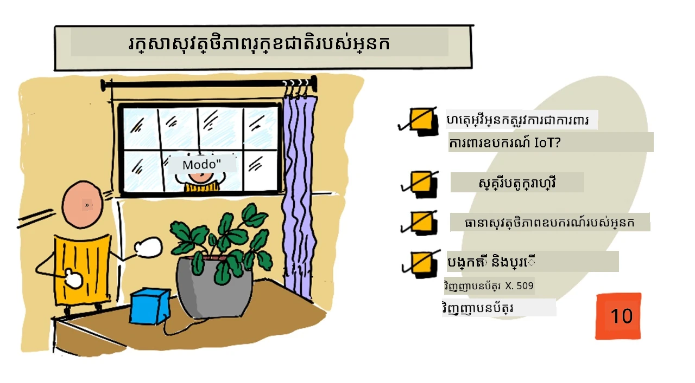
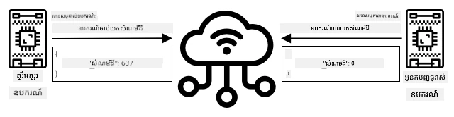
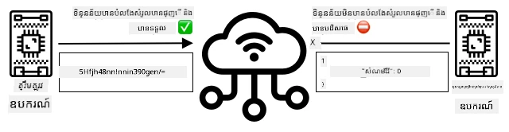
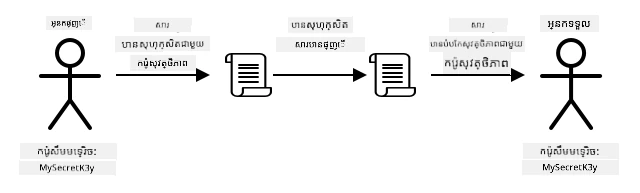
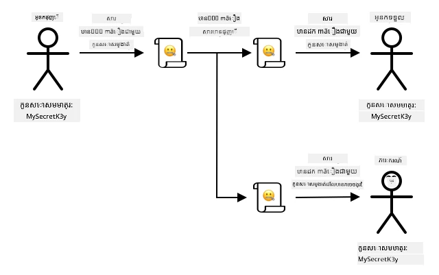
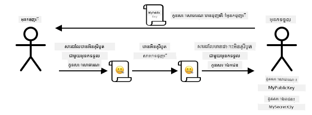
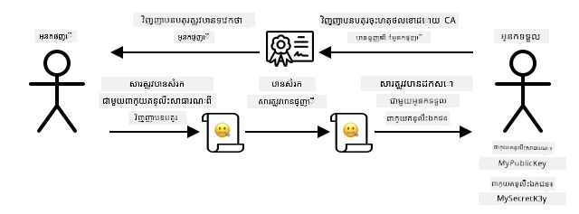

# រក្សាស្លាបព្រាលរបស់អ្នកឱ្យមានសុវត្ថិភាព



> Sketchnote by [Nitya Narasimhan](https://github.com/nitya). Click the image for a larger version.

## Pre-lecture quiz

[Pre-lecture quiz](https://black-meadow-040d15503.1.azurestaticapps.net/quiz/19)

## អំណើប្រើប្រាស់

នៅក្នុងមេរៀនចុងក្រោយអ្នកបានបង្កើតឧបករណ៍ IoT ត្រួតពិនិត្យដី និងភ្ជាប់វាទៅកាន់ពពក។ ប៉ុន្តែតើអ្នកគិតថា ប្រសិនបើអ្នកចោរកម្មដែលធ្វើការសម្រាប់កសិដ្ឋានប្រេទផ្សារ អាចយកការត្រួតគ្រប់គ្រងឧបករណ៍ IoT របស់អ្នកបានហ្នឹង? តើខ្លាតទេបើពួកគេស្នើសូមលម្អីផ្នែកសីតុណ្ហភាពដីខ្ពស់ ដូច្នេះរុក្ខជាតិរបស់អ្នកមិនដែលទទួលបានទឹកឡើយ ឬបើពួកគេបើកប្រព័ន្ធចាក់ទឹករបស់អ្នកដំណើរការអស់ពេលវេលា រុក្ខជាតិរបស់អ្នកអាចស្លាប់ដោយសារទទួលទឹកច្រើនពេក ហើយមានការចំណាយទឹកប្រហែលជា ឯកសារតូចមួយ?

នៅក្នុងមេរៀននេះ អ្នកនឹងរៀនអំពីការរក្សាឧបករណ៍ IoT ឱ្យមានសុវត្ថិភាព។ ដោយសារនេះគឺជាថ្នាក់ទីចុងក្រោយសម្រាប់គម្រោងនេះ អ្នកនឹងរៀនអំពីរបៀបសម្អាតធនធានពពករបស់អ្នក ដើម្បីកាត់បន្ថយការចំណាយដែលអាចកើតមាន។

នៅក្នុងមេរៀននេះយើងនឹងលើកឡើង៖

* [ហេតុអ្វីបានជាអ្នកត្រូវការអោយឧបករណ៍ IoT មានសុវត្ថិភាព?](#ហេតុអ្វីបានជាអ្នកត្រូវការអោយឧបករណ៍-iot-មានសុវត្ថិភាព)
* [វិទ្យាសាស្រ្តរៀបចំសញ្ញា](#វិទ្យាសាស្រ្តរៀបចំសញ្ញា)
* [រក្សាឧបករណ៍ IoT របស់អ្នកឱ្យមានសុវត្ថិភាព](#រក្សាឧបករណ៍-iot-របស់អ្នកឱ្យមានសុវត្ថិភាព)
* [បង្កើតនិងប្រើវិញ្ញាបនបត្រ X.509](#generate-and-use-an-x.509-certificates)

> 🗑 នេះគឺជាមេរៀនចុងក្រោយក្នុងគម្រោងនេះ ដូច្នេះបន្ទាប់ពីបញ្ចប់មេរៀននេះ និងការងារបង្រៀន សូមកុំភ្លេចសម្អាតសេវាកម្មពពករបស់អ្នក។ អ្នកនឹងត្រូវការសេវាកម្មទាំងនេះដើម្បីបញ្ចប់ការងារបង្រៀន ដូច្នេះសូមធ្វើការអនុវត្តន៍វាមុនគេ។
>
> សូមយោងទៅ [មគ្គុទេសក៍សម្អាតគម្រោងរបស់អ្នក](../../../clean-up.md) ប្រសិនបើមានការត្រូវការសម្រាប់ការណែនាំរបៀបធ្វើនេះ។

## ហេតុអ្វីបានជាអ្នកត្រូវការអោយឧបករណ៍ IoT មានសុវត្ថិភាព?

សុវត្ថិភាព IoT រួមបញ្ចូលការដូរថ្មថ្នាក់ថែរក្សាឱ្យមានតែកញ្ចប់ដែលមានអនុញ្ញាតអាចភ្ជាប់ទៅសេវាកម្ម IoT ពពករបស់អ្នក និងផ្ញើទិន្នន័យទស្សនវិជ្ជា ហើយតែកញ្ចប់ទាំងនោះសេវាពពករបស់អ្នកអាចផ្ញើបញ្ជារទៅឧបករណ៍។ ទិន្នន័យ IoT ក៏អាចជាទិន្នន័យផ្ទាល់ខ្លួនផងដែរ រួមមានទិន្នន័យវេជ្ជសាស្រ្ត ឬទិន្នន័យសម្រាប់មានភាពឯងឯរផងដែរដូច្នេះកម្មវិធីរបស់អ្នកទាំងមូលត្រូវចាំបាច់យកចិត្តទុកដាក់សុវត្ថិភាព ដើម្បីទប់ស្កាត់ការចាក់ចេញទិន្នន័យនេះ។

ប្រសិនបើកម្មវិធី IoT របស់អ្នកមិនមានសុវត្ថិភាពទេ មានវិបត្តិច្រើន៖

* ឧបករណ៍ក្លែងបោកអាចផ្ញើទិន្នន័យខុសចោល ហើយធ្វើឱ្យកម្មវិធីរបស់អ្នកឆ្លើយតបខុស។ ឧទាហរណ៍ ពួកវាអាចផ្ញើការវាស់ទឹកដីខ្ពស់ជាប់ៗគ្នា ហើយធ្វើឲ្យប្រព័ន្ធឆាបទឹកមិនដំណើរការទេ រុក្ខជាតិរបស់អ្នកអាចស្លាប់ដោយសារខ្វះទឹក
* អ្នកប្រើប្រាស់គ្មានសិទ្ធិអាចអានទិន្នន័យពីឧបករណ៍ IoT រួមមានទិន្នន័យផ្ទាល់ខ្លួន ឬទិន្នន័យសំខាន់ក្នុងអាជីវកម្ម
* អ្នកចោរកម្មអាចផ្ញើបញ្ជារដើម្បីគ្រប់គ្រងឧបករណ៍ដោយរបៀបដែលអាចធ្វើឱ្យឧបករណ៍ ឬឧបករណ៍ភ្ជាប់បំផ្លាញ
* ដោយភ្ជាប់ទៅឧបករណ៍ IoT អ្នកចោរកម្មអាចប្រើវាដើម្បីចូលទៅបណ្ដាញបន្ថែម ដើម្បីចូលប្រើប្រព័ន្ធឯកជន
* អ្នកគំរាមកំហែងអាចចូលទៅទិន្នន័យផ្ទាល់ខ្លួន ហើយប្រើវាសម្រាប់បញ្ជាចុះបញ្ជាល

នេះគឺជាស្ថានភាពពិតនៅពិភពលោក ហើយកើតមានជារឿយៗ។ ឧទាហរណ៍ខ្លះបានផ្តល់នៅក្នុងមេរៀនមុនៗ តែក៏មានឧទាហរណ៍បន្ថែមទៀត៖

* នៅឆ្នាំ ២០១៨ អ្នកចោរកម្មប្រើចំណុច WiFi បើកឥតគ្រប់គ្រាន់នៅលើទូស៊ុមត្រី ដើម្បីចូលប្រព័ន្ធបណ្ដាញនៅកាស៊ីណូ ដើម្បីលួចទិន្នន័យ។ [The Hacker News - Casino Gets Hacked Through Its Internet-Connected Fish Tank Thermometer](https://thehackernews.com/2018/04/iot-hacking-thermometer.html)
* នៅឆ្នាំ ២០១៦ ប្រពន្ធ័ Mirai Botnet បានចាប់ផ្តើមប្រយុទ្ធដើម្បីដោះសោប្រព័ន្ធប្រតិបត្តិការទេស្ត Dyn ដែលជាអ្នកផ្គត់ផ្គង់សេវាអ៊ីនធឺណែត ដោយបានបង្ហាញសំណាក់ធំទូលាយនៃអ៊ីនធឺណែត។ បណ្តាញ Botnet នេះបានប្រើម៉ាលវែរដើម្បីភ្ជាប់ទៅឧបករណ៍ IoT ដូចជា DVRs និងកាមេរ៉ា ដែលប្រើប្រាស់ឈ្មោះអ្នកប្រើ និងពាក្យសម្ងាត់លំនាំដើម ហើយបញ្ជូនការវាយប្រហារ។ [The Guardian - DDoS attack that disrupted internet was largest of its kind in history, experts say](https://www.theguardian.com/technology/2016/oct/26/ddos-attack-dyn-mirai-botnet)
* Spiral Toys មានមូលដ្ឋានទិន្នន័យអ្នកប្រើប្រាស់លើឧបករណ៍ CloudPets ដែលភ្ជាប់ហើយអាចចូលទៅបានសាធារណៈតាមអ៊ីនធឺណែត។ [Troy Hunt - Data from connected CloudPets teddy bears leaked and ransomed, exposing kids' voice messages](https://www.troyhunt.com/data-from-connected-cloudpets-teddy-bears-leaked-and-ransomed-exposing-kids-voice-messages/).
* Strava បានតាក់អ្នករត់ដែលអ្នកធ្លាក់ទៅក្បែរហើយបង្ហាញផ្លូវរបស់ពួកគេ ពិការផ្ទាល់ខ្លួនអាចមើលឃើញកន្លែងដែលអ្នករស់នៅ។ [Kim Komndo - Fitness app could lead a stranger right to your home — change this setting](https://www.komando.com/security-privacy/strava-fitness-app-privacy/755349/).

✅ ស្វែងយល់បន្ថែម៖ ស្វែងរកឧទាហរណ៍បន្ថែមនៃការលួចប្រើ IoT និងការបង្ហោះទិន្នន័យ IoT ជាពិសេសនឹងវត្ថុផ្ទាល់ខ្លួនដូចជាប្រដាប់ទទួលតែធ្មេញភ្ជាប់អ៊ីនធឺណែត ឬម៉ាឡេធ្មេញ។ គិតអំពីផលប៉ះពាល់ដែលការលួចប្រើទាំងនេះអាចមានចំពោះអ្នកជាប់ពាក់ព័ន្ធ ឬអតិថិជន។

> 💁 សុវត្ថិភាពគឺជាប្រធានបទធំជាងគេ ហើយមេរៀននេះនឹងតែប៉ះពាល់តែនៅខាងលើនៃការភ្ជាប់ឧបករណ៍របស់អ្នកទៅកាន់ពពក។ ប្រធានបទផ្សេងទៀតដែលមិនត្រូវបានគ្របដណ្តប់រួមមានការត្រួតពិនិត្យការប្រែប្រួលទិន្នន័យនៅលំហូរ ការលួចប្រើឧបករណ៍ដោយផ្ទាល់ ឬការប្រែប្រួលការកំណត់ឧបករណ៍។ ការលួចប្រើ IoT គឺជាហានិភ័យយ៉ាងខ្លាំង ដូច្នេះឧបករណ៍ដូចជា [Azure Defender for IoT](https://azure.microsoft.com/services/azure-defender-for-iot/?WT.mc_id=academic-17441-jabenn) ត្រូវបានអភិវឌ្ឍ។ ឧបករណ៍ទាំងនេះដូចជាកម្មវិធីប្រឆាំងវីរុស និងឧបករណ៍សុវត្ថិភាពដែលអ្នកប្រហែលជាមាននៅលើកុំព្យូទ័ររបស់អ្នក ដែលត្រូវបានរចនាឡើងសម្រាប់ឧបករណ៍ IoT តូចៗដែលមានថាមពលទាប។

## វិទ្យាសាស្រ្តរៀបចំសញ្ញា

ពេលឧបករណ៍ភ្ជាប់ទៅសេវា IoT វាប្រើ ID ដើម្បីសម្គាល់ខ្លួនវា។ បញ្ហាគឺ ID នេះអាចត្រូវបានចម្លង - អ្នកចោរកម្មអាចដាក់ឧបករណ៍អាក្រក់មួយប្រើ ID ដូចឧបករណ៍ពិត តែក៏ផ្ញើទិន្នន័យក្លែងបោក។



វិធីលត្តស្នូលគឺបំលែងទិន្នន័យដែលផ្ញើជា​ទម្រង់​រំលោភដោយប្រើតម្លៃមួយដែលរំលោភទិន្នន័យ ហើយតម្លៃនេះត្រូវបានគេដឹងតែឧបករណ៍ និងពពកប៉ុណ្ណោះ។ ដំណើរការនេះហៅថា *ការអ៊ិនគ្រីប* ហើយតម្លៃដែលប្រើសម្រាប់អ៊ិនគ្រីបទិន្នន័យហៅថា *កូនសោអ៊ិនគ្រីប*។



សេវាកម្មពពកអាចបំលែងទិន្នន័យវិញទៅរូបមន្តអានចេញបាន ដោយប្រើដំណើរការហៅថា *ការដកអ៊ិនគ្រីប* ដែលប្រើឬកូនសោអ៊ិនគ្រីបដូចគ្នា ឬកូនសោដកអ៊ិនគ្រីប។ ប្រសិនបើសារដែលបានអ៊ិនគ្រីបមិនអាចដកដំណោះសោឡើងវិញដោយកូនសោបាន នោះឧបករណ៍ត្រូវបានលួចប្រើ ហើយវាអវត្តមាន។

បច្ចេកទេសក្នុងការធ្វើអ៊ិនគ្រីបនិងដកអ៊ិនគ្រីបហៅថា *វិទ្យាសាស្រ្តរៀបចំសញ្ញា*។

### វិទ្យាសាស្រ្តរៀបចំសញ្ញាបឋម

ប្រភេទវិទ្យាសាស្រ្តរៀបចំសញ្ញាចាស់បំផុតគឺជាកូដជំនួសសញ្ញា ដែលមានរយៈពេល ៣៥០០ ឆ្នាំមកហើយ។ កូដជំនួសសញ្ញាមានអត្ថន័យក្នុងការជំនួសអក្សរមួយជាមួយអក្សរផ្សេងទៀត។ ឧទាហរណ៍ [Caesar cipher](https://wikipedia.org/wiki/Caesar_cipher) គឺការបំលែងអក្សរដោយបង្វិលប័ណ្ណអក្សរដោយចំនួនកំណត់ ដែលមានតែអ្នកផ្ញើសារ និងអ្នករួមភាគគ្រាន់តែដឹងចំនួនអក្សរដែលត្រូវបង្វិលប៉ុណ្ណោះ។

[Vigenère cipher](https://wikipedia.org/wiki/Vigenère_cipher) បានក៏ជួយក្នុងការបកស្រាយកាន់តែត្រជាក់ដោយប្រើពាក្យដើម្បីអ៊ិនគ្រីបអត្ថបទ ដូច្នេះអក្សរ​មួយចំនួននៅក្នុងអត្ថបទដើមត្រូវបានបង្វិលដោយចំនួនខុសៗគ្នា មិនមែនតែងតែបង្វិលដោយចំនួនដូចគ្នា។

វិទ្យាសាស្រ្តរៀបចំសញ្ញាត្រូវបានប្រើធ្វើការពារ ក្នុងគោលបំណងលើកលែងខ្លួន ដូចជាការពារគណនីទឹកលាបភាគល្អិតនៅប្រទេស Mesopotamia រឺការសរសេរលិខិតស្នេហាសម្ងាត់នៅឥណ្ឌា ឬរក្សាពិធីផ្ទាល់ខ្លួននៃអេហ្ស៊ីបបុរាណឲ្យសម្ងាត់។

### វិទ្យាសាស្រ្តរៀបចំសញ្ញាទំនើប

វិទ្យាសាស្រ្តរៀបចំសញ្ញាទំនើបមានភាពចម្រូងចម្រាស់ខ្លាំងជាងមុន ដោយធ្វើឲ្យវាពិបាកបំផ្លាញជាងវិធីចាស់ៗ។ វិទ្យាសាស្រ្តទំនើបប្រើគណិតវិទ្យារួចរាល់ ដើម្បីអ៊ិនគ្រីបទិន្នន័យជាមួយកូនសោជាច្រើនមិនអាចគិតបំផ្លាញបាន។

វិទ្យាសាស្រ្តរៀបចំសញ្ញាត្រូវបានប្រើទូទៅសម្រាប់ការទូរគមនាគមន៍មានសុវត្ថិភាព។ ប្រសិនបើអ្នកកំពុងអានទំព័រនេះនៅលើ GitHub អ្នកនឹងសង្កេតឃើញអាសយដ្ឋានប្រ៊ោសើរធ្វើដំណើរដោយចាប់ផ្តើមជាមួយ *HTTPS* ដែលមានភាពសំដៅថាការទំនាក់ទំនងរវាងប្រ៊ោសើរ និងម៉ាស៊ីនបម្រើ GitHub ត្រូវបានអ៊ិនគ្រីប។ ប្រសិនបើមាននរណាម្នាក់ទទួលបានចរាចរអ៊ីនធឺណែតរវាងប្រ៊ោសើរនិង GitHub ពួកគេមិនអាចអានទិន្នន័យបានទេ ព្រោះវាត្រូវបានអ៊ិនគ្រីប។ កុំព្យូទ័ររបស់អ្នកអាចអ៊ិនគ្រីបទិន្នន័យគ្រប់យ៉ាងលើថាសរឹង ដូច្នេះប្រសិនបើនរណាម្នាក់លួចវា អ្នកនោះនឹងមិនអាចបើកអានទិន្នន័យរបស់អ្នកដោយគ្មានពាក្យសម្ងាត់បានឡើយ។

> 🎓 HTTPS មានន័យថា HyperText Transfer Protocol **Secure**

អកុសល ឥឡូវនេះ មិនមែនគ្រប់យ៉ាងទ​ទួល​បានសុវត្ថិភាពទេ។ មានឧបករណ៍មួយចំនួនគ្មានសុវត្ថិភាពប្រាកដ អ្នកផ្សេងៗមានសុវត្ថិភាពតែមួយចំនួន ប៉ុន្តែមិនពិតប្រាកដប្រសើរពីការប្រើកូនសោទេ ឬគ្រប់ឧបករណ៍តែប្រភេទដូចគ្នាដែលប្រើកូនសោដូចគ្នាទាំងអស់។ មានរឿងរ៉ាវនៃឧបករណ៍ IoT ផ្ទាល់ខ្លួនខ្លះដែលគ្រប់គ្នាប្រើពាក្យសម្ងាត់ដូចគ្នាដើម្បីភ្ជាប់ទៅ WiFi ឬ Bluetooth។ ប្រសិនបើអ្នកអាចភ្ជាប់ទៅឧបករណ៍របស់អ្នកបាន អ្នកក៏អាចភ្ជាប់ទៅឧបករណ៍អ្នកដទៃបាន។ មួយពេលភ្ជាប់រួច អ្នកអាចចូលទិន្នន័យផ្ទាល់ខ្លួនខ្លាំងមួយ ឬមានការគ្រប់គ្រងលើឧបករណ៍របស់ពួកគេ។

> 💁 ទោះបីជាវិទ្យាសាស្រ្តរៀបចំសញ្ញាទំនើបមានការលំបាក និងការអះអាងថាចំណាយពេលរាប់ពាន់លានឆ្នាំក្នុងការបំផ្លាញសញ្ញា ប៉ុន្តែ កំណើននៃកុំព្យូទ័រថ្នាក់ quantum បានបណ្តាលឲ្យមានសក្តានុពលក្នុងការបំផ្លាញវិធីអ៊ិនគ្រីបគ្រប់ប្រភេទបានក្នុងរយៈពេលខ្លីណាស់!

### កូនសោសមមាត្រ និងអសមមាត្រ

ការអ៊ិនគ្រីបមាន២ប្រភេទ - សមមាត្រ និងអសមមាត្រ។

**សមមាត្រ** អ៊ិនគ្រីប ប្រើកូនសោដូចគ្នាទៅអ៊ិនគ្រីប និងដកអ៊ិនគ្រីបទិន្នន័យ។ ទាំងអ្នកផ្ញើ និងអ្នកទទួលត្រូវដឹងប្រភេទកូនសោដូចគ្នា។ វាជាប្រភេទមានសុវត្ថិភាពតិចជាង ព្រោះត្រូវចែករំលែកកូនសោ។ ដើម្បីឲ្យអ្នកផ្ញើផ្ញើសារអ៊ិនគ្រីបទៅអ្នកទទួល អ្នកផ្ញើប្រហែលជាត្រូវផ្ញើកូនសោទៅអ្នកទទួលជាមុន។



ប្រសិនបើកូនសោត្រូវលួចនៅការដឹកជញ្ជូន ឬអ្នកផ្ញើ ឬអ្នកទទួលត្រូវបានលួច និងត្រូវបានរកឃើញកូនសោ នោះការអ៊ិនគ្រីបអាចត្រូវបំផ្លាញបាន។



**អសមមាត្រ** អ៊ិនគ្រីបប្រើកូនសោ២ខុសគ្នា - កូនសោអ៊ិនគ្រីប និងកូនសោដកអ៊ិនគ្រីប ដែលហៅថាគូកូនសោសាធារណៈ/ឯកជន។ កូនសោសាធារណៈប្រើសម្រាប់អ៊ិនគ្រីបសារ ប៉ុន្តែមិនអាចបើកអានសារបាន កូនសោឯកជនប្រើសម្រាប់ដកអ៊ិនគ្រីបសារ ប៉ុន្តែមិនអាចអ៊ិនគ្រីបសារបានឡើយ។



អ្នកទទួលចែករំលែកកូនសោសាធារណៈរបស់ពួកគេ ហើយអ្នកផ្ញើប្រើវា ដើម្បីអ៊ិនគ្រីបសារ។ ពេលសារត្រូវបានផ្ញើ អ្នកទទួលដកសារ​នេះដោយកូនសោឯកជនរបស់ពួកគេ។ អសមមាត្រ​មានសុវត្ថិភាពខ្ពស់ ព្រោះកូនសោឯកជនត្រូវរក្សាឲ្យឯកជនដោយអ្នកទទួល ហើយមិនដែលចែករំលែក។ អ្នកណាក៏ដូចជាអាចមានកូនសោសាធារណៈ ព្រោះវាអាចប្រើអ៊ីត្ដរាសម្រាប់អ៊ិនគ្រីបសារ។

ការអ៊ិនគ្រីបសមមាត្រលឿនជាងអសមមាត្រ ប៉ុន្តែអសមមាត្រមានសុវត្ថិភាពជាង។ ប្រព័ន្ធខ្លះៗប្រើទាំងពីរគ្នា ដោយប្រើអសមមាត្រអ៊ិនគ្រីបនិងចែករំលែកកូនសោសមមាត្រ បន្ទាប់មកប្រើកូនសោសមមាត្រ ដើម្បីអ៊ិនគ្រីបទិន្នន័យទាំងមូល។ វានេះធ្វើឲ្យមានសុវត្ថិភាពក្នុងការចែករំលែកកូនសោសមមាត្ររវាងអ្នកផ្ញើ និងអ្នកទទួល និងលឿនក្នុងការអ៊ិនគ្រីប និងដកអ៊ិនគ្រីបទិន្នន័យ។

## រក្សាឧបករណ៍ IoT របស់អ្នកឱ្យមានសុវត្ថិភាព

ឧបករណ៍ IoT អាចត្រូវបានធ្វើអោយមានសុវត្ថិភាពដោយប្រើការអ៊ិនគ្រីបសមមាត្រ ឬអសមមាត្រ។ សមមាត្រងាយស្រួល ជាង ប៉ុន្តែសុវត្ថិភាពតិចជាង។

### កូនសោសមមាត្រ

ពេលអ្នកតំឡើងឧបករណ៍ IoT របស់អ្នកដើម្បីប្រតិបត្តិការជាមួយ IoT Hub អ្នកបានប្រើខ្សែភ្ជាប់មួយ។ ខ្សែភ្ជាប់ឧទាហរណ៍មាន៖

```output
HostName=soil-moisture-sensor.azure-devices.net;DeviceId=soil-moisture-sensor;SharedAccessKey=Bhry+ind7kKEIDxubK61RiEHHRTrPl7HUow8cEm/mU0=
```

ខ្សែភ្ជាប់នេះមានចំណុចបីផ្នែកបំបែកគ្នាបានដោយសេមីកូឡុង មួយផ្នែកគឺកូនសោ និងតម្លៃមួយជាការពិញ្ញាណ៖

| កូនសោ | តម្លៃ | ពណ៌នា |
| --- | ----- | ----------- |
| HostName | `soil-moisture-sensor.azure-devices.net` | អាសយដ្ឋាន URL របស់ IoT Hub |
| DeviceId | `soil-moisture-sensor` | ID តែមួយឯងរបស់ឧបករណ៍ |
| SharedAccessKey | `Bhry+ind7kKEIDxubK61RiEHHRTrPl7HUow8cEm/mU0=` | កូនសោសមមាត្រដែលឧបករណ៍និង IoT Hub ដឹងរួច |

ផ្នែកចុងក្រោយនៃខ្សែភ្ជាប់នេះ `SharedAccessKey` គឺជាកូនសោសមមាត្រដែលឧបករណ៍ និង IoT Hub ទាំងពីរក្តៅដឹងរួច។ កូនសោនេះមិនដែលផ្ញើពីឧបករណ៍ទៅពពក ឬពពកទៅឧបករណ៍ទេទេ។ តួវាត្រូវបានប្រើសម្រាប់អ៊ិនគ្រីបទិន្នន័យដែលផ្ញើណែនាំឬទទួលបាន។

✅ ប៉ិនប្រវត្តិមួយ៖ តើអ្នកគិតថាអ្វីកើតឡើង បើយោងតាមការផ្លាស់ប្តូរផ្នែក `SharedAccessKey` នៃខ្សែភ្ជាប់ពេលភ្ជាប់ឧបករណ៍ IoT របស់អ្នក? សូមសាកល្បង។

ពេលឧបករណ៍ព្យាយាមភ្ជាប់វានឹងផ្ញើសញ្ញា access signature (SAS) ដែលជាអាសយដ្ឋាន URL របស់ IoT Hub តាមរយៈ កំណត់ពេលវេលាដែលសញ្ញានេះនឹងផុតកំណត់ (ជាទូទៅ ១ថ្ងៃចាប់ពីពេលបច្ចុប្បន្ន) និងសញ្ញាដោយសារផ្ទាល់។ សញ្ញានេះផ្តោតទៅលើ URL និងពេលផុតកំណត់បានអ៊ិនគ្រីបដោយកូនសោសមមាត្រពីខ្សែភ្ជាប់។

IoT Hub នឹងដកអ៊ិនគ្រីបសញ្ញានេះដោយកូនសោសមមាត្រ ហើយប្រសិនបើតម្លៃដកអ៊ិនគ្រីបផ្គូផ្គងនឹង URL និងពេលផុតកំណត់ឧបករណ៍ត្រូវបានអនុញ្ញាតឲ្យភ្ជាប់។ វាក៏ធានាថាពេលវេលាបច្ចុប្បន្ននៅមុនពេលផុតកំណត់ ដើម្បីទប់ស្កាត់ឧបករណ៍មិនល្អចាប់យកសញ្ញា SAS ពីឧបករណ៍ពិត និងប្រើវា។

នេះគឺជាវិធីស្រស់ស្អាតក្នុងការផ្ទៀងផ្ទាត់ថាអ្នកផ្ញើគឺជាឧបករណ៍ត្រឹមត្រូវ។ ដោយផ្ញើទិន្នន័យមួយផ្នែកក្នុងទម្រង់ដកអ៊ិនគ្រីប និងទម្រង់អ៊ិនគ្រីប សែមេកវិធីនេះអាចផ្ទៀងផ្ទាត់ឧបករណ៍បានដោយធ្វើឲ្យទៅនូវលទ្ធផលដដែលនៅពេលវាដកអីនគ្រីបទិន្នន័យអ៊ិនគ្រីប។ ប្រសិនបើវាផ្គូផ្គង នោះអ្នកផ្ញេី និងអ្នកទទួលមានកូនសោសមមាត្រដូចគ្នា។
> 💁 ដោយសារតែពេលវេលាផុតកំណត់ ឧបករណ៍ IoT របស់អ្នកត្រូវការដឹងពេលវេលាដែល chính xác ជាទូទៅអានពីម៉ាស៊ីនមេ [NTP](https://wikipedia.org/wiki/Network_Time_Protocol) ។ ប្រសិនបើពេលវេលាមិន chính xác ការតភ្ជាប់នឹងបរាជ័យ។

បន្ទាប់ពីការតភ្ជាប់ ទិន្នន័យទាំងអស់ដែលផ្ញើទៅកាន់ IoT Hub ពីឧបករណ៍ ឬទៅឧបករណ៍ពី IoT Hub នឹងត្រូវបាន mã hóa ជាមួយកូនសោចូលប្រើរួម។

✅ តើអ្នកគិតថាអ្វីនឹងកើតឡើង ប្រសិនបើឧបករណ៍ច្រើនចែករំលែកខ្សែតភ្ជាប់ដូចគ្នា?

> 💁 វាជាវិធានសុវត្ថិភាពខូចក្នុងការផ្ទុកកូនសោនេះក្នុងកូដ។ ប្រសិនបើវាយប្រហារទទួលបានកូដប្រភពរបស់អ្នក ពួកគេអាចទទួលបានកូនសោរបស់អ្នក។ វាក៏ពិបាកកាន់តែច្រើន នៅពេលបញ្ចេញកូដ ដោយអ្នកត្រូវបំបែកកូដជាថ្មីជាមួយកូនសោថ្មីសម្រាប់រៀងរាល់ឧបករណ៍។ វាល្អជាងក្នុងការបញ្ចូលកូនសោនេះពីម៉ូឌុលសុវត្ថិភាពរឹង - ជាចិបនៅលើឧបករណ៍ IoT ដែលផ្ទុកតម្លៃ mã hóa ដែលអាចអានបានដោយកូដរបស់អ្នក។
>
> នៅពេលរៀន IoT វាសាមញ្ញជាងក្នុងការបញ្ចូលកូនសោក្នុងកូដ ដូចដែលអ្នកបានធ្វើក្នុងមេរៀនមុន ប៉ុន្តែអ្នកត្រូវធានាបានថាកូនសោនេះមិនត្រូវបានត្រួតពិនិត្យចូលក្នុងគ្រប់គ្រងកូដប្រភពសាធារណៈ។

ឧបករណ៍មានកូនសោ ២ និងខ្សែតភ្ជាប់ដែលអនុវត្តន៍ ២។ នេះអនុញ្ញាតឱ្យអ្នកប្ដូរកូនសោ - គឺបម្លែងពីកូនសោមួយទៅកូនសោមួយផ្សេងទៀត ប្រសិនបើកូនសោទីមួយត្រូវបានរំលោភ ហើយបង្កើតឡើងវិញកូនសោទីមួយ។

### វិញ្ញាបនបត្រ X.509

នៅពេលដែលអ្នកប្រើកូដភាពមិនសមមែនជាមួយគូសោសាធារណៈ/ឯកជន អ្នកត្រូវផ្តល់សោសាធារណៈរបស់អ្នកទៅអ្នកណាមួយចង់ផ្ញើទិន្នន័យទៅអ្នក។ បញ្ហាជា តើអ្នកទទួលបានសោររបស់អ្នកអាចប្រាកដថាវាជាសោសាធារណៈរបស់អ្នក មិនមែនជាអ្នកផ្សេងមកបង្ហាញខ្លួនជាអ្នកទេ? ជំនួសផ្តល់សោ អ្នកអាចផ្តល់សោសាធារណៈរបស់អ្នកនៅក្នុងវិញ្ញាបនបត្រដែលត្រូវបានផ្ទៀងផ្ទាត់ដោយភាគីទីបី ដែលហៅថាវិញ្ញាបនបត្រ X.509។

វិញ្ញាបនបត្រ X.509 គឺជាឯកសារឌីជីថលដែលមានផ្នែកសោសាធារណៈនៃគូសោសាធារណៈ/ឯកជន។ វាធម្មតាត្រូវបានចេញដោយអង្គការដែលមានការជឿជាក់មួយចំនួន ហៅថា [អាជ្ញាប័ណ្ណផ្ដល់វិញ្ញាបនបត្រ](https://wikipedia.org/wiki/Certificate_authority) (CAs) ហើយត្រូវបានចុះហត្ថលេខាឌីជីថលដោយ CA ដើម្បីបញ្ជាក់ថាសោត្រឹមត្រូវ និងមកពីអ្នក។ អ្នកជឿជាក់តាមវិញ្ញាបនបត្រ និងសោសាធារណៈដែលមានក្នុងវិញ្ញាបនបត្រតាមព្រោះអ្នកជឿជាក់ CA ដូចជាការជឿជាក់លើ דרכון ឬប័ណ្ណបើកបរ ដោយសារអ្នកជឿជាក់ប្រទេសដែលចេញវា។ វិញ្ញាបនបត្រត្រូវការលុយ ដូច្នេះអ្នកអាច«ចុះហត្ថលេខារបស់ខ្លួន» គឺបង្កើតវិញ្ញាបនបត្រដោយខ្លួនឯងដែលចុះហត្ថលេខាដោយឯង សម្រាប់គោលបំណងសាកល្បង។

> 💁 អ្នកមិនគួរប្រើវិញ្ញាបនបត្រចុះហត្ថលេខាដោយខ្លួនឯងសម្រាប់ការចេញផ្សាយផលិតកម្មឡើយ។

វិញ្ញាបនបត្រ​ទាំងនេះមានច្រើនវាល ក្នុងនោះមានអ្នកផ្តល់សោសាធារណៈ ព័ត៌មាន CA ផ្ដល់វិញ្ញាបនបត្រ កំរងពេលផុតកំណត់ ហើយសោសាធារណៈផ្ទាល់។ មុនពេលប្រើវិញ្ញាបនបត្រ វាជាប្រព្រឹត្តិការល្អក្នុងការត្រួតពិនិត្យថាវាត្រូវបានចុះហត្ថលេខាដោយ CA ដើម។

✅ អ្នកអាចអានបញ្ជីពេញលេញនៃវាលក្នុងវិញ្ញាបនបត្រនៅក្នុងការបង្រៀន [Microsoft Understanding X.509 Public Key Certificates tutorial](https://docs.microsoft.com/azure/iot-hub/tutorial-x509-certificates?WT.mc_id=academic-17441-jabenn#certificate-fields)

នៅពេលប្រើវិញ្ញាបនបត្រ X.509 ទាំងអ្នកផ្ញើ និងអ្នកទទួល មានសោសាធារណៈ និងឯកជនរបស់ខ្លួន និងក៏មានវិញ្ញាបនបត្រ X.509 ដែលមានសោសាធារណៈ។ ពួកគេនឹងដូរវិញ្ញាបនបត្រ X.509 យ៉ាងណាមួយ ដោយប្រើសោសាធារណៈរបស់គ្នា ដើម្បី mã hóaទិន្នន័យដែលផ្ញើ ហើយប្រើសោឯកជនរបស់ខ្លួនដើម្បីបំណែកទិន្នន័យដែលទទួលបាន។



អត្ថប្រយោជន៍ធំមួយនៃការប្រើវិញ្ញាបនបត្រ X.509 គឺវាអាចចែករំលែករវាងឧបករណ៍បាន។ អ្នកអាចបង្កើតវិញ្ញាបនបត្រមួយ ផ្ទុកវាទៅក្នុង IoT Hub និងប្រើវាសម្រាប់ឧបករណ៍ទាំងអស់របស់អ្នក។ ឧបករណ៍រាល់ត្រូវតែដឹងពីសោឯកជនដើម្បីបំណែកសារដែលវាទទួលពី IoT Hub។

វិញ្ញាបនបត្រដែលឧបករណ៍របស់អ្នកប្រើប្រាស់ដើម្បី mã hóaសារដែលផ្ញើទៅ IoT Hub ត្រូវបានបោះពុម្ពផ្សាយដោយ Microsoft។ វាជាវិញ្ញាបនបត្រ ដដែលដែលសេវាកម្ម Azure ជាច្រើនប្រើ ហើយពេលខ្លះបញ្ចូលក្នុង SDKs ផងដែរ។

> 💁 ចូរចងចាំថា សោសាធារណៈគឺគ្រាន់តែជាសាធារណៈប៉ុណ្ណោះ។ សោសាធារណៈ Azure អាចប្រើសម្រាប់ mã hóaទិន្នន័យផ្ញើទៅ Azure តែក្នុងមិនអាចបំណែកវា ផ្សព្វផ្សាយបានគ្រប់ទីកន្លែង រួមមានក្នុងកូដប្រភពផងដែរ។ ឧទាហរណ៍ អ្នកអាចមើលវា​នៅក្នុង [កូដប្រភព Azure IoT C SDK](https://github.com/Azure/azure-iot-sdk-c/blob/master/certs/certs.c)។

✅ មានពាក្យបន្ទាត់ច្រើនជាមួយវិញ្ញាបនបត្រ X.509។ អ្នកអាចអាននិយមន័យនៃពាក្យខ្លះៗដែលអ្នកអាចជួបប្រទៈដូច​ក្នុង [The layman’s guide to X.509 certificate jargon](https://techcommunity.microsoft.com/t5/internet-of-things/the-layman-s-guide-to-x-509-certificate-jargon/ba-p/2203540?WT.mc_id=academic-17441-jabenn)

## បង្កើត និងប្រើវិញ្ញាបនបត្រ X.509

ជំហានក្នុងការបង្កើតវិញ្ញាបនបត្រ X.509 មានដូចខាងក្រោម៖

1. បង្កើតគូសោសាធារណៈ/ឯកជនមួយ។ អាល់គរីធម៍ដែលគេប្រើទូលំទូលាយក្នុងការបង្កើតគូសោសាធារណៈ/ឯកជនគឺហៅថា [Rivest–Shamir–Adleman](https://wikipedia.org/wiki/RSA_(cryptosystem)) (RSA)។

1. ដាក់សោសាធារណៈជាមួយទិន្នន័យដែលពាក់ព័ន្ធសម្រាប់ការចុះហត្ថលេខា ច either ដោយ CA ឬដោយចុះហត្ថលេខារបស់ខ្លួន។

Azure CLI មានពាក្យបញ្ជារច្រើនសម្រាប់បង្កើតអត្តសញ្ញាណឧបករណ៍ថ្មីនៅ IoT Hub និងបង្កើតគូសោសាធារណៈ/ឯកជន និងបង្កើតវិញ្ញាបនបត្រ ដែលចុះហត្ថលេខារបស់ខ្លួនដោយស្វ័យប្រវត្តិ។

> 💁 ប្រសិនបើអ្នកចង់មើលជំហានដំណាក់កាលលម្អិត ជំនួសប្រើ Azure CLI អ្នកអាចស្វែងរកវានៅក្នុងការបង្រៀន [Using OpenSSL to create self-signed certificates tutorial in the Microsoft IoT Hub documentation](https://docs.microsoft.com/azure/iot-hub/tutorial-x509-self-sign?WT.mc_id=academic-17441-jabenn)

### ភារកិច្ច - បង្កើតអត្តសញ្ញាណឧបករណ៍ដោយប្រើវិញ្ញាបនបត្រ X.509

1. រត់ពាក្យបញ្ជារខាងក្រោមដើម្បីចុះបញ្ជីអត្តសញ្ញាណឧបករណ៍ថ្មី បង្កើតកូនសោ និងវិញ្ញាបនបត្រដោយស្វ័យប្រវត្តិ៖

    ```sh
    az iot hub device-identity create --device-id soil-moisture-sensor-x509 \
                                      --am x509_thumbprint \
                                      --output-dir . \
                                      --hub-name <hub_name>
    ```

    ជំនួស `<hub_name>` ជាមួយឈ្មោះដែលអ្នកប្រើសម្រាប់ IoT Hub របស់អ្នក។

    វានឹងបង្កើតឧបករណ៍មានអត្តសញ្ញាណ `soil-moisture-sensor-x509` ដើម្បីដាក់ខុសគ្នាពីអត្តសញ្ញាណឧបករណ៍ដែលអ្នកបានបង្កើតនៅមេរៀនកន្លងមក។ ពាក្យបញ្ជានេះនឹងបង្កើតឯកសារ ២ នៅថតបច្ចុប្បន្ន៖

    * `soil-moisture-sensor-x509-key.pem` - ឯកសារនេះមានសោឯកជនសម្រាប់ឧបករណ៍។
    * `soil-moisture-sensor-x509-cert.pem` - វិញ្ញាបនបត្រ X.509 សម្រាប់ឧបករណ៍។

    រក្សាឯកសារទាំងនេះឱ្យមានសុវត្ថិភាព! ឯកសារសោឯកជនមិនគួរត្រូវបានចុះបញ្ជីក្នុងគ្រប់គ្រងកូដប្រភពសាធារណៈឡើយ។

### ភារកិច្ច - ប្រើវិញ្ញាបនបត្រ X.509 នៅក្នុងកូដឧបករណ៍របស់អ្នក

អនុវត្តតាមមគ្គុទេសក៍ដែលពាក់ព័ន្ធ ដើម្បីភ្ជាប់ឧបករណ៍ IoT របស់អ្នកទៅមេឃ ក្នុងការប្រើវិញ្ញាបនបត្រ X.509៖

* [Arduino - Wio Terminal](wio-terminal-x509.md)
* [កុំព្យូទ័របន្ទះតែមួយ - Raspberry Pi/ឧបករណ៍ IoT វិជ្ជមាន](single-board-computer-x509.md)

---

## 🚀 ឧប្បត្តិ

មានវិធីជាច្រើនក្នុងការបង្កើត គ្រប់គ្រង និងលុបសេវាកម្ម Azure ដូចជា Resource Groups និង IoT Hubs។ មួយក្នុងនោះគឺ [Azure Portal](https://portal.azure.com?WT.mc_id=academic-17441-jabenn) - មុខងារបណ្ដាញដែលផ្ដល់ឧបករណ៍ GUI សម្រាប់គ្រប់គ្រងសេវាកម្ម Azure របស់អ្នក។

ចូលទៅកាន់ [portal.azure.com](https://portal.azure.com?WT.mc_id=academic-17441-jabenn) ហើយស្វែងយល់អំពីទ្វារ។ សាកល្បងបង្កើត IoT Hub តាមបញ្ជីទ្វារ បន្ទាប់មកលុបវា។

**រំលឹក** - នៅពេលបង្កើតសេវាកម្មតាមរយៈទ្វារ អ្នកមិនចាំបាច់បង្កើត Resource Group ជាមុនទេ មួយអាចត្រូវបានបង្កើតពេលដែលអ្នកកំពុងបង្កើតសេវាកម្ម។ ចូរត្រូវប្រាកដថាលុបវេលាអ្នកបញ្ចប់!

អ្នកអាចរកឯកសារ មេរៀន និងមគ្គុទេសក៍ជាច្រើនអំពី Azure Portal នៅក្នុង [ឯកសារទ្វារ Azure](https://docs.microsoft.com/azure/azure-portal/?WT.mc_id=academic-17441-jabenn)។

## សំណួរបន្ទាប់ពីមេរៀន

[សំណួរបន្ទាប់ពីមេរៀន](https://black-meadow-040d15503.1.azurestaticapps.net/quiz/20)

## វិភាគ និងរៀនផ្ទាល់ខ្លួន

* អានអំពីប្រវត្តិវិទ្យាសាស្ត្រសម្ងាត់នៅលើ [ទំព័រប្រវត្តិវិទ្យាសាស្ត្រសម្ងាត់នៅវិគីភីឌា](https://wikipedia.org/wiki/History_of_cryptography)។
* អានអំពីវិញ្ញាបនបត្រ X.509 នៅលើ [ទំព័រ X.509 នៅវិគីភីឌា](https://wikipedia.org/wiki/X.509)។

## កិច្ចការផ្ទះ

[សាងសង់ឧបករណ៍ IoT ថ្មី](assignment.md)

---

<!-- CO-OP TRANSLATOR DISCLAIMER START -->
**ការបដិសេធ**៖  
ឯកសារនេះត្រូវបានបកប្រែដោយប្រើសេវាកម្មបកប្រែ AI [Co-op Translator](https://github.com/Azure/co-op-translator)។ ទោះយើងខិតខំធ្វើអោយត្រឹមត្រូវ ក៏សូមជ្រាបថាការបកប្រែដោយស្វ័យប្រវត្តិកម្មអាចមានកំហុសឬមិនត្រឹមត្រូវ។ ឯកសារដើមក្នុងភាសាជាតិរបស់វាគួរត្រូវបានចាត់ទុកជាប្រភពដើមដែលមានសិទ្ធិកាល។ សម្រាប់ព័ត៌មានសំខាន់ៗ គ្រាន់តែក្នុងការបកប្រែដោយអ្នកជំនាញអាជីពគួរត្រូវបានផ្ដល់អាទិភាព។ យើងមិនមានកាតព្វកិច្ចចំពោះការយល់ច្រឡំ ឬការបកប្រែលាយឡំណាមួយដែលកើតមានពីការប្រើប្រាស់ការបកប្រែនេះឡើយ។
<!-- CO-OP TRANSLATOR DISCLAIMER END -->