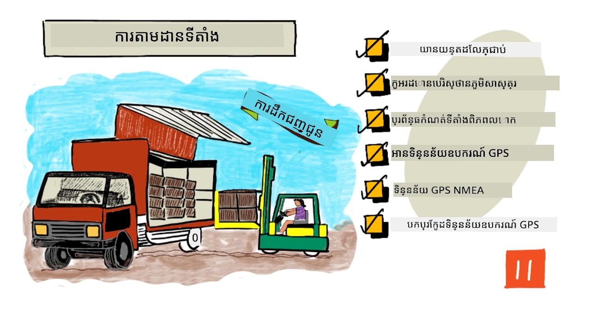
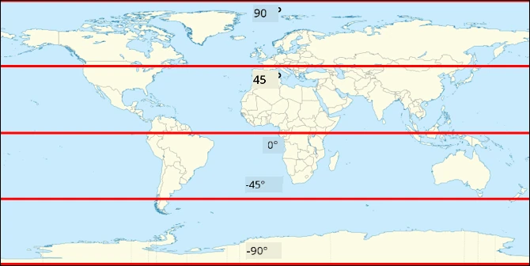
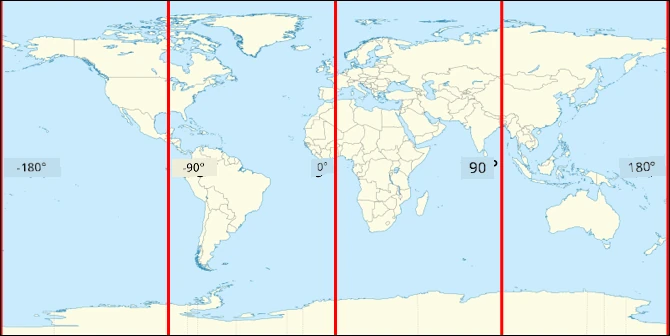
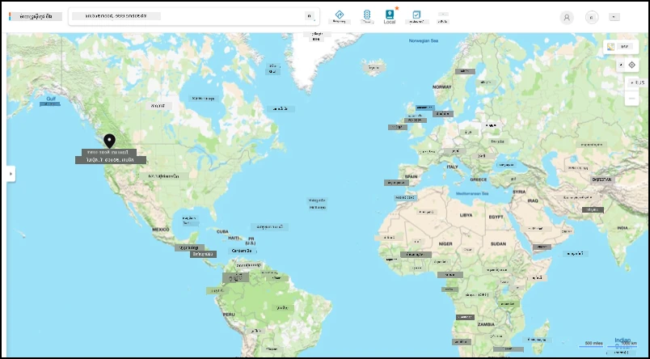
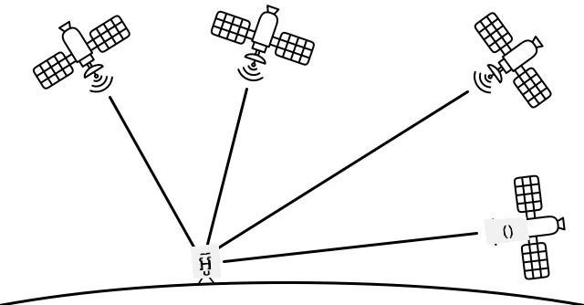

# ការតាមដានទីតាំង

> រូបសំណំដោយ [Nitya Narasimhan](https://github.com/nitya). ចុចលើរូបភាពដើម្បីមើលជារូបភាពធំជាងនេះ។

## គំនួរ முனាចុងមេរៀន

[គំនួរ முனាចុងមេរៀន](https://black-meadow-040d15503.1.azurestaticapps.net/quiz/21)

## ការណែនាំ

ដំណើរការសំខាន់សម្រាប់ការទទួលអាហារពីកសិករទៅអ្នកប្រើប្រាស់រួមមានការដាក់ប្រអប់ផលិតផលលើរថយន្ត, កប៉ាល់, អាកាសយានយន្ដ ឬយានយន្ដជួញដូរផ្សេងទៀត ហើយបញ្ជូនអាហារទៅកាន់កន្លែងណាមួយ - ឬផ្ទាល់ទៅអតិថិជន ឬទៅកាន់កណ្ដាលផ្ទុក ឬឃ្លាំងសម្រាប់ដំណើរការ។ ដំណើរការទាំងមូលពីផ្ទះចម្ការ ទៅអ្នកប្រើប្រាស់ គឺជាផ្នែកមួយនៃដំណើរការដែលហៅថា *ខ្សែផ្គត់ផ្គង់*។ វីដេអូចូលពីសាកលវិទ្យាល័យ Arizona State University របស់ W. P. Carey School of Business និយាយអំពីគំនិតខ្សែផ្គត់ផ្គង់ និងរបៀបគ្រប់គ្រងវាជារបៀបលម្អិតជាងនេះ។

> 🎥 ចុចរូបភាពខាងលើដើម្បីមើលវីដេអូ

ការបន្ថែមឧបករណ៍ IoT អាចធ្វើឲ្យខ្សែផ្គត់ផ្គង់របស់អ្នកប្រសើរឡើងយ៉ាងខ្លាំង អនុញ្ញាតឲ្យអ្នកគ្រប់គ្រងទីតាំងវត្ថុ, ធ្វើផែនការដឹកជញ្ជូន និងដោះស្រាយទំនិញបានល្អប្រសើរជាងមុន និងឆ្លើយតបបញ្ហាបានរហ័សតាមរយៈវិធីផ្សេងៗ។

ពេលគ្រប់គ្រងក្រុមយានយន្ដដូចជាទំនិញ, វាជារឿងជួយបានដើម្បីដឹងថាយានយន្ដមួយៗស្ថិតនៅកន្លែងណា នៅពេលណាមួយ។ យានយន្ដអាចត្រូវបានដំឡើងឧបករណ៍ស្ញាត់ទីតាំង GPS ដែលផ្ញើទីតាំងរបស់វាទៅប្រព័ន្ធ IoT អ្នកម្ចាស់អាចកំណត់ទីតាំងប្រកបដោយត្រឹមត្រូវ, មើលផ្លូវដែលវាបានដើរតាម និងដឹងពេលវានឹងមកដល់គោលដៅរបស់វា។ យានយន្ដភាគច្រើនដំណើរការជាលើស WiFi ដូច្នោះវានឹងប្រើបណ្តាញទូរស័ព្ទដើម្បីផ្ញើព័ត៌មានប្រភេទនេះ។ ពេលខ្លះឧបករណ៍ស្ញាត់ GPS រួមបញ្ចូលក្នុងឧបករណ៍ IoT ស្មុគស្មាញជាងនេះ ដូចជា សៀវភៅកំណត់ហេតុអេឡិចត្រូនិច។ ឧបករណ៍ទាំងនេះតាមដានរយៈពេលដែលរថយន្តបានដំណើរការហើយធ្វើអោយប្រាកដថាអ្នកបើកបរដើរតាមច្បាប់ស្រុកកន្លែងដំណើរការនៃម៉ោងធ្វើការ។

ក្នុងមេរៀននេះ អ្នកនឹងរៀនអំពីរបៀបតាមដានទីតាំងយានយន្ដដោយប្រើឧបករណ៍ស្ញាត់ទីតាំងសកល (GPS)។

ក្នុងមេរៀននេះ យើងនឹងគ្រប់គ្រង៖

* [យានយន្ដភ្ជាប់](#យានយន្ដភ្ជាប់)
* [កូអរដោនេជាតិស្រ្តី](#កូអរដោនេជាតិស្រ្តី)
* [ប្រព័ន្ធស្ញាត់ទីតាំងសកល (GPS)](#ប្រព័ន្ធស្ញាត់ទីតាំងសកល-gps)
* [អានទិន្នន័យឧបករណ៍ស្ញាត់ GPS](#អានទិន្នន័យឧបករណ៍ស-پژួត-gps)
* [ទិន្នន័យ GPS NMEA](#ទិន្នន័យ-gps-nmea)
* [បករប្រែទិន្នន័យឧបករណ៍ស្ញាត់ GPS](#កូដសរសេរដើម្បីបកស្រាយទិន្នន័យឧបករណ៍-gps)

## យានយន្ដភ្ជាប់

IoT កំពុងបម្លែងវិធីដឹកជញ្ជូនទំនិញដោយបង្កើតក្រុមយានយន្ដ *ភ្ជាប់*។ យានយន្ដទាំងនេះភ្ជាប់ទៅប្រព័ន្ធ IT កណ្តាលដែលរាយការណ៍ព័ត៌មានអំពីទីតាំងរបស់វា និងទិន្នន័យឧបករណ៍ស្ញាត់ផ្សេងទៀត។ មានក្រុមយានយន្ដភ្ជាប់មានអត្ថប្រយោជន៍ជាច្រើន៖

* ការតាមដានទីតាំង - អ្នកអាចកំណត់ទីតាំងយានយន្ដនៅពេលណាមួយបាន ដើម្បីអនុញ្ញាតៈ

  * ទទួលការជូនដំណឹងពេលយានយន្ដត្រៀមដល់គោលដៅ ដើម្បីរៀបចំក្រុមរួចរាល់សម្រាប់ការចូរទំនិញចេញ
  * រកយានយន្ដដែលត្រូវនគរបាលបាញ់ជាតិលួច
  * ផ្លាស់ប្ដូរផ្លូវនិងទីតាំងរួមជាមួយបញ្ហាចរាចរណ៍ ដើម្បីអាចប្តូរផ្លូវនៅពាក់កណ្តាលដំណើរបាន
  * ទាក់ទងទៅការបង់ពន្ធ។ ប្រទេសជាច្រើនគិតពន្ធយានយន្ដតាមចំនួនគីឡូម៉ែត្រដែលបើកលើផ្លូវសាធារណៈ (ដូចជា [RUC នៃប្រទេសនូវែលស៊ីឡង់](https://www.nzta.govt.nz/vehicles/licensing-rego/road-user-charges/)) ដូច្នេះការដឹងពេលណាយានយន្ដនៅលើផ្លូវសាធារណៈ និងផ្លូវឯកជនធ្វើអោយគណនាពន្ធបានងាយស្រួល។
  * ដឹងចំពោះទីតាំងផ្ញើក្រុមថែទាំករណីខូចខាត

* ទិន្នន័យបង្ហាញពីអ្នកបើកបរ - អាចធ្វើអោយប្រាកដថាអ្នកបើកបររត់តាមល្បឿនដែលបានកំណត់, បត់មុំក្នុងល្បឿនគួរឱ្យទទួលយក, ហាមឡានពេលវេលាមុន និងបើកបរបានយ៉ាងសុវត្ថិភាព។ យានយន្ដភ្ជាប់ក៏អាចមានកាមេរ៉ាដើម្បីថតចុះកើតគ្រោះអាក្រក់ ហើយវាអាចភ្ជាប់ទៅកាន់ធានារ៉ាប់រង ដើម្បីទទួលបានអត្រាបញ្ចុះសម្រួលសម្រាប់អ្នកបើកបរល្អ។

* បំពេញតាមម៉ោងបើកបររបស់អ្នកបើកបរ - ប្រាកដថាអ្នកបើកបរប្រើម៉ោងបើកបរត្រឹមត្រូវតាមច្បាប់ជាតិ ដោយផ្អែកលើម៉ោងបើក និងបិទម៉ាសុីន។

អត្ថប្រយោជន៍ទាំងនេះអាចបញ្ចូលគ្នាបាន - ឧទាហរណ៍ ជាសារជាដៃក្រវ៉ាត់ម៉ោងបើកបរជាមួយការតាមដានទីតាំងដើម្បីប្តូរសម្រួលផ្លូវអ្នកបើកបរ ប្រសិនបើពួកគេសម្រួលមិនបានទៅដល់គោលដៅក្នុងម៉ោងដែលបានអនុញ្ញាត។ វាអាចបញ្ចូលជាមួយទិន្នន័យបច្ចេកវិទ្យាកុងត្រូលយានយន្ដផ្សេងៗ ដូចជា ទិន្នន័យសីតុណ្ហភាពពីរថយន្តមានការត្រួតត្រាសីតុណ្ហភាព អនុញ្ញាតឲ្យប្តូរផ្លូវប្រើប្រាស់ប្រសិនបើផ្លូវបច្ចុប្បន្នមិនអាចរក្សាទំនិញបានតាមសីតុណ្ហភាព។

> 🎓 ការបញ្ជូនជាប្រព័ន្ធ គឺជាដំណើរការដឹកជញ្ជូនទំនិញពីកន្លែងមួយទៅកន្លែងមួយ ផ្សេងពីពីរយោងពីផ្ទះចម្ការ ទៅផ្សារទំនិញតាមរយៈឃ្លាំងមួយឬច្រើន។ កសិករវេចខ្ចប់ប្រអប់ផ្លែប៉េងប៉ោះដែលបានដាក់ឡើងរថយន្ត ដឹកទៅឃ្លាំងកណ្តាល ហើយដាក់ឡើងរថយន្តទីពីរដែលអាចមានគ្រឿងផ្សំផ្សេងៗគ្នារួមបញ្ចូលគ្នាដែលបន្ទាប់មកបានដឹកទៅផ្សារទំនិញ។

បច្ចេកទេសមួយសំខាន់នៅក្នុងការតាមដានយានយន្ដគឺ GPS - ឧបករណ៍ស្ញាត់ដែលអាចកំណត់ទីតាំងបានគ្រប់កន្លែងលើផែនដី។ ក្នុងមេរៀននេះ អ្នកនឹងរៀនពីរបៀបប្រើឧបករណ៍ស្ញាត់ GPS ចាប់ផ្តើមពីការស្គាល់របៀបកំណត់ទីតាំងលើផែនដី។

## កូអរដោនេជាតិស្រ្តី

កូអរដោនេជាតិស្រ្តីត្រូវបានប្រើសម្រាប់កំណត់ចំណុចនៅលើផ្ទៃផែនដី ដូចជាការប្រើកូអរដោនេក្នុងការគូរស្ទីចលើអេក្រង់កុំព្យូទ័រ ឬកំណត់ទីតាំងចងក្រងក្នុងការច្នៃត្បាញ។ សម្រាប់ចំណុចតែមួយ អ្នកមានគូកូអរដោនេមួយ។ ឧទាហរណ៍ ការិយាល័យ Microsoft នៅ Redmond, Washington, USA មានទីតាំងនៅ 47.6423109, -122.1390293។

### អក្សររយៈកណ្តាល និងអក្សររយៈបណ្ដោយ

ផែនដីគឺជាប្រដាប់មូល - វគឺជារង្វង់បីខ្នាត។ ដោយសារតែនេះ ចំណុចត្រូវបានកំណត់ដោយការបែងចែកវាចំណែកជា 360 អង្សា ដូចជាទ្រឹស្តីរបស់រង្វង់មូល។ អក្សររយៈកណ្តាលវាស់ចំនួនអង្សាខាងជើងទៅត្បូង និងអក្សររយៈបណ្ដោយវាស់ចំនួនអង្សាខាងកើតទៅទៅលិច។

> 💁 មិនមាននរណាដឹងមូលហេតុដើមហេតុអ្វីរង្វង់មូលត្រូវបានបែងចែកជា 360 អង្សាទេ។ [ទំព័រ​អំពីអង់ស្កា(angle) នៅ Wikipedia](https://wikipedia.org/wiki/Degree_(angle)) ចុះបញ្ជីពីមូលហេតុដែលអាចកើតមានបាន។

អក្សររយៈកណ្តាលវាស់ដោយប្រើខ្សែបន្ទាត់ដែលវង់ជុំផែនដី និងរត់ស្របទៅលើយស្មើខ្នងរង្វង់ បែងចែកមជ្ឈិមភាគខាងជើង និងត្បូងជាសមាមាត្រទំហំ 90° នីមួយៗ។ ស្មើខ្នងរង្វង់នៅត្រឹម 0°, គោលជើងនៅ 90°, ហៅថា 90° ជាភាគខាងជើង និងគោលទិសត្បូងនៅ -90°, ឬ 90° ភាគខាងត្បូង។

អក្សររយៈបណ្ដោយវាស់ដោយចំនួនអង្សាផ្ទែត្បូងទៅអក្សររយៈកណ្តាល​ចេញពីគោល Prime Meridian និងវាស្ថិតនៅ 0°។ Prime Meridian ត្រូវបានកំណត់នៅឆ្នាំ 1884 មានជាបន្ទាត់ចាប់ពីគោលជើងដល់គោលទិសត្បូងឆ្លងកាត់ [ស្ថានីយចម្រុះភាគចិន Royal Observatory នៅ Greenwich, អង់គ្លេស](https://wikipedia.org/wiki/Royal_Observatory,_Greenwich)។

> 🎓 មេរីឌីតានគឺជាបន្ទាត់ឯកភាពក្រឡោចប្លែកចាប់ពីគោលជើងដល់គោលទិសត្បូង បង្កើតជាបណ្តោងកណ្ដាលមូល។

ដើម្បីវាស់អក្សររយៈបណ្តោយនៃចំណុចមួយ អ្នកវាស់ចំនួនអង្សាទៅជុំវិញស្មើខ្នងរង្វង់ចាប់ពី Prime Meridian ទៅមេរីឌីតានដែលកាត់តាមចំណុចនោះ។ អក្សររយៈបណ្តោយចាប់ពី -180°, ឬ 180° ខាងលិច, តាមរយៈ 0° នៅ Prime Meridian ទៅ 180°, ឬ 180° ខាងកើត។ 180° និង -180° ជាចំណុចដដែលគ្នា ដែលហៅថា antimeridian ឬមេរីឌីតានទី 180។ វាជាបន្ទាត់មេរីឌីតាននៅផ្លូវវិញនៃផែនដីពី Prime Meridian។

> 💁 Antimeridian មិនគួរជុំគ្នាជាមួយ International Date Line ដែលស្ថិតនៅតំបន់ប្រហែលដូចគ្នា ប៉ុន្តែមិនមែនជាបន្ទាត់បន្ទាប់ដោយផ្ទាល់និងប្រែប្រួលដើម្បីស្របតាមព្រំដែននយោបាយ។

✅ សូមធ្វើការស្រាវជ្រាវ៖ ព្យាយាមរកអក្សររយៈកណ្តាល និងអក្សររយៈបណ្តោយនៃទីតាំងបច្ចុប្បន្នរបស់អ្នក។

### អង្សា, នាទី និងវិនាទី ប្រៀបធៀបនឹងអង្សាទសភាគ

តាមប្រពៃណី ការវាស់អង្សាររយៈកណ្តាល និងអក្សររយៈបណ្ដោយកើតមានដោយប្រើប្រព័ន្ធលេខ sexagesimal ឬ-១៦-៦០-មួយប្រព័ន្ធលេខមูลដ្ឋាន 60 ដែលបានប្រើដោយបាប៊ីលូនបុរាណ ដែលជាអ្នកធ្វើវាស់វែង និងកំណត់ពេលវេលា និងចម្ងាយដំបូង។ អ្នកប្រើប្រព័ន្ធ sexagesimal រៀងរាល់ថ្ងៃប្រហែលដោយគ្មានការយល់ដឹង - ដោយបែងចែកម៉ោងទៅជានាទី 60 និងនាទីទៅជាវិនាទី 60។

អក្សររយៈបណ្ដោយ និងអក្សររយៈកណ្តាលត្រូវបានវាស់ជា អង្សា, នាទី និងវិនាទី។ មួយនាទីស្មើការបែងចែក 1/60 នៃអង្សា ហើយមួយវិនាទីស្មើនាទី 1/60។

ឧទាហរណ៍ នៅស្មើខ្នងរង្វង់៖

* 1° រយៈកណ្តាល ជា **111.3 គីឡូម៉ែត្រ**
* 1 នាទី រយៈកណ្តាល ជា 111.3/60 = **1.855 គីឡូម៉ែត្រ**
* 1 វិនាទី រយៈកណ្តាល ជា 1.855/60 = **0.031 គីឡូម៉ែត្រ**

រ៉ុងសញ្ញានាទីគឺជាអក្សរដែលដាក់បញ្ចូល ('), សញ្ញាវិនាទីគឺជា (" )។ 2 អង្សា 17 នាទី និង 43 វិនាទី គឺត្រូវបានសរសេរជា 2°17'43"។ ផ្នែកនៃវិនាទីត្រូវបានផ្ដល់ជាអង់ស្កាទសភាគ ឧទាហរណ៍ពាក់កណ្តាលវិនាទីគឺជា 0°0'0.5"។

កុំព្យូទ័រមិនដំណើរការផ្នែកមូលដ្ឋាន 60 ដូច្នេះកូអរដោនេនេះត្រូវបានបង្ហាញជាអង្សាទសភាគនៅពេលប្រើទិន្នន័យ GPS ក្នុងប្រព័ន្ធកុំព្យូទ័រភាគច្រើន។ ឧទាហរណ៍ 2°17'43" គឺ 2.295277។ រ៉ុងសញ្ញាអង្សា​ប្រហែលជាមិនមែនសរសេរទេ។

ទីតាំងអាចត្រូវបានផ្ដល់ជានិរន្តរ `latitude, longitude` ដូច្នេះឧទាហរណ៍មុននៃការិយាល័យ Microsoft នៅ 47.6423109, -122.1390293 មាន៖

* អក្សររយៈកណ្តាល 47.6423109 (47.6423109 អង្សាចំាងជើងនៃស្មើខ្នងរង្វង់)
* អក្សររយៈបណ្ដោយ -122.1390293 (122.1390293 អង្សាចំាងលិចនៃ Prime Meridian)។

## ប្រព័ន្ធស្ញាត់ទីតាំងសកល (GPS)

ប្រព័ន្ធ GPS ប្រើផ្កាយផ្ទះច្រើនកំពុងបង្វិលជុំផែនដី ដើម្បីស្វែងរកទីតាំងរបស់អ្នក។ អ្នកប្រហែលជាបានប្រើប្រព័ន្ធ GPS ដោយគ្មានការយល់ដឹង - ដើម្បីស្វែងរកទីតាំងរបស់អ្នកនៅក្នុងកម្មវិធីផែនទីលើទូរស័ព្ទដូចជា Apple Maps ឬ Google Maps, ឬដើម្បីមើលរថយន្តរបស់អ្នកនៅក្នុងកម្មវិធីហៅឡានដូចជា Uber ឬ Lyft, ឬនៅពេលដែលប្រើការនាវិសញ្ញាភាពផ្កាយផ្ទះ (sat-nav) នៅលើឡានរបស់អ្នក។

> 🎓 ផ្កាយផ្ទះនៅក្នុង 'ការនាវិសញ្ញាភាពផ្កាយផ្ទះ' គឺជាផ្កាយផ្ទះ GPS!

ប្រព័ន្ធ GPS ដំណើរការ ដោយមានផ្កាយផ្ទះមួយចំនួនផ្ញើសញ្ញា ជាមួយទីតាំងបច្ចុប្បន្នរបស់ផ្កាយផ្ទះ និងម៉ោងដែលត្រឹមត្រូវ។ សញ្ញាទាំងនេះត្រូវបានផ្ញើតាមរលកវិទ្យុ ហើយត្រូវបានឧបករណ៍អង់តែនាបានចាប់យកនៅក្នុងឧបករណ៍ស្ញាត់ GPS។ ឧបករណ៍ស្ញាត់ GPS នឹងរកឃើញសញ្ញាទាំងនេះ ហើយដោយប្រើម៉ោងបច្ចុប្បន្នវាវាស់រយៈពេលដែលសញ្ញាត្រូវបានផ្ញើពីផ្កាយផ្ទះដល់ឧបករណ៍ស្ញាត់ GPS។ ព្រោះល្បឿនរលកវិទ្យុមានល្បឿនថេរ ឧបករណ៍ស پژួត GPS អាចប្រើម៉ោងដែលបានផ្ញើតាមសញ្ញា ដើម្បីគណនាចម្ងាយចេញពីផ្កាយផ្ទះ។ ដោយបញ្ចូលទិន្នន័យពីផ្កាយផ្ទះ 3 ដวงឬច្រើនជាមួយពីទីតាំងផ្កាយផ្ទះដែលផ្ញើមក ឧបករណ៍ស پژួត GPS អាចកំណត់ទីតាំងផ្ទាល់មិនឲ្យកន្លែងនៅលើផែនដី។

> 💁 ឧបករណ៍ស پژួត GPS ត្រូវការអង់តែនាសម្រាប់ចាប់រលកវិទ្យុ។ អង់តែនារបស់រថយន្ត និងឡានដែលមាន GPS បានដំឡើងមកត្រូវបានដាក់នៅចំណុចដែលទទួលបានរលកបានល្អ ជាទូទៅនៅលើបង្អួចកញ្ចក់មុខ ឬដំបូលឡាន។ បើអ្នកប្រើប្រព័ន្ធ GPS ខាងក្រៅ ដូចជា ទូរស័ព្ទដៃ ឬឧបករណ៍ IoT, អ្នកត្រូវប្រាកដថាអង់តែនារបស់ប្រព័ន្ធ GPS ឬទូរស័ព្ទមានចំណុចមើលមេឃច្បាស់ ដូចជា ត្រូវតែដំឡើងនៅលើបង្អួចកញ្ចក់រថយន្ត។

ផ្កាយផ្ទះ GPS បង្វិលជុំផែនដី មិនមែននៅតំណែងថេរលើឧបករណ៍ទេ ដូច្នេះទិន្នន័យទីតាំងរួមបញ្ចូលថ្លឹងលើមហាសមុទ្រអាស្រ័យលើអក្សររយៈកណ្តាល និងអក្សររយៈបណ្ដោយផងដែរ។

GPS ដើរតួសម្រាប់មានកំណត់ភាពត្រឹមត្រូវដែលអនុវត្តដោយកងទ័ពអាមេរិក ក្នុងការកំណត់ភាពត្រឹមត្រូវមិនលើស 5 ម៉ែត្រ។ កំណត់ភាពនេះត្រូវបានលុបចោលក្នុងឆ្នាំ 2000។ ឥឡូវនេះមានភាពត្រឹមត្រូវនៅប្រមាណ 30 សង់ទីម៉ែត្រ។ ការទទួលបានភាពត្រឹមត្រូវនេះមិនស្ថិតក្នុងជាធម្មតា ដោយសារការរអាក់រអួលនៃសញ្ញា។

✅ ប្រសិនបើអ្នកមានទូរស័ព្ទដៃអ្នកចាប់ផ្តើមកម្មវិធីផែនទី និងស្ទាបទីតាំងរបស់អ្នក។ វាអាចនឹងចំណាយពេលខ្លីសម្រាប់ទូរស័ព្ទដៃរកឃើញផ្កាយផ្ទះច្រើនដើម្បីទទួលបានទីតាំងត្រឹមត្រូវជាងនេះ។

> 💁 ផ្កាយផ្ទះមានកាឡុកាដេញបាតូម ដែលមានភាពត្រឹមត្រូវយ៉ាងខ្លាំង ប៉ុន្តែវាបាត់បង់ 38 ម៉ៃក្រូវិនាទី (0.0000038 វិនាទី) មួយថ្ងៃ ប្រៀបធៀបនឹងកាឡុកាដេញបាតូមលើផែនដី ដោយសារតែពេលវេលាចុះថយតាមល្បឿនកើនឡើង ដូចបានទស្សនារបស់ Einstein របស់ទ្រឹស្តីពិសេស និងទ្រឹស្តីទូទៅនៃសាមញ្ញភាពភេទ - ផ្កាយផ្ទះដំណើរការលឿនជាងការបង្វិលរបស់ផែនដី។ ចំណុចមិនអាចបំភ្លេចបាននេះត្រូវបានប្រើបញ្ជាក់ទ្រង់ទ្រាយនៃទ្រឹស្តីពិសេស និងទូទៅ ហើយត្រូវបានកែតម្រូវក្នុងការរចនាប្រព័ន្ធ GPS។ ពិតណាស់ ពេលវេលាដំណើរការយ៉ាងយឺតលើផ្កាយផ្ទះ GPS ។

ប្រព័ន្ធ GPS ត្រូវបានអភិវឌ្ឍន៍ និងដាក់ឲ្យប្រើប្រាស់ដោយប្រទេស និងសហគមន៍នយោបាយជាច្រើន រួមមាន សហរដ្ឋអាមេរិក, រុស្ស៊ី, ជប៉ុន, ឥណ្ឌា, សហភាពអឺរ៉ុប និងចិន។ ឧបករណ៍ស پژួត GPS សម័យទំនើបអាចភ្ជាប់ទៅប្រព័ន្ធជាច្រើនឲ្យបានលឿន និងត្រឹមត្រូវជាងនេះ។

> 🎓 ក្រុមមួយនៃផ្កាយផ្ទះក្នុងការដាក់ឲ្យប្រើប្រាស់ត្រូវបានហៅថា constellation។

## អានទិន្នន័យឧបករណ៍ស پژួត GPS

ឧបករណ៍ស پژួត GPSភាគច្រើនផ្ញើទិន្នន័យ GPS តាម UART។

> ⚠️ UART ត្រូវបានពិភាក្សា ក្នុង [project 2, lesson 2](../../../2-farm/lessons/2-detect-soil-moisture/README.md#universal-asynchronous-receiver-transmitter-uart)។ សូមយោងត្រឡប់ទៅមេរៀននោះ ប្រសិនបើត្រូវការ។

អ្នកអាចប្រើឧបករណ៍ស پژួត GPS លើឧបករណ៍ IoT របស់អ្នក ដើម្បីទទួលបានទិន្នន័យ GPS។

### បទបញ្ជា - ភ្ជាប់ឧបករណ៍ស پژួត GPS និងអានទិន្នន័យ GPS។
ដំណើរការតាមមគ្គុទេសក៍ដែលពាក់ព័ន្ធ ដើម្បីអានទិន្នន័យ GPS ប្រើឧបករណ៍ IoT របស់អ្នក៖

* [Arduino - Wio Terminal](wio-terminal-gps-sensor.md)
* [កុំព្យូទ័រចល័តមួយផ្ទៅ - Raspberry Pi](pi-gps-sensor.md)
* [កុំព្យូទ័រចល័តមួយផ្ទៅ - ឧបករណ៍វឌ្ឍនភាព](virtual-device-gps-sensor.md)

## ទិន្នន័យ GPS NMEA

ពេលអ្នកបានរត់កូដរបស់អ្នក អ្នកធ្លាប់បានឃើញអ្វីដែលអាចមានទ្រង់ទ្រាយជាកូដមិនបំភ្លឺនៅក្នុងលទ្ធផល។ វាជាទិន្នន័យ GPS ស្តង់ដារពិតប្រាកដ ហើយវាមានអត្ថន័យទាំងមូល។

ឧបករណ៍ប្រើប្រាស់ GPS បញ្ចេញទិន្នន័យដោយប្រើសារ NMEA ដែលអនុវត្តតាមស្តង់ដារ NMEA 0183។ NMEA គឺជាពាក្យកាត់នៃ [National Marine Electronics Association](https://www.nmea.org) ជាសម្ព័ន្ធពាណិជ្ជកម្មនៅសហរដ្ឋអាមេរិក ដែលកំណត់ស្តង់ដារនៃការប្រាស្រ័យទាក់ទងរវាងឧបករណ៍អេឡិចត្រូនិចសមុទ្រ។

> 💁 ស្តង់ដារនេះគឺជាសិទ្ធិនិម្មិត និងមានតម្លៃលក់យ៉ាងហោចណាស់ US$2,000 ប៉ុន្តែនៅក្នុងតំបន់សាធារណៈមានព័ត៌មានគ្រប់គ្រងគ្រប់គ្រាន់ ដែលធ្វើឲ្យស្តង់ដារច្រើនត្រូវបានរំលែកវិញ និងអាចប្រើបានក្នុងកូដបើកទ្វារ និងកូដមិនមានគោលបំណងពាណិជ្ជកម្មផ្សេងៗ។

សារទាំងនេះមានលក្ខណៈអត្ថបទ។ សារៀមួយនឹងបង្កើតអត្ថបទមួយ *ប្រយោគ* ដែលចាប់ផ្តើមដោយតួអក្សរ `$` បន្ទាប់ពីមានតួអក្សរពីរដើម្បីបង្ហាញប្រភពនៃសារ (ឧ. GP សម្រាប់ប្រព័ន្ធ GPS របស់សហរដ្ឋអាមេរិក, GN សម្រាប់ GLONASS ប្រព័ន្ធ GPS របស់រុស្ស៊ី), និងតួអក្សរបីសម្រាប់បង្ហាញប្រភេទសារ។ ភាគរយសារដែលនៅខាងក្រោយគឺជាផ្នែកផ្សេងៗដែលបំបែកដោយពាក្យក្បាលជញ្ជួរពីរទៅក្រោម។

ប្រភេទសារដែលអាចទទួលបានមួយចំនួនមានដូចជា៖

| ប្រភេទ | សេចក្ដីពិពណ៌នា |
| ---- | ----------- |
| GGA | ទិន្នន័យការជួសជុល GPS រួមមាន ទីតាំងទទឹង បណ្ដោយ និងកម្ពស់របស់ឧបករណ៍ GPS ជាមួយគណនាពីចំនួនផ្កាយយោងដែលមើលឃើញសម្រាប់កំណត់ទីតាំងនេះ។ |
| ZDA | កាលបរិច្ឆេទ និងម៉ោងបច្ចុប្បន្ន រួមមានតំបន់ម៉ោងក្នុងតំបន់នោះ។ |
| GSV | ព័ត៌មានលម្អិតអំពីផ្កាយយោងដែលមើលឃើញ - មានន័យថា ផ្កាយយោងដែលឧបករណ៍ GPS អាចរកឃើញសញ្ញា។ |

> 💁 ទិន្នន័យ GPS រួមមានស្លាកម៉ោង ដូច្នេះឧបករណ៍ IoT របស់អ្នកអាចទទួលម៉ោងប្រសិនបើត្រូវការពីឧបករណ៍ GPS ដោយមិនខ្វល់ពីការជឿទុកចិត្តលើម៉ាស៊ីនបម្រើ NTP ឬម៉ោងពិតក្នុងឧបករណ៍។

សារ GGA រួមបញ្ចូលទីតាំងបច្ចុប្បន្នតាមរូបមន្ត `(dd)dmm.mmmm` ជាមួយតួអក្សរតែមួយសម្រាប់បង្ហាញទិសដៅ។ `d` ក្នុងរូបមន្តគឺជាដឺក្រី, `m` គឺនាទី, ជាមួយវិនាទីមានតម្លៃដាក់ជាភាគភាគនៃនាទី។ ឧទាហរណ៍ 2°17'43" នឹងស្មើ 217.716666667 - 2 ដឺក្រី, 17.716666667 នាទី។

តួអក្សរទិសដៅអាចជារៀង `N` ឬ `S` សម្រាប់ទទឹង ដើម្បីបង្ហាញទិសទៅភាគជើង ឬភាគខាងត្បូង, និង `E` ឬ `W` សម្រាប់បណ្ដោយ ដើម្បីបង្ហាញជាទិស។ ឧទាហរណ៍ ទទឹង 2°17'43" នឹងមានតួអក្សរទិសដៅជា `N`, -2°17'43" នឹងមានតួអក្សរទិសដៅជា `S`។

ឧទាហរណ៍ - ប្រយោគ NMEA `$GNGGA,020604.001,4738.538654,N,12208.341758,W,1,3,,164.7,M,-17.1,M,,*67`

* ផ្នែកទទឹងគឺ `4738.538654,N` ដែលបំលែងទៅជា 47.6423109 ដឺក្រីដប់សង្ខេប។ `4738.538654` គឺ 47.6423109 ហើយទិសដៅគឺ `N` (ភាគជើង) ដូច្នោះវាជាទទឹងវិជ្ជមាន។

* ផ្នែកបណ្ដោយគឺ `12208.341758,W` ដែលបំលែងទៅជា -122.1390293 ដឺក្រីដប់សង្ខេប។ `12208.341758` គឺ 122.1390293°, ហើយទិសដៅគឺ `W` (ភាគលិច) ដូច្នោះវាជាបណ្ដោយអវិជ្ជមាន។

## កូដសរសេរដើម្បីបកស្រាយទិន្នន័យឧបករណ៍ GPS

ជំនួសការប្រើទិន្នន័យ NMEA ដើម វាល្អជាងក្នុងការបកស្រាយវាទៅជាទ្រង់ទ្រាយមានប្រយោជន៍ជាង។ មានបណ្ណាល័យបើកចំហដែលអ្នកអាចប្រើដើម្បីជួយដកស្រង់ទិន្នន័យដែលមានប្រយោជន៍ពីសារប្រភេទ NMEA ដើម។

### ភារកិច្ច - បកស្រាយទិន្នន័យឧបករណ៍ GPS

ដំណើរការតាមមគ្គុទេសក៍ដែលពាក់ព័ន្ធដើម្បីបកស្រាយទិន្នន័យឧបករណ៍ GPS ប្រើឧបករណ៍ IoT របស់អ្នក៖

* [Arduino - Wio Terminal](wio-terminal-gps-decode.md)
* [កុំព្យូទ័រចល័តមួយផ្ទៅ - Raspberry Pi/ឧបករណ៍ IoT វិជ្ជមាន](single-board-computer-gps-decode.md)

---

## 🚀 បញ្ហាចម្រុះ

សរសេរកូដបកស្រាយ NMEA ផ្ទាល់ខ្លួន! ជំនួសការជឿទុកចិត្តលើបណ្ណាល័យភាគីទីបីក្នុងការបកស្រាយប្រយោគ NMEA តើអ្នកអាចសរសេរកូដបកស្រាយផ្ទាល់ខ្លួនដើម្បីដកទិន្នន័យទទឹង និងបណ្ដោយពីប្រយោគ NMEA?

## ប្រឡងបន្ទាប់ម៉ោងសិក្សា

[ប្រឡងបន្ទាប់ម៉ោងសិក្សា](https://black-meadow-040d15503.1.azurestaticapps.net/quiz/22)

## ការពិនិត្យឡើងវិញ និងការសិក្សាផ្ទាល់ខ្លួន

* អានបន្ថែមអំពីមុំដែនភូមិសាស្ត្រពីទំព័រសីមាភូមិសាស្ត្រនៅលើវីគីភីឌា [Geographic coordinate system page on Wikipedia](https://wikipedia.org/wiki/Geographic_coordinate_system)។
* អានអំពី Prime Meridians នៅលើវត្ថុផ្កាយផ្សេងទៀតក្រៅពីផែនដីនៅលើទំព័រ Prime Meridian នៅវីគីភីឌា [Prime Meridian page on Wikipedia](https://wikipedia.org/wiki/Prime_meridian#Prime_meridian_on_other_planetary_bodies)
* ស្រាវជ្រាវប្រព័ន្ធ GPS ផ្សេងៗពីរដ្ឋាភិបាល និងសហព័ន្ធនយោបាយជាច្រើនដូចជា EU, ជប៉ុន, រុស្ស៊ី, ឥណ្ឌា និងសហរដ្ឋអាមេរិក។

## កិច្ចការផ្ទះ

[ស៊ើបអង្កេតទិន្នន័យ GPS ផ្សេងទៀត](assignment.md)

---

<!-- CO-OP TRANSLATOR DISCLAIMER START -->
**ការបដិសេធៈ**  
ឯកសារនេះត្រូវបានបកប្រែដោយប្រើសេវាកម្មបកប្រែ AI [Co-op Translator](https://github.com/Azure/co-op-translator)។ ក្រៅពីយើងខ្ញុំមានការខិតខំដើម្បីឲ្យមានភាពត្រឹមត្រូវ សូមយល់ព្រមថាការបកប្រែដោយស្វ័យប្រវត្តិអាចមានកំហុសឬភាពមិនត្រឹមត្រូវ។ ឯកសារដើមនៅក្នុងភាសាទីតាំងរបស់វាគួរត្រូវបានគេយកជាគោលដៅដើម្បីយោង។ សម្រាប់ព័ត៌មានសំខាន់ៗ សូមផ្ដល់អាទិភាពការបកប្រែដោយមនុស្សអ្នកជំនាញ។ យើងខ្ញុំមិនទទួលខុសត្រូវចំពោះការយល់ច្រឡំ ឬការបកប្រែខុសពីការប្រើប្រាស់ការបកប្រែនេះឡើយ។
<!-- CO-OP TRANSLATOR DISCLAIMER END -->