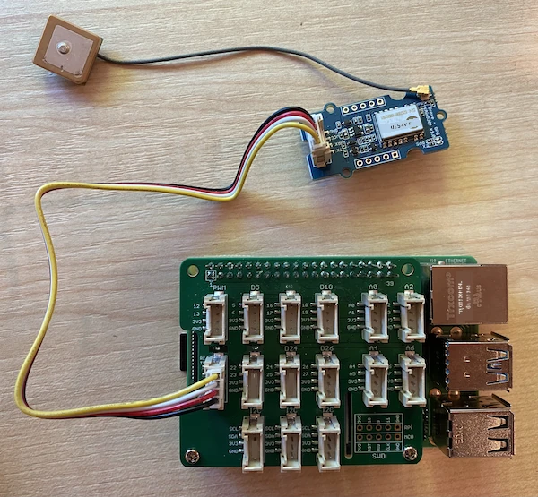

# ការអានទិន្នន័យ GPS - Raspberry Pi

ក្នុងផ្នែកនេះនៃមេរៀន អ្នកនឹងបន្ថែមឧបករណ៍សំយោគ GPS ទៅកាន់ Raspberry Pi របស់អ្នក ហើយអានតម្លៃពីវា។

## ហា៊ដវែរមេ

Raspberry Pi ត្រូវការឧបករណ៍សំយោគ GPS។

ឧបករណ៍ដែលអ្នកនឹងប្រើគឺ [ឧបករណ៍ Grove GPS Air530](https://www.seeedstudio.com/Grove-GPS-Air530-p-4584.html)។ ឧបករណ៍នេះអាចភ្ជាប់ទៅប្រព័ន្ធ GPS ជាច្រើនសម្រាប់កំណត់ទីតាំងយ៉ាងលឿន និងត្រឹមត្រូវ។ ឧបករណ៍ត្រូវបានបង្កើតពី 2 ផ្នែក - អេឡិចត្រូនិចមេនៃឧបករណ៍ និងអង់តែនាខាងក្រៅភ្ជាប់ដោយខ្សែតូចមួយដើម្បីទទួលរលកកាំរស្មីពីផ្កាយយោង។

នេះជាឧបករណ៍ UART ដូច្នេះវាបញ្ចូនទិន្នន័យ GPS តាមរយៈ UART។

## ភ្ជាប់ឧបករណ៍ GPS

ឧបករណ៍ Grove GPS អាចភ្ជាប់ទៅកាន់ Raspberry Pi។

### ជំនួយ - ភ្ជាប់ឧបករណ៍ GPS

ភ្ជាប់ឧបករណ៍ GPS។


1. បញ្ចូលចុងខ្លះមួយនៃខ្សែ Grove ទៅក្នុងប្រអប់នៅលើឧបករណ៍ GPS។ វានឹងភ្ជាប់តែនៅផ្នែកមួយទេ។

1. នៅពេលដែល Raspberry Pi មិនមានថាមពល សូមភ្ជាប់ចុងខ្វះនៃខ្សែ Grove ទៅប្រអប់ UART ដែលសម្គាល់ជា **UART** នៅលើ Grove Base hat ដែលភ្ជាប់ទៅ Pi។ ប្រអប់នេះមានទីតាំងនៅជួរមកណាត់ផ្នែកកណ្ដាល ផ្នែកក្បែរស្លុតកាបូសេអេស ឆ្វេងពីគ្មានចំពោះសំណុំប៊ក USB និងប្រអប់អ៊ីធើណិត។

    

1. ដាក់ឧបករណ៍ GPS ដើម្បីអង់តែនាខាប់ផ្គត់ផ្គង់ឲ្យអាចមើលឃើញមេឃបាន - ល្អបើនៅក្បែរបង្អួចបើក ឬនៅខាងក្រៅ។ វាងាយស្រួលក្នុងការ សំឡេងសញ្ញាកាន់តែច្បាស់ដោយគ្មានអ្វីនៅចន្លោះអង់តែនា។

## ពិប្រតិការឧបករណ៍ GPS

Raspberry Pi ឥឡូវនេះអាចត្រូវបានបង្កើតកម្មវិធីដើម្បីប្រើឧបករណ៍ GPS ដែលភ្ជាប់។

### ជំនួយ - ពិប្រតិការឧបករណ៍ GPS

បង្កើតកម្មវិធីសម្រាប់ឧបករណ៍។

1. បើកភ្លើង Pi ហើយរង់ចាំឲ្យវាបើករួច។

1. ឧបករណ៍ GPS មាន LED 2ដែល - LED ពណ៌ខៀវដែលភ្លឺបញ្ចាំងពេលទិន្នន័យត្រូវបានបញ្ជូន និង LED ពណ៌បៃតងដែលភ្លឺបញ្ចាំងរៀងរាល់វិនាទីពេលទទួលទិន្នន័យពីផ្កាយ។ សូមប្រាកដថា LED ខៀវភ្លឺពេលបើក Pi។ បន្ទាប់ពីពេលខ្លះ LED បៃតងនឹងភ្លឺ - ប្រសិនបើមិនបាន សូមតំរូវផ្លាស់ទីអង់តែនា។

1. បើក VS Code ម្តងទៀត ឬភ្ជាប់ជាមួយជំនួយ Remote SSH extension។

    > ⚠️ អ្នកអាចយោងទៅ [ការណែនាំក្នុងការតម្លើង និងបើក VS Code នៅមេរៀនទី 1 ប្រសិនបើត្រូវការ](../../../1-getting-started/lessons/1-introduction-to-iot/pi.md)។

1. ជាមួយនឹងកំណែថ្មីនៃ Raspberry Pi ដែលគាំទ្រ Bluetooth មានជម្លោះរវាងច្រកស៊េរីដែលប្រើសម្រាប់ Bluetooth និងច្រកស៊េរីដែល Grove UART ប្រើ។ ដើម្បីដោះស្រាយបញ្ហានេះ សូមធ្វើដូចតទៅ៖

    1. ពី Terminal របស់ VS Code កែប្រែឯកសារ `/boot/config.txt` ដោយប្រើ `nano` ដែលជាកម្មវិធីកែសម្រួលអត្ថបទក្នុង Terminal ដោយប្រើពាក្យបញ្ជាដូចខាងក្រោម៖

        ```sh
        sudo nano /boot/config.txt
        ```

        > ឯកសារនេះមិនអាចកែប្រែដោយ VS Code ទេ ព្រោះអ្នកត្រូវតែប្រើសិទ្ធិ `sudo` ដែលមានសិទ្ធិខ្ពស់។ VS Code មិនដំណើរការនេះទេ។

    1. ប្រើក្តារចុចដើម្បីរុករកទៅចុងចុងឯកសារ បន្ទាប់មកចម្លងកូដខាងក្រោម ហើយបិទបញ្ចូលនៅចុងឯកសារ៖

        ```ini
        dtoverlay=pi3-miniuart-bt
        dtoverlay=pi3-disable-bt
        enable_uart=1
        ```

        អ្នកអាចបិទបញ្ចូលដោយប្រើកត្តាចុចដូចធម្មតាសម្រាប់ឧបករណ៍របស់អ្នក (`Ctrl+v` នៅលើ Windows, Linux ឬ Raspberry Pi OS, `Cmd+v` នៅលើ macOS)។

    1. រក្សាទុកឯកសារនិងចេញពី nano ដោយចុច `Ctrl+x`។ ចុច `y` នៅពេលមានសំណួរថាតើអ្នកចង់រក្សាទុក buffer ដែលបានកែប្រែរួចឬនៅបន្ទាប់មកចុច `enter` ដើម្បីបញ្ជាក់ថាចង់លើសរសេរ `/boot/config.txt`។

        > ប្រសិនបើអ្នកមានកំហុស អ្នកអាចចាកចេញដោយមិនរក្សាទុក ហើយធ្វើជំហាននេះម្តងទៀត។

    1. កែប្រែឯកសារ `/boot/cmdline.txt` ប្រើ nano ដោយប្រើពាក្យបញ្ជាដូចខាងក្រោម៖

        ```sh
        sudo nano /boot/cmdline.txt
        ```

    1. ឯកសារនេះមានជុំវិញគូវាល/គូតម្លៃសង្ខេបជាមួយគ្នាដោយប្រើចន្លោះ។ សូមដកគូនេះចេញសម្រាប់ប្រភេទគូ `console`។ វាអាចស្រដៀងល្អជាមួយនេះ៖

        ```output
        console=serial0,115200 console=tty1 
        ```

        អ្នកអាចរុករកទៅកាន់ការចូលបញ្ជូលនេះដោយប្រើក្តារចុចរុករក បន្ទាប់មកលុបដោយប្រើ `del` ឬ `backspace`។

        ឧទាហរណ៍ ប្រសិនបើឯកសារដើមរបស់អ្នកមើលដូចនេះ៖

        ```output
        console=serial0,115200 console=tty1 root=PARTUUID=058e2867-02 rootfstype=ext4 elevator=deadline fsck.repair=yes rootwait
        ```

        កំណែថ្មីនឹងមានរូបរាងដូចខាងក្រោម៖

        ```output
        root=PARTUUID=058e2867-02 rootfstype=ext4 elevator=deadline fsck.repair=yes rootwait
        ```

    1. អនុវត្តវាជំហានខាងលើដើម្បីរក្សាទុកឯកសារនិងចេញពី nano

    1. ចាប់ផ្តើម Pi របស់អ្នកឡើងវិញ បន្ទាប់មកភ្ជាប់ឡើងវិញនៅក្នុង VS Code ពេល Pi បានបើកឡើងវិញ។

1. ពី Terminal បង្កើតថតថ្មីមួយក្នុងថតផ្ទះអ្នកប្រើ `pi` ឈ្មោះថា `gps-sensor`។ បង្កើតឯកសារមួយនៅក្នុងថតនេះឈ្មោះថា `app.py`។

1. បើកថតនេះនៅក្នុង VS Code

1. មូឌុល GPS ផ្ញើទិន្នន័យ UART តាមច្រកស៊េរីមួយ។ តម្លើងបណ្ណាល័យ Pip `pyserial` ដើម្បីទំនាក់ទំនងជាមួយច្រកស៊េរីពីកូដ Python របស់អ្នក៖

    ```sh
    pip3 install pyserial
    ```

1. បន្ថែមកូដខាងក្រោមទៅក្នុងឯកសារ `app.py` របស់អ្នក៖

    ```python
    import time
    import serial
    
    serial = serial.Serial('/dev/ttyAMA0', 9600, timeout=1)
    serial.reset_input_buffer()
    serial.flush()
    
    def print_gps_data(line):
        print(line.rstrip())
    
    while True:
        line = serial.readline().decode('utf-8')
    
        while len(line) > 0:
            print_gps_data(line)
            line = serial.readline().decode('utf-8')
    
        time.sleep(1)
    ```

    កូដនេះនាំចូលមូឌុល `serial` ពីបណ្ណាល័យ Pip `pyserial`។ វាភ្ជាប់ទៅកាន់ច្រកស៊េរី `/dev/ttyAMA0` - ដែលជាអាសយដ្ឋានច្រកស៊េរីដែល Grove Pi Base Hat ប្រើសម្រាប់ច្រក UART របស់វា។ វាប្រលូតទិន្នន័យដែលមានស្រាប់ពីការតភ្ជាប់ច្រកស៊េរីនេះ។

    បន្ទាប់មកមានមុខងារ `print_gps_data` ដែលបោះពុម្ពអត្ថបទដែលបានបញ្ជូនទៅកាន់ console។

    បន្ទាប់មកកូដធ្វើដំណើរជាអនន្តភាព អានបន្ទាត់អត្ថបទច្រើនដែលអាចពីច្រកស៊េរីនៅក្នុងរាល់វដ្ដហាត់។ វាហៅមុខងារ `print_gps_data` សម្រាប់បន្ទាត់នីមួយៗ។

    បន្ទាប់ពីអានទិន្នន័យទាំងអស់រួច វាដំណេីរកំណត់ ១ វិនាទី ហើយព្យាយាមម្ដងទៀត។

1. ដំណើរការ​កូដ​នេះ។ អ្នកនឹងឃើញលទ្ធផលដើមពីឧបករណ៍ GPS ប្រហែលដូចខាងក្រោម៖

    ```output
    $GNGGA,020604.001,4738.538654,N,12208.341758,W,1,3,,164.7,M,-17.1,M,,*67
    $GPGSA,A,1,,,,,,,,,,,,,,,*1E
    $BDGSA,A,1,,,,,,,,,,,,,,,*0F
    $GPGSV,1,1,00*79
    $BDGSV,1,1,00*68
    ```

    > ប្រសិនបើអ្នកទទួលបានកំហុសពីមួយក្នុងចំណោមនេះពេលបញ្ឈប់និងចាប់ផ្តើមកូដឡើងវិញ សូមបន្ថែមប្លុក `try - except` ទៅក្នុងរង្វិល while របស់អ្នក។

      ```output
      UnicodeDecodeError: 'utf-8' codec can't decode byte 0x93 in position 0: invalid start byte
      UnicodeDecodeError: 'utf-8' codec can't decode byte 0xf1 in position 0: invalid continuation byte
      ```

    ```python
    while True:
        try:
            line = serial.readline().decode('utf-8')
              
            while len(line) > 0:
                print_gps_data()
                line = serial.readline().decode('utf-8')
      
        # មានរំពេចចៃឆន្ទ៍មួយដែលបៃទីមួយដែលកំពុងត្រូវបានអានគឺជាផ្នែកមួយក្នុងតួអក្សរ។
        # អានបន្ទាត់ពេញមួយទៀតហើយបន្ត។

        except UnicodeDecodeError:
            line = serial.readline().decode('utf-8')

    time.sleep(1)
    ```

> 💁 អ្នកអាចរកឃើញកូដនេះនៅក្នុងថត [code-gps/pi](../../../../../3-transport/lessons/1-location-tracking/code-gps/pi)។

😀 កម្មវិធីឧបករណ៍ GPS របស់អ្នកបានជោគជ័យ!

---

<!-- CO-OP TRANSLATOR DISCLAIMER START -->
**ការបដិសេធការ**៖  
ឯកសារនេះត្រូវបានបកប្រែដោយប្រើសេវាកម្មបកប្រែ AI [Co-op Translator](https://github.com/Azure/co-op-translator)។ ខណៈពេលដែលពួកយើងខិតខំសម្រាប់ភាពត្រឹមត្រូវ សូមដឹងថាបកប្រែដោយស្វ័យប្រវត្តិអាចមានកំហុស ឬភាពមិនត្រឹមត្រូវ។ ឯកសារដើមជាភាសាម្ចាស់របស់វាគួរត្រូវបានពិចារណាជាអ្នកផ្គត់ផ្គង់ព័ត៌មានស្របច្បាប់។ សម្រាប់ព័ត៌មានសំខាន់ សូមផ្ដល់អាទិភាពការបកប្រែដោយមនុស្សជំនាញ។ ពួកយើងមិនទទួលខុសត្រូវចំពោះការយល់ខុស ឬការបកស្រាយខុសពីការប្រើប្រាស់ការបកប្រែនេះឡើយ។
<!-- CO-OP TRANSLATOR DISCLAIMER END -->