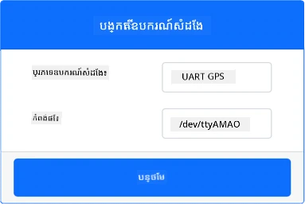
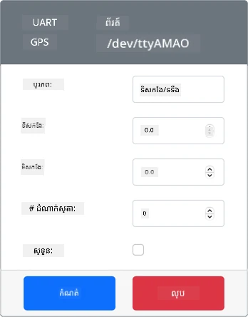
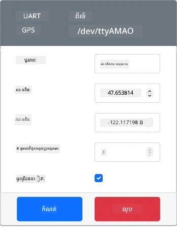
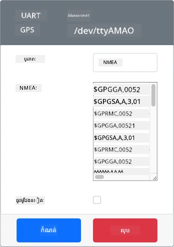
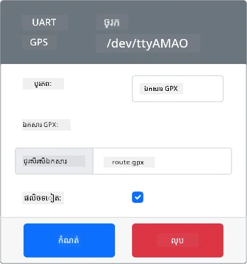

# អានទិន្នន័យ GPS - ឧបករណ៍ IoT វិរុតថល

ក្នុងផ្នែកនេះនៃមេរៀន អ្នកនឹងបន្ថែមឧបករណ៍មានឧស្សាហកម្ម GPS ទៅឧបករណ៍ IoT វិរុតថលរបស់អ្នក ហើយអានតម្លៃពីវា។

## ឧបករណ៍វិរុតថល

ឧបករណ៍ IoT វិរុតថលនឹងប្រើឧបករណ៍ GPS អំព្យូដែលបានចាក់សារបានតាមរយៈ UART តាមរយៈផ្លូវស៊េរី។

ឧបករណ៍ GPS រាងរែកតាមរយៈជាផ្នែករឹង មានអង់តែនាមួយសម្រាប់ទទួលរលកវិទ្យុពីផ្កាយ GPS ហើយបម្លែងសញ្ញា GPS ទៅជាទិន្នន័យ GPS។ កំណត់តួវិរុតថលនេះអង់តែនត្រូវបានស្ទាត់ម៉ូដែលដោយអនុញ្ញាតឱ្យអ្នកកំណត់រយៈទទឹង និងរយៈបណ្ដោយត្រង់ ដាក់បញ្ចូនប្រយោល NMEA ដើម ឬផ្ទុកឯកសារ GPX ជាមួយតំបន់ជាច្រើនដែលអាចត្រូវបានត្រឡប់ទៅតាមលំដាប់។

> 🎓 ប្រយោល NMEA នឹងត្រូវបានគ្របដណ្តប់នៅពេលក្រោយក្នុងមេរៀននេះ

### បន្ថែមឧបករណ៍ទៅ CounterFit

ដើម្បីប្រើឧបករណ៍ GPS វិរុតថល អ្នកត្រូវបន្ថែមឧបករណ៍មួយទៅកម្មវិធី CounterFit

####ភារកិច្ច - បន្ថែមឧបករណ៍ទៅ CounterFit

បន្ថែមឧបករណ៍ GPS ទៅកម្មវិធី CounterFit។

1. បង្កើតកម្មវិធី Python ថ្មីនៅលើកុំព្យូទ័ររបស់អ្នកក្នុងថតឯកសារដដែលឈ្មោះ `gps-sensor` មានឯកសារតែមួយឈ្មោះ `app.py` និងបរិបទ Python វិរុតថល ហើយបន្ថែមកញ្ចប់ pip របស់ CounterFit។

    > ⚠️ អ្នកអាចយោងទៅ [ការណែនាំសម្រាប់បង្កើត និងកំណត់កន្លែងគម្រោង Python CounterFit ក្នុងមេរៀន 1 ប្រសិនបើត្រូវការ](../../../1-getting-started/lessons/1-introduction-to-iot/virtual-device.md)។

1. តំឡើងកញ្ចប់ Pip បន្ថែមមួយដើម្បីដំឡើងឧបករណ៍ចំណុះ CounterFit ដែលអាចនិយាយជាមួយឧបករណ៍ UART តាមរយៈការតភ្ជាប់ស៊េរី។ អ្នកប្រាកដថាខណៈដែលតំឡើងត្រូវបើកបរិបទវិរុតថល។

    ```sh
    pip install counterfit-shims-serial
    ```

1. ប្រាកដថាកម្មវិធីបណ្ដាញ CounterFit កំពុងដំណើរការ

1. បង្កើតឧបករណ៍ GPS៖

    1. ក្នុងប្រអប់ *Create sensor* នៅផ្នែក *Sensors* បើកប្រអប់ *Sensor type* ហើយជ្រើស *UART GPS*។

    1. ទុកបន្ទាត់ *Port* នៅ */dev/ttyAMA0*

    1. ជ្រើសប៊ូតុង **Add** ដើម្បីបង្កើតឧបករណ៍ GPS នៅផត `/dev/ttyAMA0`

    

    ឧបករណ៍ GPS នឹងត្រូវបានបង្កើត និងបង្ហាញនៅក្នុងបញ្ជីឧបករណ៍។

    

## កម្មវិធីឧបករណ៍ GPS

ឧបករណ៍ IoT វិរុតថលឥឡូវនេះអាចត្រូវបានកម្មវិធីដើម្បីប្រើឧបករណ៍ GPS វិរុតថល។

### ភារកិច្ច - កម្មវិធីឧបករណ៍ GPS

កម្មវិធីកម្មវិធីឧបករណ៍ GPS។

1. ប្រាកដថាកម្មវិធី `gps-sensor` ត្រូវបានបើកនៅក្នុង VS Code

1. បើកឯកសារ `app.py`

1. បន្ថែមកូដខាងក្រោមទៅនៅលើសំណុំ `app.py` ដើម្បីភ្ជាប់កម្មវិធីទៅ CounterFit៖

    ```python
    from counterfit_connection import CounterFitConnection
    CounterFitConnection.init('127.0.0.1', 5000)
    ```

1. បន្ថែមកូដខាងក្រោមនេះនូវក្រោមដើម្បីនាំចូលបណ្ណាល័យខ្លះៗដែលត្រូវការ រួមទាំងបណ្ណាល័យសម្រាប់ច្រកស៊េរី CounterFit៖

    ```python
    import time
    import counterfit_shims_serial
    
    serial = counterfit_shims_serial.Serial('/dev/ttyAMA0')
    ```

    កូដនេះនាំចូលមេគុណ `serial` ពីកញ្ចប់ Pip `counterfit_shims_serial`។ វា បន្ទាប់ភ្ជាប់ទៅច្រកស៊េរី `/dev/ttyAMA0` - ដែលជាអាសយដ្ឋានច្រកស៊េរីដែលឧបករណ៍ GPS វិរុតថលប្រើសម្រាប់ច្រក UART របស់វា។

1. បន្ថែមកូដខាងក្រោមនេះនៅក្រោមដើម្បីអានពីច្រកស៊េរី ហើយបោះពុម្ពតម្លៃទៅកុងសូឡ៍៖

    ```python
    def print_gps_data(line):
        print(line.rstrip())
    
    while True:
        line = serial.readline().decode('utf-8')
    
        while len(line) > 0:
            print_gps_data(line)
            line = serial.readline().decode('utf-8')
    
        time.sleep(1)
    ```

    មុខងារ​មួយឈ្មោះ `print_gps_data` ត្រូវបានកំណត់ សម្រាប់បោះពុម្ពបន្ទាត់ដែលផ្ញើទៅវាទៅកុងសូឡ៍។

    បន្ទាប់មកកូដវាយវត្ដអស់កល្បជានិច្ច ដោយអានបន្ទាត់អក្សរជាច្រើនពីច្រកស៊េរីក្នុងអំឡុងវដ្តនីមួយៗ។ វាហៅមុខងារ `print_gps_data` សម្រាប់បន្ទាត់នីមួយៗ។

    បន្ទាប់ពីអានទិន្នន័យទាំងអស់រួច វដ្តនោះដេកសម្រាក ១ វិនាទី ហើយព្យាយាមម្ដងទៀត។

1. ប្រតិបត្តិកូដនេះ ប្រាកដថាអ្នកកំពុងប្រើផ្ទាំងបញ្ជារប្រតិបត្តិកាលផ្សេងពីដែលកម្មវិធី CounterFit កំពុងរត់ ដើម្បីឱ្យកម្មវិធី CounterFit បន្តរត់។

1. ពីកម្មវិធី CounterFit ផ្លាស់ប្តូរតម្លៃឧបករណ៍ gps ។ អ្នកអាចធ្វើបានដោយរបៀបចំណុចទាំងនេះ៖

    * កំណត់ **Source** ទៅ `Lat/Lon` ហើយកំណត់រយៈទទឹង, រយៈបណ្ដោយ និងចំនួនផ្កាយផែងដែលបានប្រើសម្រាប់ទទួល GPS fix ។ តម្លៃនេះនឹងត្រូវបញ្ចូនតែមួយដង, ដូច្នេះសូមពិនិត្យប្រអប់ **Repeat** ដើម្បីឲ្យទិន្នន័យបន្តធ្វើម្ដងម្កាលក្នុងមួយវិនាទី។

      

    * កំណត់ **Source** ទៅ `NMEA` ហើយបញ្ចូលប្រយោល NMEA តូចៗទៅក្នុងប្រអប់អក្សរ។ តម្លៃទាំងនេះនឹងត្រូវបញ្ចូនធ្វើម្ដងម្កាល ហើយមានការពន្យារពេល ១ វិនាទីមុនពេលអានប្រយោល GGA ថ្មីមួយ (ការត្រួតពិនិត្យទីតាំង) ។

      

      អ្នកអាចប្រើឧបករណ៍ដូចជា [nmeagen.org](https://www.nmeagen.org) ដើម្បីបង្កើតប្រយោលទាំងនេះដោយគូរសាលខណ្ឌលើផែនទី។ តម្លៃទាំងនេះនឹងត្រូវបញ្ចូនតែមួយដង, ដូច្នេះសូមពិនិត្យប្រអប់ **Repeat** ដើម្បីឲ្យទិន្នន័យធ្វើម្ដងម្កាលបន្ទាប់ពីបានផ្ញើទាំងអស់រួច។

    * កំណត់ **Source** ទៅឯកសារ GPX ហើយផ្ទុកឡើងឯកសារផ្លូវ GPX ដែលមានទីតាំងតាមផ្លូវ។ អ្នកអាចទាញយកឯកសារ GPX ពីគេហទំព័រផែនទីនិងដើរជិះមួយចំនួន ដូចជា [AllTrails](https://www.alltrails.com/). ឯកសារទាំងនេះមានទីតាំង GPS ជាច្រើនជាមធ្យោបាយ ហើយឧបករណ៍ GPS នឹងត្រឡប់ទីតាំងថ្មីជាបន្តបន្ទាប់គ្នា ក្នុងរយៈពេល ១ វិនាទី។

      

      តម្លៃទាំងនេះនឹងត្រូវបញ្ចូនតែមួយដង ដូច្នេះសូមពិនិត្យប្រអប់ **Repeat** ដើម្បីឲ្យទិន្នន័យធ្វើម្ដងម្កាលបន្ទាប់ពីបានផ្ញើទាំងអស់រួច។

    បន្ទាប់ពីអ្នកកំណត់រចនាសម្ព័ន្ធ GPS សូមជ្រើសប៊ូតុង **Set** ដើម្បីបញ្ជាក់តម្លៃទាំងនេះទៅឧបករណ៍។

1. អ្នកនឹងឃើញលទ្ធផលខ្លោងពីឧបករណ៍ GPS ដូចជា៖

    ```output
    $GNGGA,020604.001,4738.538654,N,12208.341758,W,1,3,,164.7,M,-17.1,M,,*67
    $GNGGA,020604.001,4738.538654,N,12208.341758,W,1,3,,164.7,M,-17.1,M,,*67
    ```

> 💁 អ្នកអាចរកឃើញកូដនេះនៅក្នុងថត [code-gps/virtual-device](../../../../../3-transport/lessons/1-location-tracking/code-gps/virtual-device) ។

😀 កម្មវិធីឧបករណ៍ GPS របស់អ្នកបានជោគជ័យ!

---

<!-- CO-OP TRANSLATOR DISCLAIMER START -->
**ការបដិសេធ**៖  
ឯកសារនេះត្រូវបានបកប្រែដោយប្រើសេវាកម្មបកប្រែ AI [Co-op Translator](https://github.com/Azure/co-op-translator)។ ទោះយើងខិតខំសម្រាប់ភាពត្រឹមត្រូវ ក៏សូមយកចិត្តទុកដាក់ថាការបកប្រែដោយស្វ័យប្រវត្តិអាចមានកំហុស ឬភាពមិនត្រឹមត្រូវ។ ឯកសារដើមក្នុងភាសាដើមគួរត្រូវបានគេចាត់ទុកជាដើមទាំងស្រុង។ សម្រាប់ព័ត៌មានសំខាន់ ការបកប្រែដោយអ្នកជំនាញអាចផ្ដល់ព័ត៌មានបានល្អជាង។ យើងមិនទទួលខុសត្រូវចំពោះការយល់ច្រឡំ ឬការបកប្រែខុសឆ្គងណាមួយដែលកើតឡើងពីការប្រើប្រាស់ការបកប្រែនេះទេ។
<!-- CO-OP TRANSLATOR DISCLAIMER END -->