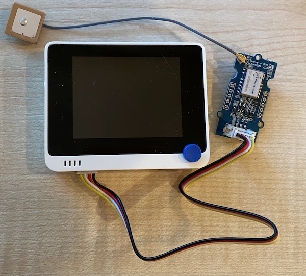

# អានទិន្នន័យ GPS - Wio Terminal

នៅក្នុងផ្នែកនេះនៃមេរៀន អ្នកនឹងបន្ថែមឧបករណ៍ចាប់សញ្ញា GPS ទៅកាន់ Wio Terminal របស់អ្នក ហើយអានតម្លៃពីវា។

## ឧបករណ៍រឹង

Wio Terminal ត្រូវការឧបករណ៍ចាប់សញ្ញា GPS។

ឧបករណ៍ដែលអ្នកនឹងប្រើគឺ [Grove GPS Air530 sensor](https://www.seeedstudio.com/Grove-GPS-Air530-p-4584.html)។ ឧបករណ៍នេះអាចភ្ជាប់ទៅប្រព័ន្ធ GPS ផ្សេងៗសម្រាប់ការកំណត់ទីតាំងលឿន និងត្រឹមត្រូវ។ ឧបករណ៍នេះមានពីរផ្នែក - អេឡិចត្រូនិចស្នូលរបស់ឧបករណ៍ និងអង់ទីណាផ្ទៃក្រៅដែលភ្ជាប់ដោយខ្សែស្រឡាយស្តើងសម្រាប់ទទួលរលកវិទ្យុពីផ្កាយយោធា។

នេះជាឧបករណ៍ UART ដូច្នេះវាបញ្ជូនទិន្នន័យ GPS តាមរយៈ UART។

### ភ្ជាប់ឧបករណ៍ចាប់សញ្ញា GPS

ឧបករណ៍ Grove GPS អាចភ្ជាប់ទៅ Wio Terminal។

#### ភារកិច្ច - ភ្ជាប់ឧបករណ៍ចាប់សញ្ញា GPS

ភ្ជាប់ឧបករណ៍ចាប់សញ្ញា GPS។


1. បញ្ចូលចុងត្រង់មួយនៃខ្សែ Grove ទៅក្នុងកំពង់ភ្ជាប់លើឧបករណ៍ចាប់សញ្ញា GPS។ វានឹងចូលតែម្តងតែមួយបែប។

1. នៅពេលដែល Wio Terminal មិនភ្ជាប់ទៅកាន់កុំព្យូទ័រឬអានត្ថាដល់ថ្មផ្សេងទៀតឡើយ សូមភ្ជាប់ចុងទៀតនៃខ្សែ Grove ទៅកាន់កំពង់ភ្ជាប់ Grove ខាងឆ្វេងលើ Wio Terminal ដូចដែលអ្នកមើលទៅកាន់អេក្រង់។ នេះគឺជាកំពង់ដែលនៅជិតប៊ូតុងថ្មបំផុត។

    

1. ដាក់ឧបករណ៍មកេត្ត GPS ដើម្បីអង់ទីណាភ្ជាប់មានការមើលឃើញមេឃ - ជាសាកល្បងជិតបង្អួចបើកឬខាងហายนៅក្រៅផ្ទះ។ វាងាយស្រួលទទួលសញ្ញាច្បាស់ជាងពេលមានអ្វីមួយរាំងខ្សែអង់ទីណា។

1. ឥឡូវនេះ អ្នកអាចភ្ជាប់ Wio Terminal ទៅកាន់កុំព្យូទ័ររបស់អ្នកបាន។

1. ឧបករណ៍ចាប់សញ្ញា GPS មាន LED ២ចំណុច - LED ពណ៌ខៀវដែលភ្លឺចេញពេលទិន្នន័យបញ្ជូន និង LED ពណ៌បៃតងដែលភ្លឺរៀងរាល់មួយវិនាទីពេលទទួលទិន្នន័យពីផ្កាយយោធា។ អះអាងថា LED ខៀវកំពុងភ្លឺពេលអ្នកបើក Wio Terminal។ បន្ទាប់ពីប៉ុន្មាននាទី LED បៃតងនឹងភ្លឺ - ប្រសិនបើមិនដូច្នោះ អ្នកប្រហែលជាចាំបាច់ប្ដូរទីតាំងអង់ទីណា។

## កម្មវិធីឧបករណ៍ចាប់សញ្ញា GPS

ឥឡូវនេះ Wio Terminal អាចត្រូវបានកម្មវិធីដើម្បីប្រើឧបករណ៍ចាប់សញ្ញា GPS ដែលភ្ជាប់។

### ភារកិច្ច - កម្មវិធីឧបករណ៍ចាប់សញ្ញា GPS

កម្មវិធីឧបករណ៍។

1. បង្កើតគម្រោង Wio Terminal ថ្មីដោយប្រើ PlatformIO ហៅគម្រោងនេះថា `gps-sensor`។ បន្ថែមកូដនៅក្នុងមុខងារ `setup` ដើម្បីកំណត់ការកំណត់របស់ច្រកស៊េរី។

1. បន្ថែមបញ្ជា include ខាងក្រោមទៅកំពូលឯកសារ `main.cpp`។ នេះរួមបញ្ចូលឯកសារ header ដែលមានមុខងារកំណត់ច្រក Grove ខាងឆ្វេងសម្រាប់ UART។

    ```cpp
    #include <wiring_private.h>
    ```

1. ក្រោមនេះ បន្ថែមបន្ទាត់កូដខាងក្រោមដើម្បីប្រកាសការតភ្ជាប់ច្រកស៊េរីទៅច្រក UART:

    ```cpp
    static Uart Serial3(&sercom3, PIN_WIRE_SCL, PIN_WIRE_SDA, SERCOM_RX_PAD_1, UART_TX_PAD_0);
    ```

1. អ្នកត្រូវបន្ថែមកូដមួយចំនួនដើម្បីប្តូរគណិក្រះសញ្ញានៅក្នុងទៅច្រកស៊េរីនេះ។ បន្ថែមកូដខាងក្រោមក្រោមការប្រកាស `Serial3`:

    ```cpp
    void SERCOM3_0_Handler()
    {
        Serial3.IrqHandler();
    }
    
    void SERCOM3_1_Handler()
    {
        Serial3.IrqHandler();
    }
    
    void SERCOM3_2_Handler()
    {
        Serial3.IrqHandler();
    }
    
    void SERCOM3_3_Handler()
    {
        Serial3.IrqHandler();
    }
    ```

1. ក្នុងមុខងារ `setup` ខាងក្រោមកន្លែងកំណត់ច្រក `Serial` បញ្ជាក់ច្រកស៊េរី UART ជាមួយកូដខាងក្រោម៖

    ```cpp
    Serial3.begin(9600);

    while (!Serial3)
        ; // រង់ចាំឲ្យ Serial3 ត្រៀមរួច

    delay(1000);
    ```

1. ខាងក្រោមកូដនេះក្នុងមុខងារ `setup` បន្ថែមកូដខាងក្រោមដើម្បីភ្ជាប់ពិន Grove ទៅច្រកស៊េរី:

    ```cpp
    pinPeripheral(PIN_WIRE_SCL, PIO_SERCOM_ALT);
    ```

1. បន្ថែមមុខងារខាងក្រោមមុខងារ `loop` ដើម្បីផ្ញើទិន្នន័យ GPS ទៅម៉ូនីទ័រស៊េរី:

    ```cpp
    void printGPSData()
    {
        Serial.println(Serial3.readStringUntil('\n'));
    }
    ```

1. ក្នុងមុខងារ `loop` បន្ថែមកូដខាងក្រោមសម្រាប់អានពីច្រកស៊េរី UART ហើយបង្ហាញលទ្ធផលទៅម៉ូនីទ័រស៊េរី:

    ```cpp
    while (Serial3.available() > 0)
    {
        printGPSData();
    }
    
    delay(1000);
    ```

    កូដនេះអានពីច្រកស៊េរី UART។ មុខងារ `readStringUntil` អានរហូតដល់តួអក្សរបញ្ចប់ មួយនៅទីនេះគឺជាបន្ទាត់ថ្មី។ វានឹងអានឃ្លា NMEA ទាំងមូល (ឃ្លា NMEA ត្រូវបានបញ្ចប់ដោយតួអក្សរបន្ទាត់ថ្មី)។ ដល់ពេលដែលទិន្នន័យអាចអានពីច្រក UART បាន វានឹងអាន ហើយផ្ញើទៅម៉ូនីទ័រដោយប្រើមុខងារ `printGPSData`។ ពេលវេលាអានមិនបានទៀត `loop` នឹងពន្យារពេល ១ វិនាទី (1000ms)។

1. បង្កើត និងបញ្ចូលកូដទៅកាន់ Wio Terminal។

1. បន្ទាប់ពីបានបញ្ចូល អ្នកអាចត្រួតពិនិត្យទិន្នន័យ GPS ដោយប្រើម៉ូនីទ័រស៊េរី។

    ```output
    > Executing task: platformio device monitor <
    
    --- Available filters and text transformations: colorize, debug, default, direct, hexlify, log2file, nocontrol, printable, send_on_enter, time
    --- More details at http://bit.ly/pio-monitor-filters
    --- Miniterm on /dev/cu.usbmodem1201  9600,8,N,1 ---
    --- Quit: Ctrl+C | Menu: Ctrl+T | Help: Ctrl+T followed by Ctrl+H ---
    $GNGGA,020604.001,4738.538654,N,12208.341758,W,1,3,,164.7,M,-17.1,M,,*67
    $GPGSA,A,1,,,,,,,,,,,,,,,*1E
    $BDGSA,A,1,,,,,,,,,,,,,,,*0F
    $GPGSV,1,1,00*79
    $BDGSV,1,1,00*68
    ```

> 💁 អ្នកអាចរកឃើញកូដនេះនៅក្នុងថត [code-gps/wio-terminal](../../../../../3-transport/lessons/1-location-tracking/code-gps/wio-terminal)។

😀 កម្មវិធីឧបករណ៍ចាប់សញ្ញា GPS របស់អ្នកជោគជ័យ!

---

<!-- CO-OP TRANSLATOR DISCLAIMER START -->
**ការធ្វើបាយ**៖  
ឯកសារនេះត្រូវបានបកប្រែដោយប្រើសេវាបកប្រែ AI [Co-op Translator](https://github.com/Azure/co-op-translator)។ ខណៈពេលដែលយើងខិតខំផ្តល់ភាពត្រឹមត្រូវ សូមចំណាំថាការបកប្រែដោយស្វ័យប្រវត្តិនោះអាចមានកំហុសឬភាពមិនត្រឹមត្រូវ។ ឯកសារដែលមានភាសាដើមគួរត្រូវបានពិចារណាទៅជាផលិតផលដើមដែលមានសុពលភាព។ សម្រាប់ព័ត៌មានសំខាន់ណាស់ ជំនាញបកប្រែដោយមនុស្សមានវិជ្ជាជីវៈគឺត្រូវបានផ្តល់អនុសាសន៍។ យើងមិនទទួលខុសត្រូវចំពោះការយល់ច្រឡំ ឬការបកប្រែដែលមានការយល់ច្រឡំណាមួយដែលកើតឡើងពីការប្រើប្រាស់បកប្រែកម្មនេះឡើយ។
<!-- CO-OP TRANSLATOR DISCLAIMER END -->