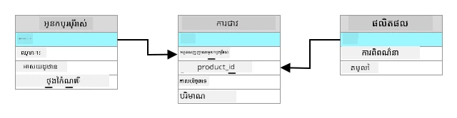
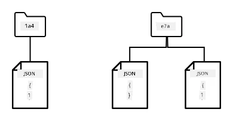
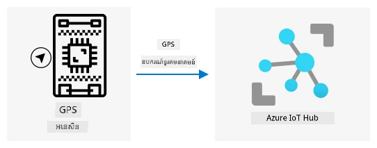
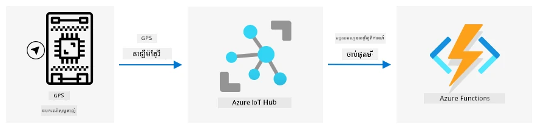
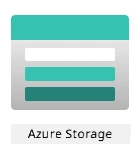
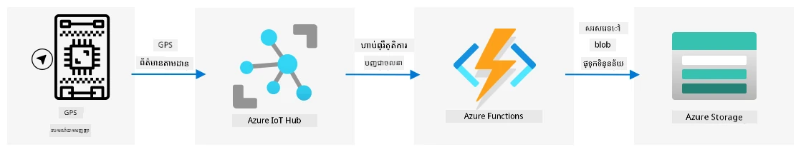

# ផ្ទុកទិន្នន័យទីតាំង


> សេចក្ដីសង្ខេបដោយ [Nitya Narasimhan](https://github.com/nitya)។ ចុចលើរូបភាពដើម្បីទទួលបានមុខងារធំជាងនេះ។

## ការសាកល្បងមុនមេរៀន

[ការសាកល្បងមុនមេរៀន](https://black-meadow-040d15503.1.azurestaticapps.net/quiz/23)

## ការណែនាំ

ក្នុងមេរៀនចុងក្រោយ អ្នកបានរៀនពីរបៀបប្រើឧបករណ៍សំគាល់មុខ GPS ដើម្បីចាប់យកទិន្នន័យទីតាំង។ ដើម្បីប្រើទិន្នន័យនេះក្នុងការបង្ហាញទីតាំងរថយន្តដឹកម្ហូប និងដំណើររបស់វា វាត្រូវត្រូវបានផ្ញើទៅសេវាកម្ម IoT ក្នុងពពក ហើយបន្ទាប់មកផ្ទុកនៅកន្លែងណាមួយ។

ក្នុងមេរៀននេះ អ្នកនឹងរៀនអំពីវិធីផ្សេងៗក្នុងការផ្ទុកទិន្នន័យ IoT ហើយរៀនពីរបៀបផ្ទុកទិន្នន័យពីសេវាកម្ម IoT របស់អ្នកដោយប្រើកូដមិនមានម៉ាស៊ីនបម្រើ។

ក្នុងមេរៀននេះ យើងនឹងគ្របដណ្តប់ៈ

* [ទិន្នន័យដែលមានរចនាសម្ព័ន្ធ និងទិន្នន័យដែលគ្មានរចនាសម្ព័ន្ធ](#ទិន្នន័យដែលមានរចនាសម្ព័ន្ធ-និងទិន្នន័យដែលគ្មានរចនាសម្ព័ន្ធ)
* [ផ្ញើទិន្នន័យ GPS ទៅ IoT Hub](#ផ្ញើទិន្នន័យ-gps-ទៅ-iot-hub)
* [ផ្លូវក្ដៅ ផ្លូវកម្តៅ និងផ្លូវត្រជាក់](#ផ្លូវក្ដៅ-ផ្លូវកម្តៅ-និងផ្លូវត្រជាក់)
* [គ្រប់គ្រងព្រឹត្តិការណ៍ GPS ដោយប្រើកូដមិនមានម៉ាស៊ីនបម្រើ](#គ្រប់គ្រងព្រឹត្តិការណ៍-gps-ដោយប្រើកូដមិនមានម៉ាស៊ីនបម្រើ)
* [គណនីផ្ទុក Azure](#គណនីផ្ទុក-azure-storage-accounts)
* [តភ្ជាប់កូដមិនមានម៉ាស៊ីនបម្រើរបស់អ្នកទៅការផ្ទុក](#ភ្ជាប់កូដ-serverless-របស់អ្នកទៅផ្ទុកទិន្នន័យ)

## ទិន្នន័យដែលមានរចនាសម្ព័ន្ធ និងទិន្នន័យដែលគ្មានរចនាសម្ព័ន្ធ

ប្រព័ន្ធកុំព្យូទ័រប្រើប្រាស់ទិន្នន័យ ហើយទិន្នន័យនេះមានទម្រង់ និងទំហំប្លែកៗគ្នា។ វាអាចមានតម្លៃពីលេខតែមួយ ដល់អត្ថបទច្រើន ដល់វីដេអូ និងរូបភាព និងទិន្នន័យ IoT។ ទិន្នន័យនេះផ្លែក្ៗគ្នាទៅក្នុងពីរប្រភេទមួយនោះគឺ *ទិន្នន័យដែលមានរចនាសម្ព័ន្ធ* និង *ទិន្នន័យដែលគ្មានរចនាសម្ព័ន្ធ*។

* **ទិន្នន័យដែលមានរចនាសម្ព័ន្ធ** គឺទិន្នន័យដែលមានរចនាសម្ព័ន្ធច្បាស់លាស់ និងរឹងមាំ មិនប្រែប្រួល ហើយជាទូទៅត្រូវបានផែនទីទៅតារាងទិន្នន័យដែលមានទំនាក់ទំនងគ្នា។ ឧទាហរណ៏មួយគឺព័ត៌មានផ្ទាល់ខ្លួនរបស់មនុស្សរួមមានឈ្មោះ ថ្ងៃខែឆ្នាំកំណើត និងទ្រនំទីលំនៅ។

* **ទិន្នន័យដែលគ្មានរចនាសម្ព័ន្ធ** គឺទិន្នន័យដែលមិនមានរចនាសម្ព័ន្ធច្បាស់លាស់ និងរឹងមាំ រួមមកពីទិន្នន័យដែលអាចប្រែប្រួលរចនាសម្ព័ន្ធបានជាញឹកញាប់។ ឧទាហរណ៏មួយគឺឯកសារដូចជាឯកសារសរសេរ ឬសៀវភៅបត់តារាង។

✅ ស្រាវជ្រាវមួយចំនួន៖ តើអ្នកអាចគិតពីឧទាហរណ៏ផ្សេងទៀតនៃទិន្នន័យដែលមានរចនាសម្ព័ន្ធ និងទិន្នន័យដែលគ្មានរចនាសម្ព័ន្ធ?

> 💁 មានទិន្នន័យសែម​រចនាសម្ព័ន្ធផងដែលមានរចនាសម្ព័ន្ធ ប៉ុន្តែវាមិនសមរម្យចូលក្នុងតារាងទិន្នន័យថ្នាក់ទីមួយដែលមានកំណត់។

ទិន្នន័យ IoT ត្រូវបានគិតថាជាទិន្នន័យដែលគ្មានរចនាសម្ព័ន្ធជាទូទៅ។

ស្រមៃថាអ្នកកំពុងបន្ថែមឧបករណ៍ IoT ចូលក្នុងទូកគ្រប់គ្រងបញ្ជារានៃយានយន្តសម្រាប់កសិដ្ឋានពាណិជ្ជកម្មធំមួយ។ អ្នកប្រហែសថ្មីលើឧបករណ៍ផ្សេងៗគ្នាសម្រាប់ប្រភេទយានយន្តផ្សេងៗ។ ឧទាហរណ៏៖

* សំរាប់យានយន្តកសិកម្មដូចជាត្រាក់ទ័រ អ្នកចង់បានទិន្នន័យ GPS ដើម្បីធានាថាវាកំពុងដំណើរការនៅលើស្រែត្រឹមត្រូវ
* សំរាប់រថយន្តដឹកជញ្ជូនម្ហូបទៅឃ្លាំង អ្នកចង់បានទិន្នន័យ GPS ព្រមទាំងទិន្នន័យល្បឿន និងការបង្កល្បឿន ដើម្បីធានាថាវិថីបើកបើកយានយន្តយ៉ាងសុវត្ថិភាព និងទិន្នន័យអត្តសញ្ញាណអ្នកបើក និងទិន្នន័យចាប់ផ្តើម/បញ្ឈប់ ដើម្បីធានាថាមានការទទួលខុសត្រូវការបើកបរ​តាមច្បាប់មូលដ្ឋានស្តីពីម៉ោងធ្វើការ
* សំរាប់រថយន្តត្រជាក់ទឹកកក អ្នកចង់បានទិន្នន័យសីតុណ្ហភាពដើម្បីធានាថាខម្អែមិនមានកំដៅខ្ពស់ ឬត្រជាក់ទាបពេក ដែលអាចបំផ្លាញម្ហូបក្នុងដំណើរ។

ទិន្នន័យនេះអាចប្រែប្រួលជានិរន្តរ៍។ ឧទាហរណ៏ បើឧបករណ៍ IoT នៅក្នុងជាន់រថយន្តទន្ទឹម អ្នកផ្ញើទិន្នន័យអាចប្រែប្រួលទៅតាមការផ្លាស់ប្ដូររបស់ទូកទស្សន៍មួយ ដូចជាការផ្ញើទិន្នន័យសីតុណ្ហភាពតែពេលមានទូកទស្សន៍ត្រជាក់ទឹកកកត្រូវបានប្រើប្រាស់ជាដើម។

✅ តើទិន្នន័យ IoT ផ្សេងទៀតអ្វីខ្លះដែលអាចចាប់យកបាន? សូមគិតពីប្រភេទទំនិញដែលរថយន្តអាចនាំចូល និងទិន្នន័យថែទាំនានា។

ទិន្នន័យនេះប្រែប្រួលពីយានយន្តមួយទៅមួយ ប៉ុន្តែទាំងអស់ត្រូវបានផ្ញើទៅសេវាកម្ម IoT ដូចគ្នាសម្រាប់ដំណើរការជាពេលមួយ។ សេវា IoT ត្រូវការការដំណើរការទិន្នន័យគ្មានរចនាសម្ព័ន្ធនេះ ដោយផ្ទុកវាប្រើរបៀបដែលអនុញ្ញាតឱ្យស្វែងរក ឬវិភាគបាន ក្នុងន័យថាវាចង់អាចដំណើរការរចនាសម្ព័ន្ធច្រើនផ្សេងៗគ្នានៃទិន្នន័យនេះបាន។

### ការផ្ទុកទិន្នន័យ SQL ប្រៀបធៀប NoSQL

មូលដ្ឋានទិន្នន័យគឺជាសេវាកម្មដែលធ្វើឲ្យអ្នកអាចផ្ទុក និងស្វែងយល់ពីទិន្នន័យបាន។ មូលដ្ឋានទិន្នន័យមានពីរប្រភេទ - SQL និង NoSQL

#### មូលដ្ឋានទិន្នន័យ SQL

មូលដ្ឋានទិន្នន័យដំបូងគឺ ប្រព័ន្ធគ្រប់គ្រងមូលដ្ឋានទិន្នន័យទំនាក់ទំនង (RDBMS) ឬ មូលដ្ឋានទិន្នន័យទំនាក់ទំនង។ វាត្រូវបានគេស្គាល់ថាជាមូលដ្ឋានទិន្នន័យ SQL ក្រោយភាសាតំណើរការជាក់លាក់ (SQL) ដែលប្រើសម្រាប់ផ្ទុក លុប បន្ទាន់សម័យ ឬស្វែងយល់ទិន្នន័យ។ មូលដ្ឋានទិន្នន័យទាំងនេះមាន Schema - ជាសំណុំតារាងទិន្នន័យដែលកំណត់ជាក់លាក់ ដូចជាសៀវភៅបត់តារាងមួយ។ តារាងនីមួយៗមានជួរឈរឈ្មោះច្រើន។ នៅពេលអ្នកបញ្ចូលទិន្នន័យ អ្នកបន្ថែមជួរដេកមួយទៅតារាង ដាក់តម្លៃទៅក្នុងជួរឈរនីមួយៗ។ វាធ្វើឲ្យទិន្នន័យនៅក្នុងរចនាសម្ព័ន្ធរឹងមាំណាស់ - ទោះបីអ្នកអាចទុកឱ្យជួរឈរមួយទំនេរ ប្រសិនបើមានបំណងបន្ថែមជួរឈរថ្មី អ្នកត្រូវធ្វើវានៅលើមូលដ្ឋានទិន្នន័យ និងបំពេញតម្លៃសម្រាប់ជួរដេកដែលមានរួច។ មូលដ្ឋានទិន្នន័យទាំងនេះជាទំនាក់ទំនងដែលមានតារាងមួយអាចមានទំនាក់ទំនងទៅតារាងផ្សេងទៀត។



ឧទាហរណ៍ ប្រសិនបើអ្នកផ្ទុកព័ត៌មានផ្ទាល់ខ្លួនរបស់អ្នកប្រើនៅក្នុងតារាងមួយ អ្នកនឹងមានលេខសម្គាល់ផ្ទាល់ខ្លួនឯកតាសម្រាប់អ្នកប្រើនីមួយៗ ដែលប្រើនៅជួរដេកមួយក្នុងតារាងដែលមានឈ្មោះ និងអាសយដ្ឋានរបស់អ្នកប្រើ។ បើអ្នកចង់ផ្ទុកព័ត៌មានផ្សេងទៀតអំពីអ្នកប្រើ នោះដូចជា ការទិញរបស់ពួកគេ ក្នុងតារាងមួយផ្សេងទៀត អ្នកនឹងមានជួរឈរមួយក្នុងតារាងថ្មីសម្រាប់លេខសម្គាល់អ្នកប្រើនោះ។ នៅពេលអ្នកស្វែងរកអ្នកប្រើ អ្នកអាចប្រើលេខសម្គាល់របស់ពួកគេដើម្បីទទួលបានព័ត៌មានផ្ទាល់ខ្លួនពីតារាងមួយ និងការទិញពីតារាងមួយផ្សេងទៀត។

មូលដ្ឋានទិន្នន័យ SQL សមស្របសម្រាប់ផ្ទុកទិន្នន័យដែលមានរចនាសម្ព័ន្ធ និងសម្រាប់ពេលដែលអ្នកចង់ធានាថាទិន្នន័យត្រូវគ្នាជាមួយ Schema របស់អ្នក។

✅ ប្រសិនបើអ្នកមិនធ្លាប់ប្រើ SQL មុននេះ ទុកពេលមួយសម្រាប់អានអំពីវាពី [ទំព័រ SQL លើ Wikipedia](https://wikipedia.org/wiki/SQL)។

មូលដ្ឋានទិន្នន័យ SQL ដែលគេស្គាល់មានរួមមាន Microsoft SQL Server, MySQL និង PostgreSQL។

✅ ស្រាវជ្រាវមួយចំនួន៖ អានអំពីមូលដ្ឋានទិន្នន័យ SQL ទាំងនេះ និងសមត្ថភាពរបស់វា។

#### មូលដ្ឋានទិន្នន័យ NoSQL

មូលដ្ឋានទិន្នន័យ NoSQL ត្រូវបានហៅថា NoSQL ព្រោះវាមិនមានរចនាសម្ព័ន្ធរឹងមាំដូចមូលដ្ឋានទិន្នន័យ SQL ទេ។ វាក៏ត្រូវបានហៅថាមូលដ្ឋានទិន្នន័យឯកសារ ព្រោះវាអាចផ្ទុកទិន្នន័យគ្មានរចនាសម្ព័ន្ធ ដូចជា ឯកសារប្រភេទជាឯកសារ។

> 💁 បើទោះបីមានឈ្មោះក៏ដោយ មូលដ្ឋានទិន្នន័យ NoSQL ខ្លះៗ អាចអនុញាតឱ្យអ្នកប្រើ SQL ដើម្បីស្វែងរកទិន្នន័យបាន។



មូលដ្ឋានទិន្នន័យ NoSQL មិនមាន Schema ដែលកំណត់មុនជាក់លាក់ដែលកំណត់របៀបបំពេញទិន្នន័យទេ ផ្ទុយទៅវិញ អ្នកអាចបញ្ចូលទិន្នន័យគ្មានរចនាសម្ព័ន្ធណាមួយ ច្រើនភាគច្រើនដោយប្រើឯកសារ JSON។ ឯកសារเหล่านี้អាចត្រូវបានរៀបចំទៅក្នុងថតជាដូចជា ឯកសារលើកុំព្យូទ័ររបស់អ្នក។ ឯកសារនីមួយៗអាចមានវាលខុសគ្នាពីឯកសារផ្សេងៗ - ឧទាហរណ៍ ប្រសិនបើអ្នកកំពុងផ្ទុកទិន្នន័យ IoT ពីយានយន្តកសិកម្មរបស់អ្នក មួយចំនួនអាចមានវាលសម្រាប់ទិន្នន័យអេកសែលឡែរកូម៉ែត្រ និងល្បឿន ខណៈដែលអ្នកដទៃអាចមានវាលសម្រាប់សីតុណ្ហភាពនៅក្នុងទូកទស្សន៍។ ប្រសិនបើអ្នកបន្ថែមប្រភេទរថយន្តថ្មីមួយ ដូចជាធ្វើរថយន្តជាមួយតុល្យភាពសាកល្បងក្នុងខ្លួន ដើម្បីតាមដានទម្ងន់ផលិតផលដែលបានដឹកដាក់ អ្នកនឹងអាចបន្ថែមវាលថ្មីនេះ ហើយវាអាចផ្ទុកបានដោយមិនចាំបាច់ផ្លាស់ប្តូរមូលដ្ឋានទិន្នន័យទេទេ។

មូលដ្ឋានទិន្នន័យ NoSQL ដែលគេស្គាល់រួមមាន Azure CosmosDB, MongoDB និង CouchDB។

✅ ស្រាវជ្រាវមួយចំនួន៖ អានអំពីមូលដ្ឋានទិន្នន័យ NoSQL ទាំងនេះ និងសមត្ថភាពរបស់វា។

ក្នុងមេរៀននេះ អ្នកនឹងប្រើការផ្ទុក NoSQL សម្រាប់ផ្ទុកទិន្នន័យ IoT។

## ផ្ញើទិន្នន័យ GPS ទៅ IoT Hub

ក្នុងមេរៀនចុងក្រោយ អ្នកបានចាប់យកទិន្នន័យ GPS ពីឧបករណ៍សំគាល់ GPS ដែលភ្ជាប់ទៅឧបករណ៍ IoT របស់អ្នក។ ដើម្បីផ្ទុកទិន្នន័យ IoT នេះក្នុងពពក អ្នកត្រូវផ្ញើវាទៅសេវាកម្ម IoT។ ម្តងទៀត អ្នកនឹងប្រើ Azure IoT Hub សេវាកម្មពពក IoT ដូចគ្នានេះនៅក្នុងគម្រោងមុន។



### ការងារ - ផ្ញើទិន្នន័យ GPS ទៅ IoT Hub

1. បង្កើត IoT Hub ថ្មីមួយដោយប្រើផ្នែករួមឥតគិតថ្លៃ។

    > ⚠️ អ្នកអាចយោងទៅក្នុង [សេចក្តីណែនាំសម្រាប់បង្កើត IoT Hub ពីគម្រោងទី 2 មេរៀន 4](../../../2-farm/lessons/4-migrate-your-plant-to-the-cloud/README.md#create-an-iot-service-in-the-cloud) ប្រសិនបើចាំបាច់។

    ចងចាំបង្កើត Resource Group ថ្មីមួយ។ ឈ្មោះ Resource Group ថ្មី `gps-sensor` ហើយ IoT Hub ថ្មីគួរតែមានឈ្មោះតែមួយផ្អែកលើ `gps-sensor` ដូចជា `gps-sensor-<ឈ្មោះរបស់អ្នក>`។

    > 💁 ប្រសិនបើអ្នកនៅតែមាន IoT Hub ពីគម្រោងមុន អ្នកអាចប្រើវាបានម្ដងទៀត។ ចងចាំប្រើឈ្មោះ IoT Hub នេះ និង Resource Group ដែលវាផ្ទុកនៅក្នុងពេលបង្កើតសេវាកម្មផ្សេងទៀត។

1. បន្ថែមឧបករណ៍ថ្មីមួយទៅ IoT Hub។ ហៅឧបករណ៍នេះថា `gps-sensor`។ ទាញយកសន្លឹកខ្សែការតភ្ជាប់សម្រាប់ឧបករណ៍នេះ។

1. បន្ទាន់សម័យកូដឧបករណ៍របស់អ្នកដើម្បីផ្ញើទិន្នន័យ GPS ទៅ IoT Hub ថ្មីដោយប្រើខ្សែការតភ្ជាប់ឧបករណ៍ពីជំហានមុន។

    > ⚠️ អ្នកអាចយោងទៅក្នុង [សេចក្តីណែនាំសម្រាប់ភ្ជាប់ឧបករណ៍របស់អ្នកទៅឧបករណ៍ IoT ពីគម្រោងទី 2 មេរៀន 4](../../../2-farm/lessons/4-migrate-your-plant-to-the-cloud/README.md#connect-your-device-to-the-iot-service) ប្រសិនបើចាំបាច់។

1. នៅពេលអ្នកផ្ញើទិន្នន័យ GPS សូមផ្ញើវាជា JSON ក្នុងទ្រង់ទ្រាយដូចខាងក្រោម:

    ```json
    {
        "gps" :
        {
            "lat" : <latitude>,
            "lon" : <longitude>
        }
    }
    ```

1. ផ្ញើទិន្នន័យ GPS រាល់មួយនាទី ដើម្បីមិនប្រើបំណែកសារប្រចាំថ្ងៃរបស់អ្នក។

ប្រសិនបើអ្នកប្រើ Wio Terminal សូមចងចាំបន្ថែមបណ្ណាល័យទាំងអស់ដែលចាំបាច់ ហើយកំណត់ម៉ោងដោយប្រើម៉ាស៊ីនបម្រើ NTP។ កូដរបស់អ្នកត្រូវមាននូវការប្រាកដថាវាបានអានទិន្នន័យពីច្រកស៊េរីរួចមុនផ្ញើទីតាំង GPS ដោយប្រើកូដដែលមានរួចពីមេរៀនមុន។ ប្រើកូដខាងក្រោមក្នុងការបង្កើតឯកសារ JSON៖

```cpp
DynamicJsonDocument doc(1024);
doc["gps"]["lat"] = gps.location.lat();
doc["gps"]["lon"] = gps.location.lng();
```

ប្រសិនបើអ្នកប្រើឧបករណ៍ IoT មេរៀនវើចឆាល សូមចងចាំដំឡើងបណ្ណាល័យទាំងអស់តាមបរិបទវើចឆាលដ៏ត្រឹមត្រូវ។

សម្រាប់ Raspberry Pi និងឧបករណ៍ IoT មេរៀនវើចឆាល អ្នកត្រូវប្រើកូដដែលមានរួចពីមេរៀនមុនដើម្បីទទួលបានតម្លៃចន្លោះទទឹង និងបណ្ដោយ បន្ទាប់មកផ្ញើវានៅក្នុងទ្រង់ទ្រាយ JSON ត្រឹមត្រូវដោយប្រើកូដដូចខាងក្រោម៖

```python
message_json = { "gps" : { "lat":lat, "lon":lon } }
print("Sending telemetry", message_json)
message = Message(json.dumps(message_json))
```

> 💁 អ្នកអាចរកឃើញកូដនេះនៅក្នុងថត [code/wio-terminal](../../../../../3-transport/lessons/2-store-location-data/code/wio-terminal), [code/pi](../../../../../3-transport/lessons/2-store-location-data/code/pi) ឬ [code/virtual-device](../../../../../3-transport/lessons/2-store-location-data/code/virtual-device) ។

រត់កូដឧបករណ៍របស់អ្នក និងធ្វើអោយប្រាកដថាសារបានបញ្ជូនចូលទៅក្នុង IoT Hub ដោយប្រើពាក្យបញ្ជា CLI `az iot hub monitor-events`។

## ផ្លូវក្ដៅ ផ្លូវកម្តៅ និងផ្លូវត្រជាក់

ទិន្នន័យដែលធ្លាក់ចេញពីឧបករណ៍ IoT ទៅពពកមិនត្រូវបានដំណើរការជារហ័សជានិច្ច។ ទិន្នន័យខ្លះត្រូវការបរិច្ឆេទបន្ទាន់ ខណៈទីតាំងផ្សេងទៀតអាចដំណើរការជាមុន តិចៗ ហើយទិន្នន័យផ្សេងទៀតអាចដំណើរការពេលក្រោយជាពណ៌ដ៏ច្រើនកាល។ របៀបដំណើរការទិន្នន័យទៅសេវាកម្មផ្សេងៗ ដែលដំណើរការទិន្នន័យនៅពេលខុសគ្នានេះហៅថា ផ្លូវក្ដៅ, ផ្លូវកម្តៅ និងផ្លូវត្រជាក់។

### ផ្លូវក្ដៅ

ផ្លូវក្ដៅមានន័យថាទិន្នន័យត្រូវបានដំណើរការជាបន្ទាន់ ឬជិតនឹងពេលខ្លី។ អ្នកប្រើផ្លូវក្ដៅសម្រាប់សញ្ញាឧបករណ៍ដូចជា ទទួលបានសញ្ញាថាយានយន្តកំពុងជិតមជ្ឈមណ្ឌល ឬសីតុណ្ហភាពក្នុងរថយន្តត្រជាក់ទឹកកកលើសកម្រិត។

ដើម្បីប្រើទិន្នន័យផ្លូវក្ដៅ កូដរបស់អ្នកនឹងតបស្នងចំពោះព្រឹត្តិការណ៍នៅពេលវាវាយតម្លៃដោយសេវាកម្មពពករបស់អ្នក។

### ផ្លូវកម្តៅ

ផ្លូវកម្តៅ​មានន័យថាទិន្នន័យអាចដំណើរការបន្ទាប់ពីពេលខ្លី នូវពេលដែលទទួលបាន ទៅមុន អ្នកប្រើទិន្នន័យផ្លូវកម្តៅសម្រាប់របាយការណ៍ជារៀងរាល់ថ្ងៃ ឬវិភាគរយៈពេលខ្លី។ ប្រើទិន្នន័យផ្លូវកម្តៅសម្រាប់របាយការណ៍លើចម្ងាយដំណើរការ យានយន្ត ប្រើទិន្នន័យដែលបានចាប់យកម្សិលមិញ។

ទិន្នន័យផ្លូវកម្តៅត្រូវបានផ្ទុកនៅពេលវាត្រូវបានទទួលដោយសេវាកម្មពពកក្នុងប្រភេទផ្ទុកដែលអាចចូលប្រើបានយ៉ាងរហ័ស។

### ផ្លូវត្រជាក់

ផ្លូវត្រជាក់មានន័យថា ទិន្នន័យប្រវត្តិសាស្ត្រ ដែលបានផ្ទុកសម្រាប់រយៈពេលវែង ដើម្បីដំណើរការមានពេលណាមួយដែលត្រូវការ។ ឧទាហរណ៍ អ្នកអាចប្រើផ្លូវត្រជាក់សម្រាប់របាយការណ៍កម្រិតប្រចាំឆ្នាំ ឬធ្វើវិភាគលើផ្លូវដដែលភាគច្រើនដើម្បីកាត់បន្ថយចំណាយប្រេងឥន្ធនៈ។

ទិន្នន័យផ្លូវត្រជាក់ត្រូវបានផ្ទុកក្នុងឃ្លាំងទិន្នន័យ - មូលដ្ឋានទិន្នន័យដែលរចនាសម្រាប់ផ្ទុកទិន្នន័យច្រើនដែលមិនប្រែប្រួល និងអាចស្វែងរកបានយ៉ាងរហ័ស។ អ្នកធម្មតានឹងមានការងារស régulière ក្នុងកម្មវិធីពពករបស់អ្នក ដំណើរការជារៀងរាល់ថ្ងៃ សប្តាហ៍ ឬខែ ដើម្បីផ្លាស់ទីទិន្នន័យពីផ្លូវកម្តៅទៅឃ្លាំងទិន្នន័យ។

✅ សូមគិតពីទិន្នន័យដែលអ្នកបានចាប់យកជាប្រភេទផ្លូវក្ដៅ កម្តៅ ឬត្រជាក់?

## គ្រប់គ្រងព្រឹត្តិការណ៍ GPS ដោយប្រើកូដមិនមានម៉ាស៊ីនបម្រើ

ពេលដែលទិន្នន័យចូលរួចទៅ IoT Hub របស់អ្នក អ្នកអាចសរសេរកូដមិនមានម៉ាស៊ីនបម្រើមួយ ដើម្បីស្ដាប់ព្រឹត្តិការណ៍ដែលបានផ្សព្វផ្សាយទៅកាន់ចំណុចបញ្ចប់ដែលផ្គួបនឹង Event-Hub។ នេះគឺជាផ្លូវកម្តៅ - ទិន្នន័យនេះនឹងត្រូវបានផ្ទុក និងប្រើសម្រាប់របាយការណ៍ដំណើរនៅមេរៀនបន្ទាប់។



### ការងារ - គ្រប់គ្រងព្រឹត្តិការណ៍ GPS ដោយប្រើកូដមិនមានម៉ាស៊ីនបម្រើ
1. បង្កើតកម្មវិធី Azure Functions មួយដោយប្រើ Azure Functions CLI។ ប្រើ Python runtime ហើយបង្កើតវាក្នុងថតដែលឈ្មោះ `gps-trigger` ហើយប្រើឈ្មោះដូចគ្នាសម្រាប់ឈ្មោះគម្រោង Functions App។ ត្រូវប្រាកដថាអ្នកបានបង្កើតបរិយាកាសវើឌ្យូជ_virtual environment ដែលអាចប្រើបានសម្រាប់នេះ។

    > ⚠️ អ្នកអាចយោងទៅការណែនាំ [ការបង្កើតគំរោង Azure Functions ពីគម្រោង 2 មេរៀន 5](../../../2-farm/lessons/5-migrate-application-to-the-cloud/README.md#create-a-serverless-application) ប្រសិនបើចាំបាច់។

1. បន្ថែម trigger ព្រឹត្តិការណ៍ IoT Hub មួយដែលប្រើចំណុចចូល Event Hub ដែលអាចបង្កប់ជាមួយ IoT Hub ។

    > ⚠️ អ្នកអាចយោងទៅការណែនាំ [ការបង្កើត trigger ព្រឹត្តិការណ៍ IoT Hub ពីគម្រោង 2 មេរៀន 5](../../../2-farm/lessons/5-migrate-application-to-the-cloud/README.md#create-an-iot-hub-event-trigger) ប្រសិនបើចាំបាច់។

1. កំណត់ខ្សែការភ្ជាប់ចំណុចចូល Event Hub compatible ក្នុងឯកសារ `local.settings.json` ហើយប្រើពាក្យគន្លឹះនោះនៅក្នុងឯកសារ `function.json`។

1. ប្រើកម្មវិធី Azurite ជាឧបករណ៍អេមូលេតផ្ទុកតាមកន្លែង។

1. ប្រតិបត្តិកម្ម Functions app របស់អ្នកដើម្បីធានាថាវាបានទទួលព្រឹត្តិការណ៍ពីឧបករណ៍ GPS របស់អ្នក។ ត្រូវប្រាកដថាឧបករណ៍ IoT របស់អ្នកកំពុងដំណើរការ និងផ្ញើទិន្នន័យ GPS ផងដែរ។

    ```output
    Python EventHub trigger processed an event: {"gps": {"lat": 47.73481, "lon": -122.25701}}
    ```

## គណនីផ្ទុក Azure Storage Accounts



Azure Storage Accounts គឺជាសេវាកម្មផ្ទុកទូទៅមួយដែលអាចផ្ទុកទិន្នន័យក្នុងមធ្យោបាយផ្សេងៗគ្នា។ អ្នកអាចផ្ទុកទិន្នន័យជាប្លុក (blobs), ក្នុងបញ្ជីរង (queues), ក្នុងតារាង (tables), ឬជាឯកសារ (files) ព្រមទាំងទាំងនៅពេលដដែល។

### ផ្ទុក Blob storage

ពាក្យ *Blob* មានន័យថា binary large objects តែវាបានក្លាយជាពាក្យសម្រាប់ទិន្នន័យគ្មានរចនាសម្ព័ន្ធគ្រប់គ្រាន់។ អ្នកអាចផ្ទុកទិន្នន័យណាមួយក្នុងការផ្ទុក Blob storage ដូចជា ឯកសារ JSON ដែលមានទិន្នន័យ IoT ទៅដល់ឯកសាររូបភាព និងភាពយន្ដ។ Blob storage មានគំនិតរបស់ *containers* ដែលជាឈុតធុងដែលអ្នកអាចផ្ទុកទិន្នន័យក្នុងនោះ ដូចជាតារាងក្នុងមូលដ្ឋានទិន្នន័យទំនាក់ទំនង។ Containers ពីរនេះអាចមានថតមួយ ឬច្រើនបំពេញផ្ទុកប្លុក មានតែមួយថតមានបន្លែមថតផ្សេងទៀត ដែលដូចជាក្នុងអត្ថបទរបស់ផ្ទុកឯកសារនៅលើកុំព្យូទ័ររបស់អ្នក។

អ្នកនឹងប្រើ blob storage នៅក្នុងមេរៀននេះសម្រាប់ផ្ទុកទិន្នន័យ IoT។

✅ សូមធ្វើការស្រាវជ្រាវ៖ អានអំពី [Azure Blob Storage](https://docs.microsoft.com/azure/storage/blobs/storage-blobs-overview?WT.mc_id=academic-17441-jabenn)

### ផ្ទុក Table storage

Table storage អនុញ្ញាតឲ្យអ្នកផ្ទុកទិន្នន័យក្នុងមួយផ្នែករៀបចំបានមួយផ្នែក។ Table storage ជាដែនទិន្នន័យ NoSQL មួយ ដូច្នេះវាមិនត្រូវការតារាងដែលបានកំណត់ជាមុនទេ ប៉ុន្តែវាត្រូវបានរចនាឡើងសម្រាប់ផ្ទុកទិន្នន័យក្នុងតារាងមួយ ឬច្រើន ជាមួយកូនសោជាគោលដៅដើម្បីកំណត់ជួរដេកនិមួយៗ។

✅ សូមធ្វើការស្រាវជ្រាវ៖ អានអំពី [Azure Table Storage](https://docs.microsoft.com/azure/storage/tables/table-storage-overview?WT.mc_id=academic-17441-jabenn)

### ផ្ទុក Queue storage

Queue storage អនុញ្ញាតឲ្យអ្នកផ្ទុកសារ ដែលមានទំហំមិនលើស 64KB នៅក្នុងបញ្ជីរងមួយ។ អ្នកអាចបន្ថែមសារទៅតង់ចុងក្រោយនៃបញ្ជីរង ហើយអានវាបានពីចំពោះមុខ។ អ្នកបញ្ជីរងផ្ទុកសារបានយូរប្រសិនបើយើងនៅមានទំហំផ្ទុកនៅ សារអាចផ្ទុកបានរយៈពេលវែង ហើយអាចអានតាមពេលត្រូវការបាន។ ឧទាហរណ៍ ប្រសិនបើអ្នកចង់បើកការងារប្រចាំខែដើម្បីដំណើរការទិន្នន័យ GPS អ្នកអាចបន្ថែមវាទៅក្នុងបញ្ជីរងរៀងរាល់ថ្ងៃរយៈពេលមួយខែ បន្ទាប់មកនៅចុងខែដំណើរការសារទាំងអស់នៅក្នុងបញ្ជីរង។

✅ សូមធ្វើការស្រាវជ្រាវ៖ អានអំពី [Azure Queue Storage](https://docs.microsoft.com/azure/storage/queues/storage-queues-introduction?WT.mc_id=academic-17441-jabenn)

### ផ្ទុក File storage

File storage គឺជាការផ្ទុកឯកសារនៅក្នុងពពក ហើយកម្មវិធីឬឧបករណ៍ណាមួយអាចភ្ជាប់បានដោយប្រើពិធីសាស្រ្តផ្លូវការតាមវិស័យ។ អ្នកអាចសរសេរឯកសារទៅក្នុង File storage ហើយបន្ទាប់មកភ្ជាប់វាជាឧបករណ៍ផ្ទុកលើកុំព្យូទ័រ PC ឬ Mac របស់អ្នក។

✅ សូមធ្វើការស្រាវជ្រាវ៖ អានអំពី [Azure File Storage](https://docs.microsoft.com/azure/storage/files/storage-files-introduction?WT.mc_id=academic-17441-jabenn)

## ភ្ជាប់កូដ serverless របស់អ្នកទៅផ្ទុកទិន្នន័យ

កម្មវិធី function app របស់អ្នកឥឡូវនេះត្រូវការតភ្ជាប់ទៅ blob storage ដើម្បីផ្ទុកសារពី IoT Hub។ មានពីរបៀបក្នុងការធ្វើនេះ៖

* នៅក្នុងកូដ function, ភ្ជាប់ទៅ blob storage ដោយប្រើ Python SDK សម្រាប់ blob storage ហើយសរសេរទិន្នន័យជាប្លុក
* ប្រើ output function binding ដើម្បីភ្ជាប់តម្លៃត្រឡប់ពី function ទៅ blob storage ហើយមានការសន្សំប្លុកដោយស្វ័យប្រវត្តិ

ក្នុងមេរៀននេះ អ្នកនឹងប្រើ Python SDK ដើម្បីមើលតើយ៉ាងដូចម្តេចមានអន្តរកម្មជាមួយ blob storage។



ទិន្នន័យនឹងត្រូវបានរក្សាទុកជា JSON blob ដែលមានរចនាសម្ព័ន្ធដូចខាងក្រោម៖

```json
{
    "device_id": <device_id>,
    "timestamp" : <time>,
    "gps" :
    {
        "lat" : <latitude>,
        "lon" : <longitude>
    }
}
```

### កិច្ចការ - ភ្ជាប់កូដ serverless របស់អ្នកទៅផ្ទុកទិន្នន័យ

1. បង្កើតគណនី Azure Storage មួយ។ ឈ្មោះវាដូចជា `gps<your name>`។

    > ⚠️ អ្នកអាចយោងទៅការណែនាំ [ការបង្កើតគណនីផ្ទុកពីគម្រោង 2 មេរៀន 5](../../../2-farm/lessons/5-migrate-application-to-the-cloud/README.md#task---create-the-cloud-resources) ប្រសិនបើចាំបាច់។

    ប្រសិនបើអ្នកមានគណនីផ្ទុកពីគម្រោងមុន អ្នកអាចប្រើវាឡើងវិញបាន។

    > 💁 អ្នកអាចប្រើគណនីផ្ទុកដូចគ្នានេះដើម្បីដាក់ស្នើ Azure Functions app របស់អ្នកនៅពេលក្រោយ។

1. ដំណើរការបញ្ជា ខាងក្រោមដើម្បីប្រមូលខ្សែការភ្ជាប់សម្រាប់គណនីផ្ទុក៖

    ```sh
    az storage account show-connection-string --output table \
                                              --name <storage_name>
    ```

    ជំនួស `<storage_name>` ជាឈ្មោះគណនីផ្ទុកដែលអ្នកបានបង្កើតនៅជំហានមុន។

1. បន្ថែមបញ្ចូលថ្មីមួយទៅក្នុងឯកសារ `local.settings.json` សម្រាប់ខ្សែការភ្ជាប់គណនីផ្ទុករបស់អ្នក ដោយប្រើតម្លៃពីជំហានមុន។ ឈ្មោះវា `STORAGE_CONNECTION_STRING`

1. បន្ថែមកូដខាងក្រោមទៅឯកសារ `requirements.txt` ដើម្បីដំឡើងកញ្ចប់ Azure storage Pip៖

    ```sh
    azure-storage-blob
    ```

    ដំឡើងកញ្ចប់ពីឯកសារនេះនៅក្នុងបរិយាកាសវើឌ្យូរបស់អ្នក។

    > ប្រសិនបើមានកំហុស អ្នកត្រូវធ្វើការអាប់ដេត Pip តាមបរិយាកាសវើឌ្យូរបស់អ្នកទៅកំណែថ្មីជាមួយបញ្ជាជាមួយខាងក្រោម រួចព្យាយាមម្តងទៀត៖
    >
    > ```sh
    > pip install --upgrade pip
    > ```

1. នៅក្នុងឯកសារ `__init__.py` សម្រាប់ `iot-hub-trigger`, បន្ថែមសេចក្ដីផ្សាយនាំចូលខាងក្រោម៖

    ```python
    import json
    import os
    import uuid
    from azure.storage.blob import BlobServiceClient, PublicAccess
    ```

    ម៉ូឌុលប្រព័ន្ធ `json` នឹងត្រូវប្រើសម្រាប់អាននិងសរសេរ JSON, ម៉ូឌុលប្រព័ន្ធ `os` នឹងត្រូវប្រើសម្រាប់អានខ្សែការភ្ជាប់, ម៉ូឌុលប្រព័ន្ធ `uuid` នឹងត្រូវប្រើសម្រាប់បង្កើត ID មួយផ្សេងទៀតសម្រាប់ការបានអាន GPS។

    កញ្ចប់ `azure.storage.blob` មាន Python SDK សម្រាប់ធ្វើអន្តរកម្មជាមួយ blob storage។

1. មុនវិធី `main` បន្ថែមមុខងារជំនួយខាងក្រោម៖

    ```python
    def get_or_create_container(name):
        connection_str = os.environ['STORAGE_CONNECTION_STRING']
        blob_service_client = BlobServiceClient.from_connection_string(connection_str)
    
        for container in blob_service_client.list_containers():
            if container.name == name:
                return blob_service_client.get_container_client(container.name)
        
        return blob_service_client.create_container(name, public_access=PublicAccess.Container)
    ```

    Python blob SDK មិនមានវិធីជំនួយសម្រាប់បង្កើត container ប្រសិនបើវាមិនមានទេ។ កូដនេះនឹងបញ្ជូនខ្សែការភ្ជាប់ពីឯកសារ `local.settings.json` (ឬ Application Settings ក្រោយបានដាក់តាមពពក) បន្ទាប់បង្កើត `BlobServiceClient` ដើម្បីធ្វើអន្តរកម្មជាមួយគណនី blob storage។ វាចាប់ផ្តើមជុំលើ container ទាំងអស់របស់គណនី blob storage ដើម្បីស្វែងរក container មួយដែលមានឈ្មោះបានផ្ដល់ - ប្រសិនបើរកឃើញវានឹងត្រឡប់តទៅវិធី `ContainerClient` សម្រាប់ធ្វើអន្តរកម្ម container ដើម្បីបង្កើត blob។ ប្រសិនបើរកមិនឃើញ វានឹងបង្កើត container ហើយត្រឡប់ client សម្រាប់ container ថ្មីនោះវិញ។

    នៅពេលបង្កើត container ថ្មី នឹងមានការអនុញ្ញាតចូលសាធារណៈសម្រាប់ស្វែងរក blob នៅក្នុង container នោះ។ នេះនឹងត្រូវប្រើនៅក្នុងមេរៀនបន្ទាប់ដើម្បីបង្ហាញទិន្នន័យ GPS នៅលើផែនទី។

1. មិនដូចជាករណី soil moisture ឡើយ ជាមួយកូដនេះយើងចង់រក្សាទុកព្រឹត្តិការណ៍និមួយៗអៀងៗ, សូមបន្ថែមកូដខាងក្រោមនៅក្នុងល្ខោន `for event in events:` នៅក្នុងមុខងារ `main` ខាងក្រោមសេចក្ដីថ្លែងការ `logging`៖

    ```python
    device_id = event.iothub_metadata['connection-device-id']
    blob_name = f'{device_id}/{str(uuid.uuid1())}.json'
    ```

    កូដនេះទទួលយករូបសញ្ញាឧបករណ៍ (device ID) ពីព័តមានកម្មវិធីព្រឹត្តិការណ៍ (event metadata), បន្ទាប់ប្រើវាដើម្បីបង្កើតឈ្មោះ blob មួយ។ Blob អាចផ្ទុកនៅក្នុងថត ហើយរូបសញ្ញាឧបករណ៍នេះនឹងត្រូវប្រើជាឈ្មោះថត ដូច្នេះឧបករណ៍និមួយៗនឹងមានព្រឹត្តិការណ៍ GPS របស់វាទាំងអស់នៅក្នុងថតមួយ។ ឈ្មោះ blob គឺថតនោះបន្ទាប់មកឯកសារជាភាពឯកសារដែលបំបែកដោយស្លាគូ (slashes) ដូចជា Linux និង macOS path (ដូច Windows ផងដែរ ប៉ុន្តែ Windows ប្រើស្លាសិចក្រោយ)។ ឯកសារនេះមានអត្តសញ្ញាណនៅក្នុងរូបសញ្ញាជាមួយ Python `uuid` ម៉ូឌុល ហើយប្រភេទឯកសារជា `json`។

    ឧទាហរណ៍ សម្រាប់ device ID `gps-sensor`, ឈ្មោះ blob អាចជា `gps-sensor/a9487ac2-b9cf-11eb-b5cd-1e00621e3648.json`។

1. បន្ថែមកូដខាងក្រោមនៅក្រោមនេះ៖

    ```python
    container_client = get_or_create_container('gps-data')
    blob = container_client.get_blob_client(blob_name)
    ```

    កូដនេះទទួលបាន client container ដោយប្រើកុងស៊ែល `get_or_create_container`, ហើយបាន client blob object មួយដោយប្រើឈ្មោះ blob។ Blob client នេះអាចយោងទៅ blob មានរួចហើយ ឬដូចករណីនេះទៅ blob ថ្មី។

1. បន្ថែមកូដខាងក្រោមបន្ទាប់ពីនេះ៖

    ```python
    event_body = json.loads(event.get_body().decode('utf-8'))
    blob_body = {
        'device_id' : device_id,
        'timestamp' : event.iothub_metadata['enqueuedtime'],
        'gps': event_body['gps']
    }
    ```

    នេះជាការបង្កើតខ្លឹមសាររបស់ blob ដែលត្រូវបានសរសេរទៅ blob storage។ វាជាឯកសារ JSON ដែលមានរូបសញ្ញាឧបករណ៍, ពេលវេលានៃការផ្ញើ telemery ទៅ IoT Hub, និងសម្ងាត់ GPS ពី telemery ។

    > 💁 ការប្រើពេលវេលា enqueued time នៃសារ គឺសំខាន់ជាងពេលវេលាបច្ចុប្បន្ន ដើម្បីទទួលបានពេលវេលាចេញសារពិត។ វាអាចស្ថិតនៅលើ hub រយៈពេលមួយ មុនពេល Function App បើកដំណើរការ។

1. បន្ថែមកូដខាងក្រោមក្រោមកូដនេះ៖

    ```python
    logging.info(f'Writing blob to {blob_name} - {blob_body}')
    blob.upload_blob(json.dumps(blob_body).encode('utf-8'))
    ```

    កូដនេះកត់ត្រា (log) ថា blob មួយនឹងត្រូវបានសរសេរជាមួយព័ត៌មានរបស់វា ហើយបន្ទាប់មកផ្ទុក blob body ជាខ្លឹមសាររបស់ blob ថ្មី។

1. ប្រតិបត្តិដំណើរការជាមួយ Functions app។ អ្នកនឹងមើលឃើញ blob ទាំងអស់ដែលត្រូវបានសរសេរសម្រាប់ព្រឹត្តិការណ៍ GPS ទាំងនោះក្នុងលទ្ធផលចេញ៖

    ```output
    [2021-05-21T01:31:14.325Z] Python EventHub trigger processed an event: {"gps": {"lat": 47.73092, "lon": -122.26206}}
    ...
    [2021-05-21T01:31:14.351Z] Writing blob to gps-sensor/4b6089fe-ba8d-11eb-bc7b-1e00621e3648.json - {'device_id': 'gps-sensor', 'timestamp': '2021-05-21T00:57:53.878Z', 'gps': {'lat': 47.73092, 'lon': -122.26206}}
    ```

    > 💁 សូមប្រាកដថាអ្នកមិនបានដំណើរការម៉ូនីទ័រ IoT Hub event នៅពេលដដែលទេ។

> 💁 អ្នកអាចរកកូដនេះក្នុងថត [code/functions](../../../../../3-transport/lessons/2-store-location-data/code/functions) ។

### កិច្ចការ - បញ្ជាក់ចំពោះ blob ដែលបានផ្ទុកឡើង

1. ដើម្បីមើល blob ដែលបានបង្កើត អ្នកអាចប្រើ [Azure Storage Explorer](https://azure.microsoft.com/features/storage-explorer/?WT.mc_id=academic-17441-jabenn) ដែលជាឧបករណ៍ឥតគិតថ្លៃសម្រាប់មើល និងគ្រប់គ្រងគណនីផ្ទុក រឬប្រើ CLI។

    1. សម្រាប់ប្រើ CLI អ្នកត្រូវការទទួល key គណនីមួយ។ ប្រតិបត្តិកម្មបញ្ជាខាងក្រោមដើម្បីទទួលបាន key នេះ៖

        ```sh
        az storage account keys list --output table \
                                     --account-name <storage_name>
        ```

        ជំនួស `<storage_name>` ជាឈ្មោះគណនីផ្ទុក។

        ចម្លងតម្លៃ `key1` ។

    1. ប្រតិបត្តិកម្មបញ្ជា ខាងក្រោម ដើម្បីបង្ហាញប្លុកក្នុង container៖

        ```sh
        az storage blob list --container-name gps-data \
                             --output table \
                             --account-name <storage_name> \
                             --account-key <key1>
        ```

        ជំនួស `<storage_name>` ជាឈ្មោះគណនីផ្ទុក, ហើយ `<key1>` ជាតម្លៃ `key1` ដែលបានចម្លង។
        
        នេះនឹងបញ្ជីប្លុកទាំងអស់នៅក្នុង container ៖

        ```output
        Name                                                  Blob Type    Blob Tier    Length    Content Type              Last Modified              Snapshot
        ----------------------------------------------------  -----------  -----------  --------  ------------------------  -------------------------  ----------
        gps-sensor/1810d55e-b9cf-11eb-9f5b-1e00621e3648.json  BlockBlob    Hot          45        application/octet-stream  2021-05-21T00:54:27+00:00
        gps-sensor/18293e46-b9cf-11eb-9f5b-1e00621e3648.json  BlockBlob    Hot          45        application/octet-stream  2021-05-21T00:54:28+00:00
        gps-sensor/1844549c-b9cf-11eb-9f5b-1e00621e3648.json  BlockBlob    Hot          45        application/octet-stream  2021-05-21T00:54:28+00:00
        gps-sensor/1894d714-b9cf-11eb-9f5b-1e00621e3648.json  BlockBlob    Hot          45        application/octet-stream  2021-05-21T00:54:28+00:00
        ```

    1. ទាញយក blob មួយដោយប្រើបញ្ជាជំនួសខាងក្រោម៖

        ```sh
        az storage blob download --container-name gps-data \
                                 --account-name <storage_name> \
                                 --account-key <key1> \
                                 --name <blob_name> \
                                 --file <file_name>
        ```

        ជំនួស `<storage_name>` ជាឈ្មោះគណនីផ្ទុក និង `<key1>` ជាតម្លៃ `key1` ដែលបានចម្លងនៅជំហានមុន។

        ជំនួស `<blob_name>` ជាឈ្មោះពេញពីជួរឈរថ្មី `Name` នៅលទ្ធផលជំហានមុន រួមបញ្ចូលឈ្មោះថត។ ជំនួស `<file_name>` ជាឈ្មោះឯកសារមួយនៅក្នុងបណ្ដាញដើម្បីរក្សាទុក blob។

    បន្ទាប់ពីបានទាញយក អ្នកអាចបើកឯកសារ JSON ក្នុង VS Code ហើយអ្នកនឹងឃើញ blob មានព័ត៌មានទីតាំង GPS៖

    ```json
    {"device_id": "gps-sensor", "timestamp": "2021-05-21T00:57:53.878Z", "gps": {"lat": 47.73092, "lon": -122.26206}}
    ```

### កិច្ចការ - ដាក់ Functions App របស់អ្នកទៅលើពពក

ឥឡូវនេះ Function app របស់អ្នកដំណើរការបានហើយ អ្នកអាចដាក់វាទៅលើពពកបាន។

1. បង្កើត Azure Functions app ថ្មីមួយ ដោយប្រើគណនីផ្ទុកដែលអ្នកបានបង្កើតពីមុន។ ឈ្មោះ app របស់អ្នកដូចជា `gps-sensor-` ហើយបន្ថែមអត្តសញ្ញាណមួយដូចជា ពាក្យចៃដន្យ ឬឈ្មោះរបស់អ្នក។

    > ⚠️ អ្នកអាចយោងទៅការណែនាំ [ការបង្កើត Functions app ពីគម្រោង 2 មេរៀន 5](../../../2-farm/lessons/5-migrate-application-to-the-cloud/README.md#task---create-the-cloud-resources) ប្រសិនបើចាំបាច់។

1. ផ្ទុកតម្លៃ `IOT_HUB_CONNECTION_STRING` និង `STORAGE_CONNECTION_STRING` ទៅ Application Settings

    > ⚠️ អ្នកអាចយោងទៅការណែនាំ [ការផ្ទុក Application Settings ពីគម្រោង 2 មេរៀន 5](../../../2-farm/lessons/5-migrate-application-to-the-cloud/README.md#task---upload-your-application-settings) ប្រសិនបើចាំបាច់។

1. ដាក់ស្នើ Functions app ពីក្នុងកន្លែងស្នាក់នៅទៅលើពពក។

    > ⚠️ អ្នកអាចយោងទៅការណែនាំ [ការដាក់ស្នើ Functions app ពីគម្រោង 2 មេរៀន 5](../../../2-farm/lessons/5-migrate-application-to-the-cloud/README.md#task---deploy-your-functions-app-to-the-cloud) ប្រសិនបើចាំបាច់។

---

## 🚀 ការប្រកួតប្រជែង

ទិន្នន័យ GPS មិនត្រឹមត្រូវ100% ហើយទីតាំងដែលបានរកឃើញអាចមានកម្រិតខុសប្លែកពីពីររឺច្រើនម៉ែត្រសម្រាប់តំបន់ដែលមានសូនិត និងអាគារខ្ពស់។

គិតពីរបៀបដែលប្រព័ន្ធស៊ីជីអិនអាចជួយលើកឡើងបញ្ហានេះ? ទិន្នន័យអ្វីដែល sat-nav របស់អ្នកមានដែលអាចធ្វើអោយវាយតម្លៃទីតាំងបានច្បាស់ល្អប្រសើរជាងមុន?

## ការប្រឡងបន្ទាប់ការបង្រៀន

[ការប្រឡងបន្ទាប់ការបង្រៀន](https://black-meadow-040d15503.1.azurestaticapps.net/quiz/24)
## ពិនិត្យឡើងវិញ និងសិក្សាឯករាជ្យ

* អានអំពីទិន្នន័យមានរចនាសម្ព័ន្ធនៅលើ [ទំព័រផ្លូវទិន្នន័យលើវីគីភីឌា](https://wikipedia.org/wiki/Data_model)
* អានអំពីទិន្នន័យពាក់ព័ន្ធផ្នែកមួយនៅលើ [ទំព័រទិន្នន័យពាក់ព័ន្ធផ្នែកមួយលើវីគីភីឌា](https://wikipedia.org/wiki/Semi-structured_data)
* អានអំពីទិន្នន័យគ្មានរចនាសម្ព័ន្ធនៅលើ [ទំព័រទិន្នន័យគ្មានរចនាសម្ព័ន្ធលើវីគីភីឌា](https://wikipedia.org/wiki/Unstructured_data)
* អានបន្ថែមអំពីមូលដ្ឋានទិន្នន័យ Azure និងប្រភេទការផ្ទុកផ្សេងៗនៅក្នុង [ឯកសារផ្ទុក Azure](https://docs.microsoft.com/azure/storage/?WT.mc_id=academic-17441-jabenn)

## ភារកិច្ច

[ស្រាវជ្រាវអំពីការតភ្ជាប់មុខងារ](assignment.md)

---

<!-- CO-OP TRANSLATOR DISCLAIMER START -->
**ការបញ្ចាក់**៖  
ឯកសារនេះត្រូវបានបម្រែបម្រួលដោយប្រើសេវាកម្មបកប្រែ AI [Co-op Translator](https://github.com/Azure/co-op-translator)។ ទោះយើងខ្លាចប្រឹងប្រែងរកភាពត្រឹមត្រូវ ក៏សូមយល់ព្រមថាការបកប្រែដោយស្វ័យប្រវត្តិអាចមានកំហុស ឬភាពមិនត្រឹមត្រូវខ្លះ។ ឯកសារដើមនៅក្នុងភាសាទៅដើមគួរត្រូវបានគេចាត់ទុកជាមូលដ្ឋានដែលមានសិទ្ធិ។ សម្រាប់ព័ត៌មានសំខាន់ សូមផ្ដល់អនុសាសន៍ឲ្យបកប្រែដោយអ្នកជំនាញមនុស្ស។ យើងមិនទទួលខុសត្រូវចំពោះការយល់ច្រឡំ ឬការបកប្រែខុសផ្សេងដែលកើតមានពីការប្រើប្រាស់បកប្រែនេះឡើយ។
<!-- CO-OP TRANSLATOR DISCLAIMER END -->