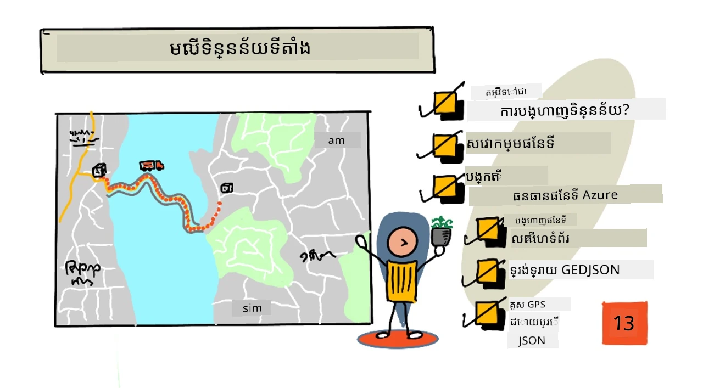
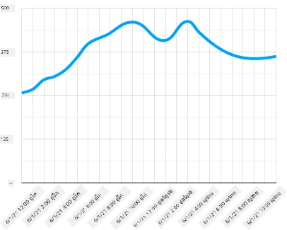
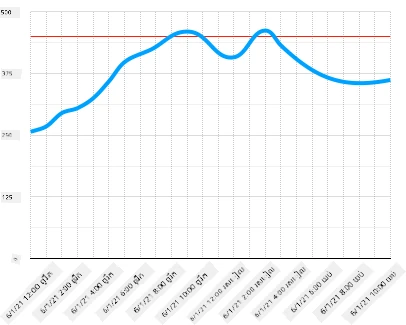
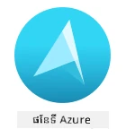
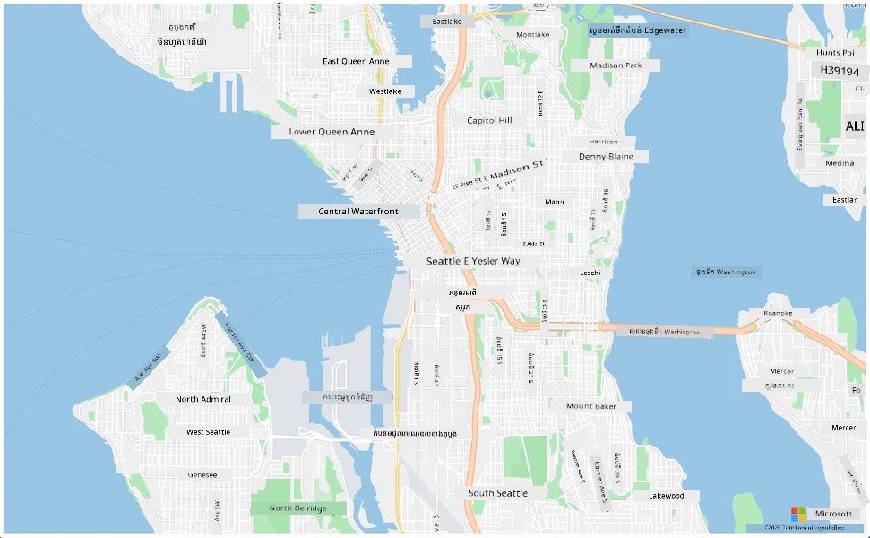
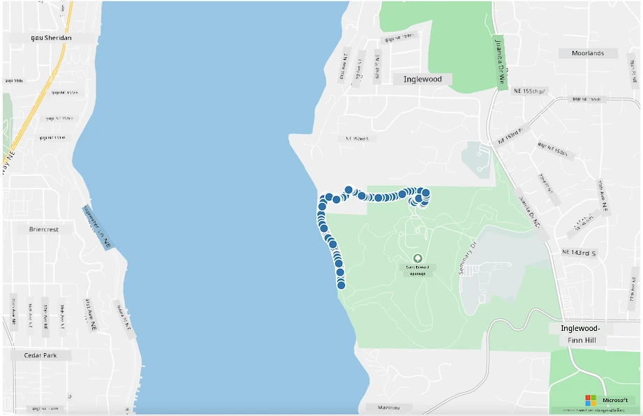

# Visualize location data



> Sketchnote by [Nitya Narasimhan](https://github.com/nitya). ចុចរូបភាពសម្រាប់ជាបច្ចុប្បន្នភាពធំជាងនេះ។

វីដេអូនេះផ្តល់សង្ខេបអំពី Azure Maps ជាមួយ IoT ដែលជាសេវាកម្មដែលនឹងត្រូវគ្របដណ្ដប់នៅក្នុងមេរៀននេះ។

[](https://www.youtube.com/watch?v=P5i2GFTtb2s)

> 🎥 ចុចរូបភាពខាងលើដើម្បីមើលវីដេអូ

## Pre-lecture quiz

[Pre-lecture quiz](https://black-meadow-040d15503.1.azurestaticapps.net/quiz/25)

## ការណែនាំ

នៅក្នុងមេរៀនចុងក្រោយ អ្នកបានស្វែងយល់ពីរបៀបទទួលបានទិន្នន័យ GPS ពីចំណុចសំរាប់សម្ភារៈរបស់អ្នក ដើម្បីរក្សាទុកនៅលើពពកក្នុងធុងស្ដុកដោយប្រើកូដមិនមានម៉ាស៊ីនបម្រើ។ ឥឡូវនេះ អ្នកនឹងស្វែងរករបៀបបង្ហាញចំណុចទាំងនោះលើផែនទី Azure។ អ្នកនឹងរៀនពីរបៀបបង្កើតផែនទីលើគេមេប្លុក ស្វែងយល់អំពីទ្រង់ទ្រាយទិន្នន័យ GeoJSON ហើយរបៀបប្រើវាដើម្បីបង្ហាញចំណុច GPS ទាំងអស់ដែលបានកត់ត្រា។

នៅក្នុងមេរៀននេះ យើងនឹងគ្របដណ្ដប់៖

* [តើការបង្ហាញទិន្នន័យជារូបភាពគឺជាអ្វី](#តើការបង្ហាញទិន្នន័យជារូបភាពគឺជាអ្វី)
* [សេវាកម្មផែនទី](#សេវាកម្មផែនទី)
* [បង្កើតធនធាន Azure Maps](#បង្កើតធនធាន-azure-maps)
* [បង្ហាញផែនទីលើគេមេប្លុក](#បង្ហាញផែនទីលើគេមេប្លុក)
* [ទ្រង់ទ្រាយ GeoJSON](#ទ្រង់ទ្រាយ-geojson)
* [បញ្ជូនទិន្នន័យ GPS នៅលើផែនទីដោយប្រើ GeoJSON](#គូសទិន្នន័យ-gps-លើផែនទីដោយប្រើ-geojson)

> 💁 មេរៀននេះ នឹងមាន HTML និង JavaScript ព្រំដែនតិចតួចប៉ុណ្ណោះ។ ប្រសិនបើអ្នកចង់ស្វែងយល់បន្ថែមអំពីការអភិវឌ្ឍវេបសាយដោយប្រើ HTML និង JavaScript សូមពិនិត្យមើល [ការអភិវឌ្ឍវេបសាយសម្រាប់អ្នកចាប់ផ្តើម](https://github.com/microsoft/Web-Dev-For-Beginners)។

## តើការបង្ហាញទិន្នន័យជារូបភាពគឺជាអ្វី

ការបង្ហាញទិន្នន័យជារូបភាព គឺដូចឈ្មោះវា បង្ហាញទិន្នន័យជារូបភាពនានាដើម្បីអោយមនុស្សងាយកប់ដឹង។ វាមានទំនាក់ទំនងជាមួយតារាង និងក្រាបជាទូទៅ ប៉ុន្តែវាគឺជារបៀបណាមួយក្នុងការបង្ហាញទិន្នន័យជារូបភាពដើម្បីជួយមនុស្សមិនត្រឹមតែនៅតែយល់ដឹងល្អនោះទេ ប៉ុន្តែជួយគេក្នុងការធ្វើការសម្រេចចិត្តផងដែរ។

យកឧទាហរណ៍សាមញ្ញមួយ - នៅក្នុងគម្រោងចម្ការ អ្នកបានកត់ត្រាការប្រើប្រាស់សំណើមដី។ តារាងសំណើមដីដែលបានកត់ត្រីអារតីម៉ោងសំរាប់ថ្ងៃទី ១ ខែមិថុនា ឆ្នាំ ២០២១ អាចមានរូបរាងដូចខាងក្រោម៖

|  ថ្ងៃទី            | ការអាន   |
| ---------------- | ------: |
| 01/06/2021 00:00 |     257 |
| 01/06/2021 01:00 |     268 |
| 01/06/2021 02:00 |     295 |
| 01/06/2021 03:00 |     305 |
| 01/06/2021 04:00 |     325 |
| 01/06/2021 05:00 |     359 |
| 01/06/2021 06:00 |     398 |
| 01/06/2021 07:00 |     410 |
| 01/06/2021 08:00 |     429 |
| 01/06/2021 09:00 |     451 |
| 01/06/2021 10:00 |     460 |
| 01/06/2021 11:00 |     452 |
| 01/06/2021 12:00 |     420 |
| 01/06/2021 13:00 |     408 |
| 01/06/2021 14:00 |     431 |
| 01/06/2021 15:00 |     462 |
| 01/06/2021 16:00 |     432 |
| 01/06/2021 17:00 |     402 |
| 01/06/2021 18:00 |     387 |
| 01/06/2021 19:00 |     360 |
| 01/06/2021 20:00 |     358 |
| 01/06/2021 21:00 |     354 |
| 01/06/2021 22:00 |     356 |
| 01/06/2021 23:00 |     362 |

ជាមនុស្សការយល់ដឹងពីទិន្នន័យនេះអាចពិបាក។ វាជាផ្ទាំងលេខមិនមានអរសន័យ។ ជាជំហានដំបូងនៃការបង្ហាញទិន្នន័យនេះ វាអាចត្រូវបានទាញយកលើតារាងបន្ទាត់៖



វា​អាចត្រូវ​បានលើកកម្ពស់បន្ថែមទៀតដោយបន្ថែមបន្ទាត់បង្ហាញពេលដែលប្រព័ន្ធប្រើប្រាស់ទឹកស្វ័យប្រវត្តិបានបើកនៅពេលសំណើមដីពេលការអានបញ្ចូល ៤៥០៖



តារាងនេះបង្ហាញយ៉ាងលឿនមិនត្រឹមតែកម្រិតសំណើមដីទេ ប៉ុន្តែចំណុចដែលប្រព័ន្ធប្រើប្រាស់ទឹកបានបើក។

តារាងមិនមែនជារៀងមួយឧបករណ៍បង្ហាញទេ។ ឧបករណ៍ IoT ដែលតាមដានអាកាសធាតុអាចមានកម្មវិធីវេបឬកម្មវិធីចល័តដែលបង្ហាញលក្ខខណ្ឌអាកាសធាតុដោយប្រើរូបសញ្ញាៗ ដូចជា រូបមេឃសម្រាប់ថ្ងៃមានពពក ទឹកភ្លៀងសម្រាប់ថ្ងៃភ្លៀង និងផ្សេងៗទៀត។ មានរបៀបជាច្រើនក្នុងការបង្ហាញទិន្នន័យ ជាច្រើនយ៉ាងចំរូង ច្រើនស្លូតបូត និងមួយចំនួនគួរឱ្យសើច។

✅ គិតពីរបៀបដែលអ្នកបានឃើញការបង្ហាញទិន្នន័យជារូបភាព។ តើរបៀបណាដែលច្បាស់លាស់បំផុត និងបានអាចឱ្យអ្នកធ្វើការសម្រេចចិត្តយ៉ាងរហ័ស?

ការបង្ហាញល្អបំផុតអាចឱ្យមនុស្សធ្វើការសម្រេចចិត្តបានយ៉ាងរហ័ស។ ឧទាហរណ៍ ការមានបន្ទាត់វាស់មួយជាច្រើនបង្ហាញចំលងទាំងអស់ពីឧបករណ៍ឧស្សាហកម្មគឺពិបាកក្នុងការបញ្ចេញខណៈពេលពន្លឺក្រហមភ្លឺរះនៅពេលមានបញ្ហាអាចធ្វើឱ្យមនុស្សធ្វើការសម្រេចចិត្តបាន។ នៅពេលខ្លះការបង្ហាញល្អបំផុតគឺជាភ្លើងរះភ្លឺ!

នៅពេលធ្វើការជាមួយទិន្នន័យ GPS ការបង្ហាញច្បាស់លាស់បំផុតអាចជាការទាញយកទិន្នន័យទៅលើផែនទី។ ផែនទីបង្ហាញរថយន្តដឹកឧទាហរណ៍ អាចជួយកម្មករនៅផ្ទះរោងចក្រ ដើម្បីឃើញពេលរថយន្តនឹងមកដល់។ ប្រសិនបើផែនទីនេះបង្ហាញមិនត្រឹមតែរូបភាពរថយន្តនៅទីតាំងបច្ចុប្បន្នទេ ប៉ុន្តែផ្តល់អត្ថន័យអំពីមាតិកាក្នុងរថយន្ត នោះអ្នកធ្វើការនៅរោងចក្រ អាចរៀបចំការតាមផែនការ - ប្រសិនបើឃើញរថយន្តទឹកកកនៅជិតខាង គេដឹងថាត្រូវតែងតាំងកន្លែងក្នុងទូរទឹកកក។

## សេវាកម្មផែនទី

ការប្រឹក្សាត្រូវបានជាមួយផែនទី គឺជាការប្រកួតប្រជែងគួរឱ្យចាប់អារម្មណ៍ ហើយមានជាច្រើនដែលអាចជ្រើសរើស ដូចជា Bing Maps, Leaflet, Open Street Maps, និង Google Maps។ នៅក្នុងមេរៀននេះ អ្នកនឹងស្វែងយល់អំពី [Azure Maps](https://azure.microsoft.com/services/azure-maps/?WT.mc_id=academic-17441-jabenn) និងរបៀបដែលពួកវាអាចបង្ហាញទិន្នន័យ GPS របស់អ្នក។



Azure Maps គឺជា "ប្រមូលផ្ដុំសេវាកម្មភូមិសាស្ត្រ និង SDK ដែលប្រើទិន្នន័យផែនទីថ្មីៗ ដើម្បីផ្តល់បរិបទភូមិសាស្ត្រដល់កម្មវិធីវេប និងចល័ត"។ អ្នកអភិវឌ្ឍន៍ត្រូវបានផ្តល់ឯកសារឧបករណ៍ដើម្បីបង្កើតផែនទីស្រស់ស្អាត និងអន្តរកម្ម ដែលអាចធ្វើអ្វីៗដូចជាផ្តល់ផ្លូវចរាចរណ៍ណែនាំ ជូនព័ត៌មានអំពីហេតុការណ៍ចរាចរណ៍, នាវាព្រិលក្នុង, សមត្ថភាពស្វែងរក, ព័ត៌មានកម្ពស់, សេវាកម្មអាកាសធាតុ និងផ្សេងៗទៀត។

✅ សាកល្បងជាមួយកូដខ្លឹមសារផែនទីខ្លះៗ [mapping code samples](https://docs.microsoft.com/samples/browse?WT.mc_id=academic-17441-jabenn&products=azure-maps)

អ្នកអាចបង្ហាញផែនទីជាគ្រឿងចម្លងស្ងួត ស្លាក, រូបភាពផែនដី, រូបភាពកាំរស្មីផែនដីដែលផ្សំលើផ្លូវ, ប្រភេទផែនទីសំណល់ជាច្រើន, ផែនទីមានស្រទាប់លាបរលោងដើម្បីបង្ហាញកម្ពស់, ផែនទីមើលយប់ និងផែនទីមានភាពខុសប្លែកខ្ពស់។ អ្នកអាចទទួលបានបច្ចុប្បន្នភាពពេលនេះលើផែនទីរបស់អ្នកដោយបញ្ចូលវាជាមួយ [Azure Event Grid](https://azure.microsoft.com/services/event-grid/?WT.mc_id=academic-17441-jabenn)។ អ្នកអាចគ្រប់គ្រងសម្រួល និងរូបរាងផែនទីរបស់អ្នក ដោយបើកបង្ហាញកុងត្រូលផែនទីណាមួយដូចជាការចុច បញ្ចេញក្បាល និងទាញ។ ដើម្បីគ្រប់គ្រងរូបរាងផែនទី អ្នកអាចបន្ថែមស្រទាប់បណ្ដោយដែលមានដូចជា ប៊ូបូល ខ្សែ បរិវេណ ផែនទីកំដៅ និងផ្សេងទៀត។ រចនាប័ទ្មផែនទីដែលអ្នកអនុវត្ត អាស្រ័យលើការជ្រើសរើស SDK របស់អ្នក។

អ្នកអាចចូលលើ API Azure Maps ដោយប្រើប្រាស់ [REST API](https://docs.microsoft.com/javascript/api/azure-maps-rest/?WT.mc_id=academic-17441-jabenn&view=azure-maps-typescript-latest), [Web SDK](https://docs.microsoft.com/azure/azure-maps/how-to-use-map-control?WT.mc_id=academic-17441-jabenn), ឬ ប្រសិនបើអ្នកកំពុងបង្កើតកម្មវិធីចល័ត អ្នកអាចប្រើ [Android SDK](https://docs.microsoft.com/azure/azure-maps/how-to-use-android-map-control-library?WT.mc_id=academic-17441-jabenn&pivots=programming-language-java-android)។

នៅក្នុងមេរៀននេះ អ្នកនឹងប្រើ web SDK ដើម្បីគូរផែនទី និងបង្ហាញផ្លូវទីតាំង GPS របស់សេនស័ររបស់អ្នក។

## បង្កើតធនធាន Azure Maps

ជំហានដំបូងរបស់អ្នកគឺបង្កើតគណនី Azure Maps។

### ការងារ - បង្កើតធនធាន Azure Maps

1. ប្រតិបត្តិការបញ្ជារខាងក្រោមពី Terminal ឬ Command Prompt របស់អ្នក ដើម្បីបង្កើតធនធាន Azure Maps ក្នុងក្រុមធនធាន `gps-sensor` របស់អ្នក៖

    ```sh
    az maps account create --name gps-sensor \
                           --resource-group gps-sensor \
                           --accept-tos \
                           --sku S1
    ```

    វានឹងបង្កើតធនធាន Azure Maps ឈ្មោះ `gps-sensor`។ កម្រិតដែលត្រូវបានប្រើជាកម្រិត `S1` ដែលជាកម្រិតមានការទូទាត់ បូករួមមានមុខងារជាច្រើន ដោយមានការហៅជាសេវា ឥតគិតថ្លៃមួយចំនួន។

    > 💁 ដើម្បីមើលថ្លៃឈ្នួលប្រើប្រាស់ Azure Maps សូមពិនិត្យនៅ [ទំព័រតម្លៃ Azure Maps](https://azure.microsoft.com/pricing/details/azure-maps/?WT.mc_id=academic-17441-jabenn)។

1. អ្នកត្រូវការលេខកូដ API សម្រាប់ធនធានផែនទីនេះ។ ប្រើបញ្ជាខាងក្រោម ដើម្បីទទួលបានកូដនេះ៖

    ```sh
    az maps account keys list --name gps-sensor \
                              --resource-group gps-sensor \
                              --output table
    ```

    ចំលងតម្លៃ `PrimaryKey` ។

## បង្ហាញផែនទីលើគេមេប្លុក

ឥឡូវនេះ អ្នកអាចបន្តជំហានបន្ទាប់គឺបង្ហាញផែនទីរបស់អ្នកលើគេមេប្លុក។ យើងនឹងប្រើឯកសារ `html` មួយសម្រាប់កម្មវិធីវេបតូច​​របស់អ្នក ជាប់ចិត្តថា ក្នុងបរិបទផលិតកម្ម ឬក្រុមការងារ កម្មវិធីវេបរបស់អ្នកប្រាកដជាមានផ្នែកចល័តច្រើនជាងនេះ!

### ការងារ - បង្ហាញផែនទីលើគេមេប្លុក

1. បង្កើតឯកសារឈ្មោះ index.html នៅក្នុងថតណាមួយលើកុំព្យូទ័រផ្ទាល់ខ្លួនរបស់អ្នក។ បន្ថែម HTML markup ដើម្បីថែទាំផែនទី៖

    ```html
    <html>
    <head>
        <style>
            #myMap {
                width:100%;
                height:100%;
            }
        </style>
    </head>
    
    <body onload="init()">
        <div id="myMap"></div>
    </body>
    </html>
    ```

    ផែនទីនឹងផ្ទុកនៅក្នុង `div` `myMap`។ រចនាប័ទ្មថ្មីមួយចំនួនអនុញ្ញាតឱ្យវាឯកទេសការពារព្រលែងទទឹងនិងកម្ពស់គេមេប្លុក។

    > 🎓 `div` គឺជាផ្នែកមួយនៃគេមេប្លុកដែលអាចមានឈ្មោះ និងរចនាប័ទ្មបាន។

1. ក្រោមស្លាកបើក `<head>`, បន្ថែមស្លាបស្ទៃរចនាប័ទ្មខាងក្រៅដើម្បីគ្រប់គ្រងការបង្ហាញផែនទី និងស្ក្រីបខាងក្រៅពី Web SDK ដើម្បីគ្រប់គ្រងអាកប្បកិរិយារបស់វា៖

    ```html
    <link rel="stylesheet" href="https://atlas.microsoft.com/sdk/javascript/mapcontrol/2/atlas.min.css" type="text/css" />
    <script src="https://atlas.microsoft.com/sdk/javascript/mapcontrol/2/atlas.min.js"></script>
    ```

    ស្លាបស្ទៃរចនាប័ទ្មនេះមានការកំណត់របៀបដែលផែនទីមើលទៅ ហើយឯកសារស្ក្រីបនេះមានកូដសម្រាប់ផ្ទុកផែនទី។ ការបន្ថែមកូដនេះដូចជាការរាប់បញ្ចូល header files ជាC++ ឬនាំចូលម៉ូឌុល Python ។

1. ក្រោមស្ក្រីបនោះ បន្ថែមប្លុកស្ក្រីបដើម្បីចាប់ផ្តើមផែនទី។

    ```javascript
    <script type='text/javascript'>
        function init() {
            var map = new atlas.Map('myMap', {
                center: [-122.26473, 47.73444],
                zoom: 12,
                authOptions: {
                    authType: "subscriptionKey",
                    subscriptionKey: "<subscription_key>",

                }
            });
        }
    </script>
    ```

    ជំនួស `<subscription_key>` ជាមួយលេខ API សម្រាប់គណនី Azure Maps របស់អ្នក។

    បើអ្នកបើកគេមេប្លុក `index.html` នៅក្នុងកម្មវិធីរុករក វានឹងបង្ហាញផែនទីហើយផ្តោតនៅតំបន់ Seattle។

    

    ✅ សាកល្បងជាមួយប៉ារ៉ាម៉ែត្រ zoom និង center ដើម្បីផ្លាស់ប្តូររូបភាពផែនទីរបស់អ្នក។ អ្នកអាចបន្ថែមចំណុចដែនទ្វារដែលផ្ទៀងផ្ទាត់នឹងទិន្នន័យ latitude និង longitude របស់អ្នក ដើម្បីកំណត់ចំណុចមធ្យម ផែនទីឡើងវិញ។

> 💁 វិធីល្អជាងមួយសម្រាប់ធ្វើការជាមួយកម្មវិធីវេបនៅក្នុងកុំព្យូទ័រផ្ទាល់ខ្លួនគឺដំឡើង [http-server](https://www.npmjs.com/package/http-server)។ អ្នកត្រូវតែដំឡើង [node.js](https://nodejs.org/) និង [npm](https://www.npmjs.com/) មុនប្រើឧបករណ៍នេះ។ បន្ទាប់ពីដំឡើងឧបករណ៍ទាំងនោះ អ្នកអាចទៅកាន់ទីតាំងណែនាំឯកសារ `index.html` ហើយវាយ `http-server`។ កម្មវិធីវេបនឹងបើកនៅលើម៉ាស៊ីនមេប្លុកផ្ទាល់ខ្លួន [http://127.0.0.1:8080/](http://127.0.0.1:8080/)។

## ទ្រង់ទ្រាយ GeoJSON

ឥឡូវនេះ បន្ទាប់ពីអ្នកមានកម្មវិធីវេប ដែលបង្ហាញផែនទី អ្នកត្រូវដកគ្រាប់ GPS ពីគណនីស្ដុករបស់អ្នក ហើយបង្ហាញវានៅលើស្រទាប់មួយនៃសញ្ញាឃ្លាំងនៅលើផែនទីមួយ។ មុនពេលធ្វើបែបនេះ យើងមកមើលទ្រង់ទ្រាយ [GeoJSON](https://wikipedia.org/wiki/GeoJSON) ដែលត្រូវបានទាមទារដោយ Azure Maps មុន។

[GeoJSON](https://geojson.org/) គឺជាតម្រូវការ JSON បើកចំហ មានទ្រង់ទ្រាយពិសេសសម្រាប់ដោះស្រាយទិន្នន័យជាក់លាក់ភូមិសាស្ត្រ។ អ្នកអាចស្វែងយល់អំពីវាដោយសាកល្បងទិន្នន័យគំរូប្រើ [geojson.io](https://geojson.io) ដែលមិនត្រឹមតែជាឧបករណ៍វាយតម្លៃកំហុសក្នុងឯកសារ GeoJSON តែមួយ។

ទិន្នន័យ GeoJSON គំរូមើលទៅដូចនេះ៖

```json
{
  "type": "FeatureCollection",
  "features": [
    {
      "type": "Feature",
      "geometry": {
        "type": "Point",
        "coordinates": [
          -2.10237979888916,
          57.164918677004714
        ]
      }
    }
  ]
}
```

អ្វីដែលគួរឲ្យចាប់អារម្មណ៍ជាពិសេស គឺរបៀបដែលទិន្នន័យនៅក្នុង `Feature` ក្នុង `FeatureCollection`។ នៅក្នុងវត្ថុនេះ អាចរកឃើញ `geometry` ដែលមាន `coordinates` សំដៅលើទទឹង និងរយៈបណ្តោយ។

✅ ពេលបង្កើត geoJSON របស់អ្នក សូមយកចិត្តទុកដាក់លំដាប់របស់ `latitude` និង `longitude` នៅក្នុងវត្ថុ បើការជ្រើសរើសមិនត្រឹមត្រូវ ចំណុចរបស់អ្នក​នឹងមិនបង្ហាញនៅកន្លែងដែលគួរបង្ហាញទេ! GeoJSON សង្ឃឹមទិន្នន័យក្នុងលំដាប់ `lon,lat` សម្រាប់ចំណុចមួយៗ មិនមែន `lat,lon`។
`Geometry` អាចមានប្រភេទផ្សេងៗគ្នា ដូចជាថង់តែមួយ ឬប៉ូលីហ្គុន។ ក្នុងឧទាហរណ៍នេះ វាជាចំណុចមួយដែលមានសមីការ​ស្រុកពីរត្រូវបានកំណត់ គឺលីងហ្គីទុដ និងលាតីទុដ។

✅ Azure Maps គាំទ្ររៀបចំ GeoJSON លំដាប់ស្តង់ដារជាមួយនឹងមុខងារ [បន្ថែម](https://docs.microsoft.com/azure/azure-maps/extend-geojson?WT.mc_id=academic-17441-jabenn) រួមមានសមត្ថភាពគូសឈុត និងភាពយន្តជាភាគីផ្សេងទៀត។

## គូសទិន្នន័យ GPS លើផែនទីដោយប្រើ GeoJSON

ឥឡូវនេះ អ្នកបានត្រៀមខ្លួនរួចរាល់ក្នុងការប្រើទិន្នន័យពីកំណត់ហ៊ុនដែលអ្នកបានបង្កើតនៅមេរៀនមុន។ ដើម្បីរំលឹក វាត្រូវបានរក្សាទុកជាកំណត់ហ៊ុនជាច្រើននៅក្នុងកន្លែងផ្ទុក blob ដូច្នេះអ្នកត្រូវទាញយកឯកសារនិងបំបែកវាដើម្បីឲ្យ Azure Maps អាចប្រើទិន្នន័យបាន។

### ភារកិច្ច - កំណត់ការចូលប្រើប្រាស់ផ្ទុកពីគេហទំព័រ

បើអ្នកហៅទៅកាន់របស់ផ្ទុកនេះដើម្បីទាញយកទិន្នន័យ អ្នកអាចភ្ញាក់ផ្អើលឃើញកំហុសបង្ហាញនៅក្នុងកុងសូលរបស់កម្មវិធីរុករក។ ព្រោះអ្នកត្រូវតែដាក់សិទ្ធិ [CORS](https://developer.mozilla.org/docs/Web/HTTP/CORS) លើផ្ទុកនេះ ​ដើម្បីអនុញ្ញាតឲ្យកម្មវិធីបណ្ដាញខាងក្រៅអានទិន្នន័យរបស់វាបាន។

> 🎓 CORS មានន័យថា "ការចែករំលែកប្រភពឆ្លង" ហើយធម្មតាត្រូវបានកំណត់យ៉ាងច្បាស់នៅក្នុង Azure ដើម្បីសុវត្ថិភាព។ វាបញ្ឈប់មុខខ្សែដែលអ្នកមិនរំពឹងទុកមករាយការណ៍ទិន្នន័យរបស់អ្នក។

1. បើកបញ្ជាខាងក្រោម ដើម្បីបើក CORS៖

    ```sh
    az storage cors add --methods GET \
                        --origins "*" \
                        --services b \
                        --account-name <storage_name> \
                        --account-key <key1>
    ```

    ផ្លាស់ប្តូរ `<storage_name>` ជាមួយឈ្មោះគណនីផ្ទុករបស់អ្នក។ ផ្លាស់ប្តូរ `<key1>` ជាមួយកូនសោគណនីសម្រាប់គណនីផ្ទុករបស់អ្នក។

    បញ្ជានេះអនុញ្ញាតឲ្យគេហទំព័រណាមួយ (បង្ហាញដោយ `*` មានន័យថាចម្រង់ទាំងមូល) អាចដាក់សំណើ *GET* គឺទាញយកទិន្នន័យពីគណនីផ្ទុករបស់អ្នក។ ការកំណត់ `--services b` មានន័យថាកំណត់នេះប្រើសម្រាប់ blobs តែប៉ុណ្ណោះ។

### ភារកិច្ច - ផ្ទុកទិន្នន័យ GPS ពីផ្ទុក

1. ផ្លាស់ប្តូរព័ត៌មានទាំងមូលក្នុងមុខងារ `init` ជាមួយកូដខាងក្រោម៖

    ```javascript
    fetch("https://<storage_name>.blob.core.windows.net/gps-data/?restype=container&comp=list")
        .then(response => response.text())
        .then(str => new window.DOMParser().parseFromString(str, "text/xml"))
        .then(xml => {
            let blobList = Array.from(xml.querySelectorAll("Url"));
                blobList.forEach(async blobUrl => {
                    loadJSON(blobUrl.innerHTML)                
        });
    })
    .then( response => {
        map = new atlas.Map('myMap', {
            center: [-122.26473, 47.73444],
            zoom: 14,
            authOptions: {
                authType: "subscriptionKey",
                subscriptionKey: "<subscription_key>",
    
            }
        });
        map.events.add('ready', function () {
            var source = new atlas.source.DataSource();
            map.sources.add(source);
            map.layers.add(new atlas.layer.BubbleLayer(source));
            source.add(features);
        })
    })
    ```

    ផ្លាស់ប្តូរ `<storage_name>` ជាមួយឈ្មោះគណនីផ្ទុករបស់អ្នក។ ផ្លាស់ប្តូរ `<subscription_key>` ជាមួយកូនសោ API សម្រាប់គណនី Azure Maps របស់អ្នក។

    មានការធ្វើការមួយចំនួននៅទីនេះ។ ជាដំបូង កូដទាញយកទិន្នន័យ GPS របស់អ្នកពីកញ្ចប់ blob ដោយប្រើ URL endpoint ដែលបង្កើតដោយឈ្មោះគណនីផ្ទុករបស់អ្នក។ URL នេះទាញយកពី `gps-data` ដែលមានន័យថាប្រភេទធនធានគឺកញ្ចប់ (`restype=container`) ហើយបញ្ជីព័ត៌មានទាំងអស់អំពី blobs ត្រូវបានបង្ហាញ។ បញ្ជីនេះមិនត្រលប់ទិន្នន័យ blob ផ្ទាល់នោះទេ ប៉ុន្តែត្រលប់ URL សម្រាប់ blob នីមួយៗដែលអាចប្រើបានសម្រាប់ផ្ទុកទិន្នន័យ blob ។

    > 💁 អ្នកអាចដាក់ URL នេះទៅក្នុងកម្មវិធីរុករករបស់អ្នក ដើម្បីមើលលម្អិតអំពី blobs ទាំងអស់ក្នុងកញ្ចប់របស់អ្នក។ ធាតុមួយៗមានគុណលក្ខណៈ `Url` ដែលអ្នកអាចផ្ទុកនៅក្នុងកម្មវិធីរុករករបស់អ្នកដើម្បីមើលមាតិកាដែលមានក្នុង blob ។

    កូដនេះផ្ទុកក្បាល blob រាល់ខ្ទង់ដោយហៅមុខងារ `loadJSON` ដែលនឹងបង្កើតបន្ទាប់ពីនេះ។ បន្ទាប់មកបង្កើតត្រួតពិនិត្យផែនទី ហើយបន្ថែមកូដទៅព្រឹត្តិការណ៍ `ready`។ ព្រឹត្តិការណ៍នេះត្រូវបានហៅពេលផែនទីបង្ហាញនៅលើគេហទំព័រ។

    ព្រឹត្តិការណ៍ ready បង្កើតប្រភពទិន្នន័យ Azure Maps - គឺជាកញ្ចប់មួយដែលមានទិន្នន័យ GeoJSON ដែលត្រូវបានបញ្ចូលនៅពេលក្រោយ។ ប្រភពទិន្នន័យនេះត្រូវបានប្រើសម្រាប់បង្កើតស្រទាប់ប៊ូប៊ែល - កំណត់ក្រុមរង្វង់លើផែនទីប្រហែលមួយលើចំណុចក្នុង GeoJSON។

1. បន្ថែមមុខងារ `loadJSON` ទៅក្នុងប្លុកស្គ្រីបរបស់អ្នក ខាងក្រោមមុខងារ `init`៖

    ```javascript
    var map, features;

    function loadJSON(file) {
        var xhr = new XMLHttpRequest();
        features = [];
        xhr.onreadystatechange = function () {
            if (xhr.readyState === XMLHttpRequest.DONE) {
                if (xhr.status === 200) {
                    gps = JSON.parse(xhr.responseText)
                    features.push(
                        new atlas.data.Feature(new atlas.data.Point([parseFloat(gps.gps.lon), parseFloat(gps.gps.lat)]))
                    )
                }
            }
        };
        xhr.open("GET", file, true);
        xhr.send();
    }    
    ```

    មុខងារនេះត្រូវបានហៅដោយរបៀប fetch ដើម្បីបំលែងទិន្នន័យ JSON ហើយបម្លែងវាឲ្យអានជា ឡុងហ្គីទុដ និងលាតីទុដ ជាឧបករណ៍ geoJSON។
    បន្ទាប់ពីបំលែង ធាតុទិន្នន័យត្រូវបានកំណត់ជាផ្នែកមួយនៃ geoJSON `Feature` ។ ផែនទីនឹងត្រូវបានចាប់ផ្តើម ហើយប៊ូប៊ែលតូចៗ នឹងបង្ហាញជុំវិញផ្លូវដែលអ្នកកំពុងគូសទិន្នន័យ។

1. ផ្ទុកទំព័រ HTML នៅក្នុងកម្មវិធីរុករករបស់អ្នក។ វានឹងផ្ទុកផែនទី ហើយបន្ទាប់មកផ្ទុកទិន្នន័យ GPS ទាំងអស់ពីផ្ទុក ហើយគូសវាក្នុងផែនទី។

    

> 💁 អ្នកអាចស្វែងរកកូដនេះនៅក្នុងថត [code](../../../../../3-transport/lessons/3-visualize-location-data/code) ។

---

## 🚀 ប្រកួតប្រជែង

វាល្អក្នុងការបង្ហាញទិន្នន័យថេរលើផែនទីជាចំណុចសំគាល់។ តើយូរក​បានបង្កើនកម្មវិធី​បណ្ដាញ​នេះ​ដើម្បី​បន្ថែម​ភាពចលនា និងបង្ហាញផ្លូវនៃចំណុចសំគាល់ជាមួយម៉ោងប្រើឯកសារ json មានពេលវេលា? នេះគឺជា [គំរូខ្លះ](https://azuremapscodesamples.azurewebsites.net/) សម្រាប់ការប្រើភាពចលនាផែនទី។

## ការប្រលងក្រោយមេរៀន

[ការប្រលងក្រោយមេរៀន](https://black-meadow-040d15503.1.azurestaticapps.net/quiz/26)

## សេចក្តីសង្ខេប និងសិក្សាផ្ទាល់ខ្លួន

Azure Maps គឺមានប្រយោជន៍ជាច្រើនសម្រាប់ការប្រើប្រាស់ជាមួយឧបករណ៍ IoT។

* ស្រាវជ្រាវពីការប្រើប្រាស់នៅក្នុង [ឯកសារ Azure Maps នៅលើ Microsoft docs](https://docs.microsoft.com/azure/azure-maps/tutorial-iot-hub-maps?WT.mc_id=academic-17441-jabenn)។
* បង្រួមចំណេះដឹងរបស់អ្នកអំពីការបង្កើតផែនទី និងចំណុចផ្លូវជាមួយ [មេរៀនបង្កើតកម្មវិធីស្វែងរកផ្លូវ ដំបូងរបស់អ្នកជាមួយ Azure Maps នៅលើ Microsoft Learn](https://docs.microsoft.com/learn/modules/create-your-first-app-with-azure-maps/?WT.mc_id=academic-17441-jabenn)។

## ភារកិច្ច

[ដាក់ឲ្យដំណើរការ​កម្មវិធី​របស់​អ្នក](assignment.md)

---

<!-- CO-OP TRANSLATOR DISCLAIMER START -->
**ការសូមអធ្យាស្រ័យ**៖  
ឯកសារនេះត្រូវបានបកប្រែដោយប្រើសេវាកម្មបកប្រែ AI [Co-op Translator](https://github.com/Azure/co-op-translator)។ ក្នុងខណៈពេលដែលយើងខិតខំប្រឹងប្រែងសម្រាប់ភាពច្បាស់លាស់ សូមយល់ឲ្យដឹងថាការបកប្រែដោយស្វ័យប្រវត្តិអាចមានកំហុសឬភាពមិនត្រឹមត្រូវ។ ឯកសារដើមក្នុងភាសាទាំងមូលគួរត្រូវបានចាត់ទុកជាដំណើរការមូលដ្ឋានដែលមានសិទ្ធិលើអត្ថន័យ។ សម្រាប់ព័ត៌មានសំខាន់ៗ, ការបកប្រែដោយអ្នកជំនាញផ្ទាល់គឺត្រូវបានណែនាំ។ យើងមិនទទួលខុសត្រូវចំពោះការយល់ច្រឡំ ឬការបកប្រែខុសពីការប្រើប្រាស់ការបកប្រែនេះទេ។
<!-- CO-OP TRANSLATOR DISCLAIMER END -->