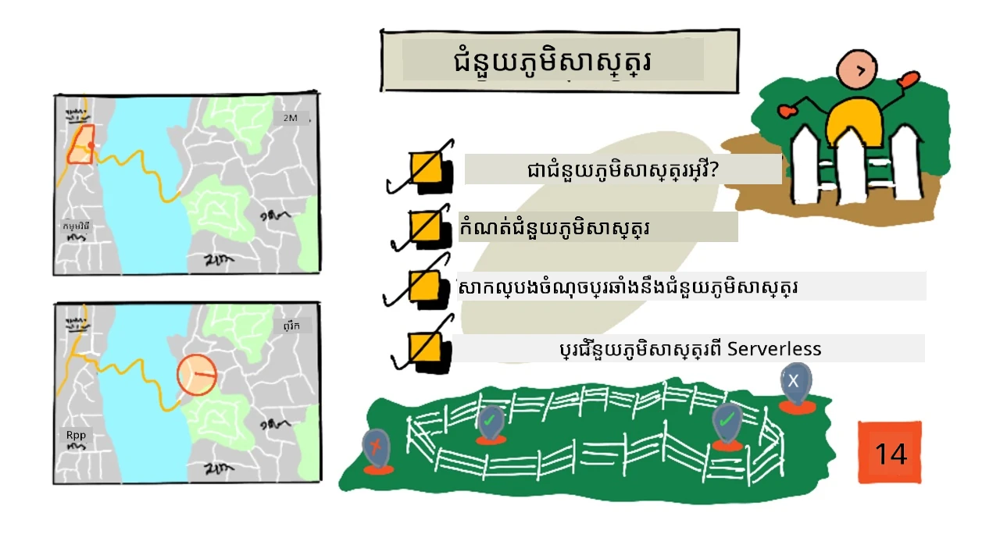
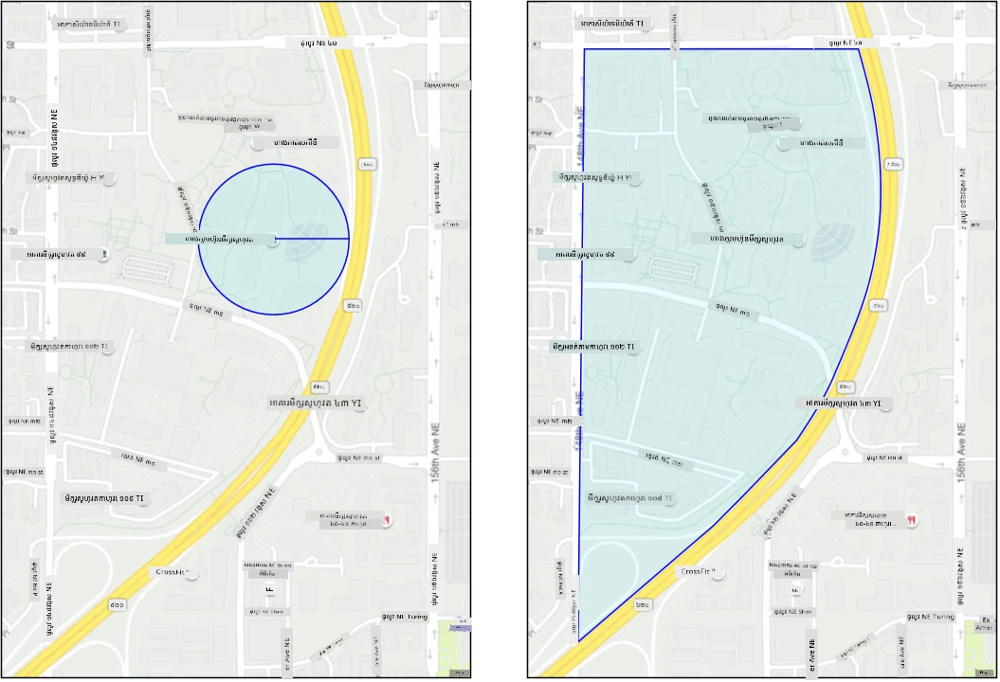
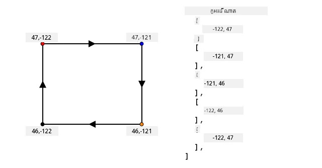
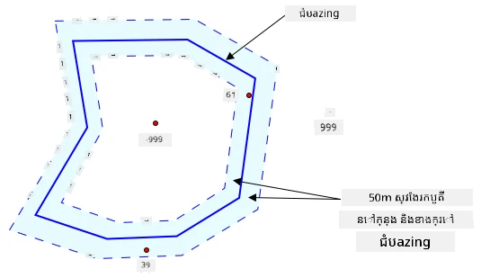
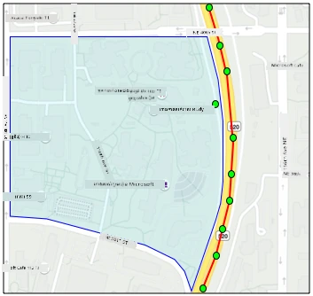
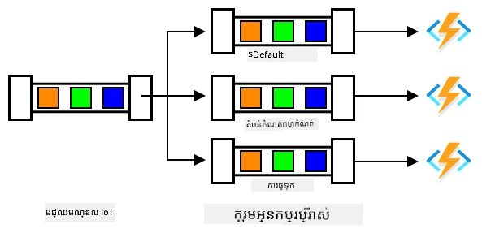

# បន្ទាត់ភូមិសាស្ត្រ



> សេចក្តីសង្ខេបដោយ [Nitya Narasimhan](https://github.com/nitya)។ ចុចលើរូបភាពសម្រាប់កំណែជាទំហំធំជាងនេះ។

វីដេអូនេះផ្តល់នូវការពិនិត្យទូទៅអំពីបន្ទាត់ភូមិសាស្ត្រ និងរបៀបប្រើប្រាស់កូដនៅក្នុង Azure Maps ដែលជាប្រធានបទដែលនឹងត្រូវបានគេសម្ដែងក្នុងមេរៀននេះ៖

[](https://www.youtube.com/watch?v=nsrgYhaYNVY)

> 🎥 ចុចលើរូបភាពខាងលើដើម្បីមើលវីដេអូ

## ការប្រលងមុនមេរៀន

[ការប្រលងមុនមេរៀន](https://black-meadow-040d15503.1.azurestaticapps.net/quiz/27)

## ការណែនាំ

នៅក្នុងមេរៀនចុងក្រោយចំនួន 3，你បានប្រើ IoT ដើម្បីស្វែងរករថយន្តបញ្ជូនផ្លែៗពីចម្ការរបស់អ្នក ទៅកាន់មណ្ឌលដំណើរការមួយ។ អ្នកបានចាប់យកទិន្នន័យ GPS, ផ្ញើវាទៅគន្លងពពកសម្រាប់រក្សាទុក ហើយបង្ហាញវាលើផែនទី។ ដំណាក់កាលបន្ទាប់ក្នុងការកើនឡើងប្រសិទ្ធភាពខ្សែបញ្ជូនគ្រឿងផ្សំរបស់អ្នក គឺទទួលបានការជូនដំណឹងពេលរថយន្តកំពុងតែលាចេញមកដល់មណ្ឌលដំណើរការ ដើម្បីឲ្យក្រុមការងារដែលតម្រូវឲ្យផ្ទុកចេញបានរៀបចំជាមួយរថយន្តបូកនិងឧបករណ៍ផ្សេងៗភ្លាមៗពេលរថយន្តមកដល់។ វាបញ្ចប់ការចំណាយពេលរង់ចាំរថយន្តនិងអ្នកបើកបរ។

ក្នុងមេរៀននេះ អ្នកនឹងរៀនអំពីបន្ទាត់ភូមិសាស្ត្រ ឬតំបន់ភូមិសាស្ត្រដែលបានកំណត់ជាក់លាក់ដូចជាតំបន់ដែលមានចម្ងាយ 2 គីឡូម៉ែត្រជិះឡានពីមណ្ឌលដំណើរការ និងរបៀបសាកល្បងថាតើកូឡុងរបស់ GPS នៅក្នុងឬក្រៅបន្ទាត់ភូមិសាស្ត្រ ដើម្បីអ្នកអាចឃើញថា អ្នកចាប់យក GPS បានមកដល់ ឬចាកចេញពីតំបន់។

ក្នុងមេរៀននេះយើងនឹងគ្របដណ្តប់៖

* [បន្ទាត់ភូមិសាស្ត្រជាអ្វី](#បន្ទាត់ភូមិសាស្ត្រជាអ្វី)
* [កំណត់បន្ទាត់ភូមិសាស្ត្រ](#defining-a-geofence)
* [សាកល្បងចំណុចប្រឆាំងនឹងបន្ទាត់ភូមិសាស្ត្រ](#testing-points-against-a-geofence)
* [ប្រើបន្ទាត់ភូមិសាស្ត្រពីកូដដែលគ្មានម៉ាស៊ីនមេ](#ប្រើអាំងគោពីកូដ-serverless)

> 🗑 នេះគឺជាមេរៀនចុងក្រោយនៅក្នុងគម្រោងនេះ ដូច្នេះបន្ទាប់ពីបញ្ចប់មេរៀននេះនិងភារកិច្ចសូមកុំភ្លេចបរិច្ឆេទសេវាកម្មពពករបស់អ្នក។ អ្នកត្រូវការសេវាកម្មដើម្បីបញ្ចប់ភារកិច្ច ដូច្នេះសូមពិនិត្យបញ្ចប់វាប្រសិនបើមិនទាន់បានធ្វើ។
>
> សូមយោងទៅកាន់ [មគ្គុទេសក៍បរិច្ឆេទគម្រោងរបស់អ្នក](../../../clean-up.md) ប្រសិនបើចាំបាច់សម្រាប់ការណែនាំពីរបៀបធ្វើ។

## បន្ទាត់ភូមិសាស្ត្រជាអ្វី

បន្ទាត់ភូមិសាស្ត្រជាគន្លងវីរុយសម្រាប់តំបន់ភូមិសាស្ត្រពិតប្រាកដ។ បន្ទាត់ភូមិសាស្ត្រអាចជារង្វង់ដែលកំណត់ជា ចំណុច និងកាំបិត (ឧទាហរណ៍ រង្វង់រង្វាយ 100 ម៉ែត្រ រួមជុំវិញអាគារ), ឬជាប៉ូលីហ្គោនដែលគ្របដណ្តប់តំបន់ដូចជា តំបន់សាលារៀន, ខណ្ឌទីក្រុង, ឬមន្ទីរពិសោធន៍ ឬផ្សារិយാല័យ។



> 💁 អ្នកប្រហែលជាបានប្រើបន្ទាត់ភូមិសាស្ត្រហើយដោយគ្មានការយល់ដឹង។ ប្រសិនបើអ្នកបានដាក់កំណត់ចំណាំដោយប្រើកម្មវិធី iOS Reminders ឬ Google Keep ពាក់ព័ន្ធនឹងទីតាំង អ្នកបានប្រើបន្ទាត់ភូមិសាស្ត្រហើយ។ កម្មវិធីទាំងនេះនឹងបង្កើតបន្ទាត់ភូមិសាស្ត្រដោយផ្អែកលើទីតាំងដែលបានផ្តល់ និងជូនដំណឹងពេលទូរស័ព្ទរបស់អ្នកចូលទៅក្នុងបន្ទាត់ភូមិសាស្ត្រ។

មានហេតុផលជាច្រើនដែលអ្នកចង់ដឹងថាតើរថយន្តមួយនៅក្នុង ឬក្រៅបន្ទាត់ភូមិសាស្ត្រ៖

* ការរៀបចំសម្រាប់ការផ្ទុកចេញ - ទទួលបានការជូនដំណឹងថារថយន្តមកដល់ទីតាំងអាចឲ្យក្រុមការងាររៀបចំប្រើបំពង់កញ្ចប់ ឬឧបករណ៍ផ្សេងៗ ដើម្បីកាត់បន្ថយការរង់ចាំ។ វាអាចអនុញ្ញាតឲ្យអ្នកបើកបរចេញបានច្រើនក្នុងមួយថ្ងៃដោយមានការរង់ចាំតិចជាងមុន។
* ធ្វើតាមច្បាប់ពន្ធអាករដែន - ប្រទេសជាច្រើន ដូចជា នូវែលសេឡង់ មានការទាមទារជាពន្ធចរាចរណ៍សម្រាប់រថយន្តឌីហ្សែលដោយផ្អែកលើទំងន់រថយន្តពេលបើកបរ លើផ្លូវសាធារណៈតែប៉ុណ្ណោះ។ ការប្រើបន្ទាត់ភូមិសាស្ត្រអនុញ្ញាតឲ្យអ្នកតាមដានចម្ងាយបើកបរ លើ​ផ្លូវ​សាធារណៈ បច្ចុប្បន្នភាពការបើកបរ លើផ្លូវឯកជនដូចជាចម្ការឬតំបន់កាត់កឋិន។
* តាមដានការលួច - ប្រសិនបើរថយន្តមួយគួរតែស្ថិតនៅតែតំបន់ឯណាមួយដូចជា នៅលើចម្ការ ហើយវាចាកចេញពីបន្ទាត់ភូមិសាស្ត្រ វាអាចត្រូវបានលួច។
* ធ្វើតាមទីតាំង - ផ្នែកខ្លះនៃទីតាំងធ្វើការ ចម្ការ ឬរោងចក្រ អាចហាមឃាត់រថយន្តមួយចំនួនដូចជាបញ្ចៀសរថយន្តដែលយកជាមួយសារធាតុធ្វើជាសារធាតុរាវ និងថ្នាំសត្វល្អិត មិនឱ្យបំផ្លាញវាលផលិតអង្ករ។ ប្រសិនបើបន្ទាត់ភូមិសាស្ត្រត្រូវបានចូល ប្រហែលថារថយន្តមួយនៅក្រៅការធ្វើតាមតំបន់នឹងមានការជូនដំណឹងអ្នកបើកបរ។

✅ តើអ្នកអាចគិតអំពីការប្រើប្រាស់បន្ទាត់ភូមិសាស្ត្រផ្សេងទៀតទេ?

Azure Maps ដែលជាសេវាកម្មដែលអ្នកបានប្រើនៅមេរៀនចុងក្រោយ សម្រាប់បង្ហាញទិន្នន័យ GPS អនុញ្ញាតឲ្យអ្នកកំណត់បន្ទាត់ភូមិសាស្ត្រ ហើយបន្ទាប់មកសាកល្បងឃើញថាតើចំណុចមួយនៅក្នុងឬក្រៅបន្ទាត់ភូមិសាស្ត្រដែរឬទេ។

## កំណត់បន្ទាត់ភូមិសាស្ត្រ

បន្ទាត់ភូមិសាស្ត្រត្រូវបានកំណត់ដោយប្រើ GeoJSON ដូចជាចំណុចដែលបានបន្ថែមទៅផែនទីនៅមេរៀនមុន។ ក្នុងករណីនេះ មិនមែនជា `FeatureCollection` នៃតម្លៃ `Point` ទេ តែនៅជាចំណុច `FeatureCollection` ដែលមាន `Polygon`។

```json
{
   "type": "FeatureCollection",
   "features": [
     {
       "type": "Feature",
       "geometry": {
         "type": "Polygon",
         "coordinates": [
           [
             [
               -122.13393688201903,
               47.63829579223815
             ],
             [
               -122.13389128446579,
               47.63782047131512
             ],
             [
               -122.13240802288054,
               47.63783312249837
             ],
             [
               -122.13238388299942,
               47.63829037035086
             ],
             [
               -122.13393688201903,
               47.63829579223815
             ]
           ]
         ]
       },
       "properties": {
         "geometryId": "1"
       }
     }
   ]
}
```
  
ចំណុចនីមួយៗលើប៉ូលីហ្គោនត្រូវបានកំណត់ជា ជូងប្រវែងអក្សរសាស្ត្រ និងរយៈពេលនៅក្នុងអារេមួយ ហើយចំណុចទាំងនេះនៅក្នុងអារេមួយដែលត្រូវបានកំណត់ជារាង `coordinates`។ ក្នុង `Point` នៅមេរៀនមុន `coordinates` គឺជាអារេមួយដែលមានតម្លៃ 2 គឺ រយៈពេលនិងប្រវែងអក្សរសាស្ត្រ សម្រាប់ `Polygon` វាជាអារេមួយនៃអារេដែលមានតម្លៃ 2 គឺ ប្រវែងអក្សរសាស្ត្រ និងរយៈពេល។

> 💁 ចងចាំថា GeoJSON ប្រើប្រាស់ `longitude, latitude` សម្រាប់ចំណុច មិនមែន `latitude, longitude`

អារេខាងក្នុងប៉ូលីហ្គោនតែងតែមានចំណុចច្រើនជាងចំនួនចំណុចលើប៉ូលីហ្គោនមួយចំនួនមួយ ចំណុចចុងក្រោយគឺដូចគ្នានឹងចំណុចដំបូង បិទប៉ូលីហ្គោន។ ឧទាហរណ៍ សម្រាប់ប្រអប់នឹងមានចំនុច 5 ។



នៅក្នុងរូបភាពខាងលើ មានប្រអប់មួយ។ ចំណុច coordinate ប៉ូលីហ្គោនចាប់ផ្តើមនៅខាងឆ្វេងលើ 47,-122 បន្ទាប់មកទៅមុខម៉ាត់ទៅ 47,-121 បន្ទាប់មកចុះក្រោមទៅ 46,-121 បន្ទាប់មកទៅមុខម៉ាត់ទៅ 46,-122 បន្ទាប់មកឡើងវិញទៅចំណុចចាប់ផ្តើម 47,-122។ នេះផ្តល់ចំនុចប៉ូលីហ្គោន 5 ចំណុច៖ ខាងឆ្វេងលើ, ខាងស្ដាំលើ, ខាងស្ដាំក្រោម, ខាងឆ្វេងក្រោម និងខាងឆ្វេងលើ ដើម្បីបិទវា។

✅ សាកល្បងបង្កើតប៉ូលីហ្គោន GeoJSON ជុំវិញផ្ទះ ឬសាលារៀនរបស់អ្នក។ ប្រើឧបករណ៍ដូចជា [GeoJSON.io](https://geojson.io/)។

### ភារកិច្ច - កំណត់បន្ទាត់ភូមិសាស្ត្រ

ដើម្បីប្រើបន្ទាត់ភូមិសាស្ត្រនៅក្នុង Azure Maps ទិញវាអាចត្រូវបានផ្ទុកឡើងទៅគណនី Azure Maps របស់អ្នកជាមុន។ បន្ទាប់ពីផ្ទុកឡើង អ្នកនឹងទទួលបានអត្តសញ្ញាណពិសេស ដែលអ្នកអាចប្រើក្នុងការសាកល្បងចំណុចទៅប្រឆាំងនឹងបន្ទាត់ភូមិសាស្ត្រ។ ដើម្បីផ្ទុកបន្ទាត់ភូមិសាស្ត្រទៅ Azure Maps អ្នកត្រូវប្រើ API គេហទំព័ររបស់ផែនទី។ អ្នកអាចហៅ Azure Maps web API ដោយប្រើឧបករណ៍មួយហៅថា [curl](https://curl.se)។

> 🎓 Curl គឺជាឧបករណ៍បញ្ជាការសម្រាប់ធ្វើសំណើទៅទៅកាន់កំណាត់ផ្លូវវេប។

1. ប្រសិនបើអ្នកប្រើលីនុច, macOS ឬ Windows 10 ថ្មីៗ អ្នកប្រហែលបើកជាស្រេច curl។ ប្រតិបត្តិការលើកឡើងដូចខាងក្រោមពី termial ឬ command line ដើម្បីពិនិត្យ៖

    ```sh
    curl --version
    ```
  
    ប្រសិនបើមិនឃើញព័ត៌មានជំនាន់នៅសម្រាប់ curl អ្នកត្រូវតំឡើងវាពី [curl downloads page](https://curl.se/download.html)។

    > 💁 ប្រសិនបើអ្នកមានបទពិសោធន៍ជាមួយ Postman អ្នកអាចប្រើវាទំនងដោយបំផុត។

1. បង្កើតឯកសារ GeoJSON រួមមានប៉ូលីហ្គោនមួយ។ អ្នកនឹងសាកល្បងវាជាមួយឧបករណ៍ចាប់យក GPS របស់អ្នក ដូច្នេះបង្កើតប៉ូលីហ្គោនជុំវិញទីតាំងបច្ចុប្បន្នរបស់អ្នក។ អ្នកអាចបង្កើតដោយដោយដៃ បានដោយកែសម្រួលគំរូ GeoJSON ខាងលើ ឬប្រើឧបករណ៍ដូចជា [GeoJSON.io](https://geojson.io/)។

    GeoJSON នឹងត្រូវមាន `FeatureCollection` មួយ ដែលមាន `Feature` មួយ ដែលមាន `geometry` ប្រភេទ `Polygon`។

    អ្នក **ត្រូវតែ** បន្ថែមមួយធាតុ `properties` នៅលើកម្រិតដូច `geometry` ហើយត្រូវមាន `geometryId`។

    ```json
    "properties": {
        "geometryId": "1"
    }
    ```
  
    ប្រសិនបើអ្នកប្រើ [GeoJSON.io](https://geojson.io/) អ្នកត្រូវដំឡើងធាតុនេះទៅក្នុង `properties` ទទេ ដោយដៃ បន្ទាប់ពីទាញយកឯកសារ JSON ឬនៅក្នុងកម្មវិធីកែសម្រួល JSON ។

    `geometryId` នេះត្រូវតែមានតម្លៃតែមួយនៅក្នុងឯកសារនេះ។ អ្នកអាចផ្ទុកបន្ទាត់ភូមិសាស្ត្រច្រើនជាច្រើន `Features` ក្នុង `FeatureCollection` នៅក្នុងឯកសារ GeoJSON ដូចគ្នា ព្រោះថាបន្ទាត់នីមួយៗត្រូវតែមាន `geometryId` ផ្សេងៗគ្នា។ ប៉ូលីហ្គោនអាចមាន `geometryId` ដូចគ្នាប្រសិនបើបានផ្ទុកឡើងពីឯកសារផ្សេងគ្នាកាលពីពេលខុសគ្នា។

1. រក្សាទុកឯកសារនេះជាឈ្មោះ `geofence.json` ហើយបន្ទាប់មកបើកទីតាំងដែលបានរក្សាទុកនៅក្នុង terminal ឬ console។

1. ប្រតិបត្តិការបញ្ជារប្រាក់ curl ខាងក្រោម ដើម្បីបង្កើត GeoFence ៖

    ```sh
    curl --request POST 'https://atlas.microsoft.com/mapData/upload?api-version=1.0&dataFormat=geojson&subscription-key=<subscription_key>' \
         --header 'Content-Type: application/json' \
         --include \
         --data @geofence.json
    ```
  
    ប្ដូរ `<subscription_key>` ក្នុង URL ជាមួយកូនសោ API សម្រាប់គណនី Azure Maps របស់អ្នក។

    URL នេះត្រូវបានប្រើសម្រាប់ផ្ទុកទិន្នន័យផែនទីតាម API `https://atlas.microsoft.com/mapData/upload`។ សំណើរមានប៉ារ៉ាម៉ែត្រ `api-version` ដើម្បីបញ្ជាក់ថា API Azure Maps ដែលចង់ប្រើ។ វាជាការអនុញ្ញាតឲ្យ API អាចផ្លាស់ប្តូរបានជាមួយពេលវេលាដោយរក្សាការស៊ាំតាមកន្លងមក។ ទ្រង់ទ្រាយទិន្នន័យដែលផ្ទុកឡើងគឺ `geojson`។

    វានឹងរត់សំណើ POST ទៅ API ផ្ទុកឡើង ហើយបង្ហាញបញ្ជី header ចំពោះឆ្លើយតបដែលមាន header ហៅថា `location`

    ```output
    content-type: application/json
    location: https://us.atlas.microsoft.com/mapData/operations/1560ced6-3a80-46f2-84b2-5b1531820eab?api-version=1.0
    x-ms-azuremaps-region: West US 2
    x-content-type-options: nosniff
    strict-transport-security: max-age=31536000; includeSubDomains
    x-cache: CONFIG_NOCACHE
    date: Sat, 22 May 2021 21:34:57 GMT
    content-length: 0
    ```
  
    > 🎓 នៅពេលហៅ endpoint វេប អ្នកអាចផ្ញើប៉ារ៉ាម៉ែត្រ ដោយបន្ថែម `?` បន្ទាប់មក key value ជារាង `key=value` ដោយបំបែក key value ជាមួយ `&`។

1. Azure Maps មិនដំណើរការបន្ទាន់ទេ ដូច្នេះអ្នកត្រូវតែពិនិត្យថាសំណើផ្ទុកឡើងបានបញ្ចប់ទៅហើយ ឬអត់ដោយប្រើ URL ដែលទទួលបាននៅ header `location`។ ធ្វើសំណើ GET ទៅទីតាំងនេះដើម្បីមើលស្ថានភាព។ អ្នកត្រូវបន្ថែមកូនសោសុពលភាពរបស់អ្នកចុង URL `location` ដោយបន្ថែម `&subscription-key=<subscription_key>` ដោយប្ដូរ `<subscription_key>` ជាកូនសោ API សម្រាប់គណនី Azure Maps របស់អ្នក។ រត់បញ្ជារខាងក្រោម៖

    ```sh
    curl --request GET '<location>&subscription-key=<subscription_key>'
    ```
  
    ប្ដូរ `<location>` ជាតម្លៃ header `location` ហើយ `<subscription_key>` ជាកូនសោ API សម្រាប់គណនី Azure Maps របស់អ្នក។

1. ពិនិត្យតម្លៃ `status` នៅក្នុងឆ្លើយតប។ ប្រសិនបើវាមិនមែនជា `Succeeded` សូមរង់ចាំមួយនាទី ហើយព្យាយាមម្តងទៀត។

1. នៅពេលដែល status មកវិញជា `Succeeded` សូមមើលទៅ `resourceLocation` ក្នុងឆ្លើយតប។ វាបញ្ជាក់ព័ត៌មានអំពីអត្តសញ្ញាណតែមួយ (ស្គាល់ថាជា UDID) សម្រាប់វត្ថុ GeoJSON។ UDID គឺជា តម្លៃបន្ទាប់ពី `metadata/` ហើយមិនរួមបញ្ចូល `api-version`។ ឧទាហរណ៍ ប្រសិនបើ `resourceLocation` គឺ៖

    ```json
    {
      "resourceLocation": "https://us.atlas.microsoft.com/mapData/metadata/7c3776eb-da87-4c52-ae83-caadf980323a?api-version=1.0"
    }
    ```
  
    មកវិញ UDID នឹងជា `7c3776eb-da87-4c52-ae83-caadf980323a` ។

    រក្សាច្បាស់ចម្លង UDID នេះ ដូច្នេះអ្នកនឹងត្រូវប្រើវាសម្រាប់សាកល្បងបន្ទាត់ភូមិសាស្ត្រ។

## សាកល្បងចំណុចប្រឆាំងនឹងបន្ទាត់ភូមិសាស្ត្រ

បន្ទាប់ពីប៉ូលីហ្គោនត្រូវបានផ្ទុកឡើងទៅ Azure Maps អ្នកអាចសាកល្បងជាក់លាក់មួយ ដើម្បីមើលថាតើវានៅក្នុង ឬក្រៅបន្ទាត់ភូមិសាស្ត្រ។ អ្នកធ្វើវាបាន ដោយធ្វើសំណើ API វេប មួយ ដាក់តម្លៃ UDID របស់បន្ទាត់ភូមិសាស្ត្រ និង latitude និង longitude នៃចំណុចដែលសាកល្បង។

ពេលធ្វើសំណើនេះ អ្នកអាចបន្ថែមតម្លៃមួយហៅថា `searchBuffer`។ វាប្រាប់ Maps API ទៅពីរការពិតនៃភាពត្រឹមត្រូវ នៅពេលបង្ហាញលទ្ធផល។ ហេតុផលគឺ GPS មិនត្រឹមត្រូវ100% ប្រហែលពីរបីម៉ែត្រឬច្រើនជាងនេះ។ តម្លៃដើមសម្រាប់ `searchBuffer` គឺ 50 ម៉ែត្រ ប៉ុន្តែអ្នកអាចកំណត់តម្លៃពី 0 ទៅ 500 ម៉ែត្រ។

ពេលមានលទ្ធផលត្រឡប់ពីការហៅ API មួយផ្នែកនៃលទ្ធផលគឺជា `distance` ដែលវាស់ចម្ងាយទៅចំណុចជិតបំផុតលើគុងបន្ទាត់ភូមិសាស្ត្រ។ តម្លៃនេះមានគំនិតវិជ្ជមាន ប្រសិនបើចំណុចនៅក្រៅបន្ទាត់ភូមិសាស្ត្រ ខណៈដែលមានគំនិតអវិជ្ជមាន ប្រសិនបើនៅក្នុងបន្ទាត់ភូមិសាស្ត្រ។ ប្រសិនបើចម្ងាយតិចជាង search buffer ចម្ងាយពិតប្រាកដរត់ត្រូវត្រូវត្រឡប់ជាម៉ែត្រ។ ប្រសិនបើមិនដូច្នោះ តម្លៃ​នឹងជា 999 ឬ -999។ 999 មានន័យថា ចំណុចនៅក្រៅបន្ទាត់ភូមិសាស្ត្រលើសពី search buffer ហើយ -999 មានន័យថា នៅក្នុងបន្ទាត់ភូមិសាស្ត្រលើសពី search buffer ។



នៅក្នុងរូបភាពខាងលើ បន្ទាត់ភូមិសាស្ត្រមាន search buffer 50 ម៉ែត្រ។

* ចំណុចនៅកណ្តាលបន្ទាត់ភូមិសាស្ត្រ ដែលនៅក្នុង search buffer មានចម្ងាយ **-999**
* ចំណុចនៅក្រៅ search buffer មានចម្ងាយ **999**
* ចំណុចនៅក្នុងបន្ទាត់ភូមិសាស្ត្រនិងក្នុង search buffer 6 ម៉ែត្រពីបន្ទាត់ភូមិសាស្ត្រមានចម្ងាយ **6m**
* ចំណុចនៅក្រៅបន្ទាត់ភូមិសាស្ត្រនិងក្នុង search buffer 39 ម៉ែត្រ ពីបន្ទាត់ភូមិសាស្ត្រមានចម្ងាយ **39m**

វាសំខាន់ក្នុងការដឹងចម្ងាយទៅដល់គុងបន្ទាត់ភូមិសាស្ត្រ ហើយបញ្ចូលគ្នាជាមួយព័ត៌មានផ្សេងទៀត ដូចជា ការអាន GPS ផ្សេងៗ, ល្បឿន និងទិន្នន័យផ្លូវ ពេលធ្វើកំណត់សេចក្ដីសម្រេចផ្អែកលើទីតាំងរថយន្ត។

ឧទាហរណ៍ គិតថាការអាន GPS បង្ហាញថារថយន្តកំពុងបើកបរតាមផ្លូវដែលបញ្ចប់នៅក្បែរបន្ទាត់ភូមិសាស្ត្រ។ ប្រសិនបើតម្លៃ GPS មួយមិនត្រឹមត្រូវ ហើយដាក់រថយន្តនៅក្នុងបន្ទាត់ភូមិសាស្ត្រ ទោះបីគ្មានផ្លូវដល់ក៏ដោយ វាអាចត្រូវបានរំលង។


នៅក្នុងរូបភាពខាងលើ មានអាំងគោមានលើផ្នែកមួយនៃវិទ្យាស្ថាន Microsoft។ ខ្សែបង្ហាញពណ៌ក្រហមបង្ហាញរថយន្តដឹកទំនិញកំពុងបើកតាមផ្លូវ 520 ជាមួយនឹងវង់មកជុំវិញដើម្បីបង្ហាញការអាន GPS។ ភាគច្រើននៃការអានទាំងនេះត្រឹមត្រូវ និងនៅតាមផ្លូវ 520 មួយការអានមួយដែលមិនត្រឹមត្រូវនៅក្នុងអាំងគោ។ មិនមានវិធីណាដែលការអាននោះអាចត្រឹមត្រូវ - មិនមានផ្លូវណាដែលរថយន្តអាចបាត់ពីផ្លូវ 520 មកវិទ្យាស្ថានហើយត្រឡប់ចូលផ្លូវ 520 ទេ។ កូដ ដែលពិនិត្យអាំងគោនេះត្រូវការយកការអានមុនមកគិតពិចារណាមុនពេលធ្វើសកម្មភាពលើលទ្ធផលនៃការប្រលងអាំងគោ។

✅ តើទិន្នន័យបន្ថែមអ្វីដែលអ្នកត្រូវការត្រួតពិនិត្យ ដើម្បីមើលថាការអាន GPS អាចបានគិតថាត្រឹមត្រូវ?

### ការងារ - ពិនិត្យចំណុចប្រឆាំងអាំងគោ

1. ចាប់ផ្តើមដោយបង្កើត URL សម្រាប់សំណើ API វែប។ រូបមន្តគឺ៖

    ```output
    https://atlas.microsoft.com/spatial/geofence/json?api-version=1.0&deviceId=gps-sensor&subscription-key=<subscription-key>&udid=<UDID>&lat=<lat>&lon=<lon>
    ```

    ជំនួស `<subscription_key>` ជាមួយកូនសោ API សម្រាប់គណនី Azure Maps របស់អ្នក។

    ជំនួស `<UDID>` ជាមួយ UDID នៃអាំងគោពីការងារមុន។

    ជំនួស `<lat>` និង `<lon>` ជាមួយរយៈកែង bred និងរយៈចំងាយ bred ដែលអ្នកចង់សាកល្បង។

    URL នេះប្រើ API `https://atlas.microsoft.com/spatial/geofence/json` ដើម្បីសួរអាំងគោដែលបានកំណត់ដោយប្រើ GeoJSON។ វាគោលដៅទៅកាន់ api ជំនាន់ `1.0`។ ប៉ារ៉ាម៉ែត្រ `deviceId` ត្រូវការនិងគួរតែជាឈ្មោះឧបករណ៍ដែល latitude និង longitude មានពី។

    ព្រំប្រទល់ស្វែងរកលំនាំដើមគឺ 50m ហើយអ្នកអាចផ្លាស់ប្ដូរនេះដោយផ្ញើប៉ារ៉ាម៉ែត្របន្ថែមមួយ `searchBuffer=<distance>` ដោយកំណត់ `<distance>` ទៅចម្ងាយប៉ារ៉ាម៉ែត្រស្វែងរកជាម៉ែត្រ ចាប់ពី 0 ដល់ 500។

1. ប្រើ curl ដើម្បីធ្វើសំណើ GET ទៅ URL នេះ៖

    ```sh
    curl --request GET '<URL>'
    ```

    > 💁 ប្រសិនបើអ្នកទទួលបានកូដចម្លើយ `BadRequest` ជាមួយកំហុំ៖
    >
    > ```output
    > Invalid GeoJSON: All feature properties should contain a geometryId, which is used for identifying the geofence.
    > ```
    >
    > បើដូច្នេះ GeoJSON របស់អ្នកខ្វះផ្នែក `properties` មាន `geometryId`។ អ្នកត្រូវតែធ្វើជួសជុល GeoJSON របស់អ្នក បន្ទាប់មកធ្វើដំណើរការវិញដូចជាដើមដើម្បីផ្ទុកឡើងវិញ និងទទួល UDID ថ្មី។

1. ចម្លើយនឹងមានបញ្ជីនៃ `geometries` មួយសម្រាប់រាល់ពហុរូបដែលបានកំណត់ក្នុង GeoJSON ដែលបានប្រើបង្កើតអាំងគោ។ រាល់ geometry មាន 3 វាលដែលចាប់អារម្មណ៍ គឺ `distance`, `nearestLat` និង `nearestLon`។

    ```output
    {
        "geometries": [
            {
                "deviceId": "gps-sensor",
                "udId": "7c3776eb-da87-4c52-ae83-caadf980323a",
                "geometryId": "1",
                "distance": 999.0,
                "nearestLat": 47.645875,
                "nearestLon": -122.142713
            }
        ],
        "expiredGeofenceGeometryId": [],
        "invalidPeriodGeofenceGeometryId": []
    }
    ```

    * `nearestLat` និង `nearestLon` គឺជារយៈកែង bred និងរយៈចំងាយ bred នៃចំណុចមួយលើបណ្តោយអាំងគោដែលជាជិតទីតាំងត្រូវបានសាកល្បងបំផុត។

    * `distance` គឺជាចម្ងាយពីទីតាំងត្រូវបានសាកល្បងទៅចំណុចជិតបំផុតលើបណ្តោយអាំងគោ។ លេខអវិជ្ជមានមានន័យថា នៅក្នុងអាំងគោ ដែលលេខវិជ្ជមានមានន័យថា នៅក្រៅ។ តម្លៃនេះនឹងតិចជាង 50 (ព្រំប្រទល់ស្វែងរកលំនាំដើម) ឬ 999។

1. ធ្វើវាទៀងទាត់ជាច្រើនដងជាមួយទីតាំងនៅក្នុងនិងក្រៅអាំងគោ។

## ប្រើអាំងគោពីកូដ serverless

ឥឡូវនេះ អ្នកអាចបន្ថែម triggers ថ្មីក្នុងកម្មវិធី Functions របស់អ្នក ដើម្បីសាកល្បងទិន្នន័យ GPS IoT Hub ទល់នឹងអាំងគោ។

### ក្រុមអ្នកប្រើប្រាស់

ដូចដែលអ្នកនឹកស្មានពីមេរៀនមុនៗ IoT Hub នឹងអនុញ្ញាតឲ្យអ្នកបញ្ចាក់ម្ដងទៀតនូវព្រឹត្តិការណ៍ដែលបានទទួលដោយ hub ប៉ុន្តែមិនទាន់បានដំណើរការ។ តែតើអ្វីនឹងកើតបើមាន triggers ច្រើនត្រូវភ្ជាប់? តើវានឹងដឹងដូចម្តេចថា trigger មួយបានដំណើរការព្រឹត្តិការណ៍ណាខ្លះ។

ចម្លើយគឺ វាមិនអាចធ្វើបានទេ! ជំនួស វាអាចកំណត់ការតភ្ជាប់ពីរាប់ច្រើនបែកខុសគ្នាដើម្បីអានព្រឹត្តិការណ៍ ហើយរាល់តំណាងអាចគ្រប់គ្រងការលេងម្ដងទៀតនៃសារ មិនបានអានទេ។ នេះគឺហៅថា *consumer groups*។ នៅពេលអ្នកភ្ជាប់ទៅចុងតំណែង អ្នកអាចបញ្ជាក់ consumer group មួយដែលអ្នកចង់ភ្ជាប់។ រាល់ផ្នែកនៃកម្មវិធីរបស់អ្នកនឹងភ្ជាប់ទៅគ្រប់ consumer group ផ្សេងគ្នា



នៅក្នុងទ្រឹស្តី អាចមានកម្មវិធីដល់ 5 ផ្នែកភ្ជាប់ទៅគ្រប់ consumer group ហើយពួកគេនឹងទទួលសារជារួមពេលដែលវាចូលមក។ វាជាប្រព្រឹត្តិការល្អបំផុតក្នុងការ​ត្រូវមានតែកម្មវិធីមួយប៉ុណ្ណោះដែលចូលប្រើ consumer group មួយដើម្បីជៀសវាងការដំណើរការសារចម្លងៗ ហើយធ្វើឲ្យប្រសិទ្ធភាពថានៅពេលផ្ដើមឡើងវិញ សារដែលរក្សាទុកទាំងអស់ត្រូវបានដំណើរការឲ្យត្រឹមត្រូវ។ ឧទាហរណ៍ ប្រសិនបើអ្នកចាប់ផ្ដើមកម្មវិធី Functions របស់អ្នកក្នុងបរិវេណក្នុងគ្រប់ទីកន្លែង ពួកគេនឹងដំណើរការសារទាំងពីរបង្កឲ្យមានឯកសារចម្លងក្នុងគណនីផ្ទុក។

បើអ្នកពិនិត្យមើលឯកសារ `function.json` សម្រាប់ IoT Hub trigger ដែលអ្នកបានបង្កើតនៅមេរៀនមុន អ្នកនឹងឃើញ consumer group នៅក្នុងផ្នែកភ្ជាប់ event hub trigger៖

```json
"consumerGroup": "$Default"
```

នៅពេលអ្នកបង្កើត IoT Hub អ្នកនឹងទទួលបាន consumer group `$Default` ដែលបានបង្កើតដោយលំនាំដើម។ ប្រសិនបើអ្នកចង់បន្ថែម trigger បន្ថែម អ្នកអាចបន្ថែមវារួចដោយប្រើ consumer group ថ្មីមួយ។

> 💁 នៅមេរៀននេះ អ្នកនឹងប្រើ function ផ្សេងពីគ្នា ដើម្បីសាកល្បងអាំងគោ ប្រៀបធៀបទៅនឹង function ដែលបានប្រើសម្រាប់រក្សាទុកទិន្នន័យ GPS។ នេះគឺដើម្បីបង្ហាញពីរបៀបប្រើ consumer groups និងបំបែកកូដ ឲ្យអានងាយ និងយល់បានកាន់តែងាយស្រួល។ នៅក្នុងកម្មវិធីផលិតកម្ម មានវិធីជាច្រើនដែលអ្នកអាចធ្វើដូចនេះ - ដាក់ទាំងពីរនៅលើ function មួយ ដំណើរការជាទីនេះ trigger លើគណនីផ្ទុក ដើម្បីរត់ function សម្រាប់ពិនិត្យអាំងគោ ឬប្រើ function ច្រើន។ មិនមាន 'វិធីត្រឹមត្រូវ' គឺវាអាស្រ័យលើកម្មវិធី និងតម្រូវការរបស់អ្នក។

### ការងារ - បង្កើត consumer group ថ្មី

1. ប្រើពាក្យបញ្ជាខាងក្រោមដើម្បីបង្កើត consumer group ថ្មីដែលមានឈ្មោះ `geofence` សម្រាប់ IoT Hub របស់អ្នក៖

    ```sh
    az iot hub consumer-group create --name geofence \
                                     --hub-name <hub_name>
    ```

    ជំនួស `<hub_name>` ជាមួយឈ្មោះដែលអ្នកបានប្រើសម្រាប់ IoT Hub របស់អ្នក។

1. ប្រសិនបើអ្នកចង់មើល consumer groups ទាំងអស់សម្រាប់ IoT Hub មួយ ប្រើពាក្យបញ្ជាខាងក្រោម៖

    ```sh
    az iot hub consumer-group list --output table \
                                   --hub-name <hub_name>
    ```

    ជំនួស `<hub_name>` ជាមួយឈ្មោះដែលអ្នកបានប្រើសម្រាប់ IoT Hub របស់អ្នក។ នេះនឹងបញ្ជី consumer groups ទាំងអស់។

    ```output
    Name      ResourceGroup
    --------  ---------------
    $Default  gps-sensor
    geofence  gps-sensor
    ```

> 💁 នៅពេលដែលអ្នករត់កម្មវិធីត្រួតពិនិត្យព្រឹត្តិការណ៍ IoT Hub នៅមេរៀនមុន វាបានភ្ជាប់ទៅ consumer group `$Default`។ នេះជាមូលហេតុដែលអ្នកមិនអាចរត់កម្មវិធីត្រួតពិនិត្យ ព្រឹត្តិការណ៍ និង trigger ព្រឹត្តិការណ៍នៅពេលតែមួយបាន។ ប្រសិនបើអ្នកចង់រត់ទាំងពីរ អ្នកអាចប្រើ consumer groups ផ្សេងទៀតសម្រាប់កម្មវិធី function របស់អ្នកទាំងអស់ ហើយរក្សា `$Default` សម្រាប់កម្មវិធីត្រួតពិនិត្យព្រឹត្តិការណ៍។

### ការងារ - បង្កើត IoT Hub trigger ថ្មី

1. បន្ថែម trigger ព្រឹត្តិការណ៍ IoT Hub ថ្មីទៅ function app `gps-trigger` ដែលអ្នកបានបង្កើតនៅមេរៀនមុន។ ចម្លងឈ្មោះ function នេះជា `geofence-trigger`។

    > ⚠️ អ្នកអាចយោងទៅតាម [ណែនាំសម្រាប់បង្កើត IoT Hub event trigger ពីគម្រោង 2, មេរៀន 5 ប្រសិនបើចាំបាច់](../../../2-farm/lessons/5-migrate-application-to-the-cloud/README.md#create-an-iot-hub-event-trigger)។

1. កំណត់បន្ទាត់ភ្ជាប់ IoT Hub នៅក្នុងឯកសារ `function.json`។ `local.settings.json` ការប្រើរួមសម្រាប់ triggers ទាំងអស់ក្នុង Function App។

1. បន្ទាប់មកផ្លាស់ប្តូរតម្លៃ `consumerGroup` នៅក្នុងឯកសារ `function.json` ដើម្បីយោងទៅកាន់ consumer group ថ្មី `geofence`៖

    ```json
    "consumerGroup": "geofence"
    ```

1. អ្នកត្រូវការប្រើកូនសោជាវង្សាជំនួយសម្រាប់គណនី Azure Maps របស់អ្នកក្នុង trigger នេះ ដូច្នេះបន្ថែមធាតុថ្មីមួយទៅក្នុងឯកសារ `local.settings.json` ដែលមានឈ្មោះ `MAPS_KEY`។

1. រត់កម្មវិធី Functions App ដើម្បីធ្វើឲ្យប្រាកដថាវាភ្ជាប់ និងដំណើរការសារបាន។ `iot-hub-trigger` ពីមេរៀនមុននឹងដំណើរការ ហើយផ្ញើប្លុកទៅផ្ទុក។

    > ដើម្បីជៀសវាងការអាន GPS ចម្លងក្នុងផ្ទុក blob អ្នកអាចបិទកម្មវិធី Functions App របស់អ្នកដំណើរការនៅពពក។ ដើម្បីធ្វើនេះ ប្រើពាក្យបញ្ជាខាងក្រោម៖
    >
    > ```sh
    > az functionapp stop --resource-group gps-sensor \
    >                     --name <functions_app_name>
    > ```
    >
    > ជំនួស `<functions_app_name>` ជាមួយឈ្មោះដែលអ្នកបានប្រើសម្រាប់ Functions App របស់អ្នក។
    >
    > អ្នកអាចចាប់ផ្ដើមវាម្ដងទៀតជាមួយពាក្យបញ្ជាខាងក្រោម៖
    >
    > ```sh
    > az functionapp start --resource-group gps-sensor \
    >                     --name <functions_app_name>
    > ```
    >
    > ជំនួស `<functions_app_name>` ជាមួយឈ្មោះដែលអ្នកបានប្រើសម្រាប់ Functions App របស់អ្នក។

### ការងារ - សាកល្បងអាំងគោពី trigger

ពីមុននេះ អ្នកបានប្រើ curl សម្រាប់សួរអាំងគោ ដើម្បីមើលថាចំណុចមាននៅក្នុងឬក្រៅ។ អ្នកអាចធ្វើសំណើនៅខាងក្នុង trigger របស់អ្នកបានដូចគ្នា។

1. ដើម្បីសួរអាំងគោ អ្នកត្រូវការទទួល UDID របស់វា។ បន្ថែមធាតុថ្មីមួយទៅក្នុងឯកសារ `local.settings.json` ដែលមានឈ្មោះ `GEOFENCE_UDID` ជាមួយតម្លៃនេះ។

1. បើកឯកសារ `__init__.py` ពី trigger ថ្មី `geofence-trigger`។

1. បន្ថែមការនាំចូលខាងក្រោមទៅកំពូលឯកសារ៖

    ```python
    import json
    import os
    import requests
    ```

    កញ្ចប់ `requests` អនុញ្ញាតអ្នកធ្វើការហៅ API វែប។ Azure Maps មិនមាន SDK Python ទេ អ្នកត្រូវធ្វើការហៅ API វែបពីកូដ Python ។

1. បន្ថែមបន្ទាត់ 2 ខាងក្រោមនៅចំណុចដើមវិធីសាស្រ្ត `main` ដើម្បីទទួលកូនសោ Maps subscription៖

    ```python
    maps_key = os.environ['MAPS_KEY']
    geofence_udid = os.environ['GEOFENCE_UDID']    
    ```

1. នៅក្នុងលំហូរ `for event in events` បន្ថែមរក latitude និង longitude ពីរាល់ព្រឹត្តិការណ៍៖

    ```python
    event_body = json.loads(event.get_body().decode('utf-8'))
    lat = event_body['gps']['lat']
    lon = event_body['gps']['lon']
    ```

    កូដនេះបម្លែង JSON ពីខ្លឹមសារព្រឹត្តិការណ៍ទៅជា dict ហើយបង្ហាញ `lat` និង `lon` ពីវាល `gps`។

1. ពេលប្រើ `requests` មិនដូចសង់ URL ខ្លីៗដូចជា curl អ្នកអាចប្រើ URL សៀងខាង និងផ្ញើប៉ារ៉ាម៉ែត្រជា dictionary។ បន្ថែមកូដខាងក្រោម ដើម្បីកំណត់ URL ហៅ និងកំណត់ប៉ារ៉ាម៉ែត្រ៖

    ```python
    url = 'https://atlas.microsoft.com/spatial/geofence/json'

    params = {
        'api-version': 1.0,
        'deviceId': 'gps-sensor',
        'subscription-key': maps_key,
        'udid' : geofence_udid,
        'lat' : lat,
        'lon' : lon
    }
    ```

    ធាតុក្នុង dictionary `params` នឹងផ្គូផ្គងរេយ៉ាល់ប្តូរកូនសោ​ដែលអ្នក​ប្រើ​ក្នុង​ការ​ហៅ API របស់​វែប​តាម curl ។

1. បន្ថែមបន្ទាត់កូដខាងក្រោមដើម្បីហៅ web API៖

    ```python
    response = requests.get(url, params=params)
    response_body = json.loads(response.text)
    ```

    វាហៅ URL ជាមួយប៉ារ៉ាម៉ែត្រ ហើយទទួលបានអ объект phản hồi។

1. បន្ថែមកូដខាងក្រោមក្រោមនេះ៖

    ```python
    distance = response_body['geometries'][0]['distance']

    if distance == 999:
        logging.info('Point is outside geofence')
    elif distance > 0:
        logging.info(f'Point is just outside geofence by a distance of {distance}m')
    elif distance == -999:
        logging.info(f'Point is inside geofence')
    else:
        logging.info(f'Point is just inside geofence by a distance of {distance}m')
    ```

    កូដនេះសន្មត់ថាមាន geometry មួយ ពន្លឿនចម្ងាយពី geometry នោះ ហើយកត់ត្រាសារ​ផ្សេងៗទៅលើចម្ងាយ។

1. រត់កូដនេះ។ អ្នកនឹងឃើញក្នុងលទ្ធផលកំណត់ហេតុថា សន្ទស្សន៍ GPS នៅក្នុងឬក្រៅអាំងគោ ដោយមានចម្ងាយប្រសិនបើចំណុចនៅក្នុង 50m។ សាកល្បងកូដនេះ ជាមួយអាំងគោផ្សេងៗផ្អែកលើទីតាំងសំខាន់ GPS របស់អ្នក ពិសេសចល័តសំខាន់ (យ៉ាងដូច tethered WiFi ពីទូរស័ព្ទចល័ត ឬជាមួយតម្លៃកូអរដោនេតផ្សេងៗនៅលើឧបករណ៍ IoT ផ្ទាល់ខ្លួន) ដើម្បីមើលការផ្លាស់ប្តូរនេះ។

1. ពេលអ្នកបានត្រៀមរួច ជំលោះកូដនេះទៅ Functions app របស់អ្នកនៅពពក។ កុំភ្លេចផ្ទុក Application Settings ថ្មី។

    > ⚠️ អ្នកអាចយោងទៅតាម [និរន្តរភាពឯកសារទាក់ទងជាមួយ Application Settings ពីគម្រោង 2, មេរៀន 5 ប្រសិនបើចាំបាច់](../../../2-farm/lessons/5-migrate-application-to-the-cloud/README.md#task---upload-your-application-settings)។

    > ⚠️ អ្នកអាចយោងទៅតាម [និរន្តរភាពឯកសារទាក់ទងនឹងការចេញផ្សាយ Functions app ពីគម្រោង 2, មេរៀន 5 ប្រសិនបើចាំបាច់](../../../2-farm/lessons/5-migrate-application-to-the-cloud/README.md#task---deploy-your-functions-app-to-the-cloud)។

> 💁 អ្នកអាចស្វែងរកកូដនេះនៅក្នុងថត [code/functions](../../../../../3-transport/lessons/4-geofences/code/functions)។

---

## 🚀 thách thức

នៅក្នុងមេរៀននេះ អ្នកបានបន្ថែមអាំងគោមួយ ដោយប្រើឯកសារ GeoJSON ដែលមានពហុរូបមួយ។ អ្នកអាចផ្ទុកផ្លូវពហុបានច្រើន នៅពេលតែមួយ គ្រប់ពេលដែលពួកវាមានតម្លៃ `geometryId` ប្លែកៗនៅក្នុងផ្នែក `properties`។

សាកល្បងផ្ទុកឯកសារ GeoJSON មានពហុរូប និងកែប្រែកូដរបស់អ្នក ដើម្បីស្វែងរកពហុរូបណាដែលអាស្រ័យលេខកូអរដោនេត GPS ជិតជាង ឬនៅខាងក្នុង។

## សំណួរផ្សេងៗបន្ទាប់មេរៀន

[សំណួរផ្សេងៗបន្ទាប់មេរៀន](https://black-meadow-040d15503.1.azurestaticapps.net/quiz/28)

## ពិនិត្យឡើងវិញ និងសិក្សាឯករាជ្យ

* អានបន្ថែមអំពីអាំងគោ និងករណីប្រើប្រាស់ផ្សេងៗនៅលើ​ទំព័រ [Geofencing នៅលើវិគីភីឌា](https://en.wikipedia.org/wiki/Geo-fence)។
* អានបន្ថែមអំពី Azure Maps geofencing API នៅលើ [ឯកសារដែលនាំមុខ Microsoft Azure Maps Spatial - ទទួលអាំងគោ](https://docs.microsoft.com/rest/api/maps/spatial/getgeofence?WT.mc_id=academic-17441-jabenn)។
* អានបន្ថែមអំពី consumer groups នៅក្នុង [លក្ខណៈពិសេស និងវចនាធិប្បាយក្នុង Azure Event Hubs - អ្នកប្រើប្រាស់ជាព្រឹត្តិការណ៍ នៅលើឯកសារមេរៀន Microsoft](https://docs.microsoft.com/azure/event-hubs/event-hubs-features?WT.mc_id=academic-17441-jabenn#event-consumers)

## បទបញ្ជា

[ផ្ញើសារជូនដំណឹងដោយប្រើ Twilio](assignment.md)

---

<!-- CO-OP TRANSLATOR DISCLAIMER START -->
**ការបដិសេធ**៖  
ឯកសារនេះត្រូវបានបកប្រែដោយប្រើសេវាកម្មបកប្រែ AI [Co-op Translator](https://github.com/Azure/co-op-translator)។ ខណៈពេលដែលយើងព្យាយាមរក្សាការត្រឹមត្រូវ សូមយល់ព្រមថាការបកប្រែដោយស្វ័យប្រវត្តិអាចមានកំហុស ឬការខុសឆ្គងខ្លះៗ។ ឯកសារដើមនៅក្នុងភាសាដែលមានប្រភពត្រូវតែនាំមុខជាទំព័រចម្បង។ សម្រាប់ព័ត៌មានសំខាន់ៗ សូមណែនាំឱ្យប្រើការបកប្រែដោយមនុស្សដែលមានវិជ្ជាជីវៈ។ យើងមិនទទួលខុសត្រូវចំពោះការយល់ច្រឡំ ឬការបកប្រែខុសពីការប្រើប្រាស់ការបកប្រែនេះឡើយ។
<!-- CO-OP TRANSLATOR DISCLAIMER END -->