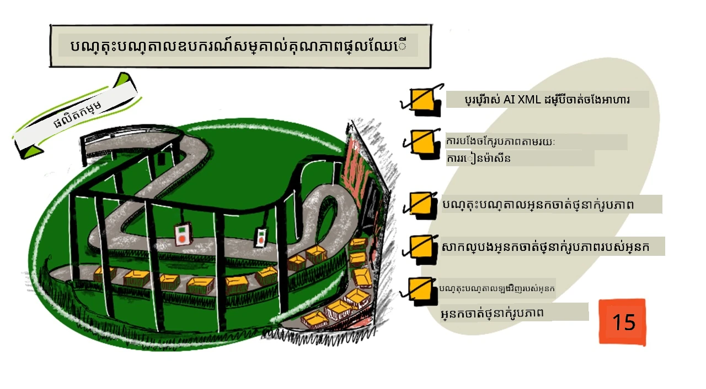
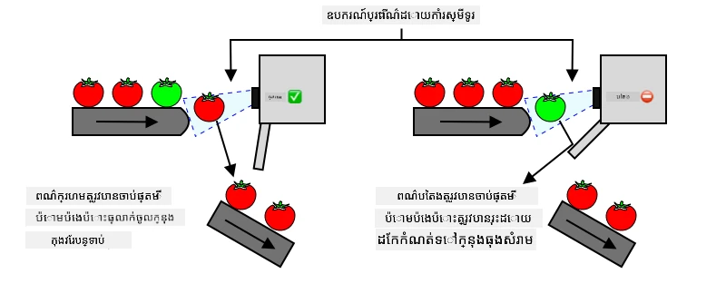
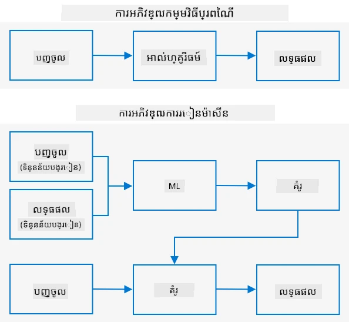
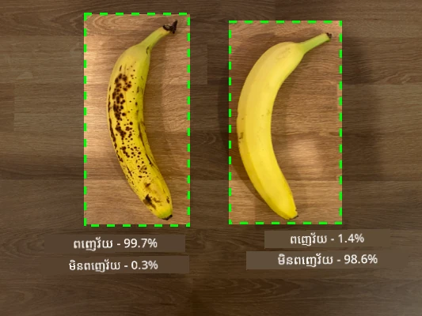
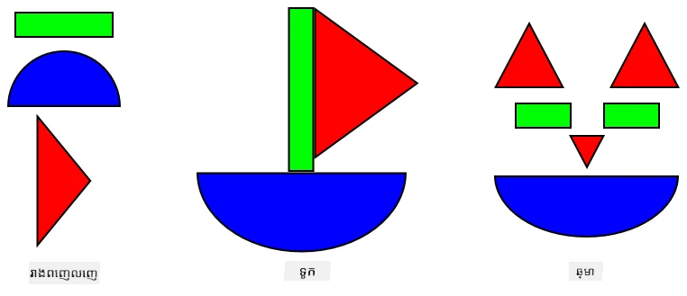
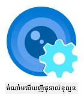
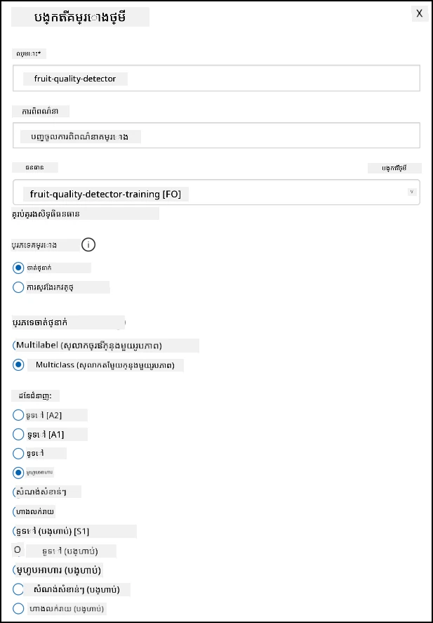
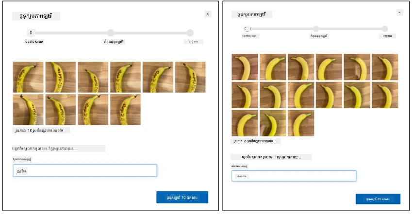
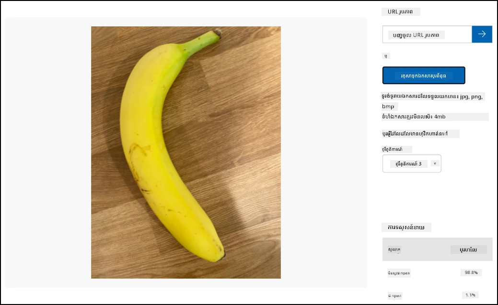

# បណ្តុះបណ្តាលឧបករណ៍រកឃើញគុណភាពផ្លែឈើ



> គំនូរសេចក្តីសង្ខេបដោយ [Nitya Narasimhan](https://github.com/nitya)। ចុចលើរូបភាពសម្រាប់ទំរង់ធំ។

វីដេអូនេះផ្ដល់មើលមួយទិសទានអំពីសេវាកម្ម Azure Custom Vision ដែលជាសេវាកម្មដែលនឹងត្រូវបានរៀបរាប់នៅក្នុងមេរៀននេះ។

[](https://www.youtube.com/watch?v=TETcDLJlWR4)

> 🎥 ចុចលើរូបភាពខាងលើដើម្បីមើលវីដេអូ

## ការប្រលងមុនបង្រៀន

[Pre-lecture quiz](https://black-meadow-040d15503.1.azurestaticapps.net/quiz/29)

## បង្ហាញមូលដ្ឋាន

ការកើនឡើងថ្មីៗនៃបញ្ញាសិប្បនិម្មិត (AI) និងការរៀនម៉ាស៊ីន (ML) កំពុងផ្តល់កម្រិតសមត្ថភាពជាច្រើនដល់អ្នកអភិវឌ្ឍសព្វថ្ងៃ។ គំរូ ML អាចបណ្តុះបណ្តាលដើម្បីស្គាល់វត្ថុផ្សេងៗនៅក្នុងរូបភាព រួមទាំងផ្លែឈើមិនទាន់ដុះទាល់កំឡុងពេលបិទផ្លែផងដែរ ហើយវាបានប្រើបាននៅក្នុងឧបករណ៍ IoT ដើម្បីជួយក្នុងការបែងចែកផលិតផល ឬនៅពេលមានការជ្រើសឬនៅខណៈដំណើរការនៅរោងចក្រ ឬឃ្លាំង។

នៅក្នុងមេរៀននេះ អ្នកនឹងរៀនអំពី ការបែងចែករូបភាព - ដោយប្រើគំរូ ML ដើម្បីបំបែករវាងរូបភាពនៃវត្ថុដែលខុសគ្នា។ អ្នកនឹងរៀនពីរបៀបបណ្តុះបណ្តាលឧបករណ៍បែងចែករូបភាព ដើម្បីបំបែករវាងផ្លែឈើល្អ និងផ្លែឈើអាក្រក់ ដូចជា មិនទាន់ដុះ ឬទ្រុះឬរុណ្ហិត ក៏ដូចជាផ្លែឈើមូស។

ក្នុងមេរៀននេះ យើងនឹងរៀបរាប់ពី៖

* [ការប្រើប្រាស់ AI និង ML ក្នុងការបែងចែកអាហារ](#ការប្រើប្រាស់-ai-និង-ml-ក្នុងការបែងចែកអាហារ)
* [ការបែងចែករូបភាពតាមរយៈការរៀនម៉ាស៊ីន](#ការបែងចែករូបភាពតាមរយៈការរៀនម៉ាស៊ីន)
* [បណ្តុះបណ្តាលឧបករណ៍បែងចែករូបភាព](#បណ្តុះបណ្តាលឧបករណ៍បែងចែករូបភាព)
* [សាកល្បងឧបករណ៍បែងចែករូបភាពរបស់អ្នក](#សាកល្បងប្រព័ន្ធចាត់ថ្នាក់រូបភាពរបស់អ្នក)
* [បណ្តុះបណ្តាលឡើងវិញឧបករណ៍បែងចែករូបភាពរបស់អ្នក](#បណ្តុះបណ្តាលម្ដងទៀតប្រព័ន្ធចាត់ថ្នាក់រូបភាពរបស់អ្នក)

## ការប្រើប្រាស់ AI និង ML ក្នុងការបែងចែកអាហារ

ការផ្គត់ផ្គង់អាហារសម្រាប់ប្រជាជនពិភពលោកគឺពិបាក ជាពិសេសនៅតម្លៃដែលធ្វើឲ្យអាហាររកបានងាយស្រួលសម្រាប់មនុស្សគ្រប់គ្នា។ មួយក្នុងចំណោមការចំណាយធំៗគឺថ្លៃសម្រាលក្រុមហ៊ុន ដូច្នេះកសិករជាច្រើនកំពុងផ្លាស់ប្ដូរទៅប្រើប្រព័ន្ធស្វ័យប្រវត្តិកម្ម និងឧបករណ៍ដូចជា IoT ដើម្បីកាត់បន្ថយថ្លៃសម្រាលក្រុមហ៊ុន។ ការប្រមិទចោលដោយដៃគឺពិបាកចិត្ត (ជាញឹកញាប់ក៏បណ្ដាលឱ្យបន្ទុកដៃត្រឡប់) ហើយកំពុងត្រូវបានជំនួសដោយម៉ាស៊ីន, ជាពិសេសនៅក្នុងប្រទេសមានប្រាក់កាក់ច្រើន។ ទោះបីជាមានការសន្សំថ្លៃដោយប្រើម៉ាស៊ីនក៏ដោយ មានគំនោលខូចមួយសម្រាប់សមត្ថភាពក្នុងការបែងចែកអាហារតាមពេលដំណើរការប្រមិទឬស្រូប។

មិនមែនគ្រប់កសិផលទាំងអស់នឹងដុះស្របគ្នាទេ។ ប៉ុន្មានផ្លែប៉េងប៉ោះ ឧទាហរណ៍ មិនទាន់ស្រូបស្រទាប់ទាំងមូលនៅលើដើម របស់ពួកវាគឺនៅមានផ្លែបៃតងមួយចំនួននៅពេលភាគច្រើនបានរួចរាល់សម្រាប់ការប្រមិទចោល។ ទោះបីជា វាពិតជាវាយនភាពក្នុងការប្រមិទផ្លែទម្រង់ទាំងនេះជាមុន ក៏ការប្រមិទជាមួយម៉ាស៊ីនសំរាប់កសិករមានតម្លៃថោកនិងងាយស្រួលជាង។

✅ សូមមើលផ្លែឬបន្លែផ្សេងៗ មិនថាជាកន្លែងកំពុងដុះនៅក្នុងសួនឬនៅក្នុងហាង។ តើពួកវានៅស្របគ្នាឬមានភាពខុសគ្នា?

ការកើនឡើងនៃការប្រមិទជាស្វ័យប្រវត្តិកម្ម បានអូសបន្លាយការបែងចែកផលិតផលពីកន្លែងប្រមិទទៅរោងចក្រ។ ផលិតផលត្រូវបានដឹកជញ្ជូនលើខ្សែដាក់ផលិតផលវែងៗ ដោយមានក្រុមមនុស្សណែនាំក្នុងការជ្រើសរើសផលិតផលដែលមិនគាំទ្រទៅតាមគុណភាពត្រូវការ។ ការប្រមិទបានកាន់តែលោកថោកសារភាពដោយម៉ាស៊ីន ប៉ុន្តែតម្លៃមនុស្សនៅមានសម្រាប់ការជ្រើសរើសផ្លែឈើ។



ការវិវត្តបន្ទាប់គឺប្រើម៉ាស៊ីនក្នុងការបែងចែក ផ្ទុកនៅក្នុងម៉ាស៊ីនប្រមិទឬនៅក្ដៅដំណើរការរោងចក្រ។ ជំនាន់ដំបូងនៃម៉ាស៊ីនទាំងនេះបានប្រើឧបករណ៍ស្វែករកពន្លឺដើម្បីបំបែកពណ៌ ធ្វើបន្ទុក actuator លើប៉េងប៉ោះបៃតងទៅតុងបោកសម្អាតដោយប្រើក្រឡាចត ឬខ្យល់បាញ់ បន្ទាប់ពីប៉េងប៉ោះក្រហមបន្តលើខ្សែដាក់ផលិតផល។

នៅក្នុងវីដេអូនេះ នៅពេលប៉េងប៉ោះរំលាយពីខ្សែដាក់ផលិតផលមួយទៅមួយ ផ្ទុកបៃតងត្រូវបានរកឃើញ ហើយត្រូវបានបុកចុះតទៅក្នុងធុងដោយប្រើក្រឡាចត។

✅ តើមានលក្ខខណ្ឌណាខ្លះដែលអ្នកត្រូវការនៅក្នុងរោងចក្រ ឬស្វត្ដាដើម្បីឲ្យឧបករណ៍ស្វែកស្ទង់ពន្លឺការងារកាត់រាំងត្រឹមត្រូវ?

ការវិវត្តបច្ចុប្បន្ននៃម៉ាស៊ីនបែងចែកទាំងនេះប្រើប្រាស់ AI និង ML ដោយប្រើគំរូបណ្តុះបណ្តាលដើម្បីបំបែកផលិតផលល្អពីអាក្រក់ មិនត្រឹមតែគ្រាន់តែការប្រែប្រួលពណ៌បែបច្បាស់លាស់ដូចជា បៃតងនិងក្រហមទេ ប៉ុន្តែដោយភាពខុសគ្នាផ្សេងទៀតដែលអាចបង្ហាញសញ្ញារបស់ជំងឺ ឬភាពរបួស។

## ការបែងចែករូបភាពតាមរយៈការរៀនម៉ាស៊ីន

កម្មវិធីដំណើរការប្រព្រឹត្តផ្លូវចាស់គឺអ្នកយកទិន្នន័យ មកអនុវត្តអាល់ហ្គរីធម៌លើទិន្នន័យ ហើយទទួលបានលទ្ធផល។ ឧទាហរណ៍ ប្រសិនបើក្នុងគម្រោងចុងក្រោយ អ្នកយកកូអរដោនេ GPS និងច្រកដែនដី (geofence) ប្រើអាល់ហ្គរីធម៌ដែលផ្ដល់ដោយ Azure Maps ហើយទទួលបានលទ្ធផលថាតើចំណុចដែលបានបង់នៅក្នុងឬក្រៅច្រកដែន។ អ្នកបញ្ចូលទិន្នន័យបន្ថែម ហើយទទួលបានលទ្ធផលបន្ថែម។



ការរៀនម៉ាស៊ីនបង្រ្កាបប្រវត្តិគ្នា - អ្នកចាប់ផ្តើមដោយទិន្នន័យ និងលទ្ធផលដែលបានដឹង ហើយជារៀងរាល់ពេលអាល់ហ្គរីធម៌រៀនពីរបៀបនេះ។ បន្ទាប់មក អ្នកអាចយកគំរូដែលបណ្តុះស្រាប់ហៅថា *គំរូរៀនម៉ាស៊ីន* ឬ *ម៉ូដែល* ហើយនាំចូលទិន្នន័យថ្មី ហើយទទួលបានលទ្ធផលថ្មី។

> 🎓 ដំណើរការរបស់អាល់ហ្គរីធម៌រៀនម៉ាស៊ីនក្នុងការរៀនពីទិន្នន័យហៅថា *ការបណ្តុះបណ្តាល*។ បញ្ចូល និងលទ្ធផលដែលបានដឹងហៅថា *ទិន្នន័យបណ្តុះបណ្តាល*។

ឧទាហរណ៍ អ្នកអាចផ្ដល់គំរូរូបភាពម៉ឺននៃចេកមិនទាន់ដុះជាទិន្នន័យបណ្តុះបណ្តាល ជាមួយលទ្ធផលបន្ទាន់ជា `unripe` ហើយមានរូបភាពចេកដុះស្រាប់ជាទិន្នន័យបណ្តុះបណ្តាលជាមួយលទ្ធផលជា `ripe`។ អាល់ហ្គរីធម៌ ML នឹងបង្កើតគំរូយោងទៅលើទិន្នន័យនេះ។ បន្ទាប់មក អ្នកផ្ដល់រូបភាពចេកថ្មីទៅឧបករណ៍នេះ ហើយវានឹងអាចទាយថាផ្លែនេះដុះរួចហើយ ឬមិនទាន់ដុះ។

> 🎓 លទ្ធផលនៃគំរូ ML ហៅថា *ការទាយ*



គំរូ ML មិនផ្ដល់ចម្លើយពីរជាមួយគ្នាតែមួយទេ តែផ្ដល់លទ្ធផលរង់ចាំសក្តានុពល។ ឧទាហរណ៍ ម៉ូដែលអាចទទួលរូបភាពចេក ហើយទាយថាដុះ ៩៩.៧% និងមិនដុះ ០.៣%។ កូដរបស់អ្នកនឹងជ្រើសលទ្ធផលល្អបំផុត ហើយសម្រេចថាចេកនេះដុះរួចហើយ។

គំរូ ML ដែលប្រើសម្រាប់ស្វែងរករូបភាពនេះហៅថា *ឧបករណ៍បែងចែករូបភាព* - វាត្រូវបានផ្ដល់រូបភាពដែលបានសម្គាល់ស្លាក ហើយបន្ទាប់មកការវិភាគរូបភាពថ្មីដោយផ្អែកលើស្លាកទាំងនេះ។

> 💁 វាមានការសង្ខេបខ្លីបែបនេះ ហើយមានវិធីផ្សេងៗក្នុងការបណ្តុះគំរូដែលមិនតែងតែត្រូវការស្លាកយល់ត្រឹមត្រូវ ដូចជាការរៀនដែលមិនមានអ្នកណែនាំ។ បើអ្នកចង់រៀនបន្ថែមអំពី ML សូមពិនិត្យមើល [ML សម្រាប់អ្នកចាប់ផ្តើម, មេរៀន២៤លើការរៀនម៉ាស៊ីន](https://aka.ms/ML-beginners)។

## បណ្តុះបណ្តាលឧបករណ៍បែងចែករូបភាព

ដើម្បីបណ្តុះឧបករណ៍បែងចែករូបភាពដោយជោគជ័យ អ្នកត្រូវការរូបភាពលានឺម៉ឺន។ បន្ទាប់ពីអ្នកមានឧបករណ៍បែងចែករូបភាពដែលបានបណ្តុះលើរូបភាពលានឺម៉ឺនឬអបទិកលានឺម៉ឺន អ្នកអាចប្រើវាឡើងវិញ ហើយបណ្តុះឡើងវិញជាមួយរូបភាពតិចតួច និងទទួលបានលទ្ធផលល្អ តាមវិធីដែលហៅថា *ការរៀនផ្ទេរ*។

> 🎓 ការរៀនផ្ទេរជាប្រភេទបង្ហាត់ដែលអ្នកផ្ទេរពីកម្រិតលំហូរម៉ូដែល ML មានស្រាប់មកជាគំរូថ្មីខាងលើទិន្នន័យថ្មី។

បន្ទាប់ពីឧបករណ៍បែងចែករូបភាពត្រូវបានបណ្តុះចំពោះរូបភាពដែលមានភាពចម្រុះជាច្រើន សមត្ថភាពខាងក្នុងរបស់វាជំនាញក្នុងការស្គាល់រូបរាង ពណ៌ និងមុខងារ។ ការរៀនផ្ទេរអនុញ្ញាតឲ្យគំរូយកអ្វីដែលវាបានរៀនក្នុងការរកឃើញផ្នែករូបភាព ហើយប្រើវាសម្រាប់ស្គាល់រូបភាពថ្មី។



អ្នកអាចគិតវាដូចជាសៀវភៅរូបរាងកុមារដែលបន្ទាប់ពីអ្នកអាចស្គាល់អ័រគោណាគមន៍ជាក់ស្តែង អ័រនិងត្រីកោណ អ្នកអាចស្គាល់ទូកឡើងវិញ ឬឆ្មាដោយផ្អែកលើរចនាសម្ព័ន្ធរបស់រូបរាងទាំងនេះ។ ឧបករណ៍បែងចែករូបភាពអាចស្គាល់រូបរាង ហើយការរៀនផ្ទេរបង្រៀនវាថារចនាសម្ព័ន្ធណាដែលបង្កើតទូក ឬឆ្មា ឬចេកដែលខ្ចី។

មានឧបករណ៍ជាច្រើនពេលវេលាដែលអាចជួយអ្នកធ្វើការនេះ រួមទាំងសេវាកម្មពពកដែលអាចជួយបណ្តុះគំរូរបស់អ្នក ហើយបន្ទាប់មកប្រើវាតាមរយៈ API វេប។

> 💁 បណ្តុះគំរូទាំងនេះតម្រូវថាមពលកុំព្យូទ័រច្រើន ជាទូទៅតាម GPU (Graphics Processing Units)។ សម្ភារៈពិសេសដែលធ្វើឲ្យហ្គេមនៅលើ Xbox របស់អ្នកមានរូបភាពឆ្នើម ក៏អាចប្រើក្នុងការបណ្តុះគំរូរៀនម៉ាស៊ីនបានផងដែរ។ ដោយប្រើពពក អ្នកអាចជួលម៉ាស៊ីនដែលមាន GPU សំបូរដើម្បីបណ្តុះគំរូនេះ គ្រាន់តែពេលដែលអ្នកត្រូវការ។

## Custom Vision

Custom Vision ជាឧបករណ៍ផ្អែកលើពពកសម្រាប់បណ្តុះឧបករណ៍បែងចែករូបភាព។ វាផ្ដល់សំរាប់បណ្តុះឧបករណ៍ដោយប្រើរូបភាពតិចតួចប៉ុណ្ណោះ។ អ្នកអាចផ្ទុករូបភាពតាមរយៈរបាមេនវេប ចំពោះ API វេប ឬ SDK ដោយផ្ដល់ស្លាកបែប *tag* ដែលមានប្រភេទរូបភាព។ បន្ទាប់មកបណ្តុះគំរូ ហើយសាកល្បងវាថាលទ្ធផលរបស់វាបានល្អប៉ុណ្ណា។ បន្ទាប់ពីពេញចិត្ត អ្នកអាចបោះពុម្ពចេញប្រភេទនៃវា ដែលអាចចូលដំណើរការតាម API វេប ឬ SDK។



> 💁 អ្នកអាចបណ្តុះគំរូ Custom Vision ជាមួយរូបភាពតិចតួច ៥ រូបភាពសម្រាប់មួយប្រភេទ ប៉ុន្តែល្អប្រសើរជាងនេះ។ អ្នកអាចទទួលបានលទ្ធផលល្អជាងនេះជាមួយរូបភាពយ៉ាងហោចណាស់ ៣០ រូបភាព។

Custom Vision ជាផ្នែកមួយនៃឧបករណ៍ AI ពី Microsoft ហៅថា Cognitive Services។ វាជាឧបករណ៍ AI ដែលអាចប្រើបានដោយមិនចាំបាច់បណ្តុះ ឬជាមួយបណ្តុះបណ្តាលតិចតួច។ វារួមបញ្ចូលការស្គាល់បទនិយាយ និងការបកប្រែ ការយល់ភាសា និងការវិភាគរូបភាព។ វាអាចប្រើជាមួយជំហានមួយដែលមានថ្លៃសេសសម្រាប់ការងារសរសេរកម្មវិធី។

> 💁 ជំហានមិនគិតថ្លៃគ្រប់គ្រាន់សម្រាប់បង្កើតគំរូ បណ្តុះបណ្តាល និងប្រើប្រាស់សម្រាប់ការដំណើរការអភិវឌ្ឍន៍។ អ្នកអាចអានពីការគ្រប់គ្រងនៃជំហានមិនគិតថ្លៃនៅលើ [ទំព័រគម្រោងនិងកំណត់គន្លង Custom Vision នៅលើឯកសាររបស់ Microsoft](https://docs.microsoft.com/azure/cognitive-services/custom-vision-service/limits-and-quotas?WT.mc_id=academic-17441-jabenn)។

### តួនាទី - បង្កើតធនធាន cognitive services

ដើម្បីប្រើ Custom Vision អ្នកត្រូវបង្កើតធនធាន cognitive services ២ អ្នកតាមរយៈ Azure CLI, មួយសម្រាប់បណ្តុះ Custom Vision និងមួយសម្រាប់ទាយ Custom Vision។

1. បង្កើត Resource Group សម្រាប់គម្រោងនេះដែលមានឈ្មោះ `fruit-quality-detector`

1. ប្រើពាក្យបញ្ជាខាងក្រោមដើម្បីបង្កើតធនធានបណ្តុះ Custom Vision ដោយឥតគិតថ្លៃ:

    ```sh
    az cognitiveservices account create --name fruit-quality-detector-training \
                                        --resource-group fruit-quality-detector \
                                        --kind CustomVision.Training \
                                        --sku F0 \
                                        --yes \
                                        --location <location>
    ```

    ជំនួស `<location>` ជាមួយទីតាំងដែលអ្នកបានប្រើពេលបង្កើត Resource Group។

    នេះនឹងបង្កើតធនធានបណ្តុះ Custom Vision នៅក្នុង Resource Group របស់អ្នក។ វានឹងមានឈ្មោះ `fruit-quality-detector-training` ហើយប្រើ sku `F0` ដែលជាជំហានមិនគិតថ្លៃ។ ជម្រើស `--yes` មានន័យថាអ្នកយល់ព្រមលក្ខខណ្ឌនៃ cognitive services។

> 💁 ប្រើ sku `S0` ប្រសិនបើអ្នកមានគណនីមិនគិតថ្លៃដែលប្រើ cognitive services។

1. ប្រើពាក្យបញ្ជាខាងក្រោមដើម្បីបង្កើតធនធានទាយ Custom Vision ដោយឥតគិតថ្លៃ:

    ```sh
    az cognitiveservices account create --name fruit-quality-detector-prediction \
                                        --resource-group fruit-quality-detector \
                                        --kind CustomVision.Prediction \
                                        --sku F0 \
                                        --yes \
                                        --location <location>
    ```

    ជំនួស `<location>` ជាមួយទីតាំងដែលអ្នកបានប្រើពេលបង្កើត Resource Group។

    នេះនឹងបង្កើតធនធានទាយ Custom Vision នៅក្នុង Resource Group របស់អ្នក។ វានឹងមានឈ្មោះ `fruit-quality-detector-prediction` ហើយប្រើ sku `F0` ដែលជាជំហានមិនគិតថ្លៃ។ ជម្រើស `--yes` មានន័យថាអ្នកយល់ព្រមលក្ខខណ្ឌនៃ cognitive services។

### តួនាទី - បង្កើតគម្រោងឧបករណ៍បែងចែករូបភាព

1. បើកទំព័របណ្តុះបណ្តាល Custom Vision នៅ [CustomVision.ai](https://customvision.ai) ហើយចុះឈ្មោះជាមួយគណនី Microsoft ដែលអ្នកប្រើនៅក្នុងគណនី Azure របស់អ្នក។

1. អនុវត្តតាម [ផ្នែកបង្កើតគម្រោងថ្មីនៅក្នុង build a classifier quickstart នៅលើឯកសាររបស់ Microsoft](https://docs.microsoft.com/azure/cognitive-services/custom-vision-service/getting-started-build-a-classifier?WT.mc_id=academic-17441-jabenn#create-a-new-project) ក្នុងការបង្កើតគម្រោង Custom Vision ថ្មី។ UI ប្រហែលជាមានការផ្លាស់ប្តូរហើយឯកសារទាំងនេះគឺជារបៀបយោងដែលទាន់សម័យបំផុត។

    ហៅគម្រោងរបស់អ្នកថា `fruit-quality-detector`។

    នៅពេលបង្កើតគម្រោង សូមប្រាកដប្រើធនធាន `fruit-quality-detector-training` ដែលបានបង្កើតមុន។ ប្រើប្រភេទគម្រោងជា *Classification*, ប្រភេទបែងចែកជា *Multiclass*, និងដែនកាលជា *Food*។

    

✅ ចំណាយពេលមួយក្នុងការស្វែងយល់ UI Custom Vision សម្រាប់ឧបករណ៍បែងចែករូបភាពរបស់អ្នក។

### តួនាទី - បណ្តុះបណ្តាលគម្រោងឧបករណ៍បែងចែករូបភាពរបស់អ្នក

ដើម្បីបណ្តុះបណ្តាលឧបករណ៍បែងចែករូបភាព អ្នកត្រូវការរូបភាពជាច្រើននៃផ្លែឈើ ដែលមានគុណភាពល្អ និងអាក្រក់ ដូចជា ចេកដែលដុះពេញ និងចេកដែលដុះហួស។

> 💁 ឧបករណ៍បែងចែកទាំងនេះអាចបែងចែករូបភាពនៃអ្វីគ្រប់យ៉ាង ដូច្នេះបើអ្នកមិនមានផ្លែឈើគុណភាពខុសៗគ្នា អ្នកអាចប្រើផ្លែឈើពីបែបផ្សេងៗគ្នា ឬឆ្មា និងចៀម!

ល្អបំផុត រូបភាពមួយៗគួរតែមានផ្លែឈើតែមួយ ដោយមានផ្ទៃខាងក្រោយណាមួយនៅមិនប្រែប្រួល ឬមានកន្លែងខាងក្រោយខុសៗគ្នាជាច្រើន។ ត្រូវប្រាកដថាមិនមានអ្វីនៅក្នុងផ្ទៃខាងក្រោយដែលជាពិសេសសម្រាប់ផ្លែឈើដុះពេញប្រៀបធៀបនឹងមិនដុះទេ។
> 💁 វាសំខាន់ណាស់ក្នុងការមិនមានផ្ទៃខាងក្រោយជាក់លាក់ ឬអត្ថបទជាក់លាក់ដែលមិនទាក់ទងទេនឹងវត្ថុដែលត្រូវបានចាត់ថ្នាក់ទាំងអស់សម្រាប់ស្លាកនីមួយៗ បើមិនដូច្នោះទេ ប្រព័ន្ធចាត់ថ្នាក់អាចតែចាត់ថ្នាក់ដោយផ្អែកលើផ្ទៃខាងក្រោយផ្ទាល់គត់។ មានប្រព័ន្ធចាត់ថ្នាក់មួយសម្រាប់មហារីកស្បែកដែលបានបណ្តុះបណ្តាលលើ mole ទាំងធម្មតានិងមានមហារីក ហើយ mole ដែលមានមហារីកទាំងអស់មានរូបមនុស្សគឺជាផ្ទាំងវាស់ទំហំ។ បរិបទបង្ហាញថាប្រព័ន្ធចាត់ថ្នាក់គឺជាប់ជាសោយទទួលបានការពិតជិត ១០០% ក្នុងការសម្គាល់រូបមនុស្សនៃរូបភាព មិនមែនមហារីក mole ទេ។

ប្រព័ន្ធចាត់ថ្នាក់រូបភាពដំណើរការនៅរេសុលុខ្សែទាប។ ឧទាហរណ៍ Custom Vision អាចយករូបភាពបណ្តុះបណ្តាលនិងទស្សនា ដល់ទំហំ 10240x10240 ប៉ុន្តែបណ្តុះបណ្តាលនិងដំណើរការម៉ូដែលលើរូបភាពទំហំ 227x227។ រូបភាពធំៗត្រូវបានបង្រួមទៅទំហំនេះ ដូចនេះសូមប្រាកដថារូបភាពដែលអ្នកចង់ចាត់ថ្នាក់ កាន់តំបន់ធំទូលាយក្នុងរូបភាព បើមិនដូច្នោះវាអាចតូចពេកនៅក្នុងរូបភាពតូចដែលប្រព័ន្ធចាត់ថ្នាក់ប្រើ។

1. ប្រមូលរូបភាពសម្រាប់ប្រព័ន្ធចាត់ថ្នាក់របស់អ្នក។ អ្នកនឹងត្រូវការរូបភាពយ៉ាងតិច ៥ រូបសម្រាប់ស្លាកនីមួយៗ ដើម្បីបណ្តុះបណ្តាលប្រព័ន្ធចាត់ថ្នាក់ ប៉ុន្តែច្រើននោះកាន់តែប្រសើរ។ អ្នកត្រូវការលើសពីរូបភាពបន្តិចសម្រាប់សាកល្បងប្រព័ន្ធចាត់ថ្នាក់ផងដែរ។ រូបភាពទាំងនេះគួរតែគឺជារូបភាពខុសគ្នាទាំងអស់នៃវត្ថុដូចគ្នា។ ឧទាហរណ៍៖

    * ប្រើចេកពោរពេញ ២ ផ្លែ សូមថតរូបពីគ្រប់មុខ ទំហំយ៉ាងហោចណាស់ 7 រូប (5 សម្រាប់បណ្តុះបណ្តាល 2 សម្រាប់សាកល្បង) ប៉ុន្តែកាន់តែច្រើនបានតែប្រសើរ។

        

    * ធ្វើឡើងវិញដោយប្រើចេកមិនពេញ ២ ផ្លែ

    អ្នកគួរតែមានរូបភាពបណ្តុះបណ្តាលយ៉ាងតិច ១០ រូប មានចេកពេញ ៥ និងមិនពេញ ៥ ហើយរូបភាពសាកល្បង ៤ រូប មួយសម្រាប់ចេកពេញ ២ រ ហើយ ២ សម្រាប់មិនពេញ ២។ រូបភាពរបស់អ្នកគួរតែជា png ឬ jpeg មិនលើស 6MB។ ប្រសិនបើអ្នកបង្កើតដោយ iPhone ឧទាហរណ៍ វាអាចជារូបរូបភាព HEIC ដែលមានរេសុលុខ្ដ្ក់ខ្ពស់ ដូច្នេះត្រូវការបម្លែង និងអាចបង្រួម។ ច្រើនរូបភាពកាន់តែប្រសើរ ហើយអ្នកគួរតែមានចំនួនស្មើគ្នានៃចេកពេញនិងមិនពេញ។

    ប្រសិនបើអ្នកមិនមានផ្លែមានទាំងពេញនិងមិនពេញ អ្នកអាចប្រើផ្លែផ្សេងៗ ឬវត្ថុគ្រប់ប្រភេទដែលមានទៀងទាត់។ អ្នកក៏អាចរកឃើញរូបភាពគំរូនៅថតថត [images](../../../../../4-manufacturing/lessons/1-train-fruit-detector/images) របស់ចេកពេញនិងមិនពេញដែលអ្នកអាចប្រើបាន។

1. ដើរការតាមដានដំណាក់កាល [ផ្ទុកឡើងនិងស្លាករូបភាពនៅក្នុងផ្នែក quickstart ការបង្កើតប្រព័ន្ធចាត់ថ្នាក់នៅលើឯកសារ Microsoft](https://docs.microsoft.com/azure/cognitive-services/custom-vision-service/getting-started-build-a-classifier?WT.mc_id=academic-17441-jabenn#upload-and-tag-images) ដើម្បីផ្ទុករូបភាពបណ្តុះបណ្តាលរបស់អ្នក។ ស្លាកផ្លែពេញជាស្លាក `ripe` ហើយផ្លែមិនពេញជា `unripe`។

    

1. ដើរការតាមដានដំណាក់កាល [បណ្តុះបណ្តាលប្រព័ន្ធចាត់ថ្នាក់នៅក្នុង quickstart ការបង្កើតប្រព័ន្ធចាត់ថ្នាក់លើឯកសារ Microsoft](https://docs.microsoft.com/azure/cognitive-services/custom-vision-service/getting-started-build-a-classifier?WT.mc_id=academic-17441-jabenn#train-the-classifier) ដើម្បីបណ្តុះបណ្តាលប្រព័ន្ធចាត់ថ្នាក់រូបភាពលើរូបភាពដែលបានផ្ទុកឡើងរបស់អ្នក។

    អ្នកនឹងទទួលបានជម្រើសប្រភេទបណ្តុះបណ្តាល មើលជ្រើស **Quick Training**។

ប្រព័ន្ធចាត់ថ្នាក់នឹងបណ្តុះបណ្តាល។ វាត្រូវការប៉ុន្មាននាទីដើម្បីបញ្ចប់ការបណ្តុះបណ្តាល។

> 🍌 ប្រសិនបើអ្នកសម្រេចចិត្តបរិភោគផ្លែរបស់អ្នកខណៈពេលដែលប្រព័ន្ធចាត់ថ្នាក់កំពុងបណ្តុះបណ្តាល សូមប្រាកដថាអ្នកមានរូបភាពគ្រប់គ្រាន់សម្រាប់សាកល្បងជាមុន!

## សាកល្បងប្រព័ន្ធចាត់ថ្នាក់រូបភាពរបស់អ្នក

ពេលប្រព័ន្ធចាត់ថ្នាក់របស់អ្នកបានបណ្តុះបណ្តាល អ្នកអាចសាកល្បងវាបានដោយផ្តល់រូបភាពថ្មីមួយសម្រាប់ចាត់ថ្នាក់។

### ភារកិច្ច - សាកល្បងប្រព័ន្ធចាត់ថ្នាក់រូបភាពរបស់អ្នក

1. ដើរការតាមដាន [ឯកសារសាកល្បងម៉ូដែលរបស់អ្នកនៅលើឯកសារ Microsoft](https://docs.microsoft.com/azure/cognitive-services/custom-vision-service/test-your-model?WT.mc_id=academic-17441-jabenn#test-your-model) ដើម្បីសាកល្បងប្រព័ន្ធចាត់ថ្នាក់រូបភាពរបស់អ្នក។ ប្រើរូបភាពសាកល្បងដែលអ្នកបានបង្កើតមុននេះមិនមែនរូបភាពណាដែលអ្នកបានប្រើសម្រាប់បណ្តុះបណ្តាលនោះទេ។

    

1. ព្យាយាមប្រើរូបភាពសាកល្បងទាំងអស់ដែលអ្នកអាចចូលដំណើរការបាន ហើយត្រួតពិនិត្យអត្រាប៉ះពាល់។

## បណ្តុះបណ្តាលម្ដងទៀតប្រព័ន្ធចាត់ថ្នាក់រូបភាពរបស់អ្នក

ពេលអ្នកសាកល្បងប្រព័ន្ធចាត់ថ្នាក់ វាអាចមិនផ្តល់លទ្ធផលដែលអ្នករំពឹងទេ។ ប្រព័ន្ធចាត់ថ្នាក់រូបភាពប្រើការសិក្សាការបណ្តុះបណ្តាលម៉ាស៊ីន ដើម្បីធ្វើការព្យាករណ៍អំពីអ្វីដែលនៅក្នុងរូបភាព ដោយផ្អែកលើប្រភេទនៃលក្ខណៈពិសេសទេសូវនៅក្នុងរូបភាពដែលមានន័យថាវាភ្លេចផ្ទាល់ស្លាកណាមួយ។ វាមិនយល់ថាជាអ្វីនៅក្នុងរូបភាពទេ - វាមិនដឹងថាចេកជាអ្វី ឬយល់ថាអ្វីដែលធ្វើឲ្យចេកគឺជាចេកមិនមែនជាឡនជាឡៅណា។ អ្នកអាចបង្កើនប្រព័ន្ធចាត់ថ្នាក់របស់អ្នកដោយបណ្តុះបណ្តាលវាថ្មីជាមួយរូបភាពដែលវាប្រហែលខុស។

គ្រប់ពេលដែលអ្នកធ្វើការព្យាករណ៍ដោយប្រើជម្រើស quick test រូបភាពនិងលទ្ធផលនឹងត្រូវបានរក្សាទុក។ អ្នកអាចប្រើរូបភាពទាំងនេះមកបណ្តុះបណ្តាលម៉ូដែលរបស់អ្នកម្ដងទៀត។

### ភារកិច្ច - បណ្តុះបណ្តាលម្ដងទៀតប្រព័ន្ធចាត់ថ្នាក់រូបភាពរបស់អ្នក

1. ដើរការតាមដាន [ឯកសារប្រើរូបភាពដែលបានព្យាករណ៍សម្រាប់បណ្តុះបណ្តាលនៅលើឯកសារ Microsoft](https://docs.microsoft.com/azure/cognitive-services/custom-vision-service/test-your-model?WT.mc_id=academic-17441-jabenn#use-the-predicted-image-for-training) ដើម្បីបណ្តុះបណ្តាលម៉ូដែលរបស់អ្នកម្ដងទៀត ដោយប្រើស្លាកត្រឹមត្រូវសម្រាប់រូបភាពនីមួយៗ។

1. បន្ទាប់មកបន្ទប់ម៉ូដែលរបស់អ្នកបានបណ្តុះបណ្តាលវិញ សាកល្បងនៅលើរូបភាពថ្មី។

---

## 🚀 챌린지

តើអ្នកគិតថាតើអ្វីនឹងកើតឡើងបើអ្នកប្រើរូបភាពផ្លែប៊ឺរីជាមួយម៉ូដែលដែលបានបណ្តុះបណ្តាលលើចេក ឬរូបភាពចេកផ្គុំខ្យល់ ឬមនុស្សពាក់អាវចេក មិនថាគឺតារាគំនូរជីវចលពណ៌លឿងដូចនរណាម្នាក់ពី Simpsons?

សូមសាកល្បងនិងមើលថាលទ្ធផលព្យាករណ៍មានអ្វីខ្លះ។ អ្នកអាចរករូបភាពសម្រាប់សាកល្បងដោយប្រើ [Bing Image search](https://www.bing.com/images/trending)។

## សំណួរប្រឡងក្រោយការបង្រៀន

[សំណួរប្រឡងក្រោយការបង្រៀន](https://black-meadow-040d15503.1.azurestaticapps.net/quiz/30)

## របៀបមើលឡើងវិញ និងរៀនដោយខ្លួនឯង

* ពេលដែលអ្នកបានបណ្តុះបណ្តាលប្រព័ន្ធចាត់ថ្នាក់របស់អ្នក អ្នកនឹងបានឃើញតម្លៃសម្រាប់ *Precision* *Recall* និង *AP* ដែលវាយតម្លៃម៉ូដែលដែលបានបង្កើត។ សូមអានអំពីតម្លៃទាំងនេះ ដោយប្រើ [ផ្នែកវាយតម្លៃប្រព័ន្ធចាត់ថ្នាក់នៅក្នុង quickstart ការបង្កើតប្រព័ន្ធចាត់ថ្នាក់លើឯកសារ Microsoft](https://docs.microsoft.com/azure/cognitive-services/custom-vision-service/getting-started-build-a-classifier?WT.mc_id=academic-17441-jabenn#evaluate-the-classifier)
* អានអំពីរបៀបបង្កើនសមត្ថភាពប្រព័ន្ធចាត់ថ្នាក់ដោយប្រើ [របៀបបង្កើនម៉ូដែល Custom Vision របស់អ្នកក្នុងឯកសារ Microsoft](https://docs.microsoft.com/azure/cognitive-services/custom-vision-service/getting-started-improving-your-classifier?WT.mc_id=academic-17441-jabenn)

## កិច្ចការផ្ទះ

[បណ្តុះបណ្តាលប្រព័ន្ធចាត់ថ្នាក់របស់អ្នកសម្រាប់ផ្លែឈើនិងបន្លែជាច្រើន](assignment.md)

---

<!-- CO-OP TRANSLATOR DISCLAIMER START -->
**ការ​រាយការណ៍មិនទាក់ទង**៖
ឯកសារនេះត្រូវបានបកប្រែដោយប្រើសេវាបកប្រែ AI [Co-op Translator](https://github.com/Azure/co-op-translator)។ នៅពេលដែលយើងខិតខំប្រឹងប្រែងសម្រាប់ភាពត្រឹមត្រូវ សូមចងចាំថាការបកប្រែដោយស្វ័យប្រវត្តិអាចមានកំហុសឬច្រឡំនូវមិនត្រឹមត្រូវ។ ឯកសារដើមនៅជាភាសាដើមគួរត្រូវបានពិចារណាជាដើមទុនដែលមានសុពលភាពខ្ពស់។ សម្រាប់ព័ត៌មានសំខាន់ៗ ការបកប្រែដោយអ្នកជំនាញមនុស្សត្រូវបានណែនាំ។ យើងមិនទទួលខុសត្រូវចំពោះការយល់ច្រឡំឬការបកប្រែខុសដែលកើតឡើងពីការប្រើប្រាស់ការបកប្រែនេះនោះឡើយ។
<!-- CO-OP TRANSLATOR DISCLAIMER END -->