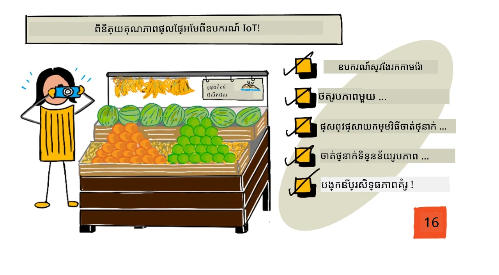
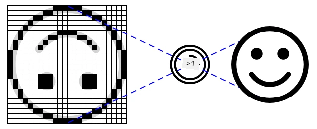
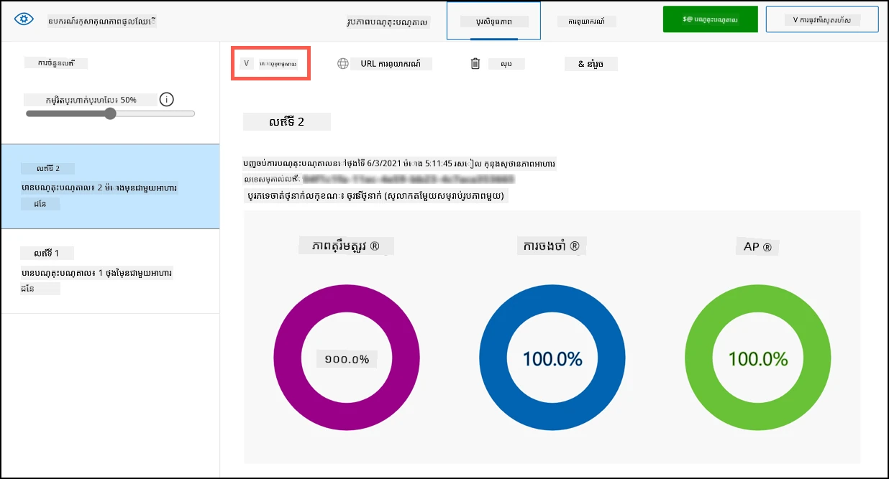
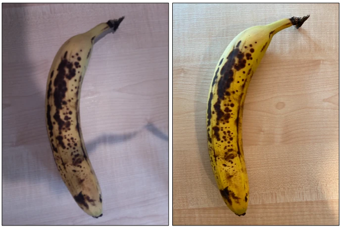

# ពិនិត្យគុណភាពផ្លែឈើពីឧបករណ៍ IoT



> សកេតណូតដោយ [Nitya Narasimhan](https://github.com/nitya)। ចុចរូបភាពដើម្បីមើលជាងធំ។

## សំនួរប្រឡងមុនមេរៀន

[សំនួរប្រឡងមុនមេរៀន](https://black-meadow-040d15503.1.azurestaticapps.net/quiz/31)

## បញ្ចូលមេរៀន

នៅក្នុងមេរៀនចុងក្រោយ អ្នកបានរៀនអំពីឧបករណ៍ចាត់ថ្នាក់រូបភាព និងរបៀបបណ្តុះបណ្តាលវាឲ្យស្គាល់ផ្លែឈើល្អនិងផ្លែឈើខូច។ ដើម្បីប្រើឧបករណ៍ចាត់ថ្នាក់រូបភាពនេះនៅក្នុងកម្មវិធី IoT អ្នកត្រូវតែនឹងត្រូវអាចថតរូបដោយកាមេរ៉ាមួយណាមួយ ហើយផ្ញើរូបភាពនេះទៅកាន់ពពកដើម្បីចាត់ថ្នាក់។

នៅក្នុងមេរៀននេះ អ្នកនឹងរៀនអំពីឧបករណ៍ យក្សកាមេរ៉ា ហើយរបៀបប្រើប្រាស់វាជាមួយឧបករណ៍ IoT ដើម្បីថតរូប។ អ្នកក៏នឹងរៀនរបៀបហៅឧបករណ៍ចាត់ថ្នាក់រូបភាពពីឧបករណ៍ IoT របស់អ្នក។

នៅក្នុងមេរៀននេះ យើងនឹងពិភាក្សាពី៖

* [ឧបករណ៍យក្សកាមេរ៉ា](#ឧបករណ៍យក្សកាមេរ៉ា)
* [ថតរូបដោយប្រើឧបករណ៍ IoT](#ថតរូបដោយប្រើឧបករណ៍-iot)
* [ផ្សាយឧបករណ៍ចាត់ថ្នាក់រូបភាពរបស់អ្នក](#ផ្សាយឧបករណ៍ចាត់ថ្នាក់រូបភាពរបស់អ្នក)
* [ចាត់ថ្នាក់រូបភាពពីឧបករណ៍ IoT របស់អ្នក](#ចាត់ថ្នាក់រូបភាពពីឧបករណ៍-iot-របស់អ្នក)
* [បង្កើនគំរូ](#បង្កើនគំរូ)

## ឧបករណ៍យក្សកាមេរ៉ា

ឧបករណ៍យក្សកាមេរ៉ា គឺជាកាមេរ៉ាដែលអ្នកអាចភ្ជាប់ទៅឧបករណ៍ IoT របស់អ្នក។ វាអាចថតរូបថតឈរ ឬថតវីដេអូផ្សាយបន្តផ្ទាល់។ តួខ្លះនឹងផ្ដល់ទិន្នន័យរូបភាពដើម មួយចំនួនផ្សេងទៀតនឹងបង្រួមទិន្នន័យរូបភាពទៅជាឯកសាររូបភាពដូចជា JPEG ឬ PNG។ សម្រាប់កាមេរ៉ាដែលធ្វើការជាមួយឧបករណ៍ IoT ជាទូទៅវាធម្មតាមានទំហំតូច និងមានភាពច្បាស់ទាបជាងអ្វីដែលអ្នកប្រើព្រមទាំង អ្នកអាចទទួលបានកាមេរ៉ាដោយមានភាពច្បាស់ខ្ពស់ដូចកាមេរ៉ានៅលើទូរស័ព្ទលំដាប់ខ្ពស់។ អ្នកអាចមានមុខងារជាច្រើនដូចជា ប្រើកែវភ្នែកដែលអាចប្តូរបាន ការតំឡើងកាមេរ៉ាច្រើនផ្នែក កាមេរ៉ាថ្មពន្លឺអ៊ីនហ្វ្រារជ្រាល (infra-red thermal) ឬកាមេរ៉ា UV។



ឧបករណ៍យក្សកាមេរ៉ាច្រើនប្រើឧបករណ៍ឧស្សាហកម្មរូបភាពដែលចំណុចរាប់ជា photodiode មួយៗ។ កែវភ្នែកផ្គុំរូបភាពទៅលើឧបករណ៍ឧស្សាហកម្មរូបភាព ហើយចំណុច photodiode រាប់ពាន់ឬលានន់សម្រាប់ចាប់ពន្លឺដែលធ្លាក់លើចំណុចនីមួយៗ ហើយកត់ត្រាវា ដូចជា ទិន្នន័យចំណុចរូបភាព។

> 💁 កែវភ្នែកបង្វិលរូបភាព បន្ទាប់ពីឧបករណ៍យក្សកាមេរ៉ានឹងបង្វិលរូបភាពត្រឡប់វិញ។ អ្វីនេះដូចគ្នានៅក្នុងភ្នែករបស់អ្នកផង ដូចដែលអ្នកឃើញ ត្រូវបានស្គាល់ថាធ្លាក់លើភ្នែករបស់អ្នកនៅផ្នែកខាងក្រោយ និងខួរក្បាលរបស់អ្នកកែលម្អវា។

> 🎓 ឧបករណ៍ឧស្សាហកម្មរូបភាពត្រូវបានហៅថា Active-Pixel Sensor (APS), ហើយប្រភេទ APS ដែលពេញនិយមបំផុតគឺជា complementary metal-oxide semiconductor sensor, ឬ CMOS។ អ្នកប្រហែលជាគង់បានស្ដាប់ពាក្យ CMOS sensor សម្រាប់ឧបករណ៍យក្សកាមេរ៉ា ។

ឧបករណ៍យក្សកាមេរ៉ា គឺជាឧបករណ៍ឌីជីថល ដែលផ្ញើទិន្នន័យរូបភាពជាទិន្នន័យឌីជីថល ជាទូទៅជាមួយជំនួយពីបណ្ណាល័យមួយដែលផ្តល់របៀបទំនាក់ទំនង។ កាមេរ៉ាភ្ជាប់ប្រើប្រាស់ពិធីការដូចជា SPI ដើម្បីអនុញ្ញាតឱ្យវាផ្ញើទិន្នន័យច្រើន - រូបភាពធំជាងលេខប៉ុណ្ណោះពីឧបករណ៍ឧស្សាហកម្មដូចជាឧបករណ៍វាស់កម្តៅ។

✅ តើមានកំណត់អ្វីខ្លះអំពីទំហំរូបភាពជាមួយឧបករណ៍ IoT? សូមគិតអំពីការរឹតប៉ោងបញ្ជាក់ឲ្យជាពិសេសលើរឹទ្ធិសាស្ត្រម៉ាក់រកូនត្រូលឡឺ។

## ថតរូបដោយប្រើឧបករណ៍ IoT

អ្នកអាចប្រើឧបករណ៍ IoT របស់អ្នកដើម្បីថតរូបសម្រាប់ចាត់ថ្នាក់។

### ខ្សែអង្គភាព - ថតរូបដោយប្រើឧបករណ៍ IoT

 ធ្វើតាមមគ្គុទេសក៍ដែលពាក់ព័ន្ធដើម្បីថតរូបដោយប្រើឧបករណ៍ IoT របស់អ្នក៖

* [Arduino - Wio Terminal](wio-terminal-camera.md)
* [កុំព្យូទ័រចេះតែមួយ - Raspberry Pi](pi-camera.md)
* [កុំព្យូទ័រចេះតែមួយ - ឧបករណ៍វីច័រចលនា](virtual-device-camera.md)

## ផ្សាយឧបករណ៍ចាត់ថ្នាក់រូបភាពរបស់អ្នក

អ្នកបានបណ្តុះបណ្តាលឧបករណ៍ចាត់ថ្នាក់រូបភាពនៅក្នុងមេរៀនចុងក្រោយ។ មុននឹងប្រើវាពីឧបករណ៍ IoT របស់អ្នក អ្នកត្រូវផ្សាយគំរូនេះ។

### ការបន្តរដំណើរការគំរូ

ពេលគំរូរបស់អ្នកកំពុងបណ្តុះបណ្តាលនៅក្នុងមេរៀនចុងក្រោយ អ្នកអាចទទួលបានថាតាប **កម្រិតសមត្ថភាព (Performance)** បង្ហាញពីលេខកំណត់រលកនៅផ្នែកជាប់បន្ទាត់។ ពេលអ្នកបណ្តុះបណ្តាលគំរូដំបូង អ្នកនឹងឃើញ *កំណត់រលក 1* ក្រោយមកពេលអ្នកប្រើរូបភាពប៉ាន់ស្មានដើម្បីលើកកម្រិតគំរូ អ្នកនឹងឃើញ *កំណត់រលក 2* ក្នុងការបណ្តុះបណ្តាល។

រាល់ពេលដែលអ្នកបណ្តុះបណ្តាលគំរូ អ្នកនឹងទទួលបានកំណត់រលកថ្មី។ នេះជាវិធីក្នុងការតាមដានកំណែខុសៗគ្នានៃគំរូរបស់អ្នកដែលបានបណ្តុះបណ្តាលលើសំណុំទិន្នន័យខុសៗគ្នា។ ពេលអ្នកធ្វើការប្រឡងយ៉ាងរហ័ស (**Quick Test**) មានបញ្ជីជ្រើសរើសដែលអ្នកអាចប្រើដើម្បីជ្រើសរើសកំណត់រលក ដូច្នេះអ្នកអាចប៉ៀបតម្លៃលទ្ធផលគ្នាចំពោះកំណត់រលកជាច្រើន។

ពេលអ្នកពេញចិត្តនឹងកំណត់រលកណាមួយ អ្នកអាចផ្សាយវាឲ្យអាចប្រើបានពីកម្មវិធីខាងក្រៅ។ វាបញ្ជាក់ថាអ្នកអាចមានកំណែផ្សាយដែលឧបករណ៍អ្នកប្រើ ពេលដែលអ្នកនៅតែបន្តការងារលើកំណែថ្មីជាច្រើនដំណើរការ ហើយបន្ទាប់មកផ្សាយវា នៅពេលអ្នកពេញចិត្ត។

### ខ្សែអង្គភាព - ផ្សាយកំណត់រលក

ការផ្សាយកំណត់រលកត្រូវធ្វើពីច្រក Custom Vision។

1. បើកច្រក Custom Vision នៅ [CustomVision.ai](https://customvision.ai) ហើយចូលប្រើបើមិនទាន់ចូល។ បន្ទាប់មកបើកគម្រោង `fruit-quality-detector` របស់អ្នក។

1. ជ្រើសតាកម្មវិធី **Performance** ពីជម្រើសនៅខាងលើ

1. ជ្រើសកំណត់រលកចុងក្រោយពីបញ្ជី *Iterations* នៅផ្នែកជាប់ជម្រៅ

1. ជ្រើសប៊ូតុង **Publish** សម្រាប់កំណត់រលកនោះ

    

1. នៅក្នុងប្រអប់ *Publish Model* បញ្ជាក់ធនធាន *Prediction resource* ទៅធនធាន `fruit-quality-detector-prediction` ដែលអ្នកបានបង្កើតក្នុងមេរៀនមុន។ ទុកឈ្មោះជា `Iteration2` ហើយជ្រើសប៊ូតុង **Publish**។

1. បន្ទាប់ពីផ្សាយរួច ជ្រើសប៊ូតុង **Prediction URL**។ វានឹងបង្ហាញព័ត៌មានលម្អិតអំពី API សម្រាប់ការព្យាករណ៍ ហើយអ្នកត្រូវការព័ត៌មាននេះដើម្បីហៅគំរូពីឧបករណ៍ IoT របស់អ្នក។ ផ្នែកខាងក្រោមមានស្លាក *If you have an image file* ហើយនេះជាព័ត៌មានដែលអ្នកត្រូវការទទួលយក។ ចូរចម្លង URL ដែលបង្ហាញ ដែលនឹងជា:

    ```output
    https://<location>.api.cognitive.microsoft.com/customvision/v3.0/Prediction/<id>/classify/iterations/Iteration2/image
    ```

    ដែល `<location>` ជាទីតាំងដែលអ្នកបានប្រើពេលបង្កើតធនធាន custom vision របស់អ្នក ហើយ `<id>` ហៅជាអត្តសញ្ញាណវែងដែលបង្កើតពីតួអក្សរនិងចំនួន ។

    សូមចម្លងតម្លៃ *Prediction-Key* ផងផង។ នេះជាច្រកសុវត្ថិភាពដែលអ្នកត្រូវផ្ញើពេលហៅគំរូ។ កម្មវិធីតែប៉ុណ្ណោះដែលផ្ញើកូនសោនេះអនុញ្ញាតឲ្យប្រើគំរូបាន កម្មវិធីផ្សេងទៀតនឹងត្រូវបដិសេធ។

    

✅ ពេលកំណត់រលកថ្មីត្រូវបានផ្សាយ ឈ្មោះវានឹងខុសគ្នា។ តើអ្នកគិតថា របៀបណាដែលអ្នកនឹងផ្លាស់ប្តូរកំណត់រលកដែលឧបករណ៍ IoT កំពុងប្រើ?

## ចាត់ថ្នាក់រូបភាពពីឧបករណ៍ IoT របស់អ្នក

ឥឡូវនេះ អ្នកអាចប្រើព័ត៌មានការតភ្ជាប់ទាំងនេះដើម្បីហៅឧបករណ៍ចាត់ថ្នាក់រូបភាពពីឧបករណ៍ IoT របស់អ្នក។

### ខ្សែអង្គភាព - ចាត់ថ្នាក់រូបភាពពីឧបករណ៍ IoT របស់អ្នក

ធ្វើតាមមគ្គុទេសក៍ដែលពាក់ព័ន្ធដើម្បីចាត់ថ្នាក់រូបភាពដោយប្រើឧបករណ៍ IoT របស់អ្នក៖

* [Arduino - Wio Terminal](wio-terminal-classify-image.md)
* [កុំព្យូទ័រចេះតែមួយ - Raspberry Pi/ឧបករណ៍ IoT វីច័រចលនា](single-board-computer-classify-image.md)

## បង្កើនគំរូ

អ្នកអាចរកឃើញលទ្ធផលដែលបានពេលប្រើកាមេរ៉ាដែលភ្ជាប់នឹងឧបករណ៍ IoT របស់អ្នក មិនត្រូវគ្នាទៅតាមដែលអ្នករំពឹងទុក។ ការព្យាករណ៍មិនពិតទាំងអស់ឡើយដូចការប្រើរូបភាពដែលបានបញ្ចូលពីកុំព្យូទ័ររបស់អ្នក។ នេះដោយសារគំរូត្រូវបានបណ្តុះបណ្តាលលើទិន្នន័យខុសពីពេលដែលប្រើសម្រាប់ការព្យាករណ៍។

ដើម្បីទទួលបានលទ្ធផលល្អបំផុតសម្រាប់ឧបករណ៍ចាត់ថ្នាក់រូបភាព អ្នកចង់បណ្តុះបណ្តាលគំរូនេះជាមួយរូបភាពដែលដូចគ្នាច្រើនជាងរូបភាពដែលប្រើសម្រាប់ការព្យាករណ៍ឲ្យបានច្រើនបំផុត។ ប្រសិនបើអ្នកប្រើកាមេរ៉ាទូរស័ព្ទដៃរបស់អ្នកដើម្បីថតរូបសម្រាប់បណ្តុះបណ្តាល ឧទាហរណ៍ គុណភាពរូបភាព ភាពច្បាស់របស់វា និងពណ៍នឹងខុសច្បាស់ពីកាមេរ៉ាដែលភ្ជាប់ទៅឧបករណ៍ IoT ។



នៅក្នុងរូបភាពខាងលើ រូបភាពចេកខាងឆ្វេង ត្រូវបានថតដោយប្រើកាមេរ៉ា Raspberry Pi មួយ ហើយរូបភាពខាងស្ដាំ ត្រូវបានថតចេកដដែលនៅតំបន់ដូចគ្នា ដោយប្រើ iPhone មួយ។ មានភាពខុសគ្នាច្បាស់លាស់បំផុត - រូបភាព iPhone ដែលច្បាស់ជាង មានពណ៍ភ្លឺស ភាពផ្ទុះពណ៍ខុសគ្នាច្រើនជាង។

✅ តើអ្វីផ្សេងទៀតអាចបណ្តាលឲ្យរូបភាពដែលឧបករណ៍ IoT របស់អ្នកថតបាន មានការព្យាករណ៍អញ្ញើញ? សូមគិតអំពីបរិយាកាសដែលឧបករណ៍ IoT អាចប្រើ ប៉ារ៉ាម៉ែត្រអ្វីខ្លះដែលអាចប៉ះពាល់ដល់រូបភាពដែលត្រូវបានថត?

ដើម្បីបង្កើនគំរូ អ្នកអាចបណ្តុះបណ្តាលវា ជាថ្មី ដោយប្រើរូបភាពដែលបានថតពីឧបករណ៍ IoT ។

### ខ្សែអង្គភាព - បង្កើនគំរូ

1. ចាត់ថ្នាក់រូបភាពច្រើនប្រភេទរបស់ផ្លែឈើស្រស់ និងផ្លែឈើមិនសុក ក៏ដូចជារូបភាពដោយប្រើឧបករណ៍ IoT របស់អ្នក។

1. នៅ Custom Vision portal បណ្តុះបណ្តាលគំរូឡើងវិញ ដោយប្រើរូបភាពនៅផ្នែក *Predictions*។

    > ⚠️ អ្នកអាចយោងទៅឯកសារណែនាំសម្រាប់បណ្តុះបណ្តាលឧបករណ៍ចាត់ថ្នាក់រូបភាពនៅមេរៀនទី 1 ក្នុងករណីចាំបាច់ (../1-train-fruit-detector/README.md#retrain-your-image-classifier) ។

1. ប្រសិនបើរូបភាពរបស់អ្នកមើលទៅខុសពីរូបភាពដើមដែលបានប្រើបណ្តុះបណ្តាល អ្នកអាចលុបរូបភាពដើមទាំងអស់ ដោយជ្រើសរើសរូបភាពនៅផ្នែក *Training Images* និងចុចប៊ូតុង **Delete**។ ដើម្បីជ្រើសរើសរូបភាព សូមចលនាស៊ុមរការនៅលើវា និងមានសញ្ញាសញ្ញារូបមូល ហើយជ្រើសសញ្ញានេះដើម្បីជ្រើស ឬមិនជ្រើសរូបភាព។

1. បណ្តុះបណ្តាលកំណត់រលកថ្មីនៃគំរូ និងផ្សាយវាដោយប្រើជំហានខាងលើ។

1. បន្ទាន់សម័យ URL ផ្លូវចូលក្នុងកូដរបស់អ្នក ហើយរត់កម្មវិធីម្ដងទៀត។

1. ខ្យល់ធ្វើជាប់ៗគ្នាទៅរហូតអស់លោកអ្នកពេញចិត្តលទ្ធផលនៃការព្យាករណ៍។

---

## 🚀 បញ្ហាចំណាយពេល

តើភាពច្បាស់រូបភាព ឬពន្លឺ មានឥទ្ធិពលយ៉ាងដូចម្តេចចំពោះការព្យាករណ៍?

សូមព្យាយាមផ្លាស់ប្តូរជាក់លាក់ភាពច្បាស់រូបភាព នៅក្នុងកូដឧបករណ៍របស់អ្នក ហើយមើលថាវាប្រែប្រួលលើគុណភាពរូបភាពទេទេ។ ក៏សូមព្យាយាមផ្លាស់ប្តូរពន្លឺផងដែរ។

ប្រសិនបើអ្នកបង្កើតឧបករណ៍ផលិតកម្មបង្ហោះលក់ទៅកាន់កសិដ្ឋាន ឬរោងចក្រ អ្នកនឹងធ្វើដូចម្តេចដើម្បីធានាថាវាបញ្ចេញលទ្ធផលស្របគ្នា ក្នុងគ្រប់ពេលវេលា?

## សំនួរប្រែក្រោយមេរៀន

[សំនួរប្រែក្រោយមេរៀន](https://black-meadow-040d15503.1.azurestaticapps.net/quiz/32)

## រុករក និងសិក្សាឯករាជ្យ

អ្នកបានបណ្តុះបណ្តាលគំរូ custom vision របស់អ្នកជាមួយច្រក Custom Vision។ វាអាស្រ័យលើការមានរូបភាព សម្រាប់ពិភពជាក់ស្តែង អ្នកប្រហែលជាមិនអាចរកទិន្នន័យបណ្តុះបណ្តាលដែលស្របគ្នានឹងរូបភាពដែលកាមេរ៉ានៅលើឧបករណ៍អ្នកថតបានទេ។ អ្នកអាចបំពេញរឿងនេះដោយបណ្តុះបណ្តាលដោយផ្ទាល់ពីឧបករណ៍អ្នកប្រើជាមួយ API បណ្តុះបណ្តាល ដើម្បីបណ្តុះគំរូដោយប្រើរូបភាពដែលថតបានពីឧបករណ៍ IoT របស់អ្នក។

* អានអំពី API បណ្តុះបណ្តាល នៅក្នុង [ការចាប់ផ្តើមប្រើ Custom Vision SDK ជាយ៉ាងរហ័ស](https://docs.microsoft.com/azure/cognitive-services/custom-vision-service/quickstarts/image-classification?WT.mc_id=academic-17441-jabenn&tabs=visual-studio&pivots=programming-language-python)

## បេសកកម្ម

[ឆ្លើយតបលទ្ធផលចាត់ថ្នាក់](assignment.md)

---

<!-- CO-OP TRANSLATOR DISCLAIMER START -->
**ការព្រមាន**៖  
ឯកសារនេះត្រូវបានបកប្រែដោយប្រើសេវាកម្មបកប្រែ AI [Co-op Translator](https://github.com/Azure/co-op-translator)។ ខណៈពេលដែលយើងខិតខំសំរាប់ភាពត្រឹមត្រូវ សូមយកចិត្តទុកដាក់ថាការបកប្រែដោយស្វ័យប្រវត្តិអាចមានកំហុសឬភាពមិនត្រឹមត្រូវ។ ឯកសារដើមដែលមានភាសាដើមគឺគួរត្រូវបានចាត់ទុកជាអ្នកផ្តល់ព័ត៌មានផ្លូវការជាថ្មី។ សម្រាប់ព័ត៌មានសំខាន់ៗ ការបកប្រែដោយអ្នកជំនាញមនុស្សគឺណែនាំ។ យើងមិនទទួលខុសត្រូវចំពោះការយល់ច្រឡំ ឬការបកស្រាយខុសៗដែលកើតមានពីការប្រើប្រាស់ការបកប្រែនេះឡើយ។
<!-- CO-OP TRANSLATOR DISCLAIMER END -->