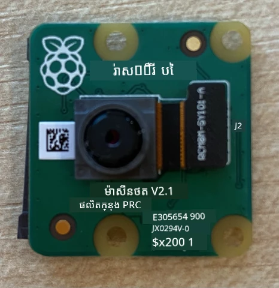
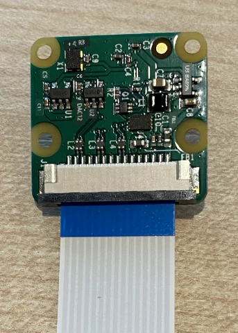
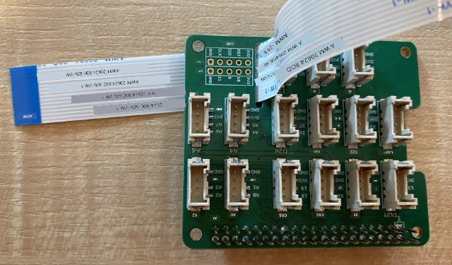
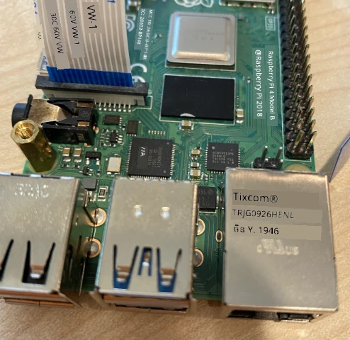
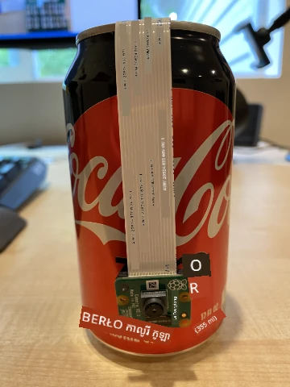

# ទាញយករូបភាព - Raspberry Pi

ក្នុងផ្នែកនេះនៃមេរៀន អ្នកនឹងបន្ថែមឧបករណ៍អេឌ្ស៊ីចរូបភាពទៅ Raspberry Pi របស់អ្នក ហើយអានរូបភាពពីវា។

## វិធីសាស្រ្ត

Raspberry Pi ត្រូវការកាមេរ៉ា។

កាមេរ៉ាដែលអ្នកនឹងប្រើគឺជា [Raspberry Pi Camera Module](https://www.raspberrypi.org/products/camera-module-v2/)។ កាមេរ៉ានេះត្រូវបានរចនាឡើងសម្រាប់ប្រើជាមួយ Raspberry Pi ហើយភ្ជាប់តាមខ្សែភ្ជាប់ឯកជននៅលើ Pi។

> 💁 កាមេរ៉ានេះប្រើប្រាស់ [Camera Serial Interface, ពិធីការដោយ Mobile Industry Processor Interface Alliance](https://wikipedia.org/wiki/Camera_Serial_Interface) ឬ MIPI-CSI។ នេះជាពិធីការឯកទេសសម្រាប់បញ្ជូនរូបភាព។

## ភ្ជាប់កាមេរ៉ា

កាមេរ៉ាអាចភ្ជាប់ទៅ Raspberry Pi តាមខ្សែរបិទរបស់វា។

### ភារកិច្ច - ភ្ជាប់កាមេរ៉ា



1. បិទភ្លើង Pi។

1. ភ្ជាប់ខ្សែរបិទដែលបានផ្តល់ជាមួយកាមេរ៉ាទៅកាមេរ៉ា។ ដើម្បីធ្វើនេះ ដកចេញបន្ទាប់ពីចលករជាប្រុញដៃខ្មៅក្នុងកន្លែងតាមប្រអប់បន្តិចហើយបញ្ចូលខ្សែចូលក្នុងសន្លឹកដោយផ្នែកខៀវនៃខ្សែផ្ទុយពីកញ្ចក់ និងបន្ទះនៃដណ្តឹងដែកនៅជិតកញ្ចក់។ បន្ទាប់ពីបញ្ចូលយ៉ាងពេញលេញ បិទប្រុញដៃខ្មៅត្រលប់ទៅកន្លែងដដែល។

    អ្នកអាចមើលមានឱកាសអាននូវរបៀបបើកប្រុញដៃ និងបញ្ចូលខ្សែពី [ឯកសារចាប់ផ្តើមកាមេរ៉ា Raspberry Pi](https://projects.raspberrypi.org/en/projects/getting-started-with-picamera/2)។

    

1. ដក Grove Base Hat ចេញពី Pi។

1. ដកខ្សែរបិទឲ្យឆ្លងតាមរន្ធកាមេរ៉ានៅលើ Grove Base Hat។ ពិនិត្យាឲ្យប្រាកដផ្នែកខៀវនៃខ្សែផ្ទុយពីច្រវ៉ាក់អាណាឡុកណូដែលមានស្លាក **A0**, **A1** ល។ 

    

1. បញ្ចូលខ្សែរបិទទៅក្នុងរន្ធកាមេរ៉ានៅលើ Pi។ ដូចមុន សូមលើកប្រុញដៃខ្មៅ, បញ្ចូលខ្សែ, រួចបិទប្រុញដៃវិញ។ ផ្នែកខៀវនៃខ្សែគួរតែបង្ហាញទៅកាន់រន្ធ USB និង ethernet។

    

1. ដំឡើងវិញ Grove Base Hat

## បង្ហាញកម្មវិធីកាមេរ៉ា

Raspberry Pi ឥឡូវនេះអាចត្រូវបានកម្មវិធីដើម្បីប្រើកាមេរ៉ា ដោយប្រើបណ្ណាល័យ Python [PiCamera](https://pypi.org/project/picamera/)។

### ភារកិច្ច - បើកប្រើម៉ូដកាមេរ៉ា legacy

សោកស្តាយ ជាមួយការចេញផ្សាយ Raspberry Pi OS Bullseye កម្មវិធីកាមេរ៉ាដែលមាននៅក្នុង OS បានផ្លាស់ប្ដូរ ហើយដូច្នេះ PiCamera មិនដំណើរការតាមលំនាំដើមទៀត។ មានកម្មវិធីជំនួស PiCamera2 កំពុងត្រូវអភិវឌ្ឍ ប៉ុន្តែវាមិនទាន់អាចប្រើបាននៅឡើយ។

ពេលនេះ អ្នកអាចកំណត់ Pi របស់អ្នកក្នុងម៉ូដកាមេរ៉ា legacy ដើម្បីឲ្យ PiCamera អាចដំណើរការ។ រន្ធកាមេរ៉ាក៏ត្រូវបានបិទដើមផងដែរ ប៉ុន្តែការបើកកម្មវិធីកាមេរ៉ា legacy នឹងបើករន្ធនេះដោយស្វ័យប្រវត្តិ។

1. បើក Pi ហើយរង់ចាំវាចាប់ផ្តើម

1. បើក VS Code ទាំងនៅលើ Pi ផ្ទាល់ ឬតាមរយៈបន្លាស់ Remote SSH។

1. រត់ពាក្យបញ្ជាខាងក្រោមពី terminal របស់អ្នក៖

    ```sh
    sudo raspi-config nonint do_legacy 0
    sudo reboot
    ```

    នេះនឹងបន្ថែមការកំណត់សម្រាប់បើកកម្មវិធីកាមេរ៉ា legacy រួចផ្ទុកឡើងវិញ Pi ដើម្បីអោយការកំណត់នេះមានប្រសិទ្ធភាព។

1. រង់ចាំ Pi បញ្ចេញដោយឡើងវិញ បន្ទាប់មកបើក VS Code ម្ដងទៀត។

### ភារកិច្ច - កម្មវិធីកាមេរ៉ា

បង្ហាញកម្មវិធីឧបករណ៍។

1. ពី terminal បង្កើតថតថ្មីក្នុងថតផ្ទះអ្នកប្រើ `pi` មានឈ្មោះ `fruit-quality-detector`។ បង្កើតឯកសារ `app.py` នៅក្នុងថតនេះ។

1. បើកថតនេះក្នុង VS Code

1. ដើម្បីធ្វើការ​ជាមួយ​កាមេរ៉ា អ្នកអាចប្រើ​បណ្ណាល័យ PiCamera Python។ ដំឡើង pip ផ្នែកនេះជាមួយពាក្យបញ្ជាខាងក្រោម៖

    ```sh
    pip3 install picamera
    ```

1. បន្ថែមកូដខាងក្រោមទៅឯកសារ `app.py` របស់អ្នក៖

    ```python
    import io
    import time
    from picamera import PiCamera
    ```

    កូដនេះនាំចូលបណ្ណាល័យជាច្រើន ដែលមានបណ្ណាល័យ `PiCamera` នៅក្នុង។

1. បន្ថែមកូដខាងក្រោមនេះសម្រាប់រៀបចំកាមេរ៉ា៖

    ```python
    camera = PiCamera()
    camera.resolution = (640, 480)
    camera.rotation = 0
    
    time.sleep(2)
    ```

    កូដនេះបង្កើតវត្ថុ PiCamera កំណត់ការដោះស្រាយទៅ 640x480។ បើទោះបីជាការដោះស្រាយខ្ពស់ជាងនេះមានស្រាប់ (ដល់ 3280x2464) កម្មវិធីចាត់ចែងរូបភាពប្រើលើរូបភាពតូចជាងនេះ (227x227) ដូច្នេះគ្មានករណីត្រូវទាញយករូបភាពធំឡើងទេ។

    បន្ទាត់ `camera.rotation = 0` កំណត់លំហូររូបភាព។ ខ្សែរបិទចូលពីផ្នែក​ខាងក្រោមនៃកាមេរ៉ា ប៉ុន្តែប្រសិនបើកាមេរ៉ារបស់អ្នកបានបង្វិលដើម្បីឲ្យវាស្រាតមកលើគ្រឿងដែលអ្នកចង់ចាត់ថ្នាក់ ត្រូវផ្លាស់ប្ដូរបន្ទាត់នេះទៅជាចំនួនកម្រិត។

    

    ឧទាហរណ៍ ប្រសិនបើអ្នកផ្គាប់ខ្សែរបិទនៅលើអ្វីមួយ ដែលមានកំរិតនៅខាងលើនៃកាមេរ៉ា កំណត់ការបង្វិលទៅ 180៖

    ```python
    camera.rotation = 180
    ```

    កាមេរ៉ាចាំបាច់មានពេលខ្ពស់បន្តិចសម្រាប់ចាប់ផ្តើម ដូច្នេះមានបន្ទាត់ `time.sleep(2)`

1. បន្ថែមកូដខាងក្រោមនេះសម្រាប់ទាញយករូបភាពជាទិន្នន័យប៊ីណារី៖

    ```python
    image = io.BytesIO()
    camera.capture(image, 'jpeg')
    image.seek(0)
    ```

    កូដនេះបង្កើតវត្ថុ `BytesIO` សម្រាប់រក្សាទិន្នន័យប៊ីណារី។ រូបភាពត្រូវបានអានពីកាមេរ៉ា ជា​ឯកសារ JPEG ហើយរក្សាទុកក្នុងវត្ថុនេះ។ វត្ថុនេះមានតំណាងទីតាំងដើម្បីដឹងថាវាស្ថិតនៅទីណាក្នុងទិន្នន័យ ដើម្បីអាចសរសេរទិន្នន័យបន្ថែមនៅចុងបន្ទាប់បាន ដូច្នេះ បន្ទាត់ `image.seek(0)` នាំប្រជុំទីតាំងក្រោយវិលត្រឡប់ទៅដំបូង ដើម្បីអានទិន្នន័យទាំងអស់ក្រោយ។

1. ខាងក្រោមនេះ បន្ថែមកូដនេះសម្រាប់រក្សាទុករូបភាពទៅឯកសារ៖

    ```python
    with open('image.jpg', 'wb') as image_file:
        image_file.write(image.read())
    ```

    កូដនេះបើកឯកសារហៅថា `image.jpg` សម្រាប់សរសេរ បន្ទាប់មកអានទិន្នន័យទាំងអស់ពីវត្ថុ `BytesIO` ហើយសរសេរលើឯកសារ។

    > 💁 អ្នកអាចទាញយករូបភាពទៅឯកសារតែប៉ុណ្ណោះ ដោយផ្ទាល់ជំនួសរក្សាទុកក្នុងវត្ថុ `BytesIO` ដោយបញ្ជូនឈ្មោះឯកសារទៅការហៅ `camera.capture`។ មូលហេតុនៃការប្រើវត្ថុ `BytesIO` គឺ ដើម្បីអោយអ្នកអាចផ្ញើរូបភាពទៅកម្មវិធីចាត់ថ្នាក់រូបភាពក្នុងមេរៀនក្រោយ។

1. បង្ហាញកាមេរ៉ាទៅខ្លះ ហើយរត់កូដនេះ។

1. រូបភាពមួយនឹងត្រូវទាញយក និងរក្សាទុក​ជា `image.jpg` នៅក្នុងថតបច្ចុប្បន្ន។ អ្នកនឹងឃើញឯកសារនេះក្នុងកាន់ត្រាវ VS Code។ ជ្រើសឯកសារដើម្បីមើលរូបភាព។ បើវាត្រូវការបង្វិល បន្ត្យប្តូរបន្ទាត់ `camera.rotation = 0` ដូចត្រូវការ ហើយថតរូបមួយទៀត។

> 💁 អ្នកអាចស្វែងរកកូដនេះនៅក្នុងថត [code-camera/pi](../../../../../4-manufacturing/lessons/2-check-fruit-from-device/code-camera/pi)។

😀 កម្មវិធីកាមេរ៉ារបស់អ្នកបានជោគជ័យ!

---

<!-- CO-OP TRANSLATOR DISCLAIMER START -->
**បញ្ជាក់**៖  
ឯកសារនេះត្រូវបានបម្លែងដោយប្រើសេវាកម្មបកប្រែ AI [Co-op Translator](https://github.com/Azure/co-op-translator)។ ខណៈពេលដែលយើងខិតខំក្នុងការធានាការត្រឹមត្រូវ សូមចំណាំថាការបកប្រែដោយស្វ័យប្រវត្តិកំពុងមានកំហុស ឬភាពមិនត្រឹមត្រូវខ្លះៗ។ ឯកសារដើមជាភាសាមូលដ្ឋានគួរត្រូវបានគិតថាជា ប្រភពផ្លូវការបំផុត។ សម្រាប់ព័ត៌មានសំខាន់ៗ យើងខ្ញុំសូមផ្ដល់អនុសាសន៍ឲ្យប្រើប្រាស់ការបកប្រែដោយអ្នកជំនាញមនុស្ស។ យើងមិនទទួលខុសត្រូវចំពោះការយល់ខុស ឬការបកប្រែខុសពីការប្រើប្រាស់ការបកប្រែនេះឡើយ។
<!-- CO-OP TRANSLATOR DISCLAIMER END -->