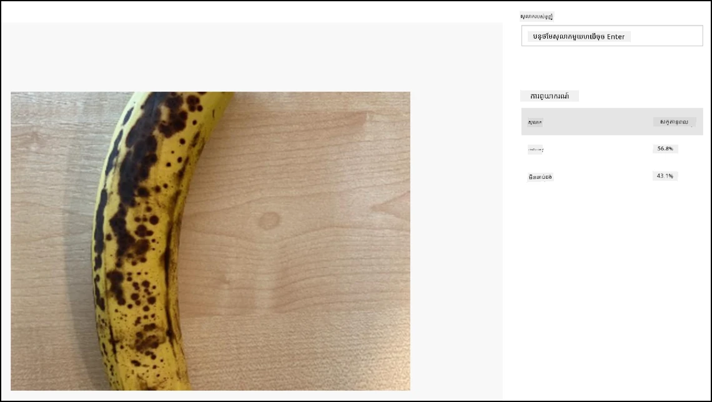

# ចែកចាត់រូបភាព - សម្ភារៈ IoT យ៉ាងពិត និង Raspberry Pi

នៅផ្នែកនេះនៃមេរៀន អ្នកនឹងផ្ញើរូបភាពដែលបានចាប់យកដោយកាមេរ៉ាទៅកាន់សេវាកម្ម Custom Vision ដើម្បីចែកចាត់វា។

## ផ្ញើរូបភាពទៅ Custom Vision

សេវាកម្ម Custom Vision មាន Python SDK ដែលអ្នកអាចប្រើដើម្បីចែកចាត់រូបភាព។

### បំណងការ - ផ្ញើរូបភាពទៅ Custom Vision

1. បើកថត `fruit-quality-detector` នៅក្នុង VS Code។ ប្រសិនបើអ្នកកំពុងប្រើឧបករណ៍ IoT លើកំណត់ សូមប្រាកដថាបរិយាគន្លងនោះកំពុងរត់នៅក្នុង terminal។

1. Python SDK សម្រាប់ផ្ញើរូបភាពទៅ Custom Vision មាននៅជាបណ្ណាល័យ Pip package។ ដំឡើងវាជាមួយពាក្យបញ្ជាតទៅខាងក្រោម៖

    ```sh
    pip3 install azure-cognitiveservices-vision-customvision
    ```

1. បន្ថែមប្រកាស import ខាងក្រោមនៅផ្នែកលើបន្ទាត់ក្នុងឯកសារ `app.py`៖

    ```python
    from msrest.authentication import ApiKeyCredentials
    from azure.cognitiveservices.vision.customvision.prediction import CustomVisionPredictionClient
    ```

    នេះនាំមូលដ្ឋានមកពីមូឌុលនៅក្នុងបណ្ណាល័យ Custom Vision មួយសម្រាប់ផ្ទៀងផ្ទាត់ជាមួយ key នៃការព្យាករណ៍ ហើយមួយសម្រាប់ផ្តល់ថ្នាក់ client ដែលអាចហៅ Custom Vision។

1. បន្ថែមកូដខាងក្រោមនៅចុងឯកសារ៖

    ```python
    prediction_url = '<prediction_url>'
    prediction_key = '<prediction key>'
    ```

    ជំនួស `<prediction_url>` ជាមួយ URL ដែលអ្នកបានចម្លងពីប្រអប់សន្ទនា *Prediction URL* មុននេះ ក្នុងមេរៀននេះ។ ជំនួស `<prediction key>` ជាមួយ key នៃការព្យាករណ៍ដែលអ្នកបានចម្លងពីប្រអប់សន្ទនានោះដែរ។

1. URL នៃការព្យាករណ៍ដែលបានផ្តល់ដោយប្រអប់សន្ទនា *Prediction URL* ត្រូវបានរចនារួចសម្រាប់ប្រើនៅពេលហៅឆានែល REST ពីផ្ទាល់។ Python SDK ប្រើផ្នែកខុសៗគ្នានៃ URL ខ្លួននៅកន្លែងផ្សេងៗ។ បន្ថែមកូដខាងក្រោមដើម្បីបំបែក URL នេះចេញជាពីរសំណុំ​ដែលត្រូវការ៖

    ```python
    parts = prediction_url.split('/')
    endpoint = 'https://' + parts[2]
    project_id = parts[6]
    iteration_name = parts[9]
    ```

    នេះបំបែក URL ដក endpoint ដែលជា `https://<location>.api.cognitive.microsoft.com` មួយ project ID និងឈ្មោះនៃ iteration ដែលបានផ្សាយ។

1. បង្កើតឧបករណ៍ predictor ដើម្បីអនុវត្តការព្យាករណ៍ជាមួយកូដខាងក្រោម៖

    ```python
    prediction_credentials = ApiKeyCredentials(in_headers={"Prediction-key": prediction_key})
    predictor = CustomVisionPredictionClient(endpoint, prediction_credentials)
    ```

    `prediction_credentials` បំពាក់ key នៃការព្យាករណ៍។ ពួកវាត្រូវបានប្រើដើម្បីបង្កើត client នៃការព្យាករណ៍ដែលបញ្ចូនទៅ endpoint ។

1. ផ្ញើរូបភាពទៅ custom vision ដោយប្រើកូដខាងក្រោម៖

    ```python
    image.seek(0)
    results = predictor.classify_image(project_id, iteration_name, image)
    ```

    នេះសម្អាតរូបភាពឲ្យទៅចាប់ផ្តើមម្តងទៀត ហើយបញ្ជូនវាទៅ client នៃការព្យាករណ៍។

1. ចុងក្រោយ បង្ហាញលទ្ធផលជាមួយកូដខាងក្រោម៖

    ```python
    for prediction in results.predictions:
        print(f'{prediction.tag_name}:\t{prediction.probability * 100:.2f}%')
    ```

    នេះនឹងរំកិលតាមការព្យាករណ៍ទាំងអស់ដែលត្រូវបានត្រឡប់មក ហើយបង្ហាញពួកវានៅលើ terminal។ ប្រូបាបាលរបស់ពួកវាត្រឡប់ទៅជាចំនួនចុះចុះពី 0-1, ដែល 0 មានន័យថាមានឱកាស 0% ក្នុងការផ្គូរផ្គងនឹងស្លាក និង 1 មានន័យថា 100% ។

    > 💁 អ្នកចាត់ថ្នាក់រូបភាពនឹងបង្ហាញភាគរយសម្រាប់ស្លាកទាំងអស់ដែលត្រូវបានប្រើ។ ស្លាកមួយនីមួយៗនឹងមានប្រូបាបាលថារូបភាពផ្គូរផ្គងនឹងស្លាកនោះ។

1. ប្រតិបត្ដិកូដរបស់អ្នក ដោយឲ្យកាមេរ៉ារបស់អ្នកបង្ហាញទៅលើផ្លែឈើមួយ ឬជាសំណុំរូបភាពសមរម្យ ឬផ្លែឈើដែលអាចមើលឃើញតាម webcam ប្រសិនបើប្រើ hardware IoT ពិតប្រាកដ។ អ្នកនឹងឃើញលទ្ធផលនៅក្នុង console៖

    ```output
    (.venv) ➜  fruit-quality-detector python app.py
    ripe:   56.84%
    unripe: 43.16%
    ```

    អ្នកនឹងអាចមើលឃើញរូបភាពដែលបានថត និងតម្លៃទាំងនេះនៅក្នុងផ្ទាំង **Predictions** នៅក្នុង Custom Vision ។

    

> 💁 អ្នកអាចស្វែងរកកូដនេះនៅក្នុងថត [code-classify/pi](../../../../../4-manufacturing/lessons/2-check-fruit-from-device/code-classify/pi) ឬ [code-classify/virtual-iot-device](../../../../../4-manufacturing/lessons/2-check-fruit-from-device/code-classify/virtual-iot-device)។

😀 កម្មវិធីចាត់ថ្នាក់គុណភាពផ្លែឈើរបស់អ្នកបានជោគជ័យ!

---

<!-- CO-OP TRANSLATOR DISCLAIMER START -->
**ការបញ្ជាក់**ៈ  
ឯកសារនេះត្រូវបានបកប្រែដោយប្រើសេវាបកប្រែ AI [Co-op Translator](https://github.com/Azure/co-op-translator)។ បើទោះបីយើងខិតខំប្រឹងប្រែងក្នុងការធានានូវភាពត្រឹមត្រូវ ក៏សូមយល់ពីការប្រែសម្រួលដោយស្វ័យប្រវត្តិអាចមានកំហុសឬភាពមិនត្រឹមត្រូវ។ ឯកសារដើមជាភាសាមូលដ្ឋានគួរត្រូវបានចាត់ទុកជាមូលដ្ធានដែលមានសុពលភាព។ សម្រាប់ព័ត៌មានសំខាន់ សូមផ្តល់អាទិភាពការបកប្រែដោយមនុស្សជំនាញវិជ្ជាជីវៈ។ យើងមិនទទួលខុសត្រូវចំពោះការយល់ច្រឡំ ឬការបកស្រាយខុសពីការប្រើប្រាស់ការបកប្រែនេះឡើយ។
<!-- CO-OP TRANSLATOR DISCLAIMER END -->