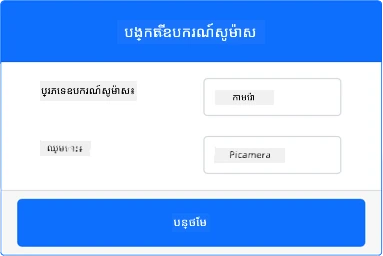
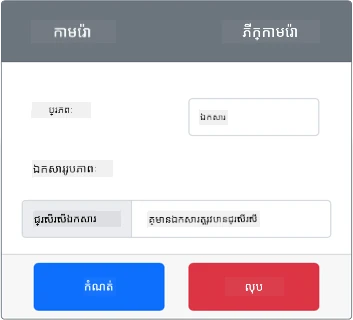
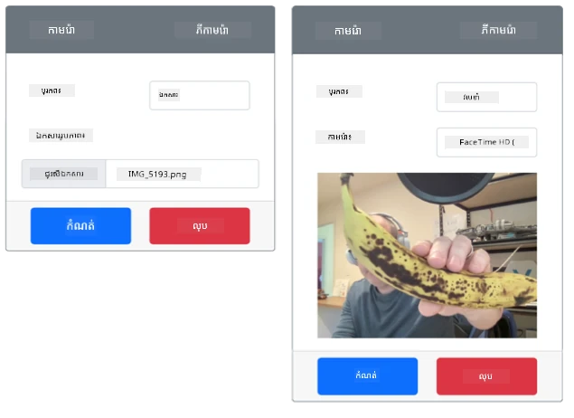

# ចាប់យករូបភាព - ឧបករណ៍ IoT អេឡិចត្រូនិចមួយជាការស្រដៀង

ក្នុងផ្នែកនេះនៃមេរៀន អ្នកនឹងបន្ថែមកាមេរ៉ាទៅឧបករណ៍ IoT អេឡិចត្រូនិចកញ្ចប់របស់អ្នក ហើយអានរូបភាពពីវា។

## ឧបករណ៍ផ្នែករឹង

ឧបករណ៍ IoT អេឡិចត្រូនិចកញ្ចប់នឹងប្រើកាមេរ៉ាស្មាតដែលបញ្ចូនរូបភាពពីឯកសារឬពីកាមេរ៉ា Webcam របស់អ្នក។

### បន្ថែមកាមេរ៉ាទៅ CounterFit

ដើម្បីប្រើកាមេរ៉ាស្មាត អ្នកត្រូវបន្ថែមមួយទៅកម្មវិធី CounterFit

#### ភារកិច្ច - បន្ថែមកាមេរ៉ាទៅ CounterFit

បន្ថែមកាមេរ៉ាទៅកម្មវិធី CounterFit។

1. បង្កើតកម្មវិធី Python ថ្មីមួយលើកុំព្យូទ័ររបស់អ្នកនៅក្នុងថតបណ្ដុំពីឈ្មោះ `fruit-quality-detector` ដែលមានឯកសារតែមួយឈ្មោះ `app.py` និងបរិស្ថាន Python ស្មាតមួយ ហើយបន្ថែមកញ្ចប់ pip របស់ CounterFit។

    > ⚠️ អ្នកអាចយោងទៅកាន់ [ការណែនាំសម្រាប់បង្កើត និងកំណត់គម្រោង Python CounterFit ក្នុងមេរៀនទី 1 ប្រសិនបើត្រូវការ](../../../1-getting-started/lessons/1-introduction-to-iot/virtual-device.md)។

2. តម្លើងកញ្ចប់ Pip បន្ថែមមួយ ដើម្បីដំឡើង shim នៃ CounterFit ដែលអាចនិយាយជាមួយឧបករណ៍សញ្ញាពីកាមេរ៉ាតាមរយៈការសុបទុកមួយចំនួននៃ [កញ្ចប់ Picamera Pip](https://pypi.org/project/picamera/)។ សូមធានាថាអ្នកកំពុងដំឡើងនេះពី terminal ដែលបើកបរិស្ថាន Python ស្មាត។

    ```sh
    pip install counterfit-shims-picamera
    ```

3. ធានាថាកម្មវិធីបណ្ដាញ CounterFit កំពុងដំណើរការ

4. បង្កើតកាមេរ៉ា៖

    1. នៅក្នុងប្រអប់ *Create sensor* ក្នុងផ្ទាំង *Sensors* ចុចប្រអប់ *Sensor type* ហើយជ្រើស *Camera*។

    2. កំណត់ *Name* ទៅជា `Picamera`

    3. អនុញ្ញាតប៊ូតុង **Add** ដើម្បីបង្កើតកាមេរ៉ា

    

    កាមេរ៉ានឹងត្រូវបង្កើត ហើយបង្ហាញក្នុងបញ្ជីឧបករណ៍សញ្ញា។

    

## កម្មវិធីកាមេរ៉ា

ឧបករណ៍ IoT អេឡិចត្រូនិចកញ្ចប់អាចត្រូវបានកម្មវិធីដើម្បីប្រើកាមេរ៉ាស្មាតឥឡូវនេះ។

### ភារកិច្ច - កម្មវិធីកាមេរ៉ា

កម្មវិធីឧបករណ៍។

1. ធានាថាកម្មវិធី `fruit-quality-detector` បានបើកក្នុង VS Code

2. បើកឯកសារ `app.py`

3. បន្ថែមកូដខាងក្រោមនៅលើសិប្បនិម្មិត `app.py` ដើម្បីភ្ជាប់កម្មវិធីទៅCounterFit:

    ```python
    from counterfit_connection import CounterFitConnection
    CounterFitConnection.init('127.0.0.1', 5000)
    ```

4. បន្ថែមកូដខាងក្រោមទៅឯកសារ `app.py` របស់អ្នក:

    ```python
    import io
    from counterfit_shims_picamera import PiCamera
    ```

    កូដនេះនាំចូលបណ្ណាល័យមួយចំនួនដែលចាំបាច់ រួមទាំង `PiCamera` ចេញពីបណ្ណាល័យ counterfit_shims_picamera។

5. បន្ថែមកូដខាងក្រោមនៅខាងក្រោមនេះសម្រាប់ចាប់ផ្តើមកាមេរ៉ា:

    ```python
    camera = PiCamera()
    camera.resolution = (640, 480)
    camera.rotation = 0
    ```

    កូដនេះបង្កើតអ объект PiCamera, កំណត់កំណត់ភាពអេក្រង់ទៅ 640x480។ ទោះបីជាការកំណត់កម្រិតខ្ពស់ជាងនេះគាំទ្រតែម៉ាស៊ីនចម្លាក់រូបភាពធ្វើការដោយប្រើរូបភាពតូចជាងគេ (227x227) ដូច្នេះមិនចាំបាច់ចាប់យករូបភាពធំនិងផ្ញើទេ។

    បន្ទាត់ `camera.rotation = 0` កំណត់ការបង្វិលរូបភាពជាចំណុចដឺក្រេ។ ប្រសិនបើអ្នកត្រូវការបង្វិលរូបភាពពី webcam ឬឯកសារ សូមកំណត់តាមលំដាប់ដែលត្រឹមត្រូវ។ ឧទាហរណ៍ ប្រសិនបើអ្នកចង់ផ្លាស់ប្តូររូបភាពធ្លាក់ធ្ងន់ពី webcam នៅក្នុងរបៀបដល់ផ្ទាំងទៅជា ទេសភាពជាបញ្ឈរ សូមកំណត់ `camera.rotation = 90`។

6. បន្ថែមកូដខាងក្រោមនៅខាងក្រោមនេះសម្រាប់ចាប់យករូបភាពជា ទិន្នន័យឌីជីថល:

    ```python
    image = io.BytesIO()
    camera.capture(image, 'jpeg')
    image.seek(0)
    ```

    កូដនេះបង្កើតអោយមានវត្ថុ `BytesIO` ដើម្បីផ្ទុកទិន្នន័យឌីជីថល។ រូបភាពត្រូវបានអានពីកាមេរ៉ាជា ឯកសារ JPEG ហើយរក្សាទុកក្នុងវត្ថុនេះ។ វត្ថុនេះមានសាច់ទីកន្លែងដើម្បីដឹងថាវា​នៅក្នុងទិន្នន័យនៅជ្រួលណា ដូច្នេះ បន្ទាត់ `image.seek(0)` នេះគឺផ្លាស់ទីកន្លែងនេះវិញទៅដើម ដូច្នេះទិន្នន័យ​ទាំងអស់អាចត្រូវបានអាននៅពេលក្រោយ។

7. ខាងក្រោមនេះ បន្ថែមកូដខាងក្រោមសម្រាប់រក្សាទុករូបភាពទៅឯកសារ:

    ```python
    with open('image.jpg', 'wb') as image_file:
        image_file.write(image.read())
    ```

    កូដនេះបើកឯកសារផ្ទុកឈ្មោះ `image.jpg` សម្រាប់ការសរសេរ បន្ទាប់មកអានទិន្នន័យទាំងអស់ពីវត្ថុ `BytesIO` ហើយសរសេរទៅឯកសារ។

    > 💁 អ្នកអាចចាប់យករូបភាពដោយផ្ទាល់ទៅឯកសារតាមរយៈការផ្តល់ឈ្មោះឯកសារទៅលើ`camera.capture`។ មូលហេតុដែលប្រើវត្ថុ `BytesIO` គឺដើម្បីឱ្យក្នុងមេរៀននេះ អ្នកអាចផ្ញើរូបភាពទៅអ្នកចាត់ក្រុមរូបភាពរបស់អ្នកនៅពេលក្រោយ។

8. កំណត់រូបភាពដែលកាមេរ៉ានៅ CounterFit នឹងចាប់យក។ អ្នកអាចកំណត់ *Source* ទៅជា *File* បន្ទាប់មកផ្ញើឯកសាររូបភាព ឬកំណត់ *Source* ទៅជា *WebCam* ហើយរូបភាពនឹងត្រូវបានចាប់ពីកាមេរ៉ាវេប។ សូមធានាថាអ្នកបានជ្រើសប៊ូតុង **Set** បន្ទាប់ពីជ្រើសរើសរូបភាព ឬកម្ចាប់កាមេរ៉ាវេបរបស់អ្នក។

    

9. រូបភាពមួយនឹងត្រូវចាប់យក និងរក្សាទុកជាឯកសារឈ្មោះ `image.jpg` នៅក្នុងថតបច្ចុប្បន្ន។ អ្នកនឹងឃើញឯកសារនេះក្នុងកម្មវិធី VS Code Explorer។ ជ្រើសឯកសារដើម្បីមើលរូបភាព។ ប្រសិនបើវាត្រូវការបង្វិល សូមធ្វើបច្ចុប្បន្នភាពបន្ទាត់ `camera.rotation = 0` ដោយសមរម្យ ហើយថតរូបផ្សេងទៀត។

> 💁 អ្នកអាចស្វែងរកកូដនេះនៅក្នុងថត [code-camera/virtual-iot-device](../../../../../4-manufacturing/lessons/2-check-fruit-from-device/code-camera/virtual-iot-device)។

😀 កម្មវិធីកាមេរ៉ារបស់អ្នកបានជោគជ័យ!

---

<!-- CO-OP TRANSLATOR DISCLAIMER START -->
**ការព្រមាន**៖  
ឯកសារនេះត្រូវបានបកប្រែដោយប្រើសេវាកម្មបកប្រែ AI [Co-op Translator](https://github.com/Azure/co-op-translator) ។ ខណៈពេលយើងខិតខំប្រឹងប្រែងសម្រាប់ភាពត្រឹមត្រូវ សូមយល់ដឹងថាការបកប្រែដោយស្វ័យប្រវត្តិនេះអាចមានកំហុស ឬភាពមិនត្រឹមត្រូវខ្លះ។ ឯកសារដើមនៅក្នុងភាសាម្តងដែលមានរូបភាពត្រូវបានរាប់បញ្ចូលជាទីប្រឹក្សាផ្លូវការជាថ្មីមួយ។ សម្រាប់ព័ត៌មានសំខាន់ៗ សូមប្រើការបកប្រែដោយអ្នកជំនាញមនុស្ស។ យើងមិនទទួលខុសត្រូវចំពោះការយល់ខុស ឬការបកប្រែខុសចេញពីការប្រើប្រាស់ការបកប្រែនេះទេ។
<!-- CO-OP TRANSLATOR DISCLAIMER END -->