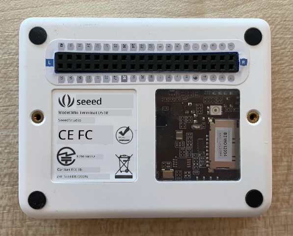
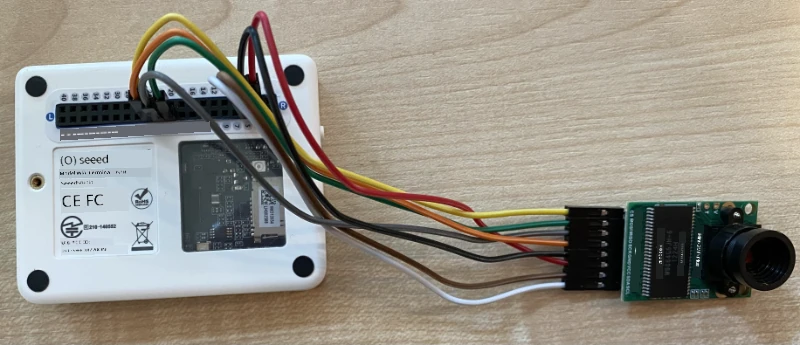

# យករូបភាពមក - Wio Terminal

នៅផ្នែកនេះនៃមេរៀន អ្នកនឹងបន្ថែមកាមេរ៉ាទៅ Wio Terminal របស់អ្នក ហើយយករូបភាពពីវា។

## អេក្រង់ដៃ

Wio Terminal ត្រូវការកាមេរ៉ា។

កាមេរ៉ាដែលអ្នកនឹងប្រើគឺជា [ArduCam Mini 2MP Plus](https://www.arducam.com/product/arducam-2mp-spi-camera-b0067-arduino/)។ នេះគឺជាកាមេរ៉ា 2 ម៉េហ្គាពិកសែល ដែលមានមូលដ្ឋានលើស៊ិនសើរ OV2640។ វាតភ្ជាប់តាមរយៈចំណុច SPI ដើម្បីយករូបភាព ហើយប្រើ I<sup>2</sup>C ដើម្បីកំណត់ស៊ិនសើរ។

## ភ្ជាប់កាមេរ៉ា

ArduCam មិនមានចាក់ Grove ទេ ជំនួសវាភ្ជាប់ទៅដល់ bus SPI និង I<sup>2</sup>C តាមរយៈ pin GPIO លើ Wio Terminal។

### ភារកិច្ច - ភ្ជាប់កាមេរ៉ា

ភ្ជាប់កាមេរ៉ា។


1. Pin នៅផ្នែកមូលដ្ឋាននៃ ArduCam ត្រូវតែភ្ជាប់ទៅ pin GPIO នៅលើ Wio Terminal។ ដើម្បីឲ្យងាយស្រួលក្នុងការស្វែងរក pin ត្រឹមត្រូវ សូមភ្ជាប់ស្ទីកឃ្លឺ pin GPIO ដែលមានជាមួយ Wio Terminal របស់អ្នកនៅជុំវិញ pin:

    

1. ប្រើខ្សែ jumper ដើម្បីធ្វើការភ្ជាប់ដូចខាងក្រោម៖

    | Pin ArduCAM | Pin Wio Terminal | សេចក្ដីពិពណ៌នា                        |
    | ----------- | ---------------- | ---------------------------------- |
    | CS          | 24 (SPI_CS)      | ជ្រើសរើស chip SPI                  |
    | MOSI        | 19 (SPI_MOSI)    | SPI Controller Output, Peripheral Input |
    | MISO        | 21 (SPI_MISO)    | SPI Controller Input, peripheral Output |
    | SCK         | 23 (SPI_SCLK)    | SPI Serial Clock                   |
    | GND         | 6 (GND)          | ផ្ទៃដី - 0 វ៉ុល                   |
    | VCC         | 4 (5V)           | អំពុលចលនាថាមពល 5V               |
    | SDA         | 3 (I2C1_SDA)     | I<sup>2</sup>C Serial Data         |
    | SCL         | 5 (I2C1_SCL)     | I<sup>2</sup>C Serial Clock        |

    

    ការភ្ជាប់ GND និង VCC ផ្តល់ថាមពល 5V ដល់ ArduCam។ វាដំណើរការនៅ 5V ខុសពី Grove sensor ដែលដំណើរការនៅ 3V។ ថាមពលនេះមានផ្ទាល់ពីការភ្ជាប់ USB-C ដែលជាផ្លូវចរន្ដដល់ឧបករណ៍។

    > 💁 សម្រាប់ការភ្ជាប់ SPI ស្លាក pin នៅលើ ArduCam និងឈ្មោះ pin Wio Terminal ដែលប្រើក្នុងកូដនៅតែប្រើរបៀបនាមបុរវត្ថុចាស់។ មេរៀននេះនឹងប្រើរបៀបនាមបុរវត្ថុថ្មី លើកលែងតែក្នុងករណីឈ្មោះ pin ប្រើនៅក្នុងកូដ។

1. ឥឡូវនេះ អ្នកអាចភ្ជាប់ Wio Terminal ទៅកុំព្យូទ័ររបស់អ្នក។

## ប្រាថ្នាអ្នកដើម្បីភ្ជាប់ទៅកាមេរ៉ា

ឥឡូវនេះ Wio Terminal អាចត្រូវបានកម្មវិធីដើម្បីប្រើកាមេរ៉ា ArduCAM ដែលភ្ជាប់។

### ភារកិច្ច - កម្មវិធីឲ្យឧបករណ៍ភ្ជាប់ទៅកាមេរ៉ា

1. បង្កើតគម្រោង Wio Terminal ថ្មីមួយដោយប្រើ PlatformIO។ ហៅគម្រោងនេះថា `fruit-quality-detector`។ បន្ថែមកូដនៅក្នុងមុខងារ `setup` ដើម្បីកំណត់ច្រកប្រព័ន្ធ serial។

1. បន្ថែមកូដដើម្បីភ្ជាប់ទៅ WiFi ជាមួយសារព័ត៌មាន WiFi របស់អ្នកក្នុងឯកសារ `config.h`។ កុំភ្លេចបន្ថែមបណ្ណាល័យដែលទាមទារទៅក្នុងឯកសារ `platformio.ini`។

1. បណ្ណាល័យ ArduCam មិនមានជាបណ្ណាល័យ Arduino ដែលអាចតំឡើងពីឯកសារ `platformio.ini` ទេ។ វាត្រូវបានតំឡើងពីប្រភពកូដ ពីទំព័រសារព័ត៌មាន GitHub របស់ពួកគេ។ អ្នកអាចទទួលបានវាតាមរយៈ៖

    * Clone តាម repo ពី [https://github.com/ArduCAM/Arduino.git](https://github.com/ArduCAM/Arduino.git)
    * ឬទៅ repo នៅ GitHub ដែលមាននៅ [github.com/ArduCAM/Arduino](https://github.com/ArduCAM/Arduino) ហើយទាញយកជាគម្រោង zip ពីប៊ូតុង **Code**

1. អ្នកត្រូវការតែថត `ArduCAM` ពេញលេញពីកូដនេះ។ ចម្លងថតពេញលេញទៅក្នុងថត `lib` ក្នុងគម្រោងរបស់អ្នក។

    > ⚠️ យកថតពេញលេញ មិនត្រឹមតែចម្លងមាតិកានៃថត `ArduCam` ទៅថត `lib` ប៉ុណ្ណោះទេ មែនតែចម្លងថតពេញលេញ។

1. កូដបណ្ណាល័យ ArduCam ប្រើសម្រាប់ប្រភេទកាមេរ៉ាច្រើន។ ប្រភេទកាមេរ៉ាដែលអ្នកចង់ប្រើ ត្រូវបានកំណត់ជាមួយនឹងកំណត់ត្រាកម្មវិធី compiler flags - ដែលបានផ្តល់ឲ្យបណ្ណាល័យឆ្មាក្នុងទំហំតិចបំផុត ដោយយកកូដកាមេរ៉ាដែលមិនបានប្រើចេញ។ ដើម្បីកំណត់បណ្ណាល័យសម្រាប់កាមេរ៉ា OV2640 សូមបន្ថែមបន្ទាត់ខាងក្រោមនៅចុងឯកសារ `platformio.ini`៖

    ```ini
    build_flags =
        -DARDUCAM_SHIELD_V2
        -DOV2640_CAM
    ```

    នេះកំណត់កំណត់ត្រា 2 របស់ compiler៖

      * `ARDUCAM_SHIELD_V2` ដើម្បីប្រាប់បណ្ណាល័យថាកាមេរ៉ានៅលើបន្ទះ Arduino ដែលហៅថា shield។
      * `OV2640_CAM` ដើម្បីប្រាប់បណ្ណាល័យថា រួមបញ្ចូលតែគូដសម្រាប់កាមេរ៉ា OV2640 ប៉ុណ្ណោះ

1. បន្ថែមឯកសារមុខងារ header មួយក្នុងថត `src` ឈ្មោះ `camera.h`។ វានឹងមានកូដសម្រាប់ទំនាក់ទំនងជាមួយកាមេរ៉ា។ បន្ថែមកូដខាងក្រោមទៅឯកសារនេះ៖

    ```cpp
    #pragma once
    
    #include <ArduCAM.h>
    #include <Wire.h>
    
    class Camera
    {
    public:
        Camera(int format, int image_size) : _arducam(OV2640, PIN_SPI_SS)
        {
            _format = format;
            _image_size = image_size;
        }
    
        bool init()
        {
            // កំណត់ឡើងវិញ CPLD
            _arducam.write_reg(0x07, 0x80);
            delay(100);
    
            _arducam.write_reg(0x07, 0x00);
            delay(100);
    
            // ពិនិត្យមើលថា ArduCAM SPI bus មានស្ថានភាពល្អ
            _arducam.write_reg(ARDUCHIP_TEST1, 0x55);
            if (_arducam.read_reg(ARDUCHIP_TEST1) != 0x55)
            {
                return false;
            }
                
            // ផ្លាស់ប្តូរផ្នែកម៉ូដ MCU
            _arducam.set_mode(MCU2LCD_MODE);
    
            uint8_t vid, pid;
    
            // ពិនិត្យមើលប្រភេទម៉ូឌុលកាមេរ៉ា OV2640 ឬអត់
            _arducam.wrSensorReg8_8(0xff, 0x01);
            _arducam.rdSensorReg8_8(OV2640_CHIPID_HIGH, &vid);
            _arducam.rdSensorReg8_8(OV2640_CHIPID_LOW, &pid);
            if ((vid != 0x26) && ((pid != 0x41) || (pid != 0x42)))
            {
                return false;
            }
            
            _arducam.set_format(_format);
            _arducam.InitCAM();
            _arducam.OV2640_set_JPEG_size(_image_size);
            _arducam.OV2640_set_Light_Mode(Auto);
            _arducam.OV2640_set_Special_effects(Normal);
            delay(1000);
    
            return true;
        }
    
        void startCapture()
        {
            _arducam.flush_fifo();
            _arducam.clear_fifo_flag();
            _arducam.start_capture();
        }
    
        bool captureReady()
        {
            return _arducam.get_bit(ARDUCHIP_TRIG, CAP_DONE_MASK);
        }
    
        bool readImageToBuffer(byte **buffer, uint32_t &buffer_length)
        {
            if (!captureReady()) return false;
    
            // ទទួលបានប្រវែងឯកសាររូបភាព
            uint32_t length = _arducam.read_fifo_length();
            buffer_length = length;
    
            if (length >= MAX_FIFO_SIZE)
            {
                return false;
            }
            if (length == 0)
            {
                return false;
            }
    
            // បង្កើតប៊ឺហ្វเฟរ
            byte *buf = new byte[length];
    
            uint8_t temp = 0, temp_last = 0;
            int i = 0;
            uint32_t buffer_pos = 0;
            bool is_header = false;
    
            _arducam.CS_LOW();
            _arducam.set_fifo_burst();
            
            while (length--)
            {
                temp_last = temp;
                temp = SPI.transfer(0x00);
                //អានទិន្នន័យ JPEG ពី FIFO
                if ((temp == 0xD9) && (temp_last == 0xFF)) //ប្រសិនបើរកឃើញចុងបញ្ចប់ បញ្ឈប់ while,
                {
                    buf[buffer_pos] = temp;
    
                    buffer_pos++;
                    i++;
                    
                    _arducam.CS_HIGH();
                }
                if (is_header == true)
                {
                    //សរសេរទិន្នន័យរូបភាពទៅប៊ឺហ្វเฟរបើមិនពេញ
                    if (i < 256)
                    {
                        buf[buffer_pos] = temp;
                        buffer_pos++;
                        i++;
                    }
                    else
                    {
                        _arducam.CS_HIGH();
    
                        i = 0;
                        buf[buffer_pos] = temp;
    
                        buffer_pos++;
                        i++;
    
                        _arducam.CS_LOW();
                        _arducam.set_fifo_burst();
                    }
                }
                else if ((temp == 0xD8) & (temp_last == 0xFF))
                {
                    is_header = true;
    
                    buf[buffer_pos] = temp_last;
                    buffer_pos++;
                    i++;
    
                    buf[buffer_pos] = temp;
                    buffer_pos++;
                    i++;
                }
            }
            
            _arducam.clear_fifo_flag();
    
            _arducam.set_format(_format);
            _arducam.InitCAM();
            _arducam.OV2640_set_JPEG_size(_image_size);
    
            // ត្រឡប់ប៊ឺហ្វเฟរ
            *buffer = buf;
        }
    
    private:
        ArduCAM _arducam;
        int _format;
        int _image_size;
    };
    ```

    នេះជាកូដជាន់ទាបដែលកំណត់កាមេរ៉ាតាមរយៈបណ្ណាល័យ ArduCam ហើយយករូបភាពនៅពេលចាំបាច់តាមរយៈ bus SPI។ កូដនេះពិសេសសម្រាប់ ArduCam ដូច្នេះអ្នកមិនចាំបាច់ខ្លាចអំពីរបៀបដំណើរការនៅវដ្តនេះទេ។

1. នៅក្នុង `main.cpp` បន្ថែមកូដខាងក្រោមក្រោមបន្ធូរវិញ្ញាបនប័ត្រផ្សេងទៀត ដើម្បីបញ្ចូលឯកសារថ្មីនេះ និងបង្កើតវត្ថុ camera:

    ```cpp
    #include "camera.h"

    Camera camera = Camera(JPEG, OV2640_640x480);
    ```

    នេះបង្កើត `Camera` ដែលរក្សារូបភាពជាទ្រង់ទ្រាយ JPEG នៅកំណត់ទំហំ 640 ដោយ 480។ ទោះបីជាកំណត់ទំហំខ្ពស់ជាងនេះបានគាំទ្រ (រហូតដល់ 3280x2464) ក៏ដោយ កម្មវិធីចាត់ថ្នាក់រូបភាពបដិសេធបំពេញលើរូបភាពតូចជាងនេះ (227x227) ដូច្នេះគ្មានការចាំបាច់យក និងផ្ញើរូបភាពធំនោះទេ។

1. បន្ថែមកូដខាងក្រោមនេះដើម្បីកំណត់មុខងាររៀបចំកាមេរ៉ា៖

    ```cpp
    void setupCamera()
    {
        pinMode(PIN_SPI_SS, OUTPUT);
        digitalWrite(PIN_SPI_SS, HIGH);
    
        Wire.begin();
        SPI.begin();
    
        if (!camera.init())
        {
            Serial.println("Error setting up the camera!");
        }
    }
    ```

    មុខងារ `setupCamera` នេះចាប់ផ្តើមដោយកំណត់ pin ជ្រើសរើស chip SPI (`PIN_SPI_SS`) ឲ្យមានស្ថានភាពខ្ពស់ (high) ធ្វើឲ្យ Wio Terminal ជាការគ្រប់គ្រង SPI។ បន្ទាប់មកវាចាប់ផ្តើម bus I<sup>2</sup>C និង SPI។ ចុងក្រោយ វាចាប់ផ្តើមវត្ថុកាមេរ៉ា ដែលកំណត់ការកំណត់ស៊ិនសើរកាមេរ៉ា និងធានាថា ខ្សែបន្ទាត់ទាំងអស់ភ្ជាប់ត្រឹមត្រូវ។

1. ហៅមុខងារនេះនៅចុងបញ្ចូលមុខងារ `setup`៖

    ```cpp
    setupCamera();
    ```

1. សង់ និងផ្ញើកូដនេះ ហើយពិនិត្យលទ្ធផលពីម៉ូនីទ័រ serial។ ប្រសិនបើអ្នកឃើញ `Error setting up the camera!` សូមពិនិត្យការតភ្ជាប់ខ្សែបន្ទាត់ឲ្យប្រាកដថាគ្រប់ខ្សែភ្ជាប់ pin អោយត្រូវ និងទាំង jumper wires នៅត្រឹមត្រូវ។

## យករូបភាពមក

ឥឡូវនេះ Wio Terminal អាចត្រូវបានកម្មវិធីឲ្យយករូបភាពនៅពេលហៅប៊ូតុង។

### ភារកិច្ច - យករូបភាពមក

1. Microcontrollers ដំណើរការកូដរបស់អ្នកជាប្រចាំ ដូច្នេះវាមិនងាយក្នុងការបញ្ចាំងអ្វីមួយដូចជាការទាញយករូបភាពដោយគ្មានការឆ្លើយតបពីស៊ិនសើរ។ Wio Terminal មានប៊ូតុង ដូច្នេះកាមេរ៉ាអាចកំណត់ឲ្យបញ្ចាំងដោយប៊ូតុងមួយ។ បន្ថែមកូដខាងក្រោមនៅចុងមុខងារ `setup` ដើម្បីកំណត់ប៊ូតុង C (មួយក្នុងចំណោមប៊ូតុងបីនៅខាងលើ ដែលជាច្បាប់ជិតប៊ូតុង power)។

    

    ```cpp
    pinMode(WIO_KEY_C, INPUT_PULLUP);
    ```

    របៀបដំណើរការ `INPUT_PULLUP` គឺបញ្ចេញសញ្ញាផ្ទេរប្រែបញ្ចូល។ ឧទាហរណ៏, ប៊ូតុងធម្មតាធ្វើផ្ញើសញ្ញាទាបនៅពេលមិនចុច និងសញ្ញាខ្ពស់នៅពេលចុច។ នៅពេលកំណត់ជា `INPUT_PULLUP` វាផ្ញើសញ្ញាខ្ពស់នៅពេលមិនចុច និងសញ្ញាទាបនៅពេលចុច។

1. បន្ថែមមុខងារត្រលប់ទទេមុខមួយ ដើម្បីឆ្លើយតបទៅនឹងការចុចប៊ូតុង មុនមុខងារ `loop`:

    ```cpp
    void buttonPressed()
    {
        
    }
    ```

1. ហៅមុខងារនេះនៅក្នុងមុខងារ `loop` នៅពេលប៊ូតុងត្រូវបានចុច:

    ```cpp
    void loop()
    {
        if (digitalRead(WIO_KEY_C) == LOW)
        {
            buttonPressed();
            delay(2000);
        }
    
        delay(200);
    }
    ```

    កូដនេះពិនិត្យថាតើប៊ូតុងត្រូវបានចុចឬទេ។ ប្រសិនបើចុច មុខងារ `buttonPressed` ត្រូវបានហៅ ហើយ `loop` រង់ចាំ 2 វិនាទី។ យោងតាមនេះដើម្បីឲ្យមានពេលវេលាសម្រាប់ដោះប៊ូតុង ដូច្នេះការចុចយូរ មិនត្រូវបានកត់ត្រាពីរដង។

    > 💁 ប៊ូតុងនៅលើ Wio Terminal បានកំណត់ជាការបញ្ចូល `INPUT_PULLUP` ដូច្នេះវាផ្ញើសញ្ញាខ្ពស់នៅពេលមិនចុច និងសញ្ញាទាបនៅពេលចុច។

1. បន្ថែមកូដដូចខាងក្រោមទៅក្នុងមុខងារ `buttonPressed`៖

    ```cpp
    camera.startCapture();
 
    while (!camera.captureReady())
        delay(100);

    Serial.println("Image captured");

    byte *buffer;
    uint32_t length;

    if (camera.readImageToBuffer(&buffer, length))
    {
        Serial.print("Image read to buffer with length ");
        Serial.println(length);

        delete(buffer);
    }
    ```

    កូដនេះចាប់ផ្តើមការទាញយករូបភាពដោយហៅ `startCapture`។ ឧបករណ៍កាមេរ៉ា មិនលាបប្រតិបត្តិតាមការផ្លាស់ប្តូរទិន្នន័យភ្លាមៗនៅពេលអ្នកទាញយកទេ។ អ្នកផ្ញើសេចក្ដីដឹកនាំឲ្យចាប់ផ្តើមចាប់យករូបភាព ហើយកាមេរ៉ានឹងដំណើរការផ្ទាល់ខ្លួន ដើម្បីចាប់យករូបភាព បម្លែងទៅជាទ្រង់ទ្រាយ JPEG ហើយរក្សាទុកក្នុងកញ្ចប់មតិមួយនៅលើកាមេរ៉ាឯង។ ការ​ដឹង​ថា`captureReady` ពិនិត្យមើលថាតើការចាប់យករូបភាពរួចរាល់រួចហើយ។

    បន្ទាប់មកពេលការចាប់យករួចរាល់ ទិន្នន័យរូបភាពត្រូវបានចម្លងពីកញ្ចប់នៅលើកាមេរ៉ាមកកាន់កញ្ចប់ក្នុងតំបន់ម៉ាស៊ីន (អារេណៃបៃ) ដោយហៅ `readImageToBuffer`។ វាលវែងនៃកញ្ចប់បន្ទាប់មកត្រូវបានផ្ញើទៅម៉ូនីទ័រ serial។

1. សង់ ហើយផ្ញើកូដនេះ ហើយបើកម៉ូនីទ័រ serial មើលលទ្ធផល។ រាល់ពេលអ្នកចុចប៊ូតុង C រូបភាពនឹងត្រូវបានយក ហើយអ្នកនឹងឃើញទំហំរូបភាពបញ្ជូនទៅម៉ូនីទ័រជាថ្ងៃ។

    ```output
    Connecting to WiFi..
    Connected!
    Image captured
    Image read to buffer with length 9224
    Image captured
    Image read to buffer with length 11272
    ```

    រូបភាពផ្សេងគ្នានឹងមានទំហំខុសគ្នា។ ពួកវាត្រូវបានបង្កកខ្នាតជាទ្រង់ទ្រាយ JPEG ហើយទំហំឯកសារ JPEG សម្រាប់កំណត់ទំហំណាមួយ អាស្រ័យទៅលើមាតិកានៅក្នុងរូបភាព។

> 💁 អ្នកអាចរកកូដនេះនៅក្នុងថត [code-camera/wio-terminal](../../../../../4-manufacturing/lessons/2-check-fruit-from-device/code-camera/wio-terminal)។

😀 អ្នកបានប្រើ Wio Terminal ដើម្បីចាប់យករូបភាពបានជោគជ័យ។

## ជម្រើស - សម្គាល់រូបភាពកាមេរ៉ាបានដោយប្រើកាត SD

វិធីងាយស្រួលបំផុតក្នុងការមើលរូបភាពដែលបានចាប់យកដោយកាមេរ៉ា គឺការសរសេរពួកវាទៅកាត SD នៅក្នុង Wio Terminal ហើយបន្ទាប់មកមើលវាលើកុំព្យូទ័ររបស់អ្នក។ ធ្វើជំហាននេះបើអ្នកមានកាត microSD ច្រើនបន្ថែម មួយ និងកន្លែងដាក់កាត microSD ក្នុងកុំព្យូទ័ររបស់អ្នក ឬអាចប្រើឧបករណ៍ផ្លាស់ប្ដូរ។

Wio Terminal គាំទ្រតែ microSD card ដល់ទំហំ 16GB mà thôi។ ប្រសិនបើអ្នកមានកាតកាន់តែធំជាង វានឹងមិនដំណើរការ។

### ភារកិច្ច - សម្គាល់រូបភាពកាមេរ៉ាបានដោយប្រើកាត SD

1. បម្លែងកាត microSD ជាទ្រង់ទ្រាយ FAT32 ឬ exFAT ដោយប្រើកម្មវិធីប្រើប្រាស់នៅលើកុំព្យូទ័ររបស់អ្នក (Disk Utility លើ macOS, File Explorer លើ Windows, ឬប្រើ command line ក្នុង Linux)

1. ដាក់កាត microSD ទៅក្នុងច្រកនៅក្រោមប៊ូតុងបិទបើក។ ដើម្បីប្រាកដថា វាអាចដាក់ចូលជាគង់ទីរួចនិងចាក់ភ្លាម ប្រញាប់បើកដោយប៉ះប្រើក្រចิกឬឧបករណ៍ស្គ្រីន។

1. បន្ថែមបន្ទាត់ include ខាងក្រោមនៅចុង `main.cpp`៖

    ```cpp
    #include "SD/Seeed_SD.h"
    #include <Seeed_FS.h>
    ```

1. បន្ថែមមុខងារខាងក្រោមមុនមុខងារ `setup`៖

    ```cpp
    void setupSDCard()
    {
        while (!SD.begin(SDCARD_SS_PIN, SDCARD_SPI))
        {
            Serial.println("SD Card Error");
        }
    }
    ```

    នេះកំណត់កាត SD ដោយប្រើ bus SPI។

1. ហៅមុខងារនេះពីមុខងារ `setup`៖

    ```cpp
    setupSDCard();
    ```

1. បន្ថែមកូដខាងក្រោមពីលើមុខងារ `buttonPressed`៖

    ```cpp
    int fileNum = 1;

    void saveToSDCard(byte *buffer, uint32_t length)
    {
        char buff[16];
        sprintf(buff, "%d.jpg", fileNum);
        fileNum++;
    
        File outFile = SD.open(buff, FILE_WRITE );
        outFile.write(buffer, length);
        outFile.close();

        Serial.print("Image written to file ");
        Serial.println(buff);
    }
    ```

    នេះកំណត់អថេរកម្រិតពិភពលោកសម្រាប់គណនាហៅឯកសារ។ វាត្រូវបានប្រើសម្រាប់ឈ្មោះឯកសាររូបភាព ដូច្នេះរូបភាពជាច្រើនអាចត្រូវបានយកជាមួយឈ្មោះឯកសារកើនដំណាក់កាល - `1.jpg`, `2.jpg` និងផ្សេងៗទៀត។

    បន្ទាប់មកវាកំណត់មុខងារ `saveToSDCard` ដែលទទួលប៊ុ(left)ហ្វែរកុំភញ,​ The data length (length of the buffer). ឈ្មោះឯកសារមួយត្រូវបានបង្កើតដោយដើមគមន្នស្សហៅឯកសារ ហើយគណនាហៅឯកសារត្រូវបានកើនឡើងសម្រាប់ឯកសារបន្ទាប់។ ទិន្នន័យទ្រង់ទ្រាយពីប៊ុ(left)ហ្វែរ ត្រូវបានសរសេរទៅឯកសារ។

1. ហៅមុខងារ `saveToSDCard` នៅក្នុងមុខងារ `buttonPressed`។ ការហៅត្រូវតែធ្វើ **មុន** ការលុបប៊ុ(left)ហ្វែរ:

    ```cpp
    Serial.print("Image read to buffer with length ");
    Serial.println(length);

    saveToSDCard(buffer, length);
    
    delete(buffer);
    ```

1. សង់ និងផ្ញើកូដនេះ ហើយពិនិត្យលទ្ធផលនៅម៉ូនីទ័រ serial។ រាល់ពេលអ្នកចុចប៊ូតុង C រូបភាពនឹងត្រូវបានយក ហើយរក្សាទុកទៅកាត SD។

    ```output
    Connecting to WiFi..
    Connected!
    Image captured
    Image read to buffer with length 16392
    Image written to file 1.jpg
    Image captured
    Image read to buffer with length 14344
    Image written to file 2.jpg
    ```

1. បិទកាត microSD ហើយដកវាដោយផ្ញើវាចេញមួយចំនួនហើយបញ្ឈប់វា ដូច្នេះវានឹងផុតចេញ។ អ្នកប្រហែលជាត្រូវប្រើឧបករណ៍សី្វវង្វង់តូចដើម្បីធ្វើការនេះ។ ដាក់កាត microSD នៅក្នុងកុំព្យូទ័ររបស់អ្នក ដើម្បីមើលរូបភាព។

    

    > 💁 វាចំណាយរយៈពេលសម្រាប់បង្កើតតុល្យភាពពណ៌សនៃកាមេរ៉ា។ អ្នកនឹងមើលឃើញលើការប្រែប្រួលពណ៌នៃរូបភាពដែលបានចាប់យក។ រូបភាពដែលចាប់យកដំបូងៗអាចមានពណ៌ខុសពីធម្មតា។ អ្នកអាចគ្រប់គ្រងនេះដោយបម្លែងកូដឲ្យចាប់យករូបភាពមួយចំនួន ហើយមិនគិតក្នុងមុខងារ `setup`។

---

<!-- CO-OP TRANSLATOR DISCLAIMER START -->
**ការបដិសេធ**៖
ឯកសារនេះត្រូវបានបកប្រែដោយប្រើសេវាកម្មបកប្រែ AI [Co-op Translator](https://github.com/Azure/co-op-translator)។ ខណៈពេលយើងខិតខំប្រឹងប្រែងឲ្យបានត្រឹមត្រូវ សូមយល់ថាការបកប្រែដោយស្វយ័តអាចមានកំហុស ឬមិនពេញលេញ។ ឯកសារដើមក្នុងភាសាទូទៅគួរត្រូវបានពិចារណាជា ប្រភពចម្បង។ សម្រាប់ព័ត៌មានសំខាន់ៗ សូមផ្ដល់អតិថិជនការបកប្រែដោយអ្នកជំនាញមនុស្ស។ យើងមិនទទួលខុសត្រូវចំពោះការយល់ច្រឡំ ឬការពន្យល់ខុសខាតណាមួយដែលកើតមានពីការប្រើប្រាស់ការបកប្រែនេះឡើយ។
<!-- CO-OP TRANSLATOR DISCLAIMER END -->