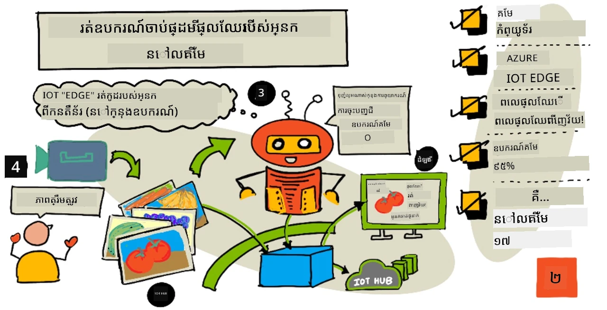
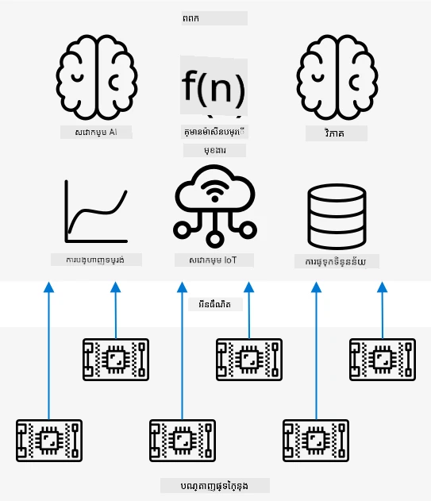
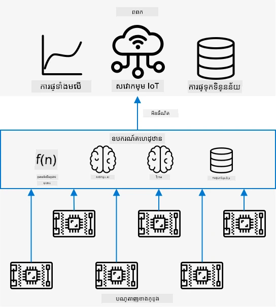
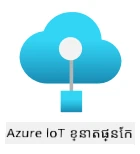
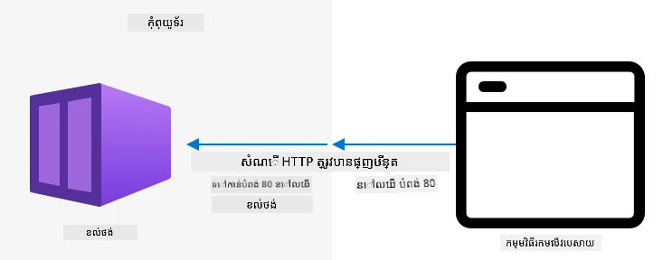
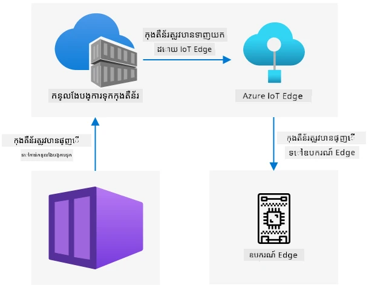

# ដំណើរការឧបករណ៍ស្កេនផ្លែឈើរបស់អ្នកនៅលើចុង



> រូបសេចក្ដីសង្ខេបដោយ [Nitya Narasimhan](https://github.com/nitya)។ ចុចលើរូបភាពសម្រាប់ទំហំធំជាងនេះ។

វីដេអូនេះផ្តល់ការពិពណ៌នាចំនុចទូទៅអំពីការប្រតិបត្តិរូបមន្តចាត់ថ្នាក់រូបភាពនៅលើឧបករណ៍ IoT ដែលជាប្រធានបទដែលត្រូវបានគ្របដណ្តប់ក្នុងមេរៀននេះ។

[](https://www.youtube.com/watch?v=_K5fqGLO8us)

## វិញ្ញាសាមុនមេរៀន

[វិញ្ញាសាមុនមេរៀន](https://black-meadow-040d15503.1.azurestaticapps.net/quiz/33)

## ការណែនាំ

នៅក្នុងមេរៀនចុងក្រោយ អ្នកបានប្រើប្រាស់កម្មវិធីចាត់ថ្នាក់រូបភាពរបស់អ្នកដើម្បីចាត់ថ្នាក់ផលឈើពេញរាងនិងមិនពេញរាង ដោយផ្ញើរូបភាពដែលបានថតពីកាមេរ៉ានៅលើឧបករណ៍ IoT របស់អ្នកតាមអ៊ីនធឺណិតទៅសេវាកម្មមេឃ។ ការហៅទំនាក់ទំនងទាំងនេះចំណាយពេលថ្លៃប្រាក់ ហើយអាស្រ័យលើប្រភេទទិន្នន័យរូបភាពដែលអ្នកកំពុងប្រើ អាចមានបញ្ហាផ្នែកឯកជនភាពផងដែរ។

ក្នុងមេរៀននេះ អ្នកនឹងរៀនអំពីរបៀបដំណើរការម៉ូដែលសិក្សាម៉ាស៊ីន (ML) លើចុង - លើឧបករណ៍ IoT ដែលដំណើរការនៅលើបណ្តាញផ្ទៃក្នុងរបស់អ្នកជំនួសការប្រើប្រាស់ក្នុងមេឃ។ អ្នកនឹងរៀនអំពីអត្ថប្រយោជន៍និងគុណខុសត្រូវនៃការគណនា Edge ប្រៀបធៀបតាមការគណនាមេឃ របៀបប្រើប្រាស់ម៉ូដែល AI របស់អ្នកទៅចុង និងរបៀបចូលប្រើពីឧបករណ៍ IoT របស់អ្នក។

ក្នុងមេរៀននេះ យើងនឹងគ្របដណ្តប់៖

* [ការគណនាប្រព័ន្ធ Edge](#ការគណនាប្រព័ន្ធ-edge)
* [Azure IoT Edge](#azure-iot-edge)
* [ចុះបញ្ជីឧបករណ៍ IoT Edge](#ចុះបញ្ជីឧបករណ៍-iot-edge)
* [ដំឡើងឧបករណ៍ IoT Edge](#ដំឡើងឧបករណ៍-iot-edge)
* [នាំចេញម៉ូដែលរបស់អ្នក](#នាំចេញម៉ូដែលរបស់អ្នក)
* [រៀបចំប្រុងសម្រាប់ការផ្ទេរ](#រៀបចំ​កុងខ៊ិន័ររបស់​អ្នក​សម្រាប់​ការ​ដាក់ចេញ)
* [ផ្ទេរប្រុងរបស់អ្នក](#ដាក់ចេញ-container-របស់​អ្នក)
* [ប្រើប្រាស់ឧបករណ៍ IoT Edge របស់អ្នក](#ប្រើ​ប្រាស់​ឧបករណ៍-iot-edge-របស់​អ្នក)

## ការគណនាប្រព័ន្ធ Edge

ការគណនាប្រព័ន្ធ Edge មានន័យថាមានកុំព្យូទ័រ ដែលកំពុងដំណើរការទិន្នន័យ IoT នៅជិតទីកន្លែងដែលទិន្នន័យត្រូវបានបង្កើត។ ជំនួសពីការដំណើរការនេះនៅក្នុងមេឃ វាត្រូវបានផ្លាស់ទីទៅចុងនៃមេឃ - បណ្តាញផ្ទៃក្នុងរបស់អ្នក។



ក្នុងមេរៀនមុន អ្នកមានឧបករណ៍ប្រមូលទិន្នន័យ និងផ្ញើទិន្នន័យទៅមេឃសម្រាប់វិភាគ ដំណើរការឧច្ចរណ៍មិនមានម៉ាស៊ីនមេ ឬម៉ូដែល AI ក្នុងមេឃ។



ការគណនាប្រព័ន្ធ Edge មានន័យថាបម្លែងសេវាកម្មមេឃខ្លះចេញពីមេឃទៅកុំព្យូទ័រដំណើរការនៅលើបណ្តាញដដែលជាមួយឧបករណ៍ IoT ហើយសម្របសម្រួលជាមួយមេឃតាមការត្រូវការ។ ឧទាហរណ៍ អ្នកអាចដំណើរការម៉ូដែល AI លើឧបករណ៍ Edge ដើម្បីវិភាគផ្លែឈើសម្រាប់សភាពពេញរាង ហើយផ្ញើតែវិភាគត្រឡប់ទៅមេឃ ដូចជាចំនួនផ្លែឈើពេញរាង ប្រៀបធៀបនឹងមិនពេញរាង។

✅ សូមគិតអំពីកម្មវិធី IoT ដែលអ្នកបានបង្កើតរហូតមកហើយ។ តើផ្នែកណានៃកម្មវិធីទាំងនោះអាចផ្លាស់ទៅកាន់ការគណនាចុង?

### អត្ថប្រយោជន៍

អត្ថប្រយោជន៍នៃការគណនាប្រព័ន្ធ Edge គឺ៖

1. **ល្បឿន** - ការគណនាប្រព័ន្ធ Edge មានតំរូវសម្រាប់ទិន្នន័យដែលត្រូវការពេលវេលាច្បាស់លាស់ ព្រោះសកម្មភាពត្រូវបានធ្វើនៅលើបណ្តាញដដែលជាមួយឧបករណ៍ ជំនួសការហៅទៅឆ្ងាយតាមអ៊ីនធឺណិត។ នេះអនុញ្ញាតឱ្យមានល្បឿនខ្ពស់ជាងសម្រាប់បណ្តាញក្នុងស្រុកដែលអាចដំណើរការល្បឿនបន្តិចល្អជាងការតភ្ជាប់អ៊ីនធឺណិត ដោយទិន្នន័យធ្វើដំណើរដោយចម្ងាយខ្លីជាង។

    > 💁 ទោះបីខ្សែអុបធីកលបានប្រើសម្រាប់ការតភ្ជាប់អ៊ីនធឺណិតដែលអនុញ្ញាតឱ្យដំណើរការទិន្នន័យបានល្បឿនភ្លឺក៏ដោយ ទិន្នន័យអាចចំណាយពេលធ្វើដំណើរតាមពិភពលោកទៅកាន់អ្នកផ្តល់សេវាមេឃ។ ឧទាហរណ៍ បើអ្នកផ្ញើទិន្នន័យពីអឺរ៉ុបទៅសេវាកម្មមេឃនៅសហរដ្ឋអាមេរិច នឹងចំណាយយ៉ាងហោចណាស់ ២៨ មិល្លីវិនាទី សម្រាប់ទិន្នន័យឆ្លងកាត់អាត្លង់ទីចតាមខ្សែអុបធីក បើមិនរាប់បញ្ចូលពេលដែលទិន្នន័យចេញពីខ្សែភ្លើងទៅសញ្ញា​ភ្លឺ និងបញ្ចប់មកវិញទៅកាន់អ្នកផ្តល់សេវាមេឃនោះទេ។

    ការគណនាប្រព័ន្ធ Edge តាមទ្រព្យសម្បត្តិបន្ថែមរបស់វា អាចកាត់បន្ថយចរាចរណ៍បណ្ដាញ ចុះសម្រាប់ការបន្ថយហានិភ័យនៃការធ្វើឱ្យទិន្នន័យរបស់អ្នកយឺតចូលដោយសារការរុំជាប់នៅលើបណ្តាញមានចំនួនកំណត់។

1. **ការចូលដល់ពីចម្ងាយ** - ការគណនាប្រព័ន្ធ Edge ធ្វើការបាននៅពេលដែលអ្នកមានការតភ្ជាប់ទាប ឬគ្មានការតភ្ជាប់ ឬការតភ្ជាប់មានតំលៃខ្ពស់ដែលមិនអាចប្រើបានជាប់ជាងរបស់ជាប់គ្នា។ ឧទាហរណ៍ កាលពីនៅតំបន់គ្រោះមហន្តរាយមនុស្សជាតិ ដែលហ្វ្រាស្ត្រូកាបន្តិច ឬនៅក្នុងប្រទេសកំពុងអភិវឌ្ឍ។

1. **ថ្លៃទាប** - ការប្រមូលទិន្នន័យ ការផ្ទុក ទិន្នន័យវិភាគ និងការបញ្ជាលើឧបករណ៍ Edge កាត់បន្ថយការប្រើប្រាស់សេវាកម្មមេឃដែលអាចកាត់បន្ថយថ្លៃសរុបនៃកម្មវិធី IoT របស់អ្នក។ ក៏មានជំរុញថ្មីៗចំពោះឧបករណ៍ដែលគេបង្កើតសម្រាប់ការគណនាប្រព័ន្ធ Edge ដូចជាបូរដ៏ជំនួយ AI ដូចជា [Jetson Nano ពី NVIDIA](https://developer.nvidia.com/embedded/jetson-nano-developer-kit) ដែលអាចដំណើរការការងារធ្ងន់ AI ដោយប្រើជំនួយ GPU លើឧបករណ៍ដែលថ្លៃតិចជាង ១០០ ដុល្លារអាមេរិក។

1. **ឯកជនភាព និងសុវត្ថិភាព** - ជាមួយការគណនាប្រព័ន្ធ Edge ទិន្នន័យនៅក្នុងបណ្តាញរបស់អ្នកហើយមិនត្រូវបានផ្ទុកឡើងមេឃ។ នេះជាជម្រើសដែលបានចូលចិត្តសម្រាប់ទិន្នន័យមានអារម្មណ៍ ដែលអាចសម្គាល់ផ្ទាល់ខ្លួនជាពិសេស ព្រោះទិន្នន័យមិនចាំបាច់ត្រូវផ្ទុកបន្ទាប់ពីបានវិភាគរួច ដែលកាត់បន្ថយហានិភ័យក្នុងការរអិលទិន្នន័យយ៉ាងច្រើន។ ឧទាហរណ៍ រួមមានទិន្នន័យផ្នែកវេជ្ជសាស្រ្ត និងវីដេអូពីកាមេរ៉ាសុវត្ថិភាព។

1. **ការ​ដោះ​ស្រាយ​ឧបករណ៍​មិន​មាន​សន្តិសុខ** - ប្រសិនបើអ្នកមានឧបករណ៍ដែលមានកំហុសសន្តិសុខដែលគ្មានការចង់ផ្ទាល់ទៅបណ្ដាញឬអ៊ីនធឺណិត អ្នកអាចភ្ជាប់វាទៅបណ្តាញផ្សេងមួយទៅកាន់ឧបករណ៍ IoT Edge មួយជាច្រកចេញចូល។ ឧបករណ៍ Edge នោះអាចភ្ជាប់ទៅបណ្ដាញធំទូលាយរបស់អ្នក ឬអ៊ីនធឺណិត ហើយគ្រប់គ្រងចរន្តទិន្នន័យចេញចូល។

1. **គាំទ្រឧបករណ៍មិនប្រក្រតី** - ប្រសិនបើអ្នកមានឧបករណ៍មិនអាចភ្ជាប់ទៅ IoT Hub វិញ ដូចជា ឧបករណ៍ដែលអាចភ្ជាប់បានតែ HTTP ឬដែលមានតែ Bluetooth សម្រាប់ភ្ជាប់ អ្នកអាចប្រើឧបករណ៍ IoT Edge ជាជអ្នកច្រកចេញចូល បញ្ជូនសារ ទៅ IoT Hub។

✅ សូមស្រាវជ្រាវ៖ តើមានអត្ថប្រយោជន៍ផ្សេងទៀតអ្វីខ្លះសម្រាប់ការគណនាប្រព័ន្ធ Edge?

### គុណវិបត្តិ

មានគុណវិបត្តិសម្រាប់ការគណនាប្រព័ន្ធ Edge ដែលមេឃអាចជាជម្រើសល្អមួយ៖

1. **ទំហំ និងភាពបត់បែន** - ការគណនាមេឃអាចកែប្រែតាមបណ្តាញ និងតម្រូវការទិន្នន័យក្នុងពេលពិតដោយបន្ថែម ឬកាត់បន្ថយម៉ាស៊ីនមេ និងធនធានផ្សេងៗ។ ការបន្ថែមកុំព្យូទ័រ Edge ត្រូវការបន្ថែមឧបករណ៍ដោយដៃ។

1. **ភាពជឿជាក់ និងភាពធន់នឹងបញ្ហា** - ការគណនាមេឃផ្តល់ម៉ាស៊ីនមេជាច្រើន នៅកន្លែងជាច្រើន សម្រាប់ការបញ្ចេញខុសត្រូវ និងការប្រយុទ្ធនឹងគ្រោះមហន្តរាយ។ មានកំលាំង និងការតំឡើងច្រើនមែនទែននៅលើ Edge ដើម្បីមានលំដាប់ខ្ពស់ដូចគ្នា។

1. **ការថែទាំ** - អ្នកផ្តល់សេវាកម្មមេឃចូលរួមថែទាំប្រព័ន្ធ និងធ្វើការធ្វើបច្ចុប្បន្នភាព។

✅ សូមស្រាវជ្រាវ៖ តើមានគុណវិបត្តិផ្សេងទៀតអ្វីខ្លះសម្រាប់ការគណនាប្រព័ន្ធ Edge?

គុណវិបត្តិគឺជាវិលឆ្ពោះទៅសាកលវិបត្តិរបស់ការប្រើប្រាស់មេឃ - អ្នកត្រូវតែបង្កើត និងគ្រប់គ្រងឧបករណ៍ទាំងនេះដោយខ្លួនឯង ជំនួសការទុកចិត្តលើជំនាញ និងផ្នែកទំហំនៃអ្នកផ្តល់សេវាមេឃ។

ហានិភ័យខ្លះៗត្រូវបានកាត់បន្ថយដោយធម្មជាតិរបស់ការគណនាប្រព័ន្ធ Edge។ ឧទាហរណ៍ ប្រសិនបើអ្នកមានឧបករណ៍ Edge រត់នៅក្នុងរោងចក្រ ប្រមូលទិន្នន័យពីម៉ាស៊ីន ដូច្នេះ អ្នកមិនចាំបាច់គិតពីសង្គ្រាមគ្រោះមហន្តរាយណាមួយទេ។ ប្រសិនបើថាមពលនៅរោងចក្របាត់ បន្ទាប់មកអ្នកមិនចាំបាច់មានឧបករណ៍ Edge ជំនួសទេ ពីព្រោះម៉ាស៊ីនដែលបង្កើតទិន្នន័យដែលទិន្នន័យ Edge ដំណើរការនោះក៏អត់ថាមពលដែរ។

សម្រាប់ប្រព័ន្ធ IoT អ្នកគឺចង់មានការលាយឡំរវាងការគណនាមេឃ និង Edge ដោយប្រើប្រាស់សេវាកម្មនិមួយៗទៅតាមតម្រូវការរបស់ប្រព័ន្ធ អតិថិជន និងអ្នកថែរក្សារបស់វា។

## Azure IoT Edge



Azure IoT Edge គឺជាសេវាកម្មមួយដែលអាចជួយអ្នកផ្លាស់ប្ដូរតំណ સમયમાંពីមេឃទៅការគណនាចុង។ អ្នកដំឡើងឧបករណ៍មួយជាឧបករណ៍ Edge ហើយពីមេឃ អ្នកអាចផ្ទេរកូដទៅឧបករណ៍ Edge នោះបាន។ នេះអនុញ្ញាតឱ្យអ្នកបញ្ចូលសមត្ថភាពរបស់មេឃ និង Edge រួមគ្នា។

> 🎓 *Workloads* គឺជាពាក្យសម្រាប់សេវាកម្មណាមួយដែលធ្វើការងារជាក់លាក់ ដូចជា ម៉ូដែល AI កម្មវិធី ឬមុខងារដំណើរការមិនមានម៉ាស៊ីនមេ។

ឧទាហរណ៍ អ្នកអាចបណ្តុះបណ្តាលកម្មវិធីចាត់ថ្នាក់រូបភាពក្នុងមេឃ ហើយពីមេឃ ផ្ទេរវាទៅឧបករណ៍ Edge។ ឧបករណ៍ IoT របស់អ្នកបន្ទាប់មកផ្ញើរូបភាពទៅឧបករណ៍ Edge សម្រាប់ចាត់ថ្នាក់ ជំនួសការផ្ញើរូបភាពចេញអ៊ីនធឺណិត។ ប្រសិនបើអ្នកត្រូវការផ្ទេរម៉ូដែលកំណែថ្មី អ្នកអាច​បណ្តុះបណ្តាលវានៅក្នុងមេឃ ហើយប្រើ IoT Edge ដើម្បីបំលែងម៉ូដែលនៅលើឧបករណ៍ Edge ទៅកំណែថ្មី។

> 🎓 កម្មវិធីដែលបានផ្ទេរទៅ IoT Edge ត្រូវគេចាត់ទុកថាជា *modules*។ នៅលំនាំដើម IoT Edge រត់ modules ដែលទំនាក់ទំនងជាមួយ IoT Hub ដូចជា module `edgeAgent` និង `edgeHub`។ នៅពេលដែលអ្នកផ្ទេរជាមួយកម្មវិធីចាត់ថ្នាក់រូបភាព វាត្រូវបានផ្ទេរជា module បន្ថែមមួយ។

IoT Edge ត្រូវបានបញ្ចូលនៅក្នុង IoT Hub ដូច្នេះ អ្នកអាចគ្រប់គ្រងឧបករណ៍ Edge ដោយប្រើសេវាកម្មដដែលដែលអ្នកប្រើប្រព័ន្ធគ្រប់គ្រងឧបករណ៍ IoT មាន ក្រោមសុវត្ថិភាពដូចគ្នា។

IoT Edge រត់កូដពី *containers* - កម្មវិធីដែលដំណើរការផ្ទាល់ខ្លួននៅឡើយក្រៅពីកម្មវិធីផ្សេងទៀតនៅលើកុំព្យូទ័ររបស់អ្នក។ នៅពេលអ្នកដំណើរការប្រុង វាដំណើរការផ្សេងពីកុំព្យូទ័ររបស់អ្នក ដោយមានកម្មវិធី សេវាកម្ម និងកម្មវិធីផ្សេងៗរបស់ខ្លួន។ ភាគច្រើន container មិនអាចចូលដំណើរការពីកុំព្យូទ័ររបស់អ្នកទេ លក់តែអ្នកជ្រើសរើសចែករំលែក ដូចជាហ្វូលឌ័រមួយជាមួយ container។ ប្រុងបង្ហាញសេវាកម្មតាមរយៈច្រកបើកមួយ ដែលអ្នកអាចភ្ជាប់ ឬបង្ហាញទៅបណ្ដាញរបស់អ្នក។



ឧទាហរណ៍ អ្នកអាចមានប្រអប់មួយដែលមានគេហទំព័ររត់លើច្រក ៨០ លំនាំដើម HTTP ហើយ អ្នកអាចបង្ហាញវាចេញពីកុំព្យូទ័រពីលើច្រក ៨០ ផងដែរ។

✅ ស្រាវជ្រាវ៖ សូមអានអំពីប្រអប់ និងសេវាកម្មដូចជា Docker ឬ Moby។

អ្នកអាចប្រើ Custom Vision ដើម្បីទាញយកកម្មវិធីចាត់ថ្នាក់រូបភាព ហើយផ្ទេរជាប្រុង ដូចជាការដំណើរការតាមផ្ទាល់ទៅឧបករណ៍ ឬផ្ទេរតាម IoT Edge។ ពេលដំណើរការនៅក្នុងប្រអប់ អ្នកអាចចូលប្រើជាមួយ REST API ដដែលនឹងកំណែ Cloud ប៉ុន្តែបញ្ជូនទៅចុងឧបករណ៍ Edge រត់ប្រអប់។

## ចុះបញ្ជីឧបករណ៍ IoT Edge

ដើម្បីប្រើឧបករណ៍ IoT Edge វាត្រូវបានចុះបញ្ជីនៅក្នុង IoT Hub។

### ភារកិច្ច - ចុះបញ្ជីឧបករណ៍ IoT Edge

1. បង្កើត IoT Hub នៅក្នុងក្រុមធនធាន `fruit-quality-detector`។ ផ្ដល់ឈ្មោះដែលមានតែមួយប្ដូរតាម `fruit-quality-detector`។

1. ចុះបញ្ជីឧបករណ៍ IoT Edge មានឈ្មោះ `fruit-quality-detector-edge` នៅក្នុង IoT Hub របស់អ្នក។ ពាក្យបញ្ជាដើម្បីធ្វើនេះស្រដៀងគ្នានឹងការចុះបញ្ជីឧបករណ៍ដែលមិនមែន edge គ្រាន់តែបញ្ចូលប៊្លាក `--edge-enabled`។

    ```sh
    az iot hub device-identity create --edge-enabled \
                                      --device-id fruit-quality-detector-edge \
                                      --hub-name <hub_name>
    ```

    ជំនួស `<hub_name>` ជាមួយឈ្មោះ IoT Hub របស់អ្នក។

1. ទទួលយកខ្សែតភ្ជាប់សម្រាប់ឧបករណ៍របស់អ្នក ដោយប្រើពាក្យបញ្ជាខាងក្រោម៖

    ```sh
    az iot hub device-identity connection-string show --device-id fruit-quality-detector-edge \
                                                      --output table \
                                                      --hub-name <hub_name>
    ```

    ជំនួស `<hub_name>` ជាមួយឈ្មោះ IoT Hub របស់អ្នក។

    យកចម្លងខ្សែតភ្ជាប់ដែលបង្ហាញក្នុងលទ្ធផល។

## ដំឡើងឧបករណ៍ IoT Edge

បន្ទាប់ពីអ្នកបានបង្កើតការចុះបញ្ជីឧបករណ៍ Edge នៅក្នុង IoT Hub របស់អ្នក អ្នកអាចដំឡើងឧបករណ៍ Edge។

### ភារកិច្ច - ដំឡើង និងចាប់ផ្តើម IoT Edge Runtime

**IoT Edge runtime រត់តែក្នុងប្រអប់ Linux ប៉ុណ្ណោះ**។ វាអាចដំណើរការនៅលើ Linux ឬលើ Windows ដោយប្រើ Linux Virtual Machines។

* ប្រសិនបើអ្នកប្រើ Raspberry Pi ជាឧបករណ៍ IoT របស់អ្នក វាជាការរត់ Linux ដែលគាំទ្រហើយអាចផ្ទុក IoT Edge runtime។ តាមដាន [មេរៀនដំឡើង Azure IoT Edge សម្រាប់ Linux នៅលើ Microsoft docs](https://docs.microsoft.com/azure/iot-edge/how-to-install-iot-edge?WT.mc_id=academic-17441-jabenn) ដើម្បីដំឡើង IoT Edge និងកំណត់ខ្សែតភ្ជាប់។

    > 💁 ចងចាំថា Raspberry Pi OS គឺជាប្រភេទ Debian Linux។

* ប្រសិនបើអ្នកមិនប្រើ Raspberry Pi ប៉ុន្តែមានកុំព្យូទ័រលើ Linux អ្នកអាចដំណើរការ IoT Edge runtime។ តាមដាន [មេរៀនដំឡើង Azure IoT Edge សម្រាប់ Linux នៅលើ Microsoft docs](https://docs.microsoft.com/azure/iot-edge/how-to-install-iot-edge?WT.mc_id=academic-17441-jabenn) ដើម្បីដំឡើង IoT Edge និងកំណត់ខ្សែតភ្ជាប់។

* ប្រសិនបើអ្នកប្រើ Windows អ្នកអាចដំឡើង IoT Edge runtime នៅក្នុង Linux Virtual Machine ដោយអនុវត្តតាម [ផ្នែកដំឡើង និងចាប់ផ្តើម IoT Edge runtime នៃការផ្ទេរម៉ូឌុល IoT Edge មួយទៅឧបករណ៍ Windows នៅលើ Microsoft docs](https://docs.microsoft.com/azure/iot-edge/quickstart?WT.mc_id=academic-17441-jabenn#install-and-start-the-iot-edge-runtime)។ អ្នកអាចបញ្ឈប់នៅពេលដែលចូលទៅផ្នែក *Deploy a module*។

* ប្រសិនបើអ្នកប្រើ macOS អ្នកអាចបង្កើតម៉ាស៊ីនមេរចនាស័ក្ដាមួយ (VM) នៅក្នុងមេឃសម្រាប់ប្រើជាឧបករណ៍ IoT Edge របស់អ្នក។ ទាំងនេះគឺជាកុំព្យូទ័រ ដែលអ្នកបង្កើតក្នុងមេឃ ហើយចូលដំណើរការតាមអ៊ីនធឺណិត។ អ្នកអាចបង្កើត Linux VM ដែលបានដំឡើង IoT Edge រួច។ តាមដាន [មេរៀនបង្កើតម៉ាស៊ីនមេរចនាស័ក្ដាដំណើរការ IoT Edge](vm-iotedge.md) សម្រាប់បញ្ជាក់ពីរបៀបធ្វើ។

## នាំចេញម៉ូដែលរបស់អ្នក

ដើម្បីដំណើរការចាត់ថ្នាក់នៅលើចុង វាត្រូវបាននាំចេញពី Custom Vision។ Custom Vision អាចបង្កើតម៉ូដែលពីរប្រភេទ - ម៉ូដែលស្ដង់ដារ និងម៉ូដែលតូច។ ម៉ូដែលតូចប្រើបច្ចេកទេសជាច្រើន ដើម្បីកាត់បន្ថយទំហំម៉ូដែល ឲ្យតូចគ្រប់គ្រាន់សម្រាប់ទាញយក និងផ្ទេរនៅលើឧបករណ៍ IoT។
ជា​ពេល​លោកអ្នក​បង្កើត​​កម្មវិធីចាត់ថ្នាក់​រូបភាព អ្នក​បាន​ប្រើ​ដែន *អាហារ* ដែល​ជា​កំណែ​ម៉ូដែល​ដែល​ត្រូវបាន​បង្កើត​ឡើង​ជា​ពិសេស​សម្រាប់​ហ្វឹកហាត់​លើ​រូបភាព​អាហារ។ នៅ​ក្នុង Custom Vision អ្នក​អាច​ផ្លាស់ប្តូរ​ដែន​របស់​គម្រោង​របស់​អ្នក ដោយ​ប្រើ​ទិន្នន័យហ្វឹកហាត់​របស់​អ្នក​ដើម្បីហ្វឹកហាត់​ម៉ូដែល​ថ្មី​មួយ​ជាមួយ​ដែន​ថ្មី។ ដែន​ទាំងអស់​ដែល Custom Vision គាំទ្រ​មាន​ទាំង​កំណែ​ស្តង់ដារ និង​កំណែ​កាត់បន្ថយ។

### ភារកិច្ច - ហ្វឹកហាត់​ម៉ូដែល​របស់​អ្នកដោយ​ប្រើ​ដែន Food (compact)

1. បើក​ប្រព័ន្ធ​ច្រក Custom Vision នៅ [CustomVision.ai](https://customvision.ai) ហើយ​ចូលប្រើ​ប្រាស់ ប្រសិន​បើ​អ្នក​មិនទាន់​បាន​បើក។ បន្ទាប់មក​បើក​គម្រោង `fruit-quality-detector` របស់​អ្នក។

1. ជ្រើសរើស​ប៊ូតុង **Settings** (រូបតំណាង ⚙)

1. នៅ​ក្នុង​បញ្ជី *Domains* ជ្រើសរើស *Food (compact)*

1. ក្រោម *Export Capabilities*​ សូម​ធៀបមើលថា *Basic platforms (Tensorflow, CoreML, ONNX, ...)* ត្រូវបាន​ជ្រើសរើស។

1. នៅ​ខាង​ក្រោម​ទំព័រ Settings រើស **Save Changes**។

1. ហ្វឹកហាត់​ឡើងវិញ​ម៉ូដែល​ជាមួយ​ប៊ូតុង **Train** ហើយ​ជ្រើសយក *Quick training*។

### ភារកិច្ច - នាំចេញ​ម៉ូដែលរបស់​អ្នក

បន្ទាប់ពី​ម៉ូដែល​ត្រូវបានហ្វឹកហាត់រួច វាត្រូវនាំចេញជាគ្រឿងកុងខ៊ិន័រ។

1. ជ្រើសរើស​ទំព័រ **Performance** ហើយស្វែងរក​កំណែ​ក្រោយបំផុត​ដែល​បានហ្វឹកហាត់​ជាមួយ​ដែន​កាត់បន្ថយ។

1. ជ្រើសរើស​ប៊ូតុង **Export** នៅ​ខាងលើ។

1. ជ្រើស **DockerFile** បន្ទាប់មក​ជ្រើស​កំណែ​ដែល​ផ្គូផ្គង​នឹងឧបករណ៍ប្រើប្រាស់របស់អ្នក៖

    * ប្រសិនបើ​អ្នក​រត់ IoT Edge លើ​កុំព្យូទ័រ Linux, Windows ឬ Virtual Machine ជ្រើស​កំណែ *Linux*។
    * ប្រសិនបើ​អ្នក​រត់ IoT Edge លើ Raspberry Pi ជ្រើស​កំណែ *ARM (Raspberry Pi 3)*។

    > 🎓 Docker គឺជាឧបករណ៍ពេញនិយម​មួយសម្រាប់គ្រប់គ្រង​ containers ហើយ DockerFile គឺជាសំណុំ​ព្រឹត្តិប័ត្រ​សម្រាប់រៀបចំ container។

1. ជ្រើស **Export** ដើម្បីឲ្យ Custom Vision បង្កើត​ឯកសារ​ដែល​ទាក់ទង​ បន្ទាប់មក​ជ្រើស **Download** ដើម្បីនាំយកឯកសារទៅរកក្នុងទម្រង់ zip។

1. រក្សាទុកឯកសារទៅកាន់កុំព្យូទ័ររបស់អ្នក បន្ទាប់មក​ដោះសោរ​ថត​ឯកសារ។

## រៀបចំ​កុងខ៊ិន័ររបស់​អ្នក​សម្រាប់​ការ​ដាក់ចេញ



បន្ទាប់​ពេលលោកអ្នក​បានទាញ​យក​ម៉ូដែលរបស់អ្នក វាត្រូវបាន​សាងសង់​ទៅជាកុងខ៊ិន័រ បន្ទាប់មក​បង្ហោះ​ទៅ​លើ​កន្លែងរក្សា container registry គឺជាទីតាំងអនឡាញដែល​អ្នកអាច​រក្សាទុក containers បាន។ IoT Edge អាចទាញយក container ពីក្នុង registry ហើយ​បង្ហោះទៅឧបករណ៍របស់អ្នក។


container registry ដែលអ្នកនឹងប្រើ​សម្រាប់មេរៀននេះគឺ Azure Container Registry។ សេវាកម្មនេះ​មិនមែន​ឥតគិតថ្លៃទេ ដូច្នេះដើម្បីសន្សំប្រាក់ សូមប្រាកដថាអ្នកបាន [សម្អាតគម្រោងរបស់អ្នក](../../../clean-up.md) បន្ទាប់ពីបញ្ចប់។

> 💁 អ្នកអាចមើលថ្លៃលក់ Azure Container Registry នៅ [ទំព័រថ្លៃ Azure Container Registry](https://azure.microsoft.com/pricing/details/container-registry/?WT.mc_id=academic-17441-jabenn)

### ភារកិច្ច - ដំឡើង Docker

ដើម្បីសាងសង់ និងដាក់ចេញ​កម្មវិធីចាត់ថ្នាក់ អ្នក​ប្រហែលជាត្រូវតែ​ដំឡើង [Docker](https://www.docker.com/)។

អ្នកត្រូវតែធ្វើវា​តែប៉ុណ្ណោះ ប្រសិនបើអ្នកមានគម្រោងសាងសង់ container ពីឧបករណ៍ផ្សេងពីឧបករណ៍ដែលបានដំឡើង IoT Edge — ខណៈការដំឡើង IoT Edge នឹងដំឡើង Docker ដោយស្វ័យប្រវត្តិ។

1. ប្រសិនបើអ្នកកំពុងសាងសង់ container docker នៅលើឧបករណ៍ផ្សេងពីឧបករណ៍ IoT Edge របស់អ្នក សូមអនុវត្ត​តាម​ការណែនាំ​ដំឡើង Docker នៅ [ទំព័រដំឡើង Docker](https://www.docker.com/products/docker-desktop) ដើម្បីដំឡើង Docker Desktop ឬ Docker engine។ ប្រាកដថាវាបើកដំណើរការបន្ទាប់ពីដំឡើងរួច។

### ភារកិច្ឆ - បង្កើត​ធនធាន container registry

1. ប្រតិបត្តិពាក្យបញ្ជានៅ​តាម Terminal ឬ command prompt ដូចតទៅដើម្បី​បង្កើត​ធនធាន Azure Container Registry:

    ```sh
    az acr create --resource-group fruit-quality-detector \
                  --sku Basic \
                  --name <Container registry name>
    ```

    ជំនួស `<Container registry name>` ជាមួយឈ្មោះ​មួយដែលតែមួយសម្រាប់ container registry របស់អ្នក ដោយប្រើតែអក្សរ និងលេខ។ ប្ដូរឈ្មោះនេះជុំវិញ `fruitqualitydetector`។ ឈ្មោះ​នេះ​នឹង​ជា​ភាគមួយ​នៃ URL ដើម្បីចូលប្រើ container registry ដូចនេះត្រូវតែមានភាពមិនស្ទាក់ស្ទើរពិភពលោក។

1. ចូលទៅ Azure Container Registry ជាមួយពាក្យបញ្ជាខាងក្រោម៖

    ```sh
    az acr login --name <Container registry name>
    ```

    ជំនួស `<Container registry name>` ជាមួយឈ្មោះដែលអ្នកប្រើសម្រាប់ container registry។

1. ផ្លាស់ប្តូរ​នៅក្នុង admin mode សម្រាប់ container registry ដើម្បីមានសិទ្ធិបង្កើតពាក្យសម្ងាត់ជាមួយពាក្យបញ្ជាខាងក្រោម៖

    ```sh
    az acr update --admin-enabled true \
                 --name <Container registry name>
    ```

    ជំនួស `<Container registry name>` ជាមួយឈ្មោះដែលអ្នកប្រើសម្រាប់ container registry។

1. បង្កើតពាក្យសម្ងាត់សម្រាប់ container registry ជាមួយពាក្យបញ្ជាខាងក្រោម៖

    ```sh
     az acr credential renew --password-name password \
                             --output table \
                             --name <Container registry name>
    ```

    ជំនួស `<Container registry name>` ជាមួយឈ្មោះដែលអ្នកប្រើសម្រាប់ container registry។

    ចូរកាន់ចម្លង​តម្លៃ `PASSWORD` ព្រោះអ្នកនឹងត្រូវការនៅពេលក្រោយ។

### ភារកិច្ច - សាងសង់ container របស់អ្នក

អ្វីដែលអ្នកទាញយក​ពី Custom Vision គឺជា DockerFile ដែលមាន​បញ្ជា​របៀប​សង់ container ព្រមទាំង​កូដកម្មវិធី​ដែល​នឹងដំណើរការ​លើ​អ្នកក្នុង container ដើម្បីផ្ដល់ម៉ូដែលការច្នៃ(Custom Vision) របស់អ្នក ជាមួយ REST API សម្រាប់ហៅម៉ូដែល។ អ្នកអាចប្រើ Docker ដើម្បីសាងសង់ container ដែលមាន tag មួយពី DockerFile ហើយ​បង្ហោះ​វាទៅ container registry។

> 🎓 Containers មាន tag ដែលកំណត់ឈ្មោះ និងកំណាត់កំណែសម្រាប់ container។ នៅពេលអ្នកត្រូវធ្វើបច្ចុប្បន្នភាព container អ្នកអាចសាងសង់វា​ដោយ​ពាក្យបញ្ជាតែមួយជាមួយកំណែថ្មី។

1. បើក terminal ឬ command prompt ហើយ ទៅកាន់ថតដែលបានដោះសោរ​ម៉ូដែល​ដែលអ្នកទាញយកពី Custom Vision។

1. ប្រតិបត្តិពាក្យបញ្ជាខាងក្រោមដើម្បីសាងសង់ និងផ្ដល់ tag ឲ្យរូបភាព៖

    ```sh
    docker build --platform <platform> -t <Container registry name>.azurecr.io/classifier:v1 .
    ```

    ជំនួស `<platform>` ជាមួយ​ប្លាតហ្វ័รม​ដែល container នេះនឹងដំណើរការ។ ប្រសិនបើអ្នករត់ IoT Edge លើ Raspberry Pi ប្រែជា `linux/armhf` បើមិនដូច្នោះចែជា `linux/amd64`។

    > 💁 ប្រសិនបើអ្នកប្រតិបត្តិពាក្យនេះពីឧបករណ៍ដែលហៅ IoT Edge ដូចជា Raspberry Pi អ្នកអាចលែងតែ​ផ្នែក `--platform <platform>` ព្រោះវាជា​រូបភាពលំនាំដើម​របស់​ប្លាតហ្វ័ម​បច្ចុប្បន្ន។

    ជំនួស `<Container registry name>` ជាមួយឈ្មោះដែលអ្នកប្រើសម្រាប់ container registry។

    > 💁 ប្រើប្រាស់ Linux ឬ Raspberry Pi OS អ្នកប្រហែលជាត្រូវប្រើ `sudo` ដើម្បីបញ្ជា​ពាក្យនេះ។

    Docker នឹង​សាងសង់​រូបភាព ដើម្បី​កំណត់កូដកម្មវិធីទាំងអស់ដែលត្រូវការ។ រូបភាព​នេះ​នឹង​ត្រូវបាន tag ជា `classifier:v1`។

    ```output
    ➜  d4ccc45da0bb478bad287128e1274c3c.DockerFile.Linux docker build --platform linux/amd64 -t  fruitqualitydetectorjimb.azurecr.io/classifier:v1 .
    [+] Building 102.4s (11/11) FINISHED
     => [internal] load build definition from Dockerfile
     => => transferring dockerfile: 131B
     => [internal] load .dockerignore
     => => transferring context: 2B
     => [internal] load metadata for docker.io/library/python:3.7-slim
     => [internal] load build context
     => => transferring context: 905B
     => [1/6] FROM docker.io/library/python:3.7-slim@sha256:b21b91c9618e951a8cbca5b696424fa5e820800a88b7e7afd66bba0441a764d6
     => => resolve docker.io/library/python:3.7-slim@sha256:b21b91c9618e951a8cbca5b696424fa5e820800a88b7e7afd66bba0441a764d6
     => => sha256:b4d181a07f8025e00e0cb28f1cc14613da2ce26450b80c54aea537fa93cf3bda 27.15MB / 27.15MB
     => => sha256:de8ecf497b753094723ccf9cea8a46076e7cb845f333df99a6f4f397c93c6ea9 2.77MB / 2.77MB
     => => sha256:707b80804672b7c5d8f21e37c8396f319151e1298d976186b4f3b76ead9f10c8 10.06MB / 10.06MB
     => => sha256:b21b91c9618e951a8cbca5b696424fa5e820800a88b7e7afd66bba0441a764d6 1.86kB / 1.86kB
     => => sha256:44073386687709c437586676b572ff45128ff1f1570153c2f727140d4a9accad 1.37kB / 1.37kB
     => => sha256:3d94f0f2ca798607808b771a7766f47ae62a26f820e871dd488baeccc69838d1 8.31kB / 8.31kB
     => => sha256:283715715396fd56d0e90355125fd4ec57b4f0773f306fcd5fa353b998beeb41 233B / 233B
     => => sha256:8353afd48f6b84c3603ea49d204bdcf2a1daada15f5d6cad9cc916e186610a9f 2.64MB / 2.64MB
     => => extracting sha256:b4d181a07f8025e00e0cb28f1cc14613da2ce26450b80c54aea537fa93cf3bda
     => => extracting sha256:de8ecf497b753094723ccf9cea8a46076e7cb845f333df99a6f4f397c93c6ea9
     => => extracting sha256:707b80804672b7c5d8f21e37c8396f319151e1298d976186b4f3b76ead9f10c8
     => => extracting sha256:283715715396fd56d0e90355125fd4ec57b4f0773f306fcd5fa353b998beeb41
     => => extracting sha256:8353afd48f6b84c3603ea49d204bdcf2a1daada15f5d6cad9cc916e186610a9f
     => [2/6] RUN pip install -U pip
     => [3/6] RUN pip install --no-cache-dir numpy~=1.17.5 tensorflow~=2.0.2 flask~=1.1.2 pillow~=7.2.0
     => [4/6] RUN pip install --no-cache-dir mscviplib==2.200731.16
     => [5/6] COPY app /app
     => [6/6] WORKDIR /app
     => exporting to image
     => => exporting layers
     => => writing image sha256:1846b6f134431f78507ba7c079358ed66d944c0e185ab53428276bd822400386
     => => naming to fruitqualitydetectorjimb.azurecr.io/classifier:v1
    ```

### ភារកិច្ច - បង្ហោះ container របស់​អ្នក​ទៅ container registry

1. ប្រើពាក្យបញ្ជាខាងក្រោមដើម្បីបង្ហោះ container របស់​អ្នក​ទៅ container registry:

    ```sh
    docker push <Container registry name>.azurecr.io/classifier:v1
    ```

    ជំនួស `<Container registry name>` ជាមួយឈ្មោះដែលអ្នកប្រើសម្រាប់ container registry។

    > 💁 ប្រសិនបើអ្នកប្រើ Linux អ្នកប្រហែលជាត្រូវប្រើ `sudo` ដើម្បីបញ្ជា។

    container នឹងត្រូវបានបង្ហោះទៅ container registry។

    ```output
    ➜  d4ccc45da0bb478bad287128e1274c3c.DockerFile.Linux docker push fruitqualitydetectorjimb.azurecr.io/classifier:v1
    The push refers to repository [fruitqualitydetectorjimb.azurecr.io/classifier]
    5f70bf18a086: Pushed 
    8a1ba9294a22: Pushed 
    56cf27184a76: Pushed 
    b32154f3f5dd: Pushed 
    36103e9a3104: Pushed 
    e2abb3cacca0: Pushed 
    4213fd357bbe: Pushed 
    7ea163ba4dce: Pushed 
    537313a13d90: Pushed 
    764055ebc9a7: Pushed 
    v1: digest: sha256:ea7894652e610de83a5a9e429618e763b8904284253f4fa0c9f65f0df3a5ded8 size: 2423
    ```

1. ដើម្បី​ផ្ទៀងផ្ទាត់​ការ​បង្ហោះ អ្នកអាចបញ្ជាលីស container ក្នុង registry របស់អ្នកជាមួយពាក្យបញ្ជាខាងក្រោម៖

    ```sh
    az acr repository list --output table \
                           --name <Container registry name> 
    ```

    ជំនួស `<Container registry name>` ជាមួយឈ្មោះដែលអ្នកប្រើសម្រាប់ container registry។

    ```output
    ➜  d4ccc45da0bb478bad287128e1274c3c.DockerFile.Linux az acr repository list --name fruitqualitydetectorjimb --output table
    Result
    ----------
    classifier
    ```

    អ្នកនឹងឃើញ classifier របស់អ្នក​បង្ហាញ​ក្នុង​លទ្ធផល។

## ដាក់ចេញ container របស់​អ្នក

container របស់​អ្នក​ឥឡូវនេះ​អាច​ត្រូវ​បាន​ដាក់ចេញ​ទៅឧបករណ៍ IoT Edge របស់​អ្នក។ ដើម្បី​ដាក់ចេញ អ្នក​ត្រូវ​កំណត់​​ deployment manifest — ឯកសារ JSON ដែលរាយបញ្ជីផ្នែក module ដែលនឹងត្រូវដាក់ចេញទៅឧបករណ៍ edge។

### ភារកិច្ច - បង្កើត deployment manifest

1. បង្កើតឯកសារថ្មីមួយឈ្មោះ `deployment.json` នៅកន្លែងណាមួយលើកុំព្យូទ័ររបស់អ្នក។

1. បញ្ចូល​អត្ថបទ​ខាងក្រោម​ទៅក្នុង​ឯកសារ​នេះ៖

    ```json
    {
        "content": {
            "modulesContent": {
                "$edgeAgent": {
                    "properties.desired": {
                        "schemaVersion": "1.1",
                        "runtime": {
                            "type": "docker",
                            "settings": {
                                "minDockerVersion": "v1.25",
                                "loggingOptions": "",
                                "registryCredentials": {
                                    "ClassifierRegistry": {
                                        "username": "<Container registry name>",
                                        "password": "<Container registry password>",
                                        "address": "<Container registry name>.azurecr.io"
                                      }
                                }
                            }
                        },
                        "systemModules": {
                            "edgeAgent": {
                                "type": "docker",
                                "settings": {
                                    "image": "mcr.microsoft.com/azureiotedge-agent:1.1",
                                    "createOptions": "{}"
                                }
                            },
                            "edgeHub": {
                                "type": "docker",
                                "status": "running",
                                "restartPolicy": "always",
                                "settings": {
                                    "image": "mcr.microsoft.com/azureiotedge-hub:1.1",
                                    "createOptions": "{\"HostConfig\":{\"PortBindings\":{\"5671/tcp\":[{\"HostPort\":\"5671\"}],\"8883/tcp\":[{\"HostPort\":\"8883\"}],\"443/tcp\":[{\"HostPort\":\"443\"}]}}}"
                                }
                            }
                        },
                        "modules": {
                            "ImageClassifier": {
                                "version": "1.0",
                                "type": "docker",
                                "status": "running",
                                "restartPolicy": "always",
                                "settings": {
                                    "image": "<Container registry name>.azurecr.io/classifier:v1",
                                    "createOptions": "{\"ExposedPorts\": {\"80/tcp\": {}},\"HostConfig\": {\"PortBindings\": {\"80/tcp\": [{\"HostPort\": \"80\"}]}}}"
                                }
                            }
                        }
                    }
                },
                "$edgeHub": {
                    "properties.desired": {
                        "schemaVersion": "1.1",
                        "routes": {
                            "upstream": "FROM /messages/* INTO $upstream"
                        },
                        "storeAndForwardConfiguration": {
                            "timeToLiveSecs": 7200
                        }
                    }
                }
            }
        }
    }
    ```

    > 💁 អ្នកអាចរកឯកសារនេះនៅក្នុងថត [code-deployment/deployment](../../../../../4-manufacturing/lessons/3-run-fruit-detector-edge/code-deployment/deployment)។

    ជំនួស ៣ ដងនៃ`<Container registry name>` ជាមួយឈ្មោះដែលអ្នកប្រើសម្រាប់ container registry។ មួយក្នុងផ្នែក module `ImageClassifier` និងពីរដងនៅក្នុងផ្នែក `registryCredentials`។

    ជំនួស `<Container registry password>` នៅក្នុងផ្នែក `registryCredentials` ជាមួយពាក្យសម្ងាត់ container registry របស់អ្នក។

1. ពីក្នុងថតដែលមាន deployment manifest របស់អ្នក ប្រតិបត្តិពាក្យបញ្ជាខាងក្រោម៖

    ```sh
    az iot edge set-modules --device-id fruit-quality-detector-edge \
                            --content deployment.json \
                            --hub-name <hub_name>
    ```

    ជំនួស `<hub_name>` ជាមួយឈ្មោះ IoT Hub របស់អ្នក។

    module Image classifier នឹងត្រូវដាក់ចេញទៅឧបករណ៍ edge របស់អ្នក។

### ភារកិច្ច - ផ្ទៀងផ្ទាត់ថា classifier កំពុងដំណើរការ

1. ភ្ជាប់ទៅឧបករណ៍ IoT edge៖

    * ប្រសិនបើ​អ្នកប្រើ Raspberry Pi ដើម្បីរត់ IoT Edge អ្នក​អាចភ្ជាប់ដោយ ssh ពី terminal របស់អ្នក ឬ​តាមកម្មវិធី remote SSH ក្នុង VS Code
    * ប្រសិនបើ​អ្នក​រត់ IoT Edge ក្នុង Linux container នៅលើ Windows អ្នកអាចអនុវត្តន៍​ជំហាន​ក្នុង​មគ្គុទ្ទេសក៍ [verify successful configuration guide](https://docs.microsoft.com/azure/iot-edge/how-to-install-iot-edge-on-windows?WT.mc_id=academic-17441-jabenn&view=iotedge-2018-06&tabs=powershell#verify-successful-configuration) ដើម្បីភ្ជាប់ទៅឧបករណ៍ IoT Edge។
    * ប្រសិនបើ​អ្នក​រត់ IoT Edge លើ virtual machine អ្នកអាច ssh ចូលម៉ាស៊ីនដោយប្រើ `adminUsername` និង `password` ដែលបានកំណត់ពេលបង្កើត VM ហើយប្រើ IP address ឬ DNS name៖

        ```sh
        ssh <adminUsername>@<IP address>
        ```

        ឬ៖

        ```sh
        ssh <adminUsername>@<DNS Name>
        ```

        បញ្ចូលពាក្យសម្ងាត់របស់អ្នកពេល​មានការស្នើសុំ

1. បន្ទាប់ពីភ្ជាប់រួច ប្រតិបត្តិពាក្យបញ្ជាខាងក្រោមដើម្បីបានបញ្ជី module IoT Edge៖

    ```sh
    iotedge list
    ```

    > 💁 អ្នកប្រហែលជាត្រូវប្រើពាក្យបញ្ជា​នេះ​ជាមួយ `sudo`។

    អ្នកនឹងឃើញ module កំពុងដំណើរការ៖

    ```output
    jim@fruit-quality-detector-jimb:~$ iotedge list
    NAME             STATUS           DESCRIPTION      CONFIG
    ImageClassifier  running          Up 42 minutes    fruitqualitydetectorjimb.azurecr.io/classifier:v1
    edgeAgent        running          Up 42 minutes    mcr.microsoft.com/azureiotedge-agent:1.1
    edgeHub          running          Up 42 minutes    mcr.microsoft.com/azureiotedge-hub:1.1
    ```

1. ពិនិត្យកំណត់ហេតុនៃ module Image classifier ជាមួយពាក្យបញ្ជាខាងក្រោម៖

    ```sh
    iotedge logs ImageClassifier
    ```

    > 💁 អ្នកប្រហែលជាត្រូវប្រើពាក្យបញ្ជា​នេះ​ជាមួយ `sudo`។

    ```output
    jim@fruit-quality-detector-jimb:~$ iotedge logs ImageClassifier
    2021-07-05 20:30:15.387144: I tensorflow/core/platform/cpu_feature_guard.cc:142] Your CPU supports instructions that this TensorFlow binary was not compiled to use: AVX2 FMA
    2021-07-05 20:30:15.392185: I tensorflow/core/platform/profile_utils/cpu_utils.cc:94] CPU Frequency: 2394450000 Hz
    2021-07-05 20:30:15.392712: I tensorflow/compiler/xla/service/service.cc:168] XLA service 0x55ed9ac83470 executing computations on platform Host. Devices:
    2021-07-05 20:30:15.392806: I tensorflow/compiler/xla/service/service.cc:175]   StreamExecutor device (0): Host, Default Version
    Loading model...Success!
    Loading labels...2 found. Success!
     * Serving Flask app "app" (lazy loading)
     * Environment: production
       WARNING: This is a development server. Do not use it in a production deployment.
       Use a production WSGI server instead.
     * Debug mode: off
     * Running on http://0.0.0.0:80/ (Press CTRL+C to quit)
    ```

### ភារកិច្ឆ - សាកល្បង image classifier

1. អ្នកអាចប្រើ CURL ដើម្បីសាកល្បង image classifier ដោយប្រើ IP address ឬ hostname នៃកុំព្យូទ័រដែល​រត់ Agent IoT Edge។ ស្វែងរក IP address៖

    * ប្រសិនបើអ្នកកំពុងនៅលើម៉ាស៊ីនដដែលដែល IoT Edge រត់ អ្នកអាចប្រើ `localhost` ជា hostname។
    * ប្រសិនបើអ្នកប្រើ VM អ្នកអាចប្រើ IP address ឬ DNS name របស់ VM
    * បើមិនដូច្នោះ អ្នកអាចស្វែងរក IP address របស់ម៉ាស៊ីន​ដែល​រត់ IoT Edge៖
      * នៅលើ Windows 10 អ្នកអាច​ទៅមើល [find your IP address guide](https://support.microsoft.com/windows/find-your-ip-address-f21a9bbc-c582-55cd-35e0-73431160a1b9?WT.mc_id=academic-17441-jabenn)
      * នៅលើ macOS អ្នកអាច​ស្វែងរកតាម [how to find you IP address on a Mac guide](https://www.hellotech.com/guide/for/how-to-find-ip-address-on-mac)
      * នៅលើ linux អ្នកអាចមើលផ្នែកស្វែងរក IP ប្រទេសក្នុងអត្ថបទ [how to find your IP address in Linux guide](https://opensource.com/article/18/5/how-find-ip-address-linux)

1. អ្នកអាចសាកល្បង container ជាមួយឯកសារក្នុងម៉ាស៊ីន​ដោយ​ប្រតិបត្តិពាក្យ curl ខាងក្រោម៖

    ```sh
    curl --location \
         --request POST 'http://<IP address or name>/image' \
         --header 'Content-Type: image/png' \
         --data-binary '@<file_Name>' 
    ```

    ជំនួស `<IP address or name>` ជាមួយ IP ឬ hostname នៃកុំព្យូទ័រដែលរត់ IoT Edge។ ជំនួស `<file_Name>` ជាមួយឈ្មោះឯកសារដើម្បីសាកល្បង។

    អ្នកនឹងឃើញលទ្ធផលការទាយទានក្នុងលទ្ធផល៖

    ```output
    {
        "created": "2021-07-05T21:44:39.573181",
        "id": "",
        "iteration": "",
        "predictions": [
            {
                "boundingBox": null,
                "probability": 0.9995615482330322,
                "tagId": "",
                "tagName": "ripe"
            },
            {
                "boundingBox": null,
                "probability": 0.0004384400090202689,
                "tagId": "",
                "tagName": "unripe"
            }
        ],
        "project": ""
    }
    ```

    > 💁 មិនចាំបាច់ផ្តល់ពាក្យគន្លឹះទាយទាននៅទីនេះទេ ពីព្រោះវាមិនប្រើធនធាន Azure ទេ។ ជំនួសដោយសន្តិសុខនឹងត្រូវបានកំណត់នៅលើបណ្តាញក្នុងផ្នែក​សុវត្ថិភាពផ្ទៃក្នុង មិនមែនប្រើលើច្រកសាធារណៈ និងគន្លឹះ API ទេ។

## ប្រើ​ប្រាស់​ឧបករណ៍ IoT Edge របស់​អ្នក

ឥឡូវនេះ Image Classifier បាន​ត្រូវ​បាន​ដាក់ចេញ​ទៅឧបករណ៍ IoT Edge អ្នកអាច​ប្រើប្រាស់វាពីឧបករណ៍ IoT របស់អ្នក។

### ភារកិច្ច - ប្រើឧបករណ៍ IoT Edge របស់​អ្នក

ដំណើរការតាមមគ្គុទ្ទេសក៍​ដូចខាងក្រោម​ដើម្បីចាត់ថ្នាក់​រូបភាពដោយប្រើ classifier IoT Edge៖

* [Arduino - Wio Terminal](wio-terminal.md)
* [កុំព្យូទ័រតែមួយថាស - Raspberry Pi/ឧបករណ៏ IoT ស្រដៀងគ្នា](single-board-computer.md)

### ការហ្វឹកហាត់ម៉ូដែលឡើងវិញ

មួយក្នុងចន្លោះកង្វះខាតនៃការរត់កម្មវិធីចាត់ថ្នាក់រូបភាពលើ IoT Edge គឺវាមិនភ្ជាប់ជាមួយគម្រោង Custom Vision របស់អ្នកទេ។ ប្រសិនបើអ្នកមើល​ទៅកាន់​ទំព័រ **Predictions** នៅក្នុង Custom Vision អ្នកនឹងមិនឃើញរូបភាពដែលបានចាត់ថ្នាក់ដោយ classifier របស់ Edge ទេ។

នេះបង្ហាញករណីពិតប្រាកដដែលគេសង្ឃឹមទុក — រូបភាពមិនត្រូវបានផ្ញើទៅ cloud សម្រាប់ចាត់ថ្នាក់ ដូច្នេះវាមិនមាននៅក្នុង cloud ទេ។ មួយក្នុងចំណុចល្អនៃការប្រើប្រាស់ IoT Edge គឺភាពឯកជន ដើម្បីធានាថារូបភាពមិនចេញពីបណ្តាញរបស់អ្នក នៅខាងក្រៅមួយគឺ អាចធ្វើការងារជាការផ្ទាល់តាម offline ដោយមិនពឹងផ្អែកលើការផ្ទុករូបភាពឡើង នៅពេលឧបករណ៍មិនមានការតភ្ជាប់អ៊ីនធឺណិត។ ចំណុចខ្សោយគឺ ការកែលម្អម៉ូដែលរបស់អ្នក — អ្នកត្រូវតែអនុវត្តវិធីផ្សេងមួយសម្រាប់រក្សារូបភាពដែលអាចចាត់ថ្នាក់ឡើងវិញដោយមនុស្សដើម្បីជួយកែលម្អ និងហ្វឹកហាត់ឡើងវិញកម្មវិធីចាត់ថ្នាក់រូបភាព។

✅ គិត​ពី​វិធី​ផ្សេងៗសម្រាប់ផ្ញើរូបភាពឡើងទៅដើម្បីហ្វឹកហាត់ម្ដងទៀត។

---

## 🚀 ការប្រកួតប្រជែង

ការរត់ម៉ូដែល AI លើឧបករណ៍ edge អាចលឿនជាងនៅ cloud ព្រោះចម្ងាយបណ្ដាញកាន់តែលឿន។ ប៉ុន្តែវាក៏អាចយឺតនៅពេល hardware ដែលរត់ម៉ូដែលមិនមានប្រសិទ្ធភាពដូច cloud។

សូមធ្វើការរង់ចាំពេលវេលាដោះស្រាយ ហើយប្រៀបធៀបថាការហៅទៅឧបករណ៍ edge លឿនជាង ឬយឺតជាងការហៅទៅ cloud ដែរ? សូមគិតពីហេតុផល​ដែលអាចពន្យល់ពីភាពខុសគ្នា ឬពុំមានភាពខុសគ្នា និងស្រាវជ្រាវវិធីដើម្បីរត់ម៉ូដែល AI ឱ្យលឿនលើ edge ដោយប្រើ hardware ពិសេស។

## សំនួរបន្ទាប់ពីមេរៀន

[សំនួរបន្ទាប់ពីមេរៀន](https://black-meadow-040d15503.1.azurestaticapps.net/quiz/34)

## ការត្រួតពិនិត្យ និងសិក្សាផ្ទាល់ខ្លួន
* អានបន្ថែមអំពីcontainers នៅលើ [ទំព័រvirtualizationជាន់ OSលើវីគីភីឌា](https://wikipedia.org/wiki/OS-level_virtualization)
* អានបន្ថែមអំពី edge computing ដែលផ្តោតសំខាន់លើរបៀបដែល5G អាចជួយពង្រីក edge computing នៅក្នុង [អត្ថបទអ្វីទៅជា edge computing ហើយហេតុអ្វីវាសំខាន់? នៅលើ NetworkWorld](https://www.networkworld.com/article/3224893/what-is-edge-computing-and-how-it-s-changing-the-network.html)
* រៀនបន្ថែមអំពីការប្រតិបត្តិសេវា AI នៅ IoT Edge ដោយមើល [រៀនរបៀបប្រើ Azure IoT Edge លើសេវា AI រួចជាក់លើ Edge ដើម្បីធ្វើការរកឃើញភាសា ក្នុងកម្មវិធី Learn Live នៅ Microsoft Channel9](https://channel9.msdn.com/Shows/Learn-Live/Sharpen-Your-AI-Edge-Skills-Episode-4-Learn-How-to-Use-Azure-IoT-Edge-on-a-Pre-Built-AI-Service-on-t?WT.mc_id=academic-17441-jabenn)

## កិច្ចការផ្តល់ជូន

[បើកដំណើរការសេវាផ្សេងទៀតនៅលើ edge](assignment.md)

---

<!-- CO-OP TRANSLATOR DISCLAIMER START -->
**ការព្រមាន**៖
ឯកសារនេះត្រូវបានបកប្រែដោយប្រើសេវាកម្មបកប្រែ AI [Co-op Translator](https://github.com/Azure/co-op-translator)។ ទោះបីយើងខិតខំប្រឹងប្រែងដើម្បីភាពត្រឹមត្រូវ ក៏ប៉ុន្តែសូមយល់ថាការបកប្រែដោយស្វ័យប្រវត្តិក៏អាចមានកំហុសឬភាពមិនត្រឹមត្រូវខ្លះ។ ឯកសារដើមក្នុងភាសាទីលំនៅរបស់វាគួរត្រូវបានចាត់ទុកថាជាធនធានដែលមានសុពលភាព។ សម្រាប់ព័ត៌មានសំខាន់ៗ ការបកប្រែដោយមនុស្សជំនាញត្រូវបានផ្ដល់អាទិភាព។ យើងមិនទទួលខុសត្រូវចំពោះការយល់ច្រឡំ ឬការបកប្រែខុសដែលកើតឡើងពីការប្រើប្រាស់ការបកប្រែនេះទេទេ។
<!-- CO-OP TRANSLATOR DISCLAIMER END -->