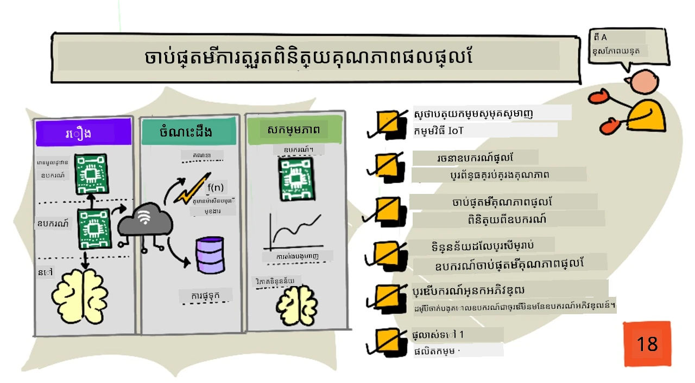
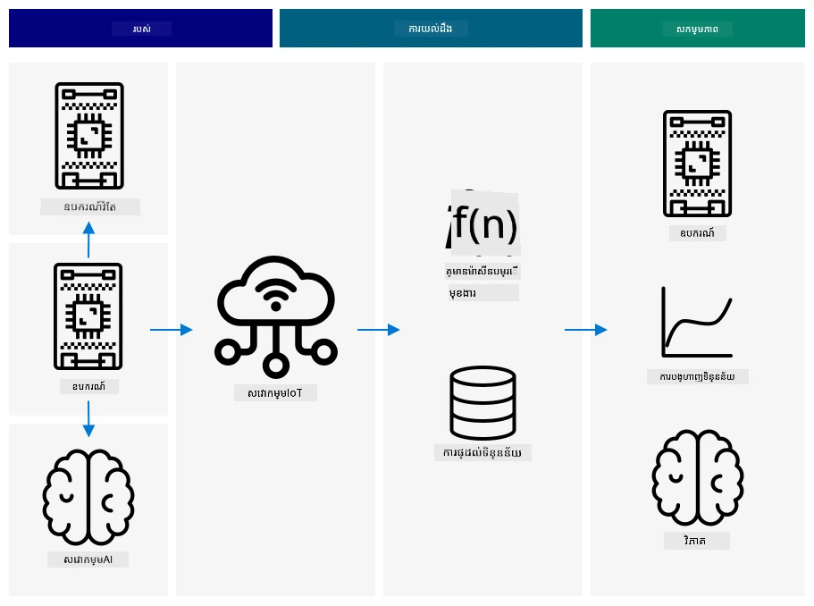
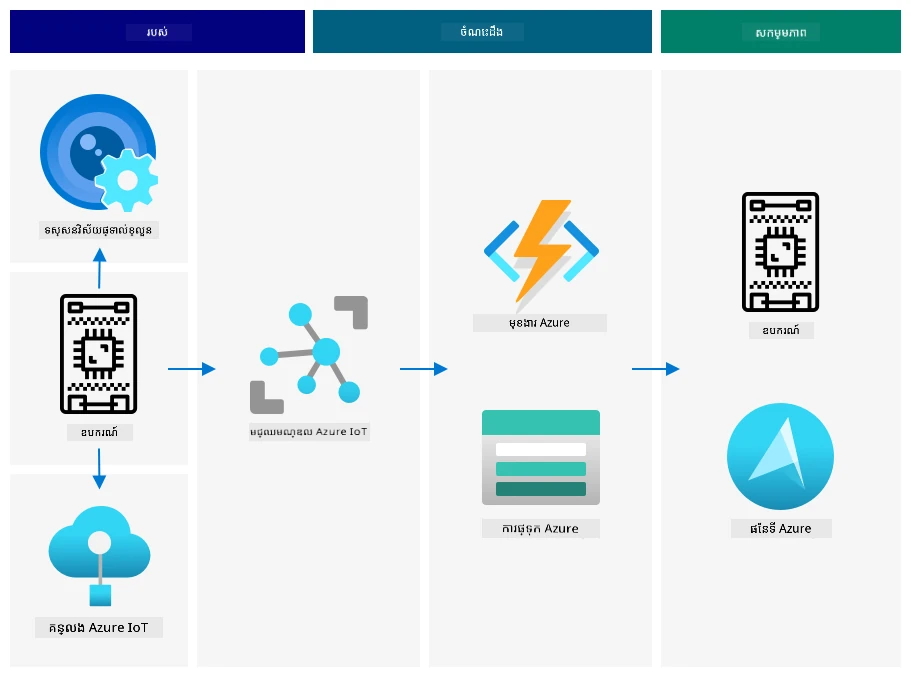
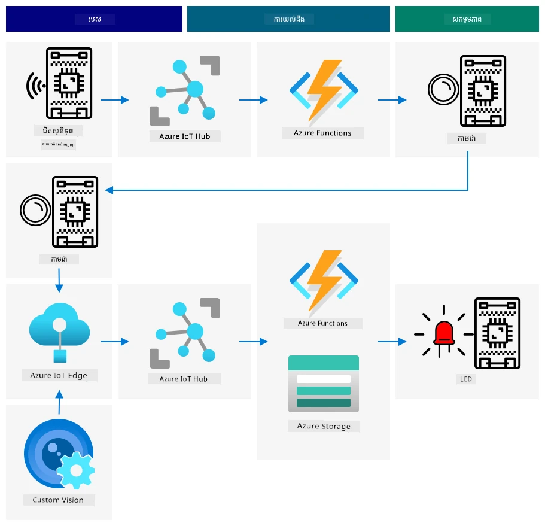
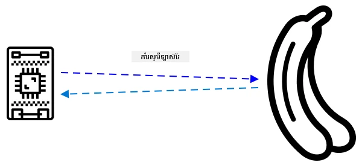
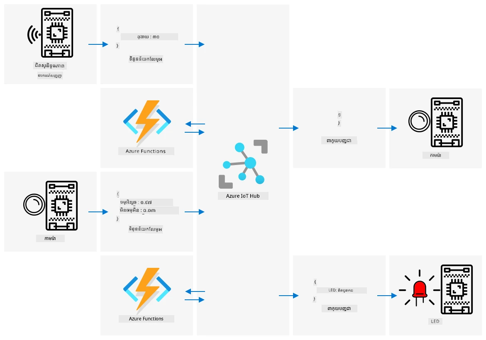

# ការបង្កើតការស្វែងរកគុណភាពផ្លែឈើពីឧបករណ៍​ឆ្លាក់



> សេចក្ដីសង្ខេបដោយ [Nitya Narasimhan](https://github.com/nitya) ។ ចុចរូបភាពសម្រាប់មើលទំហំធំជាងនេះ។

## សំណួរប្រលងមុនមេរៀន

[សំណួរប្រលងមុនមេរៀន](https://black-meadow-040d15503.1.azurestaticapps.net/quiz/35)

## មុនមេរៀន

កម្មវិធី IoT មិនមែនគ្រាន់តែឧបករណ៍តែមួយទេដែលថតទិន្នន័យហើយផ្ញើទៅពពកទេ ត្រូវមានឧបករណ៍ជាច្រើនដែលធ្វើការដំណើរការជាមួយគ្នា ដើម្បីចាប់យកទិន្នន័យពីពិភពលោករូបបូកដោយប្រើឧបករណ៍ឆ្លាក់ទិន្នន័យ (sensor) ក្រោយមកធ្វើការសម្រេចចិត្តលើទិន្នន័យនោះ ហើយធ្វើអន្តរកម្មតបស្នងទៅពិភពលោករូបបូកតាមរយៈឧបករណ៍បង្ហាញ (actuators) ឬវិចិត្រសាល។

ក្នុងមេរៀននេះ អ្នកនឹងរៀនបន្ថែមអំពីរបៀបបង្កើតប្លង់កម្មវិធី IoT ដែលស្មុគស្មាញ បញ្ចូលឧបករណ៍ឆ្លាក់ទិន្នន័យជាច្រើន សេវាមួយចំនួននៅពពកសម្រាប់វិភាគនិងរក្សាទិន្នន័យ និងបង្ហាញចម្លើយតាមរយៈឧបករណ៍បង្ហាញ។ អ្នកនឹងរៀនពីរបៀបបង្កើតប្រព័ន្ធត្រួតពិនិត្យគុណភាពផ្លែឈើម៉ូដែលសាកល្បង រួមបញ្ចូលការប្រើឧបករណ៍ឆ្លាក់ទិន្នន័យប្រភេទវែងសម្រាប់បញ្ចេញបន្ទុះកម្មវិធី IoT និងរបៀបប្លង់កម្មវិធីម៉ូដែលនេះ។

ក្នុងមេរៀននេះ យើងនឹងរៀនពី៖

* [រចនាសម្ព័ន្ធកម្មវិធី IoT](#រចនាសម្ព័ន្ធកម្មវិធី-iot-ស្មុគស្មាញ)
* [រៀបចំប្រព័ន្ធត្រួតពិនិត្យគុណភាពផ្លែឈើ](#រៀបចំប្រព័ន្ធត្រួតពិនិត្យគុណភាពផ្លែឈើ)
* [បង្កើតការត្រួតពិនិត្យគុណភាពផ្លែឈើពីឧបករណ៍ឆ្លាក់](#បង្កើតការត្រួតពិនិត្យគុណភាពផ្លែឈើពីឧបករណ៍ឆ្លាក់)
* [ទិន្នន័យដែលប្រើសម្រាប់ឧបករណ៍ត្រួតពិនិត្យគុណភាពផ្លែឈើ](#ទិន្នន័យដែលប្រើសម្រាប់ឧបករណ៍ត្រួតពិនិត្យគុណភាពផ្លែឈើ)
* [ប្រើឧបករណ៍អ្នកអភិវឌ្ឍន៍សម្រាប់សំលៀកបណ្ដ្រសំខាន់ឧបករណ៍ IoT ច្រើន](#ប្រើឧបករណ៍អ្នកអភិវឌ្ឍន៍សម្រាប់សំលៀកបណ្ដ្រមឧបករណ៍-iot-ច្រើន)
* [ផ្លាស់ទៅផលិតកម្ម](#ការផ្លាស់ប្តូរទៅផលិតកម្ម)

> 🗑 នេះគឺជាមេរៀនចុងក្រោយក្នុងគម្រោងនេះ ដូច្នេះបន្ទាប់ពីបញ្ចប់មេរៀននិងភារកិច្ច កុំភ្លេចសម្អាតសេវាកម្មពពករបស់អ្នក។ អ្នកត្រូវការសេវាកម្មដើម្បីបញ្ចប់ភារកិច្ច ដូច្នេះដោយមានការសន្យាច្បាស់លាស់កុំភ្លេចបញ្ចប់វា។
>
> សូមយោងទៅ [ការណែនាំសំអាតគម្រោងរបស់អ្នក](../../../clean-up.md) ប្រសិនបើចាំបាច់សម្រាប់ការណែនាំពីរបៀបបំពេញ។

## រចនាសម្ព័ន្ធកម្មវិធី IoT ស្មុគស្មាញ

កម្មវិធី IoT ត្រូវបានបង្កើតពីធាតុជាច្រើន។ វារួមបញ្ចូលរាល់រឿងជាច្រើន និងសេវាកម្មអ៊ីនធឺណិចនានា។

កម្មវិធី IoT អាចពិពណ៌នាថា ជា *ជីវភាគ* (ឧបករណ៍) ផ្ញើទិន្នន័យដែលបង្កើត *ចំណេះដឹង*។ ចំណេះដឹងនេះបង្កើត *សកម្មភាព* ដើម្បីបង្កើនប្រសិទ្ធភាពអាជីវកម្មឬដំណើរការ។ ឧទាហរណ៍ គឺជាម៉ាស៊ីន (ជីវភាគ) ផ្ញើទិន្នន័យសីតុណ្ហភាព។ ទិន្នន័យនេះត្រូវបានប្រើសម្រាប់វាយតម្លៃថា ម៉ាស៊ីនដំណើរការតាមរង្វង់បច្ចុប្បន្ន (ចំណេះដឹង) ។ ចំណេះដឹងនេះត្រូវបានប្រើសម្រាប់បំពានកាលវិភាគថែទាំម៉ាស៊ីនជាមុន (សកម្មភាព) ។

* ការផ្ញើទិន្នន័យពីជីវភាគនីមួយៗខុសគ្នា។
* សេវាកម្ម IoT ផ្តល់ចំណេះដឹងមកលើទិន្នន័យនោះ ម្តងទៀតក៏បន្ថែមទិន្នន័យពីប្រភពផ្សេងទៀតផងដែរ។
* ចំណេះដឹងទាំងនេះជំរុញសកម្មភាព រាប់ទាំងការគ្រប់គ្រងឧបករណ៍ និងការរៀបចំទិន្នន័យសម្រាប់មនុស្ស។

### រចនាសម្ព័ន្ធ IoT សម្រាប់យោង



រូបបង្ហាញខាងលើបង្ហាញពីរចនាសម្ព័ន្ធ IoT សម្រាប់យោង។

> 🎓 *រចនាសម្ព័ន្ធយោង* គឺជារចនាសម្ព័ន្ធឧទាហរណ៍ដែលអាចប្រើសម្រាប់យោងពេលបង្កើតប្រព័ន្ធថ្មី។ ក្នុងករណីនេះ ប្រសិនបើអ្នកកំពុងបង្កើតប្រព័ន្ធ IoT ថ្មី អ្នកអាចអនុវត្តរចនាសម្ព័ន្ធនេះ ដោយប្ដូរជំនួយឧបករណ៍ និងសេវាកម្មដោយសមរម្យ។

* **ជីវភាគ** គឺឧបករណ៍ដែលថតទិន្នន័យពីឧបករណ៍ឆ្លាក់ ដូចជា ការជួយបកប្រែរូបភាពដោយប្រើបច្ចេកវិទ្យាផ្ទៃមុខដូចជា Custom Vision។ ទិន្នន័យពីឧបករណ៍នេះត្រូវបានផ្ញើទៅសេវាកម្ម IoT ។

* **ចំណេះដឹង** មានមកពីកម្មវិធីសេវាមិនមានម៉ាស៊ីនបម្រើ (serverless), ឬពីវិភាគលើទិន្នន័យដែលបានរក្សាទុក។

* **សកម្មភាព** អាចជាបញ្ជាក្នុងការគ្រប់គ្រងឧបករណ៍ ឬការបង្ហាញទិន្នន័យសម្រាប់មនុស្សធ្វើការសម្រេចចិត្ត។



រូបបង្ហាញខាងលើបង្ហាញពីធាតុនិងសេវាកម្មខ្លះៗដែលបានគ្របដណ្តប់នៅមុននេះ នៅក្នុងមេរៀន ដូចជារបៀបតភ្ជាប់គ្នានៅក្នុងរចនាសម្ព័ន្ធ IoT សម្រាប់យោង។

* **ជីវភាគ** - អ្នកបានសរសេរកូដឧបករណ៍សម្រាប់ថតទិន្នន័យពីឧបករណ៍ឆ្លាក់ និងវិភាគរូបភាពដោយប្រើ Custom Vision ដែលដំណើរការទាំងនៅពពក និងឧបករណ៍គេហ្នក់ (edge device)។ ទិន្នន័យបានផ្ញើទៅ IoT Hub ។

* **ចំណេះដឹង** - អ្នកបានប្រើ Azure Functions ដើម្បីតបស្នងសារផ្ញើទៅ IoT Hub ហើយរក្សាទិន្នន័យនៅក្នុង Azure Storage សម្រាប់វិភាគបន្ទាប់។

* **សកម្មភាព** - អ្នកបានគ្រប់គ្រងឧបករណ៍កំណត់តម្រឹម (actuators) មកលើការសម្រេចចិត្តនៅពពក ហើយបានបង្ហាញទិន្នន័យដោយប្រើ Azure Maps ។

✅ សូមគិតអំពីឧបករណ៍ IoT ផ្សេងៗដែលអ្នកបានប្រើដូចជា ឧបករណ៍ផ្ទះឆ្លាតវៃ។ តើមានជីវភាគ (things), ចំណេះដឹង (insights), និងសកម្មភាព (actions) អ្វីខ្លះនៅក្នុងឧបករណ៍នោះ និងកម្មវិធីរបស់វា?

លំនាំនេះអាចលៃតម្រូវទៅលើទំហំនិងចំនួនឧបករណ៍បានយ៉ាងធំ ឬតូចបំផុតដែលអ្នកត្រូវការ ដោយបន្ថែមឧបករណ៍និងសេវាកម្ម។

### ទិន្នន័យនិងសុវត្ថិភាព

ពេលអ្នកកំណត់រចនាសម្ព័ន្ធប្រព័ន្ធរបស់អ្នក អ្នកត្រូវយកចិត្តទុកដាក់បរិយាបថទិន្នន័យ និងសុវត្ថិភាពជានិច្ច។

* តើឧបករណ៍របស់អ្នកផ្ញើនិងទទួលទិន្នន័យអ្វីខ្លះ?
* តើទិន្នន័យនោះគួរត្រូវបានការពារប្រកបដោយសុវត្ថិភាពយ៉ាងដូចម្តេច?
* តើតើការចូលដំណើរការនៅឧបករណ៍ និងសេវាកម្មពពកត្រូវតែគ្រប់គ្រងយ៉ាងដូចម្តេច?

✅ សូមគិតអំពីសុវត្ថិភាពទិន្នន័យនៅក្នុងឧបករណ៍ IoT ដែលអ្នកមាន។ តើតើប៉ុន្មាននៃទិន្នន័យនោះជាទិន្នន័យផ្ទាល់ខ្លួនដែលត្រូវបានរក្សាទុកឲ្យមានភាពឯកជន ទាំងពេលផ្ទុកនិងពេលផ្លាស់ប្ដូរ? តើទិន្នន័យមួយណាដែលគួរតែបាត់បង់ មិនបរិច្ឆេទ?

## រៀបចំប្រព័ន្ធត្រួតពិនិត្យគុណភាពផ្លែឈើ

ឥឡូវនេះយកគម្រប់ជីវភាគ ចំណេះដឹង និងសកម្មភាព ហើយអនុវត្តទៅលើឧបករណ៍ត្រួតពិនិត្យគុណភាពផ្លែឈើ ដើម្បីរចនាកម្មវិធីធំជាចុងភ្លៅ។

ស្រមៃថាអ្នកត្រូវបានផ្ដល់ភារកិច្ចបង្កើតឧបករណ៍ត្រួតពិនិត្យគុណភាពផ្លែឈើសម្រាប់ត្រូវប្រើនៅរោងចក្រផលិត។ ផ្លែឈើធ្វើដំណើរតាមរបងដឹកជញ្ជូន នៅពេលបុគ្គលិកត្រូវតែពិនិត្យផ្លែឈើពីដៃ ហើយដកចេញផ្លែឈើដែលមិនពេញសម្រេច។ ដើម្បីកាត់បន្ថយការចំណាយ នាយករដ្ឋមន្ត្រីរដ្ឋបាលចង់បានប្រព័ន្ធស្វ័យប្រវត្តិ។

✅ លំនាំមួយក្នុងការកើនឡើងនៃ IoT (និងបច្ចេកវិទ្យាទូទៅ) គឺមុខងារដែលធ្វើដោយដៃត្រូវបានជំនួសជាឧបករណ៍ម៉ាស៊ីន។ សូមស្រាវជ្រាវ៖ តើមានក្រុមហ៊ុន និងការងារប៉ុន្មានដែលត្រូវបាត់បង់ដោយសារ IoT? តើមានការងារថ្មីប៉ុន្មានដែលត្រូវបានបង្កើតនៅក្នុងការបង្កើតឧបករណ៍ IoT?

អ្នកត្រូវបង្កើតប្រព័ន្ធដែលផ្លែឈើត្រូវបានរកឃើញពេលវាមកដល់លើរបងដឹកជញ្ជូន ហើយវាត្រូវបានថតរូប និងត្រូវបានត្រួតពិនិត្យដោយម៉ូដែល AI ដែលដំណើរការនៅកន្លែងវែង។ លទ្ធផលត្រូវបានផ្ញើទៅពពកដើម្បីរក្សាទុក ហើយបើផ្លែឈើមិនពេញសម្រេច នឹងមានការជូនដំណឹងថាផ្លែឈើមិនពេញសម្រេចត្រូវបានដកចេញ។

|   |   |
| - | - |
| **ជីវភាគ** | ឧបករណ៍រកឃើញផ្លែឈើមកលើរបងដឹកជញ្ជូន<br>កាមេរ៉ាសម្រាប់ថតរូបនិងចាត់ថ្នាក់ផ្លែឈើ<br>ឧបករណ៍វែងដំណើរការម៉ូដែលចាត់ថ្នាក់\nឧបករណ៍ផ្ញើសារ​អំពីផ្លែឈើមិនពេញសម្រេច |
| **ចំណេះដឹង** | សម្រេចចិត្តត្រួតពិនិត្យលើភាពពេញសម្រេចនៃផ្លែឈើ<br>រក្សាទុកលទ្ធផលចាត់ថ្នាក់ភាពពេញសម្រេច<br>កំណត់ថាតើត្រូវការជូនដំណឹងអំពីផ្លែឈើមិនពេញសម្រេច |
| **សកម្មភាព** | ផ្ញើបញ្ជាចុះឧបករណ៍ឲ្យថតរូប និងពិនិត្យនូវភាពពេញសម្រេចដោយម៉ូដែលចាត់ថ្នាក់រូបភាព<br>ផ្ញើបញ្ជាចុះឧបករណ៍ឲ្យជូនដំណឹងថាផ្លែឈើមិនពេញសម្រេច |

### បង្កើតម៉ូដែលកម្មវិធីរបស់អ្នក



រូបបង្ហាញខាងលើបង្ហាញពីរចនាសម្ព័ន្ធយោងសម្រាប់កម្មវិធីម៉ូដែលនេះ។

* ឧបករណ៍ IoT ជាមួយឧបករណ៍ឆ្លាក់ទាំងដាច់សន្ទិតរកឃើញកំរិតមកដល់នៃផ្លែឈើ។ វានាំសារមួយទៅពពកបញ្ជាក់ថាបានរកឃើញផ្លែឈើ។
* កម្មវិធី serverless នៅពពកផ្ញើបញ្ជាឲ្យឧបករណ៍មួយផ្សេងទៀតថតរូប និងចាត់ថ្នាក់រូបភាព។
* ឧបករណ៍ IoT មានកាមេរ៉ាប្រើឱកាសថតរូប ហើយផ្ញើទៅម៉ូដែលចាត់ថ្នាក់រូបភាពដំណើរការនៅ edge។ លទ្ធផលបន្ទាប់មកត្រូវបានផ្ញើទៅពពក។
* កម្មវិធី serverlessនៅពពករក្សាទុកពត៌មាននេះសម្រាប់វិភាគបន្ទាប់ ដើម្បីមើលភាគរយនៃផ្លែឈើមិនពេញសម្រេច។ ប្រសិនបើផ្លែឈើមិនពេញសម្រេច វាបញ្ជូនបញ្ជាឲ្យឧបករណ៍ IoT ផ្សេងទៀត ដើម្បីជូនដំណឹងបុគ្គលិករោងចក្រ តាមរយៈ LED។

> 💁 កម្មវិធី IoT ទាំងមូលនេះអាចអនុវត្តជាឧបករណ៍តែមួយដែលមានតុល្យភាពដើម្បីចាប់ផ្តើមចាត់ថ្នាក់រូបភាព និងគ្រប់គ្រង LED ។ វាអាចប្រើ IoT Hub ដើម្បីតាមដានចំនួនផ្លែឈើមិនពេញសម្រេច សម្រាប់កំណត់រចនាសម្ព័ន្ធឧបករណ៍។ នៅក្នុងមេរៀននេះ វាត្រូវបានបញ្ជាក់បន្ថែមសម្រាប់បង្ហាញគំនិតសម្រាប់កម្មវិធី IoT អ្នកមានទំហំធំ។

សម្រាប់ម៉ូដែល ការអនុវត្តន៍ទាំងអស់នឹងធ្វើនៅក្នុងឧបករណ៍តែមួយ។ ប្រសិនបើអ្នកប្រើ microcontroller អ្នកនឹងប្រើឧបករណ៍ edge ផ្សេងទៀតសម្រាប់ចាត់ថ្នាក់រូបភាព។ អ្នកបានរៀនភាគច្រើនពីរឿងដែលអ្នកត្រូវការសម្រាប់បង្កើតនេះរួចហើយ។

## បង្កើតការត្រួតពិនិត្យគុណភាពផ្លែឈើពីឧបករណ៍ឆ្លាក់

ឧបករណ៍ IoT ត្រូវការសម្គាល់កត្តាបញ្ចេញបន្ទុះខ្លះៗ ដើម្បីបញ្ជាក់ពេលផ្លែឈើមានភាពត្រឹមត្រូវសម្រាប់ចាត់ថ្នាក់។ មួយក្នុងកត្តាបញ្ចេញបន្ទុះនោះគឺវាស់វែងពីអំឡុងផ្លែឈើនៅត្រឹមទីតាំងកំណត់លើរបងដឹកជញ្ជូន ដោយវាស់ចម្ងាយទៅឧបករណ៍ឆ្លាក់។



ឧបករណ៍ឆ្លាក់អាចប្រើសម្រាប់វាស់ចម្ងាយពីឧបករណ៍ទៅវត្ថុលេខមួយ។ វាទូទៅបញ្ចេញកាំយោលវាស់ចម្ងាយបែបអេឡិចត្រូម៉ាញេទិចដូចជាកាំយោលឡាស៊ែរឬពន្លឺអុីនហ្វ្រារ៉េ ហើយរក្សាសញ្ញាដែលបង្វិលត្រឡប់ពីវត្ថុ។ ពេលវេលារវាងពេលបញ្ចេញនិងការបង្វិលត្រឡប់អាចប្រើសម្រាប់គណនាចម្ងាយពីឧបករណ៍ឆ្លាក់។

> 💁 អ្នកប្រហែលជាបានប្រើឧបករណ៍ឆ្លាក់ទាំងដាច់សន្ទិតនេះម្តងមិនដឹង។ ទូរស័ព្ទដៃភាគច្រើននឹងបិទអេក្រង់ពេលអ្នកដាក់ទៅច្រមុះសម្រាប់កុំឲ្យអ្នកបង្ខំបញ្ចប់ការហៅដោយចៃដន្យជាមួយច្រមុះ ហើយវាធ្វើការនេះដោយប្រើឧបករណ៍ឆ្លាក់ ដើម្បីចាប់អារម្មណ៍វត្ថុនៅជិតអេក្រង់នៅពេលហៅ និងបិទបើកការជឿនចលនា។

### ភារកិច្ច - បង្កើតការស្វែងរកគុណភាពផ្លែឈើពីឧបករណ៍ឆ្លាក់ទាំងដាច់សន្ទិត

ដំណើរការតាមនឹងមគ្គុទេសក៍ដែលពាក់ព័ន្ធ ដើម្បីប្រើឧបករណ៍ឆ្លាក់ទាំងដាច់សន្ទិតស្វែងរកវត្ថុដោយប្រើឧបករណ៍ IoT របស់អ្នក៖

* [Arduino - Wio Terminal](wio-terminal-proximity.md)
* [កុំព្យូទ័រតែមួយចេញ - Raspberry Pi](pi-proximity.md)
* [កុំព្យូទ័រតែមួយចេញ - ឧបករណ៍បណ្ដាញវឺឌ្យ៉ល](virtual-device-proximity.md)

## ទិន្នន័យដែលប្រើសម្រាប់ឧបករណ៍ត្រួតពិនិត្យគុណភាពផ្លែឈើ

ឧបករណ៍ត្រួតពិនិត្យផ្លែឈើម៉ូដែលមានធាតុជាច្រើនដែលទាក់ទងគ្នា។



* ឧបករណ៍ឆ្លាក់ទាំងដាច់សន្ទិតវាស់ចម្ងាយទៅផ្លែឈើហើយផ្ញើទៅ IoT Hub
* បញ្ជាក្នុងការគ្រប់គ្រងកាមេរ៉ាផ្ញើពី IoT Hub ទៅឧបករណ៍កាមេរ៉ា
* លទ្ធផលនៃការចាត់ថ្នាក់ទីបាញ់ផ្ញើទៅ IoT Hub
* បញ្ជាក្នុងការគ្រប់គ្រង LED ដើម្បីជូនដំណឹងពេលផ្លែឈើមិនពេញសម្រេច ផ្ញើពី IoT Hub ទៅឧបករណ៍ដែលមាន LED

វាជារឿងល្អក្នុងការកំណត់រចនាសម្ព័ន្ធសារទាំងនេះជាមុន មុនពេលអ្នកបង្កើតកម្មវិធី។

> 💁 អ្នកអភិវឌ្ឍន៍មានបទពិសោធន៍ភាគច្រើន ដែលបានចំណាយម៉ោង សប្តាហ៍ ដើម្បី​រក​ផលប៉ះពាល់ឆ្គងនៃការប្រែខុសទិន្នន័យដែលបានផ្ញើ ប្រៀបធៀបនឹងអ្វីដែលគេរំពឹងទុក។

ឧទាហរណ៍ - ប្រសិនបើអ្នកផ្ញើព័ត៌មានសីតុណ្ហភាព ដូចម្តេចដែលអ្នកនឹងកំណត់ JSON? អ្នកអាចមានប្រភេទមួយឈ្មោះ `temperature` ឬប្រើកាត់បន្ថយពាក្យ `temp` ។

```json
{
    "temperature": 20.7
}
```

ប្រៀបធៀប៖

```json
{
    "temp": 20.7
}
```

អ្នកត្រូវគិតពីអត្រាវាស់ - តើសីតុណ្ហភាពវាស់ដោយអខង្ក °C ឬ °F? ប្រសិនបើអ្នកប្រើឧបករណ៍ប្រើប្រាស់ផ្តល់អ៊ីតាលី ពេលវាប្រែរបៀបបង្ហាញអ្នកត្រូវប្រាកដថាគំរូវាស់ដែលផ្ញើទៅពពកនៅតែស្របគ្នា។

✅ សូមស្រាវជ្រាវ៖ តើបញ្ហាពាក់ព័ន្ធអត្រាវាស់បណ្តាលឲ្យ Mars Climate Orbiter បាត់បាក់ $125 លានដុល្លារយ៉ាងដូចម្តេច?

សូមគិតអំពីទិន្នន័យដែលផ្ញើសម្រាប់ឧបករណ៍ត្រួតពិនិត្យគុណភាពផ្លែឈើ។ តើអ្នកនឹងកំណត់សារនីមួយៗយ៉ាងដូចម្តេច? តើអ្នកនឹងវិភាគទិន្នន័យណា និងធ្វើការសម្រេចចិត្តក្នុងការផ្ញើទិន្នន័យណា?

ឧទាហរណ៍ - ការបញ្ចេញបន្ទុះចាត់ថ្នាក់រូបភាពដោយឧបករណ៍ឆ្លាក់ទាំងដាច់សន្ទិត។ ឧបករណ៍ IoT វាស់ចម្ងាយ ប៉ុន្តែការសម្រេចចិត្តធ្វើនៅឯណា? តើឧបករណ៍សម្រេចចិត្តថា ផ្លែឈើជិតគ្រប់គ្រាន់ហើយផ្ញើសារប្រកាសទៅ IoT Hub ដើម្បីបញ្ចេញបន្ទុះចាត់ថ្នាក់? រឺវាផ្ញើវាស់ចម្ងាយទៅអោយ IoT Hub សម្រេចចិត្ត?

ចម្លើយសម្រាប់សំណួរនេះ គឺ - វាវែងទៅលើករណី។ ករណីនីមួយៗខុសគ្នា ដូច្នេះជាអ្នកអភិវឌ្ឍន៍ IoT អ្នកត្រូវយល់ពីប្រព័ន្ធដែលអ្នកកំពុងបង្កើត។ តើត្រូវប្រើលើកន្លែងណា ហើយគឺជា​ត្រូវចាប់យកទិន្នន័យ​អ្វី។

* ប្រសិនបើការ​សម្រេចចិត្តធ្វើដោយ IoT Hub អ្នក​ត្រូវ​ផ្ញើវាស់​ចម្ងាយ​ច្រើនផ្សេងៗ។
* ប្រសិនបើអ្នកផ្ញើសារច្រើនពេក វានឹងបង្កើនថ្លៃដើមនៃ IoT Hub និងកុងកាប់បណ្តាញដែលឧបករណ៍ IoT ត្រូវការជាពិសេសនៅរោងចក្រដែលមានឧបករណ៍លានរយ៉ាងច្រើន។ វាក៏អាចធ្វើឲ្យឧបករណ៍របស់អ្នកយឺតចុះផងដែរ។
* ប្រសិនបើអ្នកសម្រេចចិត្តលើឧបករណ៍ អ្នកត្រូវផ្តល់វិធីសាស្រ្តសម្រាប់កំណត់កាលបរិច្ឆេទសម្រាប់កែតម្រូវឧបករណ៍។

## ប្រើឧបករណ៍អ្នកអភិវឌ្ឍន៍សម្រាប់សំលៀកបណ្ដ្រ(ម)ឧបករណ៍ IoT ច្រើន

ដើម្បីបង្កើតម៉ូដែលរបស់អ្នក អ្នកនឹងត្រូវការកម្មវិធីបំរែបំរួលឧបករណ៍ IoT ជាច្រើន ដើម្បីផ្ញើទិន្នន័យ និងតបស្នងបញ្ជាដែលបានផ្ញើ។

### ការសំលៀកបណ្ដ្រ(ម)ឧបករណ៍ IoT ច្រើនលើ Raspberry Pi ឬឧបករណ៍ IoT វឺឌ្យ៉ល

នៅពេលប្រើកុំព្យូទ័រតែមួយយ៉ាង Raspberry Pi អ្នកអាចដំណើរការកម្មវិធីជាច្រើននៅក្នុងអំឡុងពេលតែមួយ។ វាមានន័យថាអ្នកអាចសំលៀកបណ្ដ្រ(ម)ឧបករណ៍ IoT ច្រើន ដោយបង្កើតកម្មវិធីជាច្រើនមួយមួយសម្រាប់ «ឧបករណ៍ IoT»។ ឧទាហរណ៍ អ្នកអាចអនុវត្តឧបករណ៍នីមួយៗជាឯកសារ Python ផ្សេងៗ ហើយដំណើរការពួកវានៅក្នុងផ្ទាំងបញ្ជាបន្ទាត់ផ្សេងៗ។

> 💁 ត្រូវតែចងចាំថា ឧបករណ៍ខ្លះមិនអាចដំណើរការដោយកម្មវិធីជាច្រើនរួមគ្នាលំដាប់ដូចបន្តបានទេ។

### ការសំលៀកបណ្ដ្រ(ម)ឧបករណ៍ IoT ច្រើនលើ microcontroller

microcontroller គឺស្មុគស្មាញក្នុងការសំលៀកបណ្ដ្រ(ម)ឧបករណ៍។ ខុសពីកុំព្យូទ័រតែមួយ អ្នកមិនអាចដំណើរការកម្មវិធីជាច្រើននៅពេលតែមួយបានទេ អ្នកត្រូវបញ្ចូលគ្រប់លក្ខណៈដែលអ្នកត្រូវការសម្រាប់ឧបករណ៍ IoT ដែលផ្សេងៗគ្នាទាំងអស់ក្នុងកម្មវិធីតែមួយ។

មានការណែនាំខ្លះៗដើម្បីធ្វើឲ្យដំណើរការនេះកាន់តែងាយស្រួល៖
* បង្កើតថ្នាក់មួយឬច្រើនសម្រាប់ឧបករណ៍ IoT មួយឬច្រើន - ឧទាហរណ៍ថ្នាក់ដែលហៅថា `DistanceSensor`, `ClassifierCamera`, `LEDController` ។ នីមួយៗអាចមានវិធីសាស្រ្ត `setup` និង `loop` របស់ខ្លួន ដែលត្រូវបានហៅដោយមុខងារ `setup` និង `loop` សំខាន់។
* ដោះស្រាយបញ្ជា​នៅកន្លែងតែមួយ ហើយបញ្ជូនវាទៅថ្នាក់ឧបករណ៍ដែលពាក់ព័ន្ធតាមកម្រិតការ​ត្រូវការ។
* នៅក្នុងមុខងារ `loop` សំខាន់ អ្នកត្រូវពិចារណាពេលវេលាសម្រាប់ឧបករណ៍ផ្សេងៗគ្នា។ ឧទាហរណ៍ ប្រសិនបើអ្នកមានថ្នាក់ឧបករណ៍មួយដែលត្រូវដំណើរការពីរៀល ១០ វិនាទី និងមួយផ្សេងទៀតត្រូវដំណើរការជារៀល ១ វិនាទី នោះក្នុងមុខងារ `loop` សំខាន់ យកពេលពន្យាពេល ១ វិនាទី។ អំពើ `loop` រាល់ដងនឹងចាប់ផ្តើមកូដដែលពាក់ព័ន្ធសម្រាប់ឧបករណ៍ដែលត្រូវដំណើរការជារៀល ១ វិនាទី ហើយប្រើអ្នករាប់តួនាទីដើម្បីរាប់រៀល `loop` រៀងៗឡើយ ដំណើរការឧបករណ៍ផ្សេងទៀតពេលឈានទៅ ១០ (បញ្ចូលរួមអ្នករាប់តួនាទីឡើងវិញបន្ទាប់ពីនោះ)។

## ការផ្លាស់ប្តូរទៅផលិតកម្ម

គំរូដំបូងនឹងជាគ្រឹះសម្រាប់ប្រព័ន្ធផលិតកម្មចុងក្រោយ។ ខ្លះនៃការបែកខុសគ្នា ពេលអ្នកផ្លាស់ប្តូរទៅផលិតកម្មនឹងរួមមាន៖

* ឧបករណ៍រឹងប៉ឹង - ប្រើប្រាស់បច្ចេកវិទ្យាដែលរចនាឡើងដើម្បីទ្រទ្រង់សម្លេងរំខាន កំដៅ ការកង្វក់ និងសំពាធនៅរោងចក្រ។
* ប្រើប្រាស់ការទំនាក់ទំនងក្នុងស្ថានីយ - ខ្លះនៃឧបករណ៍នឹងមានការទំនាក់ទំនងត្រូវតែកាត់ជាស្របជាមួយគ្នា ដោយជៀសវាងការជំហានទៅកាន់ពពក ព្រោះផ្ញើទិន្នន័យទៅកាន់ពពកតែសម្រាប់ផ្ទុកប៉ុណ្ណោះ។ របៀបនេះអាស្រ័យលើការរៀបចំរោងចក្រដែលប្រើប្រាស់ការទំនាក់ទំនងផ្ទាល់ ខណៈដែលមានការប្រតិបត្តិសេវា IoT ផ្នែកមួយនៅលើធុងទីចុងបញ្ចប់ដោយឧបករណ៍ Gateway។
* ជម្រើសកែប្រែការកំណត់ - រោងចក្រ និងករណីប្រើប្រាស់នីមួយៗខុសគ្នា ដូច្នេះឧបករណ៍បច្ចេកទេសត្រូវមានជម្រើសកំណត់ខ្លួនឯង។ ឧទាហរណ៍ ឧបករណ៍ប្រើឧស្ម័នស៊េនស័រដើម្បីរកឃើញផ្លែឈើនៅចម្ងាយខុសៗគ្នា។ ជាងកូដថ្នាក់រឹងបញ្ចាំចម្ងាយដើម្បីចាប់ផ្ដើមចាត់ថ្នាក់ គួរតែអាចកំណត់តម្លៃនេះតាមពពក ឧទាហរណ៍ ដោយប្រើរូបភាពឧបករណ៍ Twin។
* ការដកផ្លែឈើដោយស្វ័យប្រវត្តិ - ផ្ទុយពី LED ដើម្បីបញ្ជាក់ថាផ្លែឈើមិនរីក ចំណេះដឹងឧបករណ៍បញ្ចេញផ្លែឈើដោយស្វ័យប្រវត្តិ។

✅ ស្រាវជ្រាវមួយចំនួន៖ តើឧបករណ៍ផលិតកម្មនឹងខុសពីកំរងអភិវឌ្ឍន៍មួយរបៀបណាខ្លះ?

---

## 🚀 ប្រកួតប្រជែង

នៅមេរៀននេះ អ្នកបានរៀនពីគំនិតខ្លះដែលអ្នកត្រូវស្គាល់ពីរបៀបបង្កើតស្ថាបត្យកម្មប្រព័ន្ធ IoT ។ សូមចងចាំវិញទៅកាន់គម្រោងមុនៗ។ តើពួកវាផ្គូរផ្គងជាមួយស្ថាបត្យកម្មយោងខាងលើយ៉ាងដូចម្តេច?

ជ្រើសរើសគំរោងមួយហើយគិតពីរចនាសម្ព័ន្ធដំណោះស្រាយស្មុគស្មាញជាងនេះដែលបញ្ចូលគ្នាពីសមត្ថភាពច្រើនលើសពីគម្រោងដែលបានបង្ហាញ។ គូររចនាស្ថាបត្យកម្មហើយគិតពីឧបករណ៍ និងសេវាកម្មទាំងអស់ដែលអ្នកត្រូវការ។

ឧទាហរណ៍ - ឧបករណ៍តាមដានរថយន្តដែលបញ្ចូល GPS ជាមួយឧបករណ៍ស៊េនស័រដើម្បីត្រួតពិនិត្យអ្វីៗដូចជាសីតុណ្ហភាពនៅក្នុងរថយន្តត្រជាក់ កាលប្បវត្តន៍បើកបិទម៉ាស៊ីន និងអត្តសញ្ញាណរបស់អ្នកបើកបរ។ តើមានឧបករណ៍ណាខ្លះ តើមានសេវាកម្មណាខ្លះ ទិន្នន័យដែលបានផ្ញើរនិងវិចារណសុវត្ថិភាព និងហិរញ្ញវត្ថុសម្ងាត់លើក?

## វិញ្ញាសាចុងមេរៀន

[វិញ្ញាសាចុងមេរៀន](https://black-meadow-040d15503.1.azurestaticapps.net/quiz/36)

## ពិនិត្យឡើងវិញ និងអធិប្បាយដោយខ្លួនឯង

* អានបន្ថែមអំពីស្ថាបត្យកម្ម IoT នៅលើ [ឯកសារតំណាងស្ថាបត្យកម្ម IoT របស់ Azure នៅ Microsoft docs](https://docs.microsoft.com/azure/architecture/reference-architectures/iot?WT.mc_id=academic-17441-jabenn)
* អានបន្ថែមអំពី device twins នៅក្នុង [ឯកសារប្រើប្រាស់ device twins នៅក្នុង IoT Hub នៅ Microsoft docs](https://docs.microsoft.com/azure/iot-hub/iot-hub-devguide-device-twins?WT.mc_id=academic-17441-jabenn)
* អានអំពី OPC-UA ដែលជាពិធីសាស្រ្តទំនាក់ទំនងម៉ាស៊ីនទៅម៉ាស៊ីនដែលប្រើសម្រាប់ស្វ័យប្រវត្តិឧស្សាហកម្មនៅលើ [ទំព័រ OPC-UA នៅវិគីភីឌា](https://wikipedia.org/wiki/OPC_Unified_Architecture)

## ការងារ​ផ្ទះ

[បង្កើតឧបករណ៍វាស់គុណភាពផ្លែឈើ](assignment.md)

---

<!-- CO-OP TRANSLATOR DISCLAIMER START -->
**បំណុលកត់សម្គាល់**៖  
ឯកសារនេះត្រូវបានបកប្រែដោយប្រើសេវាកម្មបកប្រែ AI [Co-op Translator](https://github.com/Azure/co-op-translator)។ ខណៈពេលដែលយើងខិតខំរកភាពត្រឹមត្រូវ សូមជ្រាបថាការបកប្រែដោយស្វ័យប្រវត្តិអាចមានកំហុស ឬភាពមិនត្រឹមត្រូវ។ ឯកសារដើមនៅក្នុងភាសាម្តិគួរត្រូវបានគេចាត់ទុកថាជា ប្រភពសញ្ញាភាពត្រឹមត្រូវ។ សម្រាប់ព័ត៌មានសំខាន់ សូមផ្តល់អនុសាសន៍ឲ្យប្រើការបកប្រែដោយមនុស្សជំនាញវិជ្ជាជីវៈ។ យើងមិនទទួលខុសត្រូវចំពោះចំណេះដឹងខុស ឬការបកប្រែខុសពីការប្រើប្រាស់ការបកប្រែនេះឡើយ។
<!-- CO-OP TRANSLATOR DISCLAIMER END -->