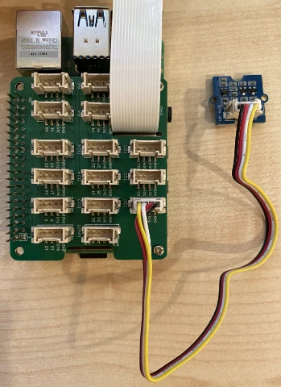

# ស្វែងរកចម្ងាយ​ជិត - Raspberry Pi

នៅក្នុងផ្នែកនេះនៃមេរៀន អ្នកនឹងបន្ថែមឧបករណ៍ស្វែងរកជិតទៅលើ Raspberry Pi របស់អ្នក ហើយអានចម្ងាយពីវា។

## ឧបករណ៍រឹង

Raspberry Pi ត្រូវការឧបករណ៍ស្វែងរកជិត។

ឧបករណ៍ដែលអ្នកនឹងប្រើគឺជា [Grove Time of Flight distance sensor](https://www.seeedstudio.com/Grove-Time-of-Flight-Distance-Sensor-VL53L0X.html)។ ឧបករណ៍នេះប្រើម៉ូឌុលវាស់ចម្ងាយដោយកាំរស្មីឡាស៊ែរ ដើម្បីស្វែងរកចម្ងាយ។ ឧបករណ៍នេះមានជួរចម្ងាយពី 10 មម ដល់ 2000 មម (1 សង់ទីម៉ែត្រ - 2 ម៉ែត្រ) ហើយនឹងរាយការណ៍តម្លៃក្នុងជួរនោះយ៉ាងត្រឹមត្រូវ ជាមួយចម្ងាយលើស 1000 មមដែលរាយការណ៍ជាតម្លៃ 8109 មម។

ឧបករណ៍វាស់ចម្ងាយកាំរស្មីឡាស៊ែរ ស្ថិតនៅផ្ទៃក្រោយនៃឧបករណ៍ ហើយជាផ្ទាំង বিপ‌សេ​ក Grove។

នេះជាឧបករណ៍ I<sup>2</sup>C។

### ភ្ជាប់ឧបករណ៍វាស់ចម្ងាយ Time of Flight

ឧបករណ៍ Grove time of flight អាចភ្ជាប់ទៅនឹង Raspberry Pi បាន។

#### ភារកិច្ច - ភ្ជាប់ឧបករណ៍ time of flight

ភ្ជាប់ឧបករណ៍ time of flight។


1. ដាក់ចុងខាងមួយនៃខ្សែ Grove ចូលក្នុងសោតភ្ជាប់លើឧបករណ៍ time of flight sensor។ វានឹងតែដាក់បានតែមួយទិសតែប៉ុណ្ណោះ។

1. នៅពេលដែល Raspberry Pi មិនដំណើរការ ការភ្ជាប់ចុងខាងមួយទៀតនៃខ្សែ Grove ចូលក្នុងសោត I<sup>2</sup>C មួយដែលមានស្លាក **I<sup>2</sup>C** លើ Grove Base hat ដែលភ្ជាប់ជាមួយ Pi។ សោតទាំងនេះស្ថិតនៅជួរខាងក្រោម ផ្ទុយទៅវិញនឹងចំណុច GPI និងជិតជ្រះខ្សែកាមេរ៉ា។



## ដំណើរការ​កម្មវិធីឧបករណ៍ time of flight sensor

Raspberry Pi អាចត្រូវបានកម្មវិធីដើម្បីប្រើឧបករណ៍ time of flight sensor ដែលភ្ជាប់។

### ភារកិច្ច - កម្មវិធីឧបករណ៍ time of flight sensor

កម្មវិធីសម្រាប់ឧបករណ៍នេះ។

1. បើកម៉ាស៊ីន Pi ហើយរង់ចាំឲ្យវាបើកឡើង។

1. បើកកូដ `fruit-quality-detector` ក្នុង VS Code មួយ គឺនៅលើ Pi ដោយផ្ទាល់ ឬភ្ជាប់តាមរយៈផ្នែកបន្ថែម Remote SSH។

1. ដំឡើងកញ្ចប់ rpi-vl53l0x របស់ Pip ដែលជាកញ្ចប់ Python ដែលធ្វើការផ្ដល់កាន់តែសាធារណៈជាមួយឧបករណ៍វាស់ចម្ងាយ VL53L0X time-of-flight។ ដំឡើងវាជាមួយពាក្យបញ្ជា pip នេះ

    ```sh
    pip install rpi-vl53l0x
    ```

1. បង្កើតឯកសារថ្មីមួយនៅក្នុងគម្រោងនេះឈ្មោះ `distance-sensor.py`។

    > 💁 វិធីងាយស្រួលដើម្បីសភាពម៉ាស៊ីន IoT ច្រើនគឺធ្វើមួយក្នុងឯកសារ Python ផ្សេងៗ ហើយរត់ពួកវាដោយស្របពេល។

1. បន្ថែមកូដដូចខាងក្រោមទៅឯកសារ:

    ```python
    import time
    
    from grove.i2c import Bus
    from rpi_vl53l0x.vl53l0x import VL53L0X
    ```

    នេះនាំចូលបណ្ណាល័យ Grove I<sup>2</sup>C bus និងបណ្ណាល័យសម្រាប់ឧបករណ៍ថាមពលហ៊្វលដែលបានសាងសង់ក្នុង Grove time of flight sensor។

1. ខាងក្រោមនេះ បន្ថែមកូដដូចខាងក្រោមដើម្បីចូលប្រើឧបករណ៍:

    ```python
    distance_sensor = VL53L0X(bus = Bus().bus)
    distance_sensor.begin()    
    ```

    កូដនេះប្រកាសឧបករណ៍វាស់ចម្ងាយឲ្យប្រើ Grove I<sup>2</sup>C bus ហើយចាប់ផ្ដើមឧបករណ៍។

1. ក្រោយមក បន្ថែមដំណើរការជាលូបមិនចប់ ដើម្បីអានចម្ងាយ៖

    ```python
    while True:
        distance_sensor.wait_ready()
        print(f'Distance = {distance_sensor.get_distance()} mm')
        time.sleep(1)
    ```

    កូដនេះរង់ចាំតម្លៃមួយមកសម្រាប់អានពីឧបករណ៍ ហើយបោះពុម្ភវាទៅក្រោមកុងសូល។

1. រត់កូដនេះ។

    > 💁 កុំភ្លេចថាឯកសារនេះឈ្មោះ `distance-sensor.py`! ត្រូវពិនិត្យឲ្យបានថារត់តាម Python មិនមែន `app.py`។

1. អ្នកនឹងឃើញការវាស់ចម្ងាយបង្ហាញនៅក្នុងកុងសូល។ ដាក់វត្ថុជិតឧបករណ៍ ហើយអ្នកនឹងឃើញការវាស់ចម្ងាយ៖

    ```output
    pi@raspberrypi:~/fruit-quality-detector $ python3 distance_sensor.py 
    Distance = 29 mm
    Distance = 28 mm
    Distance = 30 mm
    Distance = 151 mm
    ```

    ឧបករណ៍វាស់វែងមាននៅផ្ទៃក្រោយនៃឧបករណ៍ time of flight ដូច្នេះត្រូវប្រាកដថាអ្នកប្រើផ្នែកត្រឹមត្រូវពេលវាស់ចម្ងាយ។

    

> 💁 អ្នកអាចរកឃើញកូដនេះនៅក្នុងថត [code-proximity/pi](../../../../../4-manufacturing/lessons/4-trigger-fruit-detector/code-proximity/pi)។

😀 កម្មវិធីឧបករណ៍ស្វែងរកជិតរបស់អ្នកបានជោគជ័យ!

---

<!-- CO-OP TRANSLATOR DISCLAIMER START -->
**ការបដិសេធ**៖  
ឯកសារនេះត្រូវបានបកប្រែដោយប្រើសេវាកម្មបកប្រែ AI [Co-op Translator](https://github.com/Azure/co-op-translator)។ ខណៈដែលយើងខិតខំប្រឹងប្រែងរកភាពត្រឹមត្រូវ សូមប្រាកដថាបកប្រែដោយស្វ័យប្រវត្តិសម្មថាអាចមានកំហុសឬការខ្វះខាត។ ឯកសារដើមជាភាសាមាត្របស់វាគួរត្រូវបានស្វែងរកជាឯកសារដំបូងនិងត្រឹមត្រូវបំផុត។ សម្រាប់ព័ត៌មានសំខាន់ៗ សូមណែនាំឱ្យបកប្រែដោយអ្នកជំនាញមនុស្សវិជ្ជាជីវៈ។ យើងមិនទទួលខុសត្រូវចំពោះការយល់ច្រឡំ ឬការបកប្រែខុសដែលកើតចេញពីការប្រើប្រាស់បកប្រែនេះទេ។
<!-- CO-OP TRANSLATOR DISCLAIMER END -->