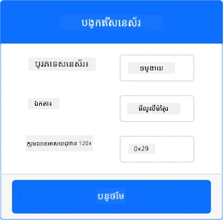
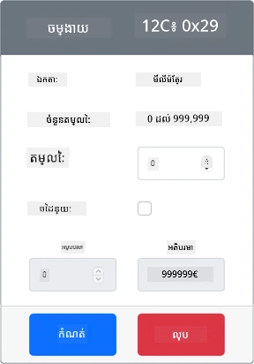

# សម្គាល់ការណិតក្បែរម៉ាស៊ីន - ឧបករណ៍ IoT ស្ម័គ្រចិត្ត

នៅផ្នែកនេះនៃមេរៀន អ្នកនឹងបន្ថែមម៉ាស៊ីនសម្គាល់ការណិតក្បែរចូលទៅឧបករណ៍ IoT ស្ម័គ្រចិត្តរបស់អ្នក ហើយអានចម្ងាយពីវា។

## ឧបករណ៍ផ្នែករឹង

ឧបករណ៍ IoT ស្ម័គ្រចិត្តនឹងប្រើម៉ាស៊ីនសម្គាល់ចម្ងាយដែលបាន​សម្រួល។

នៅក្នុងឧបករណ៍ IoT ផ្នែករឹង អ្នកនឹងប្រើម៉ាស៊ីនសម្គាល់ដែលមានម៉ូឌុលថ​ម្យុ​នមានរយៈដើម្បីសម្គាល់ចម្ងាយ។

### បន្ថែមម៉ាស៊ីនសម្គាល់ចម្ងាយទៅ CounterFit

ដើម្បីប្រើម៉ាស៊ីនសម្គាល់ចម្ងាយស្ម័គ្រចិត្ត អ្នកត្រូវបន្ថែមវាទៅកម្មវិធី CounterFit

#### ការងារ - បន្ថែមម៉ាស៊ីនសម្គាល់ចម្ងាយទៅ CounterFit

បន្ថែមម៉ាស៊ីនសម្គាល់ចម្ងាយទៅកម្មវិធី CounterFit។

1. បើកកូដ `fruit-quality-detector` នៅក្នុង VS Code ហើយធានាថាបរិស្ថានស្ម័គ្រចិត្តត្រូវបានបើកប្រើ។

1. តំឡើងកញ្ចប់ Pip បន្ថែមមួយ ដើម្បីកំចាត់ shim CounterFit ដែលអាចនិយាយទៅម៉ាស៊ីនសម្គាល់ចម្ងាយដោយការសម្រួល [កញ្ចប់ Pip rpi-vl53l0x](https://pypi.org/project/rpi-vl53l0x/), កញ្ចប់ Python ដែលធ្វើការជាមួយ [ម៉ាស៊ីនសម្គាល់ចម្ងាយ VL53L0X time-of-flight](https://wiki.seeedstudio.com/Grove-Time_of_Flight_Distance_Sensor-VL53L0X/)។ ត្រាកថាអ្នកកំពុងតំឡើងនេះពី terminal ដែលបរិស្ថានស្ម័គ្រចិត្តបានបើកសកម្ម។

    ```sh
    pip install counterfit-shims-rpi-vl53l0x
    ```

1. ត្រាក់ថាកម្មវិធីវែនបែប CounterFit កំពុងដំណើរការ

1. បង្កើតម៉ាស៊ីនសម្គាល់ចម្ងាយ៖

    1. នៅប្រអប់ *Create sensor* ក្នុងផ្ទាំង *Sensors* ចុចប្រអប់ *Sensor type* ហើយជ្រើសរើស *Distance*។

    1. ទុក *Units* ទៅជា `Millimeter`

    1. ម៉ាស៊ីនសម្គាល់នេះគឺជាម៉ាស៊ីន I<sup>2</sup>C ដូច្នេះកំណត់អាសយដ្ឋានទៅជា `0x29`។ ប្រសិនបើអ្នកប្រើម៉ាស៊ីន VL53L0X ជាផ្នែករឹង វានឹងមានអាសយដ្ឋានថេរនៅលើកន្លែងនេះ។

    1. ជ្រើសយកប៊ូតុង **Add** ដើម្បីបង្កើតម៉ាស៊ីនសម្គាល់ចម្ងាយ

    

    ម៉ាស៊ីនសម្គាល់ចម្ងាយនឹងត្រូវបានបង្កើត និងបង្ហាញនៅក្នុងបញ្ជីម៉ាស៊ីនសម្គាល់។

    

## កម្មវិធីសម្រាប់ម៉ាស៊ីនសម្គាល់ចម្ងាយ

ឧបករណ៍ IoT ស្ម័គ្រចិត្តឥឡូវនេះអាចត្រូវបានចាក់កម្មវិធីដើម្បីប្រើម៉ាស៊ីនសម្គាល់ចម្ងាយបានសម្រួល។

### ការងារ - ចាក់កម្មវិធីម៉ាស៊ីនសម្គាល់ពេលវេលាអាកាស

1. បង្កើតឯកសារថ្មីមួយនៅក្នុងគំរោង `fruit-quality-detector` មានឈ្មោះ `distance-sensor.py`។

    > 💁 វិធីងាយស្រួលក្នុងការសម្រួលឧបករណ៍ IoT ច្រើនគឺធ្វើឯកសារពីរបីបែបឯករាជ្យផ្សេងៗ ហើយរត់ពួកវាក្នុងពេលដូចគ្នា។

1. ចាប់ផ្តើមការតភ្ជាប់ទៅ CounterFit ជាមួយកូដខាងក្រោម៖

    ```python
    from counterfit_connection import CounterFitConnection
    CounterFitConnection.init('127.0.0.1', 5000)
    ```

1. បន្ថែមកូដខាងក្រោមនៅទីនេះ៖

    ```python
    import time
    
    from counterfit_shims_rpi_vl53l0x.vl53l0x import VL53L0X
    ```

    នេះនាំចូលបណ្ណាល័យ shim សម្រាប់ម៉ាស៊ីនសម្គាល់កម្រិតដែលមានពេលវេលាអាកាស VL53L0X។

1. ខាងក្រោមនេះ បន្ថែមកូដដើម្បីចូលប្រើម៉ាស៊ីនសម្គាល់៖

    ```python
    distance_sensor = VL53L0X()
    distance_sensor.begin()
    ```

    កូដនេះប្រកាសម៉ាស៊ីនសម្គាល់ចម្ងាយ ហើយចាប់ផ្តើមម៉ាស៊ីនសម្គាល់។

1. ចុងក្រោយ បន្ថែមរង្វិលអចិន្រ្តៃ​ជួយអានចម្ងាយ៖

    ```python
    while True:
        distance_sensor.wait_ready()
        print(f'Distance = {distance_sensor.get_distance()} mm')
        time.sleep(1)
    ```

    កូដនេះរង់ចាំតម្លៃដែលត្រៀមអានពីម៉ាស៊ីនសម្គាល់ ហើយបញ្ចេញវាទៅកុងសូល។

1. រត់កូដនេះ។

    > 💁 កុំភ្លេចថាឯកសារនេះមានឈ្មោះ `distance-sensor.py`! សូមរត់វាតាមរយៈ Python មិនមែន `app.py` ទេ។

1. អ្នកនឹងឃើញការវាស់ចម្ងាយបង្ហាញនៅក្នុងកុងសូល។ ផ្លាស់ប្តូរតម្លៃនៅក្នុង CounterFit ដើម្បីឃើញតម្លៃនេះផ្លាស់ប្តូរ ឬប្រើតម្លៃចៃដន្យ។

    ```output
    (.venv) ➜  fruit-quality-detector python distance-sensor.py 
    Distance = 37 mm
    Distance = 42 mm
    Distance = 29 mm
    ```

> 💁 អ្នកអាចរកមើលកូដនេះនៅក្នុងថត [code-proximity/virtual-iot-device](../../../../../4-manufacturing/lessons/4-trigger-fruit-detector/code-proximity/virtual-iot-device)។

😀 កម្មវិធីម៉ាស៊ីនសម្គាល់ការណិតក្បែររបស់អ្នកបានជោគជ័យ!

---

<!-- CO-OP TRANSLATOR DISCLAIMER START -->
**ការបដិសេធ**៖  
ឯកសារនេះបានបកប្រែដោយប្រើសេវាកម្មបកប្រែ AI [Co-op Translator](https://github.com/Azure/co-op-translator)។ ខណៈពេលយើងខិតខំសំរាប់ភាពត្រឹមត្រូវ សូមជ្រាបថាការបកប្រែដោយស្វ័យប្រវត្តិអាចមានកំហុសឬភាពមិនត្រឹមត្រូវខ្លះ។ ឯកសារដើមនៅក្នុងភាសាមូលដ្ឋានគួរត្រូវបានគិតជាអ្នកផ្គូរផ្គងទាំងស្រុង។ សម្រាប់ព័ត៌មានសំខាន់ៗ ការបកប្រែដោយមនុស្សជំនាញត្រូវបានណែនាំ។ យើងមិនទទួលខុសត្រូវចំពោះការយល់ច្រឡំ ឬការបកស្រាយមិនត្រឹមត្រូវណាមួយដែលកើតឡើងពីការប្រើប្រាស់ការបកប្រែនេះឡើយ។
<!-- CO-OP TRANSLATOR DISCLAIMER END -->