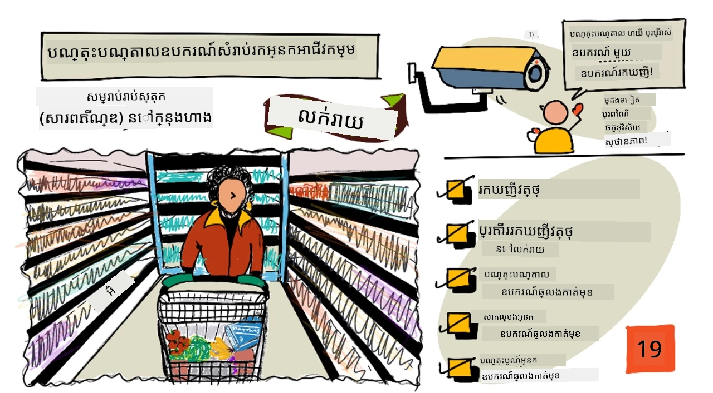
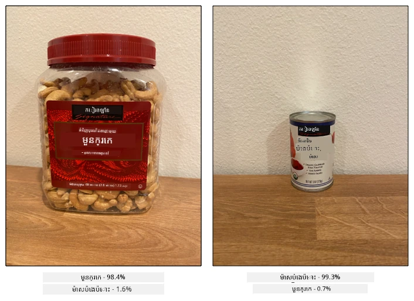
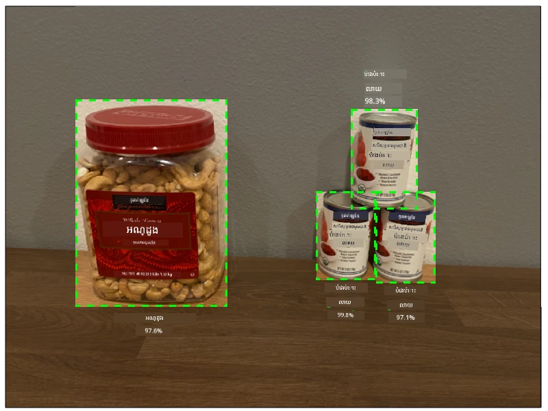
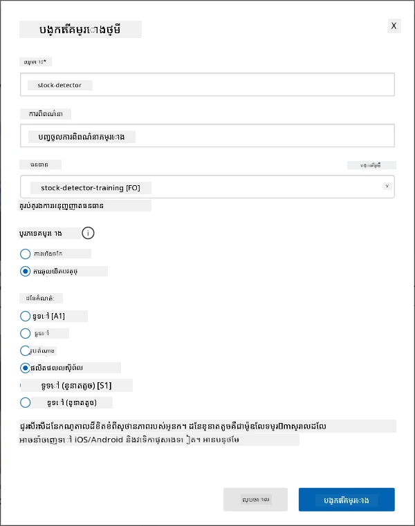
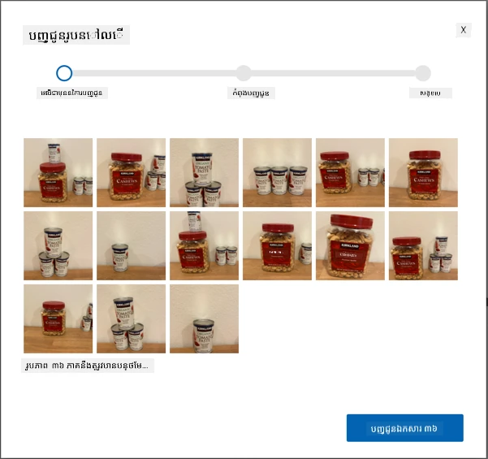
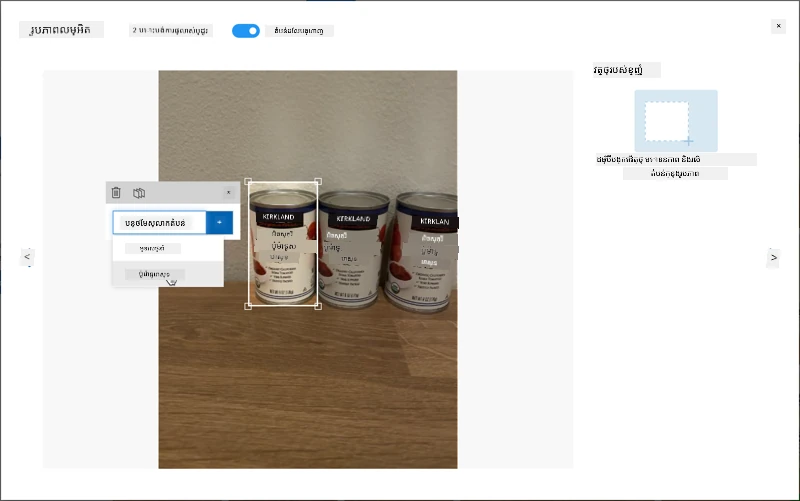
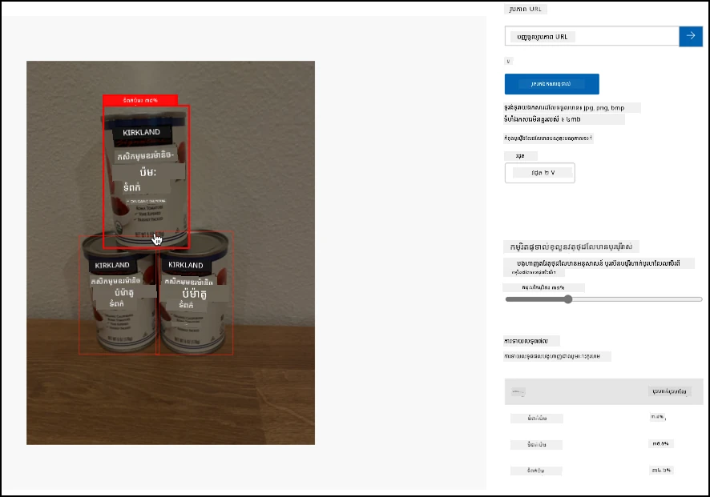

# បណ្តុះបណ្តាលឧបករណ៍ស្វែងរកស្ដុក

> មនោសញ្ចេតនា ដោយ [Nitya Narasimhan](https://github.com/nitya)។ ចុចរូបភាពសម្រាប់មើលជាប្រភេទធំជាងនេះ។

វីដេអូនេះផ្តល់ការសង្ខេបអំពីការស្វែងរកវត្ថុ (Object Detection) នៅក្នុងសេវាកម្ម Azure Custom Vision ដែលជាសេវាសម្រាប់បណ្តុះបណ្តាលក្នុងមេរៀននេះ។

> 🎥 ចុចរូបភាពខាងលើដើម្បីមើលវីដេអូ

## សំណួរសម្រាប់មុនមករៀន

[សំណួរសម្រាប់មុនមករៀន](https://black-meadow-040d15503.1.azurestaticapps.net/quiz/37)

## អំពីមេរៀន

នៅក្នុងគម្រោងមុន អ្នកបានប្រើប្រាស់ AI ដើម្បីបណ្តុះបណ្តាលឧបករណ៍ចាក់ថ្នាក់រូបភាព - ម៉ូឌែលដែលអាចបញ្ជាក់បានថារូបភាពមានអ្វីមួយដូចជាផ្លែឈើដែលបាន១់មួយ ឬមិនបានផុតពេល។ ប្រភេទម៉ូឌែល AI ផ្សេងទៀតដែលអាចប្រើជាមួយរូបភាពគឺការស្វែងរកវត្ថុ។ ម៉ូឌែលទាំងនេះមិនចាត់ថ្នាក់រូបភាពតាមស្លាកទេ ប៉ុន្តែពួកវាត្រូវបានបណ្តុះបណ្តាលដើម្បីស្គាល់វត្ថុ ហើយអាចរកវត្ថុនៅក្នុងរូបភាពបាន មិនត្រឹមតែលើកឡើងថារូបភាពមានវត្ថុនោះទេ ប៉ុន្តែបង្ហាញទីតាំងវត្ថុនោះនៅក្នុងរូបភាពផងដែរ។ នេះអនុញ្ញាតិឲ្យអ្នករាប់ចំនួនវត្ថុក្នុងរូបភាព។

នៅក្នុងមេរៀននេះ អ្នកនឹងរៀនអំពីការស្វែងរកវត្ថុ រួមមានរបៀបដែលវាអាចប្រើបានក្នុងហាងលក់ឥវ៉ាន់។ អ្នកនឹងរៀនរបៀបបណ្តុះបណ្តាលឧបករណ៍ស្វែងរកវត្ថុតាមឆមាស។

ក្នុងមេរៀននេះ យើងនឹងគ្របដណ្តប់:

* [ការស្វែងរកវត្ថុ](#ការស្វែងរកវត្ថុ)
* [ការប្រើប្រាស់ការស្វែងរកវត្ថុក្នុងការលក់រាយ](#ការប្រើប្រាស់ការស្វែងរកវត្ថុក្នុងការលក់រាយ)
* [បណ្តុះបណ្តាលឧបករណ៍ស្វែងរកវត្ថុ](#បណ្តុះបណ្តាលឧបករណ៍ស្វែងរកវត្ថុ)
* [សាកល្បងឧបករណ៍ស្វែងរកវត្ថុរបស់អ្នក](#សាកល្បងឧបករណ៍ស្វែងរកវត្ថុរបស់អ្នក)
* [បណ្តុះបណ្តាលឡើងវិញឧបករណ៍ស្វែងរកវត្ថុរបស់អ្នក](#បណ្តុះបណ្តាលឡើងវិញឧបករណ៍ស្វែងរកវត្ថុរបស់អ្នក)

## ការស្វែងរកវត្ថុ

ការស្វែងរកវត្ថុបង្កើតឡើងដោយការស្វែងរកវត្ថុខ្លះក្នុងរូបភាពដោយប្រើ AI។ វាមិនដូចឧបករណ៍ចាក់ថ្នាក់រូបភាពដែលអ្នកបានបណ្តុះបណ្តាលក្នុងគម្រោងមុនទេ។ អ្នកមិនត្រូវទាយថាស្លាកណាមួយផ្ទាល់សម្រាប់រូបភាពទាំងមូលទេ ប៉ុន្តែជួយស្វែងរកវត្ថុមួយឬច្រើននៅក្នុងរូបភាព។

### ការស្វែងរកវត្ថុ ប្រៀបធៀបទៅនឹងការចាក់ថ្នាក់រូបភាព

ការចាក់ថ្នាក់រូបភាពគឺការចាត់ថ្នាក់រូបភាពទាំងមូល - មានប្រូបាប្បារបស់ភាពដែលរូបភាពទាំងមូលផ្គូរផ្គងគ្នានឹងស្លាកនីមួយៗ។ អ្នកទទួលបានប្រូបាប្បារបស់ភាពចំពោះស្លាកគ្រប់យ៉ាងដែលបានប្រើបណ្តុះបណ្តាលម៉ូឌែល។

នៅក្នុងឧទាហរណ៍ខាងលើ មានរូបភាពពីរដែលបានចាក់ថ្នាក់ដោយម៉ូឌែលដែលបានបណ្តុះបណ្តាលដើម្បីចាក់ថ្នាក់ប៉ុង Cashew ឬដបប៉ាស្ទែប៉េងប៉ោះ។ រូបភាពដំបូងគឺប៉ុង Cashew ហើយមានលទ្ធផលពីឧបករណ៍ចាក់ថ្នាក់រូបភាព៖

| ស្លាក          | ប្រូបាប្បារបស់ភាព |
| -------------- | -----------------: |
| `cashew nuts`  | 98.4%              |
| `tomato paste` | 1.6%               |

រូបភាពទីពីរជារូបភាពដបប៉ាស្ទែប៉េងប៉ោះ និងលទ្ធផល​គឺ៖

| ស្លាក          | ប្រូបាប្បារបស់ភាព |
| -------------- | -----------------: |
| `cashew nuts`  | 0.7%               |
| `tomato paste` | 99.3%              |

អ្នកអាចប្រើតម្លៃទាំងនេះជាកម្រិតព្រំដែនដើម្បីទាយថាមានអ្វីនៅក្នុងរូបភាព។ តែបើរូបភាពមានដបក្រឡុកប៉ាស្ទែប៉េងប៉ោះច្រើន ឬមានទាំង cashew និងប៉ាស្ទែទាំងពីរតែម្តងតើតម្លៃនឹងទៅដូចម្តេច? លទ្ធផលប្រហែលជាមិនត្រូវតាមអ្វីដែលអ្នកចង់បានទេ។ នេះជាកន្លែងដែលការស្វែងរកវត្ថុចូលមកដំណើរការ។

ការស្វែងរកវត្ថុរួមមានការបណ្តុះបណ្តាលម៉ូឌែលដើម្បីស្គាល់វត្ថុ។ មិនចាំបាច់ផ្តល់រូបភាពដែលមានវត្ថុជាទាំងមូល ហើយប្រកាសថារូបភាពលើនោះជាស្លាកណាមួយទេ ប៉ុន្តែអ្នកបង្ហាញផ្នែកនៃរូបភាពដែលមានវត្ថុជាក់លាក់ និងបានដាក់ស្លាកនៅផ្នែកនោះ។ អ្នកអាចដាក់ស្លាកនៅលើវត្ថុតែមួយក្នុងរូបភាព ឬច្រើនវត្ថុបាន។ ដូច្នេះម៉ូឌែលនឹងរៀនអំពីរូបរាងវត្ថុដដែល មិនមែនគ្រាន់តែរៀនពីរូបភាពដែលមានវត្ថុនោះទេ។

ពេលអ្នកប្រើវាទាយរូបភាព ភាគច្រើនអ្នកមិនទទួលបញ្ជីស្លាកនិងភាគរយវិញទេ ប៉ុន្តែអ្នកទទួលបញ្ជីវត្ថុដែលបានរកឃើញ ដោយមានប្រអប់កំណត់ទំហំជុំវិញវត្ថុនោះ ហើយមានភាគរយសម្គាល់ថាវត្ថុនោះផ្គូរផ្គង់នឹងស្លាកដែលបានផ្ដល់។

> 🎓 *ប្រអប់កំណត់ទំហំ* គឺជាប្រអប់ជុំវិញវត្ថុ។

រូបភាពខាងលើមានទាំងប៉ុង cashew និងដបប៉ាស្ទែប៉េងប៉ោះបីដប។ ឧបករណ៍ស្វែងរកវត្ថុបានរកឃើញប៉ុង cashew ហើយឥតលំបាកបង្ហាញប្រអប់កំណត់ដែលមានប៉ុង cashew ជាមួយភាគរយនៃសមាគមភាពថាប្រអប់នោះមានវត្ថុ - ក្នុងករណីនេះ 97.6%។ ឧបករណ៍ស្វែងរកវត្ថុ ក៏បានរកឃើញដបប៉ាស្ទែប៉េងប៉ោះបីដប ហើយផ្ដល់ប្រអប់កំណត់បីប្រអប់ចែងផ្សេងៗ សម្រាប់ដបដែលបានរកឃើញក្នុងមួយ និងមានភាគរយបង្ហាញសម្គាល់ថាប្រអប់នីមួយមួយមានដបប៉ាស្ទែប៉េងប៉ោះ។

✅ គិតពីស្ថានการณ์ខុសគ្នាដែលអ្នកអាចចង់ប្រើម៉ូឌែល AI គ្រប់គ្រងរូបភាព។ តើម៉ូឌែលណាដែលត្រូវការការចាក់ថ្នាក់ ហើយម៉ូឌែលណាត្រូវការការស្វែងរកវត្ថុ?

### របៀបដែលការស្វែងរកវត្ថុដំណើរការ

ការស្វែងរកវត្ថុប្រើម៉ូឌែល ML ស្មុគស្មាញ។ ម៉ូឌែលទាំងនេះដំណើរការ ដោយបែងចែករូបភាពជាច្រើនក្រឡាចត្រង្គ ហើយពិនិត្យមើលថាតំបន់កណ្តាលនៃប្រអប់កំណត់ ទាក់ទងជាកណ្តាលរូបភាពដែលផ្គូរផ្គងទីតាំងនឹងរូបភាពណាមួយដែលបានប្រើបណ្តុះបណ្តាលម៉ូឌែល។ អ្នកអាចគិតថាវាជាការដំណើរការឧបករណ៍ចាក់ថ្នាក់រូបភាពលើចំណុចផ្សេងៗនៃរូបភាពដើម្បីស្វែងរកតំណាង។

> 💁 នេះគឺជាការបង្ហាញខ្លីៗយ៉ាងខ្លី។ មានបច្ចេកទេសជាច្រើនសម្រាប់ការស្វែងរកវត្ថុ ហើយអ្នកអាចអានបន្ថែមអំពីវានៅលើ [ទំព័រការស្វែងរកវត្ថុនៅ Wikipedia](https://wikipedia.org/wiki/Object_detection) ។

មានម៉ូឌែលជាច្រើនដែលអាចធ្វើការស្វែងរកវត្ថុបាន។ ម៉ូឌែលមួយដែលល្បីឈ្មោះគឺ [YOLO (You only look once)](https://pjreddie.com/darknet/yolo/), ដែលលឿនបំផុត និងអាចស្វែងរកវត្ថុ 20 ប្រភេទផ្សេងៗ ដូចជាមនុស្ស ទៅនេសាទ កែវភ្លើង និងឡាន។

✅ អានអំពីម៉ូឌែល YOLO នៅ [pjreddie.com/darknet/yolo/](https://pjreddie.com/darknet/yolo/)

ម៉ូឌែលស្វែងរកវត្ថុអាចបណ្តុះឡើងវិញដោយប្រើប្រាស់ការរៀនផ្ទេរដើម្បីស្វែងរកវត្ថុតាមការរចនាឯកសារ។

## ការប្រើប្រាស់ការស្វែងរកវត្ថុក្នុងការលក់រាយ

ការស្វែងរកវត្ថុមានប្រយោជន៍ជាច្រើនក្នុងការលក់រាយ។ ពីរបៀប មួយចំនួនរួមមាន៖

* **ពិនិត្យស្តុក និងរាប់ចំនួន** - ស្គាល់ពេលដែលស្តុកតិចលើធ្នើ។ ប្រសិនបើស្តុកតិចពេក វាអាចផ្ញើការជូនដំណឹងទៅបុគ្គលិកឬរ៉ូបូតដើម្បីបំបែកស្តុកឡើងវិញ។
* **ការស្វែងរកម៉ាស** - នៅហាងដែលមានគោលការណ៍ស្លៀកម៉ាស្កាកាលឆមាសសុខភាពសាធារណៈ ការស្វែងរកវត្ថុអាចច្បាស់រាល់មនុស្សដែលពាក់ម៉ាស និងមិនពាក់។
* **ការគិតថ្លៃសំរាប់ការជាវដោយស្វ័យប្រវត្តិ** - ស្វែងរកទំនិញកាត់ចេញពីធ្នើហាងដោយស្វ័យប្រវត្តិ ហើយគិតថ្លៃអតិថិជនយ៉ាងត្រឹមត្រូវ។
* **ការស្វែងរកហានិភ័យ** - ស្គាល់វត្ថុដែលខូចខាតលើជាន់ ឬរូបភាពរាវដែលរំលាយកខ្វក់ ដើម្បីរំលឹកបុគ្គលបោសសំអាត។

✅ ស្រាវជ្រាវ៖ តើមានការប្រើប្រាស់ជាករណីផ្សេងទៀតសម្រាប់ការស្វែងរកវត្ថុក្នុងការលក់រាយទៀតទេ?

## បណ្តុះបណ្តាលឧបករណ៍ស្វែងរកវត្ថុ

អ្នកអាចបណ្តុះបណ្តាលឧបករណ៍ស្វែងរកវត្ថុដោយប្រើ Custom Vision ដូចជារបៀបដែលអ្នកបានបណ្តុះបណ្តាលឧបករណ៍ចាក់ថ្នាក់រូបភាព។

### មុខងារ - បង្កើតឧបករណ៍ស្វែងរកវត្ថុ

1. បង្កើត Resource Group សម្រាប់គម្រោងនេះឈ្មោះ `stock-detector`

1. បង្កើត Custom Vision training resource មួយដោយឥតគិតថ្លៃ និង Custom Vision prediction resource មួយដោយឥតគិតថ្លៃនៅក្នុង resource group `stock-detector`។ ឈ្មោះថា `stock-detector-training` និង `stock-detector-prediction`។

    > 💁 អ្នកអាចមានតែ resource training និង resource prediction ឥតគិតថ្លៃមួយតែប៉ុណ្ណោះ ដូច្នេះសូមប្រាកដថាអ្នកបានសម្អាតគម្រោងរបស់អ្នកពីមេរៀនមុនៗ។

    > ⚠️ អ្នកអាចយោងទៅតាម [ការណែនាំសម្រាប់បង្កើត resource training និង prediction ពីគម្រោង ៤ មេរៀន ១ ប្រសិនបើចាំបាច់](../../../4-manufacturing/lessons/1-train-fruit-detector/README.md#task---create-a-cognitive-services-resource)។

1. បើកទំព័រ Custom Vision នៅ [CustomVision.ai](https://customvision.ai) ហើយចូលប្រើជាមួយគណនី Microsoft ដែលអ្នកប្រើសម្រាប់គណនី Azure របស់អ្នក។

1. តាមដាន [ផ្នែកបង្កើតគម្រោងថ្មី ក្នុងទំព័រប្រើប្រាស់លឿនបង្កើតឧបករណ៍ស្វែងរកវត្ថុក្នុងឯកសារ Microsoft Docs](https://docs.microsoft.com/azure/cognitive-services/custom-vision-service/get-started-build-detector?WT.mc_id=academic-17441-jabenn#create-a-new-project) ដើម្បីបង្កើតគម្រោង Custom Vision ថ្មី។ UI អាចប្ដូរប្រចាំ ហើយឯកសារនេះជាការយោងថ្មីជានិច្ច។

    ឈ្មោះគម្រោងថា `stock-detector`។

    នៅពេលបង្កើតគម្រោង អ្នកត្រូវប្រាកដប្រើ resource `stock-detector-training` ដែលអ្នកបានបង្កើតពីមុន។ ប្រភេទគម្រោងជ្រើសរើសជា *Object Detection* និងដែនកំណត់ជ្រើសរើសជា *Products on Shelves*។

    

    ✅ ដែនកំណត់ *products on shelves* គឺមានគោលបំណងជាក់លាក់សម្រាប់ស្វែងរកស្តុកលើធ្នើហាង។ អានបន្ថែមអំពីដែនកំណត់ផ្សេងៗនៅ [ឯកសារជ្រើសរើសដែនកំណត់លើ Microsoft Docs](https://docs.microsoft.com/azure/cognitive-services/custom-vision-service/select-domain?WT.mc_id=academic-17441-jabenn#object-detection)

✅ ចំណាយពេលស្វែងរក UI របស់ Custom Vision សម្រាប់ឧបករណ៍ស្វែងរកវត្ថុរបស់អ្នក។

### មុខងារ - បណ្តុះបណ្តា​ឡឧបករណ៍ស្វែងរកវត្ថុរបស់អ្នក

ដើម្បីបណ្តុះម៉ូឌែល អ្នកត្រូវការរូបភាពដែលមានវត្ថុដែលអ្នកចង់ស្វែងរក។

1. ប្រមើល​រូបភាពដែលមានវត្ថុស្វែងរក។ អ្នកត្រូវការអយ្យាករណ៍រូបភាពយ៉ាងតិច 15 រូបភាពដែលមានវត្ថុពីមุมមាត្រចម្ងាយនិងលក្ខខ័ណ្ឌពន្លឺខុសៗគ្នា ប៉ុន្តែល្អបំផុតកាន់តែច្រើន។ ឧបករណ៍នេះប្រើដែនកំណត់ *Products on shelves* ដូច្នេះសូមចូលរូបភាពជាមួយវត្ថុនៅលើធ្នើហាង។ អ្នកនឹងត្រូវការរូបភាពមួយចំនួនសម្រាប់សាកល្បង ម៉ាស៊ីន។ ប្រសិនបើអ្នកកំពុងស្វែងរកវត្ថុច្រើន អ្នកនឹងចង់បានរូបភាពសាកល្បងដែលមានវត្ថុទាំងអស់ក្នុងរូបភាព។

    > 💁 រូបភាពដែលមានវត្ថុជាច្រើន គិតចំពោះរូបភាព 15 នៃវត្ថុទាំងអស់ក្នុងរូបភាព។

    រូបភាពរបស់អ្នកគួរតែជាប្រភេទ png ឬ jpeg ដែលតូចជាង 6MB។ ប្រសិនបើអ្នកប្រើ iPhone ពួកវាអាចជារូបភាព HEIC resolution ខ្ពស់ ដូច្នេះត្រូវបម្លែង និងបង្រួមទំហំ។ រូបភាពច្រើននឹងល្អ ហើយអ្នកគួរតែមានចំនួនស្រដៀងគ្នានៃផ្លែឈើស្រូបពេញ និងមិនពេញ។

    ម៉ូឌែលនេះបានរចនាសម្រាប់ផលិតផលលើធ្នើហាង ដូច្នេះសូមព្យាយាមថតរូបវត្ថុជាមួយធ្នើហាង។

    អ្នកអាចរកឃើញរូបភាពគំរូដែលអាចប្រើបាននៅក្នុងថត [images](../../../../../5-retail/lessons/1-train-stock-detector/images) របស់ cashew nuts និង tomato paste។

1. តាមដាន [ផ្នែកផ្ទុកឡើងនិងដាក់ស្លាករូបភាព ក្នុងឯកសារបង្កើតឧបករណ៍ស្វែងរកវត្ថុ Microsoft docs](https://docs.microsoft.com/azure/cognitive-services/custom-vision-service/get-started-build-detector?WT.mc_id=academic-17441-jabenn#upload-and-tag-images) ដើម្បីផ្ទុកឡើងរូបភាពសម្រាប់បណ្តុះបណ្តាល។ បង្កើតស្លាកដែលសមរម្យសម្រាប់ប្រភេទវត្ថុដែលអ្នកចង់ស្វែងរក។

    

    នៅពេលអ្នកគូរប្រអប់កំណត់វត្ថុ សូមព្យាយាមស្រាប់ឲ្យចេតនា នៅជុំវិញវត្ថុយ៉ាងណាស់។ វាអាចចំណាយពេលក្នុងការចម្រាស់រូបភាពទាំងអស់ ប៉ុន្តែឧបករណ៍នឹងស្វែងរកប្រអប់កំណត់ដែលគិតថាត្រឹមត្រូវ ធ្វើឱ្យរហ័ស។

    

    > 💁 ប្រសិនបើអ្នកមានរូបភាពលើស 15 សម្រាប់វត្ថុនីមួយៗ អ្នកអាចបណ្តុះឲ្យបាន 15 រួចប្រើមុខងារ **Suggested tags**។ វានឹងប្រើម៉ូឌែលដែលបានបណ្តុះស្រាប់ ដើម្បីស្វែងរកវត្ថុនៅក្នុងរូបភាពដែលមិនទាន់បានដាក់ស្លាក។ អ្នកអាចបញ្ចាក់ឲ្យលទ្ធផលមើលល្អ ឬបដិសេធ ហើយគូរប្រអប់កំណត់ឡើងវិញ។ វាសន្មត់ថាប្រាក់ប្រែពេលបានច្រើន។

1. តាមដាន [ផ្នែកបណ្តុះឧបករណ៍ស្វែងរកវត្ថុ ក្នុងឯកសារបង្កើតឧបករណ៍ស្វែងរកវត្ថុ Microsoft docs](https://docs.microsoft.com/azure/cognitive-services/custom-vision-service/get-started-build-detector?WT.mc_id=academic-17441-jabenn#train-the-detector) ដើម្បីបណ្តុះឧបករណ៍ស្វែងរកវត្ថុដោយប្រើរូបភាពដែលបានដាក់ស្លាក។

    អ្នកនឹងទទួលបានជម្រើសប្រភេទបណ្តុះបណ្តាល។ ជ្រើស **Quick Training**។

ឧបករណ៍ស្វែងរកវត្ថុ នឹងបណ្តុះបណ្តាល។ វាត្រូវពេលប៉ុន្មាននាទីដើម្បីបញ្ចប់បណ្តុះបណ្តាល។

## សាកល្បងឧបករណ៍ស្វែងរកវត្ថុរបស់អ្នក

បន្ទាប់ពីឧបករណ៍ស្វែងរកវត្ថុរបស់អ្នកបានបណ្តុះបណ្តាល អ្នកអាចសាកល្បងវា ដោយផ្តល់រូបភាពថ្មីសម្រាប់ស្វែងរកវត្ថុ។

### មុខងារ - សាកល្បងឧបករណ៍ស្វែងរកវត្ថុរបស់អ្នក

1. ប្រើប៊ូតុង **Quick Test** ដើម្បីផ្ទុកឡើងរូបភាពសាកល្បង និងផ្ទៀងផ្ទាត់ថាវត្ថុត្រូវបានរកឃើញ។ ប្រើរូបភាពសាកល្បងដែលអ្នកបានបង្កើតពីមុន មិនត្រូវប្រើរូបភាពដែលបានប្រើសម្រាប់បណ្តុះបណ្តាលទេ។

    

1. សាកល្បងរូបភាពសាកល្បងទាំងអស់ដែលអ្នកអាចចូលដំណើរការ និងសំគាល់អត្រាព្រាបៃនៃការរកឃើញ។

## បណ្តុះបណ្តាលឡើងវិញឧបករណ៍ស្វែងរកវត្ថុរបស់អ្នក

ពេលអ្នកសាកល្បងឧបករណ៍ស្វែងរកវត្ថុ វាអាចមិនផ្តល់លទ្ធផលដូចដែលអ្នករំពឹងទេ ដូចគ្នានឹងឧបករណ៍ចាក់ថ្នាក់រូបភាពក្នុងគម្រោងមុនៗ។ អ្នកអាចបង្កើនប្រសិទ្ធភាពឧបករណ៍ដោយបណ្តុះបណ្តាលឡើងវិញ ជាមួយរូបភាពដែលវាព្យាយាមមិនបានត្រឹមត្រូវ។

រៀងរាល់ពេលអ្នកធ្វើការទាយប្រើជម្រើស quick test, រូបភាព និងលទ្ធផលនឹងត្រូវរក្សាទុក។ អ្នកអាចប្រើរូបភាពទាំងនេះសម្រាប់បណ្តុះបណ្តាលឡើងវិញម៉ូឌែលរបស់អ្នក។

1. ប្រើតំបន់ប៊ូតុង **Predictions** ដើម្បីស្វែងរករូបភាពដែលបានប្រើសាកល្បង

1. បញ្ជាក់ការស្វែងរកត្រឹមត្រូវ យកចេញឱ្យបានវត្ថុដែលកំហុស ហើយបន្ថែមវត្ថុដែលអត់បង្ហាញ។

1. បណ្តុះបណ្តាលឡើងវិញ និងសាកល្បងម៉ូឌែលវិញ។

---

## 🚀 도전

តើមានអ្វីកើតឡើង ប្រសិនបើអ្នកប្រើឧបករណ៍ស្វែងរកវត្ថុជាមួយផលិតផលដែលមានរូបរាងស្រដៀងគ្នា ដូចជាដបអ្នកស្ដុកដូចគ្នារបស់ប៉ាស្ទែប៉េងប៉ោះ និងប៉េងប៉ោះចែករំលែក?
បើអ្នកមានវត្ថុដែលមានរូបរាងស្រដៀងគ្នា សូមព្យាយាមតេស្តវាដោយបន្ថែមរូបភាពរបស់វាទៅក្នុងកម្មវិធីរកវត្ថុរបស់អ្នក។

## សំណួរបន្ទាប់ពីមេរៀន

[សំណួរបន្ទាប់ពីមេរៀន](https://black-meadow-040d15503.1.azurestaticapps.net/quiz/38)

## ការត្រួតពិនិត្យ និងការសិក្សាផ្ទាល់ខ្លួន

* នៅពេលដែលអ្នកបណ្តុះបណ្តាលកម្មវិធីរកវត្ថុរបស់អ្នក អ្នកនឹងបានឃើញតម្លៃសម្រាប់ *Precision*, *Recall*, និង *mAP* ដែលវាយតម្លៃម៉ូដែលដែលបានបង្កើត។ សូមអានអំពីតម្លៃទាំងនេះដោយប្រើ [ផ្នែក Evaluate the detector ក្នុងការចាប់ផ្តើមបង្កើតកម្មវិធីរកវត្ថុ នៅលើឯកសាររបស់ Microsoft](https://docs.microsoft.com/azure/cognitive-services/custom-vision-service/get-started-build-detector?WT.mc_id=academic-17441-jabenn#evaluate-the-detector)
* អានបន្ថែមអំពីការរកវត្ថុនៅលើ [ទំព័រ Object detection នៅលើវីគីភីឌា](https://wikipedia.org/wiki/Object_detection)

## ការចាត់តាំង

[ធៀបតំបន់](assignment.md)

---

<!-- CO-OP TRANSLATOR DISCLAIMER START -->
**ការបញ្ជាក់**៖  
ឯកសារនេះត្រូវបានបកប្រែដោយប្រើសេវាកម្មបកប្រែ AI [Co-op Translator](https://github.com/Azure/co-op-translator)។ ខណៈពេលដែលយើងខិតខំទទួលបានភាពត្រឹមត្រូវ សូមយល់ព្រមថាការបកប្រែដោយស្វ័យប្រវត្តិអាចមានកំហុសឬភាពមិនត្រឹមត្រូវ។ ឯកសារដើមនៅក្នុងភាសាមូលដ្ឋានរបស់វាគួរតែត្រូវបានពិចារណាថាជា ប្រភពផ្លូវការជាដើម។ សម្រាប់ព័ត៌មានសំខាន់ៗ ការបកប្រែដោយមនុស្សដ៏មានជំនាញគឺបានផ្តល់អនាគតល្អជាង។ យើងមិនទទួលខុសត្រូវចំពោះការយល់ច្រឡំ ឬការបកស្រាយខុសពីការប្រើប្រាស់ការបកប្រែនេះឡើយ។
<!-- CO-OP TRANSLATOR DISCLAIMER END -->