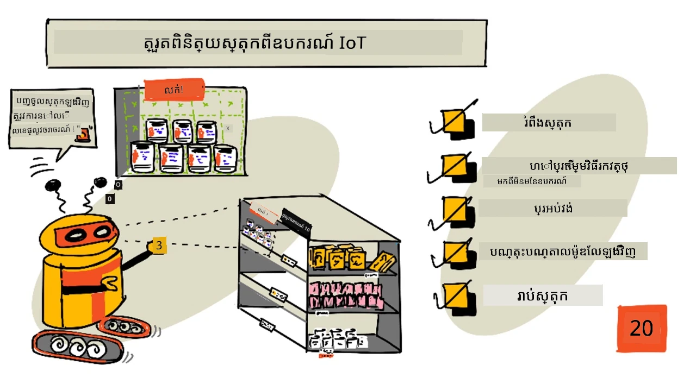
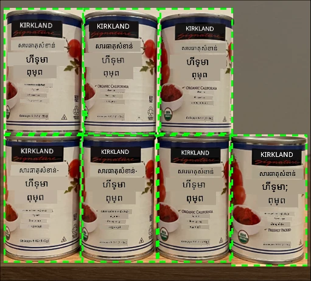
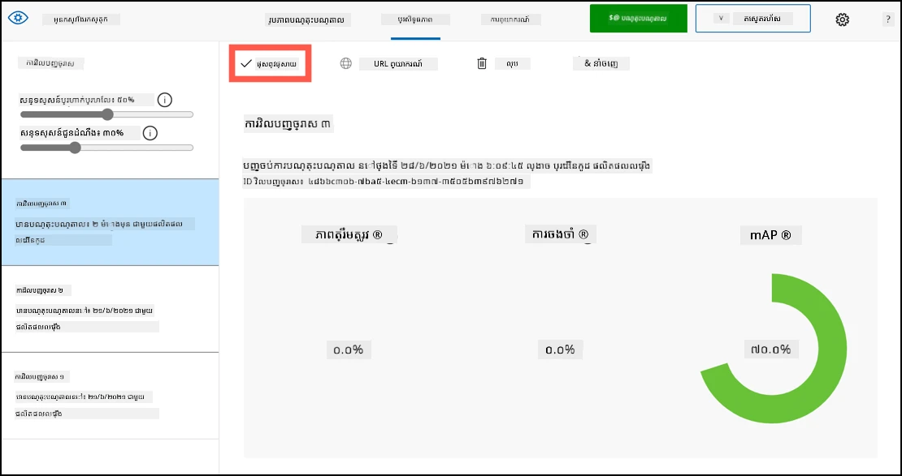
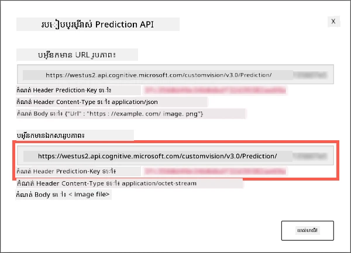
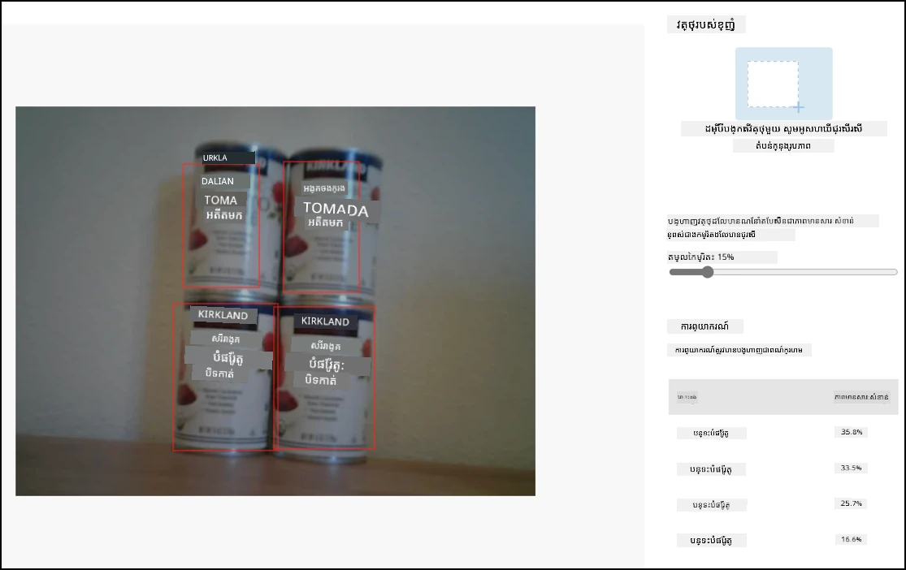
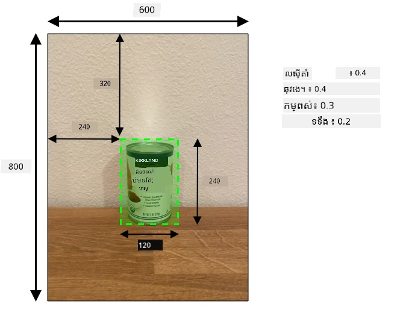
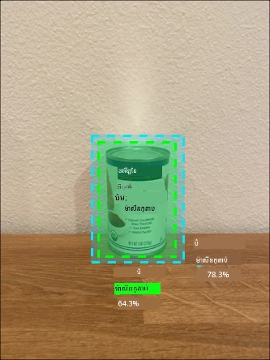

# ពិនិត្យ​ស្តុក​ពីឧបករណ៍ IoT



> សេរ៉ុងដោយ [Nitya Narasimhan](https://github.com/nitya)។ ចុចលើរូបភាពសម្រាប់ទំហំធំជាងនេះ។

## វិញ្ញាសាមុនមេរៀន

[វិញ្ញាសាមុនមេរៀន](https://black-meadow-040d15503.1.azurestaticapps.net/quiz/39)

## ការណែនាំ

ក្នុងមេរៀនមុន អ្នកបានរៀនអំពីការប្រើប្រាស់បច្ចេកវិទ្យាស្វែងរកវត្ថុផ្សេងៗនៅក្នុងហាងលក់រាយ។ អ្នកក៏បានរៀនវិធីបណ្តុះបណ្តាលកម្មវិធីស្វែងរកវត្ថុ ដើម្បីស្គាល់ស្តុក។ នៅក្នុងមេរៀននេះ អ្នកនឹងរៀនវិធីប្រើកម្មវិធីស្វែងរកវត្ថុរបស់អ្នកពីឧបករណ៍ IoT របស់អ្នក ដើម្បីរាប់ស្តុក។

ក្នុងមេរៀននេះ យើងនឹងគ្របដណ្តប់៖

* [ការរាប់ស្តុក](#ការរាប់ស្តុក)
* [ហៅកម្មវិធីស្វែងរកវត្ថុពីឧបករណ៍ IoT របស់អ្នក](#ហៅកម្មវិធីស្វែងរកវត្ថុពីឧបករណ៍-iot-របស់អ្នក)
* [ប្រអប់ព្រំដែន](#ប្រអប់ព្រំដែន)
* [បណ្ដុះបណ្ដាលម៉ូឌែលម្តងទៀត](#បណ្ដុះបណ្ដាលម៉ូឌែលម្តងទៀត)
* [រាប់ស្តុក](#រាប់ស្តុក)

> 🗑 នេះជាមេរៀនចុងក្រោយនៅក្នុងគម្រោងនេះ ដូច្នេះបន្ទាប់ពីបញ្ចប់មេរៀននិងការងារផ្សេងៗ កុំភ្លេចសំអាតសេវាកម្មមេឃរបស់អ្នក។ អ្នកនឹងត្រូវការសេវាកម្មទាំងនេះសម្រាប់បញ្ចប់ការងារ ដូច្នេះសូមធ្វើការបញ្ចប់នោះជាមុន។
>
> អាចយោងទៅ [មគ្គុទ្ទេសក៍សំអាតគម្រោងរបស់អ្នក](../../../clean-up.md) ប្រសិនបើត្រូវការច្បាប់បន្ថែម។

## ការរាប់ស្តុក

កម្មវិធីស្វែងរកវត្ថុអាចប្រើសម្រាប់ពិនិត្យស្តុក ដោយអាចរាប់ស្តុក ឬធ្វើអោយប្រាកដថាស្តុកនៅតំបន់ត្រូវការ។ ឧបករណ៍ IoT ដែលមានកាមេរ៉ាអាចត្រូវបានដាក់ជុំវិញហាងផ្ទះដើម្បីត្រួតពិនិត្យស្តុក ចាប់ផ្តើមពីតំបន់ក្តៅកណ្តាលដែលការបញ្ចូលស្តុកសំខាន់ដូចជាតំបន់ដែលមានទំនិញតម្លៃខ្ពស់ចំនួនតិច។

ឧទាហរណ៍ បើកាមេរ៉ាមួយបង្ហាញទៅកាន់តុសម្រាប់ដាក់ទំនិញអាចដាក់កំប៉ុងប៉េងប៉ោះបាន ៨កំប៉ុង ហើយកម្មវិធីស្វែងរកវត្ថុគ្រាន់តែរកឃើញ ៧កំប៉ុង តើមានកំប៉ុងមួយខ្វះហើយត្រូវបានបញ្ចូលស្តុកវិញ។



ក្នុងរូបភាពខាងលើ កម្មវិធីស្វែងរកវត្ថុបានរកឃើញកំប៉ុងប៉េងប៉ោះ ៧កំប៉ុងនៅលើតុដែលអាចដាក់បាន ៨កំប៉ុង។ ឧបករណ៍ IoT អាចបញ្ជូនចេញសារជូនដំណឹងអំពីការត្រូវបញ្ចូលស្តុកវិញ ដោយផ្តល់ពត៌មានអំពីទីតាំងនៃទំនិញដែលខ្វះ ប៉ុន្តែនៅពេលដែលអ្នកប្រើរូបមន្តក្នុងការបញ្ចូលស្តុកដោយរូបមន្តក៏ដូចជារ៉ូបូត បាន។

> 💁 ពាក់ព័ន្ធនឹងហាង និងពេញនិយមនៃទំនិញ ការបញ្ចូលស្តុកវិញអាចមិនកើតឡើង ប្រសិនបើមានកំប៉ុងតែ ១កំប៉ុងគត់ខ្វះ។ អ្នកត្រូវតែបង្កើតរូបមន្តសម្រាប់កំណត់ពេលវេលាក្នុងការបញ្ចូលស្តុកវិញយោងលើផលិតផល អតិថិជន និងស្ដង់ដារផ្សេងៗ។

✅ តើនៅក្នុងរឿងផ្សេងទៀត អ្នកអាចបញ្ចូលការស្វែងរកវត្ថុ និងរ៉ូបូតរួមគ្នាបាននៅថ្ងៃណា?

ខ្លះពេលស្តុកខុសគ្នាអាចស្ថិតនៅលើតុ។ នេះអាចជាកំហុសមនុស្សពេលបញ្ចូលស្តុក ឬអតិថិជនប្ដូរយោបល់លើការជាវ ហើយដាក់ទំនិញត្រឡប់តទៅនៅកន្លែងស្រេចដោយដំបូង។ នៅពេលជាទំនិញដែលមិនស្អិតប្រើដូចជាសម្ភារៈកំប៉ុង នេះគឺជាការរំខាន។ ប៉ុន្តែបើជាទំនិញដែលស្អិតប្រើដូចជាផលិតផលឆ្អឹង រឺផលិតផលត្រូវបានផ្ទុកត្រជាក់ នេះអាចបង្ហាញថាទំនិញមិនអាចលក់បានទៀត ពីព្រោះមិនអាចបញ្ជាក់រយៈពេលដែលវាចេញពីទូរទឹកកកឡើងវិញ។

កម្មវិធីស្វែងរកវត្ថុអាចប្រើសម្រាប់រកឃើញវត្ថុដែលមិនរំពឹងទុក ហើយបញ្ជូនការជូនដំណឹងទៅមនុស្សឬរ៉ូបូត ដើម្បីនាំវត្ថុនោះត្រឡប់ទៅតំបន់ត្រឹមត្រូវ។


ក្នុងរូបភាពខាងលើ កំប៉ុងប៊ីប៊ីកិនត្រូវបានដាក់នៅលើតុជាប់ជាមួយដបទំនិញប៉េងប៉ោះ។ កម្មវិធីស្វែងរកវត្ថុនេះបានរកឃើញអោយឧបករណ៍ IoT អាចជូនដំណឹងអ្នកមនុស្សឬរ៉ូបូតដើម្បីត្រឡប់កំប៉ុងទៅកន្លែងត្រឹមត្រូវ។

## ហៅកម្មវិធីស្វែងរកវត្ថុពីឧបករណ៍ IoT របស់អ្នក

កម្មវិធីស្វែងរកវត្ថុដែលអ្នកបានបណ្ដុះបណ្ដាលនៅមេរៀនមុន អាចហៅពីឧបករណ៍ IoT របស់អ្នក។

### បេសកកម្ម - បោះពុម្ពផ្សាយការបង្វឹកមួយនៃកម្មវិធីស្វែងរកវត្ថុរបស់អ្នក

ការបង្វឹកត្រូវបានបោះពុម្ពផ្សាយពីទីក្រុងច្រកផ្លូវ Custom Vision។

1. បើកទីក្រុង Custom Vision នៅ [CustomVision.ai](https://customvision.ai) និងចូលប្រើប្រាស់ ប្រសិនបើអ្នកមិនទាន់បានបើកកន្លែងនេះ។ បន្ទាប់មក បើកគម្រោង `stock-detector` របស់អ្នក។

1. ជ្រើសផ្ទាំង **Performance** ពីជម្រើសនៅខាងលើ

1. ជ្រើសការបង្វឹកថ្មីបំផុតពីបញ្ជី *Iterations* នៅផ្នែកមួយ

1. ជ្រើសប៊ូតុង **Publish** សម្រាប់ការបង្វឹកនោះ

    

1. នៅក្នុងប្រអប់ *Publish Model* កំណត់ *Prediction resource* ទៅជាសកម្មភាព `stock-detector-prediction` ដែលអ្នកបានបង្កើតនៅមេរៀនមុន។ រក្សាឈ្មោះជា `Iteration2` ហើយជ្រើសប៊ូតុង **Publish**។

1. បន្ទាប់ពីបានបោះពុម្ពផ្សាយ រើសប៊ូតុង **Prediction URL**។ វានឹងបង្ហាញព័ត៌មានលម្អិតរបស់ API កម្មវិធីទាយទំនង ហើយអ្នកនឹងត្រូវការព័ត៌មានទាំងនេះ ដើម្បីហៅម៉ូឌែលពីឧបករណ៍ IoT របស់អ្នក។ ផ្នែកក្រោមមានស្លាក *If you have an image file* ដែលជាព័ត៌មានដែលអ្នកចង់បាន។ ថតចម្លង URL ដែលបង្ហាញនោះ ដែលវានឹងមានរូបរាងដូចជា៖

    ```output
    https://<location>.api.cognitive.microsoft.com/customvision/v3.0/Prediction/<id>/detect/iterations/Iteration2/image
    ```

    ដែល `<location>` គឺជាតំបន់ដែលអ្នកប្រើបង្កើតកន្លែងអ្នកបានបង្កើត Custom Vision, ហើយ `<id>` គឺជា ID មួយវែងប្រើតួអក្សរនិងលេខ។

    ក៏ដូចជាថតចម្លងតម្លៃ *Prediction-Key* ផងដែរ។ នេះជាគ្រាប់ក្តារសុវត្ថិភាពដែលអ្នកត្រូវផ្ញើពេលហៅម៉ូឌែល។ តែអេភ្លីខេស្យុងដែលផ្ញើក្តារនេះត្រូវបានអនុញ្ញាតឲ្យប្រើម៉ូឌែល តែអេភ្លីខេស្យុងផ្សេងទៀតនឹងត្រូវច្រានចោល។

    

✅ នៅពេលការបង្វឹកថ្មីត្រូវបានបោះពុម្ពផ្សាយ វានឹងមានឈ្មោះខុសគ្នា តើអ្នកគិតយ៉ាងដូចម្តេចដើម្បីផ្លាស់ប្តូរការបង្វឹកដែលឧបករណ៍ IoT ប្រើ?

### បេសកកម្ម - ហៅកម្មវិធីស្វែងរកវត្ថុពីឧបករណ៍ IoT របស់អ្នក

អនុវត្តតាមមគ្គុទេសក៍ខាងក្រោម ដើម្បីប្រើកម្មវិធីស្វែងរកវត្ថុពីឧបករណ៍ IoT របស់អ្នក៖

* [Arduino - Wio Terminal](wio-terminal-object-detector.md)
* [កុំព្យូទ័រជាបន្ទះតែមួយ - Raspberry Pi/ឧបករណ៍មេឌីយ៉ា](single-board-computer-object-detector.md)

## ប្រអប់ព្រំដែន

ពេលអ្នកប្រើកម្មវិធីស្វែងរកវត្ថុ អ្នកមិនត្រឹមតែទទួលបានវត្ថុដែលរកឃើញជាមួយនឹងស្លាក និងប្រភេទប៉ុណ្ណា នោះទេ ប៉ុន្តែអ្នកក៏ទទួលបានប្រអប់ព្រំដែននៃវត្ថុផងដែរ។ វាផ្ដល់កំណត់ទីតាំងពិតនៃវត្ថុដែលបានរកឃើញជាមួយនឹងប្រភេទប៉ុណ្ណា។

> 💁 ប្រអប់ព្រំដែនគឺជាប្រអប់មួយដែលកំណត់តំបន់ដែលមានវត្ថុដែលបានរកឃើញ ហើយបញ្ជាក់ព្រំដែនសម្រាប់វត្ថុនោះ។

លទ្ធផលនៃការទាយទំនងនៅផ្ទាំង **Predictions** ក្នុង Custom Vision មានប្រអប់ព្រំដែនគូរនៅលើរូបភាពដែលបានផ្ញើសម្រាប់ការទាយទំនង។



នៅក្នុងរូបភាពខាងលើ បានរកឃើញកំប៉ុងប៉េងប៉ោះ ៤កំប៉ុង។ ក្នុងលទ្ធផលមានប្រអប់ក្រហមគូរនៅលើរូបភាពនីមួយៗដែលបានរកឃើញ ជាសំគាល់ប្រអប់ព្រំដែនសម្រាប់រូបភាព។

✅ បើកការទាយទំនងនៅក្នុង Custom Vision ហើយពិនិត្យប្រអប់ព្រំដែន។

ប្រអប់ព្រំដែនត្រូវបានកំណត់ដោយតម្លៃ ៤គឺ ទីបំផុតខាងលើ (top), ទីបំផុតខាងឆ្វេង (left), កម្ពស់ (height) និង ទទឹង (width)។ តម្លៃទាំងនេះនៅលើអត្រា ០-១ ដែលបង្ហាញពីទីតាំងជាសំណុំពិន្ទុភាគរយនៃទំហំរូបភាព។ ចំណុចដើម (ទីតាំង ០,០) គឺជាផ្នែកខាងលើឆ្វេងរបស់រូបភាព ដូច្នេះតម្លៃ top ជាផ្នែកចម្ងាយពីលើ និងជាប់គ្នាទៅកាន់ខាងក្រោមរបស់ប្រអប់រួមជាមួយកម្ពស់។



រូបភាពខាងលើមានទទឹង ៦០០ ពិចសែល និងកម្ពស់ ៨០០ ពិចសែល។ ប្រអប់ព្រំដែនចាប់ផ្តើមនៅចំណុច ៣២០ ពិចសែលចុះក្រោម ដែលផ្ដល់ឱ្យដឹងតម្លៃ top ០.៤ (៨០០ x ០.៤ = ៣២០)។ ពីខាងឆ្វេង ប្រអប់ព្រំដែនចាប់ផ្តើមនៅចំណុច ២៤០ ពិចសែល ដែលផ្ដល់តម្លៃ left ០.៤ (៦០០ x ០.៤ = ២៤០)។ កម្ពស់របស់ប្រអប់ព្រំដែនគឺ ២៤០ ពិចសែល ដែលផ្ដល់តម្លៃ height ០.៣ (៨០០ x ០.៣ = ២៤០)។ ទទឹងរបស់ប្រអប់ព្រំដែនគឺ ១២០ ពិចសែល ដែលផ្ដល់តម្លៃ width ០.២ (៦០០ x ០.២ = ១២០)។

| ទីតាំង    | តម្លៃ  |
| ---------- | ------:|
| ខាងលើ   | 0.4    |
| ខាងឆ្វេង | 0.4    |
| កម្ពស់    | 0.3    |
| ទទឹង    | 0.2    |

ការប្រើតម្លៃភាគរយពី ០-១ មានន័យថា មិនថា រូបភាពមានទំហំប៉ុន្មានក៏ដោយ ប្រអប់ព្រំដែនកើតចាប់ផ្តើម ០.៤ នៅមិនឆ្វេង និងចុះក្រោម ហើយមានកម្ពស់ ០.៣ និងទទឹង ០.២។

អ្នកអាចប្រើប្រាស់ប្រអប់ព្រំដែនរួមជាមួយនឹងប្រភេទប៉ុណ្ណា ដើម្បីវាយតម្លៃថាការស្វែងរកវត្ថុមានភាពត្រឹមត្រូវប៉ុណ្ណាដែរ។ ឧទាហរណ៍ កម្មវិធីស្វែងរកវត្ថុលើកលែងអាចរកឃើញវត្ថុជាច្រើនដែលប៉ះទង្គិចគ្នា ដូចជាក្នុងករណីរកឃើញកំប៉ុងមួយនៅក្នុងកំប៉ុងមួយទៀត។ កូដរបស់អ្នកអាចពិនិត្យប្រអប់ព្រំដែន ស្គាល់ថានេះមិនអាចកើតមានបាន ហើយបដិសេធវត្ថុ​ដែលមានការប៉ះទង្គិចយ៉ាងខ្លាំងជាមួយវត្ថុផ្សេងទៀត។



នៅក្នុងឧទាហរណ៍ខាងលើ ប្រអប់ព្រំដែនមួយបង្ហាញកំប៉ុងប៉េងប៉ោះដែលបានទាយទំនងដែលមានចំនួន ៧៨.៣%។ ប្រអប់ព្រំដែនទីពីរតូចជាងបន្តិច ហើយនៅក្នុងប្រអប់ព្រំដែនដំបូង មានប្រភេទប៉ុណ្ណា ៦៤.៣%។ កូដរបស់អ្នកអាចពិនិត្យប្រអប់ព្រំដែន ស្គាល់ថាវា ប៉ះទង្គិចគ្នាទាំងស្រុង ហើយប្រព្រឹត្តទៅច្រានចោលប្រភេទប៉ុណ្ណាខ្សោយចុះ ពីព្រោះមិនអាចមានកំប៉ុងមួយនៅក្នុងមួយទៀតបានទេ។

✅ តើអ្នកអាចគិតទៅករណីណាមួយដែលអាចត្រឹមត្រូវក្នុងការស្វែងរកវត្ថុមួយនៅក្នុងវត្ថុមួយទៀត?

## បណ្ដុះបណ្ដាលម៉ូឌែលម្តងទៀត

ដូចជាជាមួយកម្មវិធីចាត់ថ្នាក់រូបភាព អ្នកអាចបណ្ដុះបណ្ដាលម៉ូឌែលរបស់អ្នកម្ដងទៀតដោយប្រើទិន្នន័យដែលបានចាប់យកដោយឧបករណ៍ IoT របស់អ្នក។ ការប្រើទិន្នន័យពិតប្រាកដនេះ នឹងធានាថា ម៉ូឌែលរបស់អ្នកដំណើរការល្អពេលប្រើពីឧបករណ៍ IoT។

ខុសពីកម្មវិធីចាត់ថ្នាក់រូបភាព អ្នកមិនអាចតែម្តងស្លាករូបភាពបានទេ។ តែអ្នកត្រូវតែពិនិត្យមើលប្រអប់ព្រំដែនទាំងអស់ដែលបានរកឃើញដោយម៉ូឌែល។ បើប្រអប់នៅជុំវិញវត្ថុខុសគ្នា វាត្រូវត្រូវលុបចោល; បើវាត្រង់មិននៅក្នុងទីតាំងត្រឹមត្រូវ វាត្រូវបានកែប្រែ។

### បេសកកម្ម - បណ្ដុះបណ្ដាលម៉ូឌែលម្ដងទៀត

1. ធានាថាអ្នកបានចាប់យករូបភាពជាច្រើនដោយប្រើឧបករណ៍ IoT របស់អ្នក។

1. ពីផ្ទាំង **Predictions** ជ្រើសរូបភាពមួយ។ អ្នកនឹងឃើញប្រអប់ក្រហមបង្ហាញតំណាង​ភាព​ក្នុង​ប្រអប់ព្រំដែននៃវត្ថុបានរកឃើញ។

1. ធ្វើការពិនិត្យប្រអប់ព្រំដែននីមួយៗ ជម្រើសវាជាមុន ហើយអ្នកនឹងឃើញបង្ហាញស្លាកក្នុងប្រអប់លេចឡើង។ ប្រើក្រឡាចក់នៅកែងប្រអប់ព្រំដែន ដើម្បីកែទំហំប្រសិនបើត្រូវការ។ បើស្លាកខុស សូមលុបវាជាមួយប៊ូតុង **X** ហើយបន្ថែមស្លាកត្រឹមត្រូវ។ ប្រសិនបើប្រអប់មិនមានវត្ថុ គូរលុបវាជាមួយប៊ូតុងធុងសំរាម។

1. បិទកម្មវិធីកែសម្រួលពេលបញ្ចប់ ហើយរូបភាពនឹងផ្លាស់ពីផ្ទាំង **Predictions** ទៅផ្ទាំង **Training Images**។ ធ្វើវិធីសាស្រ្តដដែលសម្រាប់ការទាយទំនងទាំងអស់។

1. ប្រើប៊ូតុង **Train** ដើម្បីបណ្ដុះបណ្ដាលម៉ូឌែលរបស់អ្នកម្ដងទៀត។ ពេលបានបណ្ដុះហើយ បោះពុម្ពផ្សាយការបង្វឹកនោះ ហើយធ្វើបច្ចុប្បន្នភាពឧបករណ៍ IoT ដើម្បីប្រើ URL នៃការបង្វឹកថ្មី។

1. ផ្ដល់កូដឡើងវិញ និងសាកល្បងឧបករណ៍ IoT របស់អ្នក។

## រាប់ស្តុក

ដោយប្រើការបញ្ចូលគ្នានៃចំនួនវត្ថុដែលបានរកឃើញ និងប្រអប់ព្រំដែន អ្នកអាចរាប់ស្តុកនៅលើតុបាន។

### បេសកកម្ម - រាប់ស្តុក

អនុវត្តតាមមគ្គុទេសក៍ខាងក្រោម ដើម្បីរាប់ស្តុកដោយប្រើលទ្ធផលពីកម្មវិធីស្វែងរកវត្ថុពីឧបករណ៍ IoT របស់អ្នក៖

* [Arduino - Wio Terminal](wio-terminal-count-stock.md)
* [កុំព្យូទ័រជាបន្ទះតែមួយ - Raspberry Pi/ឧបករណ៍មេឌីយ៉ា](single-board-computer-count-stock.md)

---

## 🚀 챌린지

តើអ្នកអាចរកឃើញស្តុកខុសប្រក្រតីដែរឬទេ? បណ្ដុះបណ្ដាលម៉ូឌែលអ្នកលើវត្ថុជាច្រើន ហើយបន្ទាប់មកធ្វើបច្ចុប្បន្នភាពកម្មវិធីរបស់អ្នក ដើម្បីជូនដំណឹង ប្រសិនបើស្តុកខុសត្រូវត្រូវបានរកឃើញ។

ប្រហែលជាជម្រាបដល់កម្រិតខ្ពស់ បង្ហាញស្តុកជាប់គ្នាតាមបន្ទាត់ ឬមើលថាតើមានវត្ថុណាមួយត្រូវបានដាក់នៅកន្លែងខុសដោយកំណត់ដែនកំណត់លើប្រអប់ព្រំដែន។

## វិញ្ញាសាបន្ទាប់មេរៀន

[វិញ្ញាសាបន្ទាប់មេរៀន](https://black-meadow-040d15503.1.azurestaticapps.net/quiz/40)

## ពិនិត្យឡើងវិញ & សិក្សាដោយខ្លួនឯង

* រៀនបន្ថែមពីរបៀបស្ថាបនាប្រព័ន្ធស្វែងរកស្តុកពេញលេញពីការណែនាំ [Out of stock detection at the edge pattern guide on Microsoft Docs](https://docs.microsoft.com/hybrid/app-solutions/pattern-out-of-stock-at-edge?WT.mc_id=academic-17441-jabenn)
* រៀនវិធីផ្សេងៗក្នុងការសាងសង់ដំណោះស្រាយលក់រាយពេញលេញរួមបញ្ចូលជាមួយសេវាកម្ម IoT និង cloud ដោយទស្សនាវីដេអូ [Behind the scenes of a retail solution - Hands On! video on YouTube](https://www.youtube.com/watch?v=m3Pc300x2Mw)។

## ការងារ

[ប្រើកម្មវិធីស្វែងរកវត្ថុរបស់អ្នកនៅចំណុចចុងក្រោយ](assignment.md)

---

<!-- CO-OP TRANSLATOR DISCLAIMER START -->
**ការបដិសេធ**៖
ឯកសារនេះត្រូវបានបកប្រែដោយប្រើសេវាកម្មបកប្រែ AI [Co-op Translator](https://github.com/Azure/co-op-translator)។ ខណៈពេលដែលយើងខិតខំរកភាពត្រឹមត្រូវ សូមយកចិត្តទុកដាក់ថាការបកប្រែដោយស្វ័យប្រវត្តិអាចមានកំហុស ឬភាពមិនត្រឹមត្រូវ។ ឯកសារដើមក្នុងភាសាមាតុភូមិគួរត្រូវបានគិតថាជាឬសសំខាន់បំផុត។ សម្រាប់ព័ត៌មានដែលសំខាន់ណាស់ ការបកប្រែដោយមនុស្សវិជ្ជាជីវៈត្រូវបានផ្ដល់អនុសាសន៍។ យើងមិនទទួលខុសត្រូវចំពោះការយល់ច្រឡំ ឬការបកប្រែខុសណាមួយដែលកើតឡើងពីការប្រើប្រាស់ការបកប្រែនេះទេ។
<!-- CO-OP TRANSLATOR DISCLAIMER END -->