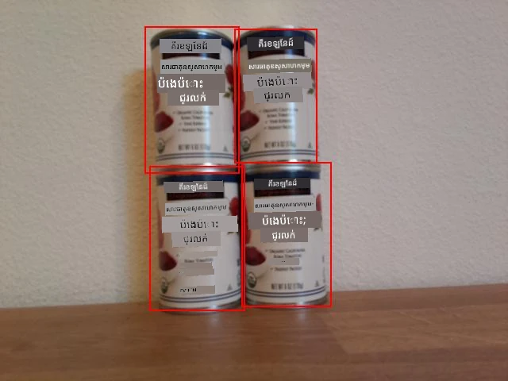

# រាប់ស្តុកពីឧបករណ៍ IoT របស់អ្នក - Wio Terminal

ការទំនាក់ទំនងរវាងការទស្សន៍ទាយនិងប្រអប់កាត់របស់វាអាចប្រើសម្រាប់រាប់ស្តុកក្នុងរូបភាពមួយ។

## រាប់ស្តុក



នៅក្នុងរូបភាពដែលបង្ហាញខាងលើ ប្រអប់កាត់តិចតួចមានការអតីតគ្នា។ ប្រសិនបើការអតីតគ្នានេះធំជាងនេះទៀត ប្រអប់កាត់អាចបង្ហាញវត្ថុដូចគ្នា។ ដើម្បីរាប់វត្ថុបានត្រឹមត្រូវ អ្នកត្រូវបដិសេធប្រអប់ដែលមានការអតីតគ្នា​យ៉ាងសំខាន់។

### បេសកកម្ម - រាប់ស្តុកដោយមិនគិតការអតីតគ្នា

1. បើកគម្រោង `stock-counter` របស់អ្នក ប្រសិនបើវាមិនទាន់បើក។

1. លើសពីមុខងារ `processPredictions` សូមបន្ថែមកូដដូចខាងក្រោម៖

    ```cpp
    const float overlap_threshold = 0.20f;
    ```

    នេះកំណត់ភាគរយនៃការអតីតគ្នាដែលអនុញ្ញាតមុនពេលប្រអប់កាត់ត្រូវបានចាត់ទុកថាជាវត្ថុដូចគ្នា។ 0.20 កំណត់ឱ្យមានការអតីតគ្នា ២០%។

1. ខាងក្រោមនេះ និងលើសពីមុខងារ `processPredictions` សូមបន្ថែមកូដដូចខាងក្រោមដើម្បីគណនាការអតីតគ្នាផ្ទៃក្រឡាចំណតពីរយ៉ាង៖

    ```cpp
    struct Point {
        float x, y;
    };

    struct Rect {
        Point topLeft, bottomRight;
    };

    float area(Rect rect)
    {
        return abs(rect.bottomRight.x - rect.topLeft.x) * abs(rect.bottomRight.y - rect.topLeft.y);
    }
     
    float overlappingArea(Rect rect1, Rect rect2)
    {
        float left = max(rect1.topLeft.x, rect2.topLeft.x);
        float right = min(rect1.bottomRight.x, rect2.bottomRight.x);
        float top = max(rect1.topLeft.y, rect2.topLeft.y);
        float bottom = min(rect1.bottomRight.y, rect2.bottomRight.y);
    
    
        if ( right > left && bottom > top )
        {
            return (right-left)*(bottom-top);
        }
        
        return 0.0f;
    }
    ```

    កូដនេះកំណត់ struct `Point` សម្រាប់ផ្ទុកចំណុចលើរូបភាព និង struct `Rect` សម្រាប់កំណត់ចំណតត្រង់ជាមួយសម្ងាត់ខាងលើឆ្វេង និងខាងក្រោមស្ដាំ។ បន្ទាប់មកកំណត់មុខងារ `area` ដើម្បីគណនាបរិមាណនៃចំណតលើផ្ទៃពីចំណុចខាងលើឆ្វេង និងខាងក្រោមស្ដាំ។

    បន្ទាប់មកវាកំណត់មុខងារ `overlappingArea` ដើម្បីគណនាបរិមាណផ្ទៃក្រឡាចំណតពីរយ៉ាងដែលអតីតគ្នា។ ប្រសិនបើវាមិនអតីតគ្នា វានឹងត្រឡប់តម្លៃ 0។

1. ខាងក្រោមមុខងារ `overlappingArea` សូមប្រកាសមុខងារមួយសម្រាប់បំលែងប្រអប់កាត់ទៅជា `Rect` ៖

    ```cpp
    Rect rectFromBoundingBox(JsonVariant prediction)
    {
        JsonObject bounding_box = prediction["boundingBox"].as<JsonObject>();
    
        float left = bounding_box["left"].as<float>();
        float top = bounding_box["top"].as<float>();
        float width = bounding_box["width"].as<float>();
        float height = bounding_box["height"].as<float>();
    
        Point topLeft = {left, top};
        Point bottomRight = {left + width, top + height};
    
        return {topLeft, bottomRight};
    }
    ```

    នេះយកការទស្សន៍ទាយពីឧបករណ៍រកវត្ថុ ដកប្រអប់កាត់ ហើយប្រើតម្លៃលើប្រអប់កាត់ដើម្បីកំណត់ចំណតត្រង់។ ផ្នែកខាងស្ដាំគឺគណនាចេញពីខាងឆ្វេងបូកជាមួយទទឹង។ ផ្នែកខាងក្រោមគឺគណនាចេញពីខាងលើបូកជាមួយកម្ពស់។

1. ការទស្សន៍ទាយទាំងអស់ត្រូវតែប្រៀបធៀបគ្នា ហើយប្រសិនបើការទស្សន៍ទាយពីរម៉ាត់មានការអតីតគ្នាបានលើសស្តង់ដារ មួយក្នុងចំណោមវានឹងត្រូវលុបចេញ។ ស្តង់ដារការអតីតគ្នាគឺជាភាគរយ ដូចនេះត្រូវកន្សោមជាមួយទំហំប្រអប់កាត់តូចជាងដើម្បីពិនិត្យមើលថាការអតីតគ្នានั้นលើសភាគរយដែលបានផ្តល់មកលើប្រអប់កាត់នោះ មិនមែនលើសភាគរយនៃរូបភាពទាំងមូលនោះទេ។ ចាប់ផ្តើមដោយលុបមាតិការបស់មុខងារ `processPredictions`។

1. បន្ថែមកូដដូចខាងក្រោមទៅម៉ាស៊ីន `processPredictions` ដែលទទេ៖

    ```cpp
    std::vector<JsonVariant> passed_predictions;

    for (int i = 0; i < predictions.size(); ++i)
    {
        Rect prediction_1_rect = rectFromBoundingBox(predictions[i]);
        float prediction_1_area = area(prediction_1_rect);
        bool passed = true;

        for (int j = i + 1; j < predictions.size(); ++j)
        {
            Rect prediction_2_rect = rectFromBoundingBox(predictions[j]);
            float prediction_2_area = area(prediction_2_rect);

            float overlap = overlappingArea(prediction_1_rect, prediction_2_rect);
            float smallest_area = min(prediction_1_area, prediction_2_area);

            if (overlap > (overlap_threshold * smallest_area))
            {
                passed = false;
                break;
            }
        }

        if (passed)
        {
            passed_predictions.push_back(predictions[i]);
        }
    }
    ```

    កូដនេះប្រកាសក្រុម `vector` សម្រាប់ផ្ទុកការទស្សន៍ទាយដែលមិនអតីតគ្នា។ វាប្តូររវល់តាមតួអក្សរទាំងអស់ បង្កើត `Rect` ពីប្រអប់កាត់។

    បន្ទាប់មកកូដនេះធ្វើរវល់លើការទស្សន៍ទាយនៅសល់ ចាប់ផ្តើមពីមួយបន្ទាប់ពីការទស្សន៍ទាយបច្ចុប្បន្ន។ វាជួយឱ្យការទស្សន៍ទាយមិនត្រូវបានប្រៀបធៀបច្រើនដង - បន្ទាប់ពី ១ និង ២ បានប្រៀបទៀបរួចហើយ គ្មានត្រូវប្រៀប ២ ជាមួយ ១ ទេ គ្រាន់តែជាមួយ ៣, ៤, ល។

    សម្រាប់គូរនីមួយៗនៃការទស្សន៍ទាយ កំណត់ផ្ទៃក្រឡាអតីតគ្នា។ បន្ទាប់មកវាប្រៀបធៀបនឹងបរិមាណប្រអប់កាត់តូចជាង - ប្រសិនបើការអតីតគ្នាឡើងលើសភាគរយដែលបានកំណត់នៃប្រអប់កាត់តូចជាង នោះការទស្សន៍ទាយនោះត្រូវបានគេចាត់ទុកថាមិនជោគជ័យ។ បន្ទាប់ពីការប្រៀបធៀបទាំងអស់ ការទស្សន៍ទាយដែលជោគជ័យ ត្រូវបានបន្ថែមចូលទៅក្នុងបណ្ណាល័យ `passed_predictions`។

    > 💁 វានេះជាវិធីសាមញ្ញមួយក្នុងការដកចេញអតីតគ្នា ព្រមទាំងលុបទៅនាំមួយនៅក្នុងគូអតីតគ្នា។ សម្រាប់កូដផលិតកម្ម អ្នកប្រហែលជាចង់បញ្ចូលហេដ្ឋារចនាសម្ព័ន្ធច្រើនជាងនេះ ដូចជាការពិចារណាអំពីការអតីតគ្នារវាងវត្ថុច្រើន ឬប្រសិនបើប្រអប់កាត់មួយនៅក្នុងជាក់ស្តែងដោយប្រអប់កាត់មួយផ្សេងទៀត។

1. បន្ទាប់ពីនេះ បន្ថែមកូដដូចខាងក្រោមដើម្បីផ្ញើព័ត៌មានលម្អិតនៃការទស្សន៍ទាយដែលជោគជ័យទៅកាន់ម៉ូនីទ័រស៊ីរីយ៉ាល់៖

    ```cpp
    for(JsonVariant prediction : passed_predictions)
    {
        String boundingBox = prediction["boundingBox"].as<String>();
        String tag = prediction["tagName"].as<String>();
        float probability = prediction["probability"].as<float>();

        char buff[32];
        sprintf(buff, "%s:\t%.2f%%\t%s", tag.c_str(), probability * 100.0, boundingBox.c_str());
        Serial.println(buff);
    }
    ```

    កូដនេះធ្វើរវល់តាមការទស្សន៍ទាយដែលជោគជ័យហើយបោះពុម្ពព័ត៌មានលម្អិតរបស់ពួកគេទៅម៉ូនីទ័រស៊ីរីយ៉ាល់។

1. ខាងក្រោមនេះ បន្ថែមកូដបោះពុម្ពចំនួនធាតុដែលបានរាប់ចូលម៉ូនីទ័រស៊ីរីយ៉ាល់៖

    ```cpp
    Serial.print("Counted ");
    Serial.print(passed_predictions.size());
    Serial.println(" stock items.");
    ```

    ព័ត៌មាននេះអាចត្រូវបានផ្ញើទៅសេវាកម្ម IoT ដើម្បីដាក់ឱ្យដឹង ប្រសិនបើកម្រិតស្តុកធ្លាក់ចុះ។

1. បញ្ចូលកូដ ហើយដំណើរក្រោយ។ កាំមរកម្រិតទៅវត្ថុលើទូរទឹក និងចុចប៊ូតុង C។ សាកល្បងកែប្រែតម្លៃ `overlap_threshold` ដើម្បីមើលការទស្សន៍ទាយដែលត្រូវបានបដិសេធ។

    ```output
    Connecting to WiFi..
    Connected!
    Image captured
    Image read to buffer with length 17416
    tomato paste:   35.84%  {"left":0.395631,"top":0.215897,"width":0.180768,"height":0.359364}
    tomato paste:   35.87%  {"left":0.378554,"top":0.583012,"width":0.14824,"height":0.359382}
    tomato paste:   34.11%  {"left":0.699024,"top":0.592617,"width":0.124411,"height":0.350456}
    tomato paste:   35.16%  {"left":0.513006,"top":0.647853,"width":0.187472,"height":0.325817}
    Counted 4 stock items.
    ```

> 💁 អ្នកអាចស្វែងរកកូដនេះនៅក្នុងថត [code-count/wio-terminal](../../../../../5-retail/lessons/2-check-stock-device/code-count/wio-terminal)។

😀 កម្មវិធីរាប់ស្តុករបស់អ្នកទទួលបានជោគជ័យ!

---

<!-- CO-OP TRANSLATOR DISCLAIMER START -->
**ការបដិសេធ**៖
ឯកសារនេះត្រូវបានបកប្រែដោយប្រើសេវាកម្មបកប្រែ AI [Co-op Translator](https://github.com/Azure/co-op-translator)។ ខណៈពេលដែលយើងខំប្រឹងប្រែងឱ្យមានភាពត្រឹមត្រូវ សូមយល់ព្រមថាការបកប្រែដោយស្វ័យប្រវត្តិអាចមានកំហុស ឬភាពមិនច្បាស់លាស់។ ឯកសារដើមដែលមាននៅក្នុងភាសាដើមគួរត្រូវបានគិតថាជាអនុគណន៍ដើម។ សម្រាប់ព័ត៌មានសំខាន់ៗ សូមផ្ដល់អនុសាសន៍ឱ្យប្រើការបកប្រែដោយអ្នកជំនាញមនុស្ស។ យើងខ្ញុំមិនទទួលខុសត្រូវចំពោះការយល់មិនគ្មានការយល់ដឹង ឬការបកប្រែខុសណាមួយដែលកើតមានពីការប្រើប្រាស់ការបកប្រែនេះឡើយ។
<!-- CO-OP TRANSLATOR DISCLAIMER END -->