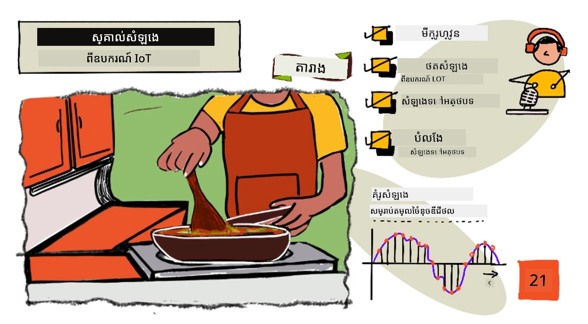
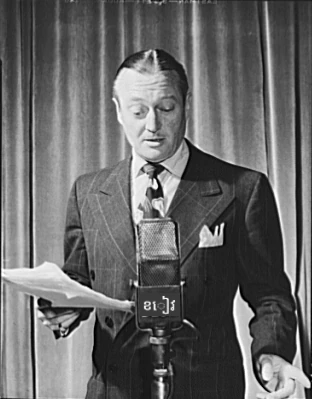
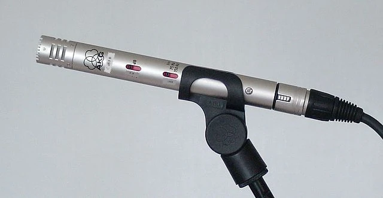
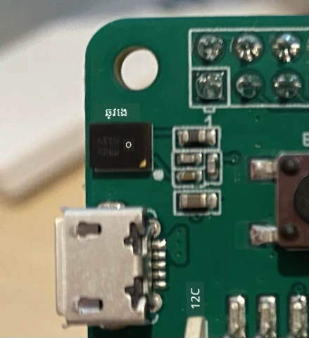

# ស្គាល់សំឡេងជាមួយឧបករណ៍ IoT



> រូបភាពសង្ខេបដោយ [Nitya Narasimhan](https://github.com/nitya)។ ចុចលើរូបភាពដើម្បីមើលជាបំណែកធំជាងនេះ។

វីដេអូនេះផ្តល់ជាសេចក្ដីទូទៅអំពីសេវាកម្មសំឡេង Azure ដែលជាប្រធានបទដែលនឹងត្រូវបានពិភាក្សានៅក្នុងមេរៀននេះ៖

[](https://www.youtube.com/watch?v=iW0Fw0l3mrA)

> 🎥 ចុចលើរូបភាពខាងលើដើម្បីមើលវីដេអូ

## សំណួរប្រលងមុនព្រឹត្តិប័ត្រ

[សំណួរប្រលងមុនព្រឹត្តិប័ត្រ](https://black-meadow-040d15503.1.azurestaticapps.net/quiz/41)

## សេចក្តីផ្ដើម

'Alexa, កំណត់ម៉ោង 12 នាទី'

'Alexa, ព័ត៌មានស្ថានភាពម៉ោង'

'Alexa, កំណត់ម៉ោង 8 នាទីដែលឈ្មោះ steam broccoli'

ឧបករណ៍ឆ្លាតកំពុងក្លាយជាឧបករណ៍ដែលត្រូវបានប្រើប្រាស់បន្ថែមឡើងរៀងរាល់ខែ។ មិនមែនត្រឹមតែជាប្រភេទនិពន្ធសម្លេងឆ្លាតៗដូចជា HomePods, Echos និង Google Homes ប៉ុណ្ណោះទេ ប៉ុន្តែមាននៅក្នុងទូរស័ព្ទដៃ, នาฬិកា និងក៏អាចមាននៅក្នុងគ្រឿងភ្លើងភ្លើង និងប្រព័ន្ធត្រួតពិនិត្យសីតុណ្ហភាពផងដែរ។

> 💁 ខ្ញុំមានយ៉ាងតិច 19 ឧបករណ៍នៅក្នុងផ្ទះ ដែលមានជំនួយការសំឡេង ហើយនេះគ្រាន់តែជាឧបករណ៍ដែលខ្ញុំដឹងប៉ុណ្ណោះ!

ការគ្រប់គ្រងដោយសំឡេងបង្កើនការចូលដំណើរការដោយអនុញ្ញាតឱ្យមនុស្សដែលមានចលនា​តិច មានអាចធ្វើអន្តរកម្មជាមួយឧបករណ៍។ មិនថាជាការជួបប្រទៈនឹងភាពពិបាកបេះដូងថេរដូចជា កើតមកគ្មានដៃ ទៅដល់ជំងឺបណ្តះបណ្តាលប៉ះពាល់ដូចជា ដៃអំបៅ គឺអ្នកកាន់ទំនិញ ឬក្មេងតូចៗ ក៏ដោយ ការស្ទើរក្នុងផ្ទះដោយប្រើសំលេងជំនួសដៃបើកផ្អើលផ្ទះ បើកការចូលដំណើរការមើលពីត្រីលើកដោះទឹងកូនពិតជាការកែលម្អតូចតែមានអត្ថប្រយោជន៍។

មួយក្នុងចំណោមការប្រើប្រាស់ច្រើនបំផុតសម្រាប់ជំនួយការសំឡេងគឺការកំណត់ម៉ោងចាប់ពេលផ especially មួយដោយរបារម៉ោងផ្ទះបាយ។ អាចកំណត់ម៉ោងចាប់ពេលច្រើនជាមួយសំឡេងរបស់អ្នកគឺជាការជួយល្អក្នុងផ្ទះបាយ — មិនចាំបាច់បញ្ឈប់កាត់លាបដូង, លាយសម្លឿ ឬសម្អាតដំឡុកភ្លៅ ដើម្បីប្រើម៉ោងចាប់ពេលដែលជរុញនៅផ្ទៃដៃ។

នៅក្នុងមេរៀននេះ អ្នកនឹងរៀនអំពីការសាងសង់ការទទួលស្គាល់សំឡេងទៅក្នុងឧបករណ៍ IoT។ អ្នកនឹងរៀនអំពីមីក្រូហ្វូនជា ឧបករណ៍កាន់ត្រួត សៀវភៅរបៀបថតសម្លេងពីមីក្រូហ្វូនភ្ជាប់ទៅឧបករណ៍ IoT និងរបៀបប្រើប្រាស់បញ្ញាសិប្បនិម្មិតដើម្បីបំលែងអ្វីដែលបានស្តាប់ទៅជាអត្ថបទ។ នៅក្នុងគម្រោងទាំងមូលនេះ អ្នកនឹងសាងសង់ម៉ោងចាប់ពេលថ្មីមានជំនាញឆ្លាតមានសមត្ថភាពកំណត់ម៉ោងដោយប្រើសំឡេងជាមួយភាសាច្រើន។

នៅក្នុងមេរៀននេះ យើងនឹងគ្របដណ្ដប់៖

* [មីក្រូហ្វូន](#មីក្រូហ្វូន)
* [ថតសម្លេងពីឧបករណ៍ IoT របស់អ្នក](#ថតសម្លេងពីឧបករណ៍-iot-របស់អ្នក)
* [សំឡេងទៅអត្ថបទ](#សំឡេងទៅអត្ថបទ)
* [បំលែងសំឡេងទៅអត្ថបទ](#បម្លែងសំឡេងទៅអក្សរ)

## មីក្រូហ្វូន

មីក្រូហ្វូនគឺជាឧបករណ៍កាន់ត្រួតអាណាឡុក ដែលបំលែងរលកសំឡេងទៅសញ្ញាអគ្គិសនី។ ការលន់ក្នុងខ្យល់បណ្តាលឱ្យធាតុក្នុងមីក្រូហ្វូនផ្លាស់ទីបន្តិចបន្តួច ហើយហ្វិនពីនេះបណ្តាលឱ្យមានការប្រែប្រួលតូចតាចក្នុងសញ្ញាអគ្គិសនី។ ការប្រែប្រួលទាំងនេះត្រូវបានបង្រួមបន្ទាត់ដើម្បីបង្កើតការផ្ទុកអគ្គិសនី។

### ប្រភេទមីក្រូហ្វូន

មីក្រូហ្វូនមានប្រភេទគ្រប់ប្រភេទដូចខាងក្រោម៖

* ថ្មង្គត់ (Dynamic) - មីក្រូហ្វូនថ្មង្គត់មានម៉ាញេទិចភ្ជាប់ទៅឌាយាហ្វ្រាមដែលចល័ត ដែលផ្លាស់ទីនៅក្នុងខ្សែបង្ហូរថ្មបង្កើតចរន្តអគ្គិសនី។ នេះគឺផ្ទុយទៅវិញនឹងរោទ៍ភ្លេងភាគច្រើន ដែលប្រើចរន្តអគ្គិសនីដើម្បីចល័តម៉ាញេទិចនៅក្នុងខ្សែបង្ហូរថ្មផ្លាស់ទីឌាយាហ្វ្រាមដើម្បីបង្កើតសំឡេង។ នេះមានន័យថារោទ៍ភ្លេងអាចប្រើជាមីក្រូហ្វូនថ្មង្គត់ ហើយមីក្រូហ្វូនថ្មង្គត់អាចប្រើជារោទ៍ភ្លេង។ នៅក្នុងឧបករណ៍ដូចជា ឧបករណ៍ទំនាក់ទំនងផ្សេងៗ ដែលអ្នកប្រើអាចស្ដាប់ ឬនិយាយ ប៉ុន្តែមិនទាំងពីរនោះទេ ឧបករណ៍មួយអាចដំណើរការជាទាំងរោទ៍ភ្លេង និងមីក្រូហ្វូន។

    មីក្រូហ្វូនថ្មង្គត់មិនចាំបាច់មានថាមពលដើម្បីដំណើរការ សញ្ញាអគ្គិសនីត្រូវបានបង្កើតពេញលេញពីមីក្រូហ្វូន។

    

* របារមាត្រ (Ribbon) - មីក្រូហ្វូនរបារមាត្រដូចជាមីក្រូហ្វូនថ្មង្គត់ លុះត្រាតែវាផ្ទុះមានរបារមាត្រជាធាតុដែកជំនួសឌាយាហ្វ្រាម។ របារនេះផ្លាស់ទីនៅក្នុងវាលម៉ាញេទិចបង្កើតចរន្តអគ្គិសនី។ ដូចជាមីក្រូហ្វូនថ្មង្គត់ មីក្រូហ្វូនរបារមាត្រមិនចាំបាច់មានថាមពលដើម្បីដំណើរការ។

    

* កុងដិនសែ (Condenser) - មីក្រូហ្វូនកុងដិនសែមានឌាយាហ្វ្រាមដែកស្រាល និងផ្ទាំងក្រោយដែកថេរ។ វាដាក់អគ្គិសនីទៅកាន់ទាំងពីរនេះ ហើយក្នុងពេលឌាយាហ្វ្រាមធ្វើការលន់ព័ត៌មានបន្ទុកស្ទះរវាងផ្ទាំងទាំងពីរប្រែប្រួលបង្កើតសញ្ញា។ មីក្រូហ្វូនកុងដិនសែចាំបាច់មានថាមពលដើម្បីដំណើរការ - ហៅថា *ថាមពលខ្យល់ក្នុង* (Phantom power)។

    

* MEMS - ប្រព័ន្ធមីក្រូអេឡិចត្រូម៉េកាញិច ឬ MEMS គឺជាមីក្រូហ្វូននៅលើចំពោះផ្ទាល់។ វាមានឌាយាហ្វ្រាមប្រតិកម្មសំពាធដែលបានសោតក្នុងមែក្សិលខរ និងដំណើរការដូចមីក្រូហ្វូនកុងដិនសែ។ មីក្រូហ្វូនទាំងនេះអាចតូចតាច ហើយភ្ជាប់ជាប់នឹងសៀគ្វី។

    

    ក្នុងរូបភាពខាងលើ ចេញពីឈ្មោះឈប់ **LEFT** គឺជាមីក្រូហ្វូន MEMS មានឌាយាហ្វ្រាមតូចជាងមួយមីល្លிம៉ែត្រ។

✅ ស្រាវជ្រាវមួយ៖ មីក្រូហ្វូនដែលអ្នកមាននៅជុំវិញអ្នកមានអ្វីខ្លះ — មួយនៅក្នុងកុំព្យូទ័រ, ទូរស័ព្ទ, កាសស្តាប់ឬឧបករណ៍ផ្សេងទៀត? ប្រភេទមីក្រូហ្វូនខ្លះដែលពួកវាជាតើមាន?

### សម្លេងឌីជីថល

សម្លេងគឺជាសញ្ញាអាណាឡុកដែលផ្ទុកព័ត៌មានលម្អិតមិនធំឡើង។ ដើម្បីបំលែងសញ្ញានេះទៅឌីជីថល យើងត្រូវតែធ្វើការគំរូសម្លេងជាច្រើនពាន់ដងក្នុងមួយវិនាទី។

> 🎓 ការគំរូសម្លេងគឺជាការបំលែងសញ្ញាសម្លេងទៅជាតម្លៃឌីជីថលមួយដែលតំណាងសញ្ញានៅពេលនោះ។


សម្លេងឌីជីថលត្រូវបានគំរូសដោយប្រើ Pulse Code Modulation ឬ PCM។ PCM បង្ហាញពីការអានវ៉ុលតេស្យុងនៃសញ្ញា ហើយជ្រើសរើសតម្លៃឌីជីថលដែលនៅជិតបំផុតទៅវ៉ុលតេស្យុងនោះដោយប្រើទំហំហាក់កំណត់រួចហើយ។

> 💁 អ្នកអាចគិតថា PCM គឺជាការបំលែងសញ្ញាអាណាឡុកទៅឌីជីថល ដែលមានទម្រង់ដូចជាការប្រើប្រាស់ Pulse Width Modulation ឬ PWM (PWM ត្រូវបានពិភាក្សាក្នុង [មេរៀន 3 នៃគម្រោង Getting Started](../../../1-getting-started/lessons/3-sensors-and-actuators/README.md#pulse-width-modulation))។ PCM គឺជាការបំលែងសញ្ញាអាណាឡុកទៅឌីជីថល ខណៈដែល PWM គឺជាការបំលែងសញ្ញាឌីជីថលទៅឱ្យសញ្ញាអាណាឡុក។

ឧទាហរណ៍ សេវាកម្មចាក់ម្យូសិចបំលាយភ្ជាប់ភាគច្រើនផ្តល់ជូនសម្លេង 16-ប៊ីត ឬ 24-ប៊ីត។ នេះមានន័យថាពួកគេបំលែងវ៉ុលតេស្យុងទៅជាតម្លៃដែលសមទៅជាចំនួនគត់ទំហំ 16-ប៊ីត ឬ 24-ប៊ីត។ សម្លេង 16-ប៊ីត មានតម្លៃរវាង -32,768 ដល់ 32,767, សម្លេង 24-ប៊ីត មានតម្លៃក្នុងជួរ −8,388,608 ដល់ 8,388,607។ ចំនួនប៊ីត越ច្រើន គំរូ越ជិតត្រឹមត្រូវទៅនឹងសំលេងដែលត្រូវបានស្តាប់។

> 💁 អ្នកអាចបានស្ដាប់អំពីសម្លេង 8-ប៊ីត ដែលត្រូវបានហៅថា LoFi។ នេះជាសម្លេងគំរូដែលប្រើតែ 8-ប៊ីត ប៉ុណ្ណោះ ដែលមានតម្លៃ -128 ដល់ 127។ សម្លេងកុំព្យូទ័រដំបូងគេមានកំណត់ត្រឹមតែ 8-ប៊ីត ដោយសារជួរពិរុទ្ធឧបករណ៍ ហេតុនេះហើយបានឃើញសម្លេង LoFi នៅក្នុងហ្គេមចាស់ៗ។

គំរូសម្លេងទាំងនេះត្រូវបានយកមកជាច្រើនពាន់ដងក្នុងមួយវិនាទី ប្រើអត្តបទគំរូសម្លេងកំណត់ជាក់លាក់ទទួលបានជា KHz (ពាន់ដងក្នុងមួយវិនាទី)។ សេវាកម្មចាក់ម្យូសិចភាគច្រើនប្រើ 48KHz សម្រាប់សម្លេងភាគច្រើន ប៉ុន្តែសម្លេង “មិនបាត់បង់គុណភាព” មានប្រើដល់ 96KHz ឬ אפילו 192KHz។ អត្រាគំរូ越ខ្ពស់ ការស្តាប់越ជិតនឹងដើម ត្រូវបានពិភាក្សាថា មនុស្សអាចដឹងខុសគ្នាឫអត់នៅលើ 48KHz។

✅ ស្រាវជ្រាវមួយ៖ ប្រសិនបើអ្នកប្រើសេវាកម្មចាក់ម្យូសិច បើកអត្រាគំរូ និងទំហំដែលវា​ប្រើ? ប្រសិនបើអ្នកប្រើ CD អត្រាគំរូ និងទំហំសំឡេង CD ជាអ្វី?

មានទម្រង់ផ្សេងៗជាច្រើនសម្រាប់ទិន្នន័យសម្លេង។ អ្នកប្រហែលជាហាក់ដឹងពីឯកសារ mp3 — ទិន្នន័យសម្លេងដែលបានបង្រួមទំហំ ដើម្បីឲ្យតូចប៉ុណ្ណោះដោយមិនបាត់បង់គុណភាព។ សម្លេងមិនបានបង្រួមភាគច្រើនត្រូវបានរក្សាទុកជាឯកសារ WAV ដែលមាន 44 បៃនៃព័ត៌មានក្បាល (header) បន្ទាប់មកជាទិន្នន័យសម្លេងដើម។ ក្បាលឯកសារលើស្រួលមាស្តែងអត្រាគំរូសម្លេង (ឧទាហរណ៍ 16000 សម្រាប់ 16KHz) និងទំហំគំរូ (16 សម្រាប់ 16-ប៊ីត) និងចំនួនប៉ុស្តិ៍សំឡេង។ បន្ទាប់ពីក្បាលឯកសារ WAV មានទិន្នន័យសម្លេងដើម។

> 🎓 ប៉ុស្តិ៍សំឡេង​មានន័យថាអ្វីទៅ? គឺជាចំនួនចរនៅសម្លេងផ្សេងៗគ្នាដែលបង្កើតសម្លេង។ ឧទាហរណ៍ សម្លេងស្ដេរ៉្យូមានប៉ុស្តិ៍ 2 សម្រាប់ស្តាំ និងឆ្វេង។ សម្លេងឆ្លង 7.1 សម្រាប់ប្រព័ន្ធរោងចក្រភ្លេងផ្ទះមានប៉ុស្តិ៍ 8។

### ទំហំទិន្នន័យសម្លេង

ទិន្នន័យសម្លេងធំជាងគេ។ ឧទាហរណ៍ យកសម្លេងមិនបានបង្រួម 16-ប៊ីតនៅ 16KHz (អត្រាមួយល្អសម្រាប់ប្រើជាមួយម៉ូដែលសំឡេងទៅអត្ថបទ) ចំណាយទំហំ 32KB ក្នុងមួយវិនាទី៖

* 16-ប៊ីតមានន័យថា 2 បៃនក្នុងមួយគំរូ (1 បៃមាន 8 ប៊ីត)។
* 16KHz គឺ 16,000 គំរូក្នុងមួយវិនាទី។
* 16,000 x 2 បៃ = 32,000 បៃក្នុងមួយវិនាទី។

នេះហាក់ដូចជាទិន្នន័យតិច តែបើអ្នកប្រើកុងត្រូលឡែរក្រោមមានកំណត់ក្នុងសម័យចងចាំ នោះវាអាចជាពិចារណាលំបាក។ ឧទាហរណ៍ Wio Terminal មានកំណត់ក្នុងសម័យចងចាំ 192KB ប៉ុន្តែជាចាំបាច់ទុកកូដកម្មវិធី និងអថេរ។ ប្រសិនបើកូដកម្មវិធីតូចខ្លាំងក៏មិនអាចថតសំឡេងបានលើស 5 វិនាទីទេ។

កុងត្រូលឡែរអាចចូលប្រើស្តូរ៉េស្យ្យុងបន្ថែម​ដូចជា កាត SD ឬ Flash memory។ នៅពេលសាងសង់ឧបករណ៍ IoT ដែលថតសំឡេង ជំនាញគឺត្រូវដឹងថាមិនត្រឹមតែមានស្តូរ៉េស្យ្យុងបន្ថែម ប៉ុន្តែ​កូដត្រូវសរសេរសម្លេងថតពីមីក្រូហ្វូនទៅស្តូរ៉េស្យុងនោះភ្លាមៗ ហើយពេលផ្ញើទៅពពក អ្នកផ្ញើតាមការស្នើសុំបណ្តាញពីស្តូរ៉េស្យុង។ ដូច្នេះ អ្នកអាចជៀសវាងការកម្តៅចងចាំដោយរក្សាទិន្នន័យសម្លេងមួយទាំងមូលនៅក្នុងចងចាំ។

## ថតសម្លេងពីឧបករណ៍ IoT របស់អ្នក

ឧបករណ៍ IoT របស់អ្នកអាចភ្ជាប់ទៅមីក្រូហ្វូនដើម្បីថតសម្លេង សំរាប់បំលែងទៅអត្ថបទ។ ក៏អាចភ្ជាប់ទៅរោទ៍ភ្លេងដើម្បីបញ្ចេញសម្លេង។ នៅក្នុងមេរៀនក្រោយ នេះនឹងប្រើសម្រាប់ផ្តល់មតិយោបល់សម្លេង ប៉ុន្តែមានប្រយោជន៍ក្នុងការតំលើងរោទ៍ភ្លេងឥលូវនេះដើម្បីសាកល្បងមីក្រូហ្វូន។

### ភារកិច្ច - កំណត់រចនាសម្ព័ន្ធមីក្រូហ្វូន និងរោទ៍ភ្លេង

ធ្វើតាមមគ្គុទេសក៍ដែលសមរម្យសម្រាប់ការកំណត់រចនាសម្ព័ន្ធមីក្រូហ្វូន និងរោទ៍ភ្លេងសម្រាប់ឧបករណ៍ IoT របស់អ្នក៖

* [Arduino - Wio Terminal](wio-terminal-microphone.md)
* [កុំព្យូទ័របន្ទាប់បន្សំ - Raspberry Pi](pi-microphone.md)
* [កុំព្យូទ័របន្ទាប់បន្សំ - ឧបករណ៍មិចស្ទិក](virtual-device-microphone.md)

### ភារកិច្ច - ថតសម្លេង

ធ្វើតាមមគ្គុទេសក៍ដែលសមរម្យសម្រាប់ថតសម្លេងនៅលើឧបករណ៍ IoT របស់អ្នក៖

* [Arduino - Wio Terminal](wio-terminal-audio.md)
* [កុំព្យូទ័របន្ទាប់បន្សំ - Raspberry Pi](pi-audio.md)
* [កុំព្យូទ័របន្ទាប់បន្សំ - ឧបករណ៍មិចស្ទិក](virtual-device-audio.md)

## សំឡេងទៅអត្ថបទ

សំឡេងទៅអត្ថបទ ឬការទទួលស្គាល់សំឡេង គឺប្រើប្រាស់ AI ដើម្បីបំលែងពាក្យក្នុងសញ្ញាសំឡេងទៅជាអត្ថបទ។

### ម៉ូដែលទទួលស្គាល់សំឡេង

ដើម្បីបំលែងសំឡេងទៅអត្ថបទ គំរូសម្លេង ពីសញ្ញាសំឡេងត្រូវបានក្រុមចូលគ្នា ហើយបញ្ចូលទៅម៉ូដែលម៉ាស៊ីនរៀនមួយជាមួយ បណ្ដាញប្រសិទ្ធភាពម្ដងម្ដង (Recurrent Neural Network - RNN)។ នេះជាប្រភេទម៉ូដែលបណ្តុះបណ្តាលម៉ាស៊ីនដែលអាចប្រើទិន្នន័យមុនដើម្បីធ្វើសំរុងលើទិន្នន័យចូលមកថ្មី។ ឧទាហរណ៍ RNN អាចស្គាល់ក្រុមសម្លេងមួយថាជាសម្លេង 'Hel' ហើយពេលទទួលក្រុមសម្លេងបន្ទាប់ដែលគិតថាជាសម្លេង 'lo' វាអាចប្រមាណពីរនេះជាផ្នែកមួយនៃពាក្យ 'Hello' ហើយជ្រើសរើសវាជាការបញ្ចប់។

ម៉ូដែល ML តែងតាំងទទួលទិន្នន័យទំហំដូចគ្នានៅគ្រប់ពេល។ អ្នកបានបង្កើតម៉ូដែលចំណាត់ថ្នាក់រូបភាពក្នុងមេរៀនមួយមុន ដែលកែទំហំរូបភាពទៅទំហំថេរមុនពេលដំណើរការ។ ម៉ូដែលសំឡេងក៏ដូចគ្នា គឺត្រូវដំណើរការទិន្នន័យសំឡេងទំហំថេរដូចគ្នា។ ម៉ូដែលសំឡេងត្រូវតែអាចបញ្ចូលលទ្ធផលពីការព្យាករណ៍ជាច្រើន ដើម្បីទទួលបានចម្លើយ ដើម្បីអាចឆ្លើយតបចំពោះពាក្យដូចជា 'Hi' និង 'Highway' ឬ 'flock' និង 'floccinaucinihilipilification'។

ម៉ូដែលសំឡេងក៏មានជំនាញខ្ពស់គ្រប់គ្រងតាម context ហើយអាចកែពាក្យដែលវាស្គាល់ពេលមានសំឡេងបន្ថែម។ ឧទាហរណ៍ ប្រសិនបើអ្នកនិយាយថា "I went to the shops to get two bananas and an apple too", អ្នកប្រើពាក្យបីដែលសម្លេងដូចគ្នា ប៉ុន្តែសរសេរខុសគ្នា - to, two និង too។ ម៉ូដែលសំឡេងអាចយល់ context ហើយប្រើការបញ្ចេញអក្សរដែលត្រឹមត្រូវ។

> 💁 សេវាសំឡេងខ្លះអនុញ្ញាតឲ្យប្ដូរតម្លាំង ដើម្បីឲ្យវាធ្វើការល្អក្នុងបរិយាកាសមានសំយោគដូចជាគំរោងឧស្សាហកម្ម ឬពាក្យពិសេសនៅក្នុងឧស្សាហកម្ម ដូចជាឈ្មោះគីមី។ ការប្ដូរនេះត្រូវបានបណ្តុះបណ្តាលដោយផ្តល់សម្លេងគំរូ និងការបំលែងអត្ថបទ ហើយធ្វើការបណ្តុះបណ្តាលបន្ត (transfer learning) ដូចជាការបង្រៀនម៉ូដែលចំណាត់ថ្នាក់រូបភាពជាមួយរូបភាពតិចៗនៅក្នុងមេរៀនមុន។

### សេចក្ដីផ្ទាល់ខ្លួន

ពេលប្រើសំឡេងទៅអត្ថបទនៅក្នុងឧបករណ៍ IoT សម្រាប់ប្រើប្រាស់ប្រជាជនទូទៅ សេចក្ដីផ្ទាល់ខ្លួនមានសារៈសំខាន់ខ្លាំងណាស់។ ឧបករណ៍ទាំងនេះស្តាប់សម្លេងជាបន្តរួចមកហើយ ដូច្នេះជាអ្នកប្រើប្រាស់ អ្នកមិនចង់ឲ្យអ្វីដែលអ្នកនិយាយត្រូវបានផ្ញើទៅពពក ហើយបំលែងទៅជាអត្ថបទ។ មិនត្រឹមតែបញ្ចេញបណ្តាញអ៊ីនធឺណិតច្រើនទេ តែក៏មានបញ្ហាសិទ្ធិផ្ទាល់ខ្លួនធំដុំ កាន់តែពេលមេកានិកឧបករណ៍ឆ្លាតប្រើជារឿយៗជ្រើសរើសសម្លេងសម្រាប់ [មនុស្សពិនិត្យទ្រង់ទ្រាយផ្ទៀងផ្ទាត់ជាមួយអត្ថបទដែលបង្កើតឡើង ដើម្បីជួយធ្វើម៉ូដែលឲ្យប្រសើរឡើង](https://www.theverge.com/2019/4/10/18305378/amazon-alexa-ai-voice-assistant-annotation-listen-private-recordings)។
អ្នកចង់ឲ្យឧបករណ៍ឆ្លាតវៃរបស់អ្នកផ្ញើសំឡេងទៅកាន់ពពកសម្រាប់ដំណើរការ ខណៈពេលអ្នកកំពុងប្រើវា មិនមែននៅពេលវាស្គាល់សំឡេងនៅក្នុងផ្ទះរបស់អ្នក ដែលអាចរួមបញ្ចូលការជួបប្រជុំឯកជនឬអន្តរកម្មស្និទ្ធស្នាល។ របៀបដែលឧបករណ៍ឆ្លាតវៃភាគច្រើនដំណើរការជាមួយនឹង *ពាក្យរោទិ៍* គឺជាពាក្យសំខាន់ដូចជា "Alexa", "Hey Siri", ឬ "OK Google" ដែលជា ការលើកឱ្យឧបករណ៍ 'ភ្ញាក់' ហើយស្តាប់អ្វីដែលអ្នកកំពុងនិយាយរហូតដល់វាព្យាបាលឃើញការផ្អាកអារម្មណ៍ក្នុងសន្ទនារបស់អ្នក ដែលបង្ហាញថាអ្នកបានបញ្ចប់និយាយទៅឧបករណ៍។

> 🎓 ការរកឃើញពាក្យរោទិ៍ក៏ត្រូវបានហៅថា *ការស្វែងរកពាក្យសំខាន់* ឬ *ការទទួលស្គាល់ពាក្យសំខាន់* ផងដែរ។

ពាក្យរោទិ៍ទាំងនេះត្រូវបានរកឃើញនៅលើឧបករណ៍ មិនមែននៅក្នុងពពកឡើយ។ ឧបករណ៍ឆ្លាតវៃទាំងនេះមានគំរូ AI តូចៗដែលដំណើរការលើឧបករណ៍ ហើយស្តាប់ពាក្យរោទិ៍ ហើយពេលវាត្រូវបានរកឃើញ នឹងចាប់ផ្តើមផ្ញើសំឡេងទៅពពកសម្រាប់ការទទួលស្គាល់។ គំរូទាំងនេះមានភាពឯកទេសខ្លាំង ហើយគ្រាន់តែស្តាប់ពាក្យរោទិ៍តែប៉ុណ្ណោះ។

> 💁 ក្រុមហ៊ុនបច្ចេកវិទ្យាមួយចំនួនកំពុងបន្ថែមភាពឯកជនច្រើនទៀតទៅឧបករណ៍របស់ពួកគេ ហើយធ្វើការបម្លែងសំឡេងទៅអក្សរមួយចំនួននៅលើឧបករណ៍ផ្ទាល់។ Apple បានប្រកាសថា ជាផ្នែកមួយនៃការអាប់ដេត iOS និង macOS របស់ពួកគេឆ្នាំ 2021 ពួកគេនឹងគាំទ្រការបម្លែងសំឡេងទៅអក្សរនៅលើឧបករណ៍ ដើម្បីអាចដោះស្រាយសំណើគ្មានការទាក់ទងពពក។ វាជារឿងអំណោយផលពីមានមុខងារប្រមូលកម្លាំងក្នុងឧបករណ៍ដែលអាចដំណើរការគំរូ ML។

✅ តើយើងគិតអំពីផលប៉ះពាល់នៃភាពឯកជន និងគោលមេត្តាត្រឹមត្រូវនៃការផ្ទុកសំឡេងដែលផ្ញើទៅពពកយ៉ាងដូចម្តេច? តើសំឡេងនេះគួរត្រូវបានផ្ទុកឬ? បើមាន តើគួរត្រូវបានផ្ទុកដោយរបៀបណា? តើអ្នកគិតថាការប្រើប្រាស់កំណត់ត្រាដើម្បីបម្រើការត្រួតពិនិត្យច្បាប់ជាការប្តូរទុកល្អសម្រាប់ការបាត់បង់ភាពឯកជនទេឬ?

ការរកឃើញពាក្យរោទិ៍សម្រាប់ធម្មតាប្រើបច្ចេកទេសមួយហៅថា TinyML ដែលជាការបម្លែងគំរូ ML អោយអាចដំណើរការលើម៉ៃក្រូកុងត្រូលឡឺ។ គំរូទាំងនោះមានទំហំតូច និងប្រើថាមពលតិចខ្លាំងក្នុងការដំណើរការ។

ដើម្បីជៀសវាងភាពស្មុគស្មាញនៃការបង្រៀន និងប្រើគំរូពាក្យរោទិ៍ ឧបករណ៍ម៉ោងចិត្តឆ្លាតដែលអ្នកកំពុងបង្កើតនៅក្នុងមេរៀននេះ នឹងប្រើប៊ូតុងក្នុងការបើកការទទួលស្គាល់សំឡេង។

> 💁 ប្រសិនបើអ្នកចង់សាកល្បងបង្កើតគំរូការរកឃើញពាក្យរោទិ៍ដើម្បីដំណើរការលើ Wio Terminal ឬ Raspberry Pi សូមពិនិត្យមើលមេរៀន [ការឆ្លើយតបទៅសំឡេងរបស់អ្នកដោយ Edge Impulse](https://docs.edgeimpulse.com/docs/responding-to-your-voice)។ ប្រសិនបើអ្នកចង់ប្រើកុំព្យូទ័ររបស់អ្នក ដើម្បីធ្វើការនេះ អ្នកអាចសាកល្បង [ការចាប់ផ្តើមនូវ Keyword ផ្ទាល់ខ្លួននៅលើឯកសារ Microsoft](https://docs.microsoft.com/azure/cognitive-services/speech-service/keyword-recognition-overview?WT.mc_id=academic-17441-jabenn)។

## បម្លែងសំឡេងទៅអក្សរ


ដូចជាការបែងចែករូបភាពក្នុងគម្រោងមុនៗ មានសេវាកម្ម AI ដែលត្រូវបានកសាងទុករួចដើម្បីទទួលយកសំឡេងជាឯកសារ និងបម្លែងវាទៅជាអក្សរ។ សេវាមួយដូចនេះគឺសេវាកម្មសំឡេង ដែលជាផ្នែកមួយនៃសេវាកម្មផ្តល់ចំណេះដឹង (Cognitive Services) ដែលមានសេវាកម្ម AI ដែលបានកសាងរួច អ្នកអាចប្រើប្រាស់ក្នុងកម្មវិធីរបស់អ្នក។

### ភារកិច្ច - កំណត់រចនាសម្ព័ន្ធធនធាន AI សំឡេង

1. បង្កើតក្រុមធនធានសម្រាប់គម្រោងនេះឈ្មោះ `smart-timer`

1. ប្រើពាក្យបញ្ជាខាងក្រោមដើម្បីបង្កើតធនធានសំឡេងមួយដែលមិនគិតថ្លៃ៖

    ```sh
    az cognitiveservices account create --name smart-timer \
                                        --resource-group smart-timer \
                                        --kind SpeechServices \
                                        --sku F0 \
                                        --yes \
                                        --location <location>
    ```

    ជំនួស `<location>` ជាមួយទីតាំងដែលអ្នកបានប្រើនៅពេលបង្កើតក្រុមធនធាន។

1. អ្នកត្រូវការកូនសោ API ដើម្បីចូលដំណើរការធនធានសំឡេងពីកូដរបស់អ្នក។ ប្រតិបត្តិភាគបញ្ជាខាងក្រោមដើម្បីទទួលបានកូនសោ៖

    ```sh
    az cognitiveservices account keys list --name smart-timer \
                                           --resource-group smart-timer \
                                           --output table
    ```

    ច្ប黠ចំពោះចំលងកូនសោមួយ។  

### ភារកិច្ច - បម្លែងសំឡេងទៅអក្សរ

ធ្វើការណាត់តាមមគ្គុទេសក៍ដែលពាក់ព័ន្ធដើម្បីបម្លែងសំឡេងទៅអក្សរលើឧបករណ៍ IoT របស់អ្នក៖

* [Arduino - Wio Terminal](wio-terminal-speech-to-text.md)
* [កុំព្យូទ័រជាមួយថាបណ្តាញមួយ - Raspberry Pi](pi-speech-to-text.md)
* [កុំព្យូទ័រជាមួយថាបណ្តាញមួយ - ឧបករណ៍វីរុស](virtual-device-speech-to-text.md)

---

## 🚀 챌린지

ការទទួលស្គាល់សំឡេងបានមានរយៈពេលយូរ និងកំពុងបន្តអភិវឌ្ឍ។ ស្រាវជ្រាវសមត្ថភាពបច្ចុប្បន្ន និងប្រៀបធៀបទ្រឹស្តីប្រែប្រួលរបស់បច្ចេកវិទ្យានេះក្នុងរយៈពេលកន្លងមក រួមទាំងមើលចំណុចភាពត្រឹមត្រូវរបស់ការបកប្រែដោយម៉ាស៊ីនប្រៀបធៀបទៅជាមួយមនុស្ស។

តើអ្នកគិតថា អនាគតនៃការទទួលស្គាល់សំឡេងនឹងទៅកាន់ទិសដៅណា?

## សំណួរប្រឡងក្រោយមេរៀន

[សំណួរប្រឡងក្រោយមេរៀន](https://black-meadow-040d15503.1.azurestaticapps.net/quiz/42)

## ការពិនិត្យឡើងវិញ & សិក្សាទាំងអស់ដោយខ្លួនឯង

* អានអំពីប្រភេទម៉ាញ៉េទ្រិចផ្សេងៗ និងរបៀបដំណើរការរបស់ពួកវានៅលើអត្ថបទ [តើខុសគ្នារវាងម៉ាញ៉េទ្រិចឌីណាមិច និងម៉ាញ៉េទ្រិចកុងដែលន័រម្យិនមានអ្វីខ្លះនៅ Musician's HQ](https://musicianshq.com/whats-the-difference-between-dynamic-and-condenser-microphones/)។
* អានបន្ថែមអំពីសេវាកម្មសំឡេងក្នុងសេវាកម្មផ្តល់ចំណេះដឹងនៅលើ [ឯកសារសេវាកម្មសំឡេងនៅ Microsoft Docs](https://docs.microsoft.com/azure/cognitive-services/speech-service/?WT.mc_id=academic-17441-jabenn)
* អានអំពីការស្វែងរកពាក្យសំខាន់នៅលើ [ឯកសារទទួលស្គាល់ពាក្យសំខាន់នៅ Microsoft Docs](https://docs.microsoft.com/azure/cognitive-services/speech-service/keyword-recognition-overview?WT.mc_id=academic-17441-jabenn)

## កិច្ចការរកស៊ី

[](assignment.md)

---

<!-- CO-OP TRANSLATOR DISCLAIMER START -->
**ការបដិសេធ**៖  
ឯកសារនេះត្រូវបានបរាជ័យដោយប្រើសេវាកម្មបកប្រែ AI [Co-op Translator](https://github.com/Azure/co-op-translator)។ ខណៈពួកយើងខិតខំប្រឹងប្រែងសម្រាប់ភាពត្រឹមត្រូវ សូមជ្រាបថាការបកប្រែដោយស្វ័យប្រវត្តិក្នុងនេះអាចមានកំហុសឬមិនត្រឹមត្រូវ។ ឯកសារដើមនៅក្នុងភាសាទីតាំងរបស់វាគួរត្រូវបានគេពិចារណាជាផលិតផលផ្លូវការ។ សម្រាប់ព័ត៌មានសំខាន់ៗ សូមផ្តល់អាទិភាពចំពោះការបកប្រែដោយមនុស្សជំនាញ។ យើងមិនមានការទទួលខុសត្រូវចំពោះការយល់ច្រឡំ ឬការបកប្រែខុសប៉ុន្មានដែលកើតឡើងពីការប្រើប្រាស់ការបកប្រែនេះឡើយ។
<!-- CO-OP TRANSLATOR DISCLAIMER END -->